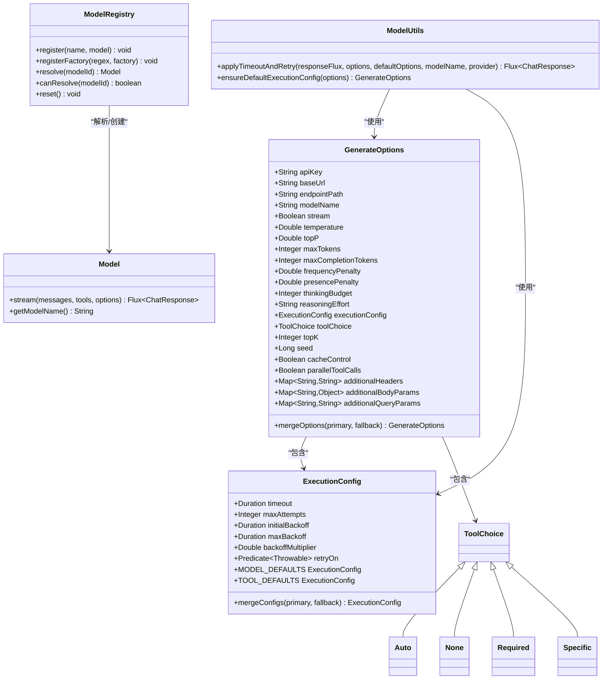
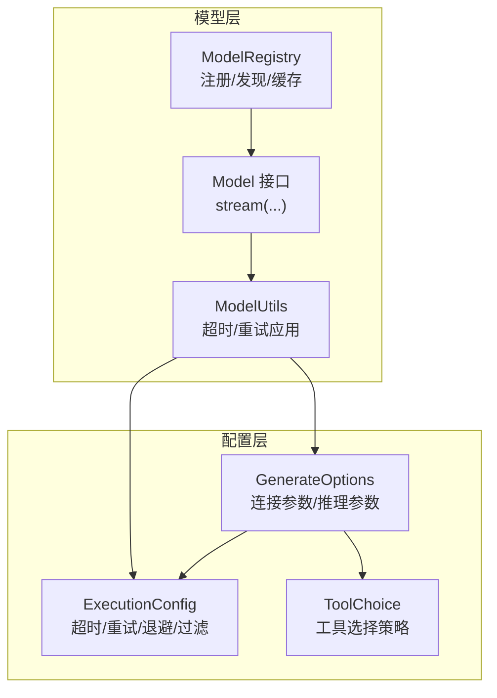
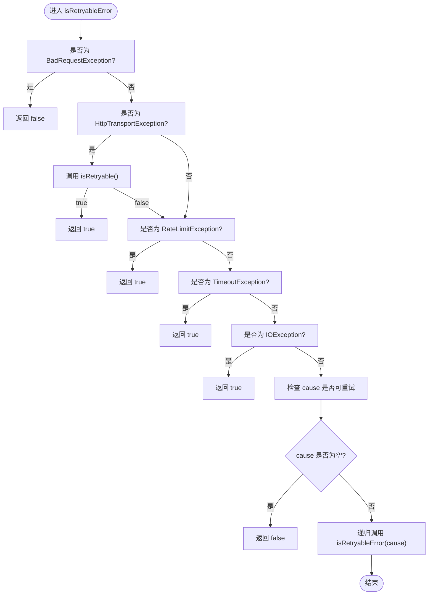
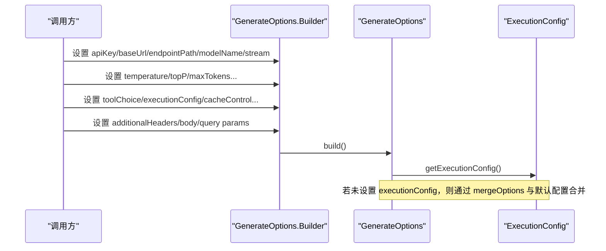
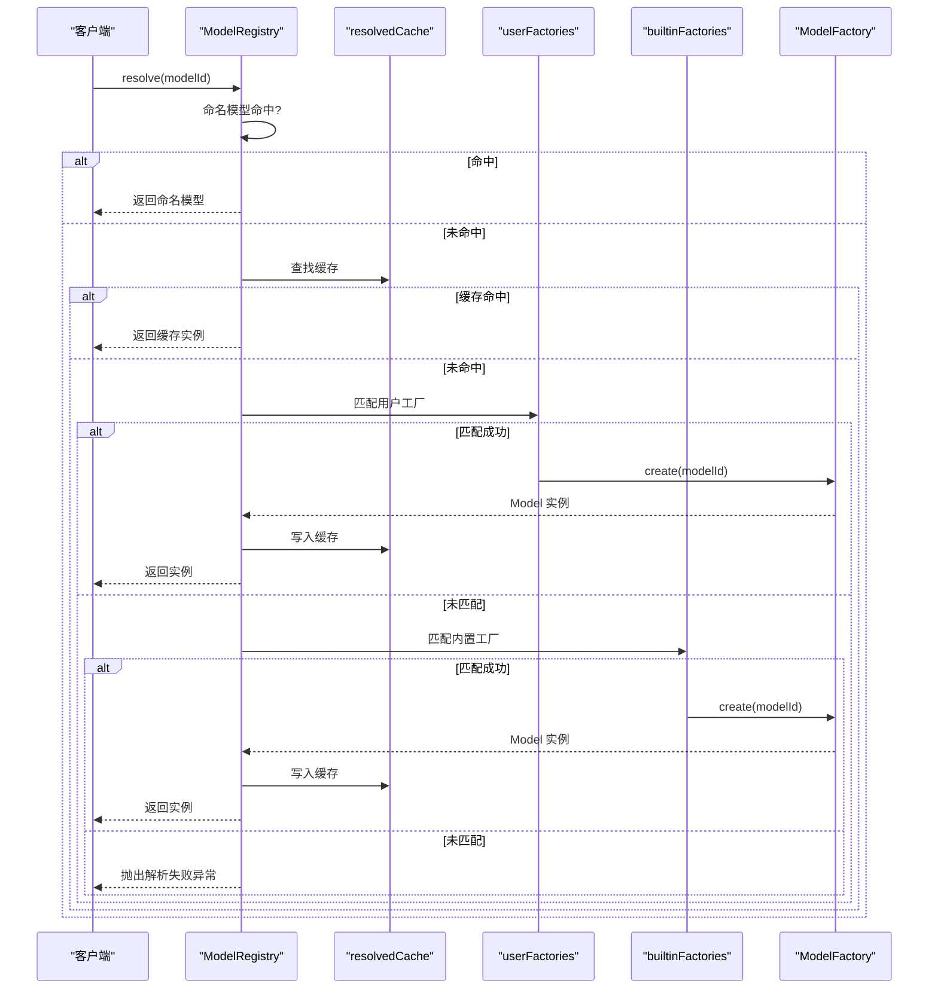
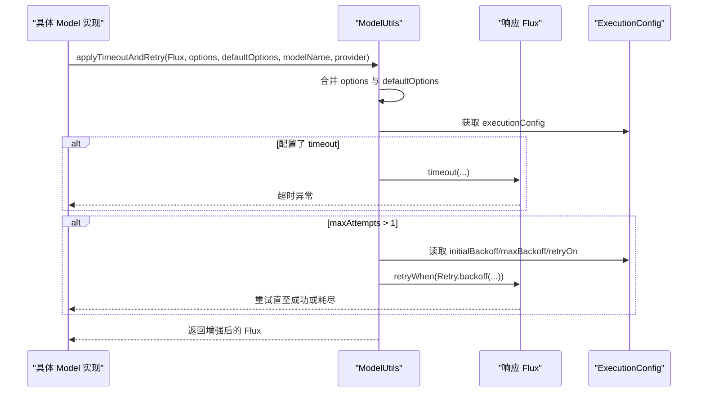
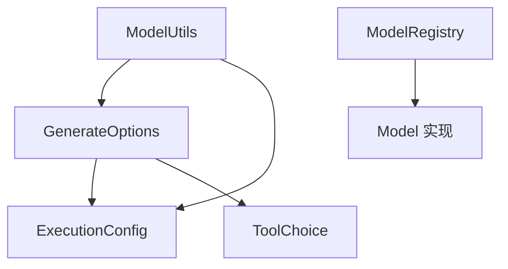

# 配置管理

<cite>
**本文引用的文件**
- [ExecutionConfig.java](file://agentscope-core/src/main/java/io/agentscope/core/model/ExecutionConfig.java)
- [GenerateOptions.java](file://agentscope-core/src/main/java/io/agentscope/core/model/GenerateOptions.java)
- [ModelRegistry.java](file://agentscope-core/src/main/java/io/agentscope/core/model/ModelRegistry.java)
- [ModelUtils.java](file://agentscope-core/src/main/java/io/agentscope/core/model/ModelUtils.java)
- [ToolChoice.java](file://agentscope-core/src/main/java/io/agentscope/core/model/ToolChoice.java)
- [Model.java](file://agentscope-core/src/main/java/io/agentscope/core/model/Model.java)
- [ModelTimeoutRetryTest.java](file://agentscope-core/src/test/java/io/agentscope/core/model/ModelTimeoutRetryTest.java)
- [ExecutionConfigE2ETest.java](file://agentscope-core/src/test/java/io/agentscope/core/e2e/ExecutionConfigE2ETest.java)
- [ModelRegistryTest.java](file://agentscope-core/src/test/java/io/agentscope/core/model/ModelRegistryTest.java)
</cite>

## 目录
1. [简介](#简介)
2. [项目结构](#项目结构)
3. [核心组件](#核心组件)
4. [架构总览](#架构总览)
5. [详细组件分析](#详细组件分析)
6. [依赖关系分析](#依赖关系分析)
7. [性能考量](#性能考量)
8. [故障排查指南](#故障排查指南)
9. [结论](#结论)
10. [附录](#附录)

## 简介
本文件面向 AgentScope Java 的模型配置管理系统，系统性阐述以下主题：
- ExecutionConfig 的执行配置与连接参数：超时、重试、退避策略与错误过滤。
- GenerateOptions 的生成选项与推理参数：温度、采样、最大令牌数、工具选择、流式传输、附加请求参数等。
- ModelRegistry 的模型注册与发现机制：命名模型、用户工厂、内置提供者与缓存。
- ModelUtils 的工具方法与配置辅助功能：超时与重试应用、默认执行配置确保。
- 配置文件管理、环境变量与动态配置：环境变量读取、自动模型创建、运行时合并与覆盖。
- 配置验证、默认值设置与参数覆盖策略：构建器校验、分层合并、默认回退。
- 多环境配置、配置热更新与配置迁移的最佳实践：可扩展的注册与工厂模式。

## 项目结构
围绕模型配置管理的核心代码位于 agentscope-core 模块的 model 包中，配合测试用例验证行为与边界条件。下图展示与配置管理直接相关的类与接口：

**图表来源**
- [ExecutionConfig.java:56-395](file://agentscope-core/src/main/java/io/agentscope/core/model/ExecutionConfig.java#L56-L395)
- [GenerateOptions.java:31-874](file://agentscope-core/src/main/java/io/agentscope/core/model/GenerateOptions.java#L31-L874)
- [ToolChoice.java:45-85](file://agentscope-core/src/main/java/io/agentscope/core/model/ToolChoice.java#L45-L85)
- [ModelRegistry.java:35-260](file://agentscope-core/src/main/java/io/agentscope/core/model/ModelRegistry.java#L35-L260)
- [Model.java:22-42](file://agentscope-core/src/main/java/io/agentscope/core/model/Model.java#L22-L42)
- [ModelUtils.java:31-179](file://agentscope-core/src/main/java/io/agentscope/core/model/ModelUtils.java#L31-L179)

**章节来源**
- [ExecutionConfig.java:1-395](file://agentscope-core/src/main/java/io/agentscope/core/model/ExecutionConfig.java#L1-L395)
- [GenerateOptions.java:1-874](file://agentscope-core/src/main/java/io/agentscope/core/model/GenerateOptions.java#L1-L874)
- [ModelRegistry.java:1-260](file://agentscope-core/src/main/java/io/agentscope/core/model/ModelRegistry.java#L1-L260)
- [ModelUtils.java:1-179](file://agentscope-core/src/main/java/io/agentscope/core/model/ModelUtils.java#L1-L179)
- [ToolChoice.java:1-85](file://agentscope-core/src/main/java/io/agentscope/core/model/ToolChoice.java#L1-L85)
- [Model.java:1-42](file://agentscope-core/src/main/java/io/agentscope/core/model/Model.java#L1-L42)

## 核心组件
本节聚焦四大核心类及其职责与交互方式：
- ExecutionConfig：统一的执行配置（超时、重试次数、初始/最大退避、退避倍数、错误过滤）。
- GenerateOptions：生成选项（连接级参数与推理参数），支持与 ExecutionConfig 的组合。
- ModelRegistry：模型注册与发现（命名模型、用户工厂、内置提供者、缓存）。
- ModelUtils：通用工具（超时与重试应用、默认执行配置确保）。

这些组件共同构成 AgentScope 的模型配置与执行控制基础。

**章节来源**
- [ExecutionConfig.java:27-395](file://agentscope-core/src/main/java/io/agentscope/core/model/ExecutionConfig.java#L27-L395)
- [GenerateOptions.java:24-874](file://agentscope-core/src/main/java/io/agentscope/core/model/GenerateOptions.java#L24-L874)
- [ModelRegistry.java:25-260](file://agentscope-core/src/main/java/io/agentscope/core/model/ModelRegistry.java#L25-L260)
- [ModelUtils.java:25-179](file://agentscope-core/src/main/java/io/agentscope/core/model/ModelUtils.java#L25-L179)

## 架构总览
下图展示配置在调用链中的位置与作用范围：

**图表来源**
- [ExecutionConfig.java:56-395](file://agentscope-core/src/main/java/io/agentscope/core/model/ExecutionConfig.java#L56-L395)
- [GenerateOptions.java:31-874](file://agentscope-core/src/main/java/io/agentscope/core/model/GenerateOptions.java#L31-L874)
- [ToolChoice.java:45-85](file://agentscope-core/src/main/java/io/agentscope/core/model/ToolChoice.java#L45-L85)
- [ModelRegistry.java:142-173](file://agentscope-core/src/main/java/io/agentscope/core/model/ModelRegistry.java#L142-L173)
- [ModelUtils.java:69-139](file://agentscope-core/src/main/java/io/agentscope/core/model/ModelUtils.java#L69-L139)
- [Model.java:22-41](file://agentscope-core/src/main/java/io/agentscope/core/model/Model.java#L22-L41)

## 详细组件分析

### ExecutionConfig 执行配置
- 职责：统一控制单次执行（模型请求或工具调用）的超时、重试与退避策略，并定义可重试错误集合。
- 关键字段：
  - 超时：Duration 类型，用于限制单次执行时间。
  - 最大尝试次数：整数，包含初始尝试。
  - 初始/最大退避：Duration 类型，控制指数退避的起点与上限。
  - 退避倍数：双精度，必须不小于 1.0。
  - 错误过滤谓词：Predicate<Throwable>，决定是否对特定异常进行重试。
- 默认值：
  - MODEL_DEFAULTS：5 分钟超时、最多 3 次尝试（含初始）、指数退避（初始 2 秒、最大 30 秒、倍数 2.0），仅对可重试错误重试。
  - TOOL_DEFAULTS：5 分钟超时、仅 1 次尝试（禁用重试）。
- 合并策略：按字段逐项合并，优先使用主配置；若主配置为空则回退到备用配置。
- 可重试错误判定：针对 BadRequestException（400）、HttpTransportException（429/5xx）、RateLimitException、TimeoutException、IOException 及其原因链进行判断。

**图表来源**
- [ExecutionConfig.java:101-134](file://agentscope-core/src/main/java/io/agentscope/core/model/ExecutionConfig.java#L101-L134)

**章节来源**
- [ExecutionConfig.java:27-395](file://agentscope-core/src/main/java/io/agentscope/core/model/ExecutionConfig.java#L27-L395)

### GenerateOptions 生成选项
- 职责：封装一次生成请求的完整配置，既包含连接级参数（如 API Key、Base URL、Endpoint Path、Model Name、Stream），也包含推理级参数（如 Temperature、Top-P、Max Tokens、工具选择、缓存控制等）。
- 连接级参数：
  - apiKey/baseUrl/endpointPath/modelName/stream：用于构造请求端点与认证信息。
- 推理参数：
  - temperature/topP/maxTokens/maxCompletionTokens/frequencyPenalty/presencePenalty/thinkingBudget/reasoningEffort/topK/seed/cacheControl/parallelToolCalls。
- 扩展参数：
  - additionalHeaders/additionalBodyParams/additionalQueryParams：用于注入自定义头部、请求体参数与查询参数。
- 与 ExecutionConfig 的关系：
  - executionConfig：将执行配置（超时/重试）应用于请求。
  - mergeOptions：逐字段合并，map 类型采用“备用优先、主覆盖”的策略；ExecutionConfig 使用独立的 mergeConfigs。
- 工具选择：
  - toolChoice：Auto/None/Required/Specific 四种策略，影响模型是否调用工具以及如何调用。

**图表来源**
- [GenerateOptions.java:31-874](file://agentscope-core/src/main/java/io/agentscope/core/model/GenerateOptions.java#L31-L874)
- [ToolChoice.java:45-85](file://agentscope-core/src/main/java/io/agentscope/core/model/ToolChoice.java#L45-L85)

**章节来源**
- [GenerateOptions.java:24-874](file://agentscope-core/src/main/java/io/agentscope/core/model/GenerateOptions.java#L24-L874)
- [ToolChoice.java:19-85](file://agentscope-core/src/main/java/io/agentscope/core/model/ToolChoice.java#L19-L85)

### ModelRegistry 模型注册与发现
- 职责：根据字符串标识解析/创建 Model 实例，支持命名模型、用户工厂与内置提供者三类来源。
- 解析顺序：
  1) 命名模型精确匹配；
  2) 已缓存的工厂创建实例；
  3) 用户工厂（按注册顺序优先）；
  4) 内置提供者（openai/dashscope/qwen-anthropic/gemini/ollama）。
- 自动创建规则：
  - openai:xxx → 从环境变量 OPENAI_API_KEY 读取密钥；
  - dashscope:xxx 或 qwen-* → 从环境变量 DASHSCOPE_API_KEY 读取密钥；
  - anthropic:xxx → 从环境变量 ANTHROPIC_API_KEY 读取密钥；
  - gemini:xxx → 从环境变量 GEMINI_API_KEY 读取密钥；
  - ollama:xxx → 从环境变量 OLLAMA_BASE_URL 读取基础地址，默认 http://localhost:11434。
- 缓存与并发：
  - namedModels：ConcurrentHashMap 存储命名模型；
  - resolvedCache：ConcurrentHashMap 缓存工厂创建的实例；
  - userFactories：CopyOnWriteArrayList，线程安全追加新工厂。
- 辅助能力：
  - register/registerFactory：注册命名模型与工厂；
  - canResolve：预检解析可行性；
  - reset：清空注册与缓存（主要用于测试）。

**图表来源**
- [ModelRegistry.java:142-173](file://agentscope-core/src/main/java/io/agentscope/core/model/ModelRegistry.java#L142-L173)

**章节来源**
- [ModelRegistry.java:25-260](file://agentscope-core/src/main/java/io/agentscope/core/model/ModelRegistry.java#L25-L260)

### ModelUtils 工具方法与配置辅助
- applyTimeoutAndRetry：将超时与重试逻辑应用于响应 Flux。
  - 选项合并：以传入 options 为主，defaultOptions 为备，形成有效配置。
  - 超时：若配置了 timeout，则对整个请求施加超时，超时后抛出 ModelException。
  - 重试：若 maxAttempts > 1，则启用指数退避重试，支持初始/最大退避与错误过滤谓词；默认对所有异常重试。
- ensureDefaultExecutionConfig：确保 GenerateOptions 中包含 MODEL_DEFAULTS 的执行配置，避免遗漏默认超时与重试设置。

**图表来源**
- [ModelUtils.java:69-139](file://agentscope-core/src/main/java/io/agentscope/core/model/ModelUtils.java#L69-L139)

**章节来源**
- [ModelUtils.java:25-179](file://agentscope-core/src/main/java/io/agentscope/core/model/ModelUtils.java#L25-L179)

## 依赖关系分析
- 组件耦合：
  - GenerateOptions 依赖 ExecutionConfig 与 ToolChoice，体现“配置即契约”设计。
  - ModelUtils 依赖 GenerateOptions 与 ExecutionConfig，作为横切关注点（超时/重试）的统一实现。
  - ModelRegistry 依赖 Model 接口与具体实现类（如 OpenAIChatModel、DashScopeChatModel 等），但通过工厂与缓存解耦。
- 外部依赖：
  - Reactor Flux 用于响应式流处理；
  - SLF4J 用于日志记录；
  - 测试框架 JUnit 与 Reactor Test 用于行为验证。

**图表来源**
- [GenerateOptions.java:31-874](file://agentscope-core/src/main/java/io/agentscope/core/model/GenerateOptions.java#L31-L874)
- [ExecutionConfig.java:56-395](file://agentscope-core/src/main/java/io/agentscope/core/model/ExecutionConfig.java#L56-L395)
- [ToolChoice.java:45-85](file://agentscope-core/src/main/java/io/agentscope/core/model/ToolChoice.java#L45-L85)
- [ModelUtils.java:69-139](file://agentscope-core/src/main/java/io/agentscope/core/model/ModelUtils.java#L69-L139)
- [ModelRegistry.java:142-173](file://agentscope-core/src/main/java/io/agentscope/core/model/ModelRegistry.java#L142-L173)

**章节来源**
- [GenerateOptions.java:24-874](file://agentscope-core/src/main/java/io/agentscope/core/model/GenerateOptions.java#L24-L874)
- [ExecutionConfig.java:27-395](file://agentscope-core/src/main/java/io/agentscope/core/model/ExecutionConfig.java#L27-L395)
- [ToolChoice.java:19-85](file://agentscope-core/src/main/java/io/agentscope/core/model/ToolChoice.java#L19-L85)
- [ModelUtils.java:25-179](file://agentscope-core/src/main/java/io/agentscope/core/model/ModelUtils.java#L25-L179)
- [ModelRegistry.java:25-260](file://agentscope-core/src/main/java/io/agentscope/core/model/ModelRegistry.java#L25-L260)

## 性能考量
- 超时与重试：
  - 合理设置 timeout 可避免长时间阻塞；过短可能导致误判，过长会拖慢整体吞吐。
  - 退避策略应结合并发与限流策略，避免雪崩效应。
- 缓存与工厂：
  - ModelRegistry 的 resolvedCache 可显著降低重复创建开销。
  - userFactories 使用 CopyOnWriteArrayList，适合注册阶段写少读多的场景。
- 流式传输：
  - stream=true 可降低首字节延迟，提升用户体验，但需注意下游处理的背压与缓冲。

[本节为通用指导，无需列出章节来源]

## 故障排查指南
- 超时与重试行为验证：
  - 单元测试覆盖了超时触发、成功完成、无配置时不应用超时/重试、按谓词过滤重试等场景。
  - 端到端测试验证了不同模型在默认与自定义 ExecutionConfig 下的行为。
- 常见问题定位：
  - 无法解析模型：检查 ModelRegistry 的 canResolve 与错误消息提示，确认命名模型、工厂正则匹配与环境变量是否正确。
  - 重试未生效：确认 ExecutionConfig 的 maxAttempts > 1 且错误类型满足 retryOn 条件。
  - 默认配置缺失：使用 ModelUtils.ensureDefaultExecutionConfig 确保默认超时与重试策略生效。

**章节来源**
- [ModelTimeoutRetryTest.java:39-390](file://agentscope-core/src/test/java/io/agentscope/core/model/ModelTimeoutRetryTest.java#L39-L390)
- [ExecutionConfigE2ETest.java:48-197](file://agentscope-core/src/test/java/io/agentscope/core/e2e/ExecutionConfigE2ETest.java#L48-L197)
- [ModelRegistryTest.java:44-140](file://agentscope-core/src/test/java/io/agentscope/core/model/ModelRegistryTest.java#L44-L140)

## 结论
AgentScope 的配置管理以“配置即契约”为核心理念，通过 ExecutionConfig 与 GenerateOptions 的清晰分离，结合 ModelRegistry 的灵活注册与发现机制，以及 ModelUtils 的横切超时/重试能力，实现了高可配置、可扩展、易维护的模型调用体系。建议在生产环境中：
- 明确分层配置（全局默认、组件默认、请求覆盖）并严格遵循合并优先级；
- 为不同模型与场景设定合理的超时与重试策略；
- 充分利用 ModelRegistry 的缓存与工厂机制，减少实例化成本；
- 在需要时通过 ModelUtils 确保默认执行配置不被遗漏。

[本节为总结性内容，无需列出章节来源]

## 附录

### 配置验证、默认值与参数覆盖策略
- 构建器校验：
  - maxAttempts 必须 ≥ 1；
  - backoffMultiplier 必须 ≥ 1.0。
- 默认值：
  - ExecutionConfig.MODEL_DEFAULTS：5 分钟超时、3 次尝试、指数退避、可重试错误集合；
  - ExecutionConfig.TOOL_DEFAULTS：5 分钟超时、1 次尝试；
  - ModelUtils.ensureDefaultExecutionConfig：当 options 或 executionConfig 为空时，自动合并 MODEL_DEFAULTS。
- 参数覆盖：
  - mergeOptions：逐字段优先使用主配置，map 类型采用“备用优先、主覆盖”；
  - mergeConfigs：逐字段优先使用主配置，若主为空则回退备用。

**章节来源**
- [ExecutionConfig.java:327-372](file://agentscope-core/src/main/java/io/agentscope/core/model/ExecutionConfig.java#L327-L372)
- [GenerateOptions.java:423-498](file://agentscope-core/src/main/java/io/agentscope/core/model/GenerateOptions.java#L423-L498)
- [ModelUtils.java:158-177](file://agentscope-core/src/main/java/io/agentscope/core/model/ModelUtils.java#L158-L177)

### 多环境配置、环境变量与动态配置
- 环境变量：
  - OPENAI_API_KEY、DASHSCOPE_API_KEY、GEMINI_API_KEY、ANTHROPIC_API_KEY、OLLAMA_BASE_URL；
  - 未设置时会触发明确的异常信息，便于快速定位。
- 动态配置：
  - ModelRegistry 支持运行时注册工厂与命名模型；
  - GenerateOptions 支持按请求覆盖默认配置；
  - ExecutionConfig 支持按请求覆盖默认执行策略。

**章节来源**
- [ModelRegistry.java:43-106](file://agentscope-core/src/main/java/io/agentscope/core/model/ModelRegistry.java#L43-L106)
- [GenerateOptions.java:380-422](file://agentscope-core/src/main/java/io/agentscope/core/model/GenerateOptions.java#L380-L422)

### 配置热更新与迁移最佳实践
- 热更新：
  - 建议通过注册新的用户工厂或替换命名模型实现“无停机”切换；
  - 对于 ExecutionConfig，可在新请求中注入新的配置，避免全局状态变更。
- 迁移：
  - 从旧配置迁移到新配置时，优先使用 mergeOptions/mergeConfigs 保证向后兼容；
  - 对于新增字段（如 additionalHeaders/body/query），保持与现有字段的合并策略一致。

[本节为通用指导，无需列出章节来源]