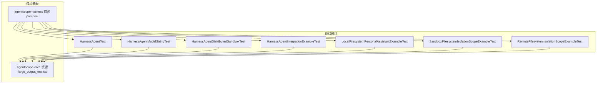
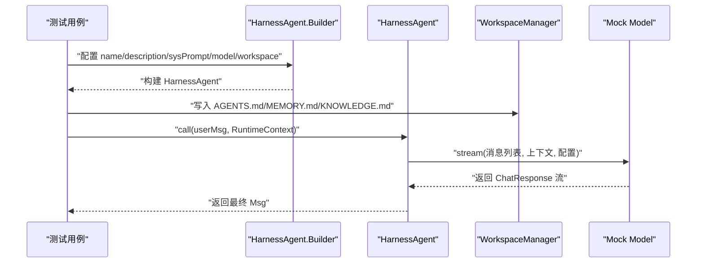
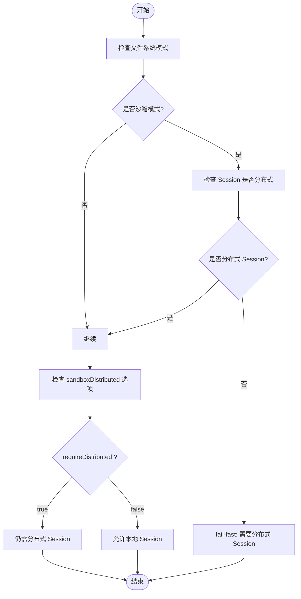
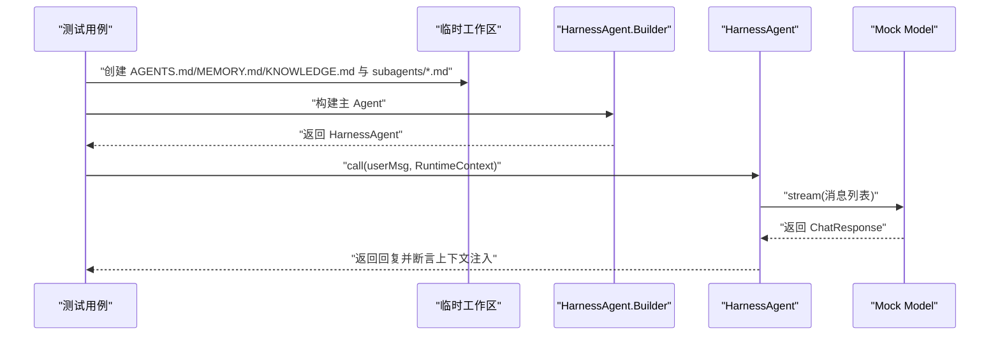
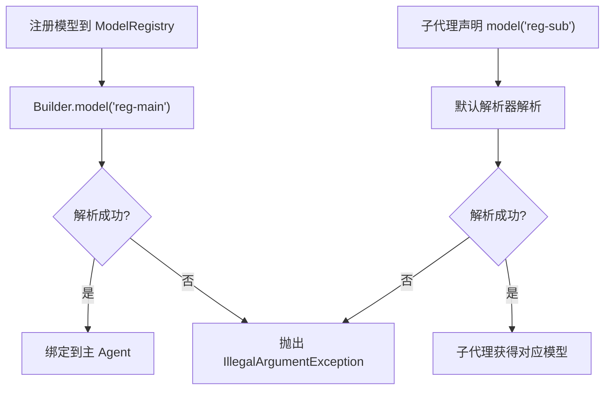
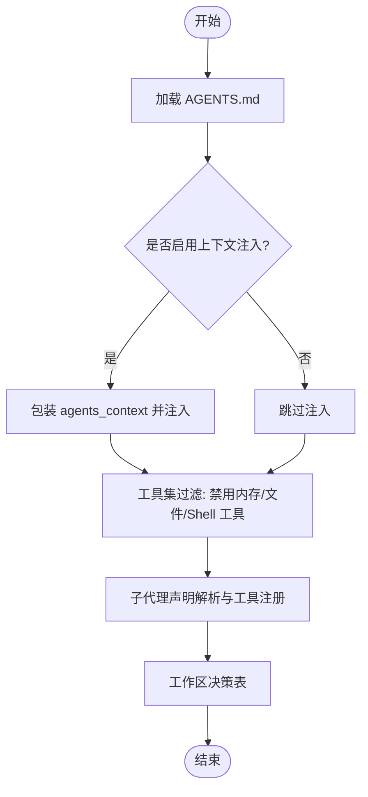
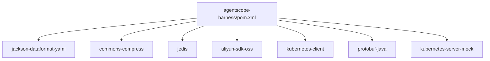

# Agent 测试

<cite>
**本文引用的文件**
- [agentscope-harness/src/test/java/io/agentscope/harness/agent/HarnessAgentDistributedSandboxTest.java](file://agentscope-harness/src/test/java/io/agentscope/harness/agent/HarnessAgentDistributedSandboxTest.java)
- [agentscope-harness/src/test/java/io/agentscope/harness/agent/HarnessAgentIntegrationExampleTest.java](file://agentscope-harness/src/test/java/io/agentscope/harness/agent/HarnessAgentIntegrationExampleTest.java)
- [agentscope-harness/src/test/java/io/agentscope/harness/agent/HarnessAgentModelStringTest.java](file://agentscope-harness/src/test/java/io/agentscope/harness/agent/HarnessAgentModelStringTest.java)
- [agentscope-harness/src/test/java/io/agentscope/harness/agent/HarnessAgentTest.java](file://agentscope-harness/src/test/java/io/agentscope/harness/agent/HarnessAgentTest.java)
- [agentscope-harness/src/test/java/io/agentscope/harness/agent/example/LocalFilesystemPersonalAssistantExampleTest.java](file://agentscope-harness/src/test/java/io/agentscope/harness/agent/example/LocalFilesystemPersonalAssistantExampleTest.java)
- [agentscope-harness/src/test/java/io/agentscope/harness/agent/example/SandboxFilesystemIsolationScopeExampleTest.java](file://agentscope-harness/src/test/java/io/agentscope/harness/agent/example/SandboxFilesystemIsolationScopeExampleTest.java)
- [agentscope-harness/src/test/java/io/agentscope/harness/agent/example/RemoteFilesystemIsolationScopeExampleTest.java](file://agentscope-harness/src/test/java/io/agentscope/harness/agent/example/RemoteFilesystemIsolationScopeExampleTest.java)
- [agentscope-harness/pom.xml](file://agentscope-harness/pom.xml)
- [agentscope-core/src/test/resources/large_output_test.txt](file://agentscope-core/src/test/resources/large_output_test.txt)
</cite>

## 目录
1. [引言](#引言)
2. [项目结构](#项目结构)
3. [核心组件](#核心组件)
4. [架构总览](#架构总览)
5. [详细组件分析](#详细组件分析)
6. [依赖分析](#依赖分析)
7. [性能考虑](#性能考虑)
8. [故障排查指南](#故障排查指南)
9. [结论](#结论)
10. [附录](#附录)

## 引言
本文件面向 Agent 测试模块，系统性梳理与 Agent 相关的测试类型与策略，覆盖分布式沙箱测试、集成示例测试、模型字符串解析测试、子代理流测试；同时给出核心功能、性能与稳定性测试方法，以及与其他组件的交互、事件处理与错误恢复验证机制。文档还提供测试配置参数与监控指标建议，包含并发、压力与负载均衡测试的方法与工具。

## 项目结构
Agent 测试主要集中在 agentscope-harness 模块的测试包中，并辅以 agentscope-core 提供的资源与集成测试样例。关键测试文件分布如下：
- 分布式沙箱与隔离级别：SandboxFilesystemIsolationScopeExampleTest、RemoteFilesystemIsolationScopeExampleTest、HarnessAgentDistributedSandboxTest
- 集成示例与工作区上下文：HarnessAgentIntegrationExampleTest、LocalFilesystemPersonalAssistantExampleTest
- 模型字符串解析与注册：HarnessAgentModelStringTest
- 工作区、子代理声明与工具集过滤：HarnessAgentTest
- 示例支持类（内存沙箱）：InMemorySandbox*（位于 example/support）

**图表来源**
- [agentscope-harness/src/test/java/io/agentscope/harness/agent/HarnessAgentTest.java:1-759](file://agentscope-harness/src/test/java/io/agentscope/harness/agent/HarnessAgentTest.java#L1-759)
- [agentscope-harness/src/test/java/io/agentscope/harness/agent/HarnessAgentModelStringTest.java:1-130](file://agentscope-harness/src/test/java/io/agentscope/harness/agent/HarnessAgentModelStringTest.java#L1-130)
- [agentscope-harness/src/test/java/io/agentscope/harness/agent/HarnessAgentDistributedSandboxTest.java:1-206](file://agentscope-harness/src/test/java/io/agentscope/harness/agent/HarnessAgentDistributedSandboxTest.java#L1-206)
- [agentscope-harness/src/test/java/io/agentscope/harness/agent/HarnessAgentIntegrationExampleTest.java:1-264](file://agentscope-harness/src/test/java/io/agentscope/harness/agent/HarnessAgentIntegrationExampleTest.java#L1-264)
- [agentscope-harness/src/test/java/io/agentscope/harness/agent/example/LocalFilesystemPersonalAssistantExampleTest.java:1-199](file://agentscope-harness/src/test/java/io/agentscope/harness/agent/example/LocalFilesystemPersonalAssistantExampleTest.java#L1-199)
- [agentscope-harness/src/test/java/io/agentscope/harness/agent/example/SandboxFilesystemIsolationScopeExampleTest.java:1-287](file://agentscope-harness/src/test/java/io/agentscope/harness/agent/example/SandboxFilesystemIsolationScopeExampleTest.java#L1-287)
- [agentscope-harness/src/test/java/io/agentscope/harness/agent/example/RemoteFilesystemIsolationScopeExampleTest.java:1-290](file://agentscope-harness/src/test/java/io/agentscope/harness/agent/example/RemoteFilesystemIsolationScopeExampleTest.java#L1-290)
- [agentscope-harness/pom.xml:1-82](file://agentscope-harness/pom.xml#L1-82)
- [agentscope-core/src/test/resources/large_output_test.txt:1-1001](file://agentscope-core/src/test/resources/large_output_test.txt#L1-L1001)

**章节来源**
- [agentscope-harness/pom.xml:1-82](file://agentscope-harness/pom.xml#L1-82)

## 核心组件
- 分布式沙箱与隔离级别测试：验证不同 IsolationScope（SESSION/USER/AGENT）下的状态持久化与命名空间隔离行为，确保在本地内存沙箱或远程存储模式下符合预期。
- 集成示例测试：通过真实工作区布局与 Builder 组合，验证端到端调用路径、会话上下文注入、子代理声明与提示词注入等。
- 模型字符串解析测试：验证模型注册表解析、子代理声明中的模型字符串解析与默认解析器行为。
- 工作区与子代理测试：验证 AGENTS.md 注入、禁用工具集、子代理发现与工具注册、工作区决策表（ISOLATED/SHARED）等。
- 本地文件系统个人助理示例：强调本地模式下的文件持久化、用户/会话不切分工作区等特性。
- 依赖与资源：pom.xml 中的可选依赖（Kubernetes 客户端、Protobuf 等）与 large_output_test.txt 用于压力/死锁相关测试。

**章节来源**
- [agentscope-harness/src/test/java/io/agentscope/harness/agent/HarnessAgentDistributedSandboxTest.java:1-206](file://agentscope-harness/src/test/java/io/agentscope/harness/agent/HarnessAgentDistributedSandboxTest.java#L1-206)
- [agentscope-harness/src/test/java/io/agentscope/harness/agent/HarnessAgentIntegrationExampleTest.java:1-264](file://agentscope-harness/src/test/java/io/agentscope/harness/agent/HarnessAgentIntegrationExampleTest.java#L1-264)
- [agentscope-harness/src/test/java/io/agentscope/harness/agent/HarnessAgentModelStringTest.java:1-130](file://agentscope-harness/src/test/java/io/agentscope/harness/agent/HarnessAgentModelStringTest.java#L1-130)
- [agentscope-harness/src/test/java/io/agentscope/harness/agent/HarnessAgentTest.java:1-759](file://agentscope-harness/src/test/java/io/agentscope/harness/agent/HarnessAgentTest.java#L1-759)
- [agentscope-harness/src/test/java/io/agentscope/harness/agent/example/LocalFilesystemPersonalAssistantExampleTest.java:1-199](file://agentscope-harness/src/test/java/io/agentscope/harness/agent/example/LocalFilesystemPersonalAssistantExampleTest.java#L1-199)
- [agentscope-harness/src/test/java/io/agentscope/harness/agent/example/SandboxFilesystemIsolationScopeExampleTest.java:1-287](file://agentscope-harness/src/test/java/io/agentscope/harness/agent/example/SandboxFilesystemIsolationScopeExampleTest.java#L1-287)
- [agentscope-harness/src/test/java/io/agentscope/harness/agent/example/RemoteFilesystemIsolationScopeExampleTest.java:1-290](file://agentscope-harness/src/test/java/io/agentscope/harness/agent/example/RemoteFilesystemIsolationScopeExampleTest.java#L1-290)
- [agentscope-harness/pom.xml:1-82](file://agentscope-harness/pom.xml#L1-82)
- [agentscope-core/src/test/resources/large_output_test.txt:1-1001](file://agentscope-core/src/test/resources/large_output_test.txt#L1-L1001)

## 架构总览
以下序列图展示“集成示例测试”中一次端到端调用的关键步骤：构建主 Agent → 写入工作区文件 → 调用 call → 模型接收消息列表（包含会话、知识库、子代理等上下文）→ 返回回复。

**图表来源**
- [agentscope-harness/src/test/java/io/agentscope/harness/agent/HarnessAgentIntegrationExampleTest.java:78-170](file://agentscope-harness/src/test/java/io/agentscope/harness/agent/HarnessAgentIntegrationExampleTest.java#L78-L170)

## 详细组件分析

### 分布式沙箱测试（Distributed Sandbox）
- 目标：验证分布式模式下的会话后端要求、快照覆盖、单节点可选分布式校验、远端文件系统模式的会话约束。
- 关键断言：
  - 沙箱模式必须使用沙箱文件系统；否则 fail-fast。
  - 沙箱模式默认要求分布式 Session 后端；本地 WorkspaceSession 将失败。
  - 显式开启 sandboxDistributed(requireDistributed=true) 仍需分布式 Session。
  - sandboxDistributed 可覆盖快照规范；IsolationScope 会应用到沙箱上下文。
  - requireDistributed=false 允许单节点沙箱使用本地 Session。
  - 远端文件系统模式始终需要分布式 Session；本地 Session 将失败。
  - 使用分布式 Session 时，远端文件系统模式可成功构建。

**图表来源**
- [agentscope-harness/src/test/java/io/agentscope/harness/agent/HarnessAgentDistributedSandboxTest.java:47-151](file://agentscope-harness/src/test/java/io/agentscope/harness/agent/HarnessAgentDistributedSandboxTest.java#L47-L151)

**章节来源**
- [agentscope-harness/src/test/java/io/agentscope/harness/agent/HarnessAgentDistributedSandboxTest.java:1-206](file://agentscope-harness/src/test/java/io/agentscope/harness/agent/HarnessAgentDistributedSandboxTest.java#L1-206)

### 集成示例测试（Integration Example）
- 目标：通过真实工作区布局与 Builder 组合，验证端到端调用路径、上下文注入、子代理声明与提示词注入。
- 关键断言：
  - 写入 AGENTS.md/MEMORY.md/KNOWLEDGE.md 并在调用后被模型看到。
  - 会话上下文、领域知识、工作区内容、子代理列表均应注入到系统提示词中。
  - 子代理 Markdown 声明解析与工厂创建，子代理名称来自文件名（不含扩展名）。
  - 子代理提示词片段应出现在模型收到的消息中。

**图表来源**
- [agentscope-harness/src/test/java/io/agentscope/harness/agent/HarnessAgentIntegrationExampleTest.java:78-170](file://agentscope-harness/src/test/java/io/agentscope/harness/agent/HarnessAgentIntegrationExampleTest.java#L78-L170)

**章节来源**
- [agentscope-harness/src/test/java/io/agentscope/harness/agent/HarnessAgentIntegrationExampleTest.java:1-264](file://agentscope-harness/src/test/java/io/agentscope/harness/agent/HarnessAgentIntegrationExampleTest.java#L1-264)

### 模型字符串测试（Model String）
- 目标：验证模型注册表解析与子代理声明中的模型字符串解析。
- 关键断言：
  - 通过字符串 ID 解析已注册模型；未注册 ID 抛出异常。
  - 子代理声明中的模型字符串默认由默认解析器解析；解析结果应绑定到子代理。

**图表来源**
- [agentscope-harness/src/test/java/io/agentscope/harness/agent/HarnessAgentModelStringTest.java:57-114](file://agentscope-harness/src/test/java/io/agentscope/harness/agent/HarnessAgentModelStringTest.java#L57-L114)

**章节来源**
- [agentscope-harness/src/test/java/io/agentscope/harness/agent/HarnessAgentModelStringTest.java:1-130](file://agentscope-harness/src/test/java/io/agentscope/harness/agent/HarnessAgentModelStringTest.java#L1-130)

### 工作区与子代理测试（Workspace & Subagents）
- 目标：验证工作区上下文注入、工具集过滤、子代理发现与工具注册、工作区决策表（ISOLATED/SHARED）、通用子代理镜像配置。
- 关键断言：
  - AGENTS.md 内容注入到模型消息中；禁用上下文后不应注入。
  - 禁用内存/文件系统/Shell 工具后，工具集中不再包含相应工具。
  - 子代理 Markdown 声明注册 agent_spawn/task_output 工具；子代理列表注入到提示词。
  - 工作区决策表：ISOLATED+路径 → 运行时根为定义路径；ISOLATED+无路径 → 自动创建 agents/<name>/workspace；SHARED+路径/无路径 → 运行时根为主工作区；通用子代理始终共享主工作区。
  - 通用子代理镜像配置：禁用文件系统工具、压缩配置等会镜像到通用子代理。

**图表来源**
- [agentscope-harness/src/test/java/io/agentscope/harness/agent/HarnessAgentTest.java:66-518](file://agentscope-harness/src/test/java/io/agentscope/harness/agent/HarnessAgentTest.java#L66-L518)

**章节来源**
- [agentscope-harness/src/test/java/io/agentscope/harness/agent/HarnessAgentTest.java:1-759](file://agentscope-harness/src/test/java/io/agentscope/harness/agent/HarnessAgentTest.java#L1-759)

### 本地文件系统个人助理示例（Local Filesystem）
- 目标：演示本地模式下的文件持久化、用户/会话不切分工作区、宿主进程直接访问工作区的能力。
- 关键断言：
  - 多次调用间文件持久化；不同 sessionId/userId 不改变工作区路径。
  - 宿主进程写入的文件可被 Agent 读取。

**章节来源**
- [agentscope-harness/src/test/java/io/agentscope/harness/agent/example/LocalFilesystemPersonalAssistantExampleTest.java:1-199](file://agentscope-harness/src/test/java/io/agentscope/harness/agent/example/LocalFilesystemPersonalAssistantExampleTest.java#L1-199)

### 沙箱文件系统隔离级别示例（Sandbox Isolation Scope）
- 目标：演示 SESSION/USER/AGENT 三种隔离级别下的沙箱创建与恢复行为。
- 关键断言：
  - SESSION：相同 sessionId → 恢复；不同 sessionId → 新建。
  - USER：相同 userId → 恢复；不同 userId → 新建。
  - AGENT：所有调用共享同一沙箱。
- 支持 InMemorySandboxClient 计数器统计 create/resume 次数。

**章节来源**
- [agentscope-harness/src/test/java/io/agentscope/harness/agent/example/SandboxFilesystemIsolationScopeExampleTest.java:1-287](file://agentscope-harness/src/test/java/io/agentscope/harness/agent/example/SandboxFilesystemIsolationScopeExampleTest.java#L1-287)

### 远端文件系统隔离级别示例（Remote Filesystem Isolation Scope）
- 目标：演示 SESSION/USER/AGENT 三种隔离级别下的命名空间路由与数据隔离。
- 关键断言：
  - SESSION：agents/<agent>/sessions/<sessionId>/MEMORY.md。
  - USER：agents/<agent>/users/<userId>/MEMORY.md。
  - AGENT：agents/<agent>/shared/MEMORY.md。
- 通过 InMemoryStore 断言命名空间隔离与共享。

**章节来源**
- [agentscope-harness/src/test/java/io/agentscope/harness/agent/example/RemoteFilesystemIsolationScopeExampleTest.java:1-290](file://agentscope-harness/src/test/java/io/agentscope/harness/agent/example/RemoteFilesystemIsolationScopeExampleTest.java#L1-290)

## 依赖分析
- Maven 依赖要点：
  - Jackson YAML 用于子代理配置解析。
  - Commons Compress 用于沙箱安全解压。
  - Redis/Jedis 与阿里云 OSS SDK 作为快照后端。
  - Kubernetes 客户端与 Protobuf 作为可选沙箱后端。
  - kubernetes-server-mock 仅用于测试。

**图表来源**
- [agentscope-harness/pom.xml:33-80](file://agentscope-harness/pom.xml#L33-L80)

**章节来源**
- [agentscope-harness/pom.xml:1-82](file://agentscope-harness/pom.xml#L1-82)

## 性能考虑
- 并发测试
  - 利用隔离级别（SESSION/USER/AGENT）模拟多用户/多会话并发场景，结合 InMemorySandboxClient/InMemoryStore 统计创建与恢复次数，评估沙箱/存储开销。
  - 在本地文件系统模式下，避免跨用户/会话的 I/O 切分，减少上下文切换成本。
- 压力测试
  - 使用 large_output_test.txt 生成大输出流，验证管道缓冲与阻塞处理，防止死锁。
  - 结合沙箱快照与分布式存储后端，评估快照读写与网络延迟对吞吐的影响。
- 负载均衡测试
  - 通过不同 IsolationScope 与 Session 后端组合，观察命名空间隔离与共享对资源占用的影响，指导横向扩展策略。

[本节为通用指导，无需特定文件引用]

## 故障排查指南
- 分布式沙箱构建失败
  - 症状：构建时抛出 IllegalStateException，提示需要沙箱模式或分布式 Session。
  - 排查：确认文件系统模式与 Session 类型匹配；必要时设置 sandboxDistributed(requireDistributed=false) 以允许单节点沙箱。
- 远端文件系统模式失败
  - 症状：使用 RemoteFilesystemSpec 但 Session 为本地 WorkspaceSession。
  - 排查：提供分布式 Session 实例或切换到本地/沙箱模式。
- 工作区上下文未注入
  - 症状：禁用了工作区上下文后，模型未看到 AGENTS.md/MEMORY.md/KNOWLEDGE.md。
  - 排查：检查是否调用了 disableWorkspaceContext；如未禁用，确认文件存在且路径正确。
- 子代理工具缺失
  - 症状：agent_spawn/task_output 未出现。
  - 排查：确认未禁用子代理；检查子代理 Markdown 声明与文件名。
- 模型解析异常
  - 症状：传入未知模型 ID 导致异常。
  - 排查：确保模型已在 ModelRegistry 中注册；或直接传入 Model 实例。

**章节来源**
- [agentscope-harness/src/test/java/io/agentscope/harness/agent/HarnessAgentDistributedSandboxTest.java:47-171](file://agentscope-harness/src/test/java/io/agentscope/harness/agent/HarnessAgentDistributedSandboxTest.java#L47-L171)
- [agentscope-harness/src/test/java/io/agentscope/harness/agent/HarnessAgentIntegrationExampleTest.java:170-170](file://agentscope-harness/src/test/java/io/agentscope/harness/agent/HarnessAgentIntegrationExampleTest.java#L170-L170)
- [agentscope-harness/src/test/java/io/agentscope/harness/agent/HarnessAgentTest.java:86-167](file://agentscope-harness/src/test/java/io/agentscope/harness/agent/HarnessAgentTest.java#L86-L167)
- [agentscope-harness/src/test/java/io/agentscope/harness/agent/HarnessAgentModelStringTest.java:74-84](file://agentscope-harness/src/test/java/io/agentscope/harness/agent/HarnessAgentModelStringTest.java#L74-L84)

## 结论
本测试体系覆盖了 Agent 的核心功能、分布式沙箱、工作区上下文、子代理与工具集、模型解析、隔离级别与命名空间路由等关键维度。通过集成示例与单元测试相结合的方式，既保证端到端行为正确，又细化到具体组件的行为边界与错误处理。配合并发、压力与负载均衡测试方法，可进一步完善 Agent 在生产环境中的稳定性与性能表现。

[本节为总结，无需特定文件引用]

## 附录
- 测试配置参数建议
  - 沙箱选项：sandboxDistributed(requireDistributed=true/false)，快照规范覆盖。
  - 文件系统：LocalFilesystemWithShell（本地）、DockerFilesystemSpec（沙箱）、RemoteFilesystemSpec（远端）。
  - 工具集：禁用内存/文件系统/Shell 工具；工具白名单继承过滤。
  - 子代理：ISOLATED/SHARED 工作区模式；通用子代理镜像配置。
- 监控指标建议
  - 沙箱：创建/恢复次数、快照读写耗时、存储后端 QPS/延迟。
  - 远端文件系统：命名空间命中率、跨会话/用户可见性。
  - 模型：请求延迟、流式响应吞吐、错误率。
  - 工作区：文件读写延迟、上下文注入大小。

[本节为通用指导，无需特定文件引用]