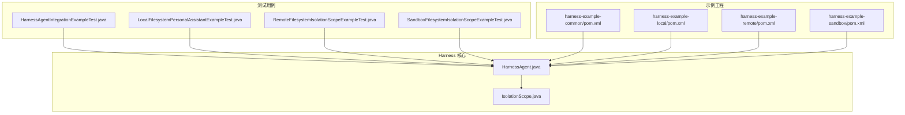
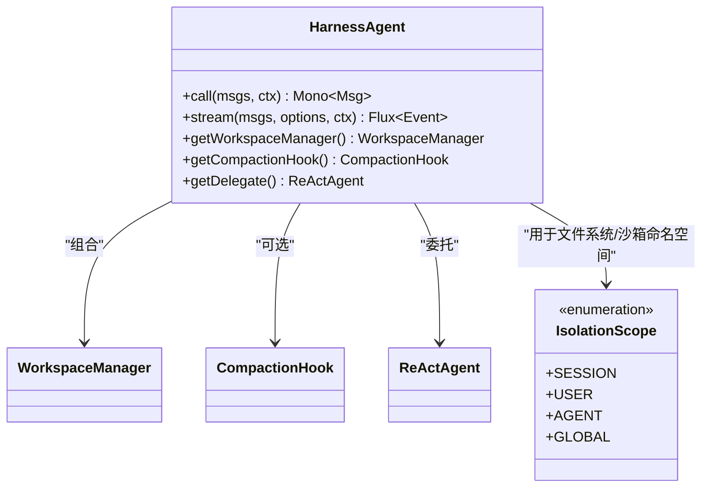
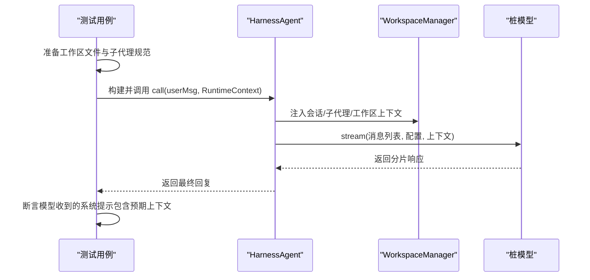
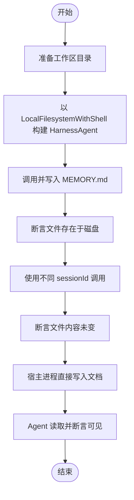
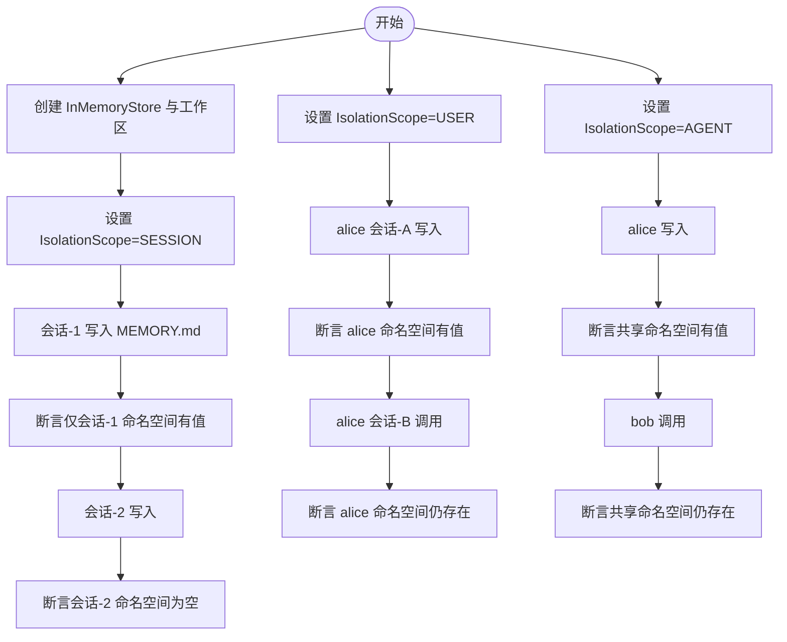
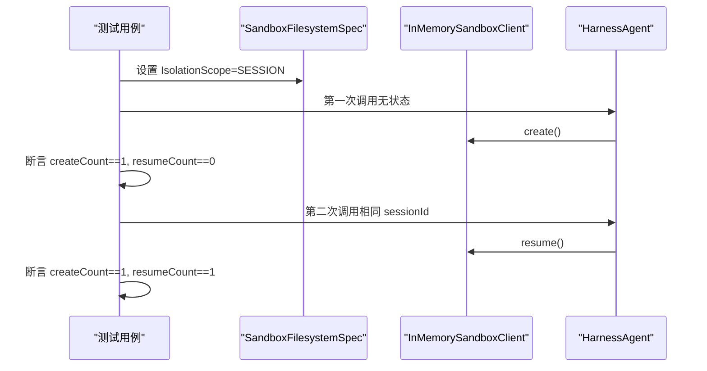
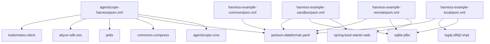

# Harness 测试框架

<cite>
**本文引用的文件**
- [pom.xml](file://agentscope-harness/pom.xml)
- [HarnessAgent.java](file://agentscope-harness/src/main/java/io/agentscope/harness/agent/HarnessAgent.java)
- [IsolationScope.java](file://agentscope-harness/src/main/java/io/agentscope/harness/agent/IsolationScope.java)
- [HarnessAgentIntegrationExampleTest.java](file://agentscope-harness/src/test/java/io/agentscope/harness/agent/HarnessAgentIntegrationExampleTest.java)
- [LocalFilesystemPersonalAssistantExampleTest.java](file://agentscope-harness/src/test/java/io/agentscope/harness/agent/example/LocalFilesystemPersonalAssistantExampleTest.java)
- [RemoteFilesystemIsolationScopeExampleTest.java](file://agentscope-harness/src/test/java/io/agentscope/harness/agent/example/RemoteFilesystemIsolationScopeExampleTest.java)
- [SandboxFilesystemIsolationScopeExampleTest.java](file://agentscope-harness/src/test/java/io/agentscope/harness/agent/example/SandboxFilesystemIsolationScopeExampleTest.java)
- [harness-example-common/pom.xml](file://agentscope-examples/harness-examples/harness-example-common/pom.xml)
- [harness-example-local/pom.xml](file://agentscope-examples/harness-examples/harness-example-local/pom.xml)
- [harness-example-remote/pom.xml](file://agentscope-examples/harness-examples/harness-example-remote/pom.xml)
- [harness-example-sandbox/pom.xml](file://agentscope-examples/harness-examples/harness-example-sandbox/pom.xml)
</cite>

## 目录
1. [简介](#简介)
2. [项目结构](#项目结构)
3. [核心组件](#核心组件)
4. [架构总览](#架构总览)
5. [详细组件分析](#详细组件分析)
6. [依赖关系分析](#依赖关系分析)
7. [性能考虑](#性能考虑)
8. [故障排查指南](#故障排查指南)
9. [结论](#结论)
10. [附录](#附录)

## 简介
本技术文档面向 AgentScope Harness 测试框架，系统阐述其核心设计理念与架构模式，并深入解析以下测试能力与示例：
- 文件系统测试：本地文件系统个人助理示例、远程文件系统隔离示例、沙箱文件系统隔离示例
- 沙箱环境测试：隔离作用域（SESSION/USER/AGENT）在沙箱中的行为验证
- 集成测试：端到端工作区上下文注入、子代理编排与工具链联动
- 测试数据准备、环境搭建与结果验证标准
- 生产环境测试与回归测试最佳实践

## 项目结构
Harness 测试框架位于 agentscope-harness 模块，配套示例位于 agentscope-examples/harness-examples 下的多个子模块中。核心类包括 HarnessAgent 与 IsolationScope；测试覆盖了文件系统、沙箱、内存与会话等多维度场景。

**图表来源**
- [HarnessAgent.java](file://agentscope-harness/src/main/java/io/agentscope/harness/agent/HarnessAgent.java)
- [IsolationScope.java](file://agentscope-harness/src/main/java/io/agentscope/harness/agent/IsolationScope.java)
- [HarnessAgentIntegrationExampleTest.java](file://agentscope-harness/src/test/java/io/agentscope/harness/agent/HarnessAgentIntegrationExampleTest.java)
- [LocalFilesystemPersonalAssistantExampleTest.java](file://agentscope-harness/src/test/java/io/agentscope/harness/agent/example/LocalFilesystemPersonalAssistantExampleTest.java)
- [RemoteFilesystemIsolationScopeExampleTest.java](file://agentscope-harness/src/test/java/io/agentscope/harness/agent/example/RemoteFilesystemIsolationScopeExampleTest.java)
- [SandboxFilesystemIsolationScopeExampleTest.java](file://agentscope-harness/src/test/java/io/agentscope/harness/agent/example/SandboxFilesystemIsolationScopeExampleTest.java)
- [harness-example-common/pom.xml](file://agentscope-examples/harness-examples/harness-example-common/pom.xml)
- [harness-example-local/pom.xml](file://agentscope-examples/harness-examples/harness-example-local/pom.xml)
- [harness-example-remote/pom.xml](file://agentscope-examples/harness-examples/harness-example-remote/pom.xml)
- [harness-example-sandbox/pom.xml](file://agentscope-examples/harness-examples/harness-example-sandbox/pom.xml)

**章节来源**
- [pom.xml:18-82](file://agentscope-harness/pom.xml#L18-L82)

## 核心组件
- HarnessAgent：对 ReActAgent 的增强封装，提供工作区上下文加载、技能加载、子代理编排、内存压缩、会话持久化、可插拔文件系统后端（本地/远程/沙箱）、以及可选禁用内置工具/钩子的能力。
- IsolationScope：统一控制状态隔离与共享的枚举，适用于沙箱恢复与远程存储命名空间路由，支持 SESSION/USER/AGENT/GLOBAL 四种粒度。
- 工具与钩子：文件系统工具、Shell 执行工具、内存检索/获取工具、会话搜索工具、AgentTraceHook、CompactionHook、MemoryFlushHook、SandboxLifecycleHook、WorkspaceContextHook 等。
- 示例工程：harness-example-common、harness-example-local、harness-example-remote、harness-example-sandbox 提供不同运行模式的最小可运行示例。

**章节来源**
- [HarnessAgent.java:109-144](file://agentscope-harness/src/main/java/io/agentscope/harness/agent/HarnessAgent.java#L109-L144)
- [IsolationScope.java:21-49](file://agentscope-harness/src/main/java/io/agentscope/harness/agent/IsolationScope.java#L21-L49)

## 架构总览
Harness 将“工作区上下文”“子代理编排”“内存管理”“文件系统抽象”“沙箱生命周期”等能力整合到一个统一的 Agent 接口下，通过 Builder 模式进行装配与开关控制。测试用例覆盖三种文件系统模式与三种隔离作用域，验证状态隔离、命名空间路由、沙箱恢复与会话注入等关键行为。

**图表来源**
- [HarnessAgent.java:145-450](file://agentscope-harness/src/main/java/io/agentscope/harness/agent/HarnessAgent.java#L145-L450)
- [IsolationScope.java:50-86](file://agentscope-harness/src/main/java/io/agentscope/harness/agent/IsolationScope.java#L50-L86)

## 详细组件分析

### 组件 A：HarnessAgent 集成示例测试
该测试演示真实工作区布局下的端到端调用流程，包含：
- 工作区文件：AGENTS.md、MEMORY.md、知识目录 KNOWLEDGE.md
- 子代理声明：subagents/ 下的 YAML 规范文件
- 会话上下文注入：系统提示中应包含会话、子代理与工作区内容
- 使用桩模型（无外部 API）验证消息流经模型时携带完整上下文

**图表来源**
- [HarnessAgentIntegrationExampleTest.java:78-170](file://agentscope-harness/src/test/java/io/agentscope/harness/agent/HarnessAgentIntegrationExampleTest.java#L78-L170)
- [HarnessAgent.java:175-197](file://agentscope-harness/src/main/java/io/agentscope/harness/agent/HarnessAgent.java#L175-L197)

**章节来源**
- [HarnessAgentIntegrationExampleTest.java:48-170](file://agentscope-harness/src/test/java/io/agentscope/harness/agent/HarnessAgentIntegrationExampleTest.java#L48-L170)
- [HarnessAgent.java:175-344](file://agentscope-harness/src/main/java/io/agentscope/harness/agent/HarnessAgent.java#L175-L344)

### 组件 B：本地文件系统个人助理示例
该示例验证本地文件系统模式的行为特征：
- 文件持久性：一次调用写入的文件在后续调用中仍可读取
- 用户/会话不重定向：更改 userId 或 sessionId 不会改变磁盘工作区位置
- 主机进程直连：宿主进程可直接读写工作区文件，Agent 可感知

**图表来源**
- [LocalFilesystemPersonalAssistantExampleTest.java:76-168](file://agentscope-harness/src/test/java/io/agentscope/harness/agent/example/LocalFilesystemPersonalAssistantExampleTest.java#L76-L168)

**章节来源**
- [LocalFilesystemPersonalAssistantExampleTest.java:43-168](file://agentscope-harness/src/test/java/io/agentscope/harness/agent/example/LocalFilesystemPersonalAssistantExampleTest.java#L43-L168)

### 组件 C：远程文件系统隔离作用域示例
该示例验证远程文件系统在不同 IsolationScope 下的命名空间路由：
- SESSION：按会话隔离，同一会话内跨调用共享
- USER：同用户跨会话共享
- AGENT：所有用户/会话共享
- 断言直接检查 InMemoryStore 中的键前缀是否符合预期

**图表来源**
- [RemoteFilesystemIsolationScopeExampleTest.java:90-259](file://agentscope-harness/src/test/java/io/agentscope/harness/agent/example/RemoteFilesystemIsolationScopeExampleTest.java#L90-L259)

**章节来源**
- [RemoteFilesystemIsolationScopeExampleTest.java:44-259](file://agentscope-harness/src/test/java/io/agentscope/harness/agent/example/RemoteFilesystemIsolationScopeExampleTest.java#L44-L259)

### 组件 D：沙箱文件系统隔离作用域示例
该示例验证沙箱模式下 IsolationScope 对“恢复/新建”沙箱的影响：
- SESSION：相同 sessionId 复用同一沙箱
- USER：相同用户复用同一沙箱（不同 sessionId）
- AGENT：所有调用共享同一沙箱
- 使用 InMemorySandboxClient 计数 create/resume 验证行为

**图表来源**
- [SandboxFilesystemIsolationScopeExampleTest.java:81-110](file://agentscope-harness/src/test/java/io/agentscope/harness/agent/example/SandboxFilesystemIsolationScopeExampleTest.java#L81-L110)

**章节来源**
- [SandboxFilesystemIsolationScopeExampleTest.java:43-256](file://agentscope-harness/src/test/java/io/agentscope/harness/agent/example/SandboxFilesystemIsolationScopeExampleTest.java#L43-L256)

## 依赖关系分析
Harness 模块依赖 agentscope-core，并引入 jackson-dataformat-yaml、commons-compress、jedis、aliyun-sdk-oss、kubernetes-client 等用于配置解析、安全解压、Redis 快照、OSS 后端与 Kubernetes 客户端等能力。示例模块分别引入 sqlite-jdbc、log4j2、spring-boot-starter-web 等以支撑不同运行模式。

**图表来源**
- [pom.xml:33-79](file://agentscope-harness/pom.xml#L33-L79)
- [harness-example-remote/pom.xml:47-82](file://agentscope-examples/harness-examples/harness-example-remote/pom.xml#L47-L82)
- [harness-example-local/pom.xml:37-62](file://agentscope-examples/harness-examples/harness-example-local/pom.xml#L37-L62)
- [harness-example-sandbox/pom.xml:47-84](file://agentscope-examples/harness-examples/harness-example-sandbox/pom.xml#L47-L84)
- [harness-example-common/pom.xml:34-52](file://agentscope-examples/harness-examples/harness-example-common/pom.xml#L34-L52)

**章节来源**
- [pom.xml:18-82](file://agentscope-harness/pom.xml#L18-L82)
- [harness-example-common/pom.xml:28-52](file://agentscope-examples/harness-examples/harness-example-common/pom.xml#L28-L52)
- [harness-example-local/pom.xml:28-62](file://agentscope-examples/harness-examples/harness-example-local/pom.xml#L28-L62)
- [harness-example-remote/pom.xml:28-82](file://agentscope-examples/harness-examples/harness-example-remote/pom.xml#L28-L82)
- [harness-example-sandbox/pom.xml:28-84](file://agentscope-examples/harness-examples/harness-example-sandbox/pom.xml#L28-L84)

## 性能考虑
- 上下文压缩与溢出恢复：当检测到上下文长度超限错误时，自动触发紧急压缩并重试，避免因消息过多导致失败。
- 工具与钩子的按需启用：通过 Builder 的 disable* 开关减少不必要的工具注册与钩子开销，提升吞吐。
- 远程存储命名空间与沙箱恢复：合理选择 IsolationScope 可降低重复创建成本，提高状态复用率。
- I/O 路径优化：本地模式直连磁盘，避免网络与容器层开销；远程/沙箱模式需关注序列化与网络延迟。

**章节来源**
- [HarnessAgent.java:213-259](file://agentscope-harness/src/main/java/io/agentscope/harness/agent/HarnessAgent.java#L213-L259)
- [HarnessAgent.java:595-623](file://agentscope-harness/src/main/java/io/agentscope/harness/agent/HarnessAgent.java#L595-L623)

## 故障排查指南
- 上下文溢出错误处理：当模型返回“上下文过长/令牌限制”等错误时，框架自动尝试紧急压缩并重试；若压缩无效则抛出异常。建议检查消息长度阈值与压缩配置。
- 会话/命名空间断言失败：在远程/沙箱模式下，确认 IsolationScope 与 RuntimeContext 中的 sessionId、userId 是否正确传递，以及 Store/Sandbox 状态键生成是否符合预期。
- 本地模式隔离问题：本地模式不按用户/会话分区，若期望隔离请改用远程或沙箱模式。
- 示例工程依赖缺失：确保示例模块引入了对应依赖（如 spring-boot-starter-web、sqlite-jdbc、log4j2 实现）。

**章节来源**
- [HarnessAgent.java:267-280](file://agentscope-harness/src/main/java/io/agentscope/harness/agent/HarnessAgent.java#L267-L280)
- [RemoteFilesystemIsolationScopeExampleTest.java:63-69](file://agentscope-harness/src/test/java/io/agentscope/harness/agent/example/RemoteFilesystemIsolationScopeExampleTest.java#L63-L69)
- [SandboxFilesystemIsolationScopeExampleTest.java:46-66](file://agentscope-harness/src/test/java/io/agentscope/harness/agent/example/SandboxFilesystemIsolationScopeExampleTest.java#L46-L66)

## 结论
Harness 测试框架通过统一的 HarnessAgent 抽象，将工作区上下文、子代理编排、内存管理与文件系统/沙箱后端无缝集成。测试用例覆盖本地、远程与沙箱三种文件系统模式，并以 IsolationScope 为核心验证状态隔离与共享策略。配合示例工程，开发者可以快速搭建生产级测试与回归测试方案。

## 附录

### A. 测试数据准备策略
- 工作区布局：在临时目录下创建 AGENTS.md、MEMORY.md、KNOWLEDGE.md 与 subagents/ 目录，模拟真实业务场景。
- 子代理规范：在 subagents/ 下放置 YAML 文件，作为子代理定义与系统提示来源。
- 远程存储：使用 InMemoryStore 作为占位后端，验证命名空间路由逻辑。
- 沙箱：使用 InMemorySandboxClient 与自定义 SandboxFilesystemSpec，统计 create/resume 次数验证隔离行为。

**章节来源**
- [HarnessAgentIntegrationExampleTest.java:52-63](file://agentscope-harness/src/test/java/io/agentscope/harness/agent/HarnessAgentIntegrationExampleTest.java#L52-L63)
- [RemoteFilesystemIsolationScopeExampleTest.java:63-74](file://agentscope-harness/src/test/java/io/agentscope/harness/agent/example/RemoteFilesystemIsolationScopeExampleTest.java#L63-L74)
- [SandboxFilesystemIsolationScopeExampleTest.java:62-66](file://agentscope-harness/src/test/java/io/agentscope/harness/agent/example/SandboxFilesystemIsolationScopeExampleTest.java#L62-L66)

### B. 测试环境搭建方法
- Maven 依赖：在示例工程中引入所需依赖（spring-boot、sqlite、log4j2、yaml 解析器），确保与 agentscope-harness 版本兼容。
- 日志与配置：示例工程提供 log4j2 配置与 Spring Boot 入口，便于本地调试与集成测试。
- 临时目录：使用 @TempDir 创建隔离的工作区目录，避免污染测试环境。

**章节来源**
- [harness-example-local/pom.xml:37-62](file://agentscope-examples/harness-examples/harness-example-local/pom.xml#L37-L62)
- [harness-example-remote/pom.xml:47-82](file://agentscope-examples/harness-examples/harness-example-remote/pom.xml#L47-L82)
- [harness-example-sandbox/pom.xml:47-84](file://agentscope-examples/harness-examples/harness-example-sandbox/pom.xml#L47-L84)

### C. 测试结果验证标准
- 集成测试：断言模型收到的系统提示包含会话、子代理与工作区上下文片段。
- 本地模式：断言文件持久化、宿主进程直连可见。
- 远程模式：断言 InMemoryStore 键前缀符合 IsolationScope 语义。
- 沙箱模式：断言 create/resume 计数符合预期。

**章节来源**
- [HarnessAgentIntegrationExampleTest.java:147-170](file://agentscope-harness/src/test/java/io/agentscope/harness/agent/HarnessAgentIntegrationExampleTest.java#L147-L170)
- [LocalFilesystemPersonalAssistantExampleTest.java:96-108](file://agentscope-harness/src/test/java/io/agentscope/harness/agent/example/LocalFilesystemPersonalAssistantExampleTest.java#L96-L108)
- [RemoteFilesystemIsolationScopeExampleTest.java:111-119](file://agentscope-harness/src/test/java/io/agentscope/harness/agent/example/RemoteFilesystemIsolationScopeExampleTest.java#L111-L119)
- [SandboxFilesystemIsolationScopeExampleTest.java:103-110](file://agentscope-harness/src/test/java/io/agentscope/harness/agent/example/SandboxFilesystemIsolationScopeExampleTest.java#L103-L110)

### D. 生产环境测试与回归测试最佳实践
- 分层测试：单元测试覆盖单个文件系统/沙箱行为；集成测试覆盖端到端工作区与子代理；回归测试定期执行三大模式与三种隔离粒度。
- 环境隔离：使用 @TempDir 与独立 Store/Sandbox 实例，避免跨测试干扰。
- 钩子与工具开关：在回归测试中启用/关闭特定钩子与工具，评估对性能与稳定性的影响。
- 失败重试与观测：结合 AgentTraceHook 与日志级别，定位上下文溢出与状态异常。

**章节来源**
- [HarnessAgent.java:567-572](file://agentscope-harness/src/main/java/io/agentscope/harness/agent/HarnessAgent.java#L567-L572)
- [IsolationScope.java:46-49](file://agentscope-harness/src/main/java/io/agentscope/harness/agent/IsolationScope.java#L46-L49)