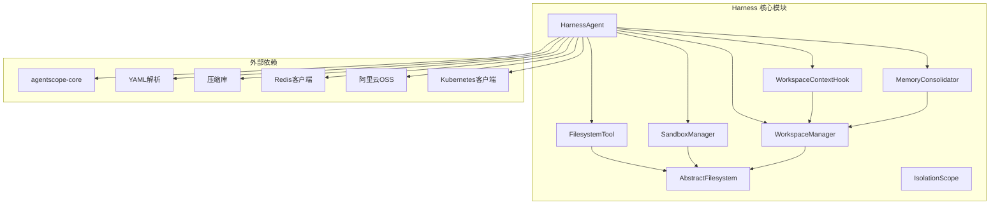
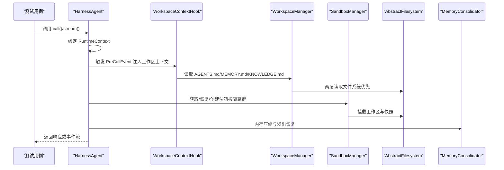
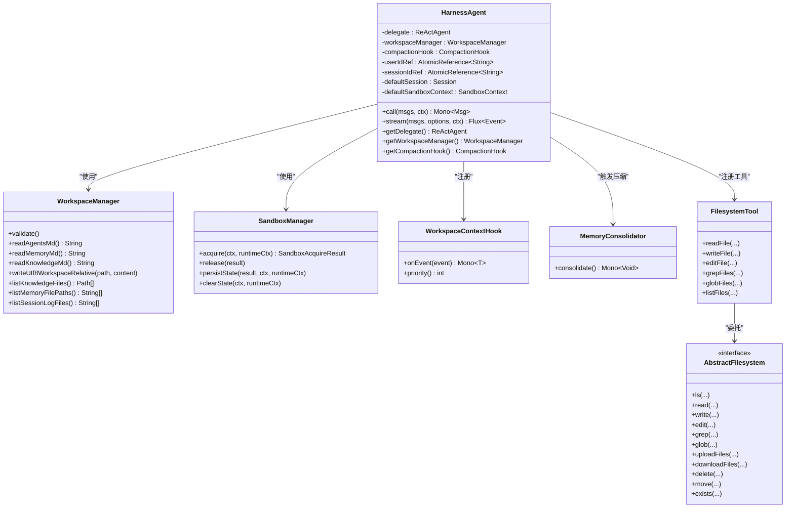
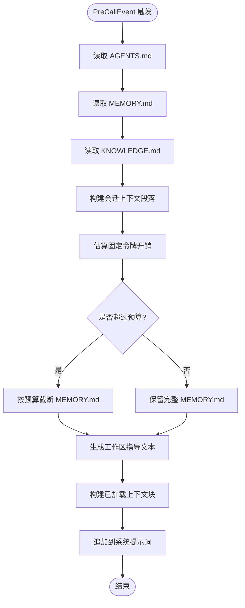
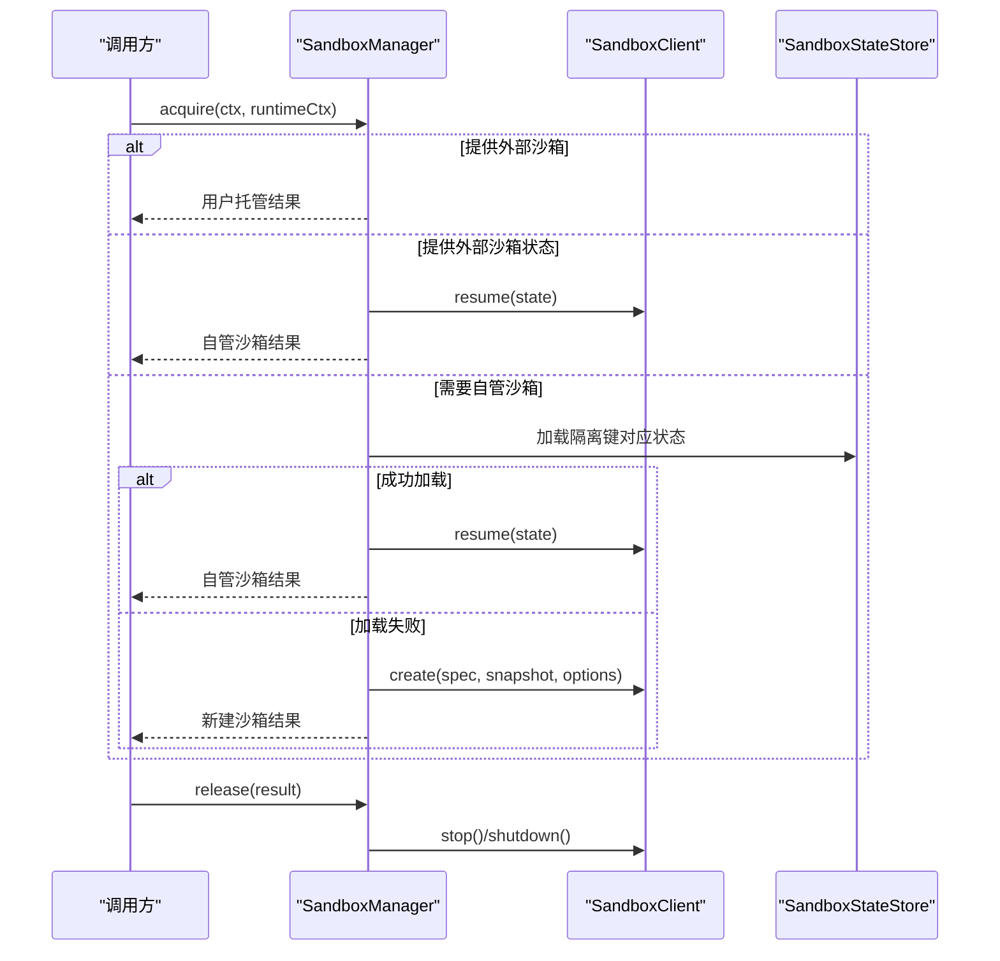
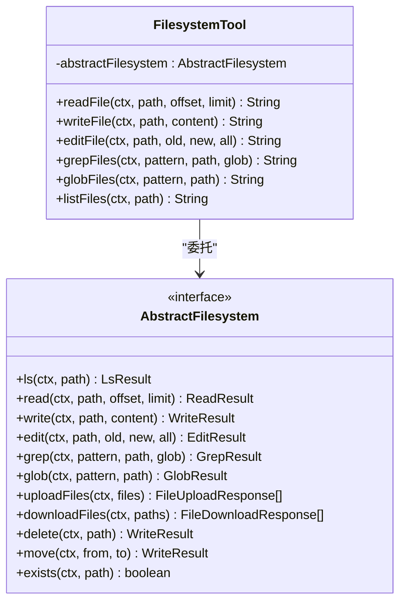
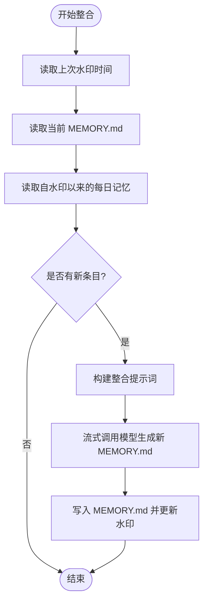
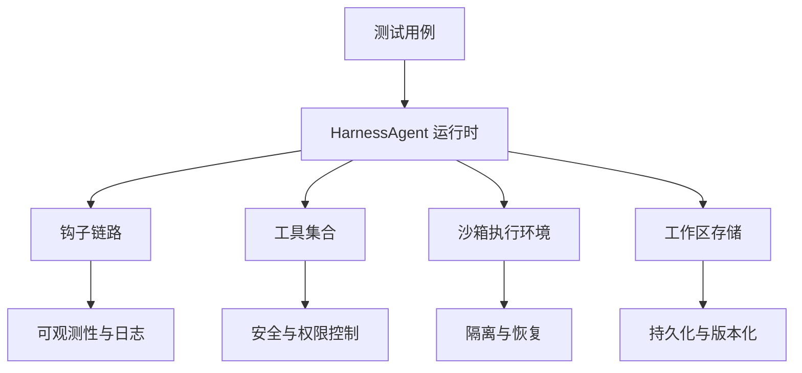
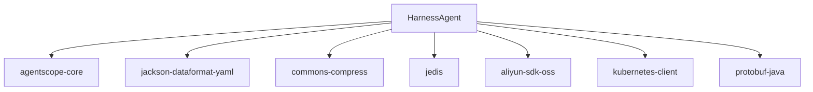

# Harness 测试框架概述

<cite>
**本文档引用的文件**
- [pom.xml](file://agentscope-harness/pom.xml)
- [HarnessAgent.java](file://agentscope-harness/src/main/java/io/agentscope/harness/agent/HarnessAgent.java)
- [IsolationScope.java](file://agentscope-harness/src/main/java/io/agentscope/harness/agent/IsolationScope.java)
- [WorkspaceManager.java](file://agentscope-harness/src/main/java/io/agentscope/harness/agent/workspace/WorkspaceManager.java)
- [SandboxManager.java](file://agentscope-harness/src/main/java/io/agentscope/harness/agent/sandbox/SandboxManager.java)
- [FilesystemTool.java](file://agentscope-harness/src/main/java/io/agentscope/harness/agent/tool/FilesystemTool.java)
- [WorkspaceContextHook.java](file://agentscope-harness/src/main/java/io/agentscope/harness/agent/hook/WorkspaceContextHook.java)
- [MemoryConsolidator.java](file://agentscope-harness/src/main/java/io/agentscope/harness/agent/memory/MemoryConsolidator.java)
- [AbstractFilesystem.java](file://agentscope-harness/src/main/java/io/agentscope/harness/agent/filesystem/AbstractFilesystem.java)
- [HarnessAgentTest.java](file://agentscope-harness/src/test/java/io/agentscope/harness/agent/HarnessAgentTest.java)
- [README.md](file://agentscope-examples/harness-examples/harness-quickstart/README.md)
- [README.md](file://README.md)
</cite>

## 目录
1. [简介](#简介)
2. [项目结构](#项目结构)
3. [核心组件](#核心组件)
4. [架构总览](#架构总览)
5. [详细组件分析](#详细组件分析)
6. [依赖关系分析](#依赖关系分析)
7. [性能考虑](#性能考虑)
8. [故障排除指南](#故障排除指南)
9. [结论](#结论)
10. [附录](#附录)

## 简介
Harness 测试框架是 AgentScope 生态系统中用于增强代理运行时能力的测试与验证工具集，旨在通过统一的工作区上下文、子代理编排、内存管理与后端抽象，显著提升测试效率与开发体验，并确保在复杂场景下的质量与稳定性。Harness 不仅提供对 ReActAgent 的增强包装（HarnessAgent），还内置了文件系统抽象、沙箱管理、工作区上下文注入、内存整理等关键能力，使测试用例能够以更贴近生产环境的方式进行验证。

在 AgentScope 生态中，Harness 的价值体现在：
- **测试效率提升**：通过工作区模板化、工具与钩子的可插拔配置，减少重复设置，加速测试迭代。
- **开发体验优化**：提供清晰的隔离策略（会话/用户/代理/全局）、状态持久化与恢复，降低调试成本。
- **质量保证机制**：通过上下文溢出自动压缩、内存一致性维护、任务记录与扫描等机制，保障长时对话与多轮交互的稳定性。

## 项目结构
Harness 模块位于 agentscope-harness 目录，包含代理核心实现、文件系统抽象、沙箱管理、工作区管理、钩子与工具等组件；同时配套有丰富的测试用例，覆盖工作区读写、子代理编排、文件系统操作、沙箱生命周期、内存整理等多个维度。

**图表来源**
- [pom.xml:33-80](file://agentscope-harness/pom.xml#L33-L80)
- [HarnessAgent.java:1-120](file://agentscope-harness/src/main/java/io/agentscope/harness/agent/HarnessAgent.java#L1-L120)
- [WorkspaceManager.java:62-92](file://agentscope-harness/src/main/java/io/agentscope/harness/agent/workspace/WorkspaceManager.java#L62-L92)
- [SandboxManager.java:24-40](file://agentscope-harness/src/main/java/io/agentscope/harness/agent/sandbox/SandboxManager.java#L24-L40)
- [AbstractFilesystem.java:32-44](file://agentscope-harness/src/main/java/io/agentscope/harness/agent/filesystem/AbstractFilesystem.java#L32-L44)

**章节来源**
- [pom.xml:18-80](file://agentscope-harness/pom.xml#L18-L80)

## 核心组件
- HarnessAgent：面向用户的代理入口，封装 ReActAgent 并集成工作区上下文、子代理编排、内存压缩、会话持久化等增强功能。
- WorkspaceManager：工作区访问器，提供两层读取（文件系统优先、本地回退）与统一的写入接口，支持知识库、记忆体、会话日志等资源管理。
- SandboxManager：沙箱生命周期管理，按隔离键获取/恢复/创建沙箱实例，支持执行守卫与状态持久化。
- AbstractFilesystem：文件系统抽象接口，统一列出、读取、写入、编辑、搜索、上传、下载、删除、移动、存在性检查等操作。
- WorkspaceContextHook：在调用前注入工作区上下文（会话信息、AGENTS.md、MEMORY.md、知识库等），并进行令牌预算控制。
- MemoryConsolidator：基于 LLM 的记忆体整合器，将每日记忆账本合并到 MEMORY.md，并维护水印避免重复处理。
- FilesystemTool：基于 AbstractFilesystem 的工具集合，暴露 read_file、write_file、edit_file、grep_files、glob_files、list_files 等能力。
- IsolationScope：隔离范围枚举，定义会话级、用户级、代理级、全局级的状态隔离与共享策略。

**章节来源**
- [HarnessAgent.java:109-145](file://agentscope-harness/src/main/java/io/agentscope/harness/agent/HarnessAgent.java#L109-L145)
- [WorkspaceManager.java:62-92](file://agentscope-harness/src/main/java/io/agentscope/harness/agent/workspace/WorkspaceManager.java#L62-L92)
- [SandboxManager.java:24-40](file://agentscope-harness/src/main/java/io/agentscope/harness/agent/sandbox/SandboxManager.java#L24-L40)
- [AbstractFilesystem.java:32-44](file://agentscope-harness/src/main/java/io/agentscope/harness/agent/filesystem/AbstractFilesystem.java#L32-L44)
- [WorkspaceContextHook.java:32-43](file://agentscope-harness/src/main/java/io/agentscope/harness/agent/hook/WorkspaceContextHook.java#L32-L43)
- [MemoryConsolidator.java:35-57](file://agentscope-harness/src/main/java/io/agentscope/harness/agent/memory/MemoryConsolidator.java#L35-L57)
- [FilesystemTool.java:33-37](file://agentscope-harness/src/main/java/io/agentscope/harness/agent/tool/FilesystemTool.java#L33-L37)
- [IsolationScope.java:21-49](file://agentscope-harness/src/main/java/io/agentscope/harness/agent/IsolationScope.java#L21-L49)

## 架构总览
Harness 将工作区、文件系统、沙箱、钩子与工具有机组合，形成“代理 + 上下文 + 存储 + 执行环境”的一体化测试运行时。其核心流程如下：

**图表来源**
- [HarnessAgent.java:175-207](file://agentscope-harness/src/main/java/io/agentscope/harness/agent/HarnessAgent.java#L175-L207)
- [WorkspaceContextHook.java:126-132](file://agentscope-harness/src/main/java/io/agentscope/harness/agent/hook/WorkspaceContextHook.java#L126-L132)
- [WorkspaceManager.java:617-653](file://agentscope-harness/src/main/java/io/agentscope/harness/agent/workspace/WorkspaceManager.java#L617-L653)
- [SandboxManager.java:65-139](file://agentscope-harness/src/main/java/io/agentscope/harness/agent/sandbox/SandboxManager.java#L65-L139)
- [MemoryConsolidator.java:113-177](file://agentscope-harness/src/main/java/io/agentscope/harness/agent/memory/MemoryConsolidator.java#L113-L177)

## 详细组件分析

### HarnessAgent 分析
HarnessAgent 是对 ReActAgent 的增强包装，提供以下关键能力：
- 工作区上下文加载：自动读取 AGENTS.md、KNOWLEDGE.md、MEMORY.md，并注入到系统提示词中。
- 子代理编排：通过任务与异步输出工具实现主从协作，支持声明式子代理注册与工厂扩展。
- 内存压缩与溢出恢复：检测上下文溢出错误时触发紧急压缩，清理历史消息后再重试。
- 会话默认值填充：自动为缺失的会话/会话键注入默认值，并绑定默认沙箱上下文。
- 可插拔工具与钩子：支持禁用/启用文件系统工具、Shell 工具、内存工具、内存钩子、会话持久化、工作区上下文、子代理等，便于测试定制。

**图表来源**
- [HarnessAgent.java:145-450](file://agentscope-harness/src/main/java/io/agentscope/harness/agent/HarnessAgent.java#L145-L450)
- [WorkspaceManager.java:93-150](file://agentscope-harness/src/main/java/io/agentscope/harness/agent/workspace/WorkspaceManager.java#L93-L150)
- [SandboxManager.java:40-216](file://agentscope-harness/src/main/java/io/agentscope/harness/agent/sandbox/SandboxManager.java#L40-L216)
- [WorkspaceContextHook.java:43-138](file://agentscope-harness/src/main/java/io/agentscope/harness/agent/hook/WorkspaceContextHook.java#L43-L138)
- [MemoryConsolidator.java:57-104](file://agentscope-harness/src/main/java/io/agentscope/harness/agent/memory/MemoryConsolidator.java#L57-L104)
- [FilesystemTool.java:37-159](file://agentscope-harness/src/main/java/io/agentscope/harness/agent/tool/FilesystemTool.java#L37-L159)
- [AbstractFilesystem.java:44-187](file://agentscope-harness/src/main/java/io/agentscope/harness/agent/filesystem/AbstractFilesystem.java#L44-L187)

**章节来源**
- [HarnessAgent.java:109-450](file://agentscope-harness/src/main/java/io/agentscope/harness/agent/HarnessAgent.java#L109-L450)

### 工作区上下文注入流程
工作区上下文注入在每次调用前执行，将会话信息、域知识、记忆体与额外文件注入到系统提示词中，并根据最大令牌预算进行截断，确保模型输入可控。

**图表来源**
- [WorkspaceContextHook.java:126-167](file://agentscope-harness/src/main/java/io/agentscope/harness/agent/hook/WorkspaceContextHook.java#L126-L167)

**章节来源**
- [WorkspaceContextHook.java:139-296](file://agentscope-harness/src/main/java/io/agentscope/harness/agent/hook/WorkspaceContextHook.java#L139-L296)

### 沙箱生命周期管理
沙箱获取遵循优先级策略：外部沙箱 > 外部沙箱状态 > 已保存状态 > 新建创建；当存在隔离键时，通过执行守卫确保并发安全。

**图表来源**
- [SandboxManager.java:65-139](file://agentscope-harness/src/main/java/io/agentscope/harness/agent/sandbox/SandboxManager.java#L65-L139)

**章节来源**
- [SandboxManager.java:40-216](file://agentscope-harness/src/main/java/io/agentscope/harness/agent/sandbox/SandboxManager.java#L40-L216)

### 文件系统抽象与工具
AbstractFilesystem 定义了统一的文件操作接口，FilesystemTool 基于该接口实现读写、编辑、搜索、列举等工具，支持本地、沙箱与远程文件系统后端。

**图表来源**
- [AbstractFilesystem.java:44-187](file://agentscope-harness/src/main/java/io/agentscope/harness/agent/filesystem/AbstractFilesystem.java#L44-L187)
- [FilesystemTool.java:37-159](file://agentscope-harness/src/main/java/io/agentscope/harness/agent/tool/FilesystemTool.java#L37-L159)

**章节来源**
- [AbstractFilesystem.java:32-187](file://agentscope-harness/src/main/java/io/agentscope/harness/agent/filesystem/AbstractFilesystem.java#L32-L187)
- [FilesystemTool.java:33-159](file://agentscope-harness/src/main/java/io/agentscope/harness/agent/tool/FilesystemTool.java#L33-L159)

### 记忆体整合流程
MemoryConsolidator 读取自上次水印以来变更的每日记忆文件与当前 MEMORY.md，调用模型进行合并去重与精简，然后更新 MEMORY.md 并推进水印。

**图表来源**
- [MemoryConsolidator.java:113-177](file://agentscope-harness/src/main/java/io/agentscope/harness/agent/memory/MemoryConsolidator.java#L113-L177)

**章节来源**
- [MemoryConsolidator.java:57-292](file://agentscope-harness/src/main/java/io/agentscope/harness/agent/memory/MemoryConsolidator.java#L57-L292)

### 概念总览
Harness 的设计强调“可测试即服务”：通过工作区模板化、钩子与工具的可插拔、沙箱隔离与状态持久化，使得测试能够在接近生产的环境中稳定运行，同时提供灵活的配置与可观测性。

[此图为概念性示意，不直接映射具体源码文件]

## 依赖关系分析
Harness 对外依赖 agentscope-core 作为基础框架，并引入 YAML 解析、压缩库、Redis、阿里云 OSS、Kubernetes 客户端等可选后端，以支持不同部署与存储场景。

**图表来源**
- [pom.xml:33-80](file://agentscope-harness/pom.xml#L33-L80)

**章节来源**
- [pom.xml:18-80](file://agentscope-harness/pom.xml#L18-L80)

## 性能考虑
- 令牌预算控制：WorkspaceContextHook 在注入上下文前估算固定开销并按预算截断记忆体内容，避免超出模型上下文限制。
- 两层读取优化：WorkspaceManager 先查询文件系统后回退到本地磁盘，减少不必要的磁盘 IO。
- 水印机制：MemoryConsolidator 使用水印跳过已处理的每日记忆文件，降低 LLM 调用频率与 TOKEN 消耗。
- 执行守卫：SandboxManager 在存在隔离键时申请执行守卫，避免并发冲突导致的重建与数据竞争。
- 工具白名单：子代理支持工具允许列表，减少不必要的工具暴露，降低推理负担。

[本节提供通用指导，无需特定文件分析]

## 故障排除指南
- 上下文溢出错误：HarnessAgent 检测到上下文长度超限后，会触发紧急压缩并重试；若仍失败，建议检查工作区上下文大小或调整压缩阈值。
- 文件系统路径校验：AbstractFilesystem.validatePath 会拒绝空路径与路径穿越（..），请确保传入的路径合法。
- 沙箱状态持久化失败：SandboxManager.release 与 persistState 中的日志会记录异常，检查状态存储后端可用性与权限。
- 任务记录并发写入：WorkspaceManager 对任务记录文件使用锁避免竞态，若出现数据损坏风险，请检查文件系统一致性与权限。
- 日志级别：可通过环境变量调整日志级别，便于定位问题。

**章节来源**
- [HarnessAgent.java:213-280](file://agentscope-harness/src/main/java/io/agentscope/harness/agent/HarnessAgent.java#L213-L280)
- [AbstractFilesystem.java:178-186](file://agentscope-harness/src/main/java/io/agentscope/harness/agent/filesystem/AbstractFilesystem.java#L178-L186)
- [SandboxManager.java:141-197](file://agentscope-harness/src/main/java/io/agentscope/harness/agent/sandbox/SandboxManager.java#L141-L197)
- [WorkspaceManager.java:326-356](file://agentscope-harness/src/main/java/io/agentscope/harness/agent/workspace/WorkspaceManager.java#L326-L356)

## 结论
Harness 测试框架通过将工作区上下文、文件系统抽象、沙箱执行与钩子工具整合为统一的运行时，为 AgentScope 生态提供了高效、可扩展且易于测试的基础设施。它不仅提升了测试效率与开发体验，还在复杂场景下提供了稳健的质量保证机制。结合示例工程与测试用例，开发者可以快速上手并构建可靠的测试流程。

[本节为总结性内容，无需特定文件分析]

## 附录

### 快速入门指南
- 准备工作区：在示例工程中，工作区模板由 WorkspaceInitializer 初始化，包含 AGENTS.md、MEMORY.md、KNOWLEDGE.md、skills 与 subagents 等目录。
- 构建代理：使用 HarnessAgent.builder() 配置名称、模型、工作区与工具包，即可获得具备上下文注入、子代理与内存管理能力的测试代理。
- 运行示例：参考示例工程 README，设置 API 密钥与数据库路径，通过命令行交互或一次性调用方式运行测试。

**章节来源**
- [README.md:126-178](file://agentscope-examples/harness-examples/harness-quickstart/README.md#L126-L178)

### 测试框架与核心框架的关系
- Harness 以 agentscope-core 为基础，复用 ReActAgent 的推理与工具调用能力，并在其之上增加工作区、钩子、沙箱与工具等增强特性。
- Harness 的设计目标与 AgentScope 的理念一致：以 ReAct 为核心范式，提供安全中断、优雅取消、人机协同与可观测性等生产级能力。

**章节来源**
- [README.md:28-71](file://README.md#L28-L71)