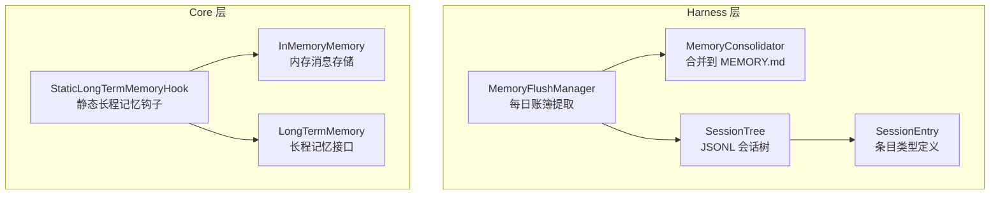
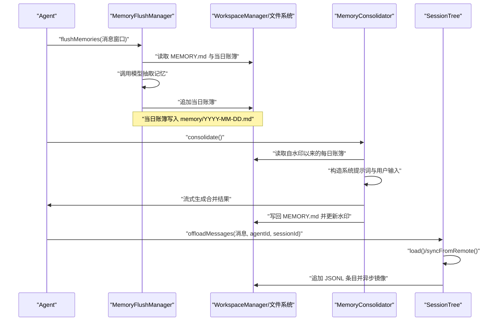
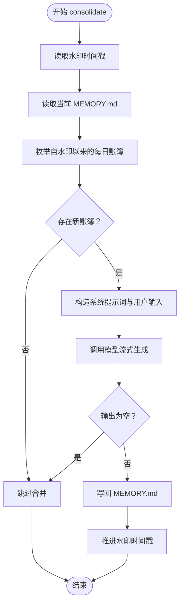
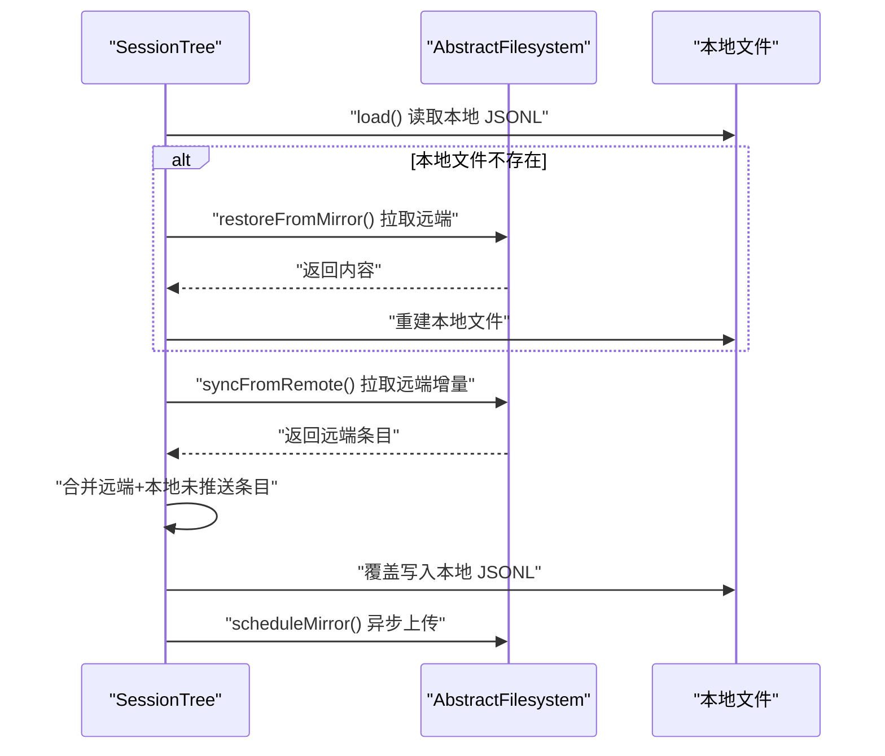
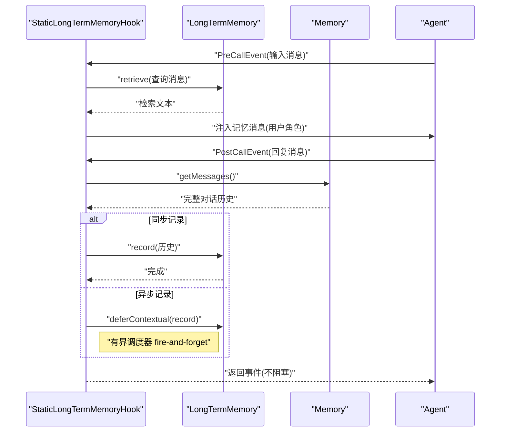
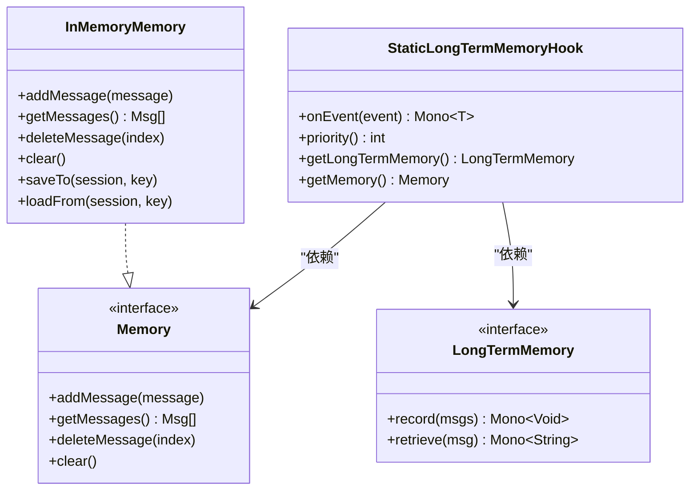
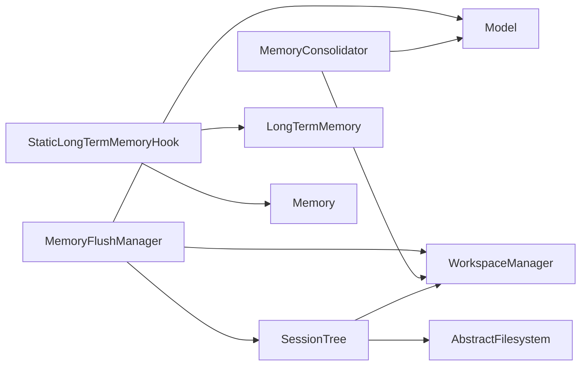

# 内存测试

<cite>
**本文引用的文件**
- [MemoryConsolidator.java](file://agentscope-harness/src/main/java/io/agentscope/harness/agent/memory/MemoryConsolidator.java)
- [MemoryFlushManager.java](file://agentscope-harness/src/main/java/io/agentscope/harness/agent/memory/MemoryFlushManager.java)
- [SessionTree.java](file://agentscope-harness/src/main/java/io/agentscope/harness/agent/memory/session/SessionTree.java)
- [SessionEntry.java](file://agentscope-harness/src/main/java/io/agentscope/harness/agent/memory/session/SessionEntry.java)
- [MemoryConsolidatorFilesystemTest.java](file://agentscope-harness/src/test/java/io/agentscope/harness/agent/memory/MemoryConsolidatorFilesystemTest.java)
- [SessionTreeMirrorTest.java](file://agentscope-harness/src/test/java/io/agentscope/harness/agent/memory/session/SessionTreeMirrorTest.java)
- [InMemoryMemory.java](file://agentscope-core/src/main/java/io/agentscope/core/memory/InMemoryMemory.java)
- [LongTermMemory.java](file://agentscope-core/src/main/java/io/agentscope/core/memory/LongTermMemory.java)
- [StaticLongTermMemoryHook.java](file://agentscope-core/src/main/java/io/agentscope/core/memory/StaticLongTermMemoryHook.java)
- [InMemoryMemoryTest.java](file://agentscope-core/src/test/java/io/agentscope/core/memory/InMemoryMemoryTest.java)
- [StaticLongTermMemoryHookTest.java](file://agentscope-core/src/test/java/io/agentscope/core/memory/StaticLongTermMemoryHookTest.java)
- [LongTermMemoryModeTest.java](file://agentscope-core/src/test/java/io/agentscope/core/memory/LongTermMemoryModeTest.java)
</cite>

## 目录
1. [引言](#引言)
2. [项目结构](#项目结构)
3. [核心组件](#核心组件)
4. [架构总览](#架构总览)
5. [详细组件分析](#详细组件分析)
6. [依赖关系分析](#依赖关系分析)
7. [性能考量](#性能考量)
8. [故障排查指南](#故障排查指南)
9. [结论](#结论)
10. [附录](#附录)

## 引言
本技术文档面向“内存测试模块”，系统化阐述内存一致性测试的设计原理与测试重点，覆盖两大主线：内存整合器测试（两层记忆模型中的“每日账簿合并”）与会话树镜像测试（跨副本一致性与离线恢复）。文档同时给出内存一致性测试的实现方法，包括数据合并策略验证与会话状态同步机制测试；并总结数据结构验证、性能指标测试与异常处理验证的方法论，以及配置参数与监控指标建议，帮助读者在集成与运维中进行内存泄漏检测与资源使用优化。

## 项目结构
内存测试主要分布在以下模块：
- harness 层：负责两层记忆模型的落地实现与端到端测试，包含内存整合器与会话树。
- core 层：提供基础内存接口、静态长程记忆钩子与单元测试，支撑一致性与行为验证。

图表来源
- [MemoryFlushManager.java:53-92](file://agentscope-harness/src/main/java/io/agentscope/harness/agent/memory/MemoryFlushManager.java#L53-L92)
- [MemoryConsolidator.java:57-104](file://agentscope-harness/src/main/java/io/agentscope/harness/agent/memory/MemoryConsolidator.java#L57-L104)
- [SessionTree.java:67-114](file://agentscope-harness/src/main/java/io/agentscope/harness/agent/memory/session/SessionTree.java#L67-L114)
- [SessionEntry.java:46-47](file://agentscope-harness/src/main/java/io/agentscope/harness/agent/memory/session/SessionEntry.java#L46-L47)
- [InMemoryMemory.java:33-74](file://agentscope-core/src/main/java/io/agentscope/core/memory/InMemoryMemory.java#L33-L74)
- [LongTermMemory.java:67-107](file://agentscope-core/src/main/java/io/agentscope/core/memory/LongTermMemory.java#L67-L107)
- [StaticLongTermMemoryHook.java:75-119](file://agentscope-core/src/main/java/io/agentscope/core/memory/StaticLongTermMemoryHook.java#L75-L119)

章节来源
- [MemoryFlushManager.java:53-92](file://agentscope-harness/src/main/java/io/agentscope/harness/agent/memory/MemoryFlushManager.java#L53-L92)
- [MemoryConsolidator.java:57-104](file://agentscope-harness/src/main/java/io/agentscope/harness/agent/memory/MemoryConsolidator.java#L57-L104)
- [SessionTree.java:67-114](file://agentscope-harness/src/main/java/io/agentscope/harness/agent/memory/session/SessionTree.java#L67-L114)
- [InMemoryMemory.java:33-74](file://agentscope-core/src/main/java/io/agentscope/core/memory/InMemoryMemory.java#L33-L74)
- [LongTermMemory.java:67-107](file://agentscope-core/src/main/java/io/agentscope/core/memory/LongTermMemory.java#L67-L107)
- [StaticLongTermMemoryHook.java:75-119](file://agentscope-core/src/main/java/io/agentscope/core/memory/StaticLongTermMemoryHook.java#L75-L119)

## 核心组件
- 内存整合器（MemoryConsolidator）
  - 职责：读取自上次水印以来变更的每日账簿，调用大模型进行去重、合并与裁剪，写回 MEMORY.md，并推进水印。
  - 关键点：通过 WorkspaceManager 抽象访问文件系统，支持本地/远程后端；水印文件用于避免重复处理旧内容。
- 内存刷新管理器（MemoryFlushManager）
  - 职责：从对话窗口抽取长期记忆，写入当日账簿；可将原始消息离线落盘至 JSONL 会话树；提供 offload 能力。
  - 关键点：向 LLM 提供 MEMORY.md 与当日账簿上下文以减少冗余；支持工具调用 ID 的提取与渲染。
- 会话树（SessionTree）
  - 职责：维护只增不删的 JSONL 会话树，提供本地加载、远端同步、紧凑化上下文构建与日志文件离线同步。
  - 关键点：本地写入同步完成，远端镜像异步 fire-and-forget；支持冷启动恢复与跨机手递手场景。
- 静态长程记忆钩子（StaticLongTermMemoryHook）
  - 职责：在推理前注入检索到的记忆，在调用后记录对话到长程记忆；支持同步/异步记录模式。
  - 关键点：高优先级事件钩子，错误静默不影响主流程；异步记录使用有界调度器限制积压。

章节来源
- [MemoryConsolidator.java:113-177](file://agentscope-harness/src/main/java/io/agentscope/harness/agent/memory/MemoryConsolidator.java#L113-L177)
- [MemoryFlushManager.java:100-169](file://agentscope-harness/src/main/java/io/agentscope/harness/agent/memory/MemoryFlushManager.java#L100-L169)
- [SessionTree.java:126-219](file://agentscope-harness/src/main/java/io/agentscope/harness/agent/memory/session/SessionTree.java#L126-L219)
- [StaticLongTermMemoryHook.java:121-259](file://agentscope-core/src/main/java/io/agentscope/core/memory/StaticLongTermMemoryHook.java#L121-L259)

## 架构总览
下图展示“每日账簿提取—合并—会话树”的端到端流程，以及长程记忆钩子对会话状态的影响路径。

图表来源
- [MemoryFlushManager.java:100-169](file://agentscope-harness/src/main/java/io/agentscope/harness/agent/memory/MemoryFlushManager.java#L100-L169)
- [MemoryConsolidator.java:113-177](file://agentscope-harness/src/main/java/io/agentscope/harness/agent/memory/MemoryConsolidator.java#L113-L177)
- [SessionTree.java:204-238](file://agentscope-harness/src/main/java/io/agentscope/harness/agent/memory/session/SessionTree.java#L204-L238)

## 详细组件分析

### 组件一：内存整合器测试（MemoryConsolidator）
- 测试目标
  - 合并策略验证：确保新每日账簿与现有 MEMORY.md 合并时能正确去重、合并与裁剪。
  - 水印推进：确认仅处理自上次成功合并以来变更的文件，避免重复工作。
  - 文件系统抽象：验证通过 WorkspaceManager 访问文件系统，支持本地与远程后端。
- 关键测试点
  - 水印读取/写入：不存在时返回 EPOCH；远程后端不落地本地磁盘；本地后端可直接读写。
  - 空输入处理：无新账簿时跳过合并。
  - 输出空内容：空输出时跳过写回。
- 数据结构与流程
  - 输入：MEMORY.md 当前内容 + 自水印以来的每日账簿集合。
  - 处理：构造系统提示词与用户输入，流式消费模型输出，拼接后写回。
  - 输出：更新后的 MEMORY.md 与推进的水印时间戳。

图表来源
- [MemoryConsolidator.java:113-177](file://agentscope-harness/src/main/java/io/agentscope/harness/agent/memory/MemoryConsolidator.java#L113-L177)

章节来源
- [MemoryConsolidatorFilesystemTest.java:57-147](file://agentscope-harness/src/test/java/io/agentscope/harness/agent/memory/MemoryConsolidatorFilesystemTest.java#L57-L147)
- [MemoryConsolidator.java:113-177](file://agentscope-harness/src/main/java/io/agentscope/harness/agent/memory/MemoryConsolidator.java#L113-L177)

### 组件二：会话树镜像测试（SessionTree）
- 测试目标
  - 冷启动恢复：本地缺失时从远端拉取并重建。
  - 本地优先：本地已有内容时优先本地，避免网络开销。
  - 跨机手递手：远端新增条目与本地未推送条目合并，保持去重与顺序一致。
  - 异步镜像：flush 后本地立即可见，远端镜像异步执行。
- 关键测试点
  - load() 本地加载与冷启动恢复。
  - syncFromRemote() 远端增量合并，保留本地未推送条目。
  - flush() 本地同步写入，远端异步镜像。
  - 空文件系统场景：不抛异常，行为安全降级。

图表来源
- [SessionTree.java:126-219](file://agentscope-harness/src/main/java/io/agentscope/harness/agent/memory/session/SessionTree.java#L126-L219)
- [SessionTreeMirrorTest.java:44-173](file://agentscope-harness/src/test/java/io/agentscope/harness/agent/memory/session/SessionTreeMirrorTest.java#L44-L173)

章节来源
- [SessionTreeMirrorTest.java:44-173](file://agentscope-harness/src/test/java/io/agentscope/harness/agent/memory/session/SessionTreeMirrorTest.java#L44-L173)
- [SessionTree.java:126-219](file://agentscope-harness/src/main/java/io/agentscope/harness/agent/memory/session/SessionTree.java#L126-L219)

### 组件三：静态长程记忆钩子测试（StaticLongTermMemoryHook）
- 测试目标
  - 记忆检索注入：推理前从长程记忆检索并注入系统消息。
  - 对话记录：调用后将完整对话记录到长程记忆；支持同步/异步两种模式。
  - 错误处理：检索或记录失败时静默记录日志，不中断主流程。
- 关键测试点
  - PreReasoningEvent：注入记忆消息，检查角色与内容标签包裹。
  - PostCallEvent：记录两条消息；空内存时不触发记录；异步记录不阻塞响应。
  - 异步记录饱和：有界调度器丢弃多余任务并记录警告。

图表来源
- [StaticLongTermMemoryHook.java:121-259](file://agentscope-core/src/main/java/io/agentscope/core/memory/StaticLongTermMemoryHook.java#L121-L259)
- [StaticLongTermMemoryHookTest.java:124-340](file://agentscope-core/src/test/java/io/agentscope/core/memory/StaticLongTermMemoryHookTest.java#L124-L340)

章节来源
- [StaticLongTermMemoryHookTest.java:124-340](file://agentscope-core/src/test/java/io/agentscope/core/memory/StaticLongTermMemoryHookTest.java#L124-L340)
- [StaticLongTermMemoryHook.java:121-259](file://agentscope-core/src/main/java/io/agentscope/core/memory/StaticLongTermMemoryHook.java#L121-L259)

### 组件四：内存一致性与数据结构验证
- InMemoryMemory 数据结构与行为
  - 使用线程安全列表保存消息；提供保存/加载到 Session 的能力。
  - getMessages 过滤空值；deleteMessage 边界保护；clear 清空。
- 验证要点
  - 基本增删查；空内存与边界索引；并发操作安全性（循环添加/删除/清空）。
- 配套接口
  - LongTermMemory 定义 record/retrieve 的异步契约；StaticLongTermMemoryHook 实现自动注入与记录。

图表来源
- [InMemoryMemory.java:33-127](file://agentscope-core/src/main/java/io/agentscope/core/memory/InMemoryMemory.java#L33-L127)
- [LongTermMemory.java:67-107](file://agentscope-core/src/main/java/io/agentscope/core/memory/LongTermMemory.java#L67-L107)
- [StaticLongTermMemoryHook.java:75-119](file://agentscope-core/src/main/java/io/agentscope/core/memory/StaticLongTermMemoryHook.java#L75-L119)

章节来源
- [InMemoryMemoryTest.java:37-175](file://agentscope-core/src/test/java/io/agentscope/core/memory/InMemoryMemoryTest.java#L37-L175)
- [InMemoryMemory.java:33-127](file://agentscope-core/src/main/java/io/agentscope/core/memory/InMemoryMemory.java#L33-L127)
- [LongTermMemory.java:67-107](file://agentscope-core/src/main/java/io/agentscope/core/memory/LongTermMemory.java#L67-L107)
- [StaticLongTermMemoryHook.java:75-119](file://agentscope-core/src/main/java/io/agentscope/core/memory/StaticLongTermMemoryHook.java#L75-L119)

## 依赖关系分析
- 组件耦合
  - MemoryFlushManager 依赖 WorkspaceManager 与 Model，负责每日账簿写入与会话树离线落盘。
  - MemoryConsolidator 依赖 WorkspaceManager 与 Model，负责 MEMORY.md 合并与水印推进。
  - SessionTree 依赖 AbstractFilesystem 与 Workspace 目录结构，提供本地/远端双文件布局。
  - StaticLongTermMemoryHook 依赖 Memory 与 LongTermMemory，贯穿推理前后。
- 外部依赖
  - Reactor Mono 流式接口；Jackson JSON 序列化；SLF4J 日志。
- 潜在环路
  - 无直接循环依赖；事件钩子与内存接口解耦良好。

图表来源
- [MemoryFlushManager.java:86-92](file://agentscope-harness/src/main/java/io/agentscope/harness/agent/memory/MemoryFlushManager.java#L86-L92)
- [MemoryConsolidator.java:92-104](file://agentscope-harness/src/main/java/io/agentscope/harness/agent/memory/MemoryConsolidator.java#L92-L104)
- [SessionTree.java:87-88](file://agentscope-harness/src/main/java/io/agentscope/harness/agent/memory/session/SessionTree.java#L87-L88)
- [StaticLongTermMemoryHook.java:85-87](file://agentscope-core/src/main/java/io/agentscope/core/memory/StaticLongTermMemoryHook.java#L85-L87)

章节来源
- [MemoryFlushManager.java:86-92](file://agentscope-harness/src/main/java/io/agentscope/harness/agent/memory/MemoryFlushManager.java#L86-L92)
- [MemoryConsolidator.java:92-104](file://agentscope-harness/src/main/java/io/agentscope/harness/agent/memory/MemoryConsolidator.java#L92-L104)
- [SessionTree.java:87-88](file://agentscope-harness/src/main/java/io/agentscope/harness/agent/memory/session/SessionTree.java#L87-L88)
- [StaticLongTermMemoryHook.java:85-87](file://agentscope-core/src/main/java/io/agentscope/core/memory/StaticLongTermMemoryHook.java#L85-L87)

## 性能考量
- 合并成本控制
  - 水印机制避免重复扫描与写回，降低 Token 与 I/O 成本。
  - 最大令牌数与字符上限参数可调，平衡内容质量与体积。
- 异步记录与镜像
  - 异步记录使用有界调度器，防止背压无限增长；远端镜像 fire-and-forget，保证本地写入的确定性。
- 会话树写入
  - flush 采用同步写入，确保本地可见；镜像异步串行上传，单线程避免竞态。
- 并发与线程安全
  - InMemoryMemory 使用 CopyOnWrite 列表，适合高读低写场景；SessionTree 内部状态按需重建，避免锁竞争。

## 故障排查指南
- 合并失败
  - 检查水印文件是否存在且可解析；确认每日账簿 glob 结果非空；关注模型输出为空时的跳过逻辑。
- 远端同步异常
  - syncFromRemote 失败时会记录警告但不中断；检查文件系统配置与权限；确认远端文件存在且可读。
- 异步记录积压
  - 异步记录使用有界调度器，饱和时会丢弃任务并记录警告；可通过降低记录频率或提升资源缓解。
- 会话树损坏
  - JSONL 行格式错误会被跳过；必要时通过日志文件离线同步修复；检查磁盘空间与权限。

章节来源
- [MemoryConsolidator.java:264-290](file://agentscope-harness/src/main/java/io/agentscope/harness/agent/memory/MemoryConsolidator.java#L264-L290)
- [SessionTree.java:167-219](file://agentscope-harness/src/main/java/io/agentscope/harness/agent/memory/session/SessionTree.java#L167-L219)
- [StaticLongTermMemoryHook.java:226-259](file://agentscope-core/src/main/java/io/agentscope/core/memory/StaticLongTermMemoryHook.java#L226-L259)

## 结论
内存测试围绕“两层记忆模型 + 会话树”的核心路径展开：通过 MemoryConsolidator 的水印驱动与模型合并，确保长期记忆的稳定性与一致性；通过 MemoryFlushManager 的上下文注入与 SessionTree 的跨副本同步，保障会话状态在多副本与离线场景下的可用性。配合 StaticLongTermMemoryHook 的自动检索与记录，形成从“感知—记忆—沉淀”的闭环。测试覆盖了数据结构、合并策略、同步机制、异常处理与性能瓶颈，为生产环境提供了可靠的验证基线。

## 附录
- 配置参数建议
  - 合并最大令牌数：根据上下文长度与模型能力设置，兼顾吞吐与质量。
  - 异步记录调度器：限制并发与队列大小，避免资源耗尽。
  - 会话树镜像延迟：结合业务对最终一致性的容忍度调整。
- 监控指标建议
  - 合并触发次数与耗时、每日账簿数量与大小、水印推进速率。
  - 远端同步成功率与延迟、镜像队列长度与饱和次数。
  - 异步记录失败率与重试次数、会话树重建与离线同步次数。
- 内存泄漏与资源优化
  - 定期清理过期每日账簿与归档目录；监控 InMemoryMemory 的消息数量与大小；限制 SessionTree 的紧凑化阈值，避免上下文膨胀。