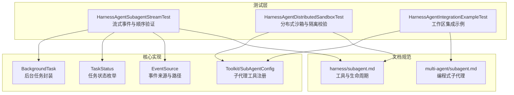
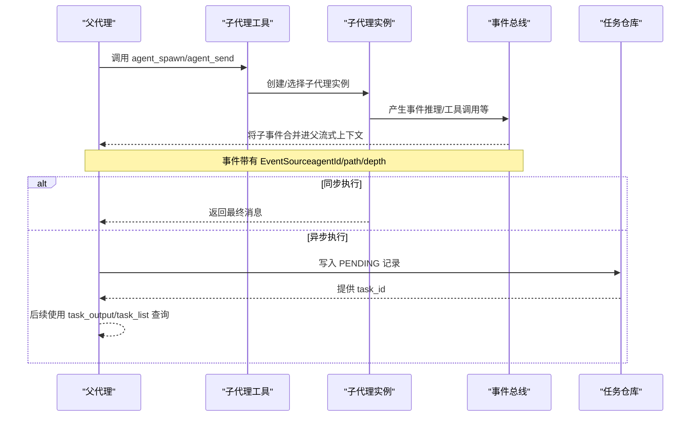
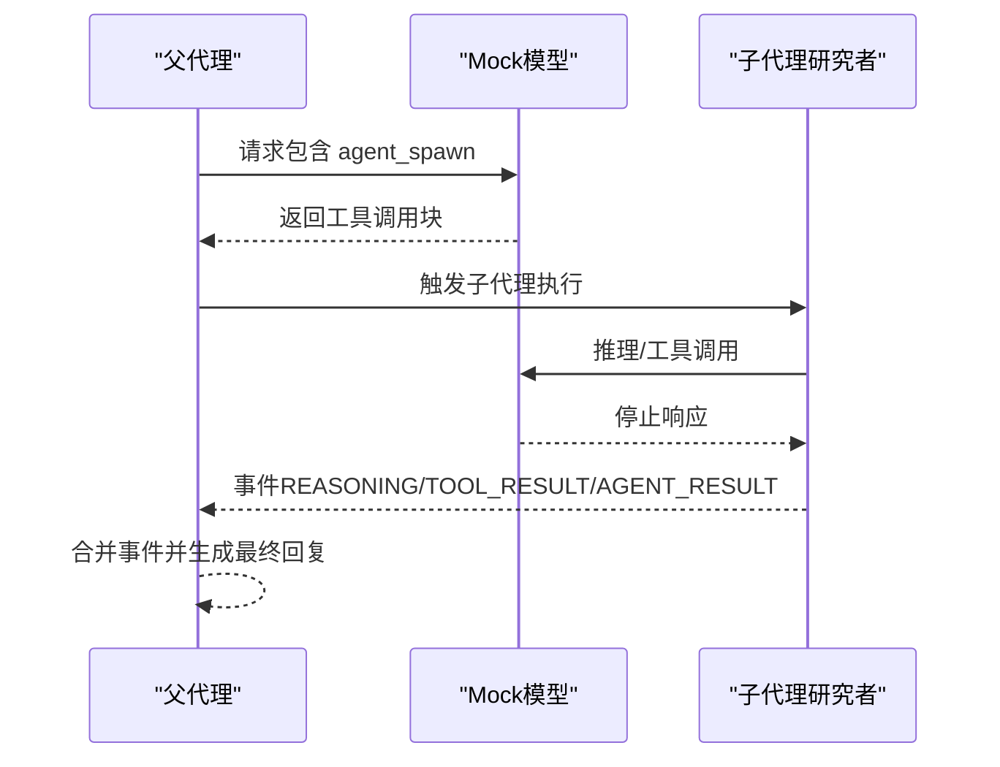
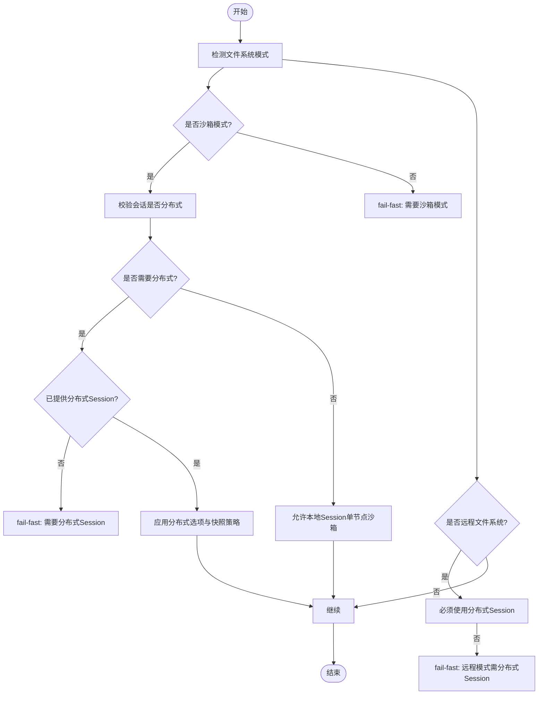
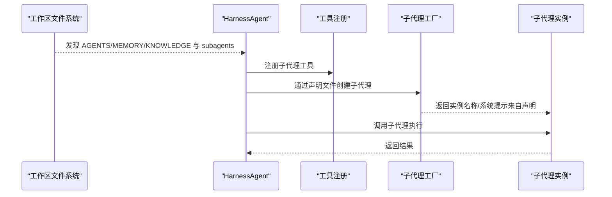
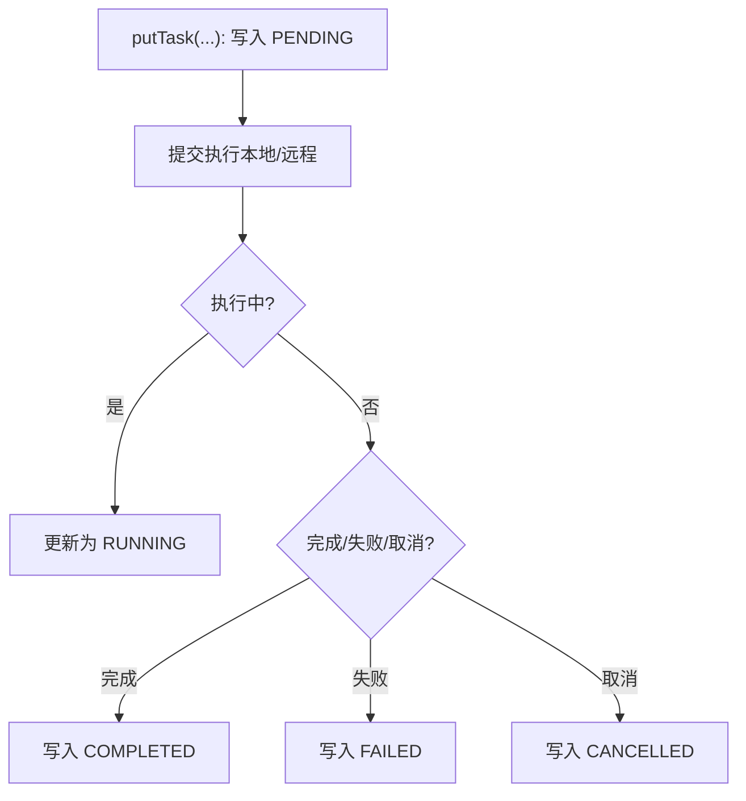
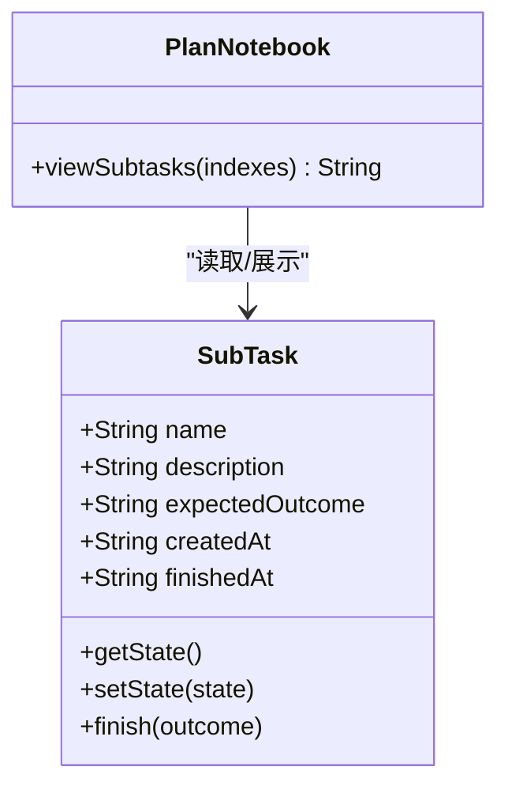
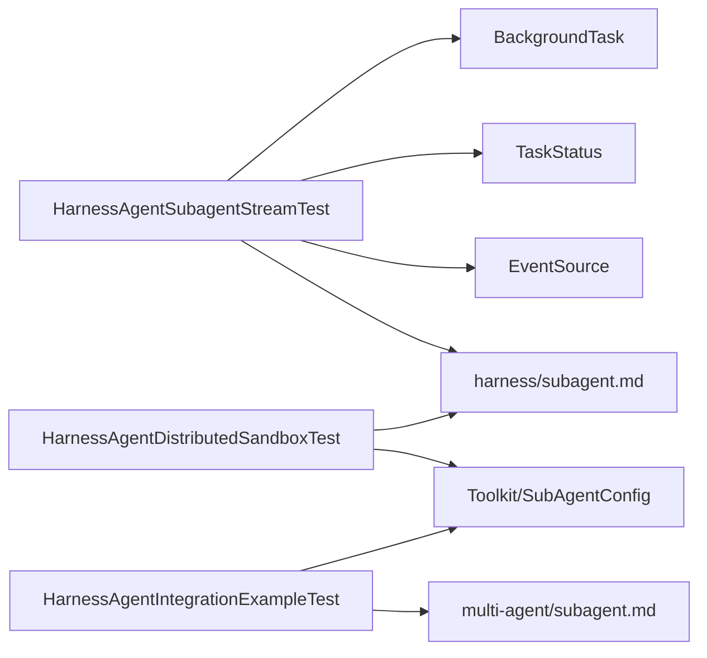

# 子代理测试

<cite>
**本文引用的文件**
- [HarnessAgentSubagentStreamTest.java](file://agentscope-harness/src/test/java/io/agentscope/harness/agent/HarnessAgentSubagentStreamTest.java)
- [HarnessAgentDistributedSandboxTest.java](file://agentscope-harness/src/test/java/io/agentscope/harness/agent/HarnessAgentDistributedSandboxTest.java)
- [HarnessAgentIntegrationExampleTest.java](file://agentscope-harness/src/test/java/io/agentscope/harness/agent/HarnessAgentIntegrationExampleTest.java)
- [BackgroundTask.java](file://agentscope-harness/src/main/java/io/agentscope/harness/agent/subagent/task/BackgroundTask.java)
- [TaskStatus.java](file://agentscope-harness/src/main/java/io/agentscope/harness/agent/subagent/task/TaskStatus.java)
- [EventSource.java](file://agentscope-core/src/main/java/io/agentscope/core/agent/EventSource.java)
- [Toolkit.java](file://agentscope-core/src/main/java/io/agentscope/core/tool/Toolkit.java)
- [SubAgentConfig.java](file://agentscope-core/src/main/java/io/agentscope/core/tool/subagent/SubAgentConfig.java)
- [subagent.md（Harnessed 子代理）](file://docs/en/harness/subagent.md)
- [subagent.md（多智能体子代理）](file://docs/en/multi-agent/subagent.md)
- [PlanNotebook.java](file://agentscope-core/src/main/java/io/agentscope/core/plan/PlanNotebook.java)
- [SubTaskTest.java](file://agentscope-core/src/test/java/io/agentscope/core/plan/model/SubTaskTest.java)
</cite>

## 目录
1. [引言](#引言)
2. [项目结构](#项目结构)
3. [核心组件](#核心组件)
4. [架构总览](#架构总览)
5. [详细组件分析](#详细组件分析)
6. [依赖分析](#依赖分析)
7. [性能考虑](#性能考虑)
8. [故障排查指南](#故障排查指南)
9. [结论](#结论)
10. [附录](#附录)

## 引言
本技术文档聚焦于子代理测试模块，系统性阐述子代理在工作区中的声明与运行、任务仓库与后台任务管理、生命周期与状态同步、子代理间通信与隔离、以及分布式场景下的测试策略与调试技巧。文档以仓库中现有的测试用例与核心实现为依据，结合官方文档，帮助读者快速掌握子代理测试的关键点与最佳实践。

## 项目结构
围绕子代理测试的相关代码主要分布在以下位置：
- 测试层：agentscope-harness 模块下的多个集成与单元测试，覆盖流式事件转发、分布式沙箱模式、工作区集成示例等。
- 核心实现：agentscope-harness 的后台任务模型与状态枚举；agentscope-core 的事件来源、工具注册与子代理配置；官方文档对子代理行为的规范与参数说明。

**图表来源**
- [HarnessAgentSubagentStreamTest.java:1-461](file://agentscope-harness/src/test/java/io/agentscope/harness/agent/HarnessAgentSubagentStreamTest.java#L1-L461)
- [HarnessAgentDistributedSandboxTest.java:1-206](file://agentscope-harness/src/test/java/io/agentscope/harness/agent/HarnessAgentDistributedSandboxTest.java#L1-L206)
- [HarnessAgentIntegrationExampleTest.java:1-264](file://agentscope-harness/src/test/java/io/agentscope/harness/agent/HarnessAgentIntegrationExampleTest.java#L1-L264)
- [BackgroundTask.java:1-153](file://agentscope-harness/src/main/java/io/agentscope/harness/agent/subagent/task/BackgroundTask.java#L1-L153)
- [TaskStatus.java:1-37](file://agentscope-harness/src/main/java/io/agentscope/harness/agent/subagent/task/TaskStatus.java#L1-L37)
- [EventSource.java:45-67](file://agentscope-core/src/main/java/io/agentscope/core/agent/EventSource.java#L45-L67)
- [Toolkit.java:848-864](file://agentscope-core/src/main/java/io/agentscope/core/tool/Toolkit.java#L848-L864)
- [subagent.md（Harnessed 子代理）:171-241](file://docs/en/harness/subagent.md#L171-L241)
- [subagent.md（多智能体子代理）:66-131](file://docs/en/multi-agent/subagent.md#L66-L131)

**章节来源**
- [HarnessAgentSubagentStreamTest.java:1-461](file://agentscope-harness/src/test/java/io/agentscope/harness/agent/HarnessAgentSubagentStreamTest.java#L1-L461)
- [HarnessAgentDistributedSandboxTest.java:1-206](file://agentscope-harness/src/test/java/io/agentscope/harness/agent/HarnessAgentDistributedSandboxTest.java#L1-L206)
- [HarnessAgentIntegrationExampleTest.java:1-264](file://agentscope-harness/src/test/java/io/agentscope/harness/agent/HarnessAgentIntegrationExampleTest.java#L1-L264)
- [BackgroundTask.java:1-153](file://agentscope-harness/src/main/java/io/agentscope/harness/agent/subagent/task/BackgroundTask.java#L1-L153)
- [TaskStatus.java:1-37](file://agentscope-harness/src/main/java/io/agentscope/harness/agent/subagent/task/TaskStatus.java#L1-L37)
- [EventSource.java:45-67](file://agentscope-core/src/main/java/io/agentscope/core/agent/EventSource.java#L45-L67)
- [Toolkit.java:848-864](file://agentscope-core/src/main/java/io/agentscope/core/tool/Toolkit.java#L848-L864)
- [subagent.md（Harnessed 子代理）:171-241](file://docs/en/harness/subagent.md#L171-L241)
- [subagent.md（多智能体子代理）:66-131](file://docs/en/multi-agent/subagent.md#L66-L131)

## 核心组件
- 后台任务与状态
  - BackgroundTask：封装异步执行的 CompletableFuture，提供任务状态查询、结果/错误读取、取消与阻塞等待能力，包含创建时间、最后检查时间等元数据。
  - TaskStatus：定义 PENDING/RUNNING/COMPLETED/FAILED/CANCELLED 状态及“终止态”判定，便于跳过冗余轮询。
- 事件来源与路径
  - EventSource：携带 agentId、sessionId、parentSessionId、taskId、depth、path 等字段，支持路径拼接与深度计算，确保事件可追溯。
- 工具注册与子代理配置
  - Toolkit.subAgent(...)：将子代理注册为工具，支持自定义工具名、描述、是否转发事件、流式选项与会话。
  - SubAgentConfig：提供默认配置与构建器，控制子代理工具的行为边界与运行环境。

**章节来源**
- [BackgroundTask.java:1-153](file://agentscope-harness/src/main/java/io/agentscope/harness/agent/subagent/task/BackgroundTask.java#L1-L153)
- [TaskStatus.java:1-37](file://agentscope-harness/src/main/java/io/agentscope/harness/agent/subagent/task/TaskStatus.java#L1-L37)
- [EventSource.java:45-67](file://agentscope-core/src/main/java/io/agentscope/core/agent/EventSource.java#L45-L67)
- [Toolkit.java:848-864](file://agentscope-core/src/main/java/io/agentscope/core/tool/Toolkit.java#L848-L864)
- [SubAgentConfig.java:63-113](file://agentscope-core/src/main/java/io/agentscope/core/tool/subagent/SubAgentConfig.java#L63-L113)

## 架构总览
下图展示了子代理测试涉及的关键交互：父代理通过工具调用触发子代理，子代理在本地或远程执行，事件在流式通道中被转发到父代理上下文，后台任务负责跟踪异步任务的状态与结果。

**图表来源**
- [HarnessAgentSubagentStreamTest.java:95-205](file://agentscope-harness/src/test/java/io/agentscope/harness/agent/HarnessAgentSubagentStreamTest.java#L95-L205)
- [subagent.md（Harnessed 子代理）:171-206](file://docs/en/harness/subagent.md#L171-L206)
- [EventSource.java:45-67](file://agentscope-core/src/main/java/io/agentscope/core/agent/EventSource.java#L45-L67)

**章节来源**
- [HarnessAgentSubagentStreamTest.java:95-205](file://agentscope-harness/src/test/java/io/agentscope/harness/agent/HarnessAgentSubagentStreamTest.java#L95-L205)
- [subagent.md（Harnessed 子代理）:171-206](file://docs/en/harness/subagent.md#L171-L206)

## 详细组件分析

### 组件A：子代理流式事件与顺序测试
- 目标
  - 验证同步本地子代理调用时，子代理产生的事件被正确转发到父代理的流式上下文中，并带有非空的 EventSource（包含 agentId、path、depth、agentKey、sessionId 等）。
  - 验证事件顺序：parent → child → parent。
  - 验证 call() 非流式路径不受事件总线影响，返回单一最终消息。
- 关键断言
  - 收集到的事件列表中存在 source != null 的子事件条目。
  - EventSource 的 agentId 与 path 包含子代理标识，depth ≥ 1。
  - 最终 AGENT_RESULT 出现在子事件之后。
  - call() 返回的消息文本包含最终回复。
- 实现要点
  - 使用 Mock Model 串联父→子→父的多次响应，模拟工具调用与停止原因。
  - 通过 Workspace 中的子代理声明文件驱动子代理工厂创建。

**图表来源**
- [HarnessAgentSubagentStreamTest.java:95-205](file://agentscope-harness/src/test/java/io/agentscope/harness/agent/HarnessAgentSubagentStreamTest.java#L95-L205)

**章节来源**
- [HarnessAgentSubagentStreamTest.java:95-205](file://agentscope-harness/src/test/java/io/agentscope/harness/agent/HarnessAgentSubagentStreamTest.java#L95-L205)

### 组件B：分布式沙箱与隔离测试
- 目标
  - 验证在不同文件系统模式下，分布式会话与快照策略的约束与生效。
  - 验证在需要分布式模式时，若未满足条件则 fail-fast。
- 关键断言
  - 使用本地文件系统且启用分布式沙箱时应抛出异常（提示需沙箱模式）。
  - 在沙箱模式下，默认要求分布式会话后，仍需显式提供分布式 Session 才能通过。
  - 远程文件系统模式必须使用分布式 Session，否则 fail-fast。
  - 开启分布式沙箱后，隔离范围与快照策略可按配置覆盖。
- 实现要点
  - 通过 Builder 的 filesystem 与 sandboxDistributed 选项组合，触发不同校验分支。
  - 使用 Mock Session 与 Store 驱动校验逻辑。

**图表来源**
- [HarnessAgentDistributedSandboxTest.java:47-171](file://agentscope-harness/src/test/java/io/agentscope/harness/agent/HarnessAgentDistributedSandboxTest.java#L47-L171)

**章节来源**
- [HarnessAgentDistributedSandboxTest.java:47-171](file://agentscope-harness/src/test/java/io/agentscope/harness/agent/HarnessAgentDistributedSandboxTest.java#L47-L171)

### 组件C：工作区集成与子代理工厂测试
- 目标
  - 验证工作区文件发现与注入（AGENTS.md、MEMORY.md、KNOWLEDGE.md、subagents/*）对模型输入的影响。
  - 验证子代理工厂根据 Markdown 规范创建的子代理具备正确的名称与系统提示。
- 关键断言
  - 模型收到的系统提示包含会话上下文、领域知识、工作区内容与子代理清单。
  - 子代理工厂创建的实例名称与系统提示符合声明文件。
- 实现要点
  - 在临时目录下创建标准工作区布局，构建 HarnessAgent 并发起一次对话。
  - 使用 ArgumentCaptor 捕获模型输入，断言关键片段存在。

**图表来源**
- [HarnessAgentIntegrationExampleTest.java:78-170](file://agentscope-harness/src/test/java/io/agentscope/harness/agent/HarnessAgentIntegrationExampleTest.java#L78-L170)
- [subagent.md（多智能体子代理）:66-131](file://docs/en/multi-agent/subagent.md#L66-L131)

**章节来源**
- [HarnessAgentIntegrationExampleTest.java:78-170](file://agentscope-harness/src/test/java/io/agentscope/harness/agent/HarnessAgentIntegrationExampleTest.java#L78-L170)
- [subagent.md（多智能体子代理）:66-131](file://docs/en/multi-agent/subagent.md#L66-L131)

### 组件D：后台任务仓库与状态同步
- 生命周期与存储
  - 默认使用 WorkspaceTaskRepository；生命周期简化为：写入 PENDING → 提交执行 → 更新 RUNNING → 完成后写入 COMPLETED/FAILED/CANCELLED。
  - 存储分层：内存层 localTasks（节点本地加速，重启丢失）与持久层 agents/<parentId>/tasks/<sessionId>.json（真实来源）。
- 分布式语义
  - 任务执行粘滞到创建节点，但任何节点可通过工作区读取状态。
  - task_output(block=true) 在跨节点场景下优雅降级，不会无限阻塞。
  - task_cancel 持久化 cancelRequested=true，执行节点轮询后主动中止。
  - 长时间无心跳的本地任务被清理器标记为 FAILED（远程传输任务不受此检查）。
- 工具参考
  - agent_spawn/agent_send/agent_list/task_output/task_cancel/task_list 的关键参数与行为。

**图表来源**
- [subagent.md（Harnessed 子代理）:189-222](file://docs/en/harness/subagent.md#L189-L222)
- [BackgroundTask.java:76-91](file://agentscope-harness/src/main/java/io/agentscope/harness/agent/subagent/task/BackgroundTask.java#L76-L91)

**章节来源**
- [subagent.md（Harnessed 子代理）:189-222](file://docs/en/harness/subagent.md#L189-L222)
- [BackgroundTask.java:76-91](file://agentscope-harness/src/main/java/io/agentscope/harness/agent/subagent/task/BackgroundTask.java#L76-L91)

### 组件E：任务调度与状态同步（计划与子任务）
- 子任务模型
  - SubTask 默认构造与参数化构造，初始状态为 TODO；支持设置创建/完成时间、finish() 与状态转换。
- 计划笔记本工具
  - view_subtasks 工具用于查看指定索引的子任务详情，便于测试中验证子任务状态与输出格式。

**图表来源**
- [SubTaskTest.java:28-230](file://agentscope-core/src/test/java/io/agentscope/core/plan/model/SubTaskTest.java#L28-L230)
- [PlanNotebook.java:744-774](file://agentscope-core/src/main/java/io/agentscope/core/plan/PlanNotebook.java#L744-L774)

**章节来源**
- [SubTaskTest.java:28-230](file://agentscope-core/src/test/java/io/agentscope/core/plan/model/SubTaskTest.java#L28-L230)
- [PlanNotebook.java:744-774](file://agentscope-core/src/main/java/io/agentscope/core/plan/PlanNotebook.java#L744-L774)

## 依赖分析
- 组件耦合
  - 测试用例依赖核心实现（BackgroundTask、TaskStatus、EventSource、Toolkit/SubAgentConfig），并通过文档规范（harness/subagent.md、multi-agent/subagent.md）对行为进行约束。
- 外部依赖与集成点
  - 文件系统模式（本地/远程/沙箱）与会话后端（本地/分布式）的选择直接影响构建阶段的校验与运行时行为。
  - 工具注册（Toolkit.subAgent）与子代理配置（SubAgentConfig）决定子代理工具的可用性与运行边界。

**图表来源**
- [HarnessAgentSubagentStreamTest.java:1-461](file://agentscope-harness/src/test/java/io/agentscope/harness/agent/HarnessAgentSubagentStreamTest.java#L1-L461)
- [HarnessAgentDistributedSandboxTest.java:1-206](file://agentscope-harness/src/test/java/io/agentscope/harness/agent/HarnessAgentDistributedSandboxTest.java#L1-L206)
- [HarnessAgentIntegrationExampleTest.java:1-264](file://agentscope-harness/src/test/java/io/agentscope/harness/agent/HarnessAgentIntegrationExampleTest.java#L1-L264)
- [BackgroundTask.java:1-153](file://agentscope-harness/src/main/java/io/agentscope/harness/agent/subagent/task/BackgroundTask.java#L1-L153)
- [TaskStatus.java:1-37](file://agentscope-harness/src/main/java/io/agentscope/harness/agent/subagent/task/TaskStatus.java#L1-L37)
- [EventSource.java:45-67](file://agentscope-core/src/main/java/io/agentscope/core/agent/EventSource.java#L45-L67)
- [Toolkit.java:848-864](file://agentscope-core/src/main/java/io/agentscope/core/tool/Toolkit.java#L848-L864)
- [subagent.md（Harnessed 子代理）:171-241](file://docs/en/harness/subagent.md#L171-L241)
- [subagent.md（多智能体子代理）:66-131](file://docs/en/multi-agent/subagent.md#L66-L131)

**章节来源**
- [HarnessAgentSubagentStreamTest.java:1-461](file://agentscope-harness/src/test/java/io/agentscope/harness/agent/HarnessAgentSubagentStreamTest.java#L1-L461)
- [HarnessAgentDistributedSandboxTest.java:1-206](file://agentscope-harness/src/test/java/io/agentscope/harness/agent/HarnessAgentDistributedSandboxTest.java#L1-L206)
- [HarnessAgentIntegrationExampleTest.java:1-264](file://agentscope-harness/src/test/java/io/agentscope/harness/agent/HarnessAgentIntegrationExampleTest.java#L1-L264)
- [BackgroundTask.java:1-153](file://agentscope-harness/src/main/java/io/agentscope/harness/agent/subagent/task/BackgroundTask.java#L1-L153)
- [TaskStatus.java:1-37](file://agentscope-harness/src/main/java/io/agentscope/harness/agent/subagent/task/TaskStatus.java#L1-L37)
- [EventSource.java:45-67](file://agentscope-core/src/main/java/io/agentscope/core/agent/EventSource.java#L45-L67)
- [Toolkit.java:848-864](file://agentscope-core/src/main/java/io/agentscope/core/tool/Toolkit.java#L848-L864)
- [subagent.md（Harnessed 子代理）:171-241](file://docs/en/harness/subagent.md#L171-L241)
- [subagent.md（多智能体子代理）:66-131](file://docs/en/multi-agent/subagent.md#L66-L131)

## 性能考虑
- 事件聚合与流式处理
  - 子事件在父代理流中被合并，建议在父代理侧对事件进行批处理与去重，避免重复渲染或重复计算。
- 任务轮询与超时
  - 对于后台任务，优先使用非阻塞轮询（如 task_list 或 task_output(block=false)），并在长时间无进展时设置合理超时，防止阻塞主线程。
- 会话与上下文注入
  - 工作区上下文（AGENTS/MEMORY/KNOWLEDGE）过大可能增加模型输入长度，建议在集成测试中控制注入规模，或使用压缩/截断策略。

## 故障排查指南
- 事件来源缺失或路径不正确
  - 现象：子事件的 EventSource 为空或 path 不包含子代理标识。
  - 排查：确认子代理工具已注册（agent_spawn），并检查 EventSource 的 withAppendedPath 与深度计算逻辑。
- 分布式模式校验失败
  - 现象：构建阶段抛出异常，提示需要沙箱模式或分布式 Session。
  - 排查：根据文件系统模式（本地/远程/沙箱）选择合适的 Session 与快照策略，必要时关闭分布式严格校验（仅限单节点沙箱）。
- 后台任务状态异常
  - 现象：任务状态长期停留在 RUNNING，或取消无效。
  - 排查：确认任务仓库写入流程与取消标志持久化；检查执行节点的心跳与轮询逻辑；在跨节点场景下使用 task_output 的优雅降级策略。
- 工作区上下文未注入
  - 现象：模型输入缺少会话上下文、领域知识或子代理清单。
  - 排查：确认工作区文件命名与目录结构符合约定；检查工具注册与工厂创建流程。

**章节来源**
- [HarnessAgentSubagentStreamTest.java:361-409](file://agentscope-harness/src/test/java/io/agentscope/harness/agent/HarnessAgentSubagentStreamTest.java#L361-L409)
- [HarnessAgentDistributedSandboxTest.java:47-107](file://agentscope-harness/src/test/java/io/agentscope/harness/agent/HarnessAgentDistributedSandboxTest.java#L47-L107)
- [subagent.md（Harnessed 子代理）:189-222](file://docs/en/harness/subagent.md#L189-L222)

## 结论
通过对子代理测试模块的系统梳理，可以形成一套完整的测试策略：以流式事件转发与顺序为核心验证点，结合分布式沙箱与工作区集成示例，覆盖生命周期、任务仓库、状态同步与隔离机制。配合后台任务状态模型与计划子任务工具，能够有效验证子代理在同步与异步场景下的行为一致性与鲁棒性。

## 附录
- 配置与调试建议
  - 测试中优先使用临时工作区与 Mock 模型，减少对外部资源的依赖。
  - 在分布式场景下，明确文件系统模式与会话后端的组合，避免 fail-fast。
  - 对后台任务，建议先返回 task_id，再通过 task_output 或 task_list 轮询，避免阻塞用户交互。
- 任务依赖关系验证
  - 可通过在父代理中编排多个 agent_spawn/agent_send 调用，结合子任务视图工具（view_subtasks）与事件来源（EventSource.path）验证依赖链路与执行顺序。