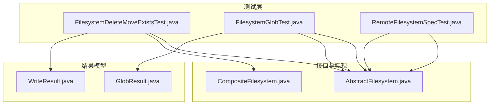
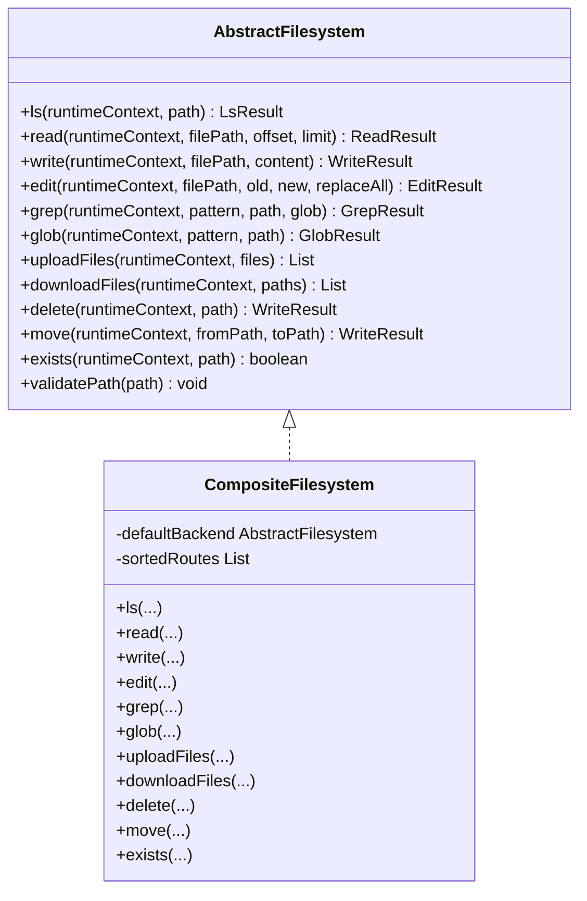
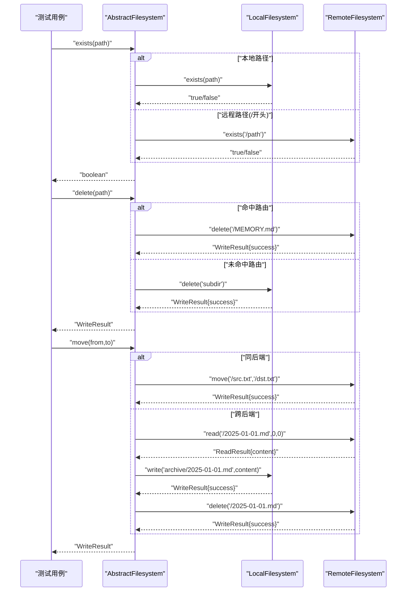
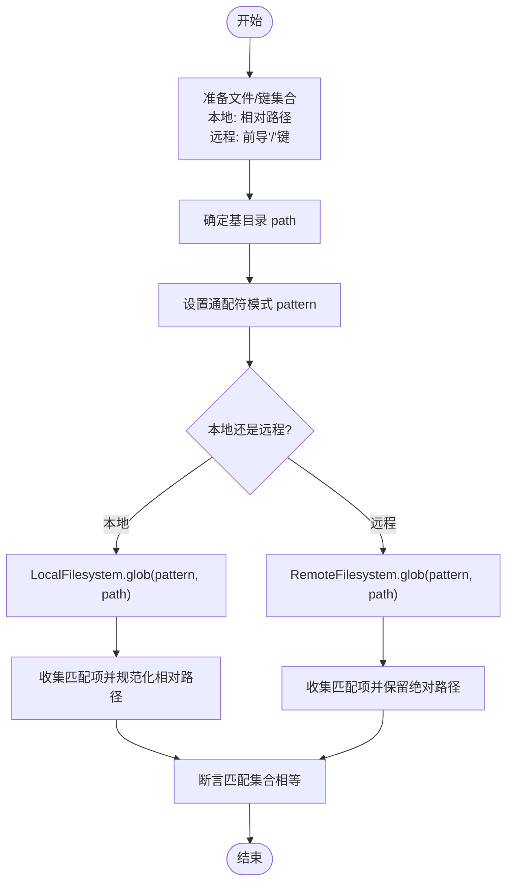
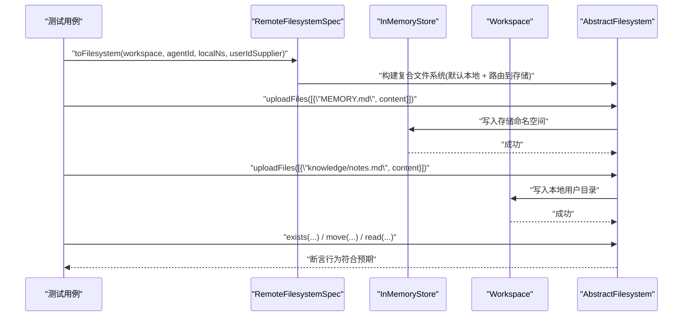
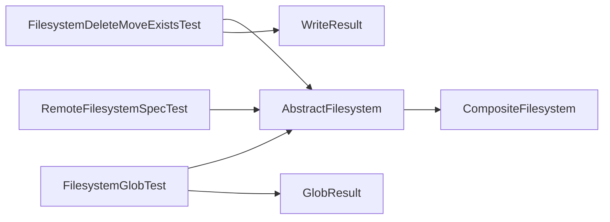

# 文件系统测试

<cite>
**本文引用的文件**
- [FilesystemDeleteMoveExistsTest.java](file://agentscope-harness/src/test/java/io/agentscope/harness/agent/filesystem/FilesystemDeleteMoveExistsTest.java)
- [FilesystemGlobTest.java](file://agentscope-harness/src/test/java/io/agentscope/harness/agent/filesystem/FilesystemGlobTest.java)
- [RemoteFilesystemSpecTest.java](file://agentscope-harness/src/test/java/io/agentscope/harness/agent/filesystem/RemoteFilesystemSpecTest.java)
- [AbstractFilesystem.java](file://agentscope-harness/src/main/java/io/agentscope/harness/agent/filesystem/AbstractFilesystem.java)
- [CompositeFilesystem.java](file://agentscope-harness/src/main/java/io/agentscope/harness/agent/filesystem/CompositeFilesystem.java)
- [WriteResult.java](file://agentscope-harness/src/main/java/io/agentscope/harness/agent/filesystem/model/WriteResult.java)
- [GlobResult.java](file://agentscope-harness/src/main/java/io/agentscope/harness/agent/filesystem/model/GlobResult.java)
- [filesystem.md](file://docs/en/harness/filesystem.md)
</cite>

## 目录
1. [简介](#简介)
2. [项目结构](#项目结构)
3. [核心组件](#核心组件)
4. [架构总览](#架构总览)
5. [详细组件分析](#详细组件分析)
6. [依赖分析](#依赖分析)
7. [性能考虑](#性能考虑)
8. [故障排查指南](#故障排查指南)
9. [结论](#结论)
10. [附录](#附录)

## 简介
本技术文档聚焦于文件系统测试模块，系统化阐述本地文件系统测试、远程文件系统测试与文件系统规格测试的设计理念与实现机制。文档覆盖文件操作（删除、移动、存在性检查）与通配符匹配（glob）的测试策略，说明数据准备、测试环境配置与结果验证方法，并提供完整测试示例与最佳实践，涵盖边界条件与异常处理。

## 项目结构
文件系统测试位于 harness 模块的测试目录中，围绕抽象文件系统接口与多种具体实现（本地、远程、组合式）进行覆盖性测试；同时通过规格测试验证路由与命名空间策略在真实工作区中的行为。

图表来源
- [FilesystemDeleteMoveExistsTest.java:1-224](file://agentscope-harness/src/test/java/io/agentscope/harness/agent/filesystem/FilesystemDeleteMoveExistsTest.java#L1-L224)
- [FilesystemGlobTest.java:1-80](file://agentscope-harness/src/test/java/io/agentscope/harness/agent/filesystem/FilesystemGlobTest.java#L1-L80)
- [RemoteFilesystemSpecTest.java:1-101](file://agentscope-harness/src/test/java/io/agentscope/harness/agent/filesystem/RemoteFilesystemSpecTest.java#L1-L101)
- [AbstractFilesystem.java:1-187](file://agentscope-harness/src/main/java/io/agentscope/harness/agent/filesystem/AbstractFilesystem.java#L1-L187)
- [CompositeFilesystem.java:1-431](file://agentscope-harness/src/main/java/io/agentscope/harness/agent/filesystem/CompositeFilesystem.java#L1-L431)
- [WriteResult.java:1-38](file://agentscope-harness/src/main/java/io/agentscope/harness/agent/filesystem/model/WriteResult.java#L1-L38)
- [GlobResult.java:1-40](file://agentscope-harness/src/main/java/io/agentscope/harness/agent/filesystem/model/GlobResult.java#L1-L40)

章节来源
- [FilesystemDeleteMoveExistsTest.java:1-224](file://agentscope-harness/src/test/java/io/agentscope/harness/agent/filesystem/FilesystemDeleteMoveExistsTest.java#L1-L224)
- [FilesystemGlobTest.java:1-80](file://agentscope-harness/src/test/java/io/agentscope/harness/agent/filesystem/FilesystemGlobTest.java#L1-L80)
- [RemoteFilesystemSpecTest.java:1-101](file://agentscope-harness/src/test/java/io/agentscope/harness/agent/filesystem/RemoteFilesystemSpecTest.java#L1-L101)

## 核心组件
- 抽象文件系统接口：定义统一的文件操作契约，包括列出、读取、写入、编辑、搜索、通配符匹配、上传下载、删除、移动与存在性检查等能力，并提供路径校验工具。
- 组合式文件系统：基于最长前缀匹配对不同后端（本地/远程/内存存储）进行路由，支持跨后端移动回退为“读+写+删”序列。
- 测试用例：覆盖本地与远程实现的存在性检查、删除（含幂等）、递归删除、移动（含缺失源场景），以及通配符匹配在本地与远程的差异与一致性。
- 规格测试：验证远程文件系统在工作区隔离下的命名空间解析与路由策略，确保共享路径进入存储、其他路径进入本地工作区。

章节来源
- [AbstractFilesystem.java:32-186](file://agentscope-harness/src/main/java/io/agentscope/harness/agent/filesystem/AbstractFilesystem.java#L32-L186)
- [CompositeFilesystem.java:37-60](file://agentscope-harness/src/main/java/io/agentscope/harness/agent/filesystem/CompositeFilesystem.java#L37-L60)
- [FilesystemDeleteMoveExistsTest.java:35-224](file://agentscope-harness/src/test/java/io/agentscope/harness/agent/filesystem/FilesystemDeleteMoveExistsTest.java#L35-L224)
- [FilesystemGlobTest.java:35-80](file://agentscope-harness/src/test/java/io/agentscope/harness/agent/filesystem/FilesystemGlobTest.java#L35-L80)
- [RemoteFilesystemSpecTest.java:35-101](file://agentscope-harness/src/test/java/io/agentscope/harness/agent/filesystem/RemoteFilesystemSpecTest.java#L35-L101)

## 架构总览
下图展示测试所覆盖的核心类型与交互关系，强调组合式文件系统的路由与跨后端移动策略。

图表来源
- [AbstractFilesystem.java:44-186](file://agentscope-harness/src/main/java/io/agentscope/harness/agent/filesystem/AbstractFilesystem.java#L44-L186)
- [CompositeFilesystem.java:61-431](file://agentscope-harness/src/main/java/io/agentscope/harness/agent/filesystem/CompositeFilesystem.java#L61-L431)

## 详细组件分析

### 删除、移动与存在性检查测试
该测试套件验证所有文件系统实现的删除、移动与存在性检查行为，覆盖本地与远程两种模式，并包含组合式文件系统的路由与跨后端移动。

- 本地文件系统（非虚拟模式，相对路径）
  - 存在性检查：存在返回真，不存在返回假。
  - 删除：文件删除成功且文件不存在；目录递归删除成功；对不存在文件的删除幂等成功。
  - 移动：成功重命名；缺失源文件时移动失败。
- 远程文件系统（键带前导斜杠约定）
  - 存在性检查：符合远程键规范；删除后键不存在；移动后源键移除、目标键存在；缺失源键时移动失败。
- 组合式文件系统
  - 路由：根据最长前缀匹配选择后端；未匹配则走默认后端。
  - 删除：命中路由的路径调用对应后端删除，返回统一绝对路径；否则走默认后端。
  - 移动：同后端内移动直接委托；跨后端移动采用“读+写+删”回退策略，源路径内容写入目标路径，再删除源路径。

图表来源
- [FilesystemDeleteMoveExistsTest.java:49-222](file://agentscope-harness/src/test/java/io/agentscope/harness/agent/filesystem/FilesystemDeleteMoveExistsTest.java#L49-L222)
- [CompositeFilesystem.java:378-412](file://agentscope-harness/src/main/java/io/agentscope/harness/agent/filesystem/CompositeFilesystem.java#L378-L412)

章节来源
- [FilesystemDeleteMoveExistsTest.java:49-222](file://agentscope-harness/src/test/java/io/agentscope/harness/agent/filesystem/FilesystemDeleteMoveExistsTest.java#L49-L222)
- [CompositeFilesystem.java:378-412](file://agentscope-harness/src/main/java/io/agentscope/harness/agent/filesystem/CompositeFilesystem.java#L378-L412)

### 通配符匹配（glob）测试
该测试验证本地与远程文件系统在给定基目录与通配符模式下的匹配行为，确保返回的匹配项集合正确且路径格式一致。

- 本地 glob：从指定基目录开始递归匹配，返回相对工作区的路径集合。
- 远程 glob：从指定基目录开始递归匹配，返回以“/”开头的绝对路径集合。

图表来源
- [FilesystemGlobTest.java:40-78](file://agentscope-harness/src/test/java/io/agentscope/harness/agent/filesystem/FilesystemGlobTest.java#L40-L78)

章节来源
- [FilesystemGlobTest.java:40-78](file://agentscope-harness/src/test/java/io/agentscope/harness/agent/filesystem/FilesystemGlobTest.java#L40-L78)

### 文件系统规格测试（远程路由与命名空间）
该测试验证远程文件系统规格在工作区隔离下的行为，确保共享路径进入存储、其他路径进入本地工作区，并且命名空间可按运行时用户 ID 解析。

- 共享路径路由：将“MEMORY.md”上传到存储命名空间；其他路径上传到本地工作区用户目录。
- 用户 ID 解析：通过运行时上下文中的用户 ID 决定命名空间分支。
- 非沙箱模式：生成的复合文件系统不是沙箱文件系统，因此不注册 Shell 执行工具。

图表来源
- [RemoteFilesystemSpecTest.java:41-99](file://agentscope-harness/src/test/java/io/agentscope/harness/agent/filesystem/RemoteFilesystemSpecTest.java#L41-L99)

章节来源
- [RemoteFilesystemSpecTest.java:41-99](file://agentscope-harness/src/test/java/io/agentscope/harness/agent/filesystem/RemoteFilesystemSpecTest.java#L41-L99)

## 依赖分析
- 测试对抽象接口的依赖：所有测试均通过 AbstractFilesystem 接口进行调用，保证对本地、远程与组合式实现的一致性验证。
- 组合式文件系统的路由与跨后端移动：依赖最长前缀匹配与路径重映射，确保返回路径与原始调用路径一致。
- 结果模型：删除与移动使用 WriteResult 表征成功/失败；glob 使用 GlobResult 表征匹配列表或错误信息。

图表来源
- [FilesystemDeleteMoveExistsTest.java:23-33](file://agentscope-harness/src/test/java/io/agentscope/harness/agent/filesystem/FilesystemDeleteMoveExistsTest.java#L23-L33)
- [FilesystemGlobTest.java:21-33](file://agentscope-harness/src/test/java/io/agentscope/harness/agent/filesystem/FilesystemGlobTest.java#L21-L33)
- [RemoteFilesystemSpecTest.java:22-33](file://agentscope-harness/src/test/java/io/agentscope/harness/agent/filesystem/RemoteFilesystemSpecTest.java#L22-L33)
- [AbstractFilesystem.java:44-186](file://agentscope-harness/src/main/java/io/agentscope/harness/agent/filesystem/AbstractFilesystem.java#L44-L186)
- [CompositeFilesystem.java:61-431](file://agentscope-harness/src/main/java/io/agentscope/harness/agent/filesystem/CompositeFilesystem.java#L61-L431)
- [WriteResult.java:24-37](file://agentscope-harness/src/main/java/io/agentscope/harness/agent/filesystem/model/WriteResult.java#L24-L37)
- [GlobResult.java:26-39](file://agentscope-harness/src/main/java/io/agentscope/harness/agent/filesystem/model/GlobResult.java#L26-L39)

章节来源
- [AbstractFilesystem.java:44-186](file://agentscope-harness/src/main/java/io/agentscope/harness/agent/filesystem/AbstractFilesystem.java#L44-L186)
- [CompositeFilesystem.java:61-431](file://agentscope-harness/src/main/java/io/agentscope/harness/agent/filesystem/CompositeFilesystem.java#L61-L431)
- [WriteResult.java:24-37](file://agentscope-harness/src/main/java/io/agentscope/harness/agent/filesystem/model/WriteResult.java#L24-L37)
- [GlobResult.java:26-39](file://agentscope-harness/src/main/java/io/agentscope/harness/agent/filesystem/model/GlobResult.java#L26-L39)

## 性能考虑
- 路由查找：CompositeFilesystem 对路由表按前缀长度降序排序，匹配时优先匹配最长前缀，避免多余扫描。
- 跨后端移动：采用“读+写+删”的回退策略，适合小文件；大文件建议在同后端内移动以减少网络往返。
- glob 与 grep：在未指定路径时，组合式文件系统会聚合默认后端与各路由后端的结果，注意在大规模存储上可能带来额外开销。
- 幂等删除：删除操作对不存在路径幂等成功，降低重复调用的错误风险。

## 故障排查指南
- 路径非法
  - 现象：抛出参数非法异常。
  - 原因：路径为空、空白或包含路径穿越片段。
  - 处理：确保传入绝对路径（以“/”开头），避免“..”片段。
- 跨后端移动失败
  - 现象：返回写入失败或无法读取源。
  - 原因：源后端读取失败、目标后端写入失败或源不存在。
  - 处理：先确认源路径存在与可读，再确认目标后端有写权限与足够空间。
- 远程键不存在
  - 现象：存在性检查返回假，移动/删除返回失败。
  - 原因：键未按“/”约定创建或已被删除。
  - 处理：确保键以“/”开头并在对应命名空间中创建。
- 命名空间解析错误
  - 现象：上传/下载未落到期望位置。
  - 原因：运行时用户 ID 未正确传递或命名空间工厂返回空。
  - 处理：检查用户 ID 提供器与命名空间工厂实现，确保每次操作都能解析到正确的命名空间。

章节来源
- [AbstractFilesystem.java:178-186](file://agentscope-harness/src/main/java/io/agentscope/harness/agent/filesystem/AbstractFilesystem.java#L178-L186)
- [CompositeFilesystem.java:394-412](file://agentscope-harness/src/main/java/io/agentscope/harness/agent/filesystem/CompositeFilesystem.java#L394-L412)
- [RemoteFilesystemSpecTest.java:67-80](file://agentscope-harness/src/test/java/io/agentscope/harness/agent/filesystem/RemoteFilesystemSpecTest.java#L67-L80)

## 结论
文件系统测试模块通过统一的抽象接口与多实现覆盖，确保删除、移动、存在性检查与通配符匹配在本地、远程与组合式场景下行为一致且可预测。规格测试进一步验证了命名空间与路由策略在真实工作区中的正确性。遵循本文的最佳实践与故障排查建议，可在复杂多后端环境中稳定地进行文件操作测试。

## 附录
- 最佳实践
  - 明确路径约定：本地使用相对路径，远程使用“/”开头的绝对键。
  - 幂等设计：删除与写入应具备幂等特性，减少重复调用带来的副作用。
  - 小心跨后端移动：优先在同后端内移动，避免大文件跨网络传输。
  - 命名空间隔离：通过运行时用户 ID 动态解析命名空间，确保多租户隔离。
- 参考文档
  - 文件系统类层次与工具注册说明：见 [filesystem.md:40-98](file://docs/en/harness/filesystem.md#L40-L98)