# 沙箱测试

<cite>
**本文引用的文件**
- [SandboxIsolationKeyTest.java](file://agentscope-harness/src/test/java/io/agentscope/harness/agent/sandbox/SandboxIsolationKeyTest.java)
- [SandboxManagerIsolationTest.java](file://agentscope-harness/src/test/java/io/agentscope/harness/agent/sandbox/SandboxManagerIsolationTest.java)
- [HarnessSandboxJacksonModuleTest.java](file://agentscope-harness/src/test/java/io/agentscope/harness/agent/sandbox/json/HarnessSandboxJacksonModuleTest.java)
- [RemoteSnapshotClientsTest.java](file://agentscope-harness/src/test/java/io/agentscope/harness/agent/sandbox/snapshot/RemoteSnapshotClientsTest.java)
- [SessionSandboxStateStoreTest.java](file://agentscope-harness/src/test/java/io/agentscope/harness/agent/sandbox/SessionSandboxStateStoreTest.java)
- [WorkspaceSandboxStateStoreTest.java](file://agentscope-harness/src/test/java/io/agentscope/harness/agent/sandbox/WorkspaceSandboxStateStoreTest.java)
- [WorkspaceMountSupportTest.java](file://agentscope-harness/src/test/java/io/agentscope/harness/agent/sandbox/WorkspaceMountSupportTest.java)
- [WorkspaceProjectionApplierTest.java](file://agentscope-harness/src/test/java/io/agentscope/harness/agent/sandbox/WorkspaceProjectionApplierTest.java)
- [KubernetesSandboxStateSerdeTest.java](file://agentscope-harness/src/test/java/io/agentscope/harness/agent/sandbox/impl/kubernetes/KubernetesSandboxStateSerdeTest.java)
- [E2bSnapshotRefsTest.java](file://agentscope-harness/src/test/java/io/agentscope/harness/agent/sandbox/impl/e2b/E2bSnapshotRefsTest.java)
- [HarnessAgentDistributedSandboxTest.java](file://agentscope-harness/src/test/java/io/agentscope/harness/agent/HarnessAgentDistributedSandboxTest.java)
</cite>

## 目录
1. [引言](#引言)
2. [项目结构](#项目结构)
3. [核心组件](#核心组件)
4. [架构总览](#架构总览)
5. [详细组件分析](#详细组件分析)
6. [依赖关系分析](#依赖关系分析)
7. [性能考量](#性能考量)
8. [故障排查指南](#故障排查指南)
9. [结论](#结论)
10. [附录](#附录)

## 引言
本文件面向沙箱测试模块，系统性梳理隔离键测试、沙箱管理器测试、JSON 序列化测试与快照客户端测试，并覆盖 Kubernetes 沙箱、E2B 沙箱与本地沙箱的测试方法；同时包含沙箱状态存储测试、工作区挂载支持测试与工作区投影应用测试的实现细节，以及分布式沙箱测试与状态一致性验证的配置与调试建议。

## 项目结构
沙箱测试主要集中在 agentscope-harness 的测试包下，围绕以下主题组织：
- 隔离键与管理器：SandboxIsolationKeyTest、SandboxManagerIsolationTest
- JSON 序列化：HarnessSandboxJacksonModuleTest
- 快照客户端：RemoteSnapshotClientsTest（OSS、Redis）
- 状态存储：SessionSandboxStateStoreTest、WorkspaceSandboxStateStoreTest
- 工作区能力：WorkspaceMountSupportTest、WorkspaceProjectionApplierTest
- 具体实现序列化：KubernetesSandboxStateSerdeTest、E2bSnapshotRefsTest
- 分布式沙箱集成：HarnessAgentDistributedSandboxTest

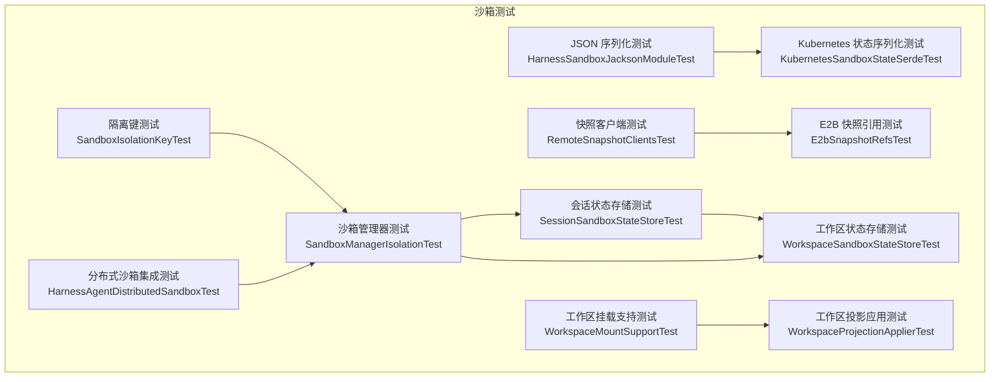

图表来源
- [SandboxIsolationKeyTest.java:1-139](file://agentscope-harness/src/test/java/io/agentscope/harness/agent/sandbox/SandboxIsolationKeyTest.java#L1-L139)
- [SandboxManagerIsolationTest.java:1-277](file://agentscope-harness/src/test/java/io/agentscope/harness/agent/sandbox/SandboxManagerIsolationTest.java#L1-L277)
- [HarnessSandboxJacksonModuleTest.java:1-47](file://agentscope-harness/src/test/java/io/agentscope/harness/agent/sandbox/json/HarnessSandboxJacksonModuleTest.java#L1-L47)
- [RemoteSnapshotClientsTest.java:1-83](file://agentscope-harness/src/test/java/io/agentscope/harness/agent/sandbox/snapshot/RemoteSnapshotClientsTest.java#L1-L83)
- [SessionSandboxStateStoreTest.java:1-111](file://agentscope-harness/src/test/java/io/agentscope/harness/agent/sandbox/SessionSandboxStateStoreTest.java#L1-L111)
- [WorkspaceSandboxStateStoreTest.java:1-235](file://agentscope-harness/src/test/java/io/agentscope/harness/agent/sandbox/WorkspaceSandboxStateStoreTest.java#L1-L235)
- [WorkspaceMountSupportTest.java:1-79](file://agentscope-harness/src/test/java/io/agentscope/harness/agent/sandbox/WorkspaceMountSupportTest.java#L1-L79)
- [WorkspaceProjectionApplierTest.java:1-92](file://agentscope-harness/src/test/java/io/agentscope/harness/agent/sandbox/WorkspaceProjectionApplierTest.java#L1-L92)
- [KubernetesSandboxStateSerdeTest.java:1-53](file://agentscope-harness/src/test/java/io/agentscope/harness/agent/sandbox/impl/kubernetes/KubernetesSandboxStateSerdeTest.java#L1-L53)
- [E2bSnapshotRefsTest.java:1-41](file://agentscope-harness/src/test/java/io/agentscope/harness/agent/sandbox/impl/e2b/E2bSnapshotRefsTest.java#L1-L41)
- [HarnessAgentDistributedSandboxTest.java:1-206](file://agentscope-harness/src/test/java/io/agentscope/harness/agent/HarnessAgentDistributedSandboxTest.java#L1-L206)

章节来源
- [SandboxIsolationKeyTest.java:1-139](file://agentscope-harness/src/test/java/io/agentscope/harness/agent/sandbox/SandboxIsolationKeyTest.java#L1-L139)
- [SandboxManagerIsolationTest.java:1-277](file://agentscope-harness/src/test/java/io/agentscope/harness/agent/sandbox/SandboxManagerIsolationTest.java#L1-L277)
- [HarnessSandboxJacksonModuleTest.java:1-47](file://agentscope-harness/src/test/java/io/agentscope/harness/agent/sandbox/json/HarnessSandboxJacksonModuleTest.java#L1-L47)
- [RemoteSnapshotClientsTest.java:1-83](file://agentscope-harness/src/test/java/io/agentscope/harness/agent/sandbox/snapshot/RemoteSnapshotClientsTest.java#L1-L83)
- [SessionSandboxStateStoreTest.java:1-111](file://agentscope-harness/src/test/java/io/agentscope/harness/agent/sandbox/SessionSandboxStateStoreTest.java#L1-L111)
- [WorkspaceSandboxStateStoreTest.java:1-235](file://agentscope-harness/src/test/java/io/agentscope/harness/agent/sandbox/WorkspaceSandboxStateStoreTest.java#L1-L235)
- [WorkspaceMountSupportTest.java:1-79](file://agentscope-harness/src/test/java/io/agentscope/harness/agent/sandbox/WorkspaceMountSupportTest.java#L1-L79)
- [WorkspaceProjectionApplierTest.java:1-92](file://agentscope-harness/src/test/java/io/agentscope/harness/agent/sandbox/WorkspaceProjectionApplierTest.java#L1-L92)
- [KubernetesSandboxStateSerdeTest.java:1-53](file://agentscope-harness/src/test/java/io/agentscope/harness/agent/sandbox/impl/kubernetes/KubernetesSandboxStateSerdeTest.java#L1-L53)
- [E2bSnapshotRefsTest.java:1-41](file://agentscope-harness/src/test/java/io/agentscope/harness/agent/sandbox/impl/e2b/E2bSnapshotRefsTest.java#L1-L41)
- [HarnessAgentDistributedSandboxTest.java:1-206](file://agentscope-harness/src/test/java/io/agentscope/harness/agent/HarnessAgentDistributedSandboxTest.java#L1-L206)

## 核心组件
- 隔离键与作用域解析：验证 SESSION/USER/AGENT/GLOBAL 不同作用域在运行时上下文缺失或为空时的行为，确保键解析正确且可哈希比较。
- 沙箱管理器与获取优先级：验证外部沙箱、显式状态、状态存储命中、新建沙箱等优先级路径，以及执行守卫与状态持久化/清理。
- JSON 序列化模块：验证沙箱状态对象的序列化/反序列化，确保多态类型保留。
- 快照客户端：验证 OSS 与 Redis 远端快照上传/下载/存在性判断，以及缺失键抛错行为。
- 状态存储：会话状态存储与工作区状态存储分别覆盖 SESSION/USER/AGENT/GLOBAL 多作用域读写与删除语义。
- 工作区能力：挂载支持与投影应用，验证绑定挂载排除参数、顶层挂载判定、容器挂载路径拼接，以及投影内容确定性与变更感知。
- 具体实现测试：Kubernetes 状态序列化与 E2B 快照 ID 编解码。
- 分布式沙箱：验证不同文件系统模式与会话后端的组合约束、快照覆盖与单节点豁免。

章节来源
- [SandboxIsolationKeyTest.java:28-139](file://agentscope-harness/src/test/java/io/agentscope/harness/agent/sandbox/SandboxIsolationKeyTest.java#L28-L139)
- [SandboxManagerIsolationTest.java:40-277](file://agentscope-harness/src/test/java/io/agentscope/harness/agent/sandbox/SandboxManagerIsolationTest.java#L40-L277)
- [HarnessSandboxJacksonModuleTest.java:26-47](file://agentscope-harness/src/test/java/io/agentscope/harness/agent/sandbox/json/HarnessSandboxJacksonModuleTest.java#L26-L47)
- [RemoteSnapshotClientsTest.java:35-83](file://agentscope-harness/src/test/java/io/agentscope/harness/agent/sandbox/snapshot/RemoteSnapshotClientsTest.java#L35-L83)
- [SessionSandboxStateStoreTest.java:29-111](file://agentscope-harness/src/test/java/io/agentscope/harness/agent/sandbox/SessionSandboxStateStoreTest.java#L29-L111)
- [WorkspaceSandboxStateStoreTest.java:31-235](file://agentscope-harness/src/test/java/io/agentscope/harness/agent/sandbox/WorkspaceSandboxStateStoreTest.java#L31-L235)
- [WorkspaceMountSupportTest.java:28-79](file://agentscope-harness/src/test/java/io/agentscope/harness/agent/sandbox/WorkspaceMountSupportTest.java#L28-L79)
- [WorkspaceProjectionApplierTest.java:30-92](file://agentscope-harness/src/test/java/io/agentscope/harness/agent/sandbox/WorkspaceProjectionApplierTest.java#L30-L92)
- [KubernetesSandboxStateSerdeTest.java:25-53](file://agentscope-harness/src/test/java/io/agentscope/harness/agent/sandbox/impl/kubernetes/KubernetesSandboxStateSerdeTest.java#L25-L53)
- [E2bSnapshotRefsTest.java:24-41](file://agentscope-harness/src/test/java/io/agentscope/harness/agent/sandbox/impl/e2b/E2bSnapshotRefsTest.java#L24-L41)
- [HarnessAgentDistributedSandboxTest.java:43-206](file://agentscope-harness/src/test/java/io/agentscope/harness/agent/HarnessAgentDistributedSandboxTest.java#L43-L206)

## 架构总览
下图展示沙箱测试的关键交互：隔离键解析驱动沙箱管理器选择外部/恢复/新建路径；状态存储在不同作用域下持久化/清理；JSON 模块保障状态序列化一致性；快照客户端支撑远端存储；工作区能力保证挂载与投影的正确性；分布式约束贯穿构建阶段。

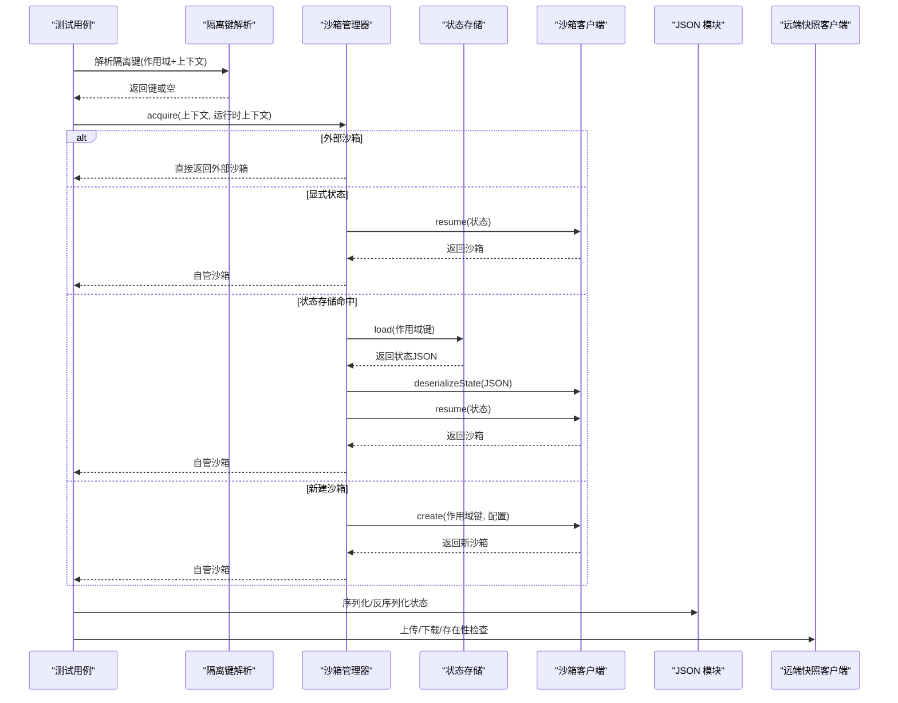

图表来源
- [SandboxManagerIsolationTest.java:63-129](file://agentscope-harness/src/test/java/io/agentscope/harness/agent/sandbox/SandboxManagerIsolationTest.java#L63-L129)
- [SessionSandboxStateStoreTest.java:41-86](file://agentscope-harness/src/test/java/io/agentscope/harness/agent/sandbox/SessionSandboxStateStoreTest.java#L41-L86)
- [WorkspaceSandboxStateStoreTest.java:47-158](file://agentscope-harness/src/test/java/io/agentscope/harness/agent/sandbox/WorkspaceSandboxStateStoreTest.java#L47-L158)
- [HarnessSandboxJacksonModuleTest.java:28-45](file://agentscope-harness/src/test/java/io/agentscope/harness/agent/sandbox/json/HarnessSandboxJacksonModuleTest.java#L28-L45)
- [RemoteSnapshotClientsTest.java:37-81](file://agentscope-harness/src/test/java/io/agentscope/harness/agent/sandbox/snapshot/RemoteSnapshotClientsTest.java#L37-L81)

## 详细组件分析

### 隔离键测试（SandboxIsolationKeyTest）
- 覆盖场景
  - 会话作用域：有/无会话键、空上下文下的行为
  - 用户作用域：有/无用户ID、空白ID、空上下文下的行为
  - 代理与全局作用域：始终使用代理ID或全局值
  - 相等性与哈希：相同键值相等且哈希一致
- 关键断言
  - 解析结果的存在性与值正确性
  - 空上下文/空值时返回空
  - AGENT/GLOBAL 始终可解析

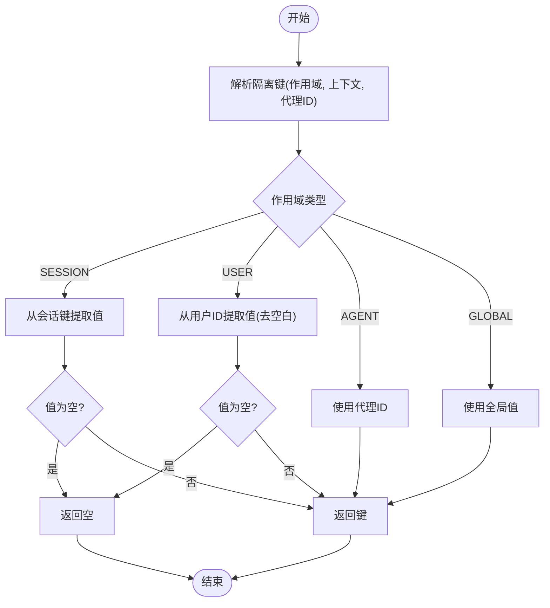

图表来源
- [SandboxIsolationKeyTest.java:32-125](file://agentscope-harness/src/test/java/io/agentscope/harness/agent/sandbox/SandboxIsolationKeyTest.java#L32-L125)

章节来源
- [SandboxIsolationKeyTest.java:28-139](file://agentscope-harness/src/test/java/io/agentscope/harness/agent/sandbox/SandboxIsolationKeyTest.java#L28-L139)

### 沙箱管理器测试（SandboxManagerIsolationTest）
- 获取优先级
  - 外部沙箱 > 显式外部状态 > 状态存储命中 > 新建沙箱
- 执行守卫与作用域键
  - 在 USER 作用域下，新建沙箱前通过执行守卫并传入用户键
- 状态持久化与清理
  - 仅当作用域键可解析时保存/删除对应 JSON
- Mock 行为
  - 使用状态存储与沙箱客户端的桩件，验证调用次数与分支

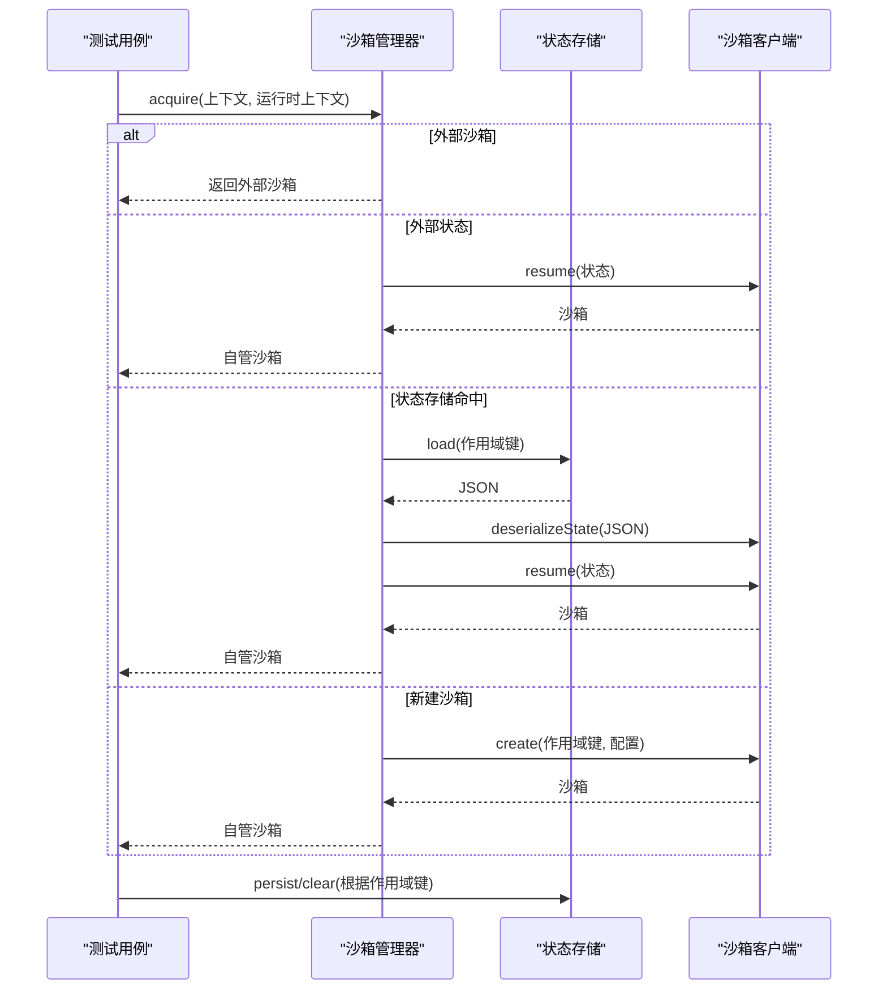

图表来源
- [SandboxManagerIsolationTest.java:63-276](file://agentscope-harness/src/test/java/io/agentscope/harness/agent/sandbox/SandboxManagerIsolationTest.java#L63-L276)

章节来源
- [SandboxManagerIsolationTest.java:40-277](file://agentscope-harness/src/test/java/io/agentscope/harness/agent/sandbox/SandboxManagerIsolationTest.java#L40-L277)

### JSON 序列化测试（HarnessSandboxJacksonModuleTest）
- 目标：验证沙箱状态对象（如 Docker）经由 Jackson 模块序列化/反序列化后的类型与字段保持一致
- 流程
  - 注册模块
  - 写入/读取状态对象
  - 断言类型与关键字段

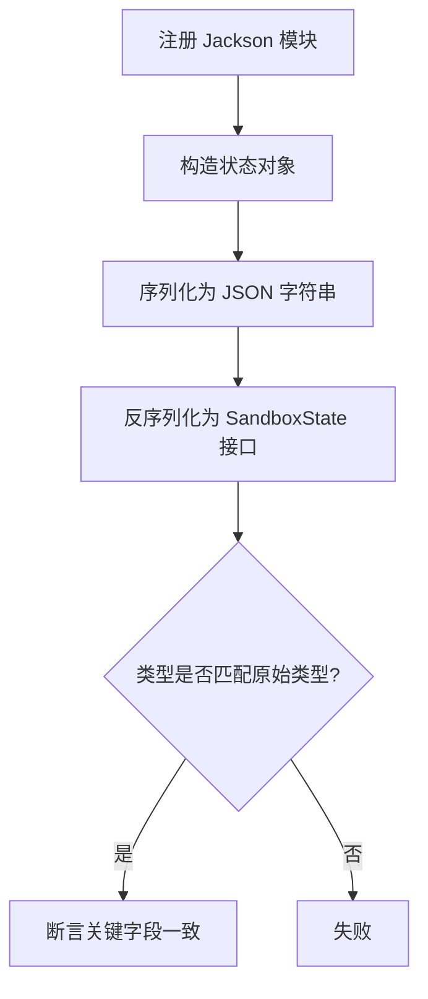

图表来源
- [HarnessSandboxJacksonModuleTest.java:28-45](file://agentscope-harness/src/test/java/io/agentscope/harness/agent/sandbox/json/HarnessSandboxJacksonModuleTest.java#L28-L45)

章节来源
- [HarnessSandboxJacksonModuleTest.java:26-47](file://agentscope-harness/src/test/java/io/agentscope/harness/agent/sandbox/json/HarnessSandboxJacksonModuleTest.java#L26-L47)

### 快照客户端测试（RemoteSnapshotClientsTest）
- OSS 客户端
  - 上传、存在性检查、下载
  - 验证对象键命名与上传调用
- Redis 客户端
  - TTL 设置、存在性检查、下载
  - 缺失键抛出文件未找到异常

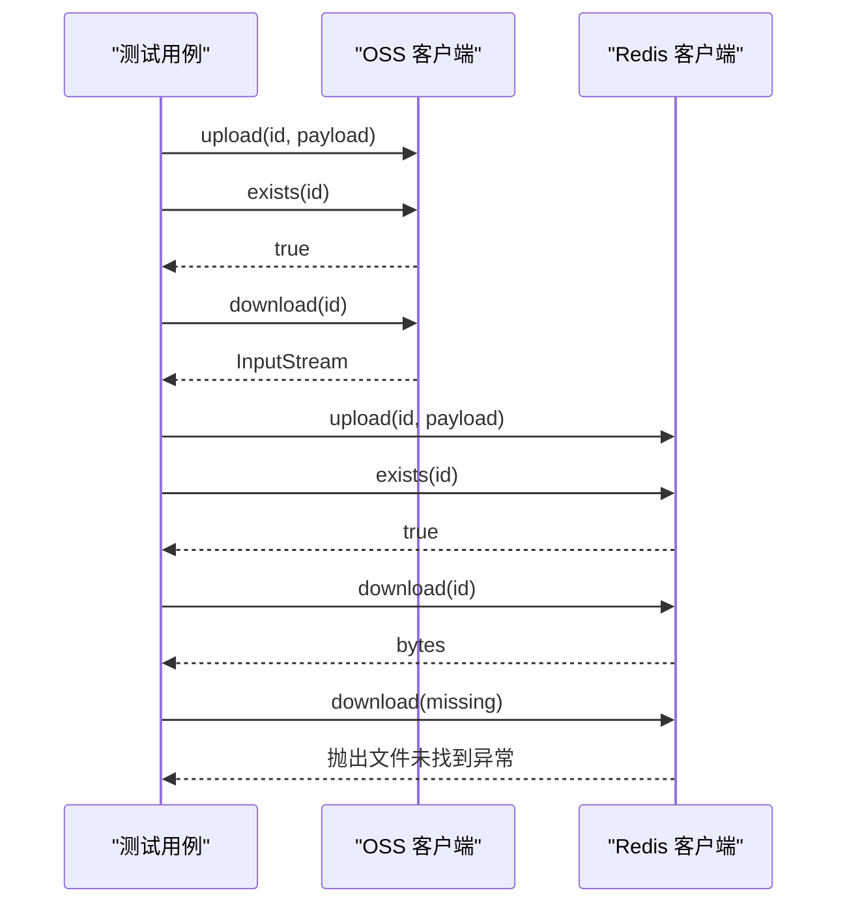

图表来源
- [RemoteSnapshotClientsTest.java:37-81](file://agentscope-harness/src/test/java/io/agentscope/harness/agent/sandbox/snapshot/RemoteSnapshotClientsTest.java#L37-L81)

章节来源
- [RemoteSnapshotClientsTest.java:35-83](file://agentscope-harness/src/test/java/io/agentscope/harness/agent/sandbox/snapshot/RemoteSnapshotClientsTest.java#L35-L83)

### 状态存储测试
- 会话状态存储（SessionSandboxStateStoreTest）
  - 支持 SESSION/USER 作用域的保存/加载/删除
  - AGENT/GLOBAL 作用域不互相干扰
  - 即使会话不支持按键删除，仍可通过墓碑机制实现删除语义
- 工作区状态存储（WorkspaceSandboxStateStoreTest）
  - 各作用域的文件路径布局与命名规则
  - 用户作用域对特殊字符进行安全编码
  - 多作用域并发互不影响，覆盖重写与不存在删除的边界

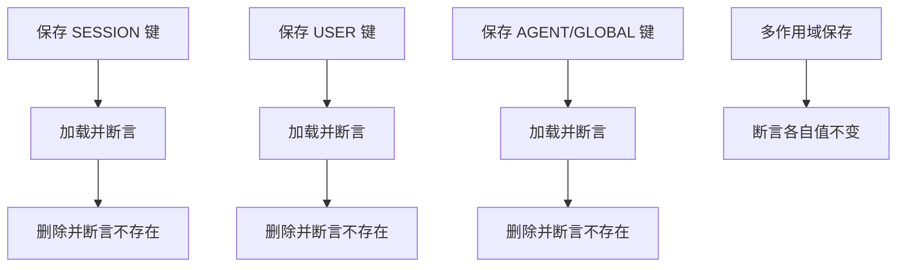

图表来源
- [SessionSandboxStateStoreTest.java:41-86](file://agentscope-harness/src/test/java/io/agentscope/harness/agent/sandbox/SessionSandboxStateStoreTest.java#L41-L86)
- [WorkspaceSandboxStateStoreTest.java:47-158](file://agentscope-harness/src/test/java/io/agentscope/harness/agent/sandbox/WorkspaceSandboxStateStoreTest.java#L47-L158)

章节来源
- [SessionSandboxStateStoreTest.java:29-111](file://agentscope-harness/src/test/java/io/agentscope/harness/agent/sandbox/SessionSandboxStateStoreTest.java#L29-L111)
- [WorkspaceSandboxStateStoreTest.java:31-235](file://agentscope-harness/src/test/java/io/agentscope/harness/agent/sandbox/WorkspaceSandboxStateStoreTest.java#L31-L235)

### 工作区挂载与投影测试
- 挂载支持（WorkspaceMountSupportTest）
  - 绑定挂载排除参数生成
  - 判定是否存在绑定挂载
  - 顶层绑定挂载识别
  - 容器挂载路径拼接
- 投影应用（WorkspaceProjectionApplierTest）
  - 无投影条目时返回空
  - 投影内容确定性哈希与打包
  - 变更内容导致哈希变化

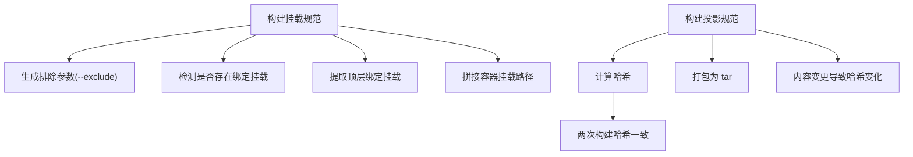

图表来源
- [WorkspaceMountSupportTest.java:30-78](file://agentscope-harness/src/test/java/io/agentscope/harness/agent/sandbox/WorkspaceMountSupportTest.java#L30-L78)
- [WorkspaceProjectionApplierTest.java:34-91](file://agentscope-harness/src/test/java/io/agentscope/harness/agent/sandbox/WorkspaceProjectionApplierTest.java#L34-L91)

章节来源
- [WorkspaceMountSupportTest.java:28-79](file://agentscope-harness/src/test/java/io/agentscope/harness/agent/sandbox/WorkspaceMountSupportTest.java#L28-L79)
- [WorkspaceProjectionApplierTest.java:30-92](file://agentscope-harness/src/test/java/io/agentscope/harness/agent/sandbox/WorkspaceProjectionApplierTest.java#L30-L92)

### 具体实现测试
- Kubernetes 沙箱状态序列化（KubernetesSandboxStateSerdeTest）
  - 注册专用 Jackson 模块，验证命名空间、Pod 名称等字段的往返一致性
- E2B 快照引用（E2bSnapshotRefsTest）
  - 快照 ID 编解码，带魔数前缀的识别与解码

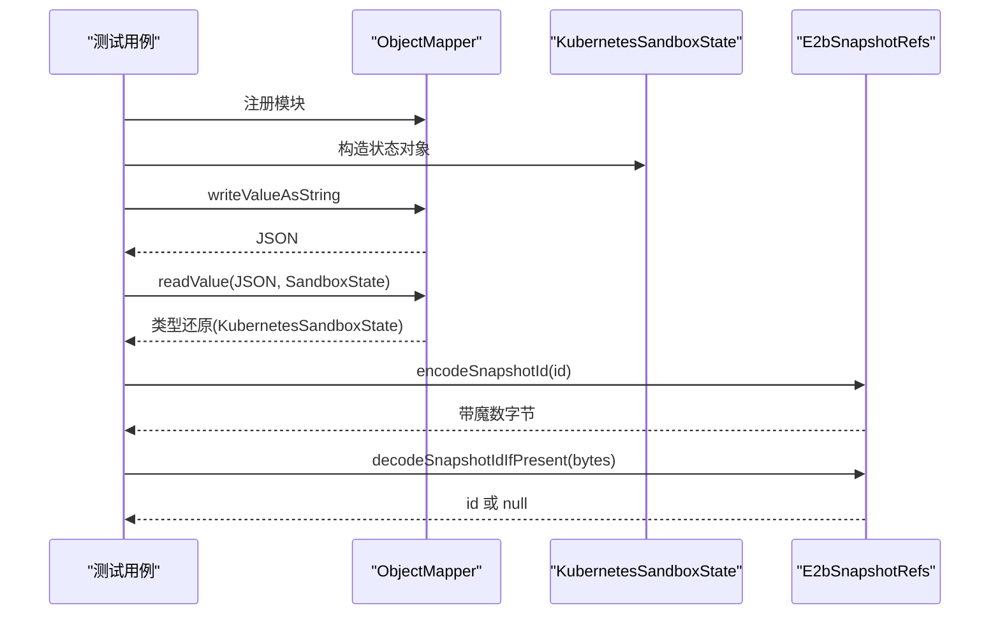

图表来源
- [KubernetesSandboxStateSerdeTest.java:27-51](file://agentscope-harness/src/test/java/io/agentscope/harness/agent/sandbox/impl/kubernetes/KubernetesSandboxStateSerdeTest.java#L27-L51)
- [E2bSnapshotRefsTest.java:26-39](file://agentscope-harness/src/test/java/io/agentscope/harness/agent/sandbox/impl/e2b/E2bSnapshotRefsTest.java#L26-L39)

章节来源
- [KubernetesSandboxStateSerdeTest.java:25-53](file://agentscope-harness/src/test/java/io/agentscope/harness/agent/sandbox/impl/kubernetes/KubernetesSandboxStateSerdeTest.java#L25-L53)
- [E2bSnapshotRefsTest.java:24-41](file://agentscope-harness/src/test/java/io/agentscope/harness/agent/sandbox/impl/e2b/E2bSnapshotRefsTest.java#L24-L41)

### 分布式沙箱测试（HarnessAgentDistributedSandboxTest）
- 文件系统模式与分布式约束
  - 本地文件系统 + 分布式沙箱：应失败，提示需沙箱模式
  - 沙箱模式但本地会话：默认失败，提示分布式会话后端
  - 显式开启分布式但本地会话：仍失败
  - 远程文件系统 + 本地会话：失败，提示远程模式需分布式会话
  - 远程文件系统 + 分布式会话：成功
- 快照覆盖
  - 分布式选项可覆盖文件系统中的快照规范
- 单节点豁免
  - 关闭分布式要求可允许本地会话

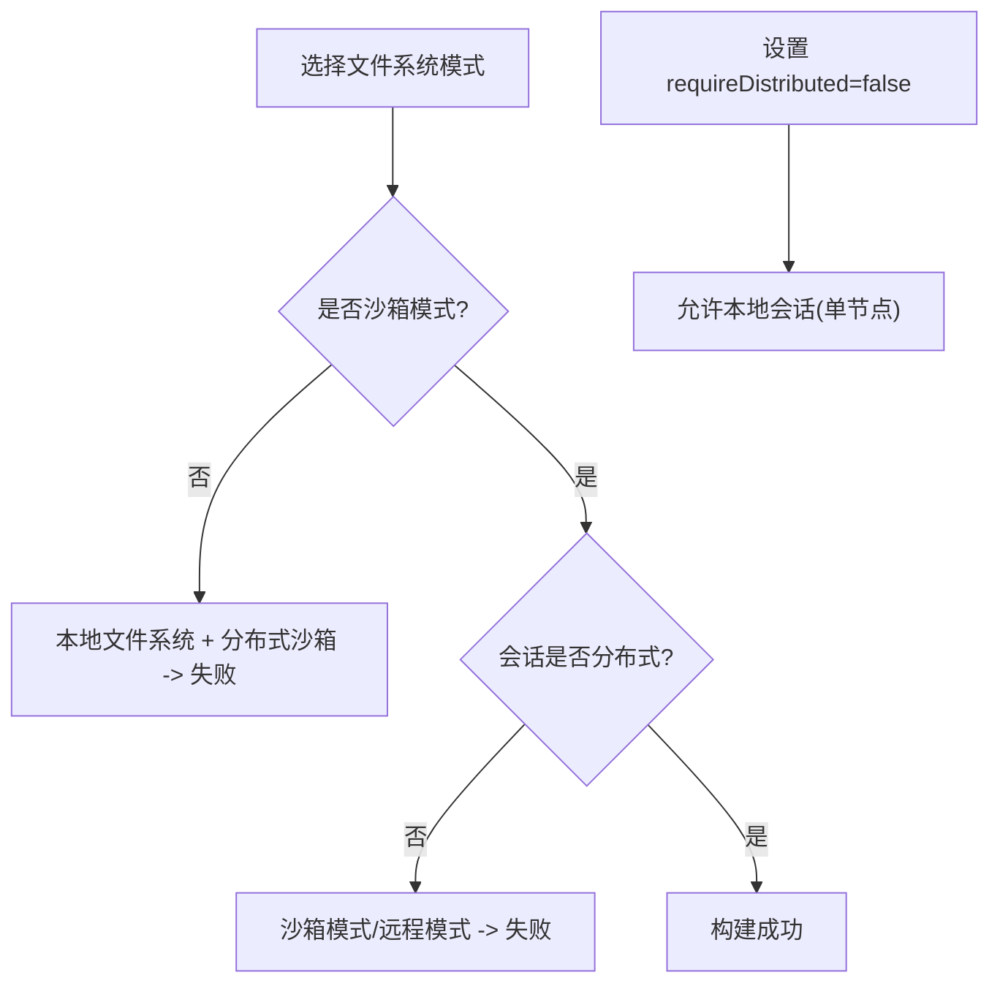

图表来源
- [HarnessAgentDistributedSandboxTest.java:47-151](file://agentscope-harness/src/test/java/io/agentscope/harness/agent/HarnessAgentDistributedSandboxTest.java#L47-L151)

章节来源
- [HarnessAgentDistributedSandboxTest.java:43-206](file://agentscope-harness/src/test/java/io/agentscope/harness/agent/HarnessAgentDistributedSandboxTest.java#L43-L206)

## 依赖关系分析
- 组件内聚与耦合
  - 隔离键与管理器强相关：前者决定后者的作用域键与优先级
  - 状态存储与管理器：管理器在不同优先级下读写状态
  - JSON 模块与具体实现：保障状态多态序列化
  - 快照客户端与远端存储：OSS/Redis 的行为被单元测试覆盖
  - 工作区能力与沙箱上下文：挂载与投影影响沙箱初始化与一致性
- 外部依赖
  - Jackson ObjectMapper 与模块注册
  - OSS/Redis 客户端 API
  - 文件系统与临时目录

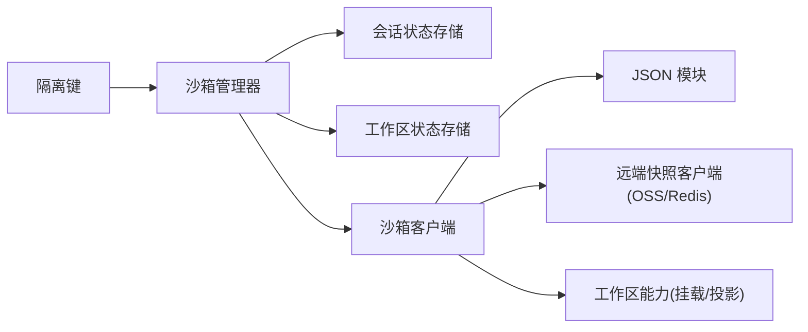

图表来源
- [SandboxManagerIsolationTest.java:56-59](file://agentscope-harness/src/test/java/io/agentscope/harness/agent/sandbox/SandboxManagerIsolationTest.java#L56-L59)
- [HarnessSandboxJacksonModuleTest.java:30-33](file://agentscope-harness/src/test/java/io/agentscope/harness/agent/sandbox/json/HarnessSandboxJacksonModuleTest.java#L30-L33)
- [RemoteSnapshotClientsTest.java:46-63](file://agentscope-harness/src/test/java/io/agentscope/harness/agent/sandbox/snapshot/RemoteSnapshotClientsTest.java#L46-L63)
- [WorkspaceMountSupportTest.java:40-46](file://agentscope-harness/src/test/java/io/agentscope/harness/agent/sandbox/WorkspaceMountSupportTest.java#L40-L46)
- [WorkspaceProjectionApplierTest.java:53-68](file://agentscope-harness/src/test/java/io/agentscope/harness/agent/sandbox/WorkspaceProjectionApplierTest.java#L53-L68)

章节来源
- [SandboxManagerIsolationTest.java:40-277](file://agentscope-harness/src/test/java/io/agentscope/harness/agent/sandbox/SandboxManagerIsolationTest.java#L40-L277)
- [HarnessSandboxJacksonModuleTest.java:26-47](file://agentscope-harness/src/test/java/io/agentscope/harness/agent/sandbox/json/HarnessSandboxJacksonModuleTest.java#L26-L47)
- [RemoteSnapshotClientsTest.java:35-83](file://agentscope-harness/src/test/java/io/agentscope/harness/agent/sandbox/snapshot/RemoteSnapshotClientsTest.java#L35-L83)
- [WorkspaceMountSupportTest.java:28-79](file://agentscope-harness/src/test/java/io/agentscope/harness/agent/sandbox/WorkspaceMountSupportTest.java#L28-L79)
- [WorkspaceProjectionApplierTest.java:30-92](file://agentscope-harness/src/test/java/io/agentscope/harness/agent/sandbox/WorkspaceProjectionApplierTest.java#L30-L92)

## 性能考量
- 序列化/反序列化
  - 使用 Jackson 模块注册减少反射开销，避免重复注册
- 状态存储
  - 会话状态存储在内存会话上具备高吞吐；工作区存储基于文件系统，注意磁盘 IO 与路径布局
- 快照客户端
  - OSS/Redis 的网络延迟与重试策略对端到端时延有显著影响
- 投影与挂载
  - 大量文件的 tar 打包与排除参数生成可能成为瓶颈，建议控制投影范围与排除粒度

## 故障排查指南
- 构建阶段失败
  - 沙箱模式 + 本地会话：确认已提供分布式会话或关闭分布式要求
  - 远程文件系统 + 本地会话：必须提供分布式会话
- 状态读写异常
  - 确认作用域键是否可解析（上下文字段缺失或为空）
  - 对于不支持按键删除的会话存储，采用墓碑机制删除
- 快照访问异常
  - OSS：核对桶名与对象键前缀
  - Redis：核对键空间与 TTL 设置
- 投影与挂载问题
  - 排除参数是否覆盖了预期路径
  - 容器挂载路径拼接是否以斜杠结尾处理一致

章节来源
- [HarnessAgentDistributedSandboxTest.java:47-107](file://agentscope-harness/src/test/java/io/agentscope/harness/agent/HarnessAgentDistributedSandboxTest.java#L47-L107)
- [SessionSandboxStateStoreTest.java:76-86](file://agentscope-harness/src/test/java/io/agentscope/harness/agent/sandbox/SessionSandboxStateStoreTest.java#L76-L86)
- [RemoteSnapshotClientsTest.java:37-81](file://agentscope-harness/src/test/java/io/agentscope/harness/agent/sandbox/snapshot/RemoteSnapshotClientsTest.java#L37-L81)
- [WorkspaceMountSupportTest.java:30-78](file://agentscope-harness/src/test/java/io/agentscope/harness/agent/sandbox/WorkspaceMountSupportTest.java#L30-L78)
- [WorkspaceProjectionApplierTest.java:34-91](file://agentscope-harness/src/test/java/io/agentscope/harness/agent/sandbox/WorkspaceProjectionApplierTest.java#L34-L91)

## 结论
本测试体系围绕“隔离键—管理器—状态存储—序列化—快照—工作区能力”形成闭环，既覆盖功能正确性，也兼顾分布式约束与一致性验证。通过模块化的测试用例，能够有效保障不同实现（Kubernetes、E2B、本地）与部署形态（单机/分布式）下的稳定性与可维护性。

## 附录
- 配置建议
  - 分布式沙箱：统一提供分布式会话后端；必要时关闭分布式要求用于单机验证
  - 快照存储：为 OSS/Redis 提供稳定的凭证与命名空间；设置合理的 TTL
  - 工作区：限制投影范围，减少 tar 打包体积；确保排除参数覆盖所有不需要的子路径
- 调试技巧
  - 使用最小化上下文触发隔离键解析失败路径
  - 在管理器中注入执行守卫，观察作用域键传递
  - 对状态存储进行文件系统探查，确认路径与文件名编码
  - 对快照客户端进行网络层抓包，定位上传/下载失败原因