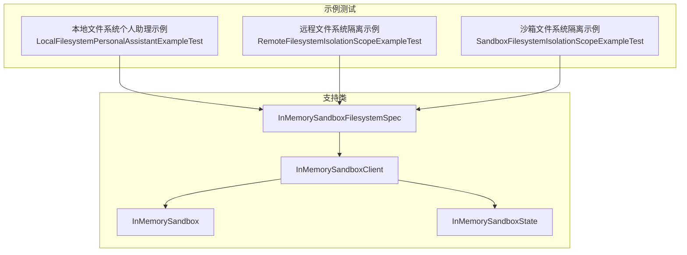
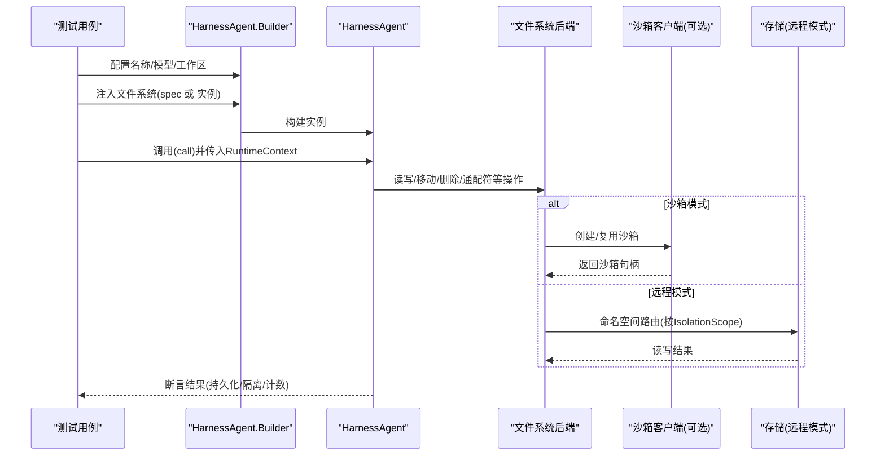
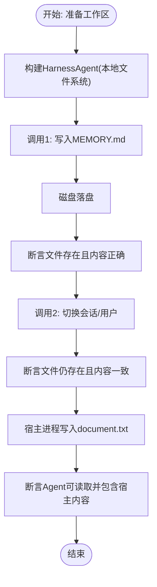
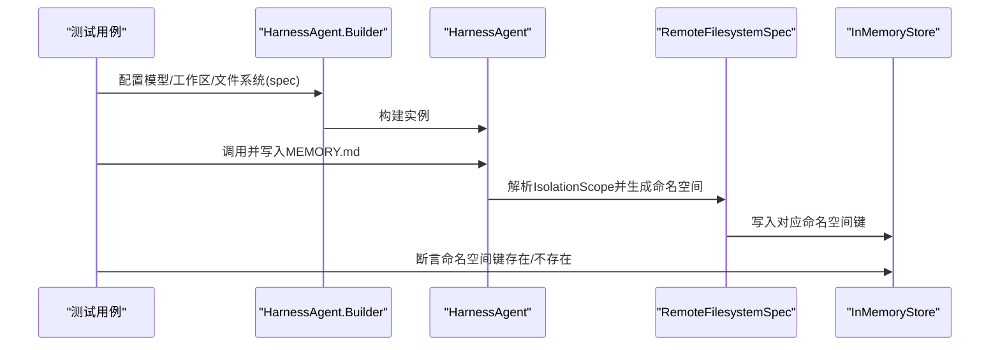
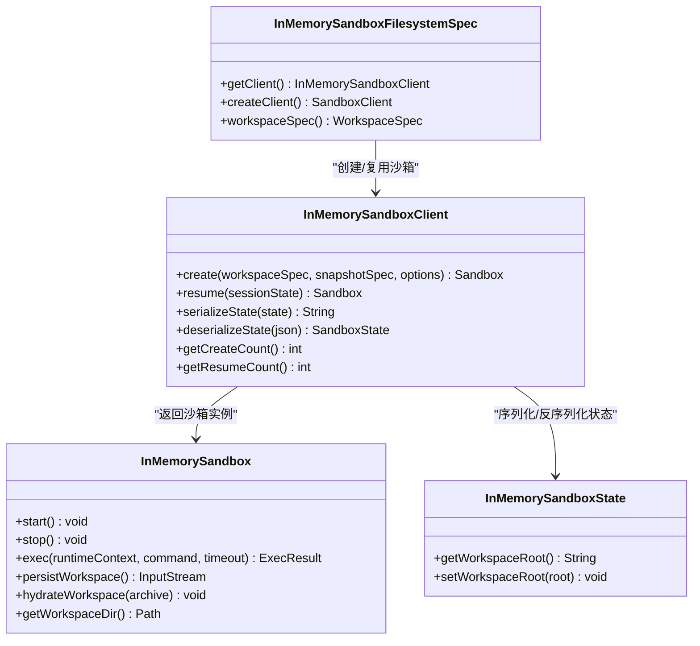
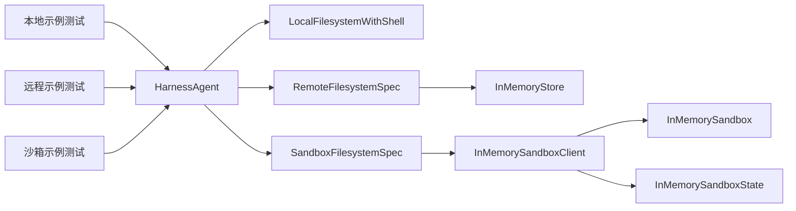

# 示例测试

<cite>
**本文引用的文件**
- [LocalFilesystemPersonalAssistantExampleTest.java](file://agentscope-harness/src/test/java/io/agentscope/harness/agent/example/LocalFilesystemPersonalAssistantExampleTest.java)
- [RemoteFilesystemIsolationScopeExampleTest.java](file://agentscope-harness/src/test/java/io/agentscope/harness/agent/example/RemoteFilesystemIsolationScopeExampleTest.java)
- [SandboxFilesystemIsolationScopeExampleTest.java](file://agentscope-harness/src/test/java/io/agentscope/harness/agent/example/SandboxFilesystemIsolationScopeExampleTest.java)
- [InMemorySandbox.java](file://agentscope-harness/src/test/java/io/agentscope/harness/agent/example/support/InMemorySandbox.java)
- [InMemorySandboxClient.java](file://agentscope-harness/src/test/java/io/agentscope/harness/agent/example/support/InMemorySandboxClient.java)
- [InMemorySandboxFilesystemSpec.java](file://agentscope-harness/src/test/java/io/agentscope/harness/agent/example/support/InMemorySandboxFilesystemSpec.java)
- [InMemorySandboxState.java](file://agentscope-harness/src/test/java/io/agentscope/harness/agent/example/support/InMemorySandboxState.java)
- [HarnessAgentTest.java](file://agentscope-harness/src/test/java/io/agentscope/harness/agent/HarnessAgentTest.java)
- [FilesystemDeleteMoveExistsTest.java](file://agentscope-harness/src/test/java/io/agentscope/harness/agent/filesystem/FilesystemDeleteMoveExistsTest.java)
- [FilesystemGlobTest.java](file://agentscope-harness/src/test/java/io/agentscope/harness/agent/filesystem/FilesystemGlobTest.java)
- [RemoteFilesystemSpecTest.java](file://agentscope-harness/src/test/java/io/agentscope/harness/agent/filesystem/RemoteFilesystemSpecTest.java)
</cite>

## 目录
1. [简介](#简介)
2. [项目结构](#项目结构)
3. [核心组件](#核心组件)
4. [架构总览](#架构总览)
5. [详细组件分析](#详细组件分析)
6. [依赖关系分析](#依赖关系分析)
7. [性能考量](#性能考量)
8. [故障排查指南](#故障排查指南)
9. [结论](#结论)
10. [附录](#附录)

## 简介
本技术文档聚焦于示例测试模块，系统性介绍三类典型示例测试：本地文件系统个人助理示例、远程文件系统隔离示例与沙箱文件系统隔离示例。文档从设计思路、应用场景、测试策略与验证方法、端到端与集成测试流程、配置与运行环境、执行指南与结果分析，以及在开发流程中的作用（快速验证、回归测试、性能基准）等方面进行深入阐述，帮助读者高效理解并复用这些示例。

## 项目结构
示例测试位于 agentscope-harness 模块的测试目录中，围绕三种文件系统模式与沙箱模式展开：
- 本地文件系统模式：直接基于磁盘工作区，适合单机或本地开发场景。
- 远程文件系统模式：通过分布式存储（如内存存储）共享数据，结合 IsolationScope 控制命名空间隔离级别。
- 沙箱文件系统模式：每次调用获取沙箱会话（容器或临时目录），通过 IsolationScope 控制是否复用已有沙箱。

**图表来源**
- [LocalFilesystemPersonalAssistantExampleTest.java:1-199](file://agentscope-harness/src/test/java/io/agentscope/harness/agent/example/LocalFilesystemPersonalAssistantExampleTest.java#L1-L199)
- [RemoteFilesystemIsolationScopeExampleTest.java:1-290](file://agentscope-harness/src/test/java/io/agentscope/harness/agent/example/RemoteFilesystemIsolationScopeExampleTest.java#L1-L290)
- [SandboxFilesystemIsolationScopeExampleTest.java:1-287](file://agentscope-harness/src/test/java/io/agentscope/harness/agent/example/SandboxFilesystemIsolationScopeExampleTest.java#L1-L287)
- [InMemorySandboxFilesystemSpec.java:1-82](file://agentscope-harness/src/test/java/io/agentscope/harness/agent/example/support/InMemorySandboxFilesystemSpec.java#L1-L82)
- [InMemorySandboxClient.java:1-123](file://agentscope-harness/src/test/java/io/agentscope/harness/agent/example/support/InMemorySandboxClient.java#L1-L123)
- [InMemorySandbox.java:1-119](file://agentscope-harness/src/test/java/io/agentscope/harness/agent/example/support/InMemorySandbox.java#L1-L119)
- [InMemorySandboxState.java:1-42](file://agentscope-harness/src/test/java/io/agentscope/harness/agent/example/support/InMemorySandboxState.java#L1-L42)

**章节来源**
- [LocalFilesystemPersonalAssistantExampleTest.java:1-199](file://agentscope-harness/src/test/java/io/agentscope/harness/agent/example/LocalFilesystemPersonalAssistantExampleTest.java#L1-L199)
- [RemoteFilesystemIsolationScopeExampleTest.java:1-290](file://agentscope-harness/src/test/java/io/agentscope/harness/agent/example/RemoteFilesystemIsolationScopeExampleTest.java#L1-L290)
- [SandboxFilesystemIsolationScopeExampleTest.java:1-287](file://agentscope-harness/src/test/java/io/agentscope/harness/agent/example/SandboxFilesystemIsolationScopeExampleTest.java#L1-L287)

## 核心组件
- 本地文件系统个人助理示例：验证本地磁盘持久化、跨会话一致性与宿主进程直连访问能力。
- 远程文件系统隔离示例：验证不同 IsolationScope 下的命名空间路由与数据隔离。
- 沙箱文件系统隔离示例：验证 IsolationScope 对沙箱创建/复用的影响，并通过计数器断言行为。
- 支持类：InMemorySandboxFilesystemSpec、InMemorySandboxClient、InMemorySandbox、InMemorySandboxState 提供无外部依赖的沙箱模拟与状态管理。

**章节来源**
- [LocalFilesystemPersonalAssistantExampleTest.java:70-199](file://agentscope-harness/src/test/java/io/agentscope/harness/agent/example/LocalFilesystemPersonalAssistantExampleTest.java#L70-L199)
- [RemoteFilesystemIsolationScopeExampleTest.java:76-290](file://agentscope-harness/src/test/java/io/agentscope/harness/agent/example/RemoteFilesystemIsolationScopeExampleTest.java#L76-L290)
- [SandboxFilesystemIsolationScopeExampleTest.java:67-287](file://agentscope-harness/src/test/java/io/agentscope/harness/agent/example/SandboxFilesystemIsolationScopeExampleTest.java#L67-L287)
- [InMemorySandboxFilesystemSpec.java:31-82](file://agentscope-harness/src/test/java/io/agentscope/harness/agent/example/support/InMemorySandboxFilesystemSpec.java#L31-L82)
- [InMemorySandboxClient.java:32-123](file://agentscope-harness/src/test/java/io/agentscope/harness/agent/example/support/InMemorySandboxClient.java#L32-L123)
- [InMemorySandbox.java:29-119](file://agentscope-harness/src/test/java/io/agentscope/harness/agent/example/support/InMemorySandbox.java#L29-L119)
- [InMemorySandboxState.java:20-42](file://agentscope-harness/src/test/java/io/agentscope/harness/agent/example/support/InMemorySandboxState.java#L20-L42)

## 架构总览
示例测试围绕 HarnessAgent 的构建与调用展开，分别注入不同的文件系统后端与可选的沙箱选项，以覆盖不同隔离与持久化策略。

**图表来源**
- [LocalFilesystemPersonalAssistantExampleTest.java:80-108](file://agentscope-harness/src/test/java/io/agentscope/harness/agent/example/LocalFilesystemPersonalAssistantExampleTest.java#L80-L108)
- [RemoteFilesystemIsolationScopeExampleTest.java:95-119](file://agentscope-harness/src/test/java/io/agentscope/harness/agent/example/RemoteFilesystemIsolationScopeExampleTest.java#L95-L119)
- [SandboxFilesystemIsolationScopeExampleTest.java:89-110](file://agentscope-harness/src/test/java/io/agentscope/harness/agent/example/SandboxFilesystemIsolationScopeExampleTest.java#L89-L110)
- [InMemorySandboxClient.java:51-78](file://agentscope-harness/src/test/java/io/agentscope/harness/agent/example/support/InMemorySandboxClient.java#L51-L78)

## 详细组件分析

### 本地文件系统个人助理示例
- 设计要点
  - 使用 LocalFilesystemWithShell 直接映射到磁盘工作区，所有 I/O 直达文件系统。
  - 通过 WorkspaceManager 在调用间持久化文件，验证本地持久化与跨会话一致性。
  - 验证 userId/sessionId 不改变 I/O 目标路径，体现“非分区”特性。
  - 支持宿主进程直接写入工作区，Agent 可读取。
- 测试策略
  - 调用-落盘-断言-再次调用-断言内容不变，验证持久化。
  - 切换 userId/sessionId，断言仍可见同一工作区文件，验证不按用户/会话分区。
  - 宿主进程写入文件，Agent 读取并断言内容包含宿主写入标记。
- 关键断言点
  - 文件存在且内容未丢失。
  - 同一工作区对不同用户/会话可见。
  - 宿主写入可被 Agent 读取。

**图表来源**
- [LocalFilesystemPersonalAssistantExampleTest.java:76-168](file://agentscope-harness/src/test/java/io/agentscope/harness/agent/example/LocalFilesystemPersonalAssistantExampleTest.java#L76-L168)

**章节来源**
- [LocalFilesystemPersonalAssistantExampleTest.java:70-199](file://agentscope-harness/src/test/java/io/agentscope/harness/agent/example/LocalFilesystemPersonalAssistantExampleTest.java#L70-L199)

### 远程文件系统隔离示例
- 设计要点
  - 使用 RemoteFilesystemSpec 将特定路径（如 MEMORY.md、memory/）路由至分布式存储，其他路径保留在本地。
  - 通过 IsolationScope 控制命名空间前缀，验证会话级、用户级、全局级隔离。
  - 直接使用 WorkspaceManager 写入，绕过完整对话流程，聚焦命名空间路由。
- 测试策略
  - 会话级：同会话可读取，不同会话命名空间为空。
  - 用户级：同用户多会话共享，不同用户隔离。
  - 全局级：所有调用共享单一命名空间。
- 关键断言点
  - 命名空间键符合预期（agents/{agentId}/sessions/users/shared）。
  - 同一命名空间内数据可读，不同命名空间不可见。

**图表来源**
- [RemoteFilesystemIsolationScopeExampleTest.java:90-150](file://agentscope-harness/src/test/java/io/agentscope/harness/agent/example/RemoteFilesystemIsolationScopeExampleTest.java#L90-L150)
- [RemoteFilesystemIsolationScopeExampleTest.java:162-218](file://agentscope-harness/src/test/java/io/agentscope/harness/agent/example/RemoteFilesystemIsolationScopeExampleTest.java#L162-L218)
- [RemoteFilesystemIsolationScopeExampleTest.java:230-259](file://agentscope-harness/src/test/java/io/agentscope/harness/agent/example/RemoteFilesystemIsolationScopeExampleTest.java#L230-L259)

**章节来源**
- [RemoteFilesystemIsolationScopeExampleTest.java:76-290](file://agentscope-harness/src/test/java/io/agentscope/harness/agent/example/RemoteFilesystemIsolationScopeExampleTest.java#L76-L290)

### 沙箱文件系统隔离示例
- 设计要点
  - 使用 InMemorySandboxFilesystemSpec 与 InMemorySandboxClient，无需 Docker 即可模拟沙箱生命周期。
  - 通过 IsolationScope 控制是否复用已有沙箱：同会话复用、同用户复用、全共享。
  - 使用计数器断言 create/resume 行为，验证隔离策略。
- 测试策略
  - 会话级：相同会话第二次调用应复用沙箱；不同会话应各自创建。
  - 用户级：相同用户不同会话复用；不同用户各自创建。
  - 全局级：所有调用共享同一沙箱。
- 关键断言点
  - create/resume 计数与期望一致。
  - 沙箱状态在调用间保持（由 InMemorySandboxState 与 InMemorySandbox 维护）。

**图表来源**
- [InMemorySandboxFilesystemSpec.java:31-82](file://agentscope-harness/src/test/java/io/agentscope/harness/agent/example/support/InMemorySandboxFilesystemSpec.java#L31-L82)
- [InMemorySandboxClient.java:32-123](file://agentscope-harness/src/test/java/io/agentscope/harness/agent/example/support/InMemorySandboxClient.java#L32-L123)
- [InMemorySandbox.java:29-119](file://agentscope-harness/src/test/java/io/agentscope/harness/agent/example/support/InMemorySandbox.java#L29-L119)
- [InMemorySandboxState.java:20-42](file://agentscope-harness/src/test/java/io/agentscope/harness/agent/example/support/InMemorySandboxState.java#L20-L42)

**章节来源**
- [SandboxFilesystemIsolationScopeExampleTest.java:67-287](file://agentscope-harness/src/test/java/io/agentscope/harness/agent/example/SandboxFilesystemIsolationScopeExampleTest.java#L67-L287)
- [InMemorySandboxFilesystemSpec.java:31-82](file://agentscope-harness/src/test/java/io/agentscope/harness/agent/example/support/InMemorySandboxFilesystemSpec.java#L31-L82)
- [InMemorySandboxClient.java:32-123](file://agentscope-harness/src/test/java/io/agentscope/harness/agent/example/support/InMemorySandboxClient.java#L32-L123)
- [InMemorySandbox.java:29-119](file://agentscope-harness/src/test/java/io/agentscope/harness/agent/example/support/InMemorySandbox.java#L29-L119)
- [InMemorySandboxState.java:20-42](file://agentscope-harness/src/test/java/io/agentscope/harness/agent/example/support/InMemorySandboxState.java#L20-L42)

### 文件系统通用能力测试（补充）
- 删除/移动/存在性校验：覆盖本地与远程文件系统，验证幂等性与跨后端移动。
- 通配符匹配：本地与远程文件系统均支持 glob 搜索。
- 复合文件系统：将特定路径路由到存储，其余本地处理。

**章节来源**
- [FilesystemDeleteMoveExistsTest.java:41-224](file://agentscope-harness/src/test/java/io/agentscope/harness/agent/filesystem/FilesystemDeleteMoveExistsTest.java#L41-L224)
- [FilesystemGlobTest.java:35-80](file://agentscope-harness/src/test/java/io/agentscope/harness/agent/filesystem/FilesystemGlobTest.java#L35-L80)
- [RemoteFilesystemSpecTest.java:35-101](file://agentscope-harness/src/test/java/io/agentscope/harness/agent/filesystem/RemoteFilesystemSpecTest.java#L35-L101)

## 依赖关系分析
- 示例测试依赖 HarnessAgent 构建器与 WorkspaceManager，注入不同文件系统后端。
- 远程模式依赖 InMemoryStore 作为分布式存储抽象；沙箱模式依赖 InMemorySandboxClient 与 InMemorySandbox。
- 文件系统测试独立验证基础能力，支撑示例测试的断言。

**图表来源**
- [LocalFilesystemPersonalAssistantExampleTest.java:80-88](file://agentscope-harness/src/test/java/io/agentscope/harness/agent/example/LocalFilesystemPersonalAssistantExampleTest.java#L80-L88)
- [RemoteFilesystemIsolationScopeExampleTest.java:95-104](file://agentscope-harness/src/test/java/io/agentscope/harness/agent/example/RemoteFilesystemIsolationScopeExampleTest.java#L95-L104)
- [SandboxFilesystemIsolationScopeExampleTest.java:89-99](file://agentscope-harness/src/test/java/io/agentscope/harness/agent/example/SandboxFilesystemIsolationScopeExampleTest.java#L89-L99)
- [InMemorySandboxClient.java:51-78](file://agentscope-harness/src/test/java/io/agentscope/harness/agent/example/support/InMemorySandboxClient.java#L51-L78)

**章节来源**
- [HarnessAgentTest.java:62-759](file://agentscope-harness/src/test/java/io/agentscope/harness/agent/HarnessAgentTest.java#L62-L759)

## 性能考量
- 本地模式：I/O 直达磁盘，延迟低，适合小规模快速迭代。
- 远程模式：网络/存储往返带来额外开销，建议批量上传与合并写入，减少命名空间切换。
- 沙箱模式：创建/复用沙箱涉及状态序列化/反序列化与工作区归档/水化，需关注超时与资源占用。
- 通用优化：合理使用 WorkspaceManager 的批量操作接口，避免频繁小文件读写；在远程模式下合并通配符查询以减少往返。

## 故障排查指南
- 本地模式断言失败
  - 检查工作区路径是否正确挂载与权限。
  - 确认跨会话/用户调用是否使用了同一工作区配置。
- 远程模式命名空间异常
  - 核对 IsolationScope 与命名空间前缀生成逻辑。
  - 确认 userId 解析与匿名用户回退策略。
- 沙箱模式创建/复用异常
  - 查看 InMemorySandboxClient 的 create/resume 计数是否与预期一致。
  - 检查 InMemorySandboxState 序列化/反序列化是否成功。
- 文件系统通用问题
  - 删除/移动幂等性：确认不存在文件的删除应返回成功。
  - 跨后端移动：确保源后端删除、目标后端写入成功。

**章节来源**
- [FilesystemDeleteMoveExistsTest.java:64-110](file://agentscope-harness/src/test/java/io/agentscope/harness/agent/filesystem/FilesystemDeleteMoveExistsTest.java#L64-L110)
- [FilesystemDeleteMoveExistsTest.java:135-168](file://agentscope-harness/src/test/java/io/agentscope/harness/agent/filesystem/FilesystemDeleteMoveExistsTest.java#L135-L168)
- [RemoteFilesystemSpecTest.java:67-80](file://agentscope-harness/src/test/java/io/agentscope/harness/agent/filesystem/RemoteFilesystemSpecTest.java#L67-L80)
- [SandboxFilesystemIsolationScopeExampleTest.java:101-110](file://agentscope-harness/src/test/java/io/agentscope/harness/agent/example/SandboxFilesystemIsolationScopeExampleTest.java#L101-L110)

## 结论
示例测试模块通过三类典型场景清晰展示了 AgentScope 在不同文件系统与隔离策略下的行为特征：本地模式强调简单与持久化，远程模式强调命名空间隔离与共享，沙箱模式强调会话生命周期与状态复用。配合文件系统通用测试与支持类，示例测试既可用于快速验证，也可作为回归与性能基准的基础。

## 附录

### 测试策略与验证方法
- 快速验证：本地示例测试覆盖基本持久化与宿主直连能力。
- 回归测试：远程与沙箱示例测试通过命名空间与计数断言保障隔离策略稳定。
- 性能基准：通过批量写入、通配符查询与沙箱复用计数评估不同模式的性能特征。

### 配置要求与运行环境
- Java 运行时：JDK 8+（示例使用 JUnit 5）。
- 依赖：Maven 工程，确保 agentscope-harness 与相关模块已编译。
- 环境变量：示例测试不依赖外部服务，无需额外环境变量。

### 执行指南
- 本地示例测试
  - 运行测试类：LocalFilesystemPersonalAssistantExampleTest
  - 关注断言：文件存在、内容一致、宿主可读
- 远程示例测试
  - 运行测试类：RemoteFilesystemIsolationScopeExampleTest
  - 关注断言：命名空间键存在/不存在、同用户多会话共享、全局共享
- 沙箱示例测试
  - 运行测试类：SandboxFilesystemIsolationScopeExampleTest
  - 关注断言：create/resume 计数与 IsolationScope 行为一致

### 结果分析方法
- 本地模式：对比两次调用间文件内容是否一致，验证持久化。
- 远程模式：检查 InMemoryStore 中对应命名空间键是否存在，验证隔离。
- 沙箱模式：统计 create/resume 次数，验证是否按 IsolationScope 复用。