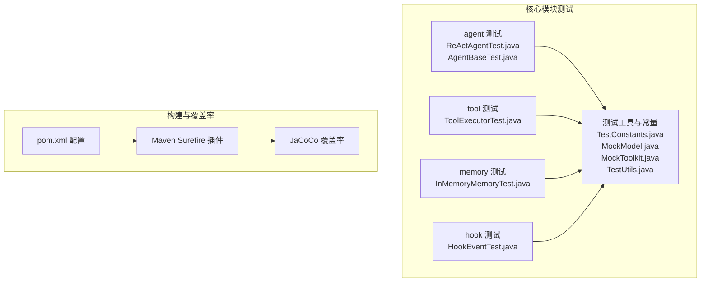
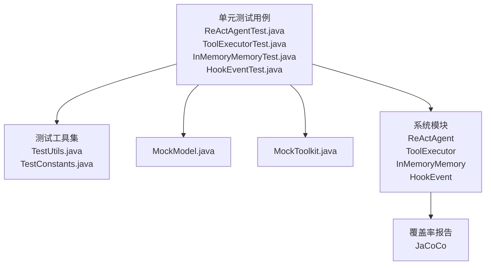
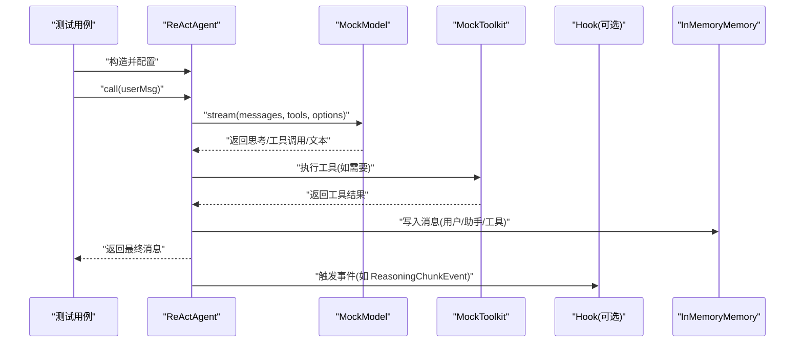
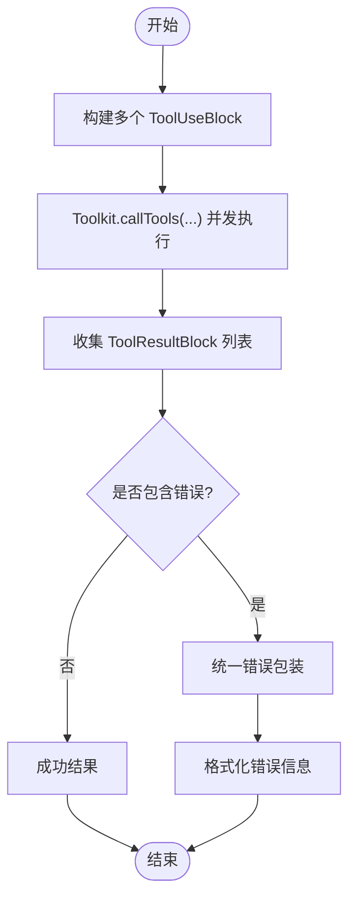
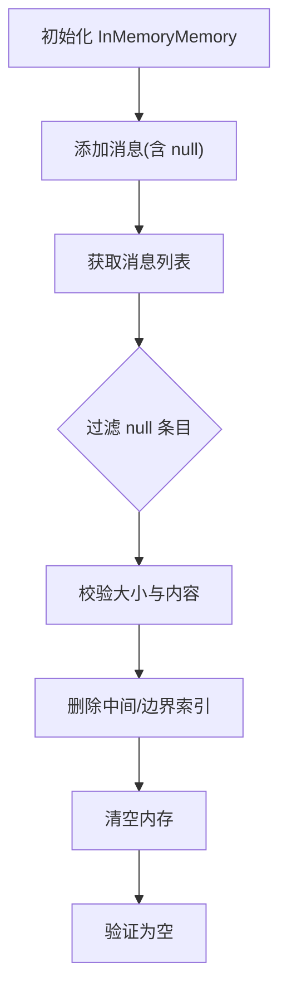
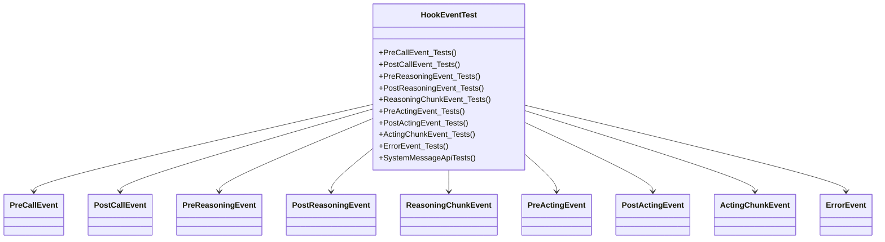
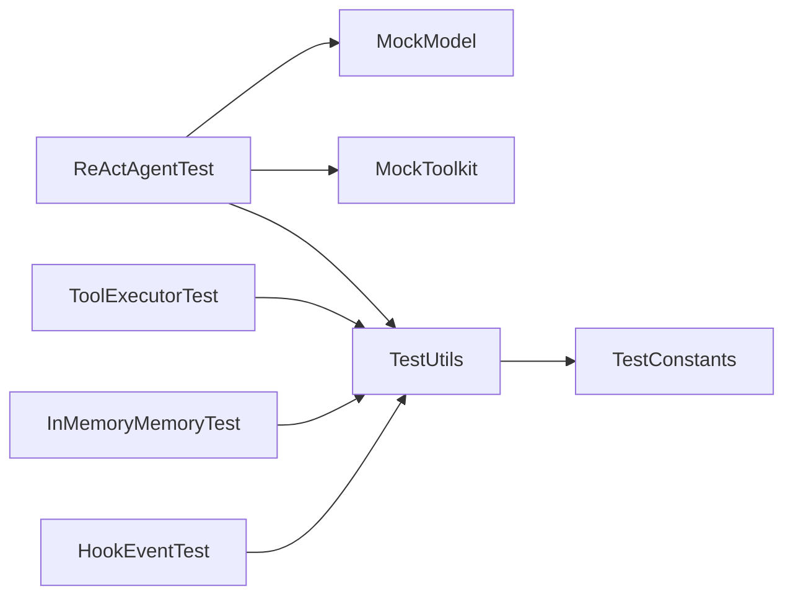

# 单元测试策略

<cite>
**本文引用的文件**   
- [agentscope-core/pom.xml](file://agentscope-core/pom.xml)
- [pom.xml](file://pom.xml)
- [codecov.yml](file://codecov.yml)
- [ReActAgentTest.java](file://agentscope-core/src/test/java/io/agentscope/core/agent/ReActAgentTest.java)
- [AgentBaseTest.java](file://agentscope-core/src/test/java/io/agentscope/core/agent/AgentBaseTest.java)
- [ToolExecutorTest.java](file://agentscope-core/src/test/java/io/agentscope/core/tool/ToolExecutorTest.java)
- [InMemoryMemoryTest.java](file://agentscope-core/src/test/java/io/agentscope/core/memory/InMemoryMemoryTest.java)
- [HookEventTest.java](file://agentscope-core/src/test/java/io/agentscope/core/hook/HookEventTest.java)
- [TestConstants.java](file://agentscope-core/src/test/java/io/agentscope/core/agent/test/TestConstants.java)
- [MockModel.java](file://agentscope-core/src/test/java/io/agentscope/core/agent/test/MockModel.java)
- [MockToolkit.java](file://agentscope-core/src/test/java/io/agentscope/core/agent/test/MockToolkit.java)
- [TestUtils.java](file://agentscope-core/src/test/java/io/agentscope/core/agent/test/TestUtils.java)
</cite>

## 目录
1. [引言](#引言)
2. [项目结构](#项目结构)
3. [核心组件](#核心组件)
4. [架构总览](#架构总览)
5. [详细组件分析](#详细组件分析)
6. [依赖分析](#依赖分析)
7. [性能考虑](#性能考虑)
8. [故障排查指南](#故障排查指南)
9. [结论](#结论)
10. [附录](#附录)

## 引言
本文件面向 AgentScope Java 的单元测试策略，系统化阐述测试金字塔在本项目中的落地方式与最佳实践。重点覆盖以下方面：
- 设计原则：以“可维护、可扩展、可验证”为核心目标，强调隔离性、确定性与可重复性。
- 测试金字塔：基础层为单元测试（快速、稳定），上层为集成测试与端到端测试，确保质量分层与成本平衡。
- 核心组件测试：ReAct 智能体、工具执行器、内存管理、Hook 事件等模块的测试方法论。
- Mock 策略：如何通过 MockModel、MockToolkit 等模拟外部依赖，保证测试可控与可预测。
- 断言与覆盖率：断言标准、覆盖率目标与持续集成中的度量策略。
- 测试数据与环境：测试数据准备、隔离与结果分析方法。
- 性能基准：如何设计与运行性能相关测试，识别瓶颈。

## 项目结构
本项目的测试组织遵循“按模块分层”的结构，核心测试位于 agentscope-core 模块的 test 目录下，采用 JUnit 5 进行单元测试，配合 Reactor 的响应式模型进行异步测试。关键特性包括：
- 使用 Maven Surefire 插件执行测试，并启用 Jacoco 进行覆盖率统计。
- 覆盖 agent、tool、memory、hook、model 等核心子系统。
- 提供统一的测试常量、Mock 工具与测试工具类，提升复用性与一致性。

**图表来源**
- [agentscope-core/pom.xml:273-290](file://agentscope-core/pom.xml#L273-L290)
- [pom.xml:252-321](file://pom.xml#L252-L321)

**章节来源**
- [agentscope-core/pom.xml:273-290](file://agentscope-core/pom.xml#L273-L290)
- [pom.xml:252-321](file://pom.xml#L252-L321)

## 核心组件
本节概述本项目中与单元测试密切相关的核心组件及其职责：
- ReActAgent：负责推理-行动循环、工具调用、记忆管理与流式输出。
- ToolExecutor：并发执行多个工具调用，统一错误包装与参数合并策略。
- InMemoryMemory：线程安全的消息存储与检索，支持增删清空与并发操作。
- HookEvent：事件模型，用于在关键生命周期节点注入观察与修改能力。
- MockModel/MockToolkit/TestUtils/TestConstants：测试支撑设施，提供可配置的外部依赖模拟与测试数据生成。

这些组件在单元测试中被严格隔离，通过 Mock 与工具类确保测试的独立性与可重复性。

**章节来源**
- [ReActAgentTest.java:1-120](file://agentscope-core/src/test/java/io/agentscope/core/agent/ReActAgentTest.java#L1-L120)
- [AgentBaseTest.java:1-120](file://agentscope-core/src/test/java/io/agentscope/core/agent/AgentBaseTest.java#L1-L120)
- [ToolExecutorTest.java:1-60](file://agentscope-core/src/test/java/io/agentscope/core/tool/ToolExecutorTest.java#L1-L60)
- [InMemoryMemoryTest.java:1-40](file://agentscope-core/src/test/java/io/agentscope/core/memory/InMemoryMemoryTest.java#L1-L40)
- [HookEventTest.java:1-60](file://agentscope-core/src/test/java/io/agentscope/core/hook/HookEventTest.java#L1-L60)
- [TestConstants.java:1-65](file://agentscope-core/src/test/java/io/agentscope/core/agent/test/TestConstants.java#L1-L65)
- [MockModel.java:1-60](file://agentscope-core/src/test/java/io/agentscope/core/agent/test/MockModel.java#L1-L60)
- [MockToolkit.java:1-60](file://agentscope-core/src/test/java/io/agentscope/core/agent/test/MockToolkit.java#L1-L60)
- [TestUtils.java:1-40](file://agentscope-core/src/test/java/io/agentscope/core/agent/test/TestUtils.java#L1-L40)

## 架构总览
下图展示了单元测试策略在代码层面的交互关系：测试用例通过统一的测试工具与 Mock 组件，对核心模块进行隔离验证；覆盖率插件在测试完成后生成报告，指导后续改进。

**图表来源**
- [ReActAgentTest.java:1-120](file://agentscope-core/src/test/java/io/agentscope/core/agent/ReActAgentTest.java#L1-L120)
- [ToolExecutorTest.java:1-60](file://agentscope-core/src/test/java/io/agentscope/core/tool/ToolExecutorTest.java#L1-L60)
- [InMemoryMemoryTest.java:1-40](file://agentscope-core/src/test/java/io/agentscope/core/memory/InMemoryMemoryTest.java#L1-L40)
- [HookEventTest.java:1-60](file://agentscope-core/src/test/java/io/agentscope/core/hook/HookEventTest.java#L1-L60)
- [TestUtils.java:1-40](file://agentscope-core/src/test/java/io/agentscope/core/agent/test/TestUtils.java#L1-L40)
- [TestConstants.java:1-65](file://agentscope-core/src/test/java/io/agentscope/core/agent/test/TestConstants.java#L1-L65)
- [MockModel.java:1-60](file://agentscope-core/src/test/java/io/agentscope/core/agent/test/MockModel.java#L1-L60)
- [MockToolkit.java:1-60](file://agentscope-core/src/test/java/io/agentscope/core/agent/test/MockToolkit.java#L1-L60)

## 详细组件分析

### ReAct 智能体测试
ReActAgent 的测试围绕以下主题展开：
- 初始化与属性校验：确认系统提示、最大迭代次数、内存实例等正确设置。
- 基础对话与思考流程：验证文本回复、思考消息与最终回复的组合行为。
- 工具调用与执行：验证工具请求生成、工具执行顺序、结果写入记忆。
- 错误处理：模型错误与工具执行错误的传播与记录。
- 最大迭代限制：防止无限循环，确保在达到上限时停止。
- 内存管理：历史消息累积与去重、并发安全性。
- 流式输出：分片消息的接收与聚合。
- 继续生成：无输入继续生成的语义与实现。
- Hook 事件：在工具使用等关键节点发出 ReasoningChunkEvent 等事件。

**图表来源**
- [ReActAgentTest.java:94-140](file://agentscope-core/src/test/java/io/agentscope/core/agent/ReActAgentTest.java#L94-L140)
- [MockModel.java:114-141](file://agentscope-core/src/test/java/io/agentscope/core/agent/test/MockModel.java#L114-L141)
- [MockToolkit.java:140-167](file://agentscope-core/src/test/java/io/agentscope/core/agent/test/MockToolkit.java#L140-L167)

**章节来源**
- [ReActAgentTest.java:94-705](file://agentscope-core/src/test/java/io/agentscope/core/agent/ReActAgentTest.java#L94-L705)
- [MockModel.java:42-195](file://agentscope-core/src/test/java/io/agentscope/core/agent/test/MockModel.java#L42-L195)
- [MockToolkit.java:36-205](file://agentscope-core/src/test/java/io/agentscope/core/agent/test/MockToolkit.java#L36-L205)

### 工具执行器测试
工具执行器的测试关注：
- 并发执行：多工具调用的并发调度与结果聚合。
- 错误处理：工具抛出异常时的统一错误包装与非特殊中断处理。
- 参数优先级：预设参数与显式输入的合并与优先级规则。
- 元数据缺失场景：注册表元数据缺失时的行为与回退。
- 错误格式一致性：不同异常类型的统一错误输出格式。

**图表来源**
- [ToolExecutorTest.java:62-127](file://agentscope-core/src/test/java/io/agentscope/core/tool/ToolExecutorTest.java#L62-L127)
- [ToolExecutorTest.java:187-272](file://agentscope-core/src/test/java/io/agentscope/core/tool/ToolExecutorTest.java#L187-L272)
- [ToolExecutorTest.java:274-348](file://agentscope-core/src/test/java/io/agentscope/core/tool/ToolExecutorTest.java#L274-L348)
- [ToolExecutorTest.java:409-495](file://agentscope-core/src/test/java/io/agentscope/core/tool/ToolExecutorTest.java#L409-L495)

**章节来源**
- [ToolExecutorTest.java:62-506](file://agentscope-core/src/test/java/io/agentscope/core/tool/ToolExecutorTest.java#L62-L506)

### 内存管理测试
内存模块的测试要点：
- 增删查改：添加消息、删除指定索引、清空内存。
- 空状态与非法索引：空内存删除、负索引与越界索引的安全处理。
- 并发一致性：多线程环境下消息数量与顺序的正确性。
- 空条目过滤：添加 null 条目时的过滤逻辑。

**图表来源**
- [InMemoryMemoryTest.java:37-177](file://agentscope-core/src/test/java/io/agentscope/core/memory/InMemoryMemoryTest.java#L37-L177)

**章节来源**
- [InMemoryMemoryTest.java:28-177](file://agentscope-core/src/test/java/io/agentscope/core/memory/InMemoryMemoryTest.java#L28-L177)

### Hook 事件测试
Hook 事件的测试覆盖：
- 事件类型与上下文：PreCallEvent、PostCallEvent、PreReasoningEvent、PostReasoningEvent、ReasoningChunkEvent、PreActingEvent、PostActingEvent、ActingChunkEvent、ErrorEvent。
- 空值校验：构造函数与 setter 的空值保护。
- 上下文修改：输入消息、最终消息、工具使用与结果的可修改性。
- 系统消息 API：默认值、设置与追加内容的正确性。

**图表来源**
- [HookEventTest.java:100-439](file://agentscope-core/src/test/java/io/agentscope/core/hook/HookEventTest.java#L100-L439)

**章节来源**
- [HookEventTest.java:43-439](file://agentscope-core/src/test/java/io/agentscope/core/hook/HookEventTest.java#L43-L439)

### AgentBase 基类测试
AgentBase 的测试关注：
- 初始化与属性：名称、唯一标识符等。
- 消息处理：单消息与多消息输入、observe 行为。
- 中断处理：interrupt 与 interrupt(Msg) 的行为。
- 继续生成：无输入调用的语义。
- 并发控制：checkRunning 开关下的并发冲突检测与允许并发的场景。

**章节来源**
- [AgentBaseTest.java:54-356](file://agentscope-core/src/test/java/io/agentscope/core/agent/AgentBaseTest.java#L54-L356)

## 依赖分析
单元测试的依赖关系主要体现在：
- 测试用例依赖测试工具与 Mock 组件，避免对外部服务的耦合。
- 测试工具与常量提供统一的数据与行为约定，减少重复代码。
- Maven Surefire 与 JaCoCo 在构建阶段自动执行测试与覆盖率统计。

**图表来源**
- [ReActAgentTest.java:25-55](file://agentscope-core/src/test/java/io/agentscope/core/agent/ReActAgentTest.java#L25-L55)
- [ToolExecutorTest.java:22-40](file://agentscope-core/src/test/java/io/agentscope/core/tool/ToolExecutorTest.java#L22-L40)
- [InMemoryMemoryTest.java:22-28](file://agentscope-core/src/test/java/io/agentscope/core/memory/InMemoryMemoryTest.java#L22-L28)
- [HookEventTest.java:23-42](file://agentscope-core/src/test/java/io/agentscope/core/hook/HookEventTest.java#L23-L42)
- [TestUtils.java:33-195](file://agentscope-core/src/test/java/io/agentscope/core/agent/test/TestUtils.java#L33-L195)
- [TestConstants.java:24-65](file://agentscope-core/src/test/java/io/agentscope/core/agent/test/TestConstants.java#L24-L65)
- [MockModel.java:42-195](file://agentscope-core/src/test/java/io/agentscope/core/agent/test/MockModel.java#L42-L195)
- [MockToolkit.java:36-205](file://agentscope-core/src/test/java/io/agentscope/core/agent/test/MockToolkit.java#L36-L205)

**章节来源**
- [ReActAgentTest.java:25-55](file://agentscope-core/src/test/java/io/agentscope/core/agent/ReActAgentTest.java#L25-L55)
- [ToolExecutorTest.java:22-40](file://agentscope-core/src/test/java/io/agentscope/core/tool/ToolExecutorTest.java#L22-L40)
- [InMemoryMemoryTest.java:22-28](file://agentscope-core/src/test/java/io/agentscope/core/memory/InMemoryMemoryTest.java#L22-L28)
- [HookEventTest.java:23-42](file://agentscope-core/src/test/java/io/agentscope/core/hook/HookEventTest.java#L23-L42)

## 性能考虑
- 异步与背压：ReActor 的流式响应需在测试中通过阻塞或超时控制，避免长时间等待。
- 并发与锁竞争：工具执行器与内存模块的并发测试应覆盖高负载场景，确保无死锁与数据不一致。
- 超时与资源回收：合理设置测试超时，及时释放资源，避免测试相互干扰。
- 压测建议：对关键路径（工具执行、消息序列化）进行轻量级基准测试，定位热点与回归。

[本节为通用指导，无需特定文件引用]

## 故障排查指南
- 超时问题：检查测试超时配置与实际耗时，必要时调整超时阈值或优化被测逻辑。
- 并发冲突：启用 checkRunning 或在测试中使用不同的调度器，避免竞态条件。
- Mock 不生效：确认 Mock 实例与注入点一致，避免使用默认实现导致行为偏差。
- 覆盖率不足：补充边界条件与异常分支的测试用例，结合 JaCoCo 报告定位未覆盖区域。

**章节来源**
- [AgentBaseTest.java:273-354](file://agentscope-core/src/test/java/io/agentscope/core/agent/AgentBaseTest.java#L273-L354)
- [ReActAgentTest.java:455-498](file://agentscope-core/src/test/java/io/agentscope/core/agent/ReActAgentTest.java#L455-L498)

## 结论
本项目的单元测试策略以“隔离 Mock + 明确断言 + 可重复执行”为核心，通过测试金字塔分层保障质量与效率。ReAct 智能体、工具执行器、内存与 Hook 事件等关键模块均具备完善的测试覆盖，配合覆盖率与持续集成工具，形成闭环的质量保障体系。建议在后续迭代中持续完善边界条件与异常分支，保持覆盖率稳定提升。

[本节为总结性内容，无需特定文件引用]

## 附录

### 测试数据准备与环境隔离
- 测试数据：使用 TestUtils 与 TestConstants 统一生成消息、工具参数与常量，确保一致性。
- 环境隔离：每个测试用例在 @BeforeEach 中初始化独立的 Mock 实例与内存，避免共享状态。
- 资源清理：在测试结束后重置 Mock 状态，避免跨用例污染。

**章节来源**
- [TestUtils.java:33-195](file://agentscope-core/src/test/java/io/agentscope/core/agent/test/TestUtils.java#L33-L195)
- [TestConstants.java:24-65](file://agentscope-core/src/test/java/io/agentscope/core/agent/test/TestConstants.java#L24-L65)
- [MockModel.java:183-189](file://agentscope-core/src/test/java/io/agentscope/core/agent/test/MockModel.java#L183-L189)
- [MockToolkit.java:199-204](file://agentscope-core/src/test/java/io/agentscope/core/agent/test/MockToolkit.java#L199-L204)

### 断言验证标准
- 基本断言：非空、相等、类型匹配、布尔条件。
- 行为断言：调用次数、调用顺序、错误传播、事件触发。
- 并发断言：无异常抛出、最终状态一致。

**章节来源**
- [ReActAgentTest.java:96-109](file://agentscope-core/src/test/java/io/agentscope/core/agent/ReActAgentTest.java#L96-L109)
- [ToolExecutorTest.java:83-102](file://agentscope-core/src/test/java/io/agentscope/core/tool/ToolExecutorTest.java#L83-L102)
- [InMemoryMemoryTest.java:42-47](file://agentscope-core/src/test/java/io/agentscope/core/memory/InMemoryMemoryTest.java#L42-L47)

### 测试覆盖率要求
- 覆盖率目标：项目在 Codecov 中设定项目整体目标为 60%，并忽略示例模块。
- 落地手段：通过 JaCoCo 插件在测试阶段生成报告，结合 CI 触发覆盖率检查。

**章节来源**
- [codecov.yml:18-31](file://codecov.yml#L18-L31)
- [pom.xml:292-310](file://pom.xml#L292-L310)