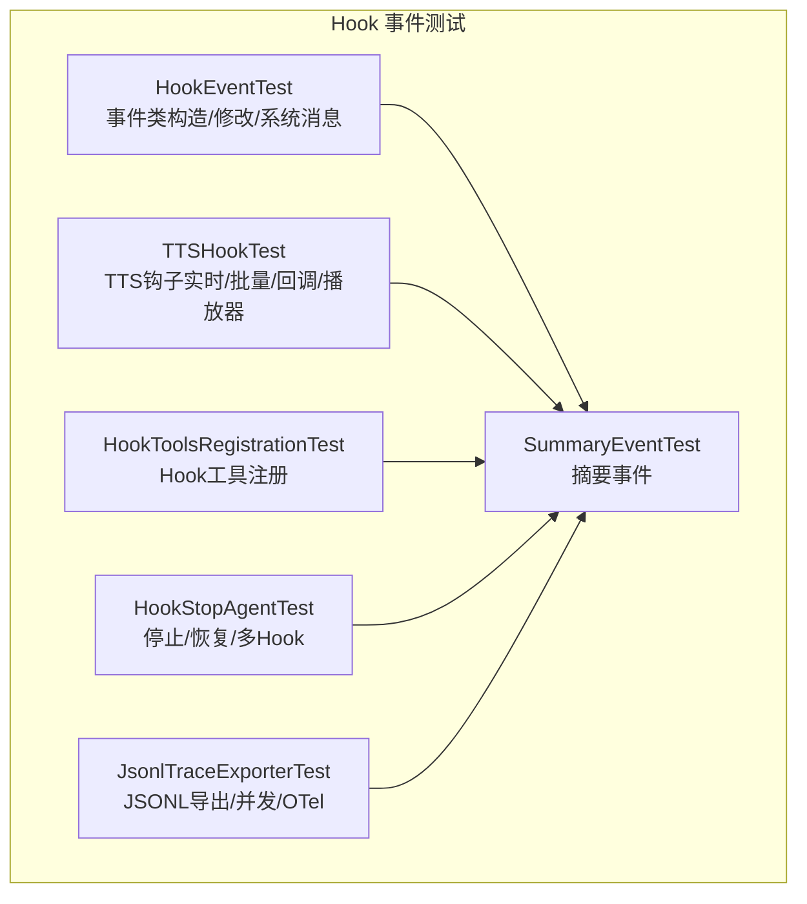
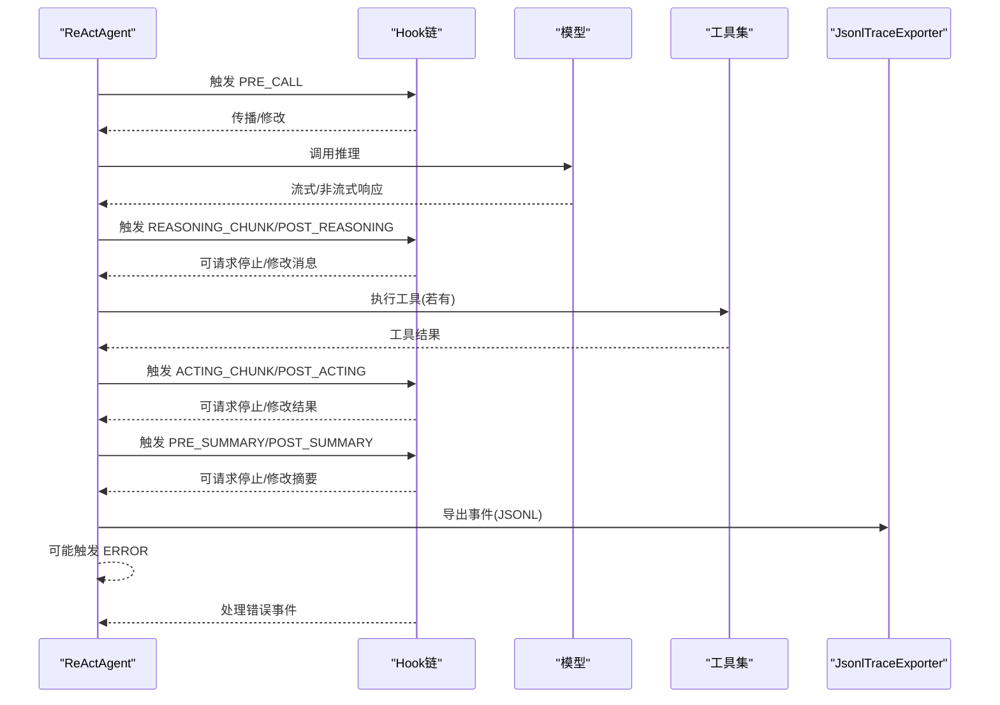
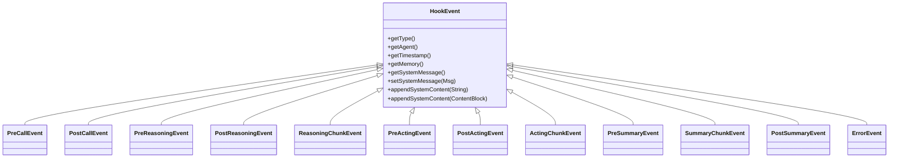
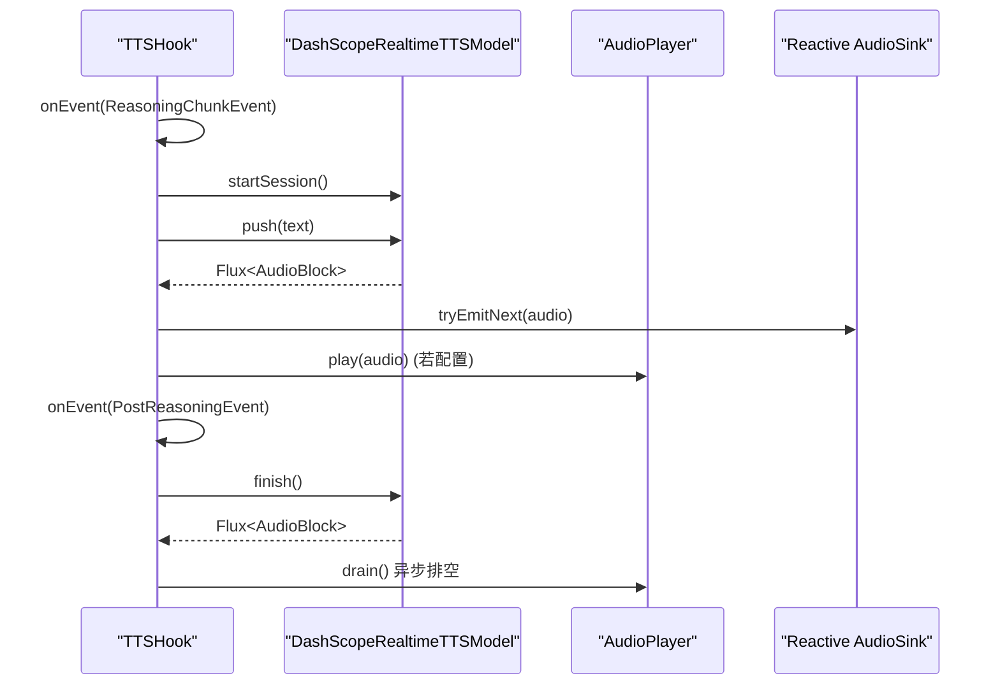
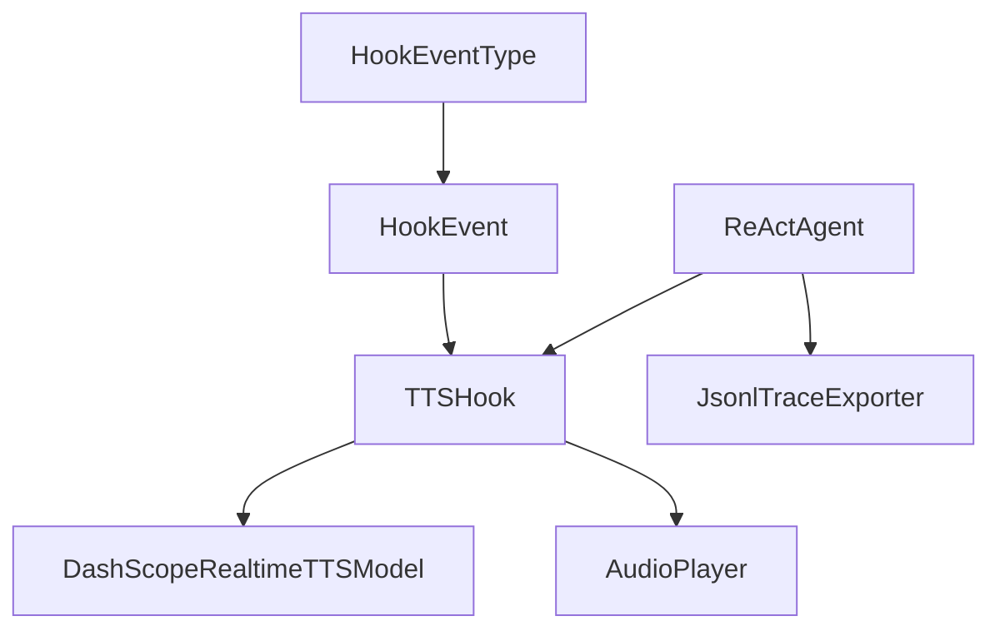

# Hook 事件测试

<cite>
**本文引用的文件**
- [HookEventType.java](file://agentscope-core/src/main/java/io/agentscope/core/hook/HookEventType.java)
- [HookEvent.java](file://agentscope-core/src/main/java/io/agentscope/core/hook/HookEvent.java)
- [TTSHook.java](file://agentscope-core/src/main/java/io/agentscope/core/hook/TTSHook.java)
- [HookEventTest.java](file://agentscope-core/src/test/java/io/agentscope/core/hook/HookEventTest.java)
- [TTSHookTest.java](file://agentscope-core/src/test/java/io/agentscope/core/hook/TTSHookTest.java)
- [HookToolsRegistrationTest.java](file://agentscope-core/src/test/java/io/agentscope/core/hook/HookToolsRegistrationTest.java)
- [SummaryEventTest.java](file://agentscope-core/src/test/java/io/agentscope/core/hook/SummaryEventTest.java)
- [HookStopAgentTest.java](file://agentscope-core/src/test/java/io/agentscope/core/hook/HookStopAgentTest.java)
- [JsonlTraceExporterTest.java](file://agentscope-core/src/test/java/io/agentscope/core/hook/recorder/JsonlTraceExporterTest.java)
</cite>

## 目录
1. [简介](#简介)
2. [项目结构](#项目结构)
3. [核心组件](#核心组件)
4. [架构总览](#架构总览)
5. [详细组件分析](#详细组件分析)
6. [依赖关系分析](#依赖关系分析)
7. [性能考量](#性能考量)
8. [故障排查指南](#故障排查指南)
9. [结论](#结论)
10. [附录](#附录)

## 简介
本文件面向 Hook 事件测试，系统化梳理 Hook 事件体系、工具注册机制、摘要事件流程与 TTS 钩子行为，并给出事件类型、传播、优先级与拦截等测试策略。同时覆盖 Hook 生命周期、Hook 链与异常处理的最佳实践，提供可复用的测试示例路径与集成测试方法，帮助开发者在不同场景下验证 Hook 的正确性与鲁棒性。

## 项目结构
Hook 事件测试主要集中在 agentscope-core 模块的 test/java/io/agentscope/core/hook 目录中，包含以下关键测试类：
- HookEventTest：验证所有 HookEvent 子类的构造、访问器、修改器与系统消息 API。
- TTSHookTest：验证 TTS 钩子在实时模式与批量模式下的行为、回调与播放器集成。
- HookToolsRegistrationTest：验证 Hook 在构建阶段向 Agent 注册工具的能力。
- SummaryEventTest：验证摘要阶段事件（预摘要、摘要分块、后摘要）的构造与修改能力。
- HookStopAgentTest：验证 PostReasoningEvent/PostActingEvent 的停止请求 API、ReActAgent 停止与恢复逻辑、多 Hook 场景与边界条件。
- recorder/JsonlTraceExporterTest：验证 Hook 事件导出为 JSONL 的能力，包括事件过滤、并发导出、OTel 上下文注入与关闭等待。

**图表来源**
- [HookEventTest.java:1-439](file://agentscope-core/src/test/java/io/agentscope/core/hook/HookEventTest.java#L1-L439)
- [TTSHookTest.java:1-485](file://agentscope-core/src/test/java/io/agentscope/core/hook/TTSHookTest.java#L1-L485)
- [HookToolsRegistrationTest.java:1-157](file://agentscope-core/src/test/java/io/agentscope/core/hook/HookToolsRegistrationTest.java#L1-L157)
- [SummaryEventTest.java:1-391](file://agentscope-core/src/test/java/io/agentscope/core/hook/SummaryEventTest.java#L1-L391)
- [HookStopAgentTest.java:1-864](file://agentscope-core/src/test/java/io/agentscope/core/hook/HookStopAgentTest.java#L1-L864)
- [JsonlTraceExporterTest.java:1-477](file://agentscope-core/src/test/java/io/agentscope/core/hook/recorder/JsonlTraceExporterTest.java#L1-L477)

**章节来源**
- [HookEventTest.java:1-439](file://agentscope-core/src/test/java/io/agentscope/core/hook/HookEventTest.java#L1-L439)
- [TTSHookTest.java:1-485](file://agentscope-core/src/test/java/io/agentscope/core/hook/TTSHookTest.java#L1-L485)
- [HookToolsRegistrationTest.java:1-157](file://agentscope-core/src/test/java/io/agentscope/core/hook/HookToolsRegistrationTest.java#L1-L157)
- [SummaryEventTest.java:1-391](file://agentscope-core/src/test/java/io/agentscope/core/hook/SummaryEventTest.java#L1-L391)
- [HookStopAgentTest.java:1-864](file://agentscope-core/src/test/java/io/agentscope/core/hook/HookStopAgentTest.java#L1-L864)
- [JsonlTraceExporterTest.java:1-477](file://agentscope-core/src/test/java/io/agentscope/core/hook/recorder/JsonlTraceExporterTest.java#L1-L477)

## 核心组件
- HookEventType：定义所有 Hook 事件类型（如 PRE_CALL、POST_CALL、PRE_REASONING、POST_REASONING、REASONING_CHUNK、PRE_ACTING、POST_ACTING、ACTING_CHUNK、PRE_SUMMARY、POST_SUMMARY、SUMMARY_CHUNK、ERROR）。
- HookEvent：所有事件的抽象基类，提供统一的系统消息字段与操作方法（设置/追加），并管理事件生命周期中的系统消息冻结与注入。
- TTSHook：实时 TTS 钩子，支持“边生成边合成”（实时模式）与“完整响应后合成”（批量模式），并提供音频流、回调与本地播放器集成。
- 工具注册：Hook 可通过 tools() 方法返回 AgentTool 或 @Tool POJO，由 ReActAgent.Builder 在构建时自动注册到 Agent 的 Toolkit 中。
- 摘要事件：PreSummaryEvent、SummaryChunkEvent、PostSummaryEvent 提供摘要阶段的事件扩展点，支持输入消息修改、生成选项覆盖与停止请求。
- 停止与恢复：PostReasoningEvent/PostActingEvent 支持 stopAgent()/isStopRequested()；ReActAgent 在停止后返回待执行工具调用或允许用户继续；支持自动恢复与多 Hook 协作。
- JSONL 导出：JsonlTraceExporter 将 Hook 事件序列化为 JSONL 文件，支持事件过滤、并发写入、失败快速模式与 OpenTelemetry 上下文注入。

**章节来源**
- [HookEventType.java:1-64](file://agentscope-core/src/main/java/io/agentscope/core/hook/HookEventType.java#L1-L64)
- [HookEvent.java:1-206](file://agentscope-core/src/main/java/io/agentscope/core/hook/HookEvent.java#L1-L206)
- [TTSHook.java:1-458](file://agentscope-core/src/main/java/io/agentscope/core/hook/TTSHook.java#L1-L458)
- [HookToolsRegistrationTest.java:1-157](file://agentscope-core/src/test/java/io/agentscope/core/hook/HookToolsRegistrationTest.java#L1-L157)
- [SummaryEventTest.java:1-391](file://agentscope-core/src/test/java/io/agentscope/core/hook/SummaryEventTest.java#L1-L391)
- [HookStopAgentTest.java:1-864](file://agentscope-core/src/test/java/io/agentscope/core/hook/HookStopAgentTest.java#L1-L864)
- [JsonlTraceExporterTest.java:1-477](file://agentscope-core/src/test/java/io/agentscope/core/hook/recorder/JsonlTraceExporterTest.java#L1-L477)

## 架构总览
Hook 事件贯穿 Agent 执行生命周期，从调用前、推理前/中/后、工具执行前/中/后、摘要前/中/后，直至错误事件。事件通过 Hook 接口的 onEvent 进行处理，支持：
- 事件类型测试：验证事件类型枚举与事件构造一致性。
- 事件传播测试：验证事件在 Hook 链中的传递顺序与可见性。
- 事件优先级测试：通过 Hook.priority() 控制 Hook 执行顺序，确保关键 Hook 先行。
- 事件拦截测试：通过 Hook 返回值或状态变更（如 stopAgent）影响后续流程。

**图表来源**
- [HookEventType.java:1-64](file://agentscope-core/src/main/java/io/agentscope/core/hook/HookEventType.java#L1-L64)
- [HookEventTest.java:1-439](file://agentscope-core/src/test/java/io/agentscope/core/hook/HookEventTest.java#L1-L439)
- [HookStopAgentTest.java:1-864](file://agentscope-core/src/test/java/io/agentscope/core/hook/HookStopAgentTest.java#L1-L864)
- [JsonlTraceExporterTest.java:1-477](file://agentscope-core/src/test/java/io/agentscope/core/hook/recorder/JsonlTraceExporterTest.java#L1-L477)

## 详细组件分析

### Hook 事件类型与系统消息 API 测试
- 事件类型测试要点
  - 验证每个事件类型的构造与 getType() 返回值一致。
  - 验证构造参数的空值校验（NullPointerException）。
- 系统消息 API 测试要点
  - 默认 getSystemMessage() 返回 null。
  - setSystemMessage(null) 清空系统消息。
  - appendSystemContent(String/ContentBlock) 自动创建 SYSTEM 消息并支持追加。
  - 空参数与非法参数的拒绝行为。
- 测试示例路径
  - [HookEventTest.java:100-439](file://agentscope-core/src/test/java/io/agentscope/core/hook/HookEventTest.java#L100-L439)

**图表来源**
- [HookEvent.java:1-206](file://agentscope-core/src/main/java/io/agentscope/core/hook/HookEvent.java#L1-L206)
- [HookEventType.java:1-64](file://agentscope-core/src/main/java/io/agentscope/core/hook/HookEventType.java#L1-L64)

**章节来源**
- [HookEventTest.java:100-439](file://agentscope-core/src/test/java/io/agentscope/core/hook/HookEventTest.java#L100-L439)
- [HookEvent.java:1-206](file://agentscope-core/src/main/java/io/agentscope/core/hook/HookEvent.java#L1-L206)

### 工具注册测试（Hook.tools()）
- 测试目标
  - Hook 返回 AgentTool 实例时，应在 ReActAgent.Builder.build() 时注册到 Agent 的 Toolkit。
  - Hook 返回 @Tool POJO 时，应自动扫描并注册方法为工具。
  - tools() 返回 null 时，应视为空列表，不抛异常。
- 测试示例路径
  - [HookToolsRegistrationTest.java:1-157](file://agentscope-core/src/test/java/io/agentscope/core/hook/HookToolsRegistrationTest.java#L1-L157)

**章节来源**
- [HookToolsRegistrationTest.java:1-157](file://agentscope-core/src/test/java/io/agentscope/core/hook/HookToolsRegistrationTest.java#L1-L157)

### 摘要事件测试（PreSummary/SummaryChunk/PostSummary）
- 测试要点
  - PreSummaryEvent：输入消息可修改；生成选项可覆盖；迭代次数与当前轮次正确。
  - SummaryChunkEvent：增量与累积内容均可用；空参数拒绝。
  - PostSummaryEvent：摘要消息可修改；支持 stopAgent() 请求停止。
- 测试示例路径
  - [SummaryEventTest.java:1-391](file://agentscope-core/src/test/java/io/agentscope/core/hook/SummaryEventTest.java#L1-L391)

**章节来源**
- [SummaryEventTest.java:1-391](file://agentscope-core/src/test/java/io/agentscope/core/hook/SummaryEventTest.java#L1-L391)

### TTS 钩子测试（实时/批量/回调/播放器）
- 实时模式（默认）
  - 在 ReasoningChunkEvent 到达时启动会话、推送文本并接收音频块；在 PostReasoningEvent 完成会话并异步排空播放队列。
  - 空文本或无内容消息时不启动会话。
- 批量模式
  - 在 PostReasoningEvent 获取完整响应后进行流式合成，并通过回调/播放器输出。
- 回调与播放器
  - 提供 audioCallback 接收音频块；若配置了 AudioPlayer，则同步播放；未配置时仅回调/流式输出。
- 停止与清理
  - stop() 关闭 TTS 会话、停止播放器并完成音频流。
- 测试示例路径
  - [TTSHookTest.java:1-485](file://agentscope-core/src/test/java/io/agentscope/core/hook/TTSHookTest.java#L1-L485)
  - [TTSHook.java:1-458](file://agentscope-core/src/main/java/io/agentscope/core/hook/TTSHook.java#L1-L458)

**图表来源**
- [TTSHook.java:119-327](file://agentscope-core/src/main/java/io/agentscope/core/hook/TTSHook.java#L119-L327)

**章节来源**
- [TTSHookTest.java:1-485](file://agentscope-core/src/test/java/io/agentscope/core/hook/TTSHookTest.java#L1-L485)
- [TTSHook.java:1-458](file://agentscope-core/src/main/java/io/agentscope/core/hook/TTSHook.java#L1-L458)

### Hook 生命周期测试（构建期注册、运行期事件）
- 构建期
  - ReActAgent.Builder 在构建时调用 Hook.tools() 并注册工具到 Agent.Toolkit。
- 运行期
  - 按事件类型顺序触发 Hook.onEvent(...)，支持修改事件内容与请求停止。
- 测试示例路径
  - [HookToolsRegistrationTest.java:1-157](file://agentscope-core/src/test/java/io/agentscope/core/hook/HookToolsRegistrationTest.java#L1-L157)
  - [HookStopAgentTest.java:1-864](file://agentscope-core/src/test/java/io/agentscope/core/hook/HookStopAgentTest.java#L1-L864)

**章节来源**
- [HookToolsRegistrationTest.java:1-157](file://agentscope-core/src/test/java/io/agentscope/core/hook/HookToolsRegistrationTest.java#L1-L157)
- [HookStopAgentTest.java:1-864](file://agentscope-core/src/test/java/io/agentscope/core/hook/HookStopAgentTest.java#L1-L864)

### Hook 链测试（优先级与拦截）
- 优先级策略
  - 通过 Hook.priority() 控制 Hook 执行顺序；数值越大优先级越高。
- 拦截策略
  - 在 PostReasoningEvent/PostActingEvent 中调用 stopAgent() 请求停止；后续流程根据停止状态决定是否继续执行工具或生成摘要。
- 测试示例路径
  - [HookStopAgentTest.java:427-534](file://agentscope-core/src/test/java/io/agentscope/core/hook/HookStopAgentTest.java#L427-L534)

**章节来源**
- [HookStopAgentTest.java:427-534](file://agentscope-core/src/test/java/io/agentscope/core/hook/HookStopAgentTest.java#L427-L534)

### Hook 异常处理测试（错误事件与导出）
- 错误事件
  - ErrorEvent 记录 Throwable；事件类型为 ERROR。
- JSONL 导出
  - 支持启用/禁用事件类型过滤；并发写入安全；关闭时等待订阅写入完成；失败快速模式控制异常传播；可注入 OpenTelemetry trace/span ID。
- 测试示例路径
  - [JsonlTraceExporterTest.java:1-477](file://agentscope-core/src/test/java/io/agentscope/core/hook/recorder/JsonlTraceExporterTest.java#L1-L477)

**章节来源**
- [JsonlTraceExporterTest.java:1-477](file://agentscope-core/src/test/java/io/agentscope/core/hook/recorder/JsonlTraceExporterTest.java#L1-L477)

## 依赖关系分析
- HookEvent 与 HookEventType：事件类型定义与事件基类。
- TTSHook：依赖 DashScopeRealtimeTTSModel、AudioPlayer 与 Reactor Flux/Sinks。
- ReActAgent：在构建时读取 Hook.tools() 并注册工具；在执行过程中按阶段触发 Hook 事件。
- JsonlTraceExporter：消费 Hook 事件并写入 JSONL 文件，支持 OTel 上下文。

**图表来源**
- [HookEventType.java:1-64](file://agentscope-core/src/main/java/io/agentscope/core/hook/HookEventType.java#L1-L64)
- [HookEvent.java:1-206](file://agentscope-core/src/main/java/io/agentscope/core/hook/HookEvent.java#L1-L206)
- [TTSHook.java:1-458](file://agentscope-core/src/main/java/io/agentscope/core/hook/TTSHook.java#L1-L458)
- [JsonlTraceExporterTest.java:1-477](file://agentscope-core/src/test/java/io/agentscope/core/hook/recorder/JsonlTraceExporterTest.java#L1-L477)

**章节来源**
- [HookEventType.java:1-64](file://agentscope-core/src/main/java/io/agentscope/core/hook/HookEventType.java#L1-L64)
- [HookEvent.java:1-206](file://agentscope-core/src/main/java/io/agentscope/core/hook/HookEvent.java#L1-L206)
- [TTSHook.java:1-458](file://agentscope-core/src/main/java/io/agentscope/core/hook/TTSHook.java#L1-L458)
- [JsonlTraceExporterTest.java:1-477](file://agentscope-core/src/test/java/io/agentscope/core/hook/recorder/JsonlTraceExporterTest.java#L1-L477)

## 性能考量
- 实时 TTS：在 ReasoningChunkEvent 中逐块合成，避免一次性合成大段文本导致延迟；finish() 后异步排空播放队列，减少阻塞。
- 批量 TTS：在 PostReasoningEvent 合成完整文本，适合对延迟敏感度较低的场景。
- JSONL 导出：flushEveryLine 可控刷盘频率；并发写入使用固定线程池；close() 等待订阅写入完成，保证数据完整性。
- Hook 链：合理设置 priority()，避免过多 Hook 导致链路过长；必要时拆分关注点以降低单个 Hook 的复杂度。

## 故障排查指南
- TTS 钩子
  - 若未收到音频回调，检查 audioCallback 是否设置；确认实时模式下已触发 startSession() 与 push()。
  - 若播放卡顿，检查 drain() 是否异步执行；确认 finish() 已被调用。
- 工具注册
  - 若工具未生效，确认 Hook.tools() 返回值非 null；检查 ReActAgent.Builder 是否包含该 Hook。
- 摘要事件
  - 若摘要消息为空，确认 PostSummaryEvent.setSummaryMessage() 是否被调用；检查 stopAgent() 是否提前终止。
- 停止与恢复
  - 若停止后仍继续执行工具，检查 Hook 是否正确调用 stopAgent()；确认 ReActAgent 的恢复逻辑是否按预期传入工具结果消息。
- JSONL 导出
  - 若导出失败，检查 failFast 设置；确认文件句柄在 close() 后释放；并发写入时注意线程池大小与背压策略。

**章节来源**
- [TTSHookTest.java:1-485](file://agentscope-core/src/test/java/io/agentscope/core/hook/TTSHookTest.java#L1-L485)
- [HookToolsRegistrationTest.java:1-157](file://agentscope-core/src/test/java/io/agentscope/core/hook/HookToolsRegistrationTest.java#L1-L157)
- [SummaryEventTest.java:1-391](file://agentscope-core/src/test/java/io/agentscope/core/hook/SummaryEventTest.java#L1-L391)
- [HookStopAgentTest.java:1-864](file://agentscope-core/src/test/java/io/agentscope/core/hook/HookStopAgentTest.java#L1-L864)
- [JsonlTraceExporterTest.java:1-477](file://agentscope-core/src/test/java/io/agentscope/core/hook/recorder/JsonlTraceExporterTest.java#L1-L477)

## 结论
通过对 Hook 事件类型、系统消息 API、工具注册、摘要事件、TTS 钩子行为以及 JSONL 导出的全面测试，可以有效保障 Hook 在不同阶段的行为一致性与可预测性。结合优先级与拦截策略，可在复杂场景中实现灵活的流程控制与可观测性增强。建议在集成测试中覆盖真实 Agent 执行路径，确保事件传播、停止恢复与导出的端到端正确性。

## 附录
- 测试示例路径汇总
  - 事件类型与系统消息：[HookEventTest.java:100-439](file://agentscope-core/src/test/java/io/agentscope/core/hook/HookEventTest.java#L100-L439)
  - 工具注册：[HookToolsRegistrationTest.java:1-157](file://agentscope-core/src/test/java/io/agentscope/core/hook/HookToolsRegistrationTest.java#L1-L157)
  - 摘要事件：[SummaryEventTest.java:1-391](file://agentscope-core/src/test/java/io/agentscope/core/hook/SummaryEventTest.java#L1-L391)
  - TTS 钩子：[TTSHookTest.java:1-485](file://agentscope-core/src/test/java/io/agentscope/core/hook/TTSHookTest.java#L1-L485)
  - 停止与恢复：[HookStopAgentTest.java:1-864](file://agentscope-core/src/test/java/io/agentscope/core/hook/HookStopAgentTest.java#L1-L864)
  - JSONL 导出：[JsonlTraceExporterTest.java:1-477](file://agentscope-core/src/test/java/io/agentscope/core/hook/recorder/JsonlTraceExporterTest.java#L1-L477)