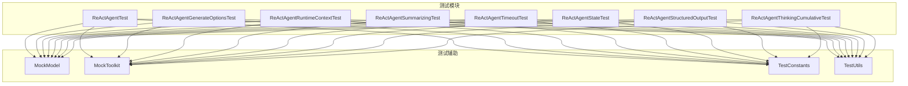
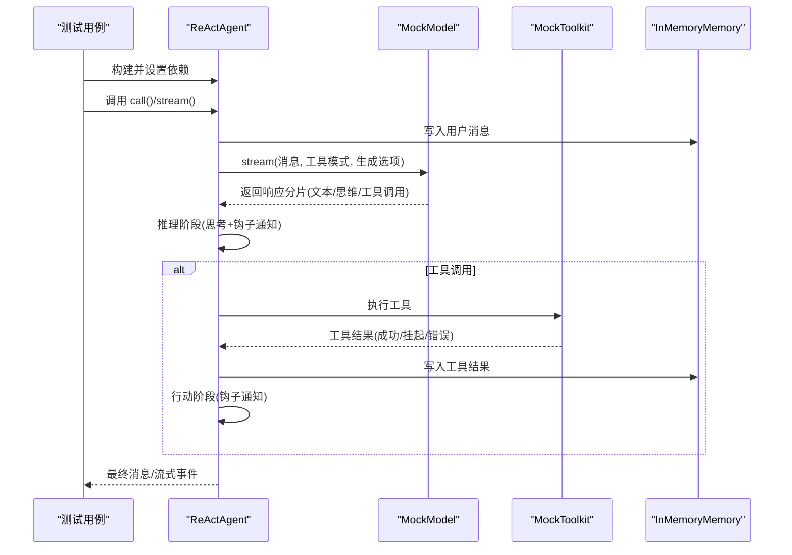
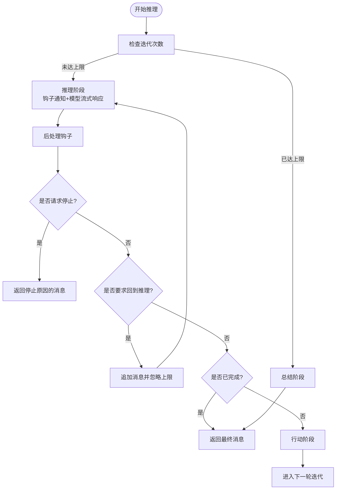
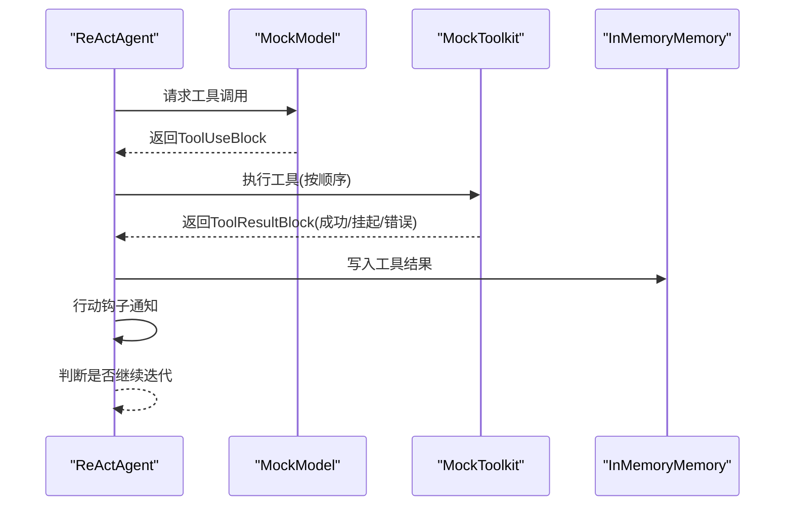
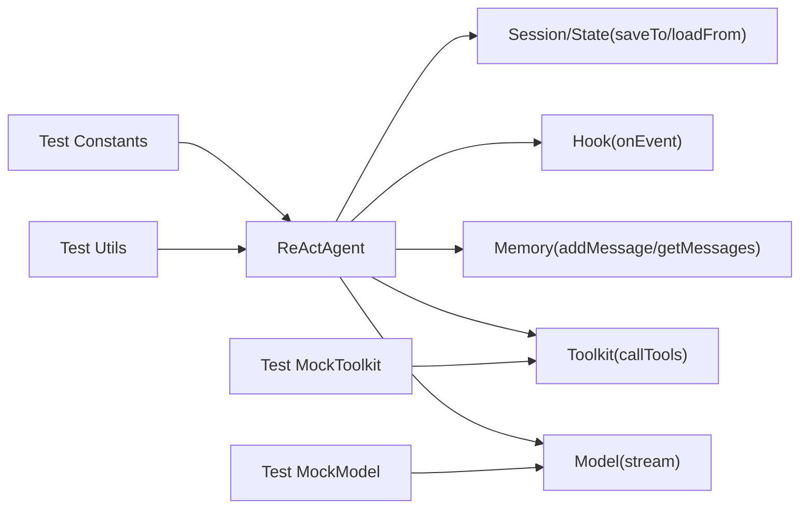

# ReAct 智能体测试

<cite>
**本文档引用的文件**
- [ReActAgent.java](file://agentscope-core/src/main/java/io/agentscope/core/ReActAgent.java)
- [ReActAgentTest.java](file://agentscope-core/src/test/java/io/agentscope/core/agent/ReActAgentTest.java)
- [MockModel.java](file://agentscope-core/src/test/java/io/agentscope/core/agent/test/MockModel.java)
- [MockToolkit.java](file://agentscope-core/src/test/java/io/agentscope/core/agent/test/MockToolkit.java)
- [TestConstants.java](file://agentscope-core/src/test/java/io/agentscope/core/agent/test/TestConstants.java)
- [TestUtils.java](file://agentscope-core/src/test/java/io/agentscope/core/agent/test/TestUtils.java)
- [ReActAgentGenerateOptionsTest.java](file://agentscope-core/src/test/java/io/agentscope/core/agent/ReActAgentGenerateOptionsTest.java)
- [ReActAgentRuntimeContextTest.java](file://agentscope-core/src/test/java/io/agentscope/core/agent/ReActAgentRuntimeContextTest.java)
- [ReActAgentSummarizingTest.java](file://agentscope-core/src/test/java/io/agentscope/core/agent/ReActAgentSummarizingTest.java)
- [ReActAgentTimeoutTest.java](file://agentscope-core/src/test/java/io/agentscope/core/agent/ReActAgentTimeoutTest.java)
- [ReActAgentStateTest.java](file://agentscope-core/src/test/java/io/agentscope/core/agent/ReActAgentStateTest.java)
- [ReActAgentStructuredOutputTest.java](file://agentscope-core/src/test/java/io/agentscope/core/agent/ReActAgentStructuredOutputTest.java)
- [ReActAgentThinkingCumulativeTest.java](file://agentscope-core/src/test/java/io/agentscope/core/agent/ReActAgentThinkingCumulativeTest.java)
</cite>

## 目录
1. [简介](#简介)
2. [项目结构](#项目结构)
3. [核心组件](#核心组件)
4. [架构总览](#架构总览)
5. [详细组件分析](#详细组件分析)
6. [依赖分析](#依赖分析)
7. [性能考虑](#性能考虑)
8. [故障排查指南](#故障排查指南)
9. [结论](#结论)
10. [附录](#附录)

## 简介
本技术文档面向 ReAct 智能体（ReActAgent）的测试体系，系统性阐述以下测试维度与最佳实践：
- 初始化测试：验证构建器参数、默认值与依赖注入
- 推理循环测试：覆盖思考与行动的迭代流程、最大迭代限制与总结机制
- 工具调用测试：模拟工具执行、错误处理、超时处理与结果落库
- 内存管理测试：对话历史保存、增量保存与状态持久化
- 流式处理测试：思维块累积/增量流式事件、分片事件与钩子交互
- 配置测试：生成选项（温度、TopP、最大令牌等）、执行配置合并
- 运行时上下文测试：每调用上下文绑定、工具与钩子共享上下文
- 结构化输出测试：类型安全输出、自动回退策略、并发竞态修复
- 异常与边界测试：空输入、重复工具调用、部分结果与中断信号

目标是帮助开发者在不依赖真实模型或工具的前提下，通过 Mock 模型与 Mock 工具完成全链路验证，并提供可复用的断言与边界条件覆盖策略。

## 项目结构
ReAct 智能体测试位于 agentscope-core 模块的 test/java/io/agentscope/core/agent 目录下，围绕 ReActAgent 的核心行为进行分层测试：
- 基础功能测试：ReActAgentTest
- 配置类测试：ReActAgentGenerateOptionsTest、ReActAgentRuntimeContextTest
- 生命周期与状态：ReActAgentStateTest、ReActAgentSummarizingTest
- 超时与异常：ReActAgentTimeoutTest
- 流式与思维块：ReActAgentThinkingCumulativeTest
- 结构化输出：ReActAgentStructuredOutputTest

图表来源
- [ReActAgentTest.java:1-1055](file://agentscope-core/src/test/java/io/agentscope/core/agent/ReActAgentTest.java#L1-L1055)
- [MockModel.java:1-234](file://agentscope-core/src/test/java/io/agentscope/core/agent/test/MockModel.java#L1-L234)
- [MockToolkit.java:1-205](file://agentscope-core/src/test/java/io/agentscope/core/agent/test/MockToolkit.java#L1-L205)
- [TestConstants.java:1-65](file://agentscope-core/src/test/java/io/agentscope/core/agent/test/TestConstants.java#L1-L65)
- [TestUtils.java:1-195](file://agentscope-core/src/test/java/io/agentscope/core/agent/test/TestUtils.java#L1-L195)

章节来源
- [ReActAgentTest.java:1-1055](file://agentscope-core/src/test/java/io/agentscope/core/agent/ReActAgentTest.java#L1-L1055)
- [MockModel.java:1-234](file://agentscope-core/src/test/java/io/agentscope/core/agent/test/MockModel.java#L1-L234)
- [MockToolkit.java:1-205](file://agentscope-core/src/test/java/io/agentscope/core/agent/test/MockToolkit.java#L1-L205)
- [TestConstants.java:1-65](file://agentscope-core/src/test/java/io/agentscope/core/agent/test/TestConstants.java#L1-L65)
- [TestUtils.java:1-195](file://agentscope-core/src/test/java/io/agentscope/core/agent/test/TestUtils.java#L1-L195)

## 核心组件
- ReActAgent：实现 ReAct 推理与行动的主类，支持钩子、内存、工具箱、结构化输出、流式响应与会话状态持久化。
- MockModel：可配置的模型替身，支持文本、思维块、工具调用响应与错误抛出；记录调用次数与最后输入/工具/选项。
- MockToolkit：可注册自定义行为的工具替身，支持正常返回、错误抛出与调用历史追踪。
- TestConstants：统一的测试常量（名称、提示词、输入、工具名、超时、迭代上限、模型响应）。
- TestUtils：测试工具集（消息构造、内容提取、工具参数构造、断言辅助）。

章节来源
- [ReActAgent.java:1-1904](file://agentscope-core/src/main/java/io/agentscope/core/ReActAgent.java#L1-L1904)
- [MockModel.java:1-234](file://agentscope-core/src/test/java/io/agentscope/core/agent/test/MockModel.java#L1-L234)
- [MockToolkit.java:1-205](file://agentscope-core/src/test/java/io/agentscope/core/agent/test/MockToolkit.java#L1-L205)
- [TestConstants.java:1-65](file://agentscope-core/src/test/java/io/agentscope/core/agent/test/TestConstants.java#L1-L65)
- [TestUtils.java:1-195](file://agentscope-core/src/test/java/io/agentscope/core/agent/test/TestUtils.java#L1-L195)

## 架构总览
ReActAgent 的测试采用“被测对象 + Mock 依赖”的架构，确保：
- 不依赖外部服务：通过 MockModel 提供可控响应
- 可观测性：通过钩子捕获推理/行动分片事件
- 可扩展性：通过工具箱注册不同行为的工具
- 可恢复性：通过内存与会话持久化恢复状态

图表来源
- [ReActAgentTest.java:110-237](file://agentscope-core/src/test/java/io/agentscope/core/agent/ReActAgentTest.java#L110-L237)
- [MockModel.java:114-141](file://agentscope-core/src/test/java/io/agentscope/core/agent/test/MockModel.java#L114-L141)
- [MockToolkit.java:140-167](file://agentscope-core/src/test/java/io/agentscope/core/agent/test/MockToolkit.java#L140-L167)

## 详细组件分析

### 初始化测试
- 验证点
  - 构建器参数正确注入（名称、系统提示、模型、工具箱、内存）
  - 默认最大迭代数与内存初始状态
  - 依赖实例一致性（工具箱复制隔离、内存实例一致）
- 断言策略
  - 使用断言检查属性非空与相等
  - 检查内存消息列表长度与角色
- 边界条件
  - 空系统提示与空工具箱的兼容性
  - 多次构建后实例隔离

章节来源
- [ReActAgentTest.java:94-109](file://agentscope-core/src/test/java/io/agentscope/core/agent/ReActAgentTest.java#L94-L109)

### 推理循环测试
- 验证点
  - 单轮简单回复、带思维块回复
  - 最大迭代限制触发与生成原因标记
  - 继续生成（无新输入）与记忆增长
- 断言策略
  - 检查生成原因（MAX_ITERATIONS）、消息数量与角色分布
  - 验证模型调用计数与输入消息
- 边界条件
  - 无限工具调用循环的保护
  - 思维块与文本混合输出

图表来源
- [ReActAgentTest.java:455-498](file://agentscope-core/src/test/java/io/agentscope/core/agent/ReActAgentTest.java#L455-L498)
- [ReActAgentSummarizingTest.java:52-148](file://agentscope-core/src/test/java/io/agentscope/core/agent/ReActAgentSummarizingTest.java#L52-L148)

章节来源
- [ReActAgentTest.java:141-173](file://agentscope-core/src/test/java/io/agentscope/core/agent/ReActAgentTest.java#L141-L173)
- [ReActAgentTest.java:455-498](file://agentscope-core/src/test/java/io/agentscope/core/agent/ReActAgentTest.java#L455-L498)
- [ReActAgentSummarizingTest.java:52-148](file://agentscope-core/src/test/java/io/agentscope/core/agent/ReActAgentSummarizingTest.java#L52-L148)

### 工具调用测试
- 验证点
  - 单工具与多工具顺序执行
  - 工具执行错误的兜底（生成错误结果块）
  - 工具结果写入内存与工具调用 ID 匹配
- 断言策略
  - 工具调用历史顺序与计数
  - 内存中 ToolResultBlock 的存在与输出内容特征
- 边界条件
  - 部分结果与文本混杂的非法输入校验
  - 重复 ID 校验与无效 ID 抛错

图表来源
- [ReActAgentTest.java:175-314](file://agentscope-core/src/test/java/io/agentscope/core/agent/ReActAgentTest.java#L175-L314)
- [MockToolkit.java:140-167](file://agentscope-core/src/test/java/io/agentscope/core/agent/test/MockToolkit.java#L140-L167)

章节来源
- [ReActAgentTest.java:175-314](file://agentscope-core/src/test/java/io/agentscope/core/agent/ReActAgentTest.java#L175-L314)
- [ReActAgentTest.java:316-383](file://agentscope-core/src/test/java/io/agentscope/core/agent/ReActAgentTest.java#L316-L383)

### 内存管理测试
- 验证点
  - 对话历史增量保存与加载
  - 会话状态（元数据、内存、工具组、计划）的保存/加载策略
  - StatePersistence 配置对保存范围的影响
- 断言策略
  - 加载前后消息数量与内容一致性
  - 工具组 activeGroups 恢复
- 边界条件
  - 仅内存保存、仅工具组保存、全部保存、无保存
  - JsonSession 增量保存与跨进程/文件系统一致性

章节来源
- [ReActAgentStateTest.java:109-165](file://agentscope-core/src/test/java/io/agentscope/core/agent/ReActAgentStateTest.java#L109-L165)
- [ReActAgentStateTest.java:173-231](file://agentscope-core/src/test/java/io/agentscope/core/agent/ReActAgentStateTest.java#L173-L231)
- [ReActAgentStateTest.java:261-326](file://agentscope-core/src/test/java/io/agentscope/core/agent/ReActAgentStateTest.java#L261-L326)
- [ReActAgentStateTest.java:333-426](file://agentscope-core/src/test/java/io/agentscope/core/agent/ReActAgentStateTest.java#L333-L426)

### 流式处理测试
- 验证点
  - 思维块累积/增量两种模式下的 ReasoningChunkEvent
  - 工具调用块的分片事件捕获
  - 流式响应的完整性与钩子可见性
- 断言策略
  - 累积字符串与增量片段的匹配
  - 工具调用块 ID 与输入参数一致性
- 边界条件
  - 空输入继续生成、钩子并发访问

章节来源
- [ReActAgentThinkingCumulativeTest.java:63-117](file://agentscope-core/src/test/java/io/agentscope/core/agent/ReActAgentThinkingCumulativeTest.java#L63-L117)
- [ReActAgentThinkingCumulativeTest.java:119-168](file://agentscope-core/src/test/java/io/agentscope/core/agent/ReActAgentThinkingCumulativeTest.java#L119-L168)
- [ReActAgentTest.java:707-807](file://agentscope-core/src/test/java/io/agentscope/core/agent/ReActAgentTest.java#L707-L807)

### 配置测试（生成选项与执行配置）
- 验证点
  - 生成选项（温度、TopP、最大令牌、惩罚项、TopK、种子、思考预算、推理强度）
  - 生成选项与执行配置的合并策略
  - 仅生成选项/仅执行配置的兼容性
- 断言策略
  - 构建后的生成选项字段精确匹配
  - 模型收到的 GenerateOptions 完整传递
- 边界条件
  - 零值、最大值、空对象、null 场景

章节来源
- [ReActAgentGenerateOptionsTest.java:73-165](file://agentscope-core/src/test/java/io/agentscope/core/agent/ReActAgentGenerateOptionsTest.java#L73-L165)
- [ReActAgentGenerateOptionsTest.java:172-276](file://agentscope-core/src/test/java/io/agentscope/core/agent/ReActAgentGenerateOptionsTest.java#L172-L276)
- [ReActAgentGenerateOptionsTest.java:283-381](file://agentscope-core/src/test/java/io/agentscope/core/agent/ReActAgentGenerateOptionsTest.java#L283-L381)
- [ReActAgentGenerateOptionsTest.java:388-481](file://agentscope-core/src/test/java/io/agentscope/core/agent/ReActAgentGenerateOptionsTest.java#L388-L481)

### 运行时上下文测试
- 验证点
  - 每次调用的 RuntimeContext 绑定与解绑
  - 钩子与工具共享同一上下文实例
  - 上下文中自定义对象的读写
- 断言策略
  - 钩子中获取的 RuntimeContext 与设置的一致
  - 工具函数参数中可直接注入 RuntimeContext 并读取
- 边界条件
  - 上下文为空、跨线程传递、并发访问

章节来源
- [ReActAgentRuntimeContextTest.java:87-144](file://agentscope-core/src/test/java/io/agentscope/core/agent/ReActAgentRuntimeContextTest.java#L87-L144)

### 结构化输出测试
- 验证点
  - 类型安全输出（指定类）与自动回退到工具驱动输出
  - 无新消息时基于现有内存生成结构化输出
  - ChatUsage 与 ThinkingBlock 在压缩后保留
  - 并发竞态修复（subscribeOn + 立即第二次调用）
- 断言策略
  - 结构化数据字段匹配
  - 元数据中结构化数据可提取
  - Token 计数与时间统计保持
- 边界条件
  - 空输入继续生成、重复注册清理竞态

章节来源
- [ReActAgentStructuredOutputTest.java:61-155](file://agentscope-core/src/test/java/io/agentscope/core/agent/ReActAgentStructuredOutputTest.java#L61-L155)
- [ReActAgentStructuredOutputTest.java:157-246](file://agentscope-core/src/test/java/io/agentscope/core/agent/ReActAgentStructuredOutputTest.java#L157-L246)
- [ReActAgentStructuredOutputTest.java:248-349](file://agentscope-core/src/test/java/io/agentscope/core/agent/ReActAgentStructuredOutputTest.java#L248-L349)
- [ReActAgentStructuredOutputTest.java:351-439](file://agentscope-core/src/test/java/io/agentscope/core/agent/ReActAgentStructuredOutputTest.java#L351-L439)
- [ReActAgentStructuredOutputTest.java:441-538](file://agentscope-core/src/test/java/io/agentscope/core/agent/ReActAgentStructuredOutputTest.java#L441-L538)
- [ReActAgentStructuredOutputTest.java:541-648](file://agentscope-core/src/test/java/io/agentscope/core/agent/ReActAgentStructuredOutputTest.java#L541-L648)

### 超时与异常测试
- 验证点
  - 工具执行超时（toolExecutionConfig.timeout）的错误兜底
  - 无配置时不应用超时
  - 模型错误传播与异常路径
- 断言策略
  - 内存中出现包含“超时”关键词的工具结果
  - 无配置时工具正常完成
- 边界条件
  - 空输入、重复工具调用、部分结果与文本混杂

章节来源
- [ReActAgentTimeoutTest.java:54-126](file://agentscope-core/src/test/java/io/agentscope/core/agent/ReActAgentTimeoutTest.java#L54-L126)
- [ReActAgentTimeoutTest.java:128-156](file://agentscope-core/src/test/java/io/agentscope/core/agent/ReActAgentTimeoutTest.java#L128-L156)

## 依赖分析
- ReActAgent 对外依赖
  - 模型接口：用于流式生成（推理阶段）
  - 工具箱：用于执行工具（行动阶段）
  - 内存：用于对话历史存储
  - 钩子：用于事件监听与拦截
  - 会话与状态模块：用于状态持久化
- 测试依赖
  - MockModel：控制模型行为与断言输入/输出
  - MockToolkit：控制工具行为与断言调用历史
  - TestConstants/TestUtils：统一常量与工具方法

图表来源
- [ReActAgent.java:363-800](file://agentscope-core/src/main/java/io/agentscope/core/ReActAgent.java#L363-L800)
- [MockModel.java:114-141](file://agentscope-core/src/test/java/io/agentscope/core/agent/test/MockModel.java#L114-L141)
- [MockToolkit.java:140-167](file://agentscope-core/src/test/java/io/agentscope/core/agent/test/MockToolkit.java#L140-L167)

章节来源
- [ReActAgent.java:363-800](file://agentscope-core/src/main/java/io/agentscope/core/ReActAgent.java#L363-L800)

## 性能考虑
- 流式处理
  - 使用 Project Reactor 的 Flux/Mono 实现非阻塞流式生成与事件通知
  - 合理设置生成选项与执行配置以平衡延迟与吞吐
- 工具执行
  - 为工具执行设置合理的超时，避免长时间阻塞
  - 使用挂起工具结果（ToolSuspendException）支持异步协作
- 内存与状态
  - 合理配置 StatePersistence，避免过度保存导致 IO 压力
  - 使用增量保存与会话键隔离，减少冲突

## 故障排查指南
- 推理循环卡住
  - 检查模型是否持续返回工具调用而未结束
  - 确认 maxIters 设置与生成原因
- 工具执行失败
  - 查看内存中的 ToolResultBlock 是否包含错误信息
  - 校验工具 ID 与参数映射
- 超时问题
  - 确认 toolExecutionConfig.timeout 是否正确设置
  - 检查工具实现是否阻塞或未正确处理中断
- 结构化输出异常
  - 确认 generate_response 工具可用且参数格式正确
  - 关注并发竞态修复后的稳定性

章节来源
- [ReActAgentTest.java:316-383](file://agentscope-core/src/test/java/io/agentscope/core/agent/ReActAgentTest.java#L316-L383)
- [ReActAgentTimeoutTest.java:54-126](file://agentscope-core/src/test/java/io/agentscope/core/agent/ReActAgentTimeoutTest.java#L54-L126)
- [ReActAgentStructuredOutputTest.java:541-648](file://agentscope-core/src/test/java/io/agentscope/core/agent/ReActAgentStructuredOutputTest.java#L541-L648)

## 结论
通过 Mock 模型与 Mock 工具，ReAct 智能体测试实现了对核心行为的全面覆盖，包括初始化、推理循环、工具调用、内存管理、流式处理、配置、运行时上下文、结构化输出与异常处理。建议在集成测试中结合真实模型与工具，进一步验证端到端效果与性能表现。

## 附录
- 测试最佳实践清单
  - 使用 TestConstants 与 TestUtils 统一常量与工具
  - 为每个测试场景编写明确的断言与边界条件
  - 使用钩子捕获中间状态，便于调试与验证
  - 对并发场景（结构化输出）增加重复测试与系统属性开关
  - 对状态持久化使用 InMemorySession 与 JsonSession 双重验证