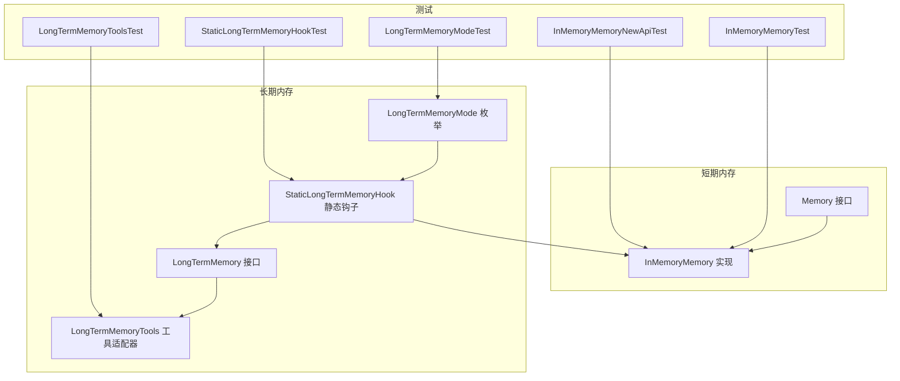
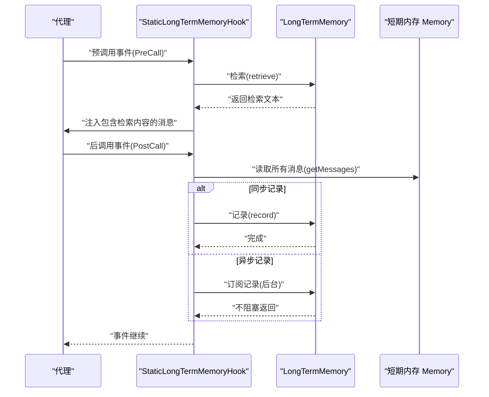
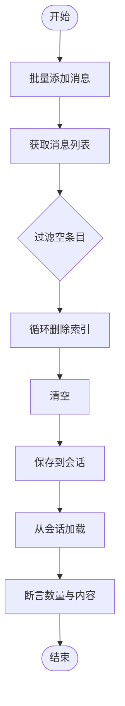
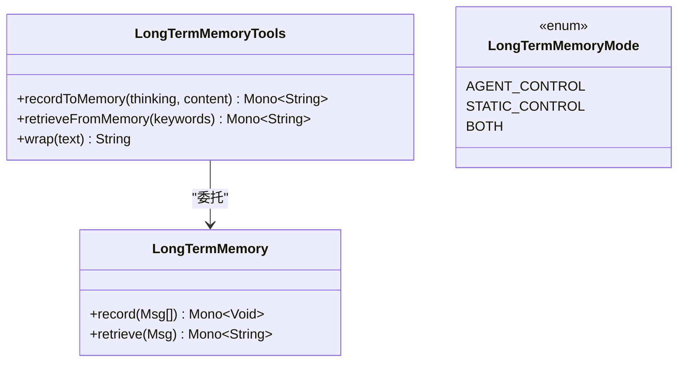
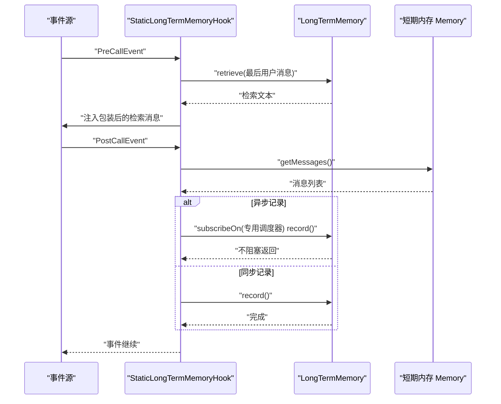
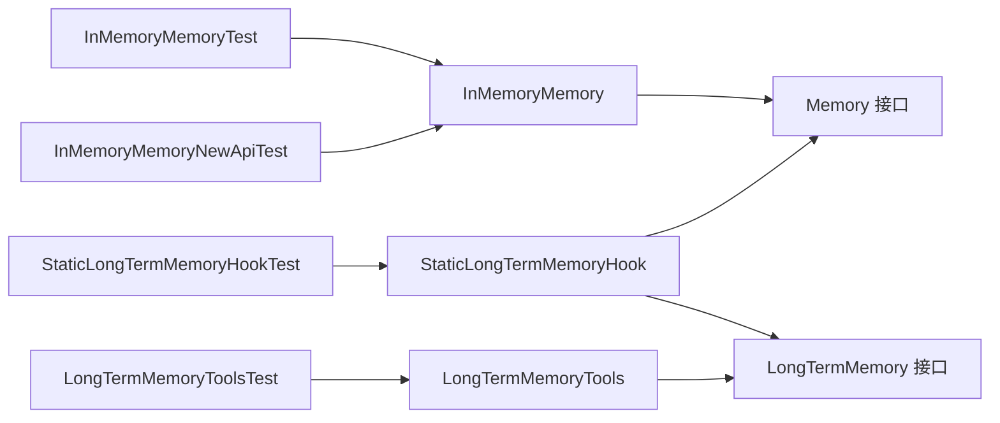

# 内存管理测试

<cite>
**本文档引用的文件**
- [Memory.java](file://agentscope-core/src/main/java/io/agentscope/core/memory/Memory.java)
- [InMemoryMemory.java](file://agentscope-core/src/main/java/io/agentscope/core/memory/InMemoryMemory.java)
- [LongTermMemory.java](file://agentscope-core/src/main/java/io/agentscope/core/memory/LongTermMemory.java)
- [StaticLongTermMemoryHook.java](file://agentscope-core/src/main/java/io/agentscope/core/memory/StaticLongTermMemoryHook.java)
- [LongTermMemoryTools.java](file://agentscope-core/src/main/java/io/agentscope/core/memory/LongTermMemoryTools.java)
- [LongTermMemoryMode.java](file://agentscope-core/src/main/java/io/agentscope/core/memory/LongTermMemoryMode.java)
- [InMemoryMemoryTest.java](file://agentscope-core/src/test/java/io/agentscope/core/memory/InMemoryMemoryTest.java)
- [InMemoryMemoryNewApiTest.java](file://agentscope-core/src/test/java/io/agentscope/core/memory/InMemoryMemoryNewApiTest.java)
- [StaticLongTermMemoryHookTest.java](file://agentscope-core/src/test/java/io/agentscope/core/memory/StaticLongTermMemoryHookTest.java)
- [LongTermMemoryModeTest.java](file://agentscope-core/src/test/java/io/agentscope/core/memory/LongTermMemoryModeTest.java)
- [LongTermMemoryToolsTest.java](file://agentscope-core/src/test/java/io/agentscope/core/memory/LongTermMemoryToolsTest.java)
</cite>

## 目录
1. [简介](#简介)
2. [项目结构](#项目结构)
3. [核心组件](#核心组件)
4. [架构总览](#架构总览)
5. [详细组件分析](#详细组件分析)
6. [依赖关系分析](#依赖关系分析)
7. [性能考虑](#性能考虑)
8. [故障排除指南](#故障排除指南)
9. [结论](#结论)
10. [附录](#附录)

## 简介
本文件面向内存管理测试，系统性梳理短期内存（InMemoryMemory）、长期内存（LongTermMemory 及其工具与静态钩子）的测试策略与最佳实践。内容覆盖：
- 短期内存测试：数据结构、持久化、清理、并发安全与边界条件
- 长期内存测试：记录与检索流程、错误处理与异步记录
- 内存接口测试：工具适配器与模式枚举的正确性
- 静态长期内存钩子测试：事件驱动的自动记忆注入与记录
- 性能与稳定性：异步记录调度、背压与资源隔离
- 故障排除：常见异常、日志与恢复策略

## 项目结构
内存相关的核心代码位于 agentscope-core 模块的 memory 包中，配套测试位于 test/java/io/agentscope/core/memory 下。关键文件包括：
- 接口与实现：Memory、InMemoryMemory
- 长期内存抽象与工具：LongTermMemory、LongTermMemoryTools、LongTermMemoryMode
- 静态钩子：StaticLongTermMemoryHook
- 对应单元测试：覆盖上述组件的行为验证与边界条件

**图表来源**
- [Memory.java:29-62](file://agentscope-core/src/main/java/io/agentscope/core/memory/Memory.java#L29-L62)
- [InMemoryMemory.java:33-127](file://agentscope-core/src/main/java/io/agentscope/core/memory/InMemoryMemory.java#L33-L127)
- [LongTermMemory.java:67-107](file://agentscope-core/src/main/java/io/agentscope/core/memory/LongTermMemory.java#L67-L107)
- [LongTermMemoryTools.java:65-213](file://agentscope-core/src/main/java/io/agentscope/core/memory/LongTermMemoryTools.java#L65-L213)
- [LongTermMemoryMode.java:52-68](file://agentscope-core/src/main/java/io/agentscope/core/memory/LongTermMemoryMode.java#L52-L68)
- [StaticLongTermMemoryHook.java:75-297](file://agentscope-core/src/main/java/io/agentscope/core/memory/StaticLongTermMemoryHook.java#L75-L297)
- [InMemoryMemoryTest.java:28-176](file://agentscope-core/src/test/java/io/agentscope/core/memory/InMemoryMemoryTest.java#L28-L176)
- [InMemoryMemoryNewApiTest.java:36-222](file://agentscope-core/src/test/java/io/agentscope/core/memory/InMemoryMemoryNewApiTest.java#L36-L222)
- [StaticLongTermMemoryHookTest.java:49-341](file://agentscope-core/src/test/java/io/agentscope/core/memory/StaticLongTermMemoryHookTest.java#L49-L341)
- [LongTermMemoryModeTest.java:24-80](file://agentscope-core/src/test/java/io/agentscope/core/memory/LongTermMemoryModeTest.java#L24-L80)
- [LongTermMemoryToolsTest.java:41-338](file://agentscope-core/src/test/java/io/agentscope/core/memory/LongTermMemoryToolsTest.java#L41-L338)

**章节来源**
- [Memory.java:22-62](file://agentscope-core/src/main/java/io/agentscope/core/memory/Memory.java#L22-L62)
- [InMemoryMemory.java:27-127](file://agentscope-core/src/main/java/io/agentscope/core/memory/InMemoryMemory.java#L27-L127)
- [LongTermMemory.java:22-107](file://agentscope-core/src/main/java/io/agentscope/core/memory/LongTermMemory.java#L22-L107)
- [LongTermMemoryTools.java:27-213](file://agentscope-core/src/main/java/io/agentscope/core/memory/LongTermMemoryTools.java#L27-L213)
- [LongTermMemoryMode.java:18-68](file://agentscope-core/src/main/java/io/agentscope/core/memory/LongTermMemoryMode.java#L18-L68)
- [StaticLongTermMemoryHook.java:35-297](file://agentscope-core/src/main/java/io/agentscope/core/memory/StaticLongTermMemoryHook.java#L35-L297)

## 核心组件
- Memory 接口：定义短期内存的基本能力（添加消息、获取消息、删除指定索引消息、清空）
- InMemoryMemory：基于线程安全列表的短期内存实现，支持状态模块的保存/加载
- LongTermMemory：长期内存抽象，定义记录与检索两个异步方法
- LongTermMemoryTools：将长期内存 API 适配为工具函数，供代理调用
- LongTermMemoryMode：控制长期内存集成模式（代理控制、静态控制、两者皆有）
- StaticLongTermMemoryHook：在事件流中自动执行检索与记录，支持同步/异步记录

**章节来源**
- [Memory.java:29-62](file://agentscope-core/src/main/java/io/agentscope/core/memory/Memory.java#L29-L62)
- [InMemoryMemory.java:33-127](file://agentscope-core/src/main/java/io/agentscope/core/memory/InMemoryMemory.java#L33-L127)
- [LongTermMemory.java:67-107](file://agentscope-core/src/main/java/io/agentscope/core/memory/LongTermMemory.java#L67-L107)
- [LongTermMemoryTools.java:65-213](file://agentscope-core/src/main/java/io/agentscope/core/memory/LongTermMemoryTools.java#L65-L213)
- [LongTermMemoryMode.java:52-68](file://agentscope-core/src/main/java/io/agentscope/core/memory/LongTermMemoryMode.java#L52-L68)
- [StaticLongTermMemoryHook.java:75-297](file://agentscope-core/src/main/java/io/agentscope/core/memory/StaticLongTermMemoryHook.java#L75-L297)

## 架构总览
短期与长期内存通过统一的消息模型（Msg）进行交互。短期内存负责会话内历史，长期内存负责跨会话持久化与检索；静态钩子在框架事件链中自动注入上下文并记录对话。

**图表来源**
- [StaticLongTermMemoryHook.java:121-259](file://agentscope-core/src/main/java/io/agentscope/core/memory/StaticLongTermMemoryHook.java#L121-L259)
- [LongTermMemory.java:69-106](file://agentscope-core/src/main/java/io/agentscope/core/memory/LongTermMemory.java#L69-L106)
- [Memory.java:31-61](file://agentscope-core/src/main/java/io/agentscope/core/memory/Memory.java#L31-L61)

## 详细组件分析

### 短期内存测试（InMemoryMemory）
目标：
- 数据结构测试：消息列表的增删查与空值过滤
- 持久化测试：saveTo/loadFrom 的增量保存与替换行为
- 清理测试：clear 行为与空内存处理
- 并发测试：多线程下 add/delete/clear 的一致性
- 边界条件：无效索引删除、空消息过滤、空内存操作

测试要点与建议：
- 增删查：使用构造消息工具，验证 getMessages 过滤 null、deleteMessage 越界无异常
- 持久化：InMemorySession 与 JsonSession 双场景，验证增量保存与替换
- 并发：循环批量 add，随后批量 delete，最后 clear
- 边界：负索引、越界索引、等于 size 的索引均不应抛错

**图表来源**
- [InMemoryMemoryTest.java:37-175](file://agentscope-core/src/test/java/io/agentscope/core/memory/InMemoryMemoryTest.java#L37-L175)
- [InMemoryMemoryNewApiTest.java:53-116](file://agentscope-core/src/test/java/io/agentscope/core/memory/InMemoryMemoryNewApiTest.java#L53-L116)

**章节来源**
- [InMemoryMemoryTest.java:37-175](file://agentscope-core/src/test/java/io/agentscope/core/memory/InMemoryMemoryTest.java#L37-L175)
- [InMemoryMemoryNewApiTest.java:53-116](file://agentscope-core/src/test/java/io/agentscope/core/memory/InMemoryMemoryNewApiTest.java#L53-L116)

### 长期内存接口测试（LongTermMemory）
目标：
- 接口契约：record/retrieve 返回 Mono，空列表与 null 处理
- 工具适配器：recordToMemory/retrieveFromMemory 的参数校验与消息角色设置
- 模式枚举：三种模式的存在性与取值

测试要点与建议：
- 工具适配器：空内容返回提示、空思考但有内容时仅 USER 角色、错误路径返回错误信息
- 检索：关键词拼接、空结果与空 Mono 的不同处理
- 模式：确保 AGENT_CONTROL、STATIC_CONTROL、BOTH 三者存在且可取值

**图表来源**
- [LongTermMemory.java:67-107](file://agentscope-core/src/main/java/io/agentscope/core/memory/LongTermMemory.java#L67-L107)
- [LongTermMemoryTools.java:65-213](file://agentscope-core/src/main/java/io/agentscope/core/memory/LongTermMemoryTools.java#L65-L213)
- [LongTermMemoryMode.java:52-68](file://agentscope-core/src/main/java/io/agentscope/core/memory/LongTermMemoryMode.java#L52-L68)

**章节来源**
- [LongTermMemoryToolsTest.java:52-337](file://agentscope-core/src/test/java/io/agentscope/core/memory/LongTermMemoryToolsTest.java#L52-L337)
- [LongTermMemoryModeTest.java:26-79](file://agentscope-core/src/test/java/io/agentscope/core/memory/LongTermMemoryModeTest.java#L26-L79)

### 静态长期内存钩子测试（StaticLongTermMemoryHook）
目标：
- 事件处理：PreCall 注入检索内容；PostCall 记录对话
- 错误处理：检索/记录失败时的日志与不中断
- 异步记录：背压与饱和丢弃策略，上下文传播
- 边界条件：空消息、空检索、空记录

测试要点与建议：
- PreCall：最后一条用户消息作为查询，注入包装后的检索文本
- PostCall：同步/异步两种路径，异步记录使用专用调度器，饱和时丢弃并记录警告
- 错误：检索/记录异常被吞并并记录告警，不影响主流程
- 优先级：高优先级确保在事件链早期执行

**图表来源**
- [StaticLongTermMemoryHook.java:121-259](file://agentscope-core/src/main/java/io/agentscope/core/memory/StaticLongTermMemoryHook.java#L121-L259)
- [StaticLongTermMemoryHookTest.java:124-340](file://agentscope-core/src/test/java/io/agentscope/core/memory/StaticLongTermMemoryHookTest.java#L124-L340)

**章节来源**
- [StaticLongTermMemoryHookTest.java:124-340](file://agentscope-core/src/test/java/io/agentscope/core/memory/StaticLongTermMemoryHookTest.java#L124-L340)
- [StaticLongTermMemoryHook.java:121-259](file://agentscope-core/src/main/java/io/agentscope/core/memory/StaticLongTermMemoryHook.java#L121-L259)

### 内存状态管理测试
- 短期内存：saveTo/loadFrom 的幂等与增量特性；loadIfExists 的存在性判断
- 长期内存：工具适配器对消息角色与内容的规范化处理
- 静态钩子：事件优先级与上下文传播

测试要点与建议：
- 状态模块 API：空内存保存后加载为空；增量保存后加载为最新集合
- 工具适配器：空内容返回提示；空检索返回“未找到”；错误返回错误信息
- 钩子：优先级固定值；异步记录不阻塞主线程

**章节来源**
- [InMemoryMemoryNewApiTest.java:53-116](file://agentscope-core/src/test/java/io/agentscope/core/memory/InMemoryMemoryNewApiTest.java#L53-L116)
- [LongTermMemoryToolsTest.java:178-261](file://agentscope-core/src/test/java/io/agentscope/core/memory/LongTermMemoryToolsTest.java#L178-L261)
- [StaticLongTermMemoryHook.java:135-139](file://agentscope-core/src/main/java/io/agentscope/core/memory/StaticLongTermMemoryHook.java#L135-L139)

### 内存并发访问测试
- 短期内存：CopyOnWriteArrayList 提供读写分离，测试高并发下的增删查一致性
- 静态钩子：异步记录使用专用调度器，避免全局限流导致的阻塞

测试要点与建议：
- 批量 add + 批量 delete + clear 的组合并发场景
- 异步记录的饱和丢弃与告警日志验证

**章节来源**
- [InMemoryMemoryTest.java:154-175](file://agentscope-core/src/test/java/io/agentscope/core/memory/InMemoryMemoryTest.java#L154-L175)
- [StaticLongTermMemoryHookTest.java:257-340](file://agentscope-core/src/test/java/io/agentscope/core/memory/StaticLongTermMemoryHookTest.java#L257-L340)

### 内存异常处理测试
- 长期内存：record/retrieve 抛出异常时，工具适配器返回错误信息
- 静态钩子：PreCall/PostCall 中的异常被吞并并记录警告，事件继续传递
- 调度器：异步记录饱和时丢弃任务并记录告警

测试要点与建议：
- 使用 Mockito 模拟异常路径，验证错误信息与日志输出
- 异步记录使用 CountDownLatch 等待后台任务完成

**章节来源**
- [LongTermMemoryToolsTest.java:168-177](file://agentscope-core/src/test/java/io/agentscope/core/memory/LongTermMemoryToolsTest.java#L168-L177)
- [StaticLongTermMemoryHookTest.java:178-199](file://agentscope-core/src/test/java/io/agentscope/core/memory/StaticLongTermMemoryHookTest.java#L178-L199)
- [StaticLongTermMemoryHook.java:226-258](file://agentscope-core/src/main/java/io/agentscope/core/memory/StaticLongTermMemoryHook.java#L226-L258)

## 依赖关系分析
- InMemoryMemory 依赖线程安全列表，实现 Memory 接口
- StaticLongTermMemoryHook 依赖 LongTermMemory 与 Memory，通过事件驱动工作
- LongTermMemoryTools 依赖 LongTermMemory，提供工具函数
- 测试用例分别覆盖各组件的行为与边界

**图表来源**
- [InMemoryMemory.java:33-127](file://agentscope-core/src/main/java/io/agentscope/core/memory/InMemoryMemory.java#L33-L127)
- [StaticLongTermMemoryHook.java:75-297](file://agentscope-core/src/main/java/io/agentscope/core/memory/StaticLongTermMemoryHook.java#L75-L297)
- [LongTermMemoryTools.java:65-213](file://agentscope-core/src/main/java/io/agentscope/core/memory/LongTermMemoryTools.java#L65-L213)
- [InMemoryMemoryTest.java:28-176](file://agentscope-core/src/test/java/io/agentscope/core/memory/InMemoryMemoryTest.java#L28-L176)
- [InMemoryMemoryNewApiTest.java:36-222](file://agentscope-core/src/test/java/io/agentscope/core/memory/InMemoryMemoryNewApiTest.java#L36-L222)
- [StaticLongTermMemoryHookTest.java:49-341](file://agentscope-core/src/test/java/io/agentscope/core/memory/StaticLongTermMemoryHookTest.java#L49-L341)
- [LongTermMemoryToolsTest.java:41-338](file://agentscope-core/src/test/java/io/agentscope/core/memory/LongTermMemoryToolsTest.java#L41-L338)

**章节来源**
- [InMemoryMemory.java:33-127](file://agentscope-core/src/main/java/io/agentscope/core/memory/InMemoryMemory.java#L33-L127)
- [StaticLongTermMemoryHook.java:75-297](file://agentscope-core/src/main/java/io/agentscope/core/memory/StaticLongTermMemoryHook.java#L75-L297)
- [LongTermMemoryTools.java:65-213](file://agentscope-core/src/main/java/io/agentscope/core/memory/LongTermMemoryTools.java#L65-L213)

## 性能考虑
- 短期内存：CopyOnWriteArrayList 适合读多写少场景；大量写入时注意内存复制开销
- 静态钩子异步记录：专用 boundedElastic 调度器限制并发与队列长度，避免无界增长
- 背压策略：饱和时丢弃新任务并记录警告，保证主线程响应性
- 上下文传播：异步记录保留事件上下文，便于追踪

**章节来源**
- [StaticLongTermMemoryHook.java:77-83](file://agentscope-core/src/main/java/io/agentscope/core/memory/StaticLongTermMemoryHook.java#L77-L83)
- [StaticLongTermMemoryHook.java:226-258](file://agentscope-core/src/main/java/io/agentscope/core/memory/StaticLongTermMemoryHook.java#L226-L258)

## 故障排除指南
- 短期内存
  - 删除越界：不会抛异常，应断言数量不变
  - 清空空内存：幂等操作，不应抛异常
  - 持久化不生效：确认 saveTo/loadFrom 的 SessionKey 一致
- 长期内存
  - 工具适配器返回“无内容/无关键字”：检查输入参数
  - 检索/记录异常：查看日志中的错误信息，确认底层实现是否抛错
- 静态钩子
  - 异步记录未触发：检查是否启用 asyncRecord，确认调度器容量
  - 事件未注入检索：确认 PreCallEvent 的消息列表非空且包含用户消息

**章节来源**
- [InMemoryMemoryTest.java:106-132](file://agentscope-core/src/test/java/io/agentscope/core/memory/InMemoryMemoryTest.java#L106-L132)
- [LongTermMemoryToolsTest.java:118-135](file://agentscope-core/src/test/java/io/agentscope/core/memory/LongTermMemoryToolsTest.java#L118-L135)
- [StaticLongTermMemoryHookTest.java:257-340](file://agentscope-core/src/test/java/io/agentscope/core/memory/StaticLongTermMemoryHookTest.java#L257-L340)

## 结论
本测试体系围绕短期与长期内存的接口契约、工具适配与事件钩子展开，覆盖了数据结构、持久化、并发、异常与性能等关键维度。通过单元测试与事件驱动验证，确保内存子系统的可靠性与可维护性。

## 附录
- 测试示例路径参考
  - 短期内存：[InMemoryMemoryTest.java:37-175](file://agentscope-core/src/test/java/io/agentscope/core/memory/InMemoryMemoryTest.java#L37-L175)
  - 短期内存新 API：[InMemoryMemoryNewApiTest.java:53-116](file://agentscope-core/src/test/java/io/agentscope/core/memory/InMemoryMemoryNewApiTest.java#L53-L116)
  - 静态钩子：[StaticLongTermMemoryHookTest.java:124-340](file://agentscope-core/src/test/java/io/agentscope/core/memory/StaticLongTermMemoryHookTest.java#L124-L340)
  - 长期内存工具：[LongTermMemoryToolsTest.java:52-337](file://agentscope-core/src/test/java/io/agentscope/core/memory/LongTermMemoryToolsTest.java#L52-L337)
  - 模式枚举：[LongTermMemoryModeTest.java:26-79](file://agentscope-core/src/test/java/io/agentscope/core/memory/LongTermMemoryModeTest.java#L26-L79)