# 工具执行测试

<cite>
**本文档引用的文件**
- [ToolExecutorTest.java](file://agentscope-core/src/test/java/io/agentscope/core/tool/ToolExecutorTest.java)
- [ToolRegistryTest.java](file://agentscope-core/src/test/java/io/agentscope/core/tool/ToolRegistryTest.java)
- [RegisteredToolFunctionTest.java](file://agentscope-core/src/test/java/io/agentscope/core/tool/RegisteredToolFunctionTest.java)
- [ToolGroupManagerTest.java](file://agentscope-core/src/test/java/io/agentscope/core/tool/ToolGroupManagerTest.java)
- [ToolkitTest.java](file://agentscope-core/src/test/java/io/agentscope/core/tool/ToolkitTest.java)
- [ToolValidatorTest.java](file://agentscope-core/src/test/java/io/agentscope/core/tool/ToolValidatorTest.java)
- [DefaultToolResultConverterTest.java](file://agentscope-core/src/test/java/io/agentscope/core/tool/DefaultToolResultConverterTest.java)
- [AsyncToolTest.java](file://agentscope-core/src/test/java/io/agentscope/core/tool/AsyncToolTest.java)
- [ToolIntegrationTest.java](file://agentscope-core/src/test/java/io/agentscope/core/tool/ToolIntegrationTest.java)
- [ToolSchemaGeneratorTest.java](file://agentscope-core/src/test/java/io/agentscope/core/tool/ToolSchemaGeneratorTest.java)
</cite>

## 目录
1. [简介](#简介)
2. [项目结构](#项目结构)
3. [核心组件](#核心组件)
4. [架构概览](#架构概览)
5. [详细组件分析](#详细组件分析)
6. [依赖分析](#依赖分析)
7. [性能考虑](#性能考虑)
8. [故障排除指南](#故障排除指南)
9. [结论](#结论)
10. [附录](#附录)

## 简介
本文件面向工具执行测试的全面技术文档，系统性阐述工具执行器测试、工具包测试、工具注册表测试、注册工具函数测试的实现方法与最佳实践。同时覆盖工具调用流程测试、并行执行测试、错误处理测试、工具组管理测试、工具参数验证测试、工具结果转换测试以及工具生命周期测试的实施策略，并提供完整测试示例以覆盖各种使用场景与边界条件。

## 项目结构
围绕工具执行测试的核心文件主要位于 agentscope-core 模块的 tool 测试包中，采用按功能域分层的组织方式：
- 工具执行与调度：ToolExecutorTest
- 工具注册与发现：ToolRegistryTest、RegisteredToolFunctionTest
- 工具组管理：ToolGroupManagerTest
- 工具包与注册流程：ToolkitTest
- 参数验证与模式生成：ToolValidatorTest、ToolSchemaGeneratorTest
- 结果转换与序列化：DefaultToolResultConverterTest
- 异步执行与集成：AsyncToolTest、ToolIntegrationTest

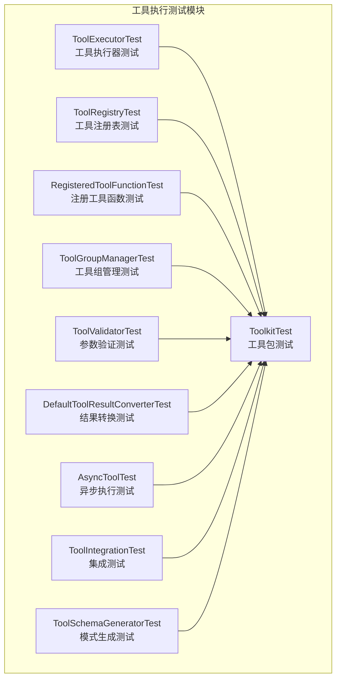

**图表来源**
- [ToolExecutorTest.java:1-506](file://agentscope-core/src/test/java/io/agentscope/core/tool/ToolExecutorTest.java#L1-L506)
- [ToolRegistryTest.java:1-363](file://agentscope-core/src/test/java/io/agentscope/core/tool/ToolRegistryTest.java#L1-L363)
- [RegisteredToolFunctionTest.java:1-344](file://agentscope-core/src/test/java/io/agentscope/core/tool/RegisteredToolFunctionTest.java#L1-L344)
- [ToolGroupManagerTest.java:1-485](file://agentscope-core/src/test/java/io/agentscope/core/tool/ToolGroupManagerTest.java#L1-L485)
- [ToolkitTest.java:1-800](file://agentscope-core/src/test/java/io/agentscope/core/tool/ToolkitTest.java#L1-L800)
- [ToolValidatorTest.java:1-901](file://agentscope-core/src/test/java/io/agentscope/core/tool/ToolValidatorTest.java#L1-L901)
- [DefaultToolResultConverterTest.java:1-336](file://agentscope-core/src/test/java/io/agentscope/core/tool/DefaultToolResultConverterTest.java#L1-L336)
- [AsyncToolTest.java:1-227](file://agentscope-core/src/test/java/io/agentscope/core/tool/AsyncToolTest.java#L1-L227)
- [ToolIntegrationTest.java:1-185](file://agentscope-core/src/test/java/io/agentscope/core/tool/ToolIntegrationTest.java#L1-L185)
- [ToolSchemaGeneratorTest.java:1-87](file://agentscope-core/src/test/java/io/agentscope/core/tool/ToolSchemaGeneratorTest.java#L1-L87)

**章节来源**
- [ToolExecutorTest.java:1-506](file://agentscope-core/src/test/java/io/agentscope/core/tool/ToolExecutorTest.java#L1-L506)
- [ToolkitTest.java:1-800](file://agentscope-core/src/test/java/io/agentscope/core/tool/ToolkitTest.java#L1-L800)

## 核心组件
本节概述工具执行测试涉及的核心组件及其职责：
- 工具执行器（ToolExecutor）：负责并发执行工具调用、错误包装与一致性格式化。
- 工具注册表（ToolRegistry）：维护工具名称到工具实例与注册元数据的映射，支持并发访问与覆盖注册。
- 注册工具函数（RegisteredToolFunction）：封装工具与扩展模型、MCP 客户端信息，合并基础参数与扩展参数。
- 工具组管理器（ToolGroupManager）：管理工具组的创建、激活/停用、成员分配与查询。
- 工具包（Toolkit）：统一注册、发现、执行工具，支持预设参数、组权限控制与动态更新。
- 参数验证器（ToolValidator）：基于 JSON Schema 验证输入参数，支持嵌套对象、$ref 解析等。
- 结果转换器（DefaultToolResultConverter）：将任意返回值转换为 ToolResultBlock，包含日期时间类型序列化。
- 异步工具（AsyncToolTest）：验证 CompletableFuture 与 Mono 返回类型的异步执行、错误传播与并行执行。
- 集成测试（ToolIntegrationTest）：验证工具与代理、内存、模型的集成行为与超时处理。

**章节来源**
- [ToolExecutorTest.java:42-506](file://agentscope-core/src/test/java/io/agentscope/core/tool/ToolExecutorTest.java#L42-L506)
- [ToolRegistryTest.java:34-363](file://agentscope-core/src/test/java/io/agentscope/core/tool/ToolRegistryTest.java#L34-L363)
- [RegisteredToolFunctionTest.java:31-344](file://agentscope-core/src/test/java/io/agentscope/core/tool/RegisteredToolFunctionTest.java#L31-L344)
- [ToolGroupManagerTest.java:30-485](file://agentscope-core/src/test/java/io/agentscope/core/tool/ToolGroupManagerTest.java#L30-L485)
- [ToolkitTest.java:48-800](file://agentscope-core/src/test/java/io/agentscope/core/tool/ToolkitTest.java#L48-L800)
- [ToolValidatorTest.java:41-901](file://agentscope-core/src/test/java/io/agentscope/core/tool/ToolValidatorTest.java#L41-L901)
- [DefaultToolResultConverterTest.java:37-336](file://agentscope-core/src/test/java/io/agentscope/core/tool/DefaultToolResultConverterTest.java#L37-L336)
- [AsyncToolTest.java:36-227](file://agentscope-core/src/test/java/io/agentscope/core/tool/AsyncToolTest.java#L36-L227)
- [ToolIntegrationTest.java:37-185](file://agentscope-core/src/test/java/io/agentscope/core/tool/ToolIntegrationTest.java#L37-L185)
- [ToolSchemaGeneratorTest.java:33-87](file://agentscope-core/src/test/java/io/agentscope/core/tool/ToolSchemaGeneratorTest.java#L33-L87)

## 架构概览
下图展示工具执行测试在系统中的交互关系，强调从工具包到执行器、注册表、组管理器与验证器的协作路径。

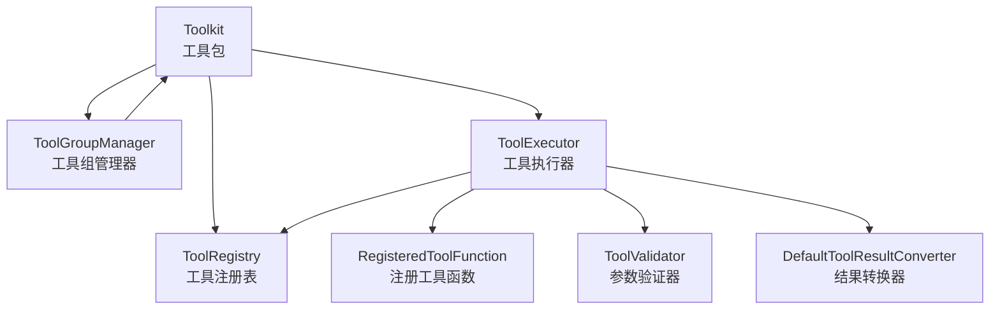

**图表来源**
- [ToolkitTest.java:58-800](file://agentscope-core/src/test/java/io/agentscope/core/tool/ToolkitTest.java#L58-L800)
- [ToolExecutorTest.java:50-506](file://agentscope-core/src/test/java/io/agentscope/core/tool/ToolExecutorTest.java#L50-L506)
- [ToolRegistryTest.java:34-363](file://agentscope-core/src/test/java/io/agentscope/core/tool/ToolRegistryTest.java#L34-L363)
- [RegisteredToolFunctionTest.java:31-344](file://agentscope-core/src/test/java/io/agentscope/core/tool/RegisteredToolFunctionTest.java#L31-L344)
- [ToolGroupManagerTest.java:30-485](file://agentscope-core/src/test/java/io/agentscope/core/tool/ToolGroupManagerTest.java#L30-L485)
- [ToolValidatorTest.java:41-901](file://agentscope-core/src/test/java/io/agentscope/core/tool/ToolValidatorTest.java#L41-L901)
- [DefaultToolResultConverterTest.java:37-336](file://agentscope-core/src/test/java/io/agentscope/core/tool/DefaultToolResultConverterTest.java#L37-L336)

## 详细组件分析

### 工具执行器测试（ToolExecutorTest）
该测试验证工具执行器在并发、错误处理与参数预设方面的行为：
- 并行执行：通过 Toolkit 同时调用多个工具，断言响应数量与内容正确性。
- 错误处理：工具抛出异常时，确保被包装为标准错误消息；中断异常不进行特殊处理。
- 并发错误：多调用并发执行时，部分失败不影响其他成功调用。
- 预设参数优先级：当存在显式输入与预设参数时，预设参数优先于显式输入。
- 元数据缺失场景：当注册元数据缺失时，仍能正常执行工具。

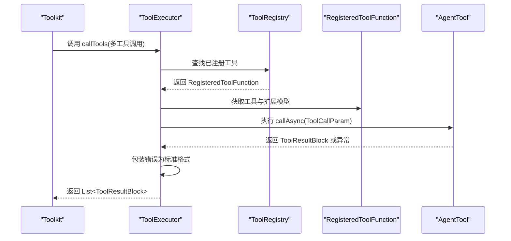

**图表来源**
- [ToolExecutorTest.java:62-272](file://agentscope-core/src/test/java/io/agentscope/core/tool/ToolExecutorTest.java#L62-L272)

**章节来源**
- [ToolExecutorTest.java:62-495](file://agentscope-core/src/test/java/io/agentscope/core/tool/ToolExecutorTest.java#L62-L495)

### 工具注册表测试（ToolRegistryTest）
该测试覆盖工具注册、发现、删除与并发访问：
- 注册与发现：注册工具后可按名称检索工具与注册信息。
- 删除工具：支持单个与批量删除，空集合或不存在名称不会抛异常。
- 覆盖注册：同名工具重复注册会覆盖旧实现。
- 并发安全：使用并发容器保证多线程注册与查询的安全性。
- 边界校验：对空名称、空白名称进行参数校验，抛出非法参数异常。

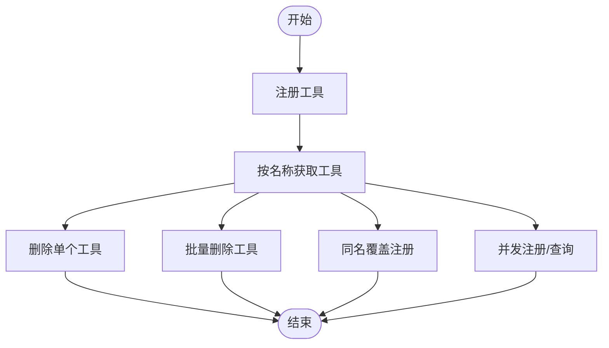

**图表来源**
- [ToolRegistryTest.java:79-301](file://agentscope-core/src/test/java/io/agentscope/core/tool/ToolRegistryTest.java#L79-L301)

**章节来源**
- [ToolRegistryTest.java:79-362](file://agentscope-core/src/test/java/io/agentscope/core/tool/ToolRegistryTest.java#L79-L362)

### 注册工具函数测试（RegisteredToolFunctionTest）
该测试聚焦于工具参数扩展与合并逻辑：
- 基础参数与扩展参数：当存在扩展模型时，合并基础参数与扩展属性，保持必需字段。
- 冲突检测：若扩展模型与基础参数存在冲突键，抛出状态异常。
- 简单扩展模型：提供附加属性与必需字段，验证合并后的参数结构。
- MCP 客户端标识：支持非 MCP 工具与 MCP 工具的区分存储。
- 兼容性：保留基础模式的其他字段（如 additionalProperties、title）。

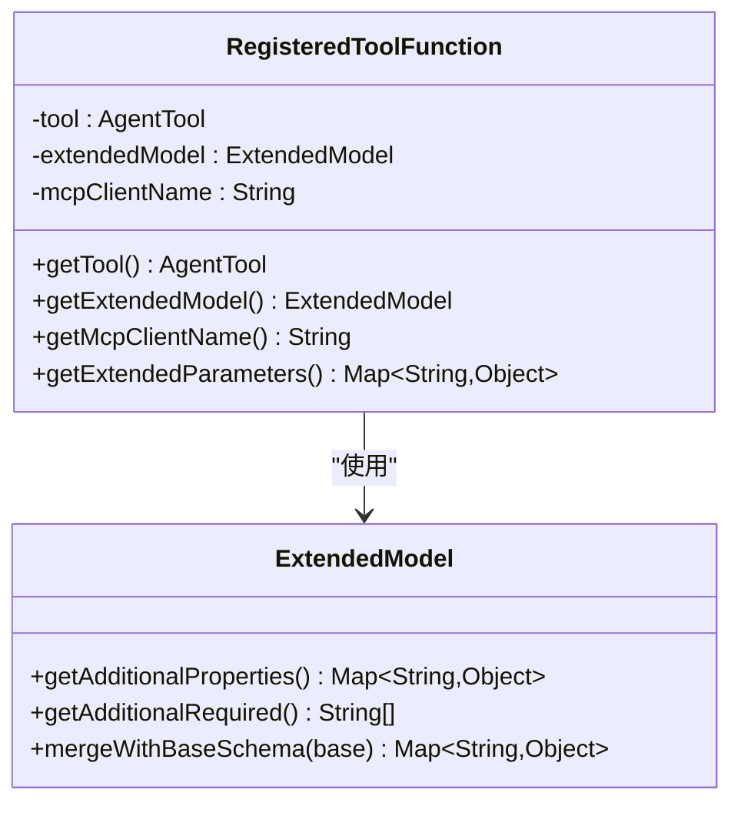

**图表来源**
- [RegisteredToolFunctionTest.java:74-342](file://agentscope-core/src/test/java/io/agentscope/core/tool/RegisteredToolFunctionTest.java#L74-L342)

**章节来源**
- [RegisteredToolFunctionTest.java:74-343](file://agentscope-core/src/test/java/io/agentscope/core/tool/RegisteredToolFunctionTest.java#L74-L343)

### 工具组管理测试（ToolGroupManagerTest）
该测试验证工具组的生命周期与权限控制：
- 组创建与状态：支持默认激活、显式激活/停用、重复创建冲突检测。
- 成员管理：添加/移除工具至组，不存在组的操作应静默忽略。
- 权限判定：未分组工具始终可调用；分组工具仅在任一所属组激活时可调用。
- 动态变更：支持批量激活/停用、批量删除组及清理成员。
- 查询接口：提供组名列表、激活组列表与存在性校验。

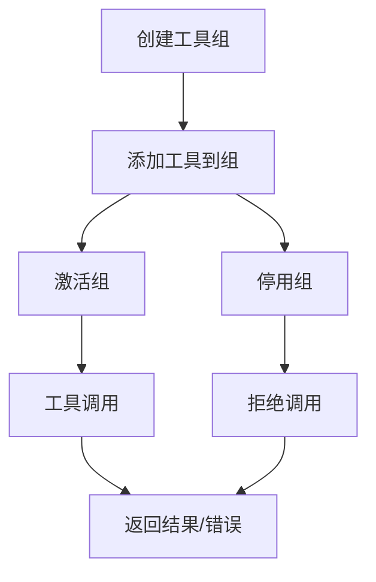

**图表来源**
- [ToolGroupManagerTest.java:39-483](file://agentscope-core/src/test/java/io/agentscope/core/tool/ToolGroupManagerTest.java#L39-L483)

**章节来源**
- [ToolGroupManagerTest.java:39-484](file://agentscope-core/src/test/java/io/agentscope/core/tool/ToolGroupManagerTest.java#L39-L484)

### 工具包测试（ToolkitTest）
该测试覆盖工具包的注册、发现、执行与组权限控制：
- 注册与发现：支持从对象注册工具，工具可被发现并获取参数定义。
- 多工具管理：工具包可容纳多个不同工具，名称唯一。
- 组权限控制：当工具所属组处于停用状态时，调用返回错误；未分组工具不受影响。
- 预设参数：支持在注册时设置预设参数，调用时仅传入必要参数，预设参数注入到执行上下文。
- 运行时更新：支持动态更新预设参数，验证更新生效。
- 删除策略：根据配置允许/禁止删除工具与组，覆盖注册仍可进行。

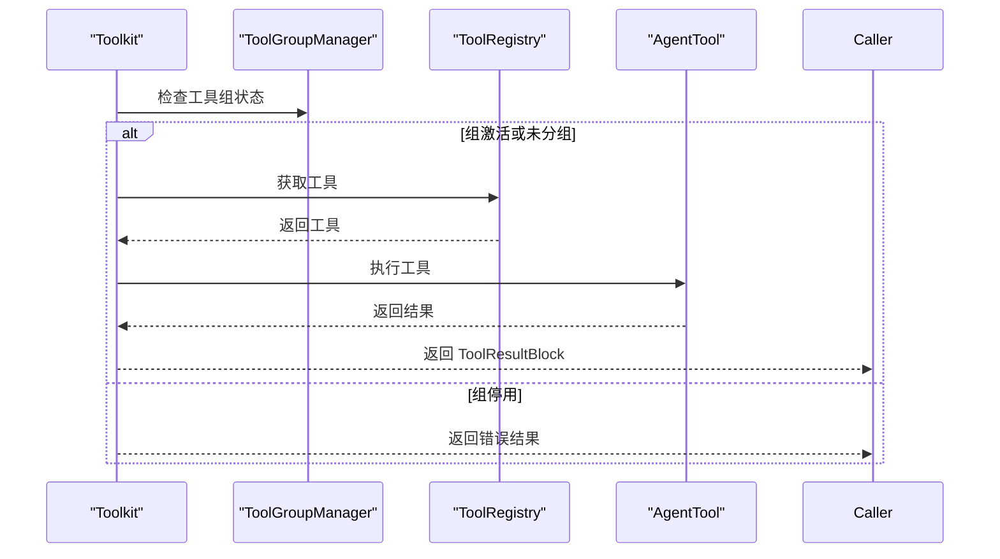

**图表来源**
- [ToolkitTest.java:414-602](file://agentscope-core/src/test/java/io/agentscope/core/tool/ToolkitTest.java#L414-L602)

**章节来源**
- [ToolkitTest.java:97-760](file://agentscope-core/src/test/java/io/agentscope/core/tool/ToolkitTest.java#L97-L760)

### 参数验证测试（ToolValidatorTest）
该测试验证基于 JSON Schema 的参数验证能力：
- 边界情况：空模式、空输入、空模式、空输入对象等场景的行为。
- 必填字段：缺少必填字段时返回验证错误。
- 类型验证：字符串/整数/布尔/数字/数组/嵌套对象等类型校验。
- 枚举与约束：枚举值不在集合内、最小/最大长度、数值范围、正则匹配失败。
- $ref 解析：修复前嵌套 $defs 无法解析的问题，修复后根级 $defs 可正确解析。
- 生成 Bean 模式：嵌套 Bean 的可选/必填字段处理，未知 null 字段仍触发额外属性校验。

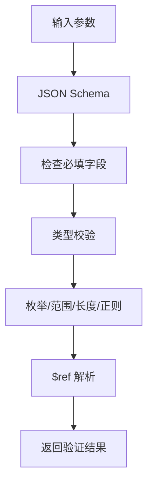

**图表来源**
- [ToolValidatorTest.java:74-658](file://agentscope-core/src/test/java/io/agentscope/core/tool/ToolValidatorTest.java#L74-L658)

**章节来源**
- [ToolValidatorTest.java:74-800](file://agentscope-core/src/test/java/io/agentscope/core/tool/ToolValidatorTest.java#L74-L800)

### 结果转换测试（DefaultToolResultConverterTest）
该测试验证工具结果转换器对多种返回类型的序列化与回退策略：
- 基本类型：null、void、字符串、整数、布尔、列表、映射。
- 复杂对象：普通 POJO 与包含日期时间类型的对象。
- Java 8 日期时间：LocalDate、LocalDateTime、OffsetDateTime 的序列化行为。
- 回退策略：不可序列化对象回退到 toString() 表示。
- 构造器选择：默认构造器使用 JsonSchemaUtils 的 ObjectMapper，自定义构造器可接受自定义 Mapper。

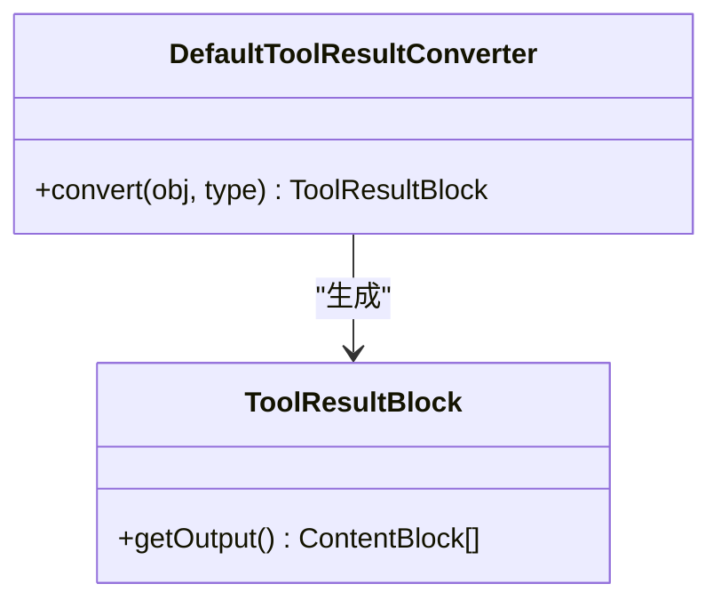

**图表来源**
- [DefaultToolResultConverterTest.java:53-275](file://agentscope-core/src/test/java/io/agentscope/core/tool/DefaultToolResultConverterTest.java#L53-L275)

**章节来源**
- [DefaultToolResultConverterTest.java:53-335](file://agentscope-core/src/test/java/io/agentscope/core/tool/DefaultToolResultConverterTest.java#L53-L335)

### 异步执行测试（AsyncToolTest）
该测试验证异步工具的执行行为：
- CompletableFuture 与 Mono 返回类型：分别验证同步与异步工具的执行结果。
- 延迟执行：验证带延迟的异步工具能够正确完成。
- 错误传播：异步工具抛错时，响应中包含错误信息。
- 并行执行：多工具并发调用，断言各自结果正确。
- 混合执行：同步与异步工具混合调用，结果一致。

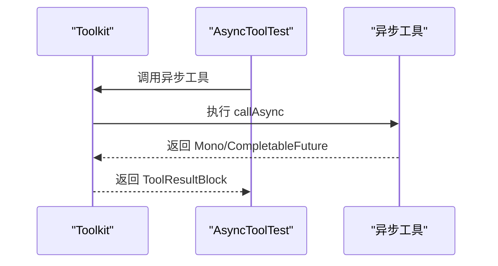

**图表来源**
- [AsyncToolTest.java:53-219](file://agentscope-core/src/test/java/io/agentscope/core/tool/AsyncToolTest.java#L53-L219)

**章节来源**
- [AsyncToolTest.java:53-226](file://agentscope-core/src/test/java/io/agentscope/core/tool/AsyncToolTest.java#L53-L226)

### 集成测试（ToolIntegrationTest）
该测试验证工具与代理、内存、模型的集成行为：
- 工具包与代理集成：代理可访问工具包中的工具并执行。
- 异步执行：工具异步执行并通过 Future 获取结果。
- 错误传播：工具错误在异步场景下的传播行为。
- 超时场景：慢速工具的超时处理与异步任务启动验证。

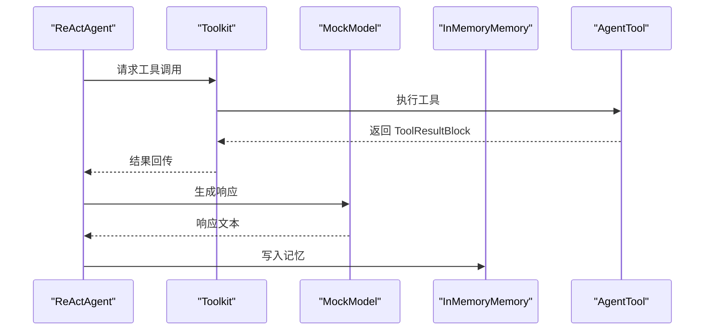

**图表来源**
- [ToolIntegrationTest.java:63-151](file://agentscope-core/src/test/java/io/agentscope/core/tool/ToolIntegrationTest.java#L63-L151)

**章节来源**
- [ToolIntegrationTest.java:63-184](file://agentscope-core/src/test/java/io/agentscope/core/tool/ToolIntegrationTest.java#L63-L184)

### 模式生成测试（ToolSchemaGeneratorTest）
该测试验证工具参数模式生成与 $defs 提升逻辑：
- 冲突检测：提升 $defs 时若同一键存在冲突定义，抛出状态异常。
- 等价合并：相同键的等价定义可被安全提升，且原位置不再包含 $defs。

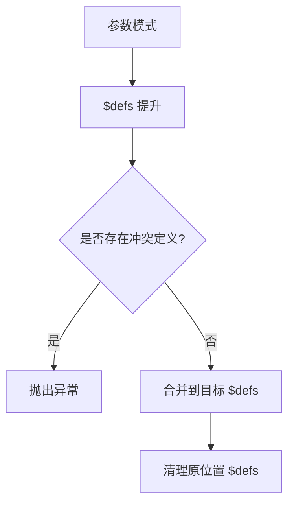

**图表来源**
- [ToolSchemaGeneratorTest.java:40-85](file://agentscope-core/src/test/java/io/agentscope/core/tool/ToolSchemaGeneratorTest.java#L40-L85)

**章节来源**
- [ToolSchemaGeneratorTest.java:40-86](file://agentscope-core/src/test/java/io/agentscope/core/tool/ToolSchemaGeneratorTest.java#L40-L86)

## 依赖分析
工具执行测试各组件之间的依赖关系如下：
- Toolkit 依赖 ToolRegistry、ToolGroupManager、ToolExecutor、ToolValidator、DefaultToolResultConverter。
- ToolExecutor 依赖 ToolRegistry、RegisteredToolFunction、ToolValidator、DefaultToolResultConverter。
- RegisteredToolFunction 依赖 ExtendedModel。
- ToolGroupManager 独立管理工具组状态，供 Toolkit 与执行器查询。
- AsyncToolTest 与 ToolIntegrationTest 作为独立场景验证异步与集成行为。

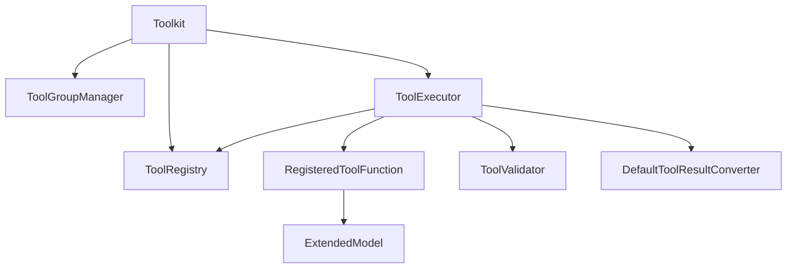

**图表来源**
- [ToolkitTest.java:58-800](file://agentscope-core/src/test/java/io/agentscope/core/tool/ToolkitTest.java#L58-L800)
- [ToolExecutorTest.java:50-506](file://agentscope-core/src/test/java/io/agentscope/core/tool/ToolExecutorTest.java#L50-L506)
- [RegisteredToolFunctionTest.java:31-344](file://agentscope-core/src/test/java/io/agentscope/core/tool/RegisteredToolFunctionTest.java#L31-L344)

**章节来源**
- [ToolkitTest.java:58-800](file://agentscope-core/src/test/java/io/agentscope/core/tool/ToolkitTest.java#L58-L800)
- [ToolExecutorTest.java:50-506](file://agentscope-core/src/test/java/io/agentscope/core/tool/ToolExecutorTest.java#L50-L506)

## 性能考虑
- 并发执行：工具执行器支持多工具并发调用，建议在高负载场景下合理设置超时与资源限制，避免阻塞。
- 参数验证：复杂嵌套对象与 $ref 解析可能带来额外开销，建议在工具参数设计上尽量简化模式结构。
- 结果转换：日期时间类型序列化采用默认 ObjectMapper，若性能敏感可考虑自定义序列化策略。
- 异步执行：CompletableFuture 与 Mono 的选择应结合工具实现与外部依赖的阻塞性质，避免不必要的线程切换。

## 故障排除指南
- 工具组停用导致调用失败：检查工具所属组是否激活，未分组工具不受影响。
- 参数验证失败：核对 JSON Schema 中的必填字段、类型与约束，确保输入满足要求。
- $ref 解析错误：确认工具参数模式中 $defs 是否位于根级，避免嵌套 $defs 导致解析失败。
- 结果转换异常：对于不可序列化对象，转换器会回退到 toString()，建议提供可序列化返回值。
- 并发冲突：注册表使用并发容器，但重复注册同名工具会覆盖，注意版本管理与命名规范。

**章节来源**
- [ToolkitTest.java:414-602](file://agentscope-core/src/test/java/io/agentscope/core/tool/ToolkitTest.java#L414-L602)
- [ToolValidatorTest.java:564-658](file://agentscope-core/src/test/java/io/agentscope/core/tool/ToolValidatorTest.java#L564-L658)
- [DefaultToolResultConverterTest.java:236-247](file://agentscope-core/src/test/java/io/agentscope/core/tool/DefaultToolResultConverterTest.java#L236-L247)

## 结论
本测试体系全面覆盖了工具执行的各个关键环节：注册与发现、参数验证、并发执行、错误处理、组权限控制、结果转换与异步集成。通过单元测试与集成测试相结合的方式，确保工具在复杂场景下的稳定性与一致性。建议在实际工程中遵循本文档的最佳实践，持续完善测试矩阵以应对不断演进的业务需求。

## 附录
- 测试标签与分类：单元测试（@Tag("unit")）、集成测试（@Tag("integration")），便于按需运行。
- 示例场景清单：
  - 并行工具调用与错误混合场景
  - 工具组激活/停用对调用的影响
  - 预设参数与显式输入的优先级
  - 复杂嵌套对象与 $ref 的参数验证
  - 日期时间类型的结果转换
  - 异步工具的 CompletableFuture 与 Mono 支持
  - 工具与代理、内存、模型的集成行为