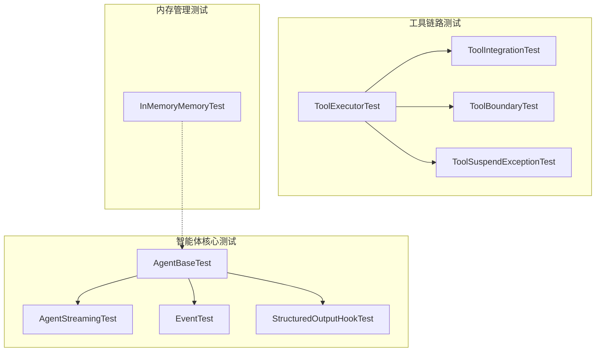
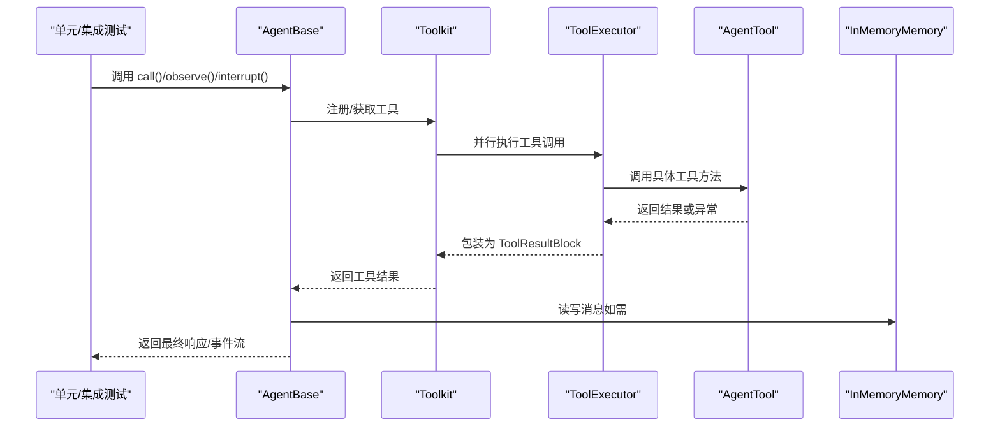
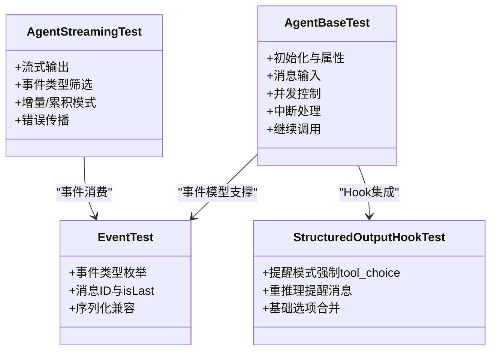
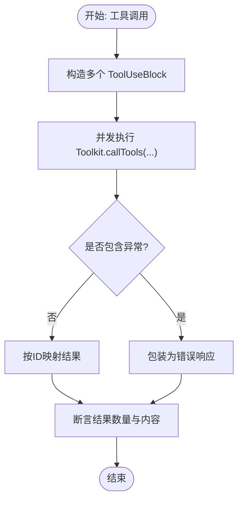
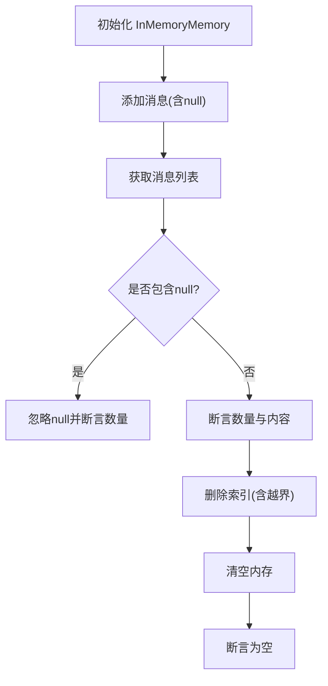
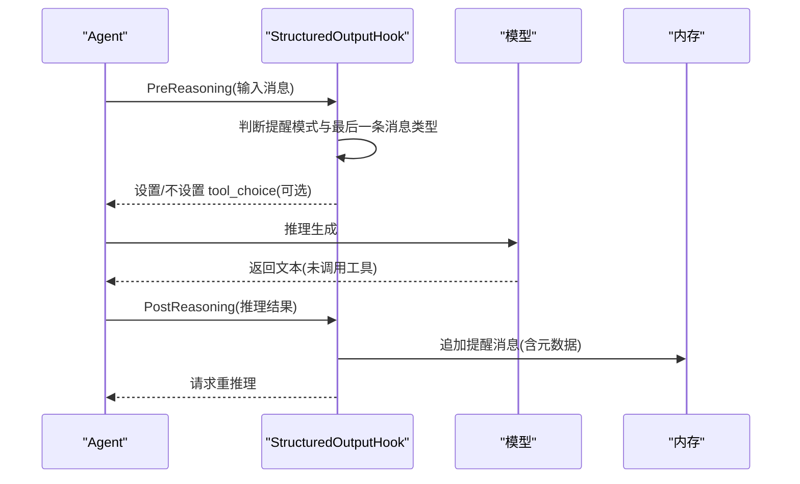
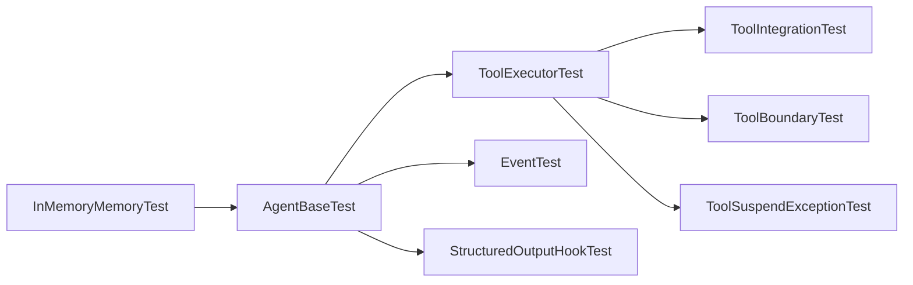

# 核心组件测试

<cite>
**本文引用的文件**
- [SimpleIntegrationTest.java](file://agentscope-core/src/test/java/io/agentscope/core/SimpleIntegrationTest.java)
- [VersionTest.java](file://agentscope-core/src/test/java/io/agentscope/core/VersionTest.java)
- [InMemoryMemoryTest.java](file://agentscope-core/src/test/java/io/agentscope/core/memory/InMemoryMemoryTest.java)
- [ToolExecutorTest.java](file://agentscope-core/src/test/java/io/agentscope/core/tool/ToolExecutorTest.java)
- [ToolIntegrationTest.java](file://agentscope-core/src/test/java/io/agentscope/core/tool/ToolIntegrationTest.java)
- [ToolBoundaryTest.java](file://agentscope-core/src/test/java/io/agentscope/core/tool/ToolBoundaryTest.java)
- [ToolSuspendExceptionTest.java](file://agentscope-core/src/test/java/io/agentscope/core/tool/ToolSuspendExceptionTest.java)
- [AgentBaseTest.java](file://agentscope-core/src/test/java/io/agentscope/core/agent/AgentBaseTest.java)
- [AgentStreamingTest.java](file://agentscope-core/src/test/java/io/agentscope/core/agent/AgentStreamingTest.java)
- [EventTest.java](file://agentscope-core/src/test/java/io/agentscope/core/agent/EventTest.java)
- [StructuredOutputHookTest.java](file://agentscope-core/src/test/java/io/agentscope/core/agent/StructuredOutputHookTest.java)
</cite>

## 目录
1. [简介](#简介)
2. [项目结构](#项目结构)
3. [核心组件](#核心组件)
4. [架构总览](#架构总览)
5. [详细组件分析](#详细组件分析)
6. [依赖关系分析](#依赖关系分析)
7. [性能考量](#性能考量)
8. [故障排查指南](#故障排查指南)
9. [结论](#结论)
10. [附录](#附录)

## 简介
本技术文档聚焦于 AgentScope Java 核心组件的测试体系，系统性梳理智能体核心测试、工具执行测试、内存管理测试与 Hook 事件测试的实现方法与最佳实践。文档从测试设计原则、Mock 使用策略、断言标准出发，结合边界条件、异常处理与集成测试的实施要点，提供可复用的测试示例路径与覆盖率提升建议，帮助开发者高效构建高质量的单元与集成测试。

## 项目结构
围绕核心测试，主要涉及以下模块的测试类：
- 智能体核心：AgentBase、事件模型、流式输出、结构化输出 Hook
- 工具链路：工具注册、执行器、参数校验、挂起异常、集成测试
- 内存管理：内存增删改查、并发安全、空值过滤
- 其他：版本与 User-Agent 生成等辅助测试

图表来源
- [AgentBaseTest.java:1-356](file://agentscope-core/src/test/java/io/agentscope/core/agent/AgentBaseTest.java#L1-L356)
- [AgentStreamingTest.java:1-252](file://agentscope-core/src/test/java/io/agentscope/core/agent/AgentStreamingTest.java#L1-L252)
- [EventTest.java:1-263](file://agentscope-core/src/test/java/io/agentscope/core/agent/EventTest.java#L1-L263)
- [StructuredOutputHookTest.java:1-357](file://agentscope-core/src/test/java/io/agentscope/core/agent/StructuredOutputHookTest.java#L1-L357)
- [ToolExecutorTest.java:1-506](file://agentscope-core/src/test/java/io/agentscope/core/tool/ToolExecutorTest.java#L1-L506)
- [ToolIntegrationTest.java:1-185](file://agentscope-core/src/test/java/io/agentscope/core/tool/ToolIntegrationTest.java#L1-L185)
- [ToolBoundaryTest.java:1-182](file://agentscope-core/src/test/java/io/agentscope/core/tool/ToolBoundaryTest.java#L1-L182)
- [ToolSuspendExceptionTest.java:1-106](file://agentscope-core/src/test/java/io/agentscope/core/tool/ToolSuspendExceptionTest.java#L1-L106)
- [InMemoryMemoryTest.java:1-177](file://agentscope-core/src/test/java/io/agentscope/core/memory/InMemoryMemoryTest.java#L1-L177)

章节来源
- [SimpleIntegrationTest.java:1-57](file://agentscope-core/src/test/java/io/agentscope/core/SimpleIntegrationTest.java#L1-L57)
- [VersionTest.java:1-109](file://agentscope-core/src/test/java/io/agentscope/core/VersionTest.java#L1-L109)

## 核心组件
本节概述测试覆盖的关键组件与职责：
- 智能体核心：AgentBase 提供统一调用与观察接口；事件模型支持 Reasoning/Tool/Hint/AgentResult/Summary 等类型；流式输出支持增量与累积模式；StructuredOutputHook 控制工具选择提醒策略。
- 工具链路：Toolkit 注册与调用；ToolExecutor 并发执行、错误包装与参数预设；边界测试覆盖空参、缺失参数、非法类型与不存在工具；挂起异常用于外部依赖等待场景。
- 内存管理：InMemoryMemory 支持消息增删、清空、索引越界保护与并发安全。
- 版本与 User-Agent：验证版本常量、格式与一致性。

章节来源
- [AgentBaseTest.java:1-356](file://agentscope-core/src/test/java/io/agentscope/core/agent/AgentBaseTest.java#L1-L356)
- [AgentStreamingTest.java:1-252](file://agentscope-core/src/test/java/io/agentscope/core/agent/AgentStreamingTest.java#L1-L252)
- [EventTest.java:1-263](file://agentscope-core/src/test/java/io/agentscope/core/agent/EventTest.java#L1-L263)
- [StructuredOutputHookTest.java:1-357](file://agentscope-core/src/test/java/io/agentscope/core/agent/StructuredOutputHookTest.java#L1-L357)
- [ToolExecutorTest.java:1-506](file://agentscope-core/src/test/java/io/agentscope/core/tool/ToolExecutorTest.java#L1-L506)
- [ToolIntegrationTest.java:1-185](file://agentscope-core/src/test/java/io/agentscope/core/tool/ToolIntegrationTest.java#L1-L185)
- [ToolBoundaryTest.java:1-182](file://agentscope-core/src/test/java/io/agentscope/core/tool/ToolBoundaryTest.java#L1-L182)
- [ToolSuspendExceptionTest.java:1-106](file://agentscope-core/src/test/java/io/agentscope/core/tool/ToolSuspendExceptionTest.java#L1-L106)
- [InMemoryMemoryTest.java:1-177](file://agentscope-core/src/test/java/io/agentscope/core/memory/InMemoryMemoryTest.java#L1-L177)
- [VersionTest.java:1-109](file://agentscope-core/src/test/java/io/agentscope/core/VersionTest.java#L1-L109)

## 架构总览
下图展示测试层面的交互关系：智能体通过 Toolkit 调用工具，工具执行器负责并发调度与错误包装；内存组件在需要时参与状态或上下文存储；事件模型贯穿流式输出与 Hook 触发。

图表来源
- [AgentBaseTest.java:1-356](file://agentscope-core/src/test/java/io/agentscope/core/agent/AgentBaseTest.java#L1-L356)
- [ToolExecutorTest.java:1-506](file://agentscope-core/src/test/java/io/agentscope/core/tool/ToolExecutorTest.java#L1-L506)
- [ToolIntegrationTest.java:1-185](file://agentscope-core/src/test/java/io/agentscope/core/tool/ToolIntegrationTest.java#L1-L185)
- [InMemoryMemoryTest.java:1-177](file://agentscope-core/src/test/java/io/agentscope/core/memory/InMemoryMemoryTest.java#L1-L177)

## 详细组件分析

### 智能体核心测试
- 初始化与属性：验证 Agent ID 唯一性、名称匹配与默认超时行为。
- 消息输入：单条与多条消息输入均返回 ASSISTANT 角色响应，文本内容符合预期。
- 并发控制：当启用运行检查时，禁止并发调用；禁用时允许并发。
- 中断处理：支持无参与带消息中断，后续仍可正常回复。
- 继续调用：不传入新消息时可进行“继续”推理。
- 流式输出：支持增量/累积两种模式，事件类型可筛选，错误传播正确。
- 事件模型：事件类型枚举完整，消息 ID 与 isLast 字段语义清晰，序列化兼容性良好。
- 结构化输出 Hook：根据提醒模式决定是否强制 tool_choice，重推理时生成正确的提醒消息并携带元数据。

图表来源
- [AgentBaseTest.java:1-356](file://agentscope-core/src/test/java/io/agentscope/core/agent/AgentBaseTest.java#L1-L356)
- [AgentStreamingTest.java:1-252](file://agentscope-core/src/test/java/io/agentscope/core/agent/AgentStreamingTest.java#L1-L252)
- [EventTest.java:1-263](file://agentscope-core/src/test/java/io/agentscope/core/agent/EventTest.java#L1-L263)
- [StructuredOutputHookTest.java:1-357](file://agentscope-core/src/test/java/io/agentscope/core/agent/StructuredOutputHookTest.java#L1-L357)

章节来源
- [AgentBaseTest.java:1-356](file://agentscope-core/src/test/java/io/agentscope/core/agent/AgentBaseTest.java#L1-L356)
- [AgentStreamingTest.java:1-252](file://agentscope-core/src/test/java/io/agentscope/core/agent/AgentStreamingTest.java#L1-L252)
- [EventTest.java:1-263](file://agentscope-core/src/test/java/io/agentscope/core/agent/EventTest.java#L1-L263)
- [StructuredOutputHookTest.java:1-357](file://agentscope-core/src/test/java/io/agentscope/core/agent/StructuredOutputHookTest.java#L1-L357)

### 工具执行测试
- 并行执行：多工具调用并发执行，结果按 callId 映射，数值与字符串拼接结果正确。
- 错误包装：工具抛出异常时被统一包装为包含错误前缀的 ToolResultBlock，便于上层处理。
- 异常特例：对包含 InterruptedException 的 RuntimeException 不做特殊中断处理，保持标准错误格式。
- 并发错误：多个并发调用中部分失败时，成功/失败计数符合预期。
- 参数优先级：显式输入与预设参数的合并策略正确，预设值优先覆盖显式输入。
- 仅预设参数：当无显式输入时，仅使用预设参数。
- 元数据缺失：注册表元数据缺失时，直接使用调用方输入，保证兼容性。
- 错误格式一致性：不同异常类型均遵循一致的错误提示格式。
- 集成测试：与智能体、内存协作，异步执行、错误传播与超时场景具备基本验证。
- 边界测试：空参数、缺失参数、非法类型、非存在工具均得到合理处理。
- 挂起异常：ToolSuspendException 可生成挂起的 ToolResultBlock，便于外部依赖等待。

图表来源
- [ToolExecutorTest.java:1-506](file://agentscope-core/src/test/java/io/agentscope/core/tool/ToolExecutorTest.java#L1-L506)
- [ToolIntegrationTest.java:1-185](file://agentscope-core/src/test/java/io/agentscope/core/tool/ToolIntegrationTest.java#L1-L185)
- [ToolBoundaryTest.java:1-182](file://agentscope-core/src/test/java/io/agentscope/core/tool/ToolBoundaryTest.java#L1-L182)
- [ToolSuspendExceptionTest.java:1-106](file://agentscope-core/src/test/java/io/agentscope/core/tool/ToolSuspendExceptionTest.java#L1-L106)

章节来源
- [ToolExecutorTest.java:1-506](file://agentscope-core/src/test/java/io/agentscope/core/tool/ToolExecutorTest.java#L1-L506)
- [ToolIntegrationTest.java:1-185](file://agentscope-core/src/test/java/io/agentscope/core/tool/ToolIntegrationTest.java#L1-L185)
- [ToolBoundaryTest.java:1-182](file://agentscope-core/src/test/java/io/agentscope/core/tool/ToolBoundaryTest.java#L1-L182)
- [ToolSuspendExceptionTest.java:1-106](file://agentscope-core/src/test/java/io/agentscope/core/tool/ToolSuspendExceptionTest.java#L1-L106)

### 内存管理测试
- 基础操作：添加消息、获取列表、删除指定索引、清空内存，行为符合预期。
- 空值过滤：添加 null 消息时自动忽略，不影响有效消息顺序与内容提取。
- 多消息批量：连续添加多条消息后，顺序与内容一一对应。
- 索引越界：负索引、越界索引与等于长度索引均为无操作，避免破坏状态。
- 并发安全：循环添加与删除、清空操作在并发场景下保持一致性。
- 集成验证：与简单集成测试配合，验证消息持久化与清理流程。

图表来源
- [InMemoryMemoryTest.java:1-177](file://agentscope-core/src/test/java/io/agentscope/core/memory/InMemoryMemoryTest.java#L1-L177)
- [SimpleIntegrationTest.java:1-57](file://agentscope-core/src/test/java/io/agentscope/core/SimpleIntegrationTest.java#L1-L57)

章节来源
- [InMemoryMemoryTest.java:1-177](file://agentscope-core/src/test/java/io/agentscope/core/memory/InMemoryMemoryTest.java#L1-L177)
- [SimpleIntegrationTest.java:1-57](file://agentscope-core/src/test/java/io/agentscope/core/SimpleIntegrationTest.java#L1-L57)

### Hook 事件测试
- 提醒模式强制 tool_choice：在 TOOL_CHOICE 模式下，当最后一条消息为提醒消息时，有效生成选项中强制设置 tool_choice；在 PROMPT 模式下不强制。
- 重推理提醒消息：当模型未调用工具时，Hook 会触发 goto reasoning，并生成带有提醒元数据的消息，区分提醒类型。
- 基础选项合并：在已有 GenerateOptions 的基础上合并，保留温度与最大 token 等参数。
- 提醒消息内容：提醒消息角色为 USER、名称为 system，内容包含目标工具名提示。

图表来源
- [StructuredOutputHookTest.java:1-357](file://agentscope-core/src/test/java/io/agentscope/core/agent/StructuredOutputHookTest.java#L1-L357)

章节来源
- [StructuredOutputHookTest.java:1-357](file://agentscope-core/src/test/java/io/agentscope/core/agent/StructuredOutputHookTest.java#L1-L357)

## 依赖关系分析
- 智能体与工具：AgentBase 通过 Toolkit 访问工具集；工具执行由 ToolExecutor 负责并发与错误包装。
- 事件与 Hook：事件模型贯穿流式输出；StructuredOutputHook 在推理前后注入提醒逻辑。
- 内存耦合：内存组件作为状态容器，与智能体/工具交互时提供消息持久化能力。
- 断言与工具：测试广泛使用断言库与工具类（如 JsonUtils）进行序列化与内容提取。

图表来源
- [AgentBaseTest.java:1-356](file://agentscope-core/src/test/java/io/agentscope/core/agent/AgentBaseTest.java#L1-L356)
- [ToolExecutorTest.java:1-506](file://agentscope-core/src/test/java/io/agentscope/core/tool/ToolExecutorTest.java#L1-L506)
- [ToolIntegrationTest.java:1-185](file://agentscope-core/src/test/java/io/agentscope/core/tool/ToolIntegrationTest.java#L1-L185)
- [ToolBoundaryTest.java:1-182](file://agentscope-core/src/test/java/io/agentscope/core/tool/ToolBoundaryTest.java#L1-L182)
- [ToolSuspendExceptionTest.java:1-106](file://agentscope-core/src/test/java/io/agentscope/core/tool/ToolSuspendExceptionTest.java#L1-L106)
- [EventTest.java:1-263](file://agentscope-core/src/test/java/io/agentscope/core/agent/EventTest.java#L1-L263)
- [StructuredOutputHookTest.java:1-357](file://agentscope-core/src/test/java/io/agentscope/core/agent/StructuredOutputHookTest.java#L1-L357)
- [InMemoryMemoryTest.java:1-177](file://agentscope-core/src/test/java/io/agentscope/core/memory/InMemoryMemoryTest.java#L1-L177)

## 性能考量
- 并发执行：工具执行器采用并发调度，建议在测试中控制并发规模，避免资源争用导致的不稳定。
- 超时控制：为异步工具调用设置合理超时，防止长时间阻塞影响测试稳定性。
- 序列化开销：事件 JSON 序列化应避免不必要的大对象，减少断言阶段的解析成本。
- 内存压力：批量添加/删除消息时注意内存占用峰值，确保测试环境具备足够资源。

## 故障排查指南
- 并发冲突：启用运行检查时出现并发调用异常，确认是否需要禁用检查或串行化调用。
- 错误格式：若工具返回的错误未按统一格式，检查执行器包装逻辑与异常类型。
- 参数问题：空参数、缺失参数或非法类型会导致异常，建议在测试中覆盖所有边界组合。
- 挂起状态：外部依赖等待时使用挂起异常生成挂起结果，避免线程阻塞。
- 事件序列：关注事件 isLast 字段与消息 ID 的一致性，避免流式消费端误判。

章节来源
- [AgentBaseTest.java:273-354](file://agentscope-core/src/test/java/io/agentscope/core/agent/AgentBaseTest.java#L273-L354)
- [ToolExecutorTest.java:104-185](file://agentscope-core/src/test/java/io/agentscope/core/tool/ToolExecutorTest.java#L104-L185)
- [ToolBoundaryTest.java:53-180](file://agentscope-core/src/test/java/io/agentscope/core/tool/ToolBoundaryTest.java#L53-L180)
- [ToolSuspendExceptionTest.java:62-104](file://agentscope-core/src/test/java/io/agentscope/core/tool/ToolSuspendExceptionTest.java#L62-L104)
- [EventTest.java:238-261](file://agentscope-core/src/test/java/io/agentscope/core/agent/EventTest.java#L238-L261)

## 结论
通过上述测试体系，可以全面覆盖智能体核心、工具链路、内存管理与 Hook 事件的关键行为。测试设计强调边界条件、异常处理与集成协作，配合合理的 Mock 策略与断言标准，能够有效保障核心组件的稳定性与可维护性。建议持续扩展用例覆盖面，强化并发与超时场景，以进一步提升测试质量与覆盖率。

## 附录
- 版本与 User-Agent：验证版本常量、格式规范与平台信息一致性，确保客户端标识稳定可靠。
- 简单集成测试：验证内存增删与清空的基本流程，作为更复杂场景的前置条件。

章节来源
- [VersionTest.java:28-107](file://agentscope-core/src/test/java/io/agentscope/core/VersionTest.java#L28-L107)
- [SimpleIntegrationTest.java:28-55](file://agentscope-core/src/test/java/io/agentscope/core/SimpleIntegrationTest.java#L28-L55)