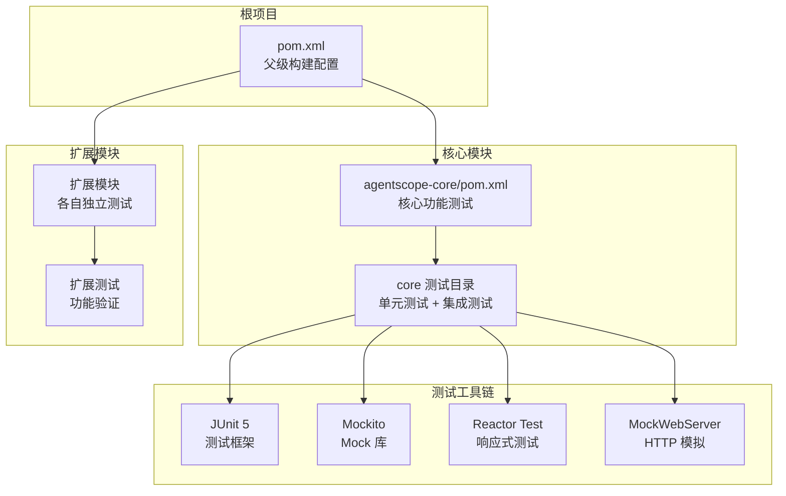
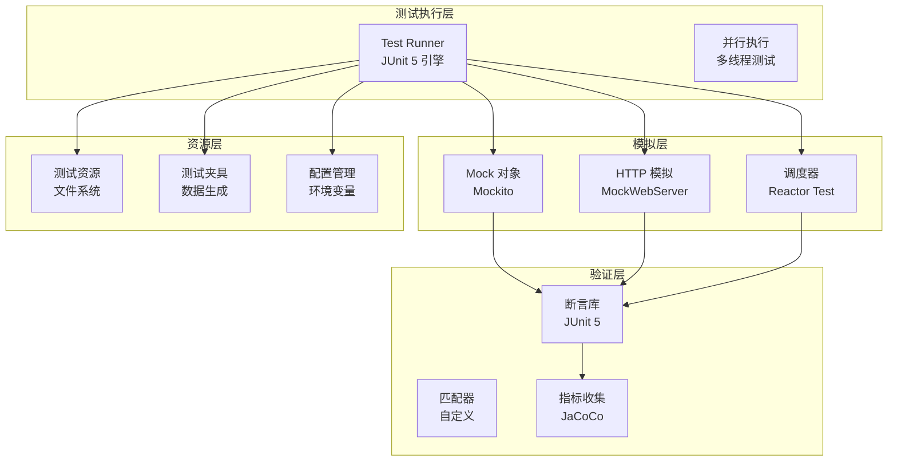
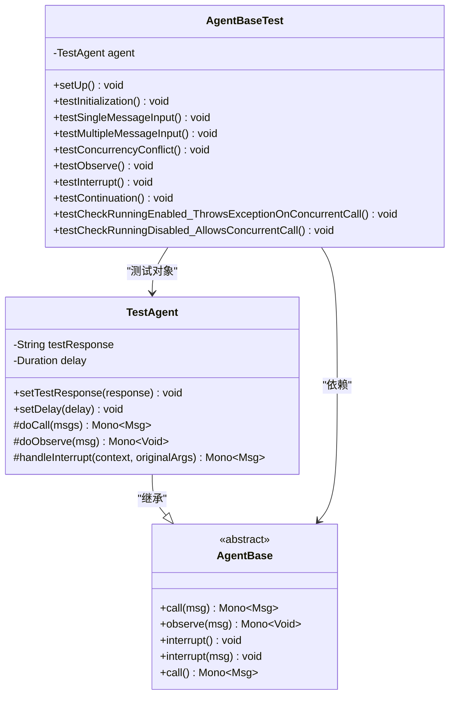
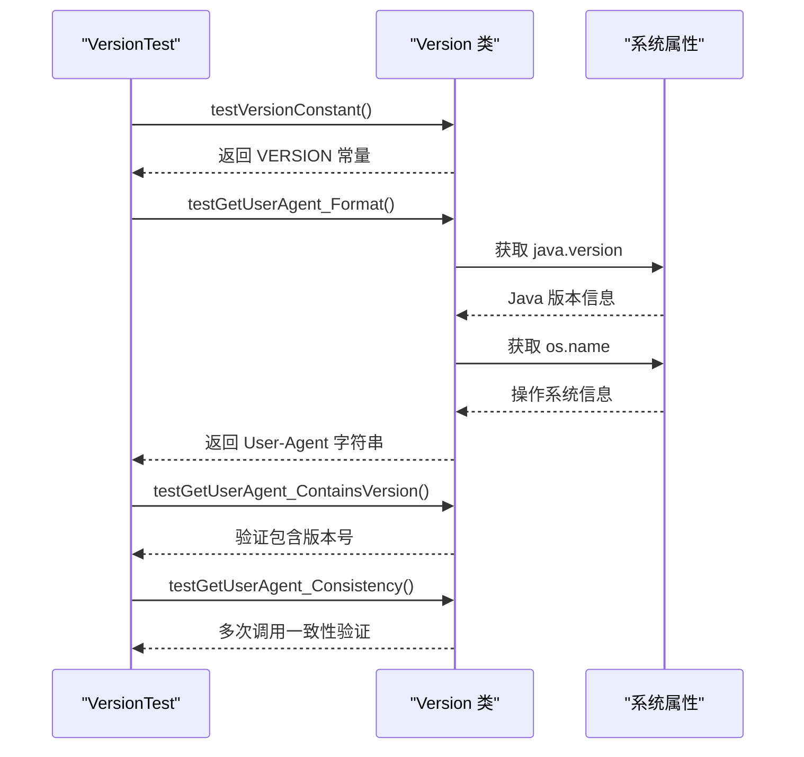
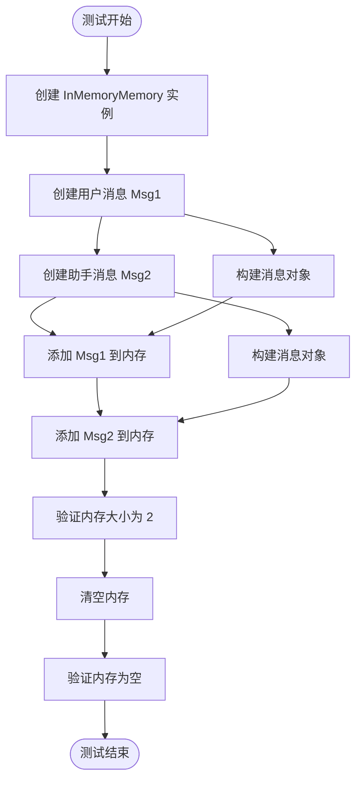
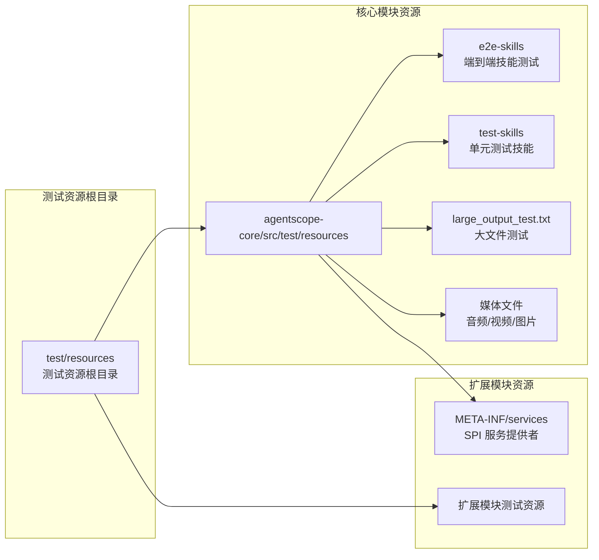
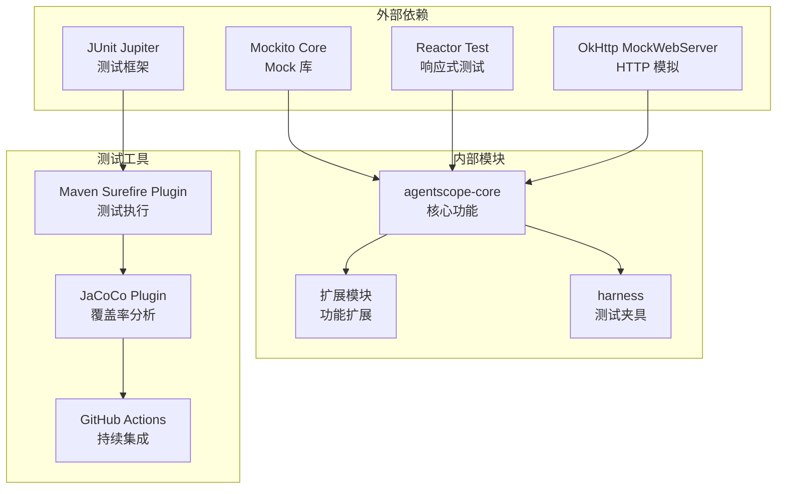

# 测试基础设施搭建

<cite>
**本文档引用的文件**
- [pom.xml](file://pom.xml)
- [agentscope-core/pom.xml](file://agentscope-core/pom.xml)
- [.github/workflows/maven-ci.yml](file://.github/workflows/maven-ci.yml)
- [codecov.yml](file://codecov.yml)
- [SimpleIntegrationTest.java](file://agentscope-core/src/test/java/io/agentscope/core/SimpleIntegrationTest.java)
- [AgentBaseTest.java](file://agentscope-core/src/test/java/io/agentscope/core/agent/AgentBaseTest.java)
- [VersionTest.java](file://agentscope-core/src/test/java/io/agentscope/core/VersionTest.java)
- [large_output_test.txt](file://agentscope-core/src/test/resources/large_output_test.txt)
</cite>

## 目录
1. [简介](#简介)
2. [项目结构](#项目结构)
3. [核心组件](#核心组件)
4. [架构概览](#架构概览)
5. [详细组件分析](#详细组件分析)
6. [依赖分析](#依赖分析)
7. [性能考虑](#性能考虑)
8. [故障排除指南](#故障排除指南)
9. [结论](#结论)
10. [附录](#附录)

## 简介

AgentScope Java 测试基础设施是一个基于 Maven 的现代化测试框架，专为 Agent-Oriented Programming 框架设计。该基础设施集成了 JUnit 5、Mockito、Reactor 测试工具和 OkHttp MockWebServer，提供了全面的单元测试、集成测试和端到端测试能力。

本测试基础设施的核心目标是：
- 提供一致的测试环境配置
- 支持异步编程模型的测试
- 集成 Mock 对象和模拟服务器
- 实现代码覆盖率监控
- 支持持续集成和自动化测试

## 项目结构

AgentScope Java 采用多模块 Maven 架构，测试基础设施分布在各个模块中：



**图表来源**
- [pom.xml:164-334](file://pom.xml#L164-L334)
- [agentscope-core/pom.xml:51-154](file://agentscope-core/pom.xml#L51-L154)

**章节来源**
- [pom.xml:56-63](file://pom.xml#L56-L63)
- [pom.xml:97-130](file://pom.xml#L97-L130)

## 核心组件

### 测试框架配置

测试基础设施基于以下核心组件构建：

#### JUnit 5 配置
- **版本**: 5.x
- **作用**: 主要的测试框架，提供注解驱动的测试执行
- **特性**: 参数化测试、条件执行、动态测试

#### Mockito 集成
- **版本**: 最新稳定版
- **作用**: Mock 对象创建和行为模拟
- **特性**: 支持静态方法、构造函数、Final 类的 Mock

#### Reactor 测试工具
- **版本**: 3.x
- **作用**: 响应式流测试和验证
- **特性**: 调度器测试、背压验证、错误传播测试

#### OkHttp MockWebServer
- **版本**: 4.x
- **作用**: HTTP 服务端模拟
- **特性**: 请求记录、响应定制、连接控制

**章节来源**
- [pom.xml:97-130](file://pom.xml#L97-L130)
- [agentscope-core/pom.xml:51-154](file://agentscope-core/pom.xml#L51-L154)

### 测试插件配置

#### Maven Surefire 插件
- **版本**: 3.5.5
- **配置**: 
  - 并行测试执行
  - 测试报告生成
  - 内存参数配置

#### JaCoCo 代码覆盖率
- **版本**: 0.8.14
- **配置**: 
  - 测试后覆盖率报告
  - 覆盖率阈值检查

**章节来源**
- [pom.xml:271-290](file://pom.xml#L271-L290)
- [pom.xml:291-310](file://pom.xml#L291-L310)

## 架构概览

测试基础设施采用分层架构设计，确保测试的可维护性和可扩展性：



**图表来源**
- [pom.xml:164-334](file://pom.xml#L164-L334)
- [SimpleIntegrationTest.java:26-55](file://agentscope-core/src/test/java/io/agentscope/core/SimpleIntegrationTest.java#L26-L55)

## 详细组件分析

### 单元测试组件

#### AgentBaseTest 分析

AgentBaseTest 展示了完整的单元测试实现模式：



**图表来源**
- [AgentBaseTest.java:55-113](file://agentscope-core/src/test/java/io/agentscope/core/agent/AgentBaseTest.java#L55-L113)
- [AgentBaseTest.java:62-113](file://agentscope-core/src/test/java/io/agentscope/core/agent/AgentBaseTest.java#L62-L113)

**章节来源**
- [AgentBaseTest.java:42-54](file://agentscope-core/src/test/java/io/agentscope/core/agent/AgentBaseTest.java#L42-L54)
- [AgentBaseTest.java:115-118](file://agentscope-core/src/test/java/io/agentscope/core/agent/AgentBaseTest.java#L115-L118)

#### 版本测试组件

VersionTest 展示了环境特定测试的实现：



**图表来源**
- [VersionTest.java:26-108](file://agentscope-core/src/test/java/io/agentscope/core/VersionTest.java#L26-L108)

**章节来源**
- [VersionTest.java:28-35](file://agentscope-core/src/test/java/io/agentscope/core/VersionTest.java#L28-L35)
- [VersionTest.java:38-53](file://agentscope-core/src/test/java/io/agentscope/core/VersionTest.java#L38-L53)

### 集成测试组件

#### SimpleIntegrationTest 分析

SimpleIntegrationTest 展示了内存管理的集成测试模式：



**图表来源**
- [SimpleIntegrationTest.java:26-55](file://agentscope-core/src/test/java/io/agentscope/core/SimpleIntegrationTest.java#L26-L55)

**章节来源**
- [SimpleIntegrationTest.java:28-55](file://agentscope-core/src/test/java/io/agentscope/core/SimpleIntegrationTest.java#L28-L55)

### 测试资源管理

#### 测试文件组织

测试资源文件采用层次化组织结构：



**图表来源**
- [large_output_test.txt:1-50](file://agentscope-core/src/test/resources/large_output_test.txt#L1-L50)

**章节来源**
- [large_output_test.txt:1-800](file://agentscope-core/src/test/resources/large_output_test.txt#L1-L800)

## 依赖分析

### 测试依赖关系

测试基础设施的依赖关系呈现清晰的层次结构：



**图表来源**
- [pom.xml:97-130](file://pom.xml#L97-L130)
- [.github/workflows/maven-ci.yml:14-140](file://.github/workflows/maven-ci.yml#L14-L140)

**章节来源**
- [pom.xml:132-149](file://pom.xml#L132-L149)
- [.github/workflows/maven-ci.yml:42-140](file://.github/workflows/maven-ci.yml#L42-L140)

### 依赖版本管理

测试依赖通过 BOM（Bill of Materials）进行统一管理：

| 依赖类型 | 组件 | 版本 | 作用域 |
|---------|------|------|--------|
| 测试框架 | junit-jupiter | 5.x | test |
| Mock 库 | mockito-core | 最新 | test |
| 响应式测试 | reactor-test | 3.x | test |
| HTTP 模拟 | mockwebserver | 4.x | test |
| 覆盖率分析 | jacoco-maven-plugin | 0.8.14 | test |

**章节来源**
- [pom.xml:38-49](file://pom.xml#L38-L49)
- [pom.xml:97-130](file://pom.xml#L97-L130)

## 性能考虑

### 测试执行优化

测试基础设施在性能方面采用了多项优化策略：

#### 并行测试执行
- **配置**: Maven Surefire 插件支持并行测试
- **优势**: 显著减少测试总执行时间
- **限制**: 需要确保测试间的无状态性

#### 内存管理
- **参数配置**: `-Xms512m -Xmx1024m`
- **垃圾回收**: 使用 G1GC 以优化大对象处理
- **资源清理**: 自动清理临时文件和网络连接

#### 缓存策略
- **Maven 仓库缓存**: 本地和远程仓库加速
- **依赖缓存**: GitHub Actions 缓存机制
- **编译缓存**: mvnd 分布式编译器

**章节来源**
- [pom.xml:53](file://pom.xml#L53)
- [.github/workflows/maven-ci.yml:69-76](file://.github/workflows/maven-ci.yml#L69-L76)

## 故障排除指南

### 常见测试问题

#### 并发测试失败
**症状**: 并发测试出现死锁或竞态条件
**解决方案**:
1. 检查测试中的同步机制
2. 使用 Reactor 的 `subscribeOn(Schedulers.boundedElastic())`
3. 验证测试超时设置

#### Mock 对象配置错误
**症状**: Mock 行为不符合预期
**解决方案**:
1. 确认 Mock 对象的作用域
2. 检查 Mock 方法的调用顺序
3. 验证参数匹配器的正确性

#### 资源文件访问失败
**症状**: 测试无法读取测试资源文件
**解决方案**:
1. 验证资源文件路径
2. 检查资源文件打包配置
3. 确认测试执行时的工作目录

**章节来源**
- [AgentBaseTest.java:183-203](file://agentscope-core/src/test/java/io/agentscope/core/agent/AgentBaseTest.java#L183-L203)
- [AgentBaseTest.java:273-309](file://agentscope-core/src/test/java/io/agentscope/core/agent/AgentBaseTest.java#L273-L309)

### 调试技巧

#### 启用详细日志
```bash
mvn test -Dtest=SpecificTest#specificMethod -DforkCount=0
```

#### 内存诊断
```bash
mvn test -DargLine="-XX:+PrintGCDetails -XX:+PrintGCTimeStamps"
```

#### 并发调试
```bash
mvn test -Dparallel=methods -DthreadCount=1
```

## 结论

AgentScope Java 测试基础设施提供了一个完整、现代化的测试解决方案。通过精心设计的架构和丰富的工具集，该基础设施能够：

- **保证测试质量**: 全面的单元测试、集成测试和端到端测试覆盖
- **提升开发效率**: 并行执行、智能缓存和自动化配置
- **确保代码质量**: 严格的覆盖率要求和持续集成流程
- **支持团队协作**: 一致的测试标准和易于理解的测试结构

该测试基础设施为 AgentScope Java 项目的长期发展奠定了坚实的基础，确保了代码质量和系统稳定性。

## 附录

### 快速开始指南

#### 环境要求
- **Java**: 17+
- **Maven**: 3.6+
- **内存**: 至少 2GB RAM

#### 安装步骤
1. 克隆项目到本地
2. 运行 `mvn clean install` 安装依赖
3. 执行 `mvn test` 运行测试套件
4. 查看覆盖率报告 `target/site/jacoco/index.html`

#### 常用命令
```bash
# 运行所有测试
mvn test

# 运行特定测试类
mvn test -Dtest=AgentBaseTest

# 运行特定测试方法
mvn test -Dtest=AgentBaseTest#testInitialization

# 生成覆盖率报告
mvn test jacoco:report

# 清理并重新构建
mvn clean verify
```