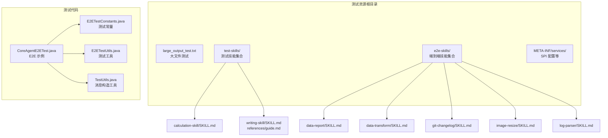
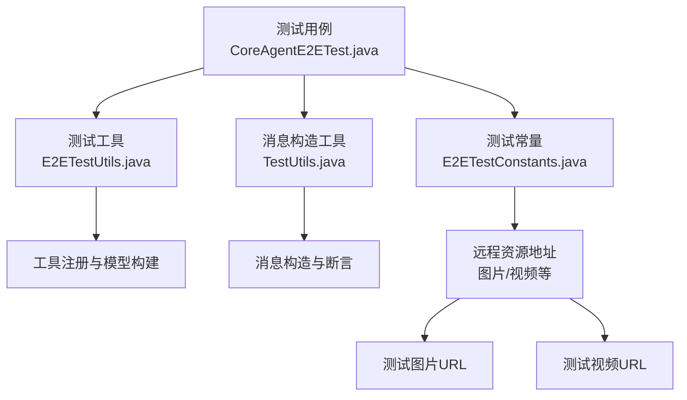
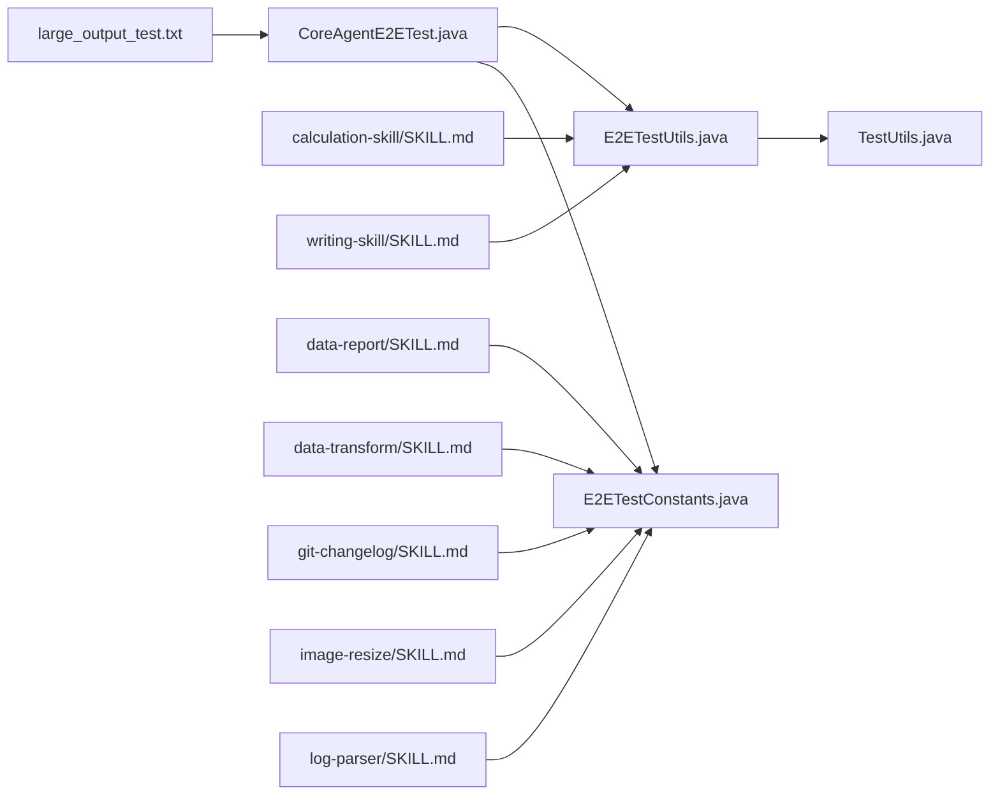

# 测试数据管理

<cite>
**本文引用的文件**
- [agentscope-core/src/test/resources/large_output_test.txt](file://agentscope-core/src/test/resources/large_output_test.txt)
- [agentscope-core/src/test/resources/test-skills/calculation-skill/SKILL.md](file://agentscope-core/src/test/resources/test-skills/calculation-skill/SKILL.md)
- [agentscope-core/src/test/resources/test-skills/writing-skill/SKILL.md](file://agentscope-core/src/test/resources/test-skills/writing-skill/SKILL.md)
- [agentscope-core/src/test/resources/test-skills/writing-skill/references/guide.md](file://agentscope-core/src/test/resources/test-skills/writing-skill/references/guide.md)
- [agentscope-core/src/test/resources/e2e-skills/data-report/SKILL.md](file://agentscope-core/src/test/resources/e2e-skills/data-report/SKILL.md)
- [agentscope-core/src/test/resources/e2e-skills/data-transform/SKILL.md](file://agentscope-core/src/test/resources/e2e-skills/data-transform/SKILL.md)
- [agentscope-core/src/test/resources/e2e-skills/git-changelog/SKILL.md](file://agentscope-core/src/test/resources/e2e-skills/git-changelog/SKILL.md)
- [agentscope-core/src/test/resources/e2e-skills/image-resize/SKILL.md](file://agentscope-core/src/test/resources/e2e-skills/image-resize/SKILL.md)
- [agentscope-core/src/test/resources/e2e-skills/log-parser/SKILL.md](file://agentscope-core/src/test/resources/e2e-skills/log-parser/SKILL.md)
- [agentscope-core/src/test/java/io/agentscope/core/e2e/E2ETestConstants.java](file://agentscope-core/src/test/java/io/agentscope/core/e2e/E2ETestConstants.java)
- [agentscope-core/src/test/java/io/agentscope/core/e2e/CoreAgentE2ETest.java](file://agentscope-core/src/test/java/io/agentscope/core/e2e/CoreAgentE2ETest.java)
- [agentscope-core/src/test/java/io/agentscope/core/e2e/E2ETestUtils.java](file://agentscope-core/src/test/java/io/agentscope/core/e2e/E2ETestUtils.java)
- [agentscope-core/src/test/java/io/agentscope/core/agent/test/TestUtils.java](file://agentscope-core/src/test/java/io/agentscope/core/agent/test/TestUtils.java)
</cite>

## 目录
1. [引言](#引言)
2. [项目结构](#项目结构)
3. [核心组件](#核心组件)
4. [架构总览](#架构总览)
5. [详细组件分析](#详细组件分析)
6. [依赖关系分析](#依赖关系分析)
7. [性能考量](#性能考量)
8. [故障排查指南](#故障排查指南)
9. [结论](#结论)
10. [附录](#附录)

## 引言
本文件面向 AgentScope Java 的测试数据管理，系统化梳理测试数据的组织结构、分类管理与版本控制策略，明确大文件测试、技能测试数据与端到端（E2E）测试数据的管理方法，并给出生成策略、模板使用、测试环境隔离、最佳实践与数据清理策略，确保测试环境整洁与测试结果可靠。

## 项目结构
测试数据主要位于 agentscope-core 模块的测试资源目录中，按用途分为三类：
- 大文件测试：用于验证流式输出、管道缓冲等场景的大文本文件
- 技能测试数据：包含“测试技能”与“端到端技能”，分别用于本地工具/脚本能力验证与多模态/复杂流程验证
- 常量与工具：集中存放测试常量与通用测试工具类，支撑各类测试用例

图表来源
- [agentscope-core/src/test/resources/large_output_test.txt:1-1001](file://agentscope-core/src/test/resources/large_output_test.txt#L1-L1001)
- [agentscope-core/src/test/resources/test-skills/calculation-skill/SKILL.md:1-13](file://agentscope-core/src/test/resources/test-skills/calculation-skill/SKILL.md#L1-L13)
- [agentscope-core/src/test/resources/test-skills/writing-skill/SKILL.md:1-14](file://agentscope-core/src/test/resources/test-skills/writing-skill/SKILL.md#L1-L14)
- [agentscope-core/src/test/resources/test-skills/writing-skill/references/guide.md:1-16](file://agentscope-core/src/test/resources/test-skills/writing-skill/references/guide.md#L1-L16)
- [agentscope-core/src/test/resources/e2e-skills/data-report/SKILL.md:1-18](file://agentscope-core/src/test/resources/e2e-skills/data-report/SKILL.md#L1-L18)
- [agentscope-core/src/test/resources/e2e-skills/data-transform/SKILL.md:1-200](file://agentscope-core/src/test/resources/e2e-skills/data-transform/SKILL.md#L1-L200)
- [agentscope-core/src/test/resources/e2e-skills/git-changelog/SKILL.md:1-200](file://agentscope-core/src/test/resources/e2e-skills/git-changelog/SKILL.md#L1-L200)
- [agentscope-core/src/test/resources/e2e-skills/image-resize/SKILL.md:1-200](file://agentscope-core/src/test/resources/e2e-skills/image-resize/SKILL.md#L1-L200)
- [agentscope-core/src/test/resources/e2e-skills/log-parser/SKILL.md:1-200](file://agentscope-core/src/test/resources/e2e-skills/log-parser/SKILL.md#L1-L200)
- [agentscope-core/src/test/java/io/agentscope/core/e2e/E2ETestConstants.java:1-62](file://agentscope-core/src/test/java/io/agentscope/core/e2e/E2ETestConstants.java#L1-L62)
- [agentscope-core/src/test/java/io/agentscope/core/e2e/CoreAgentE2ETest.java:1-283](file://agentscope-core/src/test/java/io/agentscope/core/e2e/CoreAgentE2ETest.java#L1-L283)
- [agentscope-core/src/test/java/io/agentscope/core/e2e/E2ETestUtils.java:1-190](file://agentscope-core/src/test/java/io/agentscope/core/e2e/E2ETestUtils.java#L1-L190)
- [agentscope-core/src/test/java/io/agentscope/core/agent/test/TestUtils.java:1-195](file://agentscope-core/src/test/java/io/agentscope/core/agent/test/TestUtils.java#L1-L195)

章节来源
- [agentscope-core/src/test/resources/large_output_test.txt:1-1001](file://agentscope-core/src/test/resources/large_output_test.txt#L1-L1001)
- [agentscope-core/src/test/resources/test-skills/calculation-skill/SKILL.md:1-13](file://agentscope-core/src/test/resources/test-skills/calculation-skill/SKILL.md#L1-L13)
- [agentscope-core/src/test/resources/test-skills/writing-skill/SKILL.md:1-14](file://agentscope-core/src/test/resources/test-skills/writing-skill/SKILL.md#L1-L14)
- [agentscope-core/src/test/resources/test-skills/writing-skill/references/guide.md:1-16](file://agentscope-core/src/test/resources/test-skills/writing-skill/references/guide.md#L1-L16)
- [agentscope-core/src/test/resources/e2e-skills/data-report/SKILL.md:1-18](file://agentscope-core/src/test/resources/e2e-skills/data-report/SKILL.md#L1-L18)
- [agentscope-core/src/test/resources/e2e-skills/data-transform/SKILL.md:1-200](file://agentscope-core/src/test/resources/e2e-skills/data-transform/SKILL.md#L1-L200)
- [agentscope-core/src/test/resources/e2e-skills/git-changelog/SKILL.md:1-200](file://agentscope-core/src/test/resources/e2e-skills/git-changelog/SKILL.md#L1-L200)
- [agentscope-core/src/test/resources/e2e-skills/image-resize/SKILL.md:1-200](file://agentscope-core/src/test/resources/e2e-skills/image-resize/SKILL.md#L1-L200)
- [agentscope-core/src/test/resources/e2e-skills/log-parser/SKILL.md:1-200](file://agentscope-core/src/test/resources/e2e-skills/log-parser/SKILL.md#L1-L200)
- [agentscope-core/src/test/java/io/agentscope/core/e2e/E2ETestConstants.java:1-62](file://agentscope-core/src/test/java/io/agentscope/core/e2e/E2ETestConstants.java#L1-L62)
- [agentscope-core/src/test/java/io/agentscope/core/e2e/CoreAgentE2ETest.java:1-283](file://agentscope-core/src/test/java/io/agentscope/core/e2e/CoreAgentE2ETest.java#L1-L283)
- [agentscope-core/src/test/java/io/agentscope/core/e2e/E2ETestUtils.java:1-190](file://agentscope-core/src/test/java/io/agentscope/core/e2e/E2ETestUtils.java#L1-L190)
- [agentscope-core/src/test/java/io/agentscope/core/agent/test/TestUtils.java:1-195](file://agentscope-core/src/test/java/io/agentscope/core/agent/test/TestUtils.java#L1-L195)

## 核心组件
- 大文件测试数据：提供长文本内容，用于验证流式输出、管道缓冲区行为与潜在死锁场景
- 测试技能数据：以“SKILL.md”描述技能范围与脚本路径，配合本地工具或脚本执行
- 端到端技能数据：包含多模态与数据处理脚本，用于复杂流程与外部依赖场景
- 测试常量与工具：集中定义测试资源访问地址、超时时间与通用消息构造、工具注册等

章节来源
- [agentscope-core/src/test/resources/large_output_test.txt:1-1001](file://agentscope-core/src/test/resources/large_output_test.txt#L1-L1001)
- [agentscope-core/src/test/resources/test-skills/calculation-skill/SKILL.md:1-13](file://agentscope-core/src/test/resources/test-skills/calculation-skill/SKILL.md#L1-L13)
- [agentscope-core/src/test/resources/test-skills/writing-skill/SKILL.md:1-14](file://agentscope-core/src/test/resources/test-skills/writing-skill/SKILL.md#L1-L14)
- [agentscope-core/src/test/resources/test-skills/writing-skill/references/guide.md:1-16](file://agentscope-core/src/test/resources/test-skills/writing-skill/references/guide.md#L1-L16)
- [agentscope-core/src/test/resources/e2e-skills/data-report/SKILL.md:1-18](file://agentscope-core/src/test/resources/e2e-skills/data-report/SKILL.md#L1-L18)
- [agentscope-core/src/test/java/io/agentscope/core/e2e/E2ETestConstants.java:1-62](file://agentscope-core/src/test/java/io/agentscope/core/e2e/E2ETestConstants.java#L1-L62)
- [agentscope-core/src/test/java/io/agentscope/core/e2e/E2ETestUtils.java:1-190](file://agentscope-core/src/test/java/io/agentscope/core/e2e/E2ETestUtils.java#L1-L190)
- [agentscope-core/src/test/java/io/agentscope/core/agent/test/TestUtils.java:1-195](file://agentscope-core/src/test/java/io/agentscope/core/agent/test/TestUtils.java#L1-L195)

## 架构总览
测试数据管理采用“资源分层+工具支撑”的架构：
- 资源层：按用途划分的文件与目录，便于检索与版本控制
- 工具层：常量与工具类统一管理测试依赖与构造逻辑
- 用例层：通过参数化与条件执行，结合资源与工具完成测试

图表来源
- [agentscope-core/src/test/java/io/agentscope/core/e2e/CoreAgentE2ETest.java:1-283](file://agentscope-core/src/test/java/io/agentscope/core/e2e/CoreAgentE2ETest.java#L1-L283)
- [agentscope-core/src/test/java/io/agentscope/core/e2e/E2ETestUtils.java:1-190](file://agentscope-core/src/test/java/io/agentscope/core/e2e/E2ETestUtils.java#L1-L190)
- [agentscope-core/src/test/java/io/agentscope/core/agent/test/TestUtils.java:1-195](file://agentscope-core/src/test/java/io/agentscope/core/agent/test/TestUtils.java#L1-L195)
- [agentscope-core/src/test/java/io/agentscope/core/e2e/E2ETestConstants.java:1-62](file://agentscope-core/src/test/java/io/agentscope/core/e2e/E2ETestConstants.java#L1-L62)

## 详细组件分析

### 大文件测试数据管理
- 文件定位：agentscope-core/src/test/resources/large_output_test.txt
- 用途：填充管道缓冲区，触发并验证死锁相关问题；适合流式输出与长时间运行场景
- 管理建议：
  - 版本控制：随功能迭代同步更新，避免历史分支污染
  - 清理策略：仅在需要验证长输出/流式行为时启用，其他用例禁用或替换为小规模数据
  - 生成策略：按需生成，避免长期保留过大文件影响仓库体积

章节来源
- [agentscope-core/src/test/resources/large_output_test.txt:1-1001](file://agentscope-core/src/test/resources/large_output_test.txt#L1-L1001)

### 技能测试数据管理
- 组织结构：
  - test-skills/calculation-skill/SKILL.md：数学计算能力描述与用途
  - test-skills/writing-skill/SKILL.md 及 references/guide.md：写作与内容创作能力描述与参考指南
- 使用方式：
  - 通过 E2ETestUtils 中的工具类注册本地工具（如加法、乘法、字符串处理），在测试中直接调用
  - 通过 SKILL.md 描述技能边界，避免误用（例如数据报告技能不应用于简单格式转换）
- 管理建议：
  - 分类命名：以技能名作为目录名，便于检索
  - 文档驱动：SKILL.md 明确技能职责与脚本路径，减少歧义
  - 版本控制：技能变更时同步更新 SKILL.md 与相关脚本

章节来源
- [agentscope-core/src/test/resources/test-skills/calculation-skill/SKILL.md:1-13](file://agentscope-core/src/test/resources/test-skills/calculation-skill/SKILL.md#L1-L13)
- [agentscope-core/src/test/resources/test-skills/writing-skill/SKILL.md:1-14](file://agentscope-core/src/test/resources/test-skills/writing-skill/SKILL.md#L1-L14)
- [agentscope-core/src/test/resources/test-skills/writing-skill/references/guide.md:1-16](file://agentscope-core/src/test/resources/test-skills/writing-skill/references/guide.md#L1-L16)
- [agentscope-core/src/test/java/io/agentscope/core/e2e/E2ETestUtils.java:1-190](file://agentscope-core/src/test/java/io/agentscope/core/e2e/E2ETestUtils.java#L1-L190)

### 端到端测试数据管理
- 组织结构：
  - e2e-skills/data-report/SKILL.md：数据分析与统计报告生成
  - e2e-skills/data-transform/SKILL.md：CSV/JSON 等格式转换
  - e2e-skills/git-changelog/SKILL.md：Git 变更日志生成
  - e2e-skills/image-resize/SKILL.md：图像尺寸调整
  - e2e-skills/log-parser/SKILL.md：日志解析与错误提取
- 使用方式：
  - E2ETestConstants 提供远程资源访问地址（图片、视频），用于多模态与媒体处理测试
  - CoreAgentE2ETest 展示如何在参数化测试中加载工具与执行多轮对话
- 管理建议：
  - 远程资源：集中维护在 E2ETestConstants，便于切换与失效处理
  - 脚本路径：SKILL.md 中明确脚本位置与调用方式，避免路径漂移
  - 条件执行：根据环境变量与能力开关，动态启用/跳过测试

章节来源
- [agentscope-core/src/test/resources/e2e-skills/data-report/SKILL.md:1-18](file://agentscope-core/src/test/resources/e2e-skills/data-report/SKILL.md#L1-L18)
- [agentscope-core/src/test/resources/e2e-skills/data-transform/SKILL.md:1-200](file://agentscope-core/src/test/resources/e2e-skills/data-transform/SKILL.md#L1-L200)
- [agentscope-core/src/test/resources/e2e-skills/git-changelog/SKILL.md:1-200](file://agentscope-core/src/test/resources/e2e-skills/git-changelog/SKILL.md#L1-L200)
- [agentscope-core/src/test/resources/e2e-skills/image-resize/SKILL.md:1-200](file://agentscope-core/src/test/resources/e2e-skills/image-resize/SKILL.md#L1-L200)
- [agentscope-core/src/test/resources/e2e-skills/log-parser/SKILL.md:1-200](file://agentscope-core/src/test/resources/e2e-skills/log-parser/SKILL.md#L1-L200)
- [agentscope-core/src/test/java/io/agentscope/core/e2e/E2ETestConstants.java:1-62](file://agentscope-core/src/test/java/io/agentscope/core/e2e/E2ETestConstants.java#L1-L62)
- [agentscope-core/src/test/java/io/agentscope/core/e2e/CoreAgentE2ETest.java:1-283](file://agentscope-core/src/test/java/io/agentscope/core/e2e/CoreAgentE2ETest.java#L1-L283)

### 测试数据生成策略与模板使用
- 生成策略：
  - 小规模数据优先：默认使用小数据集进行单元与集成测试
  - 大文件按需：仅在需要验证流式输出或缓冲行为时启用大文件
  - 技能脚本：通过 SKILL.md 模板描述脚本输入输出与调用方式
- 模板使用：
  - 技能模板：以“---”开头的 YAML 头部与 Markdown 正文，清晰描述技能职责
  - 工具模板：在 E2ETestUtils 中注册工具类，统一暴露方法签名与参数校验
- 数据模板路径：
  - 技能描述：agentscope-core/src/test/resources/test-skills/*/SKILL.md
  - 端到端技能描述：agentscope-core/src/test/resources/e2e-skills/*/SKILL.md

章节来源
- [agentscope-core/src/test/resources/test-skills/calculation-skill/SKILL.md:1-13](file://agentscope-core/src/test/resources/test-skills/calculation-skill/SKILL.md#L1-L13)
- [agentscope-core/src/test/resources/test-skills/writing-skill/SKILL.md:1-14](file://agentscope-core/src/test/resources/test-skills/writing-skill/SKILL.md#L1-L14)
- [agentscope-core/src/test/resources/e2e-skills/data-report/SKILL.md:1-18](file://agentscope-core/src/test/resources/e2e-skills/data-report/SKILL.md#L1-L18)
- [agentscope-core/src/test/java/io/agentscope/core/e2e/E2ETestUtils.java:1-190](file://agentscope-core/src/test/java/io/agentscope/core/e2e/E2ETestUtils.java#L1-L190)

### 测试环境的数据隔离
- 远程资源隔离：E2ETestConstants 统一管理图片/视频等外部资源地址，便于在不同环境切换
- 工具与内存隔离：E2ETestUtils 创建独立的 Toolkit 与 InMemoryMemory，避免跨用例状态污染
- 参数化与条件执行：CoreAgentE2ETest 使用参数化与条件注解，按能力启用测试，减少无效请求

章节来源
- [agentscope-core/src/test/java/io/agentscope/core/e2e/E2ETestConstants.java:1-62](file://agentscope-core/src/test/java/io/agentscope/core/e2e/E2ETestConstants.java#L1-L62)
- [agentscope-core/src/test/java/io/agentscope/core/e2e/E2ETestUtils.java:1-190](file://agentscope-core/src/test/java/io/agentscope/core/e2e/E2ETestUtils.java#L1-L190)
- [agentscope-core/src/test/java/io/agentscope/core/e2e/CoreAgentE2ETest.java:1-283](file://agentscope-core/src/test/java/io/agentscope/core/e2e/CoreAgentE2ETest.java#L1-L283)

### 端到端测试数据的管理方法
- 资源集中：图片/视频等外部资源统一在 E2ETestConstants 中维护
- 工具注册：通过 E2ETestUtils.createTestToolkit 注册本地工具，支持加法、乘法、字符串处理等
- 场景覆盖：CoreAgentE2ETest 展示基础对话、多轮对话、混合对话与工具调用等典型场景

章节来源
- [agentscope-core/src/test/java/io/agentscope/core/e2e/E2ETestConstants.java:1-62](file://agentscope-core/src/test/java/io/agentscope/core/e2e/E2ETestConstants.java#L1-L62)
- [agentscope-core/src/test/java/io/agentscope/core/e2e/E2ETestUtils.java:1-190](file://agentscope-core/src/test/java/io/agentscope/core/e2e/E2ETestUtils.java#L1-L190)
- [agentscope-core/src/test/java/io/agentscope/core/e2e/CoreAgentE2ETest.java:1-283](file://agentscope-core/src/test/java/io/agentscope/core/e2e/CoreAgentE2ETest.java#L1-L283)

## 依赖关系分析
测试数据与工具之间的依赖关系如下：

图表来源
- [agentscope-core/src/test/resources/large_output_test.txt:1-1001](file://agentscope-core/src/test/resources/large_output_test.txt#L1-L1001)
- [agentscope-core/src/test/resources/test-skills/calculation-skill/SKILL.md:1-13](file://agentscope-core/src/test/resources/test-skills/calculation-skill/SKILL.md#L1-L13)
- [agentscope-core/src/test/resources/test-skills/writing-skill/SKILL.md:1-14](file://agentscope-core/src/test/resources/test-skills/writing-skill/SKILL.md#L1-L14)
- [agentscope-core/src/test/resources/e2e-skills/data-report/SKILL.md:1-18](file://agentscope-core/src/test/resources/e2e-skills/data-report/SKILL.md#L1-L18)
- [agentscope-core/src/test/resources/e2e-skills/data-transform/SKILL.md:1-200](file://agentscope-core/src/test/resources/e2e-skills/data-transform/SKILL.md#L1-L200)
- [agentscope-core/src/test/resources/e2e-skills/git-changelog/SKILL.md:1-200](file://agentscope-core/src/test/resources/e2e-skills/git-changelog/SKILL.md#L1-L200)
- [agentscope-core/src/test/resources/e2e-skills/image-resize/SKILL.md:1-200](file://agentscope-core/src/test/resources/e2e-skills/image-resize/SKILL.md#L1-L200)
- [agentscope-core/src/test/resources/e2e-skills/log-parser/SKILL.md:1-200](file://agentscope-core/src/test/resources/e2e-skills/log-parser/SKILL.md#L1-L200)
- [agentscope-core/src/test/java/io/agentscope/core/e2e/CoreAgentE2ETest.java:1-283](file://agentscope-core/src/test/java/io/agentscope/core/e2e/CoreAgentE2ETest.java#L1-L283)
- [agentscope-core/src/test/java/io/agentscope/core/e2e/E2ETestUtils.java:1-190](file://agentscope-core/src/test/java/io/agentscope/core/e2e/E2ETestUtils.java#L1-L190)
- [agentscope-core/src/test/java/io/agentscope/core/e2e/E2ETestConstants.java:1-62](file://agentscope-core/src/test/java/io/agentscope/core/e2e/E2ETestConstants.java#L1-L62)
- [agentscope-core/src/test/java/io/agentscope/core/agent/test/TestUtils.java:1-195](file://agentscope-core/src/test/java/io/agentscope/core/agent/test/TestUtils.java#L1-L195)

## 性能考量
- 大文件测试仅在必要时启用，避免增加测试执行时间与网络带宽消耗
- 远程资源访问应设置合理超时与重试策略，降低不稳定因素对测试稳定性的影响
- 工具注册与消息构造尽量复用，减少重复初始化带来的开销

## 故障排查指南
- 远程资源不可达：检查 E2ETestConstants 中的 URL 是否可用，必要时切换备用地址
- 工具未注册：确认 E2ETestUtils 中已正确注册所需工具类
- 内容断言失败：使用 TestUtils.extractTextContent 获取文本内容，核对预期关键词是否匹配
- 超时问题：适当提高测试超时时间，或优化工具实现以减少响应延迟

章节来源
- [agentscope-core/src/test/java/io/agentscope/core/e2e/E2ETestConstants.java:1-62](file://agentscope-core/src/test/java/io/agentscope/core/e2e/E2ETestConstants.java#L1-L62)
- [agentscope-core/src/test/java/io/agentscope/core/e2e/E2ETestUtils.java:1-190](file://agentscope-core/src/test/java/io/agentscope/core/e2e/E2ETestUtils.java#L1-L190)
- [agentscope-core/src/test/java/io/agentscope/core/agent/test/TestUtils.java:1-195](file://agentscope-core/src/test/java/io/agentscope/core/agent/test/TestUtils.java#L1-L195)

## 结论
通过将测试数据按用途分层组织、以 SKILL.md 与常量/工具类驱动测试执行，并结合条件与参数化机制实现环境隔离与按需启用，AgentScope Java 的测试数据管理实现了高可维护性与高可靠性。建议持续遵循本文的最佳实践与清理策略，确保测试环境整洁与测试结果稳定。

## 附录
- 最佳实践清单
  - 使用 SKILL.md 明确技能职责与脚本路径
  - 将远程资源集中管理于 E2ETestConstants
  - 在 E2ETestUtils 中统一注册工具与构建模型
  - 使用 TestUtils 构造标准消息，提升断言一致性
  - 大文件测试按需启用，避免长期占用空间
- 数据清理策略
  - 定期审查并删除不再使用的测试资源
  - 对大文件测试建立启用/禁用开关，避免无谓执行
  - 对外部资源建立失效检测与降级方案