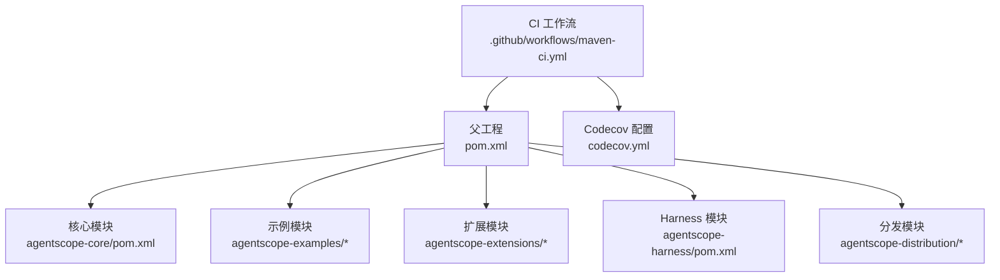
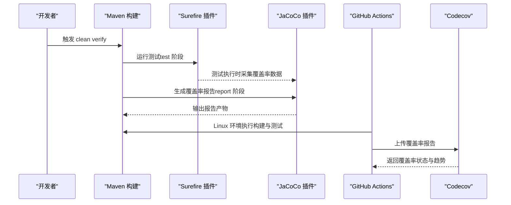
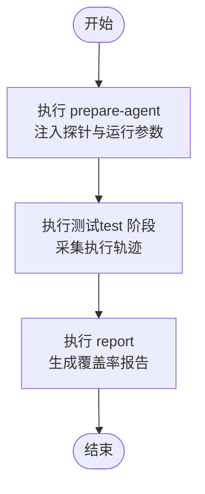
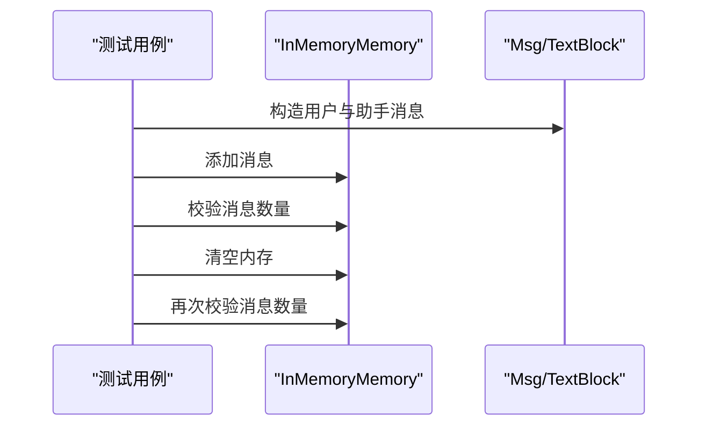
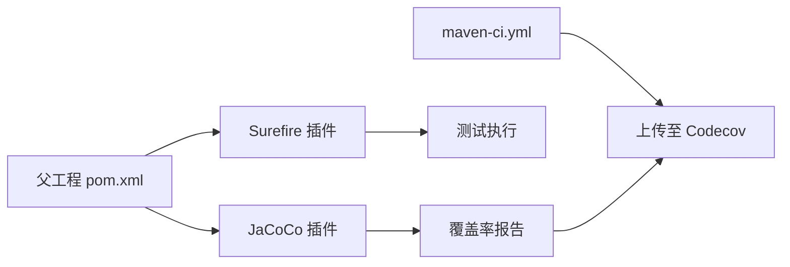

# 测试覆盖率分析

<cite>
**本文引用的文件**
- [pom.xml](file://pom.xml)
- [codecov.yml](file://codecov.yml)
- [.github/workflows/maven-ci.yml](file://.github/workflows/maven-ci.yml)
- [agentscope-core/pom.xml](file://agentscope-core/pom.xml)
- [SimpleIntegrationTest.java](file://agentscope-core/src/test/java/io/agentscope/core/SimpleIntegrationTest.java)
- [VersionTest.java](file://agentscope-core/src/test/java/io/agentscope/core/VersionTest.java)
</cite>

## 目录
1. [引言](#引言)
2. [项目结构](#项目结构)
3. [核心组件](#核心组件)
4. [架构总览](#架构总览)
5. [详细组件分析](#详细组件分析)
6. [依赖分析](#依赖分析)
7. [性能考虑](#性能考虑)
8. [故障排查指南](#故障排查指南)
9. [结论](#结论)
10. [附录](#附录)

## 引言
本技术文档聚焦于 AgentScope Java 的测试覆盖率分析，系统阐述覆盖率统计方法、覆盖率报告生成流程与评估标准；详解 JaCoCo 插件在 Maven 中的配置方式、覆盖率阈值设定以及覆盖率趋势跟踪策略；并给出关键路径测试、分支覆盖测试与行覆盖测试的实施策略，最后提供覆盖率分析工具的使用指南与持续改进最佳实践，帮助团队稳定提升代码质量与测试效果。

## 项目结构
AgentScope Java 采用多模块 Maven 结构，父工程统一管理版本与插件，核心模块 agentscope-core 提供 Agent、消息、模型、工具、记忆体等基础能力，测试用例集中在各模块的 src/test 下。覆盖率分析通过 JaCoCo 在 Maven 生命周期中自动采集与生成报告，并由 GitHub Actions 在 Linux 环境上传至 Codecov。

图表来源
- [pom.xml:1-401](file://pom.xml#L1-L401)
- [agentscope-core/pom.xml:1-156](file://agentscope-core/pom.xml#L1-L156)
- [.github/workflows/maven-ci.yml:1-140](file://.github/workflows/maven-ci.yml#L1-L140)
- [codecov.yml:1-34](file://codecov.yml#L1-L34)

章节来源
- [pom.xml:56-63](file://pom.xml#L56-L63)
- [pom.xml:291-310](file://pom.xml#L291-L310)
- [.github/workflows/maven-ci.yml:110-138](file://.github/workflows/maven-ci.yml#L110-L138)
- [codecov.yml:15-34](file://codecov.yml#L15-L34)

## 核心组件
- 覆盖率采集与报告生成：通过 JaCoCo Maven 插件在测试阶段生成覆盖率数据与 HTML 报告。
- CI 集成：GitHub Actions 在 Linux 构建后自动上传覆盖率报告到 Codecov。
- 阈值与忽略规则：Codecov 配置定义项目与补丁覆盖率目标与阈值，并忽略示例模块以聚焦核心库质量。
- 测试用例：agentscope-core 内置单元与集成测试，验证关键路径与边界条件。

章节来源
- [pom.xml:291-310](file://pom.xml#L291-L310)
- [.github/workflows/maven-ci.yml:132-138](file://.github/workflows/maven-ci.yml#L132-L138)
- [codecov.yml:18-31](file://codecov.yml#L18-L31)
- [SimpleIntegrationTest.java:1-57](file://agentscope-core/src/test/java/io/agentscope/core/SimpleIntegrationTest.java#L1-L57)
- [VersionTest.java:1-109](file://agentscope-core/src/test/java/io/agentscope/core/VersionTest.java#L1-L109)

## 架构总览
下图展示从构建到覆盖率报告的关键流程：Maven 执行测试生命周期，JaCoCo 注入探针并收集执行轨迹，生成报告；随后 GitHub Actions 将报告上传至 Codecov，用于可视化与阈值校验。

图表来源
- [pom.xml:271-289](file://pom.xml#L271-L289)
- [pom.xml:291-310](file://pom.xml#L291-L310)
- [.github/workflows/maven-ci.yml:110-138](file://.github/workflows/maven-ci.yml#L110-L138)
- [codecov.yml:15-34](file://codecov.yml#L15-L34)

## 详细组件分析

### JaCoCo 插件配置与执行流程
- 插件版本与坐标：在父工程中声明 JaCoCo 版本属性，并在插件区段配置版本号。
- 执行阶段：
  - prepare-agent：在测试前准备探针与运行参数。
  - report：在 test 阶段结束后生成报告。
- 与 Surefire 的协作：通过 argLine 合并 JaCoCo 探针参数，确保测试进程被正确采样。

图表来源
- [pom.xml:291-310](file://pom.xml#L291-L310)
- [pom.xml:271-289](file://pom.xml#L271-L289)

章节来源
- [pom.xml:291-310](file://pom.xml#L291-L310)
- [pom.xml:271-289](file://pom.xml#L271-L289)

### 覆盖率报告生成与上传
- 报告生成：在 Maven test 阶段后由 JaCoCo 插件生成报告，通常包含 XML 与 HTML。
- CI 上传：GitHub Actions 在 Linux 环境执行构建与测试后，调用 codecov-action 上传报告。
- 配置项：fail_ci_if_error 控制上传失败是否导致流水线失败；verbose 输出详细日志。

章节来源
- [.github/workflows/maven-ci.yml:110-138](file://.github/workflows/maven-ci.yml#L110-L138)
- [codecov.yml:15-34](file://codecov.yml#L15-L34)

### 覆盖率阈值与评估标准
- 项目级阈值：项目整体覆盖率目标为 60%，阈值容差为 ±1%。
- 补丁级阈值：针对变更内容的目标为 60%，阈值容差为 ±5%。
- 忽略规则：示例模块（agentscope-examples/**/*）不参与覆盖率计算，避免噪声干扰核心库质量。
- 精度与取整：覆盖率精度保留两位小数，向下取整。

章节来源
- [codecov.yml:18-31](file://codecov.yml#L18-L31)
- [codecov.yml:32-34](file://codecov.yml#L32-L34)

### 关键路径测试策略
- 目标：确保核心业务路径（如消息处理、工具调用、模型请求链路）被充分覆盖。
- 方法：
  - 单元测试：对独立方法与边界条件进行断言，保证关键分支与异常路径被触发。
  - 集成测试：组合多个组件，验证端到端流程，例如消息内存操作与清理逻辑。
- 示例参考：
  - SimpleIntegrationTest：验证内存消息的添加与清空行为。
  - VersionTest：验证版本常量与 User-Agent 字符串格式与一致性。

图表来源
- [SimpleIntegrationTest.java:28-55](file://agentscope-core/src/test/java/io/agentscope/core/SimpleIntegrationTest.java#L28-L55)

章节来源
- [SimpleIntegrationTest.java:1-57](file://agentscope-core/src/test/java/io/agentscope/core/SimpleIntegrationTest.java#L1-L57)
- [VersionTest.java:1-109](file://agentscope-core/src/test/java/io/agentscope/core/VersionTest.java#L1-L109)

### 分支覆盖测试策略
- 目标：确保每个条件分支至少被执行一次，包括 if/else、switch/default、三元表达式等。
- 方法：
  - 条件分支：构造输入使条件为真与假，分别验证两个分支。
  - 异常分支：模拟异常场景，验证错误处理与回退逻辑。
  - 边界值：针对数值或集合边界进行测试，覆盖临界点。
- 建议：结合覆盖率报告定位未覆盖分支，补充针对性用例。

### 行覆盖测试策略
- 目标：确保每行可执行代码至少被执行一次。
- 方法：
  - 基础行覆盖：通过现有测试用例逐步增加覆盖范围。
  - 复杂路径：对嵌套循环、深层递归与异步流程进行重点覆盖。
  - 报告驱动：以 JaCoCo 报告中标记为“未命中”的行作为优先修复对象。

### 覆盖率趋势跟踪
- 指标：关注项目整体覆盖率、补丁覆盖率与关键模块的覆盖率变化。
- 工具：利用 Codecov 的可视化界面与历史趋势，识别回归与改进点。
- 周期性评审：在迭代周期末尾对比覆盖率目标完成情况，形成改进闭环。

## 依赖分析
- 插件依赖：JaCoCo 插件依赖 Maven Surefire 插件在 test 阶段执行测试并采集数据。
- CI 依赖：GitHub Actions 依赖 Maven 构建产物与 JaCoCo 报告，再上传至 Codecov。
- 配置依赖：父工程统一版本与插件配置，子模块继承并按需扩展。

图表来源
- [pom.xml:291-310](file://pom.xml#L291-L310)
- [pom.xml:271-289](file://pom.xml#L271-L289)
- [.github/workflows/maven-ci.yml:110-138](file://.github/workflows/maven-ci.yml#L110-L138)

章节来源
- [pom.xml:271-289](file://pom.xml#L271-L289)
- [pom.xml:291-310](file://pom.xml#L291-L310)
- [.github/workflows/maven-ci.yml:110-138](file://.github/workflows/maven-ci.yml#L110-L138)

## 性能考虑
- 构建性能：使用 mvnd（Maven Daemon）提升本地与 CI 的构建速度，减少重复下载依赖的时间。
- 测试性能：合理拆分测试套件，避免单个测试类过大；对耗时外部依赖使用 Mock 或本地化替代。
- 覆盖率开销：JaCoCo 探针会带来轻微运行时开销，但在 CI 中影响有限；建议仅在 CI 与发布前构建启用覆盖率。

## 故障排查指南
- 问题：覆盖率报告为空或缺失
  - 检查 JaCoCo report 是否在 test 阶段执行。
  - 确认 Surefire 插件未被排除测试执行。
- 问题：CI 上传失败
  - 检查 codecov-action 的 token 配置与权限。
  - 查看 verbose 日志定位上传错误原因。
- 问题：覆盖率低于阈值
  - 使用 JaCoCo 报告定位未覆盖区域，补充关键路径与分支测试。
  - 确认 codecov.yml 的阈值与忽略规则符合预期。

章节来源
- [pom.xml:291-310](file://pom.xml#L291-L310)
- [pom.xml:271-289](file://pom.xml#L271-L289)
- [.github/workflows/maven-ci.yml:132-138](file://.github/workflows/maven-ci.yml#L132-L138)
- [codecov.yml:18-31](file://codecov.yml#L18-L31)

## 结论
通过在 Maven 中启用 JaCoCo 插件、在 CI 中上传覆盖率报告并与 Codecov 集成，AgentScope Java 已建立完善的覆盖率监控体系。结合明确的阈值与忽略规则，团队可以持续跟踪关键路径、分支与行覆盖，推动测试质量稳步提升。建议在后续迭代中进一步完善复杂路径与边界条件的测试，缩小覆盖率缺口，确保核心模块达到并维持既定目标。

## 附录
- 使用指南摘要
  - 本地：mvn clean verify，完成后在各模块 target/site/jacoco 或 target/jacoco.exec 生成报告。
  - CI：确保 Linux 环境执行 mvnd -B -T1 clean verify，自动上传至 Codecov。
  - 阈值：项目整体与补丁目标均为 60%，示例模块不计入统计。
- 最佳实践
  - 以覆盖率报告为依据，优先补齐关键路径与分支。
  - 对高风险模块（模型、工具、消息）进行重点覆盖。
  - 定期回顾趋势，防止覆盖率回退。