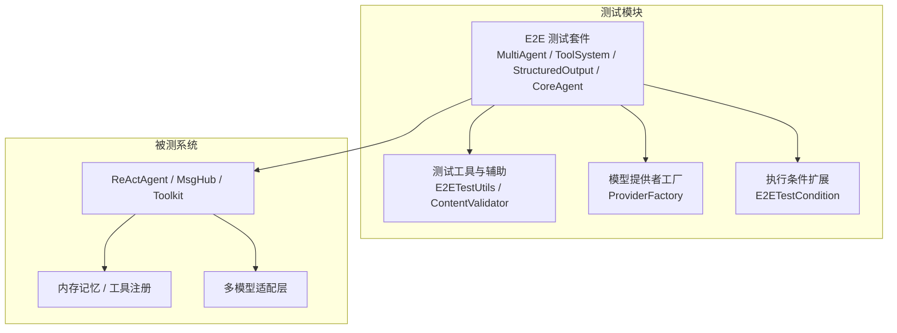
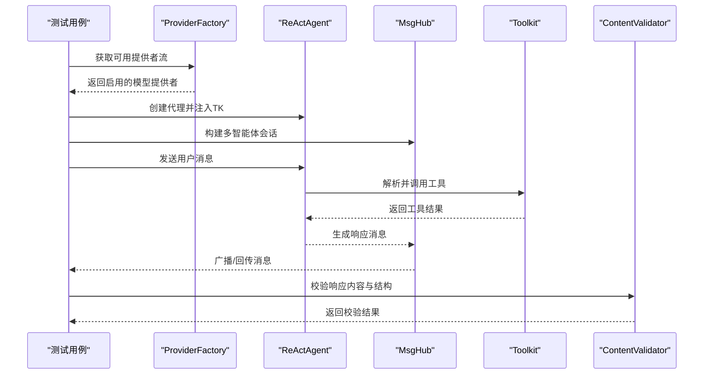
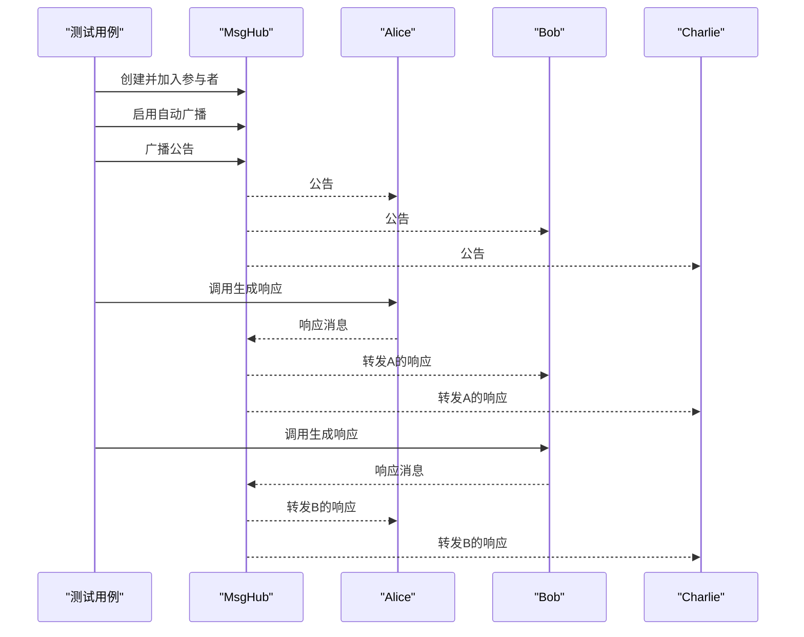
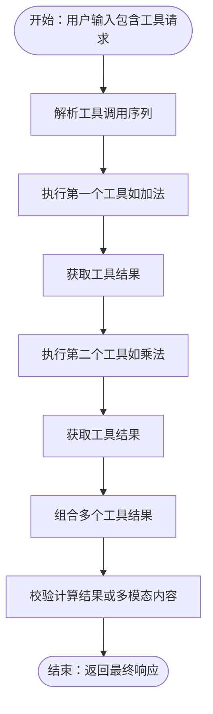
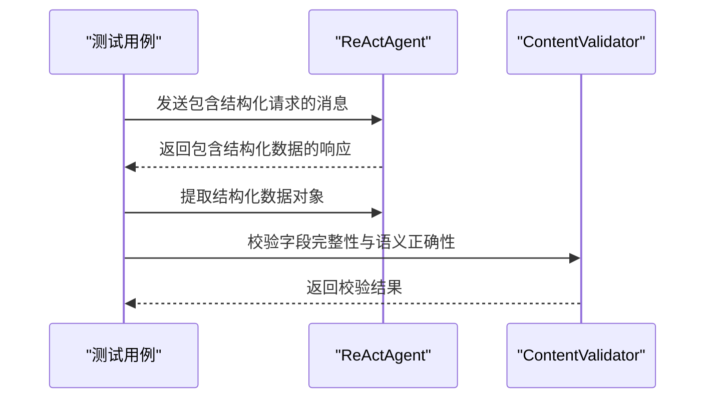
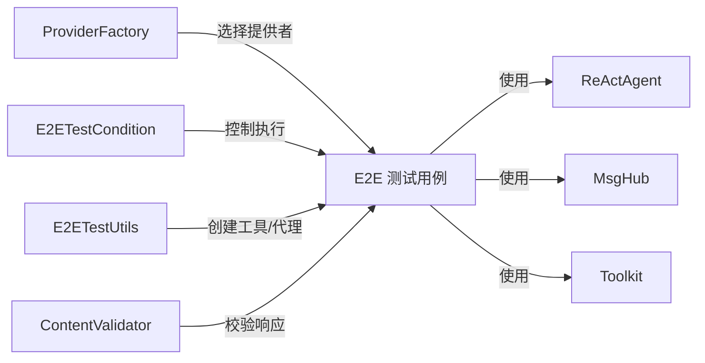

# 集成测试

<cite>
**本文引用的文件**
- [MultiAgentE2ETest.java](file://agentscope-core/src/test/java/io/agentscope/core/e2e/MultiAgentE2ETest.java)
- [ToolSystemE2ETest.java](file://agentscope-core/src/test/java/io/agentscope/core/e2e/ToolSystemE2ETest.java)
- [StructuredOutputE2ETest.java](file://agentscope-core/src/test/java/io/agentscope/core/e2e/StructuredOutputE2ETest.java)
- [CoreAgentE2ETest.java](file://agentscope-core/src/test/java/io/agentscope/core/e2e/CoreAgentE2ETest.java)
- [E2ETestUtils.java](file://agentscope-core/src/test/java/io/agentscope/core/e2e/E2ETestUtils.java)
- [ProviderFactory.java](file://agentscope-core/src/test/java/io/agentscope/core/e2e/ProviderFactory.java)
- [E2ETestCondition.java](file://agentscope-core/src/test/java/io/agentscope/core/e2e/E2ETestCondition.java)
- [ContentValidator.java](file://agentscope-core/src/test/java/io/agentscope/core/e2e/ContentValidator.java)
- [SimpleIntegrationTest.java](file://agentscope-core/src/test/java/io/agentscope/core/SimpleIntegrationTest.java)
- [large_output_test.txt](file://agentscope-core/src/test/resources/large_output_test.txt)
</cite>

## 目录
1. [引言](#引言)
2. [项目结构](#项目结构)
3. [核心组件](#核心组件)
4. [架构总览](#架构总览)
5. [详细组件分析](#详细组件分析)
6. [依赖关系分析](#依赖关系分析)
7. [性能考虑](#性能考虑)
8. [故障排除指南](#故障排除指南)
9. [结论](#结论)
10. [附录](#附录)

## 引言
本技术文档面向 AgentScope Java 的集成测试体系，聚焦于端到端（E2E）测试的设计理念与实现方法，覆盖多智能体协作、工具系统集成与结构化输出三大核心场景。文档从测试场景构建、测试数据准备、测试环境配置入手，系统阐述测试用例设计与验证策略，并提供完整示例与故障排除建议，确保系统在真实模型与复杂交互下的稳定性与可靠性。

## 项目结构
AgentScope Java 的集成测试主要位于 agentscope-core 模块的 test/java/io/agentscope/core/e2e 目录下，围绕 ProviderFactory 提供的多模型能力进行参数化测试；同时通过 E2ETestCondition 控制执行开关，结合 ContentValidator 进行响应内容校验，E2ETestUtils 提供工具集与测试辅助。

图示来源
- [MultiAgentE2ETest.java:113-248](file://agentscope-core/src/test/java/io/agentscope/core/e2e/MultiAgentE2ETest.java#L113-L248)
- [ToolSystemE2ETest.java:66-97](file://agentscope-core/src/test/java/io/agentscope/core/e2e/ToolSystemE2ETest.java#L66-L97)
- [StructuredOutputE2ETest.java:172-209](file://agentscope-core/src/test/java/io/agentscope/core/e2e/StructuredOutputE2ETest.java#L172-L209)
- [CoreAgentE2ETest.java:58-85](file://agentscope-core/src/test/java/io/agentscope/core/e2e/CoreAgentE2ETest.java#L58-L85)
- [E2ETestUtils.java:77-82](file://agentscope-core/src/test/java/io/agentscope/core/e2e/E2ETestUtils.java#L77-L82)
- [ProviderFactory.java:214-241](file://agentscope-core/src/test/java/io/agentscope/core/e2e/ProviderFactory.java#L214-L241)
- [E2ETestCondition.java:43-68](file://agentscope-core/src/test/java/io/agentscope/core/e2e/E2ETestCondition.java#L43-L68)

章节来源
- [MultiAgentE2ETest.java:1-659](file://agentscope-core/src/test/java/io/agentscope/core/e2e/MultiAgentE2ETest.java#L1-L659)
- [ToolSystemE2ETest.java:1-328](file://agentscope-core/src/test/java/io/agentscope/core/e2e/ToolSystemE2ETest.java#L1-L328)
- [StructuredOutputE2ETest.java:1-493](file://agentscope-core/src/test/java/io/agentscope/core/e2e/StructuredOutputE2ETest.java#L1-L493)
- [CoreAgentE2ETest.java:1-283](file://agentscope-core/src/test/java/io/agentscope/core/e2e/CoreAgentE2ETest.java#L1-L283)
- [E2ETestUtils.java:1-190](file://agentscope-core/src/test/java/io/agentscope/core/e2e/E2ETestUtils.java#L1-L190)
- [ProviderFactory.java:1-360](file://agentscope-core/src/test/java/io/agentscope/core/e2e/ProviderFactory.java#L1-L360)
- [E2ETestCondition.java:1-70](file://agentscope-core/src/test/java/io/agentscope/core/e2e/E2ETestCondition.java#L1-L70)
- [ContentValidator.java:1-233](file://agentscope-core/src/test/java/io/agentscope/core/e2e/ContentValidator.java#L1-L233)

## 核心组件
- 多智能体协作测试：基于 MsgHub 的自动广播与手动广播控制，验证角色分工、动态参与者管理与结构化输出生成。
- 工具系统集成测试：覆盖顺序工具调用、复杂计算链路、多模态工具返回值处理与工具调用记忆结构验证。
- 结构化输出测试：验证单轮与多轮对话后的结构化输出提取、嵌套数据结构处理与内存清理策略。
- 核心代理测试：基础对话、多轮上下文保留、混合对话（有无工具）、简单工具调用与错误处理。
- 测试工具与条件：E2ETestUtils 提供工具与代理创建；ProviderFactory 动态选择可用模型；E2ETestCondition 控制执行开关；ContentValidator 提供内容校验。

章节来源
- [MultiAgentE2ETest.java:113-640](file://agentscope-core/src/test/java/io/agentscope/core/e2e/MultiAgentE2ETest.java#L113-L640)
- [ToolSystemE2ETest.java:66-282](file://agentscope-core/src/test/java/io/agentscope/core/e2e/ToolSystemE2ETest.java#L66-L282)
- [StructuredOutputE2ETest.java:172-491](file://agentscope-core/src/test/java/io/agentscope/core/e2e/StructuredOutputE2ETest.java#L172-L491)
- [CoreAgentE2ETest.java:58-246](file://agentscope-core/src/test/java/io/agentscope/core/e2e/CoreAgentE2ETest.java#L58-L246)
- [E2ETestUtils.java:77-188](file://agentscope-core/src/test/java/io/agentscope/core/e2e/E2ETestUtils.java#L77-L188)
- [ProviderFactory.java:214-332](file://agentscope-core/src/test/java/io/agentscope/core/e2e/ProviderFactory.java#L214-L332)
- [E2ETestCondition.java:43-68](file://agentscope-core/src/test/java/io/agentscope/core/e2e/E2ETestCondition.java#L43-L68)
- [ContentValidator.java:40-231](file://agentscope-core/src/test/java/io/agentscope/core/e2e/ContentValidator.java#L40-L231)

## 架构总览
E2E 测试通过参数化提供者工厂选择不同模型能力，使用统一的工具集与验证器，围绕 ReActAgent 与 MsgHub 构建多智能体协作场景，结合 Toolkit 实现工具调用与结构化输出提取。

图示来源
- [ProviderFactory.java:214-241](file://agentscope-core/src/test/java/io/agentscope/core/e2e/ProviderFactory.java#L214-L241)
- [E2ETestUtils.java:77-82](file://agentscope-core/src/test/java/io/agentscope/core/e2e/E2ETestUtils.java#L77-L82)
- [MultiAgentE2ETest.java:150-238](file://agentscope-core/src/test/java/io/agentscope/core/e2e/MultiAgentE2ETest.java#L150-L238)
- [ToolSystemE2ETest.java:69-96](file://agentscope-core/src/test/java/io/agentscope/core/e2e/ToolSystemE2ETest.java#L69-L96)
- [StructuredOutputE2ETest.java:191-208](file://agentscope-core/src/test/java/io/agentscope/core/e2e/StructuredOutputE2ETest.java#L191-L208)
- [ContentValidator.java:40-104](file://agentscope-core/src/test/java/io/agentscope/core/e2e/ContentValidator.java#L40-L104)

## 详细组件分析

### 多智能体协作测试
- 设计理念：通过 MsgHub 管理多智能体的自动/手动广播，验证跨智能体的消息传递、订阅关系与动态参与者管理。
- 关键流程：
  - 基础多智能体对话：自动广播确保所有参与者收到公告与彼此回复。
  - 工具调用协作：研究者使用工具计算，审阅者接收结果并反馈。
  - 角色协作：创新者、批评者、综合者按角色顺序生成观点。
  - 动态参与者：添加/移除参与者后，仅在会话内的参与者能接收到消息。
  - 结构化输出：在多智能体讨论后生成结构化摘要。
  - 手动广播：关闭自动广播时，需显式广播消息以触发接收。
- 最佳实践：
  - 使用断言验证订阅数量与消息历史长度。
  - 在每次调用前后清理或规范化记忆，避免状态污染。
  - 对特定模型能力差异进行条件跳过（如部分模型对空数据返回的兼容性）。

图示来源
- [MultiAgentE2ETest.java:150-238](file://agentscope-core/src/test/java/io/agentscope/core/e2e/MultiAgentE2ETest.java#L150-L238)

章节来源
- [MultiAgentE2ETest.java:113-640](file://agentscope-core/src/test/java/io/agentscope/core/e2e/MultiAgentE2ETest.java#L113-L640)

### 工具系统集成测试
- 设计理念：验证工具注册、顺序工具调用、复杂计算链路、多模态工具返回值与工具调用的记忆结构。
- 关键流程：
  - 多工具顺序调用：先加法再乘法，期望得到正确结果。
  - 复杂计算链：加法、乘法、阶乘组合，校验包含预期数值或等价表达。
  - 多模态工具：返回图片 URL 或文本+图片混合内容，校验响应提及文件信息。
  - 工具调用记忆结构：确认记忆中包含工具调用与结果块。
- 最佳实践：
  - 使用统一的测试工具集（加法、乘法、阶乘、字符串拼接等）。
  - 对多模态工具返回值进行关键词匹配，避免严格格式依赖。
  - 验证记忆结构完整性，确保工具调用与结果可见。

图示来源
- [ToolSystemE2ETest.java:69-141](file://agentscope-core/src/test/java/io/agentscope/core/e2e/ToolSystemE2ETest.java#L69-L141)
- [E2ETestUtils.java:138-188](file://agentscope-core/src/test/java/io/agentscope/core/e2e/E2ETestUtils.java#L138-L188)

章节来源
- [ToolSystemE2ETest.java:66-282](file://agentscope-core/src/test/java/io/agentscope/core/e2e/ToolSystemE2ETest.java#L66-L282)
- [E2ETestUtils.java:77-188](file://agentscope-core/src/test/java/io/agentscope/core/e2e/E2ETestUtils.java#L77-L188)

### 结构化输出测试
- 设计理念：验证在单轮或多轮对话后，能够从响应中提取结构化数据对象，支持嵌套结构与内存清理。
- 关键流程：
  - 基础结构化输出：天气信息对象，校验地点、温度、天气状况字段。
  - 工具调用+结构化输出：计算报告对象，校验操作、输入列表、结果与解释。
  - 多轮对话后结构化输出：从历史对话中抽取用户画像对象。
  - 复杂嵌套结构：产品分析对象，校验产品名、特性列表与价格信息。
  - 内存清理：结构化输出后，临时工具调用产生的中间消息应被清理。
- 最佳实践：
  - 定义清晰的数据结构类，便于统一提取与断言。
  - 对不同模型的兼容性差异进行条件跳过或差异化断言。
  - 关注内存大小与消息条目，避免过度膨胀。

图示来源
- [StructuredOutputE2ETest.java:172-265](file://agentscope-core/src/test/java/io/agentscope/core/e2e/StructuredOutputE2ETest.java#L172-L265)
- [ContentValidator.java:40-104](file://agentscope-core/src/test/java/io/agentscope/core/e2e/ContentValidator.java#L40-L104)

章节来源
- [StructuredOutputE2ETest.java:172-491](file://agentscope-core/src/test/java/io/agentscope/core/e2e/StructuredOutputE2ETest.java#L172-L491)

### 核心代理测试
- 设计理念：验证基础对话、多轮上下文保留、混合对话（有无工具）、简单工具调用与错误处理。
- 关键流程：
  - 基础对话：校验有意义的内容与关键词命中。
  - 多轮对话：验证上下文保留与记忆增长。
  - 混合对话：交替无工具与有工具场景，确保记忆完整性。
  - 简单工具调用：明确要求使用工具，校验计算结果。
  - 错误处理：模拟业务工具异常，校验错误提示与健壮性。
- 最佳实践：
  - 使用 ContentValidator 的关键字匹配与长度校验，降低对具体模型输出的敏感度。
  - 对不支持工具调用的提供者进行条件跳过。

章节来源
- [CoreAgentE2ETest.java:58-246](file://agentscope-core/src/test/java/io/agentscope/core/e2e/CoreAgentE2ETest.java#L58-L246)
- [ContentValidator.java:40-231](file://agentscope-core/src/test/java/io/agentscope/core/e2e/ContentValidator.java#L40-L231)

### 测试工具与配置
- ProviderFactory：根据环境变量动态启用模型提供者，按能力筛选（基础、工具、图像、音频、多模态、思维模式等），并支持预算控制的思维模式提供者。
- E2ETestCondition：通过 ENABLE_E2E_TESTS 环境变量或系统属性控制是否执行 E2E 测试，并检查至少存在一个 API Key。
- E2ETestUtils：提供工具集（数学与字符串工具）、代理创建、等待响应与内容检查辅助方法。
- ContentValidator：提供关键字匹配、计算结果校验、文件信息提及、上下文保留、思维过程指示、最小长度与结构化内容检测等。

章节来源
- [ProviderFactory.java:63-360](file://agentscope-core/src/test/java/io/agentscope/core/e2e/ProviderFactory.java#L63-L360)
- [E2ETestCondition.java:37-70](file://agentscope-core/src/test/java/io/agentscope/core/e2e/E2ETestCondition.java#L37-L70)
- [E2ETestUtils.java:37-190](file://agentscope-core/src/test/java/io/agentscope/core/e2e/E2ETestUtils.java#L37-L190)
- [ContentValidator.java:28-233](file://agentscope-core/src/test/java/io/agentscope/core/e2e/ContentValidator.java#L28-L233)

## 依赖关系分析
- ProviderFactory 与 E2ETestCondition：前者决定可用提供者集合，后者决定是否执行测试。
- E2ETestUtils 与 Toolkit：前者创建工具集，后者承载工具注册与执行。
- ContentValidator 与各测试用例：统一的内容校验逻辑贯穿多场景。
- 多智能体测试依赖 MsgHub 与 ReActAgent；工具测试依赖 Toolkit；结构化输出测试依赖响应解析与数据类。

图示来源
- [ProviderFactory.java:214-332](file://agentscope-core/src/test/java/io/agentscope/core/e2e/ProviderFactory.java#L214-L332)
- [E2ETestCondition.java:43-68](file://agentscope-core/src/test/java/io/agentscope/core/e2e/E2ETestCondition.java#L43-L68)
- [E2ETestUtils.java:77-82](file://agentscope-core/src/test/java/io/agentscope/core/e2e/E2ETestUtils.java#L77-L82)
- [MultiAgentE2ETest.java:150-157](file://agentscope-core/src/test/java/io/agentscope/core/e2e/MultiAgentE2ETest.java#L150-L157)
- [ToolSystemE2ETest.java:73-74](file://agentscope-core/src/test/java/io/agentscope/core/e2e/ToolSystemE2ETest.java#L73-L74)
- [StructuredOutputE2ETest.java:180-181](file://agentscope-core/src/test/java/io/agentscope/core/e2e/StructuredOutputE2ETest.java#L180-L181)

章节来源
- [ProviderFactory.java:214-332](file://agentscope-core/src/test/java/io/agentscope/core/e2e/ProviderFactory.java#L214-L332)
- [E2ETestCondition.java:43-68](file://agentscope-core/src/test/java/io/agentscope/core/e2e/E2ETestCondition.java#L43-L68)
- [E2ETestUtils.java:77-82](file://agentscope-core/src/test/java/io/agentscope/core/e2e/E2ETestUtils.java#L77-L82)

## 性能考虑
- 超时设置：多数测试使用较长超时（秒级），以应对多工具调用与流式输出的延迟。
- 并发执行：测试类标注并发执行，提升整体吞吐，但需确保资源隔离与状态清理。
- 记忆规模控制：结构化输出测试关注内存清理，避免中间工具调用消息导致记忆膨胀。
- 多模态与大输出：测试资源 large_output_test.txt 用于验证管道缓冲与潜在死锁问题，建议在 CI 中谨慎运行。

章节来源
- [MultiAgentE2ETest.java:66-67](file://agentscope-core/src/test/java/io/agentscope/core/e2e/MultiAgentE2ETest.java#L66-L67)
- [ToolSystemE2ETest.java:64-64](file://agentscope-core/src/test/java/io/agentscope/core/e2e/ToolSystemE2ETest.java#L64-L64)
- [StructuredOutputE2ETest.java:63-63](file://agentscope-core/src/test/java/io/agentscope/core/e2e/StructuredOutputE2ETest.java#L63-L63)
- [large_output_test.txt:1-1001](file://agentscope-core/src/test/resources/large_output_test.txt#L1-L1001)

## 故障排除指南
- E2E 测试未执行
  - 检查 ENABLE_E2E_TESTS 是否设置为 true，或系统属性是否开启。
  - 确认至少配置了一个 API Key（如 DASHSCOPE_API_KEY、OPENAI_API_KEY 等）。
- 提供者不可用
  - 使用 ProviderFactory.getApiKeyStatus() 查看已配置的 Key 列表。
  - 按需补充对应模型提供商的密钥。
- 模型能力不满足
  - 对需要工具调用的测试，若提供者不支持工具调用则会跳过；可切换到支持工具调用的提供者。
- 响应内容不稳定
  - 使用 ContentValidator 的关键字匹配与最小长度校验，避免对具体措辞的强依赖。
- 多模态工具返回值
  - 通过关键词匹配判断是否提及文件路径、URL 或媒体类型。
- 记忆结构异常
  - 在工具调用场景，断言记忆中包含 ToolUseBlock 与 ToolResultBlock。
- 结构化输出失败
  - 检查数据类字段映射与模型输出格式；对复杂嵌套结构适当放宽断言。
- 大输出与管道缓冲
  - 使用 large_output_test.txt 验证缓冲区填满与潜在死锁，必要时在本地调试。

章节来源
- [E2ETestCondition.java:43-68](file://agentscope-core/src/test/java/io/agentscope/core/e2e/E2ETestCondition.java#L43-L68)
- [ProviderFactory.java:343-358](file://agentscope-core/src/test/java/io/agentscope/core/e2e/ProviderFactory.java#L343-L358)
- [ContentValidator.java:66-182](file://agentscope-core/src/test/java/io/agentscope/core/e2e/ContentValidator.java#L66-L182)
- [ToolSystemE2ETest.java:254-277](file://agentscope-core/src/test/java/io/agentscope/core/e2e/ToolSystemE2ETest.java#L254-L277)
- [StructuredOutputE2ETest.java:386-393](file://agentscope-core/src/test/java/io/agentscope/core/e2e/StructuredOutputE2ETest.java#L386-L393)
- [large_output_test.txt:1-1001](file://agentscope-core/src/test/resources/large_output_test.txt#L1-L1001)

## 结论
本集成测试体系通过 ProviderFactory 的能力筛选、E2ETestCondition 的执行控制与 ContentValidator 的内容校验，实现了对多智能体协作、工具系统与结构化输出的全面覆盖。配合 E2ETestUtils 的工具与代理创建，以及对超时、并发与内存清理的考量，确保了在多种模型与复杂交互场景下的稳定性与可维护性。建议在持续集成中按需启用 E2E 测试，并针对不同模型能力差异进行条件化断言与跳过，以获得更稳健的测试结果。

## 附录
- 简单集成测试示例：验证 InMemoryMemory 的消息增删操作，作为基础集成测试参考。
  
章节来源
- [SimpleIntegrationTest.java:28-55](file://agentscope-core/src/test/java/io/agentscope/core/SimpleIntegrationTest.java#L28-L55)