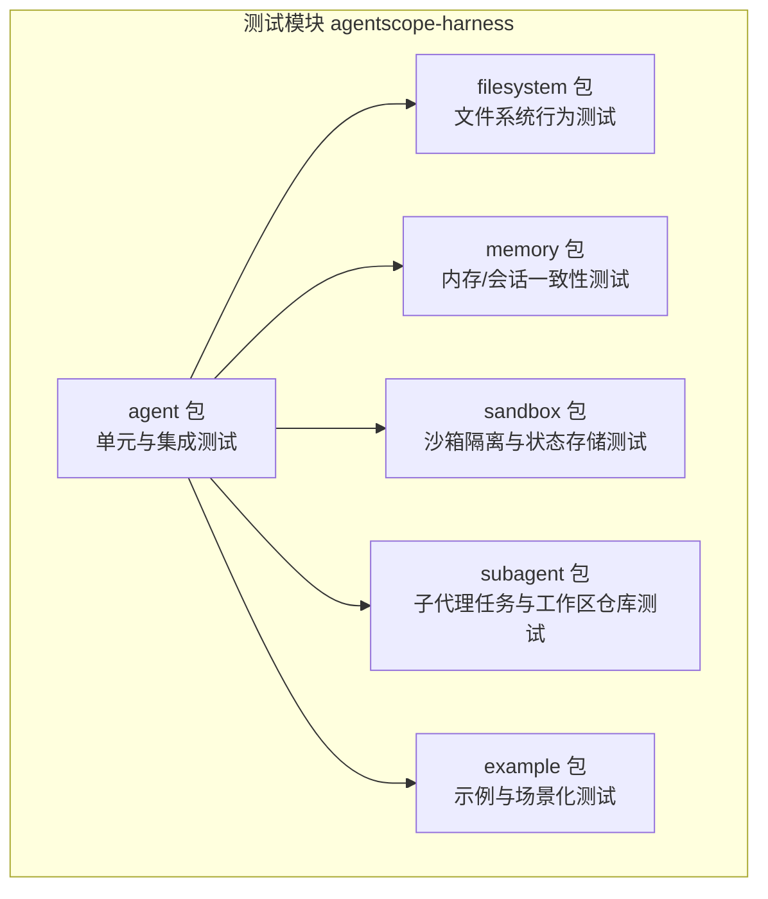
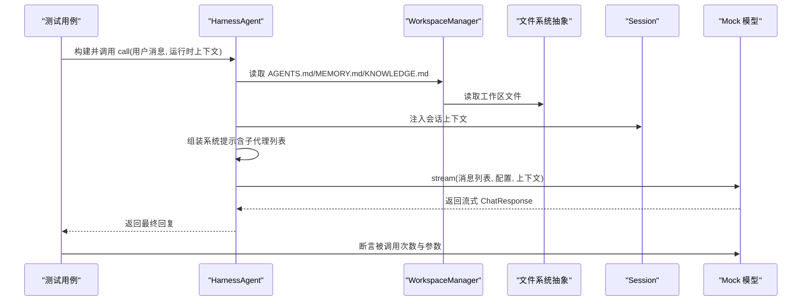
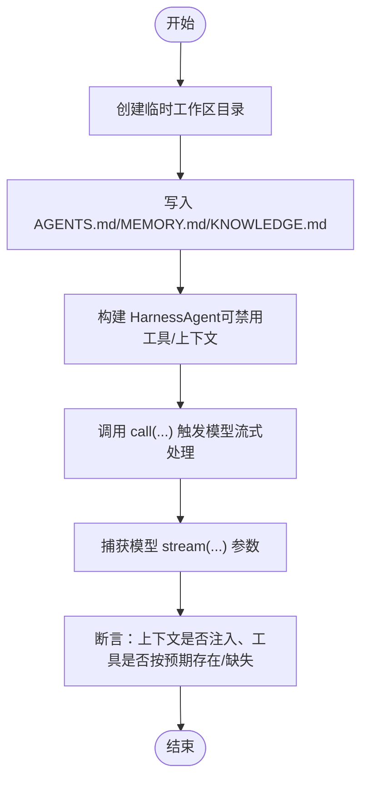
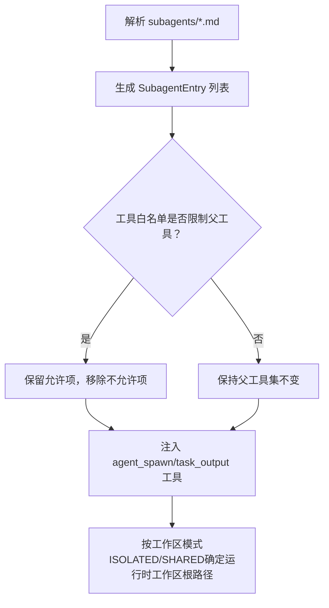
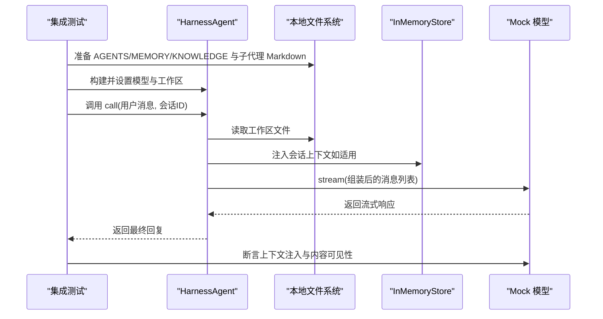
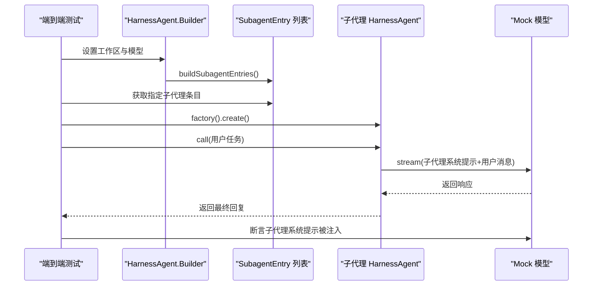
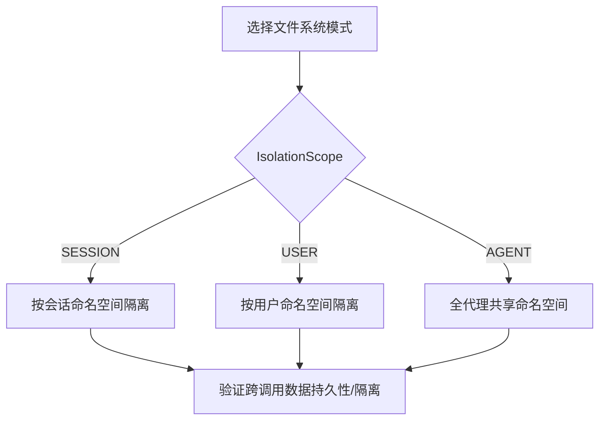
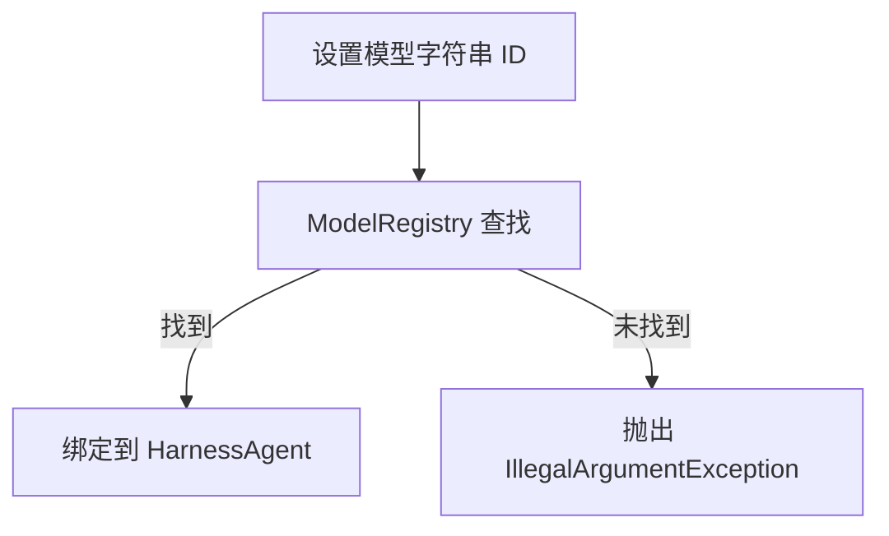
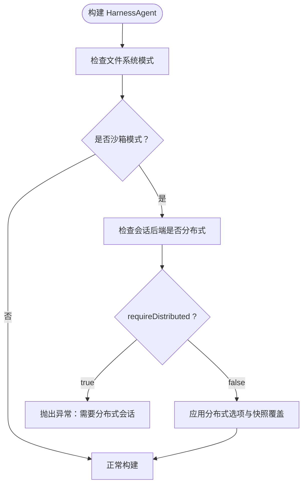
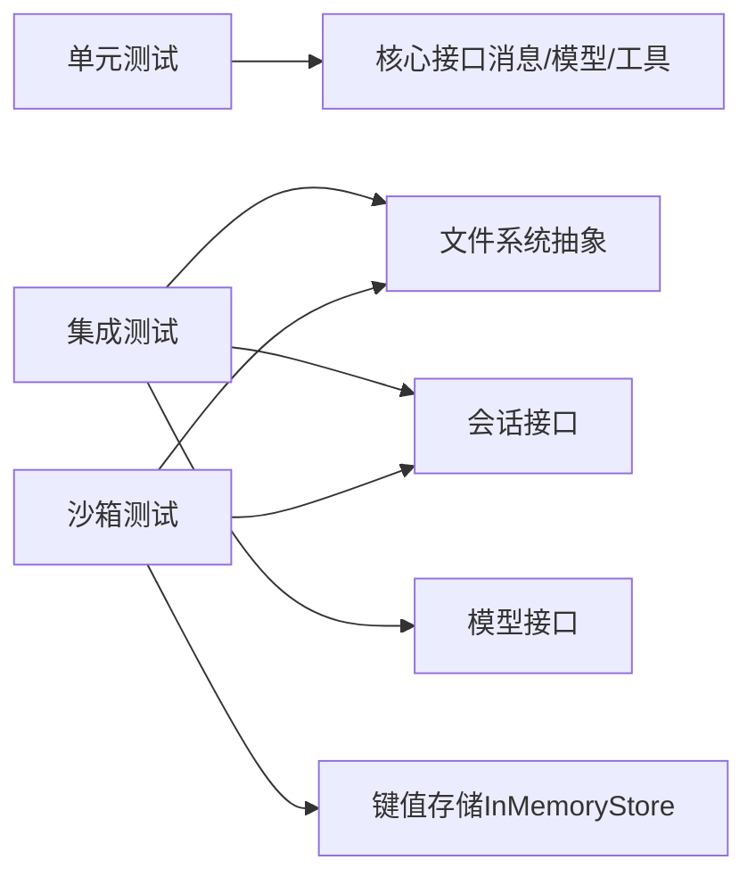

# 测试框架

<cite>
**本文引用的文件**
- [HarnessAgentTest.java](file://agentscope-harness/src/test/java/io/agentscope/harness/agent/HarnessAgentTest.java)
- [HarnessAgentIntegrationExampleTest.java](file://agentscope-harness/src/test/java/io/agentscope/harness/agent/HarnessAgentIntegrationExampleTest.java)
- [HarnessAgentModelStringTest.java](file://agentscope-harness/src/test/java/io/agentscope/harness/agent/HarnessAgentModelStringTest.java)
- [HarnessAgentDistributedSandboxTest.java](file://agentscope-harness/src/test/java/io/agentscope/harness/agent/HarnessAgentDistributedSandboxTest.java)
- [SandboxFilesystemIsolationScopeExampleTest.java](file://agentscope-harness/src/test/java/io/agentscope/harness/agent/example/SandboxFilesystemIsolationScopeExampleTest.java)
- [RemoteFilesystemIsolationScopeExampleTest.java](file://agentscope-harness/src/test/java/io/agentscope/harness/agent/example/RemoteFilesystemIsolationScopeExampleTest.java)
- [FilesystemGlobTest.java](file://agentscope-harness/src/test/java/io/agentscope/harness/agent/filesystem/FilesystemGlobTest.java)
</cite>

## 目录
1. [引言](#引言)
2. [项目结构](#项目结构)
3. [核心组件](#核心组件)
4. [架构总览](#架构总览)
5. [详细组件分析](#详细组件分析)
6. [依赖分析](#依赖分析)
7. [性能考虑](#性能考虑)
8. [故障排查指南](#故障排查指南)
9. [结论](#结论)
10. [附录](#附录)

## 引言
本文件面向 AgentScope Java 的测试框架与测试实践，系统性阐述 Harness 测试框架的设计理念、测试工具集与沙箱环境，覆盖单元测试、集成测试、端到端测试与性能相关关注点。文档以仓库中的测试用例为依据，结合代码级图示与流程图，帮助读者快速理解如何编写高质量的测试、如何使用 Mock 对象与断言策略、如何搭建测试数据与环境，并给出最佳实践建议（如测试覆盖率、持续集成与自动化测试）。

## 项目结构
本测试框架主要位于 agentscope-harness 模块的测试源码中，围绕 HarnessAgent 的工作区管理、子代理（Subagent）注册、文件系统与会话上下文注入、模型解析与调用、以及分布式沙箱模式等进行覆盖。测试组织遵循按功能域分层：agent、filesystem、memory、sandbox、subagent 等包下分别包含针对具体能力的单元与示例测试。

**章节来源**
- [HarnessAgentTest.java:1-759](file://agentscope-harness/src/test/java/io/agentscope/harness/agent/HarnessAgentTest.java#L1-L759)
- [HarnessAgentIntegrationExampleTest.java:1-264](file://agentscope-harness/src/test/java/io/agentscope/harness/agent/HarnessAgentIntegrationExampleTest.java#L1-L264)
- [HarnessAgentModelStringTest.java:1-130](file://agentscope-harness/src/test/java/io/agentscope/harness/agent/HarnessAgentModelStringTest.java#L1-L130)
- [HarnessAgentDistributedSandboxTest.java:1-206](file://agentscope-harness/src/test/java/io/agentscope/harness/agent/HarnessAgentDistributedSandboxTest.java#L1-L206)

## 核心组件
- HarnessAgent：测试的核心被测对象，负责工作区加载、上下文注入（会话、子代理、工作区文件）、工具集装配、模型解析与调用。
- 工作区管理器（WorkspaceManager）：负责 AGENTS.md、MEMORY.md、KNOWLEDGE.md 等文件的读写与注入。
- 文件系统抽象：本地文件系统、远程文件系统（键值存储）、沙箱文件系统（支持隔离作用域）。
- 子代理（Subagent）：通过 Markdown 声明注册，支持共享/隔离工作区模式与工具白名单继承。
- 模型解析：支持直接注入 Model 实例或通过字符串 ID 从全局注册表解析。
- 分布式沙箱：在容器/远程文件系统等隔离模式下，对会话后端与快照策略进行约束与校验。

**章节来源**
- [HarnessAgentTest.java:62-83](file://agentscope-harness/src/test/java/io/agentscope/harness/agent/HarnessAgentTest.java#L62-L83)
- [HarnessAgentIntegrationExampleTest.java:78-170](file://agentscope-harness/src/test/java/io/agentscope/harness/agent/HarnessAgentIntegrationExampleTest.java#L78-L170)
- [HarnessAgentModelStringTest.java:57-114](file://agentscope-harness/src/test/java/io/agentscope/harness/agent/HarnessAgentModelStringTest.java#L57-L114)
- [HarnessAgentDistributedSandboxTest.java:47-151](file://agentscope-harness/src/test/java/io/agentscope/harness/agent/HarnessAgentDistributedSandboxTest.java#L47-L151)

## 架构总览
下图展示了测试用例所覆盖的关键交互：HarnessAgent 在一次对话中如何组装消息列表（含会话上下文、工作区内容、子代理信息），并通过 Mock 模型进行流式响应捕获与断言。

**图表来源**
- [HarnessAgentIntegrationExampleTest.java:138-170](file://agentscope-harness/src/test/java/io/agentscope/harness/agent/HarnessAgentIntegrationExampleTest.java#L138-L170)
- [HarnessAgentTest.java:188-230](file://agentscope-harness/src/test/java/io/agentscope/harness/agent/HarnessAgentTest.java#L188-L230)

**章节来源**
- [HarnessAgentIntegrationExampleTest.java:78-170](file://agentscope-harness/src/test/java/io/agentscope/harness/agent/HarnessAgentIntegrationExampleTest.java#L78-L170)
- [HarnessAgentTest.java:188-230](file://agentscope-harness/src/test/java/io/agentscope/harness/agent/HarnessAgentTest.java#L188-L230)

## 详细组件分析

### 单元测试：工作区与上下文注入
- AGENTS.md 可通过工作区管理器读取并在模型输入中注入；禁用工作区上下文钩子后，模型输入不应包含该内容。
- MEMORY.md 与 KNOWLEDGE.md 被正确注入到相应上下文块中。
- 工具集可按需禁用：禁用内存/会话工具、文件系统工具、Shell 工具等，确保最小权限与安全边界。

**图表来源**
- [HarnessAgentTest.java:66-83](file://agentscope-harness/src/test/java/io/agentscope/harness/agent/HarnessAgentTest.java#L66-L83)
- [HarnessAgentTest.java:170-197](file://agentscope-harness/src/test/java/io/agentscope/harness/agent/HarnessAgentTest.java#L170-L197)
- [HarnessAgentTest.java:200-230](file://agentscope-harness/src/test/java/io/agentscope/harness/agent/HarnessAgentTest.java#L200-L230)

**章节来源**
- [HarnessAgentTest.java:66-105](file://agentscope-harness/src/test/java/io/agentscope/harness/agent/HarnessAgentTest.java#L66-L105)
- [HarnessAgentTest.java:170-230](file://agentscope-harness/src/test/java/io/agentscope/harness/agent/HarnessAgentTest.java#L170-L230)

### 单元测试：子代理声明与工具继承
- 支持从 subagents 目录下的 Markdown 文件解析子代理声明，生成工具入口（spawn、task_output）。
- 工具白名单仅影响父工具集的继承，不改变子代理本地工具（如文件系统工具、内存工具）。
- 决策表覆盖五种工作区解析路径：ISOLATED+有/无路径、SHARED+有/无路径、内置 general-purpose。

**图表来源**
- [HarnessAgentTest.java:233-287](file://agentscope-harness/src/test/java/io/agentscope/harness/agent/HarnessAgentTest.java#L233-L287)
- [HarnessAgentTest.java:634-681](file://agentscope-harness/src/test/java/io/agentscope/harness/agent/HarnessAgentTest.java#L634-L681)
- [HarnessAgentTest.java:357-518](file://agentscope-harness/src/test/java/io/agentscope/harness/agent/HarnessAgentTest.java#L357-L518)

**章节来源**
- [HarnessAgentTest.java:233-287](file://agentscope-harness/src/test/java/io/agentscope/harness/agent/HarnessAgentTest.java#L233-L287)
- [HarnessAgentTest.java:634-681](file://agentscope-harness/src/test/java/io/agentscope/harness/agent/HarnessAgentTest.java#L634-L681)
- [HarnessAgentTest.java:357-518](file://agentscope-harness/src/test/java/io/agentscope/harness/agent/HarnessAgentTest.java#L357-L518)

### 集成测试：完整工作区与端到端路径
- 示例测试构建真实的工作区布局（AGENTS.md、MEMORY.md、knowledge/KNOWLEDGE.md、subagents/*），验证一次对话中会话上下文、子代理列表、工作区内容均被注入到模型输入。
- 通过捕获模型的 stream 调用参数，断言包含特定上下文标记与内容片段。

**图表来源**
- [HarnessAgentIntegrationExampleTest.java:78-170](file://agentscope-harness/src/test/java/io/agentscope/harness/agent/HarnessAgentIntegrationExampleTest.java#L78-L170)

**章节来源**
- [HarnessAgentIntegrationExampleTest.java:78-170](file://agentscope-harness/src/test/java/io/agentscope/harness/agent/HarnessAgentIntegrationExampleTest.java#L78-L170)

### 端到端测试：子代理工厂与委托执行
- 通过解析 Markdown 子代理声明，获取 SubagentEntry 并创建子代理实例，断言其名称与系统提示来自声明。
- 子代理在独立上下文中接收消息并返回响应，验证委托链路完整。

**图表来源**
- [HarnessAgentIntegrationExampleTest.java:178-237](file://agentscope-harness/src/test/java/io/agentscope/harness/agent/HarnessAgentIntegrationExampleTest.java#L178-L237)

**章节来源**
- [HarnessAgentIntegrationExampleTest.java:178-237](file://agentscope-harness/src/test/java/io/agentscope/harness/agent/HarnessAgentIntegrationExampleTest.java#L178-L237)

### 性能测试与流式处理
- 流式响应通过 Reactor Flux 进行模拟，测试通过断言模型被调用至少一次来验证处理链路。
- 在示例测试中，通过捕获所有消息片段并拼接，验证上下文注入的完整性，间接反映消息组装与传递的效率。

**章节来源**
- [HarnessAgentIntegrationExampleTest.java:138-170](file://agentscope-harness/src/test/java/io/agentscope/harness/agent/HarnessAgentIntegrationExampleTest.java#L138-L170)
- [HarnessAgentTest.java:188-230](file://agentscope-harness/src/test/java/io/agentscope/harness/agent/HarnessAgentTest.java#L188-L230)

### 沙箱与隔离：本地/远程文件系统
- 本地沙箱文件系统：通过 IsolationScope 控制会话/用户/代理级别的隔离，统计创建与恢复次数验证行为。
- 远程文件系统：基于键值存储的命名空间路由，按 SESSION/USER/AGENT 作用域隔离数据可见性。
- 文件系统通配符 glob 行为在本地与远程实现中均得到验证。

**图表来源**
- [SandboxFilesystemIsolationScopeExampleTest.java:82-141](file://agentscope-harness/src/test/java/io/agentscope/harness/agent/example/SandboxFilesystemIsolationScopeExampleTest.java#L82-L141)
- [RemoteFilesystemIsolationScopeExampleTest.java:91-150](file://agentscope-harness/src/test/java/io/agentscope/harness/agent/example/RemoteFilesystemIsolationScopeExampleTest.java#L91-L150)

**章节来源**
- [SandboxFilesystemIsolationScopeExampleTest.java:82-141](file://agentscope-harness/src/test/java/io/agentscope/harness/agent/example/SandboxFilesystemIsolationScopeExampleTest.java#L82-L141)
- [RemoteFilesystemIsolationScopeExampleTest.java:91-150](file://agentscope-harness/src/test/java/io/agentscope/harness/agent/example/RemoteFilesystemIsolationScopeExampleTest.java#L91-L150)
- [FilesystemGlobTest.java:40-78](file://agentscope-harness/src/test/java/io/agentscope/harness/agent/filesystem/FilesystemGlobTest.java#L40-L78)

### 模型解析与注册表
- 支持通过字符串 ID 从全局模型注册表解析模型实例；未知 ID 将抛出异常，确保显式配置与可追踪性。
- 子代理声明中的模型字段同样遵循默认解析器逻辑。

**图表来源**
- [HarnessAgentModelStringTest.java:57-84](file://agentscope-harness/src/test/java/io/agentscope/harness/agent/HarnessAgentModelStringTest.java#L57-L84)
- [HarnessAgentModelStringTest.java:87-114](file://agentscope-harness/src/test/java/io/agentscope/harness/agent/HarnessAgentModelStringTest.java#L87-L114)

**章节来源**
- [HarnessAgentModelStringTest.java:57-84](file://agentscope-harness/src/test/java/io/agentscope/harness/agent/HarnessAgentModelStringTest.java#L57-L84)
- [HarnessAgentModelStringTest.java:87-114](file://agentscope-harness/src/test/java/io/agentscope/harness/agent/HarnessAgentModelStringTest.java#L87-L114)

### 分布式沙箱约束与快照
- 在分布式沙箱模式下，若未启用分布式会话后端或未满足分布式要求，构建阶段将失败，避免运行期错误。
- 可通过显式选项开启分布式模式并应用本地快照策略覆盖。

**图表来源**
- [HarnessAgentDistributedSandboxTest.java:47-151](file://agentscope-harness/src/test/java/io/agentscope/harness/agent/HarnessAgentDistributedSandboxTest.java#L47-L151)

**章节来源**
- [HarnessAgentDistributedSandboxTest.java:47-151](file://agentscope-harness/src/test/java/io/agentscope/harness/agent/HarnessAgentDistributedSandboxTest.java#L47-L151)

## 依赖分析
- 测试对核心模块的依赖集中在以下方面：
  - 消息与模型接口：用于构造用户消息、模拟模型流式响应。
  - 工作区常量与工具：用于定位 AGENTS.md、MEMORY.md、知识库等文件。
  - 文件系统与会话：用于注入上下文与验证隔离行为。
  - 子代理与工具：用于验证工具继承与白名单策略。
- 测试耦合度低，通过 Mock 与临时文件系统降低外部依赖，提升可重复性与稳定性。

**图表来源**
- [HarnessAgentTest.java:29-47](file://agentscope-harness/src/test/java/io/agentscope/harness/agent/HarnessAgentTest.java#L29-L47)
- [HarnessAgentIntegrationExampleTest.java:28-36](file://agentscope-harness/src/test/java/io/agentscope/harness/agent/HarnessAgentIntegrationExampleTest.java#L28-L36)
- [RemoteFilesystemIsolationScopeExampleTest.java:31-35](file://agentscope-harness/src/test/java/io/agentscope/harness/agent/example/RemoteFilesystemIsolationScopeExampleTest.java#L31-L35)

**章节来源**
- [HarnessAgentTest.java:29-47](file://agentscope-harness/src/test/java/io/agentscope/harness/agent/HarnessAgentTest.java#L29-L47)
- [HarnessAgentIntegrationExampleTest.java:28-36](file://agentscope-harness/src/test/java/io/agentscope/harness/agent/HarnessAgentIntegrationExampleTest.java#L28-L36)
- [RemoteFilesystemIsolationScopeExampleTest.java:31-35](file://agentscope-harness/src/test/java/io/agentscope/harness/agent/example/RemoteFilesystemIsolationScopeExampleTest.java#L31-L35)

## 性能考虑
- 流式响应与消息拼接：通过捕获所有消息片段并一次性拼接，减少多次 IO 与字符串操作开销。
- 临时文件系统：在测试中优先使用本地临时目录，避免磁盘抖动；远程文件系统测试使用内存存储，降低网络与序列化成本。
- 沙箱隔离统计：通过计数器统计创建/恢复次数，有助于评估隔离策略对性能的影响（例如频繁重建 vs 复用）。

**章节来源**
- [HarnessAgentIntegrationExampleTest.java:138-170](file://agentscope-harness/src/test/java/io/agentscope/harness/agent/HarnessAgentIntegrationExampleTest.java#L138-L170)
- [SandboxFilesystemIsolationScopeExampleTest.java:103-110](file://agentscope-harness/src/test/java/io/agentscope/harness/agent/example/SandboxFilesystemIsolationScopeExampleTest.java#L103-L110)

## 故障排查指南
- 构建失败（分布式沙箱）：当使用分布式沙箱但未提供分布式会话后端或未显式允许本地会话时，构建会失败。请确认会话后端类型与分布式选项配置。
- 工具缺失：若发现期望工具不存在，请检查是否误用了禁用工具的开关或工具白名单策略。
- 上下文未注入：若模型输入缺少工作区/会话/子代理上下文，请核对工作区文件是否存在、注入钩子是否启用、以及调用时是否传入了会话 ID。
- 文件系统行为异常：若 glob 或文件读写不符合预期，检查文件系统实现（本地/远程/沙箱）与隔离作用域配置。

**章节来源**
- [HarnessAgentDistributedSandboxTest.java:47-151](file://agentscope-harness/src/test/java/io/agentscope/harness/agent/HarnessAgentDistributedSandboxTest.java#L47-L151)
- [HarnessAgentTest.java:170-230](file://agentscope-harness/src/test/java/io/agentscope/harness/agent/HarnessAgentTest.java#L170-L230)
- [FilesystemGlobTest.java:40-78](file://agentscope-harness/src/test/java/io/agentscope/harness/agent/filesystem/FilesystemGlobTest.java#L40-L78)

## 结论
本测试框架通过单元、集成与示例测试，全面覆盖了 HarnessAgent 的工作区管理、上下文注入、子代理机制、模型解析与分布式沙箱等关键能力。借助 Mock 对象与临时文件系统，测试具备高可重复性与可维护性；通过断言策略与流程图化分析，能够有效定位问题并指导优化。建议在持续集成中引入标签过滤（如 integration）与并行执行策略，进一步提升测试效率与覆盖率。

## 附录
- 测试覆盖率：建议在 CI 中启用覆盖率报告，重点覆盖工作区注入、工具继承、隔离作用域与模型解析路径。
- 持续集成：使用标签（@Tag）区分单元与集成测试，配合并行执行与缓存策略加速流水线。
- 自动化测试：将示例测试作为回归用例纳入 nightly 跑批，确保新版本不影响现有行为。
- 生产回归：在发布前运行分布式沙箱与远程文件系统相关测试，确保隔离与一致性策略符合预期。