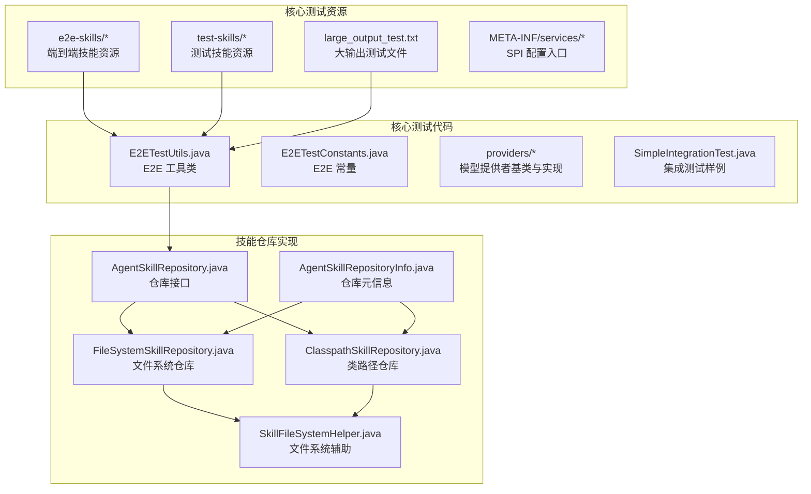
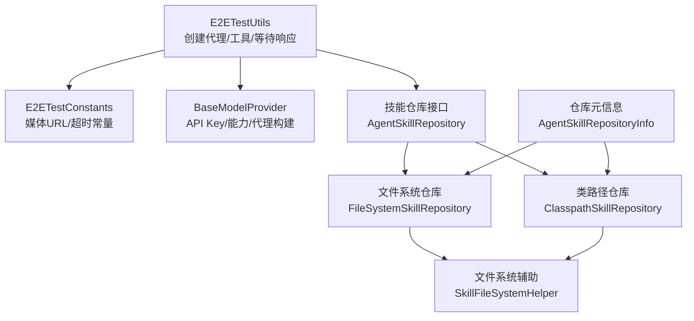
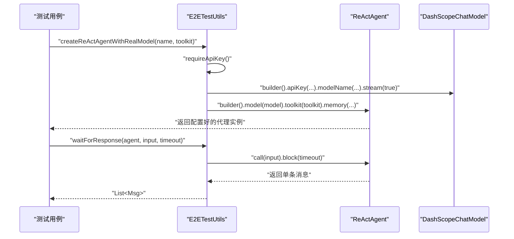
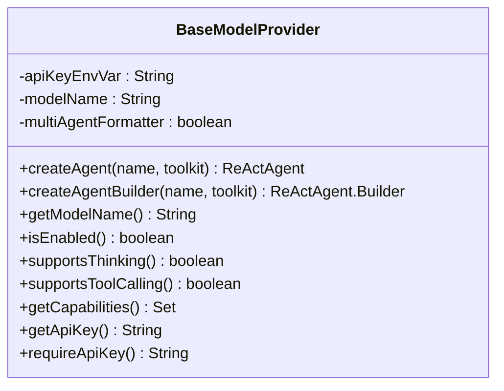
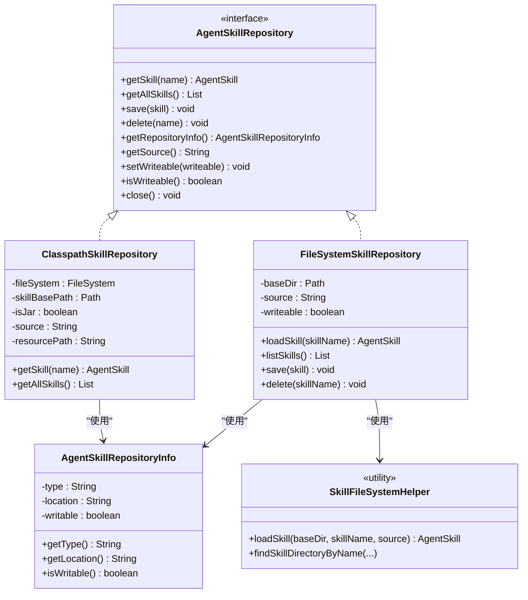
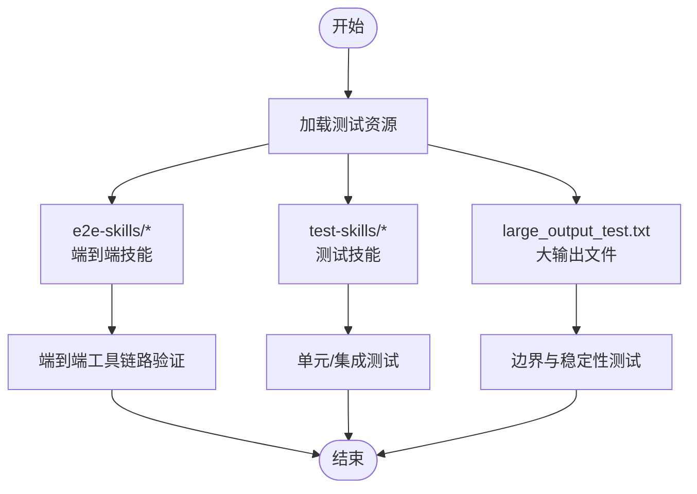
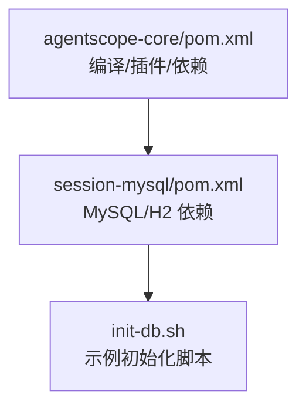

# 测试配置与工具

<cite>
**本文引用的文件**
- [agentscope-core/pom.xml](file://agentscope-core/pom.xml)
- [agentscope-core/src/test/java/io/agentscope/core/SimpleIntegrationTest.java](file://agentscope-core/src/test/java/io/agentscope/core/SimpleIntegrationTest.java)
- [agentscope-core/src/test/java/io/agentscope/core/e2e/E2ETestConstants.java](file://agentscope-core/src/test/java/io/agentscope/core/e2e/E2ETestConstants.java)
- [agentscope-core/src/test/java/io/agentscope/core/e2e/E2ETestUtils.java](file://agentscope-core/src/test/java/io/agentscope/core/e2e/E2ETestUtils.java)
- [agentscope-core/src/test/java/io/agentscope/core/e2e/providers/BaseModelProvider.java](file://agentscope-core/src/test/java/io/agentscope/core/e2e/providers/BaseModelProvider.java)
- [agentscope-core/src/test/resources/large_output_test.txt](file://agentscope-core/src/test/resources/large_output_test.txt)
- [agentscope-core/src/test/resources/e2e-skills/data-report/SKILL.md](file://agentscope-core/src/test/resources/e2e-skills/data-report/SKILL.md)
- [agentscope-core/src/test/resources/test-skills/calculation-skill/SKILL.md](file://agentscope-core/src/test/resources/test-skills/calculation-skill/SKILL.md)
- [agentscope-core/src/main/java/io/agentscope/core/skill/repository/AgentSkillRepository.java](file://agentscope-core/src/main/java/io/agentscope/core/skill/repository/AgentSkillRepository.java)
- [agentscope-core/src/main/java/io/agentscope/core/skill/repository/FileSystemSkillRepository.java](file://agentscope-core/src/main/java/io/agentscope/core/skill/repository/FileSystemSkillRepository.java)
- [agentscope-core/src/main/java/io/agentscope/core/skill/repository/ClasspathSkillRepository.java](file://agentscope-core/src/main/java/io/agentscope/core/skill/repository/ClasspathSkillRepository.java)
- [agentscope-core/src/main/java/io/agentscope/core/skill/repository/AgentSkillRepositoryInfo.java](file://agentscope-core/src/main/java/io/agentscope/core/skill/repository/AgentSkillRepositoryInfo.java)
- [agentscope-core/src/main/java/io/agentscope/core/skill/util/SkillFileSystemHelper.java](file://agentscope-core/src/main/java/io/agentscope/core/skill/util/SkillFileSystemHelper.java)
- [agentscope-extensions/agentscope-extensions-session-mysql/pom.xml](file://agentscope-extensions/agentscope-extensions-session-mysql/pom.xml)
- [agentscope-examples/boba-tea-shop/mysql-image/init-db.sh](file://agentscope-examples/boba-tea-shop/mysql-image/init-db.sh)
</cite>

## 目录
1. [简介](#简介)
2. [项目结构](#项目结构)
3. [核心组件](#核心组件)
4. [架构总览](#架构总览)
5. [详细组件分析](#详细组件分析)
6. [依赖分析](#依赖分析)
7. [性能考虑](#性能考虑)
8. [故障排查指南](#故障排查指南)
9. [结论](#结论)
10. [附录](#附录)

## 简介
本文件面向 AgentScope Java 的测试配置与工具，系统性梳理测试配置文件结构、测试工具集功能、测试资源组织方式、测试环境变量与外部依赖（数据库、缓存）的管理，并提供测试数据准备、环境搭建与结果收集的最佳实践。内容覆盖端到端（E2E）测试框架、示例工具支持、服务提供者接口（SPI）风格的模型提供者配置、以及测试技能仓库（文件系统、类路径、MySQL 等）的使用方法。

## 项目结构
测试相关的结构主要集中在 agentscope-core 模块的 test 资源与测试代码中，同时包含扩展模块对数据库测试的依赖与示例工程中的初始化脚本。

图表来源
- [agentscope-core/src/test/java/io/agentscope/core/e2e/E2ETestUtils.java:37-190](file://agentscope-core/src/test/java/io/agentscope/core/e2e/E2ETestUtils.java#L37-L190)
- [agentscope-core/src/test/java/io/agentscope/core/e2e/E2ETestConstants.java:23-61](file://agentscope-core/src/test/java/io/agentscope/core/e2e/E2ETestConstants.java#L23-L61)
- [agentscope-core/src/test/java/io/agentscope/core/e2e/providers/BaseModelProvider.java:51-197](file://agentscope-core/src/test/java/io/agentscope/core/e2e/providers/BaseModelProvider.java#L51-L197)
- [agentscope-core/src/test/java/io/agentscope/core/SimpleIntegrationTest.java:26-56](file://agentscope-core/src/test/java/io/agentscope/core/SimpleIntegrationTest.java#L26-L56)
- [agentscope-core/src/main/java/io/agentscope/core/skill/repository/AgentSkillRepository.java:34-132](file://agentscope-core/src/main/java/io/agentscope/core/skill/repository/AgentSkillRepository.java#L34-L132)
- [agentscope-core/src/main/java/io/agentscope/core/skill/repository/FileSystemSkillRepository.java:51-60](file://agentscope-core/src/main/java/io/agentscope/core/skill/repository/FileSystemSkillRepository.java#L51-L60)
- [agentscope-core/src/main/java/io/agentscope/core/skill/repository/ClasspathSkillRepository.java:113-137](file://agentscope-core/src/main/java/io/agentscope/core/skill/repository/ClasspathSkillRepository.java#L113-L137)
- [agentscope-core/src/main/java/io/agentscope/core/skill/repository/AgentSkillRepositoryInfo.java:42-98](file://agentscope-core/src/main/java/io/agentscope/core/skill/repository/AgentSkillRepositoryInfo.java#L42-L98)
- [agentscope-core/src/main/java/io/agentscope/core/skill/util/SkillFileSystemHelper.java:45-70](file://agentscope-core/src/main/java/io/agentscope/core/skill/util/SkillFileSystemHelper.java#L45-L70)

章节来源
- [agentscope-core/src/test/java/io/agentscope/core/e2e/E2ETestUtils.java:37-190](file://agentscope-core/src/test/java/io/agentscope/core/e2e/E2ETestUtils.java#L37-L190)
- [agentscope-core/src/test/java/io/agentscope/core/e2e/E2ETestConstants.java:23-61](file://agentscope-core/src/test/java/io/agentscope/core/e2e/E2ETestConstants.java#L23-L61)
- [agentscope-core/src/test/java/io/agentscope/core/e2e/providers/BaseModelProvider.java:51-197](file://agentscope-core/src/test/java/io/agentscope/core/e2e/providers/BaseModelProvider.java#L51-L197)
- [agentscope-core/src/test/java/io/agentscope/core/SimpleIntegrationTest.java:26-56](file://agentscope-core/src/test/java/io/agentscope/core/SimpleIntegrationTest.java#L26-L56)
- [agentscope-core/src/main/java/io/agentscope/core/skill/repository/AgentSkillRepository.java:34-132](file://agentscope-core/src/main/java/io/agentscope/core/skill/repository/AgentSkillRepository.java#L34-L132)
- [agentscope-core/src/main/java/io/agentscope/core/skill/repository/FileSystemSkillRepository.java:51-60](file://agentscope-core/src/main/java/io/agentscope/core/skill/repository/FileSystemSkillRepository.java#L51-L60)
- [agentscope-core/src/main/java/io/agentscope/core/skill/repository/ClasspathSkillRepository.java:113-137](file://agentscope-core/src/main/java/io/agentscope/core/skill/repository/ClasspathSkillRepository.java#L113-L137)
- [agentscope-core/src/main/java/io/agentscope/core/skill/repository/AgentSkillRepositoryInfo.java:42-98](file://agentscope-core/src/main/java/io/agentscope/core/skill/repository/AgentSkillRepositoryInfo.java#L42-L98)
- [agentscope-core/src/main/java/io/agentscope/core/skill/util/SkillFileSystemHelper.java:45-70](file://agentscope-core/src/main/java/io/agentscope/core/skill/util/SkillFileSystemHelper.java#L45-L70)

## 核心组件
- E2E 测试常量与工具：提供测试媒体资源地址、超时常量，以及创建真实模型代理、工具包、等待响应、内容校验等通用方法。
- 模型提供者基类：统一处理 API Key 获取与校验、能力声明（注解）、代理构建器创建、多智能体格式化器开关等。
- 技能仓库接口与实现：抽象技能持久化操作，支持文件系统、类路径、Git、MySQL 等多种后端；提供仓库元信息与文件系统辅助工具。
- 测试资源：端到端技能资源、测试技能资源、大输出测试文件，支撑不同场景的测试数据与脚本。
- 集成测试样例：演示内存操作等基础集成测试流程。

章节来源
- [agentscope-core/src/test/java/io/agentscope/core/e2e/E2ETestConstants.java:23-61](file://agentscope-core/src/test/java/io/agentscope/core/e2e/E2ETestConstants.java#L23-L61)
- [agentscope-core/src/test/java/io/agentscope/core/e2e/E2ETestUtils.java:37-190](file://agentscope-core/src/test/java/io/agentscope/core/e2e/E2ETestUtils.java#L37-L190)
- [agentscope-core/src/test/java/io/agentscope/core/e2e/providers/BaseModelProvider.java:51-197](file://agentscope-core/src/test/java/io/agentscope/core/e2e/providers/BaseModelProvider.java#L51-L197)
- [agentscope-core/src/main/java/io/agentscope/core/skill/repository/AgentSkillRepository.java:34-132](file://agentscope-core/src/main/java/io/agentscope/core/skill/repository/AgentSkillRepository.java#L34-L132)
- [agentscope-core/src/main/java/io/agentscope/core/skill/repository/FileSystemSkillRepository.java:51-60](file://agentscope-core/src/main/java/io/agentscope/core/skill/repository/FileSystemSkillRepository.java#L51-L60)
- [agentscope-core/src/main/java/io/agentscope/core/skill/repository/ClasspathSkillRepository.java:113-137](file://agentscope-core/src/main/java/io/agentscope/core/skill/repository/ClasspathSkillRepository.java#L113-L137)
- [agentscope-core/src/main/java/io/agentscope/core/skill/repository/AgentSkillRepositoryInfo.java:42-98](file://agentscope-core/src/main/java/io/agentscope/core/skill/repository/AgentSkillRepositoryInfo.java#L42-L98)
- [agentscope-core/src/main/java/io/agentscope/core/skill/util/SkillFileSystemHelper.java:45-70](file://agentscope-core/src/main/java/io/agentscope/core/skill/util/SkillFileSystemHelper.java#L45-L70)
- [agentscope-core/src/test/java/io/agentscope/core/SimpleIntegrationTest.java:26-56](file://agentscope-core/src/test/java/io/agentscope/core/SimpleIntegrationTest.java#L26-L56)

## 架构总览
下图展示测试配置与工具在整体中的位置与交互关系：测试代码通过工具类与常量访问测试资源，借助模型提供者基类创建代理，代理使用工具包与技能仓库完成任务；技能仓库可基于文件系统或类路径加载测试技能，也可通过扩展模块对接数据库。

图表来源
- [agentscope-core/src/test/java/io/agentscope/core/e2e/E2ETestUtils.java:37-190](file://agentscope-core/src/test/java/io/agentscope/core/e2e/E2ETestUtils.java#L37-L190)
- [agentscope-core/src/test/java/io/agentscope/core/e2e/E2ETestConstants.java:23-61](file://agentscope-core/src/test/java/io/agentscope/core/e2e/E2ETestConstants.java#L23-L61)
- [agentscope-core/src/test/java/io/agentscope/core/e2e/providers/BaseModelProvider.java:51-197](file://agentscope-core/src/test/java/io/agentscope/core/e2e/providers/BaseModelProvider.java#L51-L197)
- [agentscope-core/src/main/java/io/agentscope/core/skill/repository/AgentSkillRepository.java:34-132](file://agentscope-core/src/main/java/io/agentscope/core/skill/repository/AgentSkillRepository.java#L34-L132)
- [agentscope-core/src/main/java/io/agentscope/core/skill/repository/FileSystemSkillRepository.java:51-60](file://agentscope-core/src/main/java/io/agentscope/core/skill/repository/FileSystemSkillRepository.java#L51-L60)
- [agentscope-core/src/main/java/io/agentscope/core/skill/repository/ClasspathSkillRepository.java:113-137](file://agentscope-core/src/main/java/io/agentscope/core/skill/repository/ClasspathSkillRepository.java#L113-L137)
- [agentscope-core/src/main/java/io/agentscope/core/skill/repository/AgentSkillRepositoryInfo.java:42-98](file://agentscope-core/src/main/java/io/agentscope/core/skill/repository/AgentSkillRepositoryInfo.java#L42-L98)
- [agentscope-core/src/main/java/io/agentscope/core/skill/util/SkillFileSystemHelper.java:45-70](file://agentscope-core/src/main/java/io/agentscope/core/skill/util/SkillFileSystemHelper.java#L45-L70)

## 详细组件分析

### E2E 测试常量与工具
- 常量：提供测试图片、视频的远程地址与统一超时时间（默认、短、长），便于跨测试用例复用。
- 工具：
  - 创建带真实模型的 ReAct 代理（从环境变量读取 API Key，校验必填）。
  - 创建测试工具包（数学与字符串工具），用于验证工具调用链路。
  - 等待代理响应并阻塞至超时，返回消息列表。
  - 响应内容校验：大小写不敏感包含判断、有意义内容长度判断（>5 字符）。

图表来源
- [agentscope-core/src/test/java/io/agentscope/core/e2e/E2ETestUtils.java:50-94](file://agentscope-core/src/test/java/io/agentscope/core/e2e/E2ETestUtils.java#L50-L94)

章节来源
- [agentscope-core/src/test/java/io/agentscope/core/e2e/E2ETestConstants.java:23-61](file://agentscope-core/src/test/java/io/agentscope/core/e2e/E2ETestConstants.java#L23-L61)
- [agentscope-core/src/test/java/io/agentscope/core/e2e/E2ETestUtils.java:50-134](file://agentscope-core/src/test/java/io/agentscope/core/e2e/E2ETestUtils.java#L50-L134)

### 模型提供者接口与 SPI 配置
- 基类职责：统一处理 API Key 的环境变量/系统属性读取与校验、能力声明（注解解析）、代理构建器创建、是否启用多智能体格式化器等。
- 能力声明：通过注解声明模型能力集合（如思维链、工具调用、多智能体格式化器），未标注时回退为基础能力。
- 启用条件：若未配置 API Key，则判定为禁用；启用时方可创建代理。

图表来源
- [agentscope-core/src/test/java/io/agentscope/core/e2e/providers/BaseModelProvider.java:51-197](file://agentscope-core/src/test/java/io/agentscope/core/e2e/providers/BaseModelProvider.java#L51-L197)

章节来源
- [agentscope-core/src/test/java/io/agentscope/core/e2e/providers/BaseModelProvider.java:51-197](file://agentscope-core/src/test/java/io/agentscope/core/e2e/providers/BaseModelProvider.java#L51-L197)

### 技能仓库接口与实现
- 接口契约：定义按名称获取技能、列出所有技能、保存/删除、设置可写性、获取仓库信息与来源标识等。
- 文件系统仓库：基于本地目录结构加载技能，每个技能目录包含 SKILL.md 与可选的 references/examples/scripts 等子目录。
- 类路径仓库：从资源路径加载技能，支持自定义 ClassLoader 与资源路径，适用于打包在 JAR 中的测试技能。
- 仓库元信息：记录仓库类型、位置与可写性，便于统一管理与诊断。
- 文件系统辅助：提供按名称查找技能目录、从目录加载技能等通用方法，供多种仓库共享。

图表来源
- [agentscope-core/src/main/java/io/agentscope/core/skill/repository/AgentSkillRepository.java:34-132](file://agentscope-core/src/main/java/io/agentscope/core/skill/repository/AgentSkillRepository.java#L34-L132)
- [agentscope-core/src/main/java/io/agentscope/core/skill/repository/FileSystemSkillRepository.java:51-60](file://agentscope-core/src/main/java/io/agentscope/core/skill/repository/FileSystemSkillRepository.java#L51-L60)
- [agentscope-core/src/main/java/io/agentscope/core/skill/repository/ClasspathSkillRepository.java:113-137](file://agentscope-core/src/main/java/io/agentscope/core/skill/repository/ClasspathSkillRepository.java#L113-L137)
- [agentscope-core/src/main/java/io/agentscope/core/skill/repository/AgentSkillRepositoryInfo.java:42-98](file://agentscope-core/src/main/java/io/agentscope/core/skill/repository/AgentSkillRepositoryInfo.java#L42-L98)
- [agentscope-core/src/main/java/io/agentscope/core/skill/util/SkillFileSystemHelper.java:45-70](file://agentscope-core/src/main/java/io/agentscope/core/skill/util/SkillFileSystemHelper.java#L45-L70)

章节来源
- [agentscope-core/src/main/java/io/agentscope/core/skill/repository/AgentSkillRepository.java:34-132](file://agentscope-core/src/main/java/io/agentscope/core/skill/repository/AgentSkillRepository.java#L34-L132)
- [agentscope-core/src/main/java/io/agentscope/core/skill/repository/FileSystemSkillRepository.java:51-60](file://agentscope-core/src/main/java/io/agentscope/core/skill/repository/FileSystemSkillRepository.java#L51-L60)
- [agentscope-core/src/main/java/io/agentscope/core/skill/repository/ClasspathSkillRepository.java:113-137](file://agentscope-core/src/main/java/io/agentscope/core/skill/repository/ClasspathSkillRepository.java#L113-L137)
- [agentscope-core/src/main/java/io/agentscope/core/skill/repository/AgentSkillRepositoryInfo.java:42-98](file://agentscope-core/src/main/java/io/agentscope/core/skill/repository/AgentSkillRepositoryInfo.java#L42-L98)
- [agentscope-core/src/main/java/io/agentscope/core/skill/util/SkillFileSystemHelper.java:45-70](file://agentscope-core/src/main/java/io/agentscope/core/skill/util/SkillFileSystemHelper.java#L45-L70)

### 测试资源组织与使用
- e2e 技能资源：位于 e2e-skills 下，每个技能包含 SKILL.md 与脚本目录，用于端到端场景下的工具链路验证。
- 测试技能资源：位于 test-skills 下，包含计算与写作等技能示例，便于单元与集成测试。
- 大输出测试文件：large_output_test.txt 用于触发管道缓冲区与死锁检测等边界场景。
- 示例技能文件：SKILL.md 展示了技能元数据（名称、描述）与能力说明。

图表来源
- [agentscope-core/src/test/resources/e2e-skills/data-report/SKILL.md](file://agentscope-core/src/test/resources/e2e-skills/data-report/SKILL.md)
- [agentscope-core/src/test/resources/test-skills/calculation-skill/SKILL.md](file://agentscope-core/src/test/resources/test-skills/calculation-skill/SKILL.md)
- [agentscope-core/src/test/resources/large_output_test.txt:1-100](file://agentscope-core/src/test/resources/large_output_test.txt#L1-L100)

章节来源
- [agentscope-core/src/test/resources/e2e-skills/data-report/SKILL.md](file://agentscope-core/src/test/resources/e2e-skills/data-report/SKILL.md)
- [agentscope-core/src/test/resources/test-skills/calculation-skill/SKILL.md](file://agentscope-core/src/test/resources/test-skills/calculation-skill/SKILL.md)
- [agentscope-core/src/test/resources/large_output_test.txt:1-100](file://agentscope-core/src/test/resources/large_output_test.txt#L1-L100)

### 集成测试样例
- 内存操作测试：创建内存式记忆体，添加两条消息，断言数量；随后清空并再次断言为空。
- 适用场景：验证消息存储与清理逻辑，作为更复杂测试的前置步骤。

章节来源
- [agentscope-core/src/test/java/io/agentscope/core/SimpleIntegrationTest.java:26-56](file://agentscope-core/src/test/java/io/agentscope/core/SimpleIntegrationTest.java#L26-L56)

## 依赖分析
- Maven 与插件：核心模块定义了编译版本、Surefire 插件版本、JVM 堆大小参数等，确保测试执行稳定。
- 数据库与缓存：扩展模块引入 MySQL 与 H2（CI 内存数据库）依赖，支撑会话与技能仓库的数据库测试。
- 示例工程：Boba Tea Shop 提供 MySQL 初始化脚本，演示数据库初始化流程与环境变量注入。

图表来源
- [agentscope-core/pom.xml:33-49](file://agentscope-core/pom.xml#L33-L49)
- [agentscope-extensions/agentscope-extensions-session-mysql/pom.xml:33-55](file://agentscope-extensions/agentscope-extensions-session-mysql/pom.xml#L33-L55)
- [agentscope-examples/boba-tea-shop/mysql-image/init-db.sh:1-28](file://agentscope-examples/boba-tea-shop/mysql-image/init-db.sh#L1-L28)

章节来源
- [agentscope-core/pom.xml:33-49](file://agentscope-core/pom.xml#L33-L49)
- [agentscope-extensions/agentscope-extensions-session-mysql/pom.xml:33-55](file://agentscope-extensions/agentscope-extensions-session-mysql/pom.xml#L33-L55)
- [agentscope-examples/boba-tea-shop/mysql-image/init-db.sh:1-28](file://agentscope-examples/boba-tea-shop/mysql-image/init-db.sh#L1-L28)

## 性能考虑
- 超时策略：E2E 常量提供默认、短、长三档超时，建议根据模型响应时间与网络状况选择合适值，避免测试抖动。
- 流式输出：创建代理时启用流式输出，有助于及时获取中间结果，提升测试反馈速度。
- 资源隔离：使用内存式记忆体与工具包，减少外部依赖带来的性能波动；在 CI 环境中优先使用 H2 等内存数据库。
- 大输出测试：利用大输出文件验证管道缓冲与死锁问题，提前发现潜在性能瓶颈。

## 故障排查指南
- API Key 缺失：模型提供者要求 API Key 必须配置，否则抛出异常；请检查环境变量或系统属性是否正确设置。
- 技能加载失败：文件系统仓库需确保 SKILL.md 存在且目录命名正确；类路径仓库需确认资源路径与打包方式一致。
- 数据库连接问题：扩展模块依赖 MySQL 与 H2，CI 环境中可直接使用 H2；生产环境需检查连接串、用户名与密码。
- 超时与死锁：结合 E2E 超时常量与大输出测试文件定位问题；必要时增加超时或优化工具链路。

章节来源
- [agentscope-core/src/test/java/io/agentscope/core/e2e/providers/BaseModelProvider.java:90-97](file://agentscope-core/src/test/java/io/agentscope/core/e2e/providers/BaseModelProvider.java#L90-L97)
- [agentscope-core/src/main/java/io/agentscope/core/skill/repository/FileSystemSkillRepository.java:51-60](file://agentscope-core/src/main/java/io/agentscope/core/skill/repository/FileSystemSkillRepository.java#L51-L60)
- [agentscope-core/src/main/java/io/agentscope/core/skill/repository/ClasspathSkillRepository.java:113-137](file://agentscope-core/src/main/java/io/agentscope/core/skill/repository/ClasspathSkillRepository.java#L113-L137)
- [agentscope-extensions/agentscope-extensions-session-mysql/pom.xml:33-55](file://agentscope-extensions/agentscope-extensions-session-mysql/pom.xml#L33-L55)
- [agentscope-core/src/test/resources/large_output_test.txt:1-100](file://agentscope-core/src/test/resources/large_output_test.txt#L1-L100)

## 结论
本文系统梳理了 AgentScope Java 的测试配置与工具，明确了 E2E 常量与工具、模型提供者接口、技能仓库接口与实现、测试资源组织方式，以及数据库与缓存的依赖与配置要点。通过统一的工具与规范，可以高效地准备测试数据、搭建测试环境并收集测试结果，保障多模型、多工具与多仓库场景下的稳定性与可维护性。

## 附录
- 最佳实践清单
  - 在 CI 环境中使用 H2 内存数据库替代真实 MySQL，减少部署复杂度。
  - 将 API Key 放置于受控的环境变量中，避免硬编码。
  - 使用 E2E 常量统一管理媒体资源与超时，保持测试一致性。
  - 对于大输出场景，结合大输出测试文件进行边界与稳定性验证。
  - 将测试技能与脚本放置于 test-skills 与 e2e-skills，遵循目录规范，便于维护与复用。