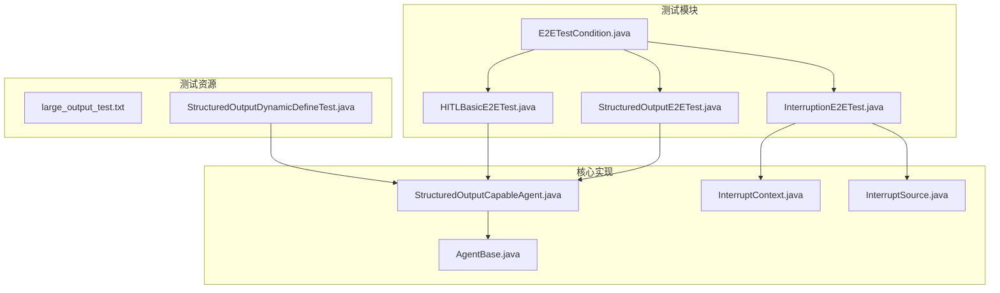
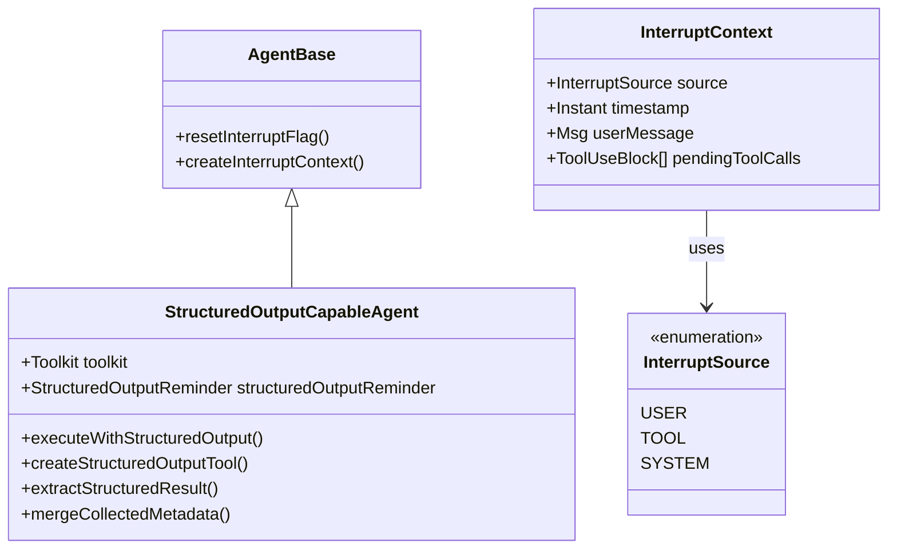
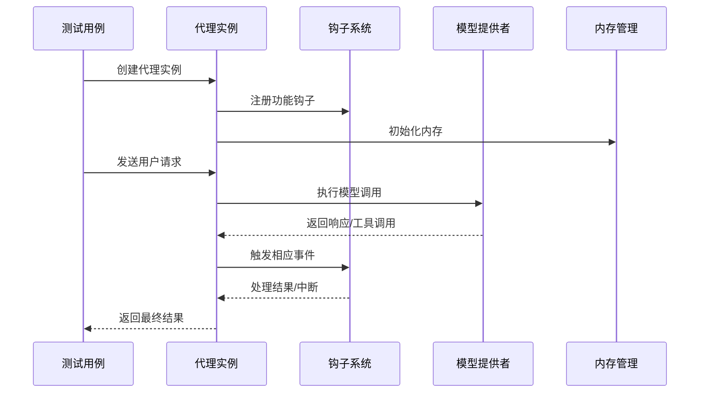
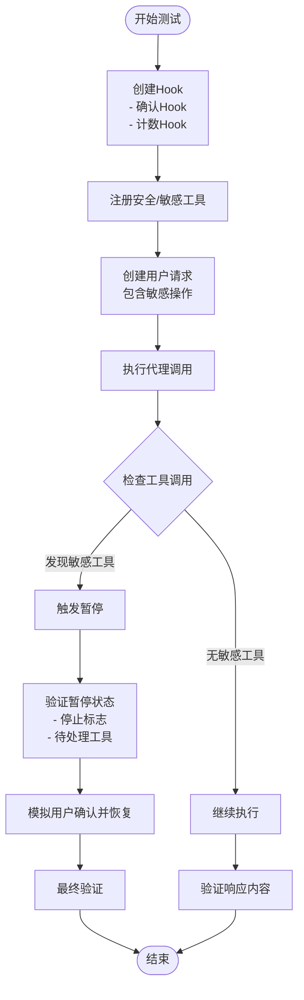
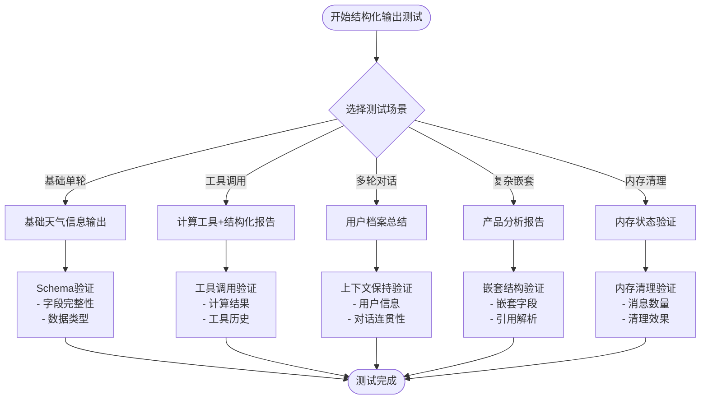
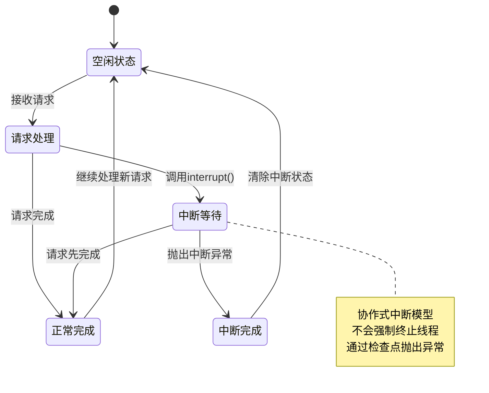
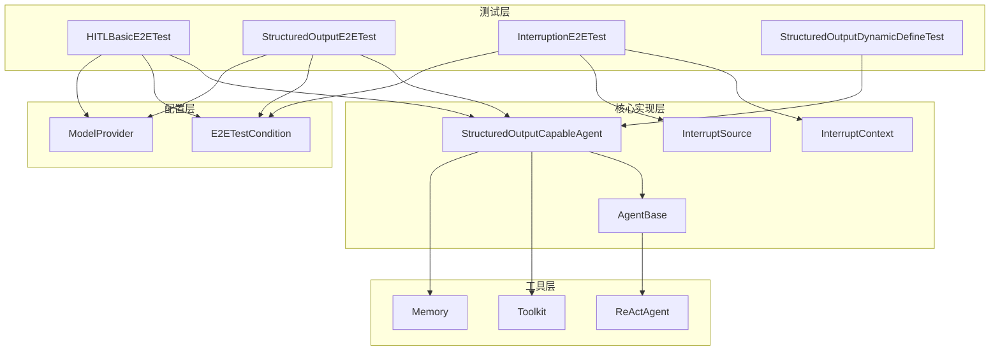

# 专用功能测试

<cite>
**本文档引用的文件**
- [HITLBasicE2ETest.java](file://agentscope-core/src/test/java/io/agentscope/core/e2e/HITLBasicE2ETest.java)
- [StructuredOutputE2ETest.java](file://agentscope-core/src/test/java/io/agentscope/core/e2e/StructuredOutputE2ETest.java)
- [InterruptionE2ETest.java](file://agentscope-core/src/test/java/io/agentscope/core/e2e/InterruptionE2ETest.java)
- [StructuredOutputCapableAgent.java](file://agentscope-core/src/main/java/io/agentscope/core/agent/StructuredOutputCapableAgent.java)
- [InterruptContext.java](file://agentscope-core/src/main/java/io/agentscope/core/interruption/InterruptContext.java)
- [InterruptSource.java](file://agentscope-core/src/main/java/io/agentscope/core/interruption/InterruptSource.java)
- [AgentBase.java](file://agentscope-core/src/main/java/io/agentscope/core/agent/AgentBase.java)
- [StructuredOutputDynamicDefineTest.java](file://agentscope-core/src/test/java/io/agentscope/core/agent/StructuredOutputDynamicDefineTest.java)
- [E2ETestCondition.java](file://agentscope-core/src/test/java/io/agentscope/core/e2e/E2ETestCondition.java)
- [large_output_test.txt](file://agentscope-core/src/test/resources/large_output_test.txt)
</cite>

## 目录
1. [简介](#简介)
2. [项目结构](#项目结构)
3. [核心组件](#核心组件)
4. [架构概览](#架构概览)
5. [详细组件分析](#详细组件分析)
6. [依赖关系分析](#依赖关系分析)
7. [性能考虑](#性能考虑)
8. [故障排除指南](#故障排除指南)
9. [结论](#结论)
10. [附录](#附录)

## 简介

本文件为AgentScopeJava项目的专用功能测试技术文档，专注于以下三个核心功能的端到端测试实现：

- **人机交互（HITL）**：测试代理在敏感工具调用时的暂停/恢复机制，确保人工审核和确认流程的安全性与可靠性。
- **结构化输出**：验证代理生成符合预定义JSON Schema的数据结构能力，包括基础单轮输出、工具调用结合输出、多轮对话后的输出以及复杂嵌套结构。
- **中断处理**：实现协作式中断机制，支持基本中断、带消息中断以及中断后的恢复能力。

文档将深入解释交互式验证、输出格式验证和中断恢复的测试方法，阐述用户输入处理、输出约束验证和异常中断处理的测试策略，并提供完整的专用功能测试示例和配置指南。

## 项目结构

AgentScopeJava采用模块化架构，核心测试位于`agentscope-core/src/test/java/io/agentscope/core/e2e/`目录下，分别对应三大功能域的端到端测试：



**图表来源**
- [HITLBasicE2ETest.java:1-301](file://agentscope-core/src/test/java/io/agentscope/core/e2e/HITLBasicE2ETest.java#L1-L301)
- [StructuredOutputE2ETest.java:1-493](file://agentscope-core/src/test/java/io/agentscope/core/e2e/StructuredOutputE2ETest.java#L1-L493)
- [InterruptionE2ETest.java:1-230](file://agentscope-core/src/test/java/io/agentscope/core/e2e/InterruptionE2ETest.java#L1-L230)
- [StructuredOutputCapableAgent.java:1-374](file://agentscope-core/src/main/java/io/agentscope/core/agent/StructuredOutputCapableAgent.java#L1-L374)
- [InterruptContext.java:1-190](file://agentscope-core/src/main/java/io/agentscope/core/interruption/InterruptContext.java#L1-L190)
- [InterruptSource.java:1-38](file://agentscope-core/src/main/java/io/agentscope/core/interruption/InterruptSource.java#L1-L38)
- [AgentBase.java:381-402](file://agentscope-core/src/main/java/io/agentscope/core/agent/AgentBase.java#L381-L402)

**章节来源**
- [HITLBasicE2ETest.java:1-301](file://agentscope-core/src/test/java/io/agentscope/core/e2e/HITLBasicE2ETest.java#L1-L301)
- [StructuredOutputE2ETest.java:1-493](file://agentscope-core/src/test/java/io/agentscope/core/e2e/StructuredOutputE2ETest.java#L1-L493)
- [InterruptionE2ETest.java:1-230](file://agentscope-core/src/test/java/io/agentscope/core/e2e/InterruptionE2ETest.java#L1-L230)

## 核心组件

### 结构化输出代理（StructuredOutputCapableAgent）

该抽象类为支持结构化输出的代理提供基础设施，包含以下关键特性：

- 自动注册结构化输出工具（generate_response）
- 在模型调用前后进行内存压缩
- 可配置的提醒模式（TOOL_CHOICE或PROMPT）
- Schema验证和参数提取



**图表来源**
- [StructuredOutputCapableAgent.java:65-374](file://agentscope-core/src/main/java/io/agentscope/core/agent/StructuredOutputCapableAgent.java#L65-L374)
- [AgentBase.java:381-402](file://agentscope-core/src/main/java/io/agentscope/core/agent/AgentBase.java#L381-L402)
- [InterruptContext.java:40-190](file://agentscope-core/src/main/java/io/agentscope/core/interruption/InterruptContext.java#L40-L190)
- [InterruptSource.java:28-38](file://agentscope-core/src/main/java/io/agentscope/core/interruption/InterruptSource.java#L28-L38)

**章节来源**
- [StructuredOutputCapableAgent.java:44-124](file://agentscope-core/src/main/java/io/agentscope/core/agent/StructuredOutputCapableAgent.java#L44-L124)
- [AgentBase.java:381-402](file://agentscope-core/src/main/java/io/agentscope/core/agent/AgentBase.java#L381-L402)

### 中断上下文（InterruptContext）

封装中断相关信息，包括中断源、时间戳、用户消息和待处理工具调用列表。

**章节来源**
- [InterruptContext.java:24-93](file://agentscope-core/src/main/java/io/agentscope/core/interruption/InterruptContext.java#L24-L93)

## 架构概览

专用功能测试的整体架构由三层组成：



**图表来源**
- [HITLBasicE2ETest.java:144-190](file://agentscope-core/src/test/java/io/agentscope/core/e2e/HITLBasicE2ETest.java#L144-L190)
- [StructuredOutputE2ETest.java:172-210](file://agentscope-core/src/test/java/io/agentscope/core/e2e/StructuredOutputE2ETest.java#L172-L210)
- [InterruptionE2ETest.java:53-111](file://agentscope-core/src/test/java/io/agentscope/core/e2e/InterruptionE2ETest.java#L53-L111)

## 详细组件分析

### 人机交互（HITL）测试

#### 测试策略

HITL测试通过自定义Hook实现敏感工具检测和暂停机制：



**图表来源**
- [HITLBasicE2ETest.java:104-125](file://agentscope-core/src/test/java/io/agentscope/core/e2e/HITLBasicE2ETest.java#L104-L125)
- [HITLBasicE2ETest.java:144-190](file://agentscope-core/src/test/java/io/agentscope/core/e2e/HITLBasicE2ETest.java#L144-L190)

#### 关键测试场景

1. **敏感工具暂停测试**
   - 检测delete_file和send_email等敏感工具
   - 验证代理被正确暂停并保留待处理工具调用

2. **安全工具执行测试**
   - getCurrent_time和read_file等安全工具
   - 确保不会触发暂停机制

3. **恢复机制测试**
   - 暂停后模拟用户确认
   - 验证代理能够继续执行并完成请求

**章节来源**
- [HITLBasicE2ETest.java:62-190](file://agentscope-core/src/test/java/io/agentscope/core/e2e/HITLBasicE2ETest.java#L62-L190)

### 结构化输出测试

#### 测试策略

结构化输出测试覆盖多种数据结构和使用场景：



**图表来源**
- [StructuredOutputE2ETest.java:172-210](file://agentscope-core/src/test/java/io/agentscope/core/e2e/StructuredOutputE2ETest.java#L172-L210)
- [StructuredOutputE2ETest.java:211-265](file://agentscope-core/src/test/java/io/agentscope/core/e2e/StructuredOutputE2ETest.java#L211-L265)

#### 关键测试场景

1. **基础单轮结构化输出**
   - 验证WeatherInfo类的完整字段提取
   - 确保location、temperature、condition均非空

2. **工具调用结合结构化输出**
   - CalculatorAgent执行加法运算
   - 生成CalculationReport包含operation、inputs、result、explanation

3. **多轮对话后的结构化输出**
   - 收集用户姓名、年龄、喜好等信息
   - 生成UserProfile结构化档案

4. **复杂嵌套数据结构**
   - ProductAnalysis包含features和nested PriceInfo
   - 验证$defs和$ref的引用解析

5. **内存清理验证**
   - 确保临时工具调用不污染长期内存
   - 验证内存大小合理增长

**章节来源**
- [StructuredOutputE2ETest.java:69-168](file://agentscope-core/src/test/java/io/agentscope/core/e2e/StructuredOutputE2ETest.java#L69-L168)
- [StructuredOutputE2ETest.java:172-493](file://agentscope-core/src/test/java/io/agentscope/core/e2e/StructuredOutputE2ETest.java#L172-L493)

### 中断处理测试

#### 测试策略

中断处理测试验证协作式中断机制的健壮性：



**图表来源**
- [InterruptionE2ETest.java:53-111](file://agentscope-core/src/test/java/io/agentscope/core/e2e/InterruptionE2ETest.java#L53-L111)

#### 关键测试场景

1. **基本中断测试**
   - 验证interrupt()方法的调用
   - 确保不会抛出异常且后续请求正常

2. **带消息中断测试**
   - interrupt(Msg)接收用户消息作为中断原因
   - 验证消息传递和处理

3. **中断后继续测试**
   - 中断清除后的新请求处理
   - 多个连续请求的稳定性

**章节来源**
- [InterruptionE2ETest.java:53-230](file://agentscope-core/src/test/java/io/agentscope/core/e2e/InterruptionE2ETest.java#L53-L230)

## 依赖关系分析

专用功能测试的依赖关系呈现层次化结构：



**图表来源**
- [HITLBasicE2ETest.java:23-46](file://agentscope-core/src/test/java/io/agentscope/core/e2e/HITLBasicE2ETest.java#L23-L46)
- [StructuredOutputE2ETest.java:22-38](file://agentscope-core/src/test/java/io/agentscope/core/e2e/StructuredOutputE2ETest.java#L22-L38)
- [InterruptionE2ETest.java:21-29](file://agentscope-core/src/test/java/io/agentscope/core/e2e/InterruptionE2ETest.java#L21-L29)

**章节来源**
- [E2ETestCondition.java:22-69](file://agentscope-core/src/test/java/io/agentscope/core/e2e/E2ETestCondition.java#L22-L69)

## 性能考虑

专用功能测试在性能方面需要关注以下要点：

### 并发执行优化
- 使用`@Execution(ExecutionMode.CONCURRENT)`提升测试效率
- 合理设置测试超时时间（默认300秒）
- 避免长时间阻塞操作影响整体测试进度

### 资源管理
- E2E测试需要显式启用环境变量`ENABLE_E2E_TESTS=true`
- 至少配置一个API密钥（如DASHSCOPE_API_KEY）
- 控制并发测试数量避免资源争用

### 内存优化
- 结构化输出测试中验证内存清理效果
- 确保临时工具调用不造成内存泄漏
- 监控测试执行过程中的内存使用情况

## 故障排除指南

### 常见问题及解决方案

#### E2E测试未执行
**问题症状**：所有E2E测试被禁用
**解决方法**：
```bash
# 启用E2E测试
export ENABLE_E2E_TESTS=true
# 或设置API密钥
export DASHSCOPE_API_KEY=your_key
mvn test -DENABLE_E2E_TESTS=true
```

#### 结构化输出验证失败
**问题症状**：JSON Schema验证抛出异常
**解决方法**：
- 检查Schema定义的required字段
- 验证$defs和$ref的正确引用
- 确认数据类型匹配Schema要求

#### 中断测试不稳定
**问题症状**：中断时机不确定导致测试失败
**解决方法**：
- 理解协作式中断的非确定性特点
- 接受中断成功和请求提前完成两种结果
- 重点验证中断方法不崩溃和后续可用性

**章节来源**
- [E2ETestCondition.java:37-69](file://agentscope-core/src/test/java/io/agentscope/core/e2e/E2ETestCondition.java#L37-L69)

## 结论

AgentScopeJava的专用功能测试体系提供了全面的功能验证框架：

1. **HITL测试**确保了敏感操作的人工审核机制可靠运行
2. **结构化输出测试**验证了复杂数据结构的生成和验证能力  
3. **中断处理测试**实现了协作式的优雅中断机制

这些测试不仅验证了核心功能的正确性，还为系统的可扩展性和稳定性提供了保障。通过参数化测试和多种场景覆盖，确保了在不同模型和配置下的兼容性。

## 附录

### 测试配置指南

#### 环境变量设置
```bash
# 启用E2E测试
export ENABLE_E2E_TESTS=true

# 设置模型API密钥
export DASHSCOPE_API_KEY=your_dashscope_key
export OPENAI_API_KEY=your_openai_key

# 设置测试超时
export TEST_TIMEOUT=300
```

#### Maven命令示例
```bash
# 运行特定功能测试
mvn test -Dtest=HITLBasicE2ETest
mvn test -Dtest=StructuredOutputE2ETest
mvn test -Dtest=InterruptionE2ETest

# 运行所有E2E测试
mvn test -DENABLE_E2E_TESTS=true -Dtest="*E2ETest"
```

#### 测试资源文件
- `large_output_test.txt`：用于管道缓冲区填满测试
- 支持超过1000行的测试文本内容