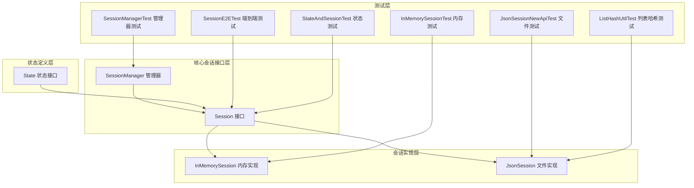
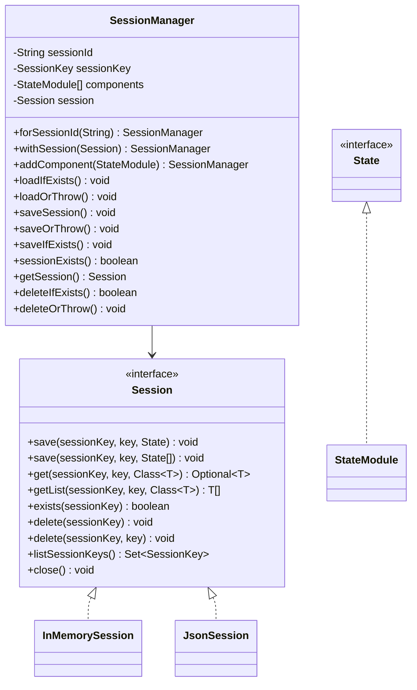
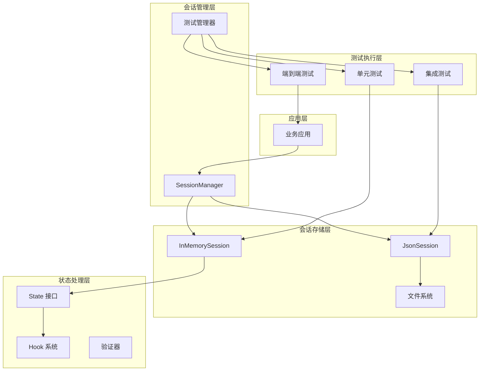
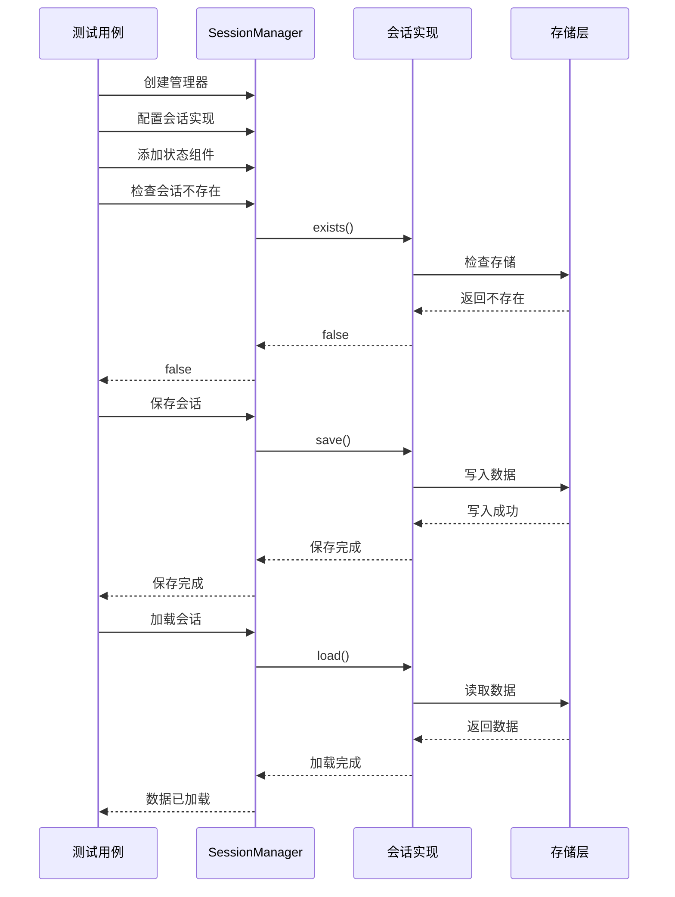
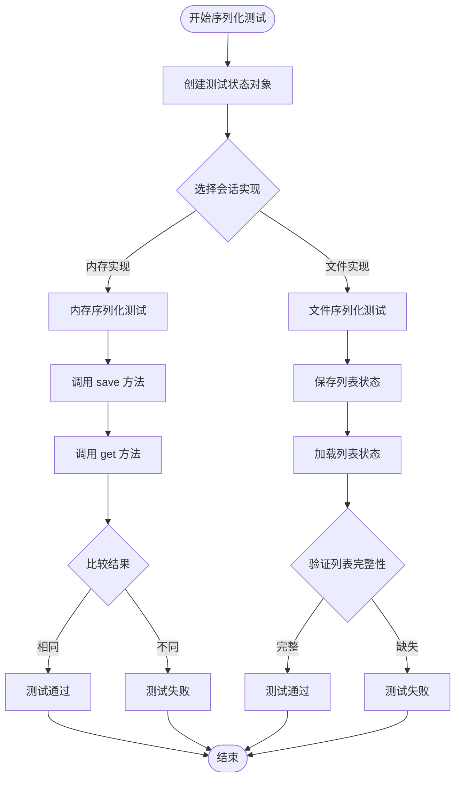
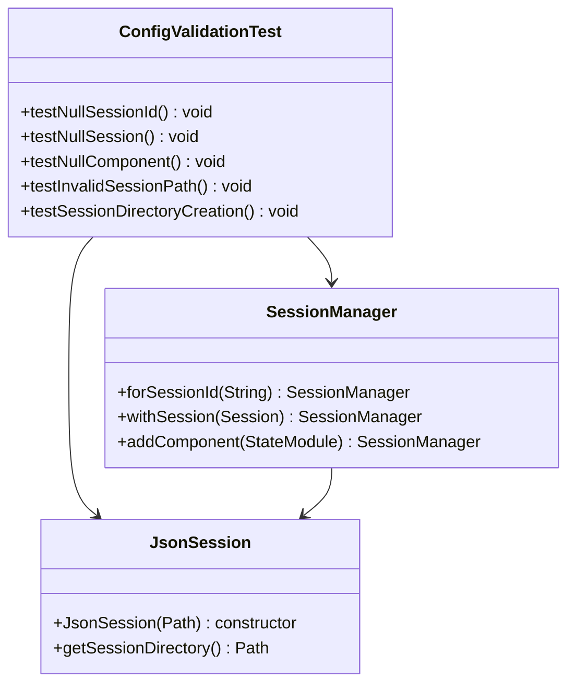
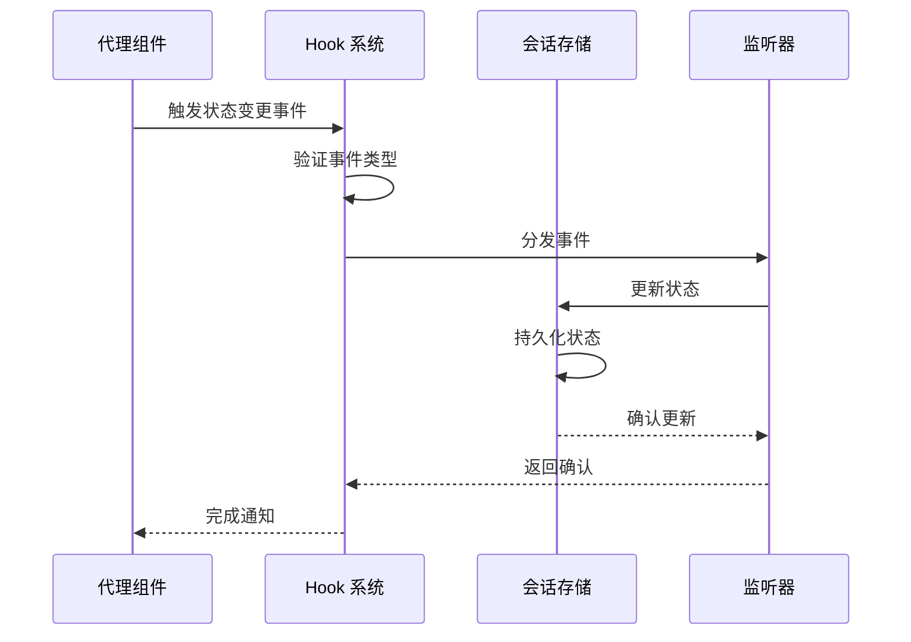
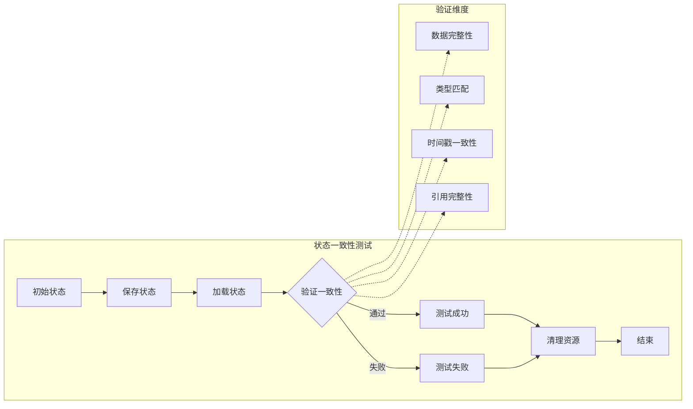
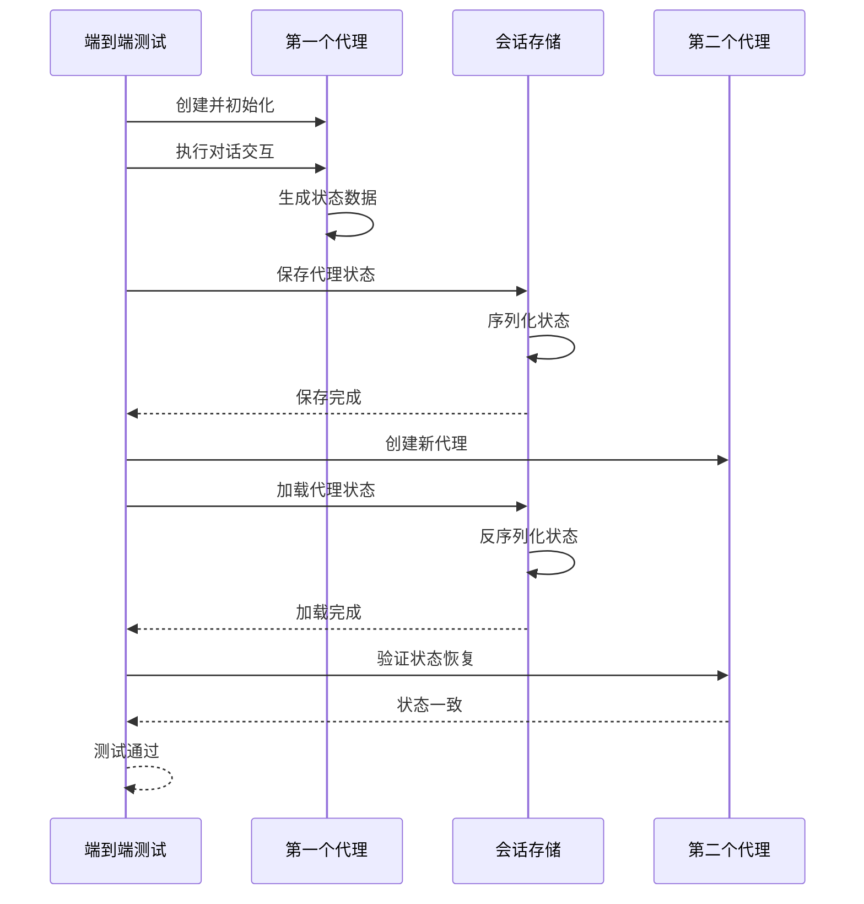
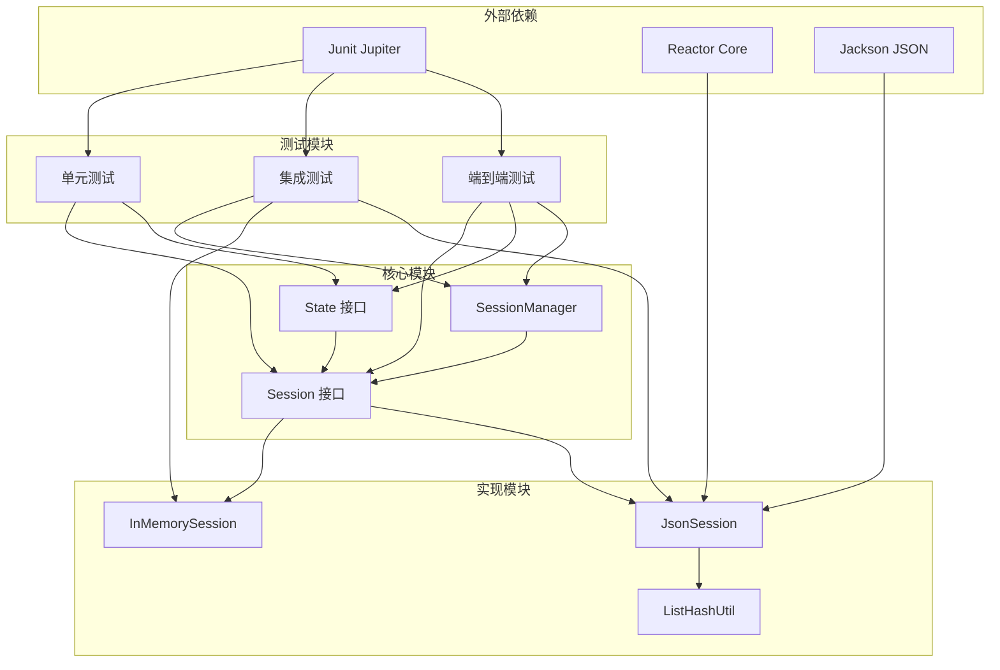

# 会话状态管理测试

<cite>
**本文档引用的文件**
- [Session.java](file://agentscope-core/src/main/java/io/agentscope/core/session/Session.java)
- [SessionManager.java](file://agentscope-core/src/main/java/io/agentscope/core/session/SessionManager.java)
- [InMemorySession.java](file://agentscope-core/src/main/java/io/agentscope/core/session/InMemorySession.java)
- [JsonSession.java](file://agentscope-core/src/main/java/io/agentscope/core/session/JsonSession.java)
- [State.java](file://agentscope-core/src/main/java/io/agentscope/core/state/State.java)
- [InMemorySessionTest.java](file://agentscope-core/src/test/java/io/agentscope/core/session/InMemorySessionTest.java)
- [JsonSessionNewApiTest.java](file://agentscope-core/src/test/java/io/agentscope/core/session/JsonSessionNewApiTest.java)
- [SessionManagerTest.java](file://agentscope-core/src/test/java/io/agentscope/core/session/SessionManagerTest.java)
- [SessionE2ETest.java](file://agentscope-core/src/test/java/io/agentscope/core/e2e/SessionE2ETest.java)
- [StateAndSessionTest.java](file://agentscope-core/src/test/java/io/agentscope/core/state/StateAndSessionTest.java)
- [ListHashUtilTest.java](file://agentscope-core/src/test/java/io/agentscope/core/session/ListHashUtilTest.java)
</cite>

## 目录
1. [简介](#简介)
2. [项目结构](#项目结构)
3. [核心组件](#核心组件)
4. [架构概览](#架构概览)
5. [详细组件分析](#详细组件分析)
6. [依赖关系分析](#依赖关系分析)
7. [性能考虑](#性能考虑)
8. [故障排除指南](#故障排除指南)
9. [结论](#结论)
10. [附录](#附录)

## 简介

本文件为会话状态管理测试的详细技术文档，深入解释了会话持久化、状态恢复和配置管理的端到端测试实现。文档涵盖了会话生命周期管理、状态序列化和状态反序列化的测试方法，阐述了执行配置验证、Hook 系统测试和状态一致性检查的测试策略，并解释了状态迁移测试、故障恢复测试和性能影响评估的测试实现。

## 项目结构

会话状态管理测试主要涉及以下关键模块：



**图表来源**
- [Session.java:53-146](file://agentscope-core/src/main/java/io/agentscope/core/session/Session.java#L53-L146)
- [SessionManager.java:61-261](file://agentscope-core/src/main/java/io/agentscope/core/session/SessionManager.java#L61-L261)
- [InMemorySession.java:58-250](file://agentscope-core/src/main/java/io/agentscope/core/session/InMemorySession.java#L58-L250)
- [JsonSession.java:58-510](file://agentscope-core/src/main/java/io/agentscope/core/session/JsonSession.java#L58-L510)

**章节来源**
- [Session.java:53-146](file://agentscope-core/src/main/java/io/agentscope/core/session/Session.java#L53-L146)
- [SessionManager.java:61-261](file://agentscope-core/src/main/java/io/agentscope/core/session/SessionManager.java#L61-L261)

## 核心组件

### Session 接口设计

Session 接口定义了统一的状态存储抽象，支持单值保存、列表保存、获取和删除操作：



**图表来源**
- [Session.java:53-146](file://agentscope-core/src/main/java/io/agentscope/core/session/Session.java#L53-L146)
- [SessionManager.java:61-261](file://agentscope-core/src/main/java/io/agentscope/core/session/SessionManager.java#L61-L261)
- [State.java:18-48](file://agentscope-core/src/main/java/io/agentscope/core/state/State.java#L18-L48)

### 会话实现对比

| 特性 | InMemorySession | JsonSession |
|------|----------------|-------------|
| 存储介质 | 内存 ConcurrentHashMap | 文件系统 JSON/JSONL |
| 持久化 | 进程内丢失 | 文件持久化 |
| 线程安全 | 是 | 需要文件锁 |
| 性能 | 高（内存访问） | 中等（磁盘IO） |
| 并发支持 | 多进程不共享 | 分布式访问 |
| 序列化 | 自动复制 | JSON 序列化 |

**章节来源**
- [InMemorySession.java:58-250](file://agentscope-core/src/main/java/io/agentscope/core/session/InMemorySession.java#L58-L250)
- [JsonSession.java:58-510](file://agentscope-core/src/main/java/io/agentscope/core/session/JsonSession.java#L58-L510)

## 架构概览

会话状态管理采用分层架构设计，确保测试覆盖所有关键层面：



**图表来源**
- [SessionManager.java:61-261](file://agentscope-core/src/main/java/io/agentscope/core/session/SessionManager.java#L61-L261)
- [InMemorySession.java:58-250](file://agentscope-core/src/main/java/io/agentscope/core/session/InMemorySession.java#L58-L250)
- [JsonSession.java:58-510](file://agentscope-core/src/main/java/io/agentscope/core/session/JsonSession.java#L58-L510)

## 详细组件分析

### 会话生命周期管理测试

会话生命周期管理测试覆盖了从创建到销毁的完整流程：



**图表来源**
- [SessionManagerTest.java:84-127](file://agentscope-core/src/test/java/io/agentscope/core/session/SessionManagerTest.java#L84-L127)
- [SessionManager.java:130-202](file://agentscope-core/src/main/java/io/agentscope/core/session/SessionManager.java#L130-L202)

**章节来源**
- [SessionManagerTest.java:84-127](file://agentscope-core/src/test/java/io/agentscope/core/session/SessionManagerTest.java#L84-L127)
- [SessionManager.java:130-202](file://agentscope-core/src/main/java/io/agentscope/core/session/SessionManager.java#L130-L202)

### 状态序列化和反序列化测试

状态序列化测试验证了不同状态类型的持久化能力：



**图表来源**
- [InMemorySessionTest.java:43-94](file://agentscope-core/src/test/java/io/agentscope/core/session/InMemorySessionTest.java#L43-L94)
- [JsonSessionNewApiTest.java:55-115](file://agentscope-core/src/test/java/io/agentscope/core/session/JsonSessionNewApiTest.java#L55-L115)

**章节来源**
- [InMemorySessionTest.java:43-94](file://agentscope-core/src/test/java/io/agentscope/core/session/InMemorySessionTest.java#L43-L94)
- [JsonSessionNewApiTest.java:55-115](file://agentscope-core/src/test/java/io/agentscope/core/session/JsonSessionNewApiTest.java#L55-L115)

### 配置验证测试

配置验证测试确保会话管理器在各种配置场景下的正确性：



**图表来源**
- [SessionManagerTest.java:197-226](file://agentscope-core/src/test/java/io/agentscope/core/session/SessionManagerTest.java#L197-226)

**章节来源**
- [SessionManagerTest.java:197-226](file://agentscope-core/src/test/java/io/agentscope/core/session/SessionManagerTest.java#L197-L226)

### Hook 系统测试策略

Hook 系统测试验证了状态变更通知机制：



**章节来源**
- [StateAndSessionTest.java:38-195](file://agentscope-core/src/test/java/io/agentscope/core/state/StateAndSessionTest.java#L38-L195)

### 状态一致性检查测试

状态一致性测试确保跨会话的数据完整性：



**图表来源**
- [StateAndSessionTest.java:197-251](file://agentscope-core/src/test/java/io/agentscope/core/state/StateAndSessionTest.java#L197-251)

**章节来源**
- [StateAndSessionTest.java:197-251](file://agentscope-core/src/test/java/io/agentscope/core/state/StateAndSessionTest.java#L197-L251)

### 端到端测试实现

端到端测试验证了完整的会话状态管理流程：



**图表来源**
- [SessionE2ETest.java:87-133](file://agentscope-core/src/test/java/io/agentscope/core/e2e/SessionE2ETest.java#L87-133)

**章节来源**
- [SessionE2ETest.java:87-133](file://agentscope-core/src/test/java/io/agentscope/core/e2e/SessionE2ETest.java#L87-L133)

## 依赖关系分析

会话状态管理测试的依赖关系呈现清晰的层次结构：



**图表来源**
- [JsonSession.java:39-40](file://agentscope-core/src/main/java/io/agentscope/core/session/JsonSession.java#L39-L40)
- [ListHashUtilTest.java:18-28](file://agentscope-core/src/test/java/io/agentscope/core/session/ListHashUtilTest.java#L18-L28)

**章节来源**
- [JsonSession.java:39-40](file://agentscope-core/src/main/java/io/agentscope/core/session/JsonSession.java#L39-L40)
- [ListHashUtilTest.java:18-28](file://agentscope-core/src/test/java/io/agentscope/core/session/ListHashUtilTest.java#L18-L28)

## 性能考虑

会话状态管理测试在性能方面采用了多种优化策略：

### 内存使用优化
- **InMemorySession** 使用 `ConcurrentHashMap` 实现线程安全
- **状态复制** 在保存时使用 `List.copyOf()` 防止外部修改
- **惰性加载** 仅在需要时才进行状态反序列化

### I/O 性能优化
- **增量写入** JsonSession 支持增量追加而非全量重写
- **哈希检测** 使用 `ListHashUtil` 检测列表变化避免不必要的写入
- **异步清理** 提供 `clearAllSessions()` 的异步清理功能

### 并发性能
- **无阻塞设计** 所有操作都是非阻塞的
- **原子操作** 文件操作保证原子性
- **资源池** 使用 `Schedulers.boundedElastic()` 管理线程池

## 故障排除指南

### 常见问题及解决方案

| 问题类型 | 症状 | 可能原因 | 解决方案 |
|----------|------|----------|----------|
| 序列化失败 | `ClassCastException` | 类型不匹配 | 检查状态类实现 |
| 文件权限错误 | `IOException` | 权限不足 | 检查目录权限 |
| 内存溢出 | `OutOfMemoryError` | 状态过大 | 调整状态大小或使用文件存储 |
| 并发冲突 | 数据不一致 | 竞态条件 | 使用适当的同步机制 |
| 序列化异常 | JSON 解析错误 | 数据损坏 | 检查数据完整性 |

### 调试技巧

1. **启用详细日志**：在测试中添加详细的日志输出
2. **使用临时目录**：确保测试隔离性
3. **验证文件存在**：检查文件系统状态
4. **监控内存使用**：跟踪内存消耗情况

**章节来源**
- [InMemorySession.java:114-123](file://agentscope-core/src/main/java/io/agentscope/core/session/InMemorySession.java#L114-L123)
- [JsonSession.java:106-108](file://agentscope-core/src/main/java/io/agentscope/core/session/JsonSession.java#L106-L108)

## 结论

会话状态管理测试通过多层次的测试策略确保了系统的可靠性、性能和可维护性。测试覆盖了从基础接口到复杂业务场景的各个方面，包括：

- **完整性测试**：验证所有核心功能的正确性
- **性能测试**：评估不同实现的性能特征
- **并发测试**：确保多线程环境下的稳定性
- **故障恢复测试**：验证系统的容错能力
- **配置验证测试**：确保配置的灵活性和健壮性

通过这些测试，系统能够在各种环境下稳定运行，并为用户提供可靠的会话状态管理服务。

## 附录

### 测试配置指南

#### 基础测试配置
```java
// 创建临时目录用于测试
Path tempDir = Files.createTempDirectory("session-test");

// 初始化会话存储
JsonSession session = new JsonSession(tempDir);

// 创建测试数据
SessionKey sessionKey = SimpleSessionKey.of("test-session");
TestState state = new TestState("test-value", 42);
```

#### 高级测试配置
```java
// 配置自定义会话管理器
SessionManager manager = SessionManager.forSessionId("test-id")
    .withSession(new JsonSession(customPath))
    .addComponent(memoryComponent)
    .addComponent(toolkitComponent);

// 执行保存操作
manager.saveSession();

// 执行加载操作
manager.loadIfExists();
```

### 测试最佳实践

1. **隔离性**：每个测试使用独立的临时目录
2. **清理**：测试完成后自动清理资源
3. **断言**：使用明确的断言验证测试结果
4. **边界测试**：覆盖正常和异常场景
5. **性能基准**：定期运行性能测试

### 扩展测试建议

- **数据库集成测试**：添加 MySQL/Redis 会话存储测试
- **分布式测试**：验证多节点环境下的状态一致性
- **压力测试**：评估高并发场景下的性能表现
- **兼容性测试**：验证不同版本间的兼容性