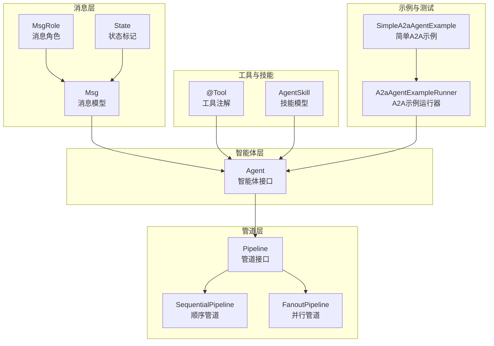
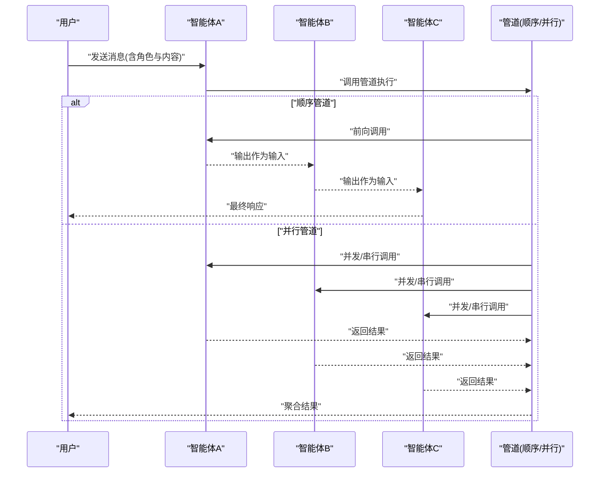
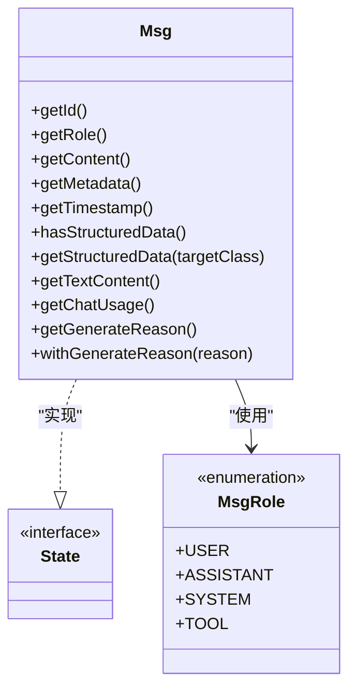
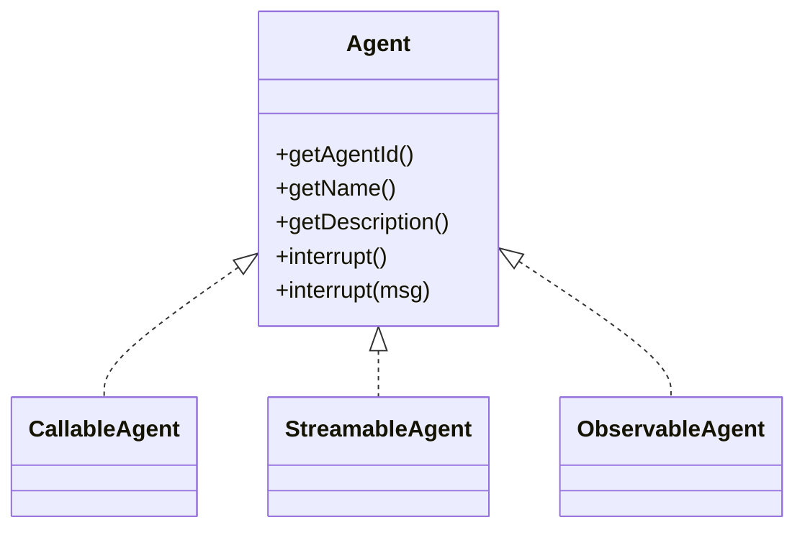
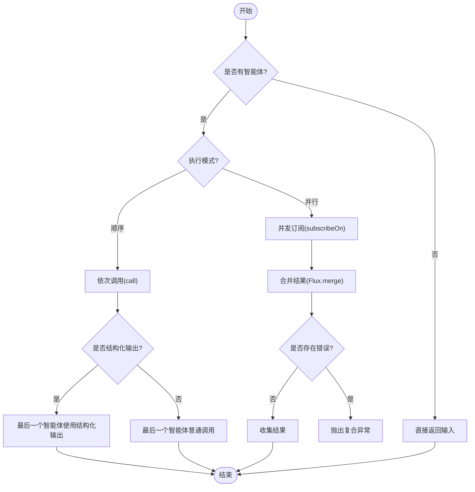
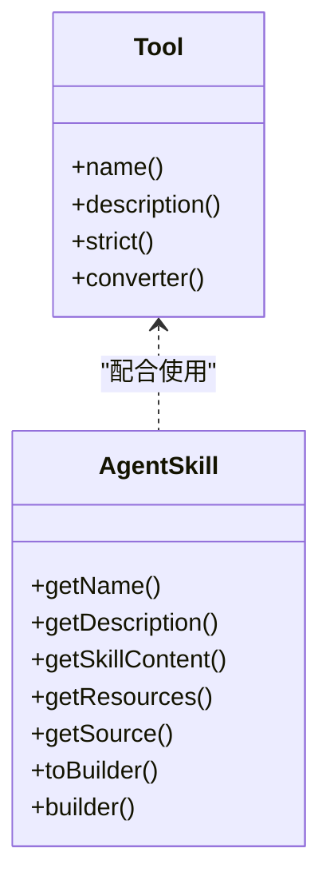
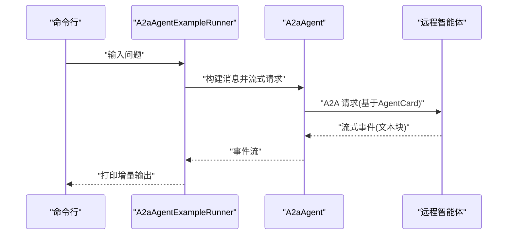
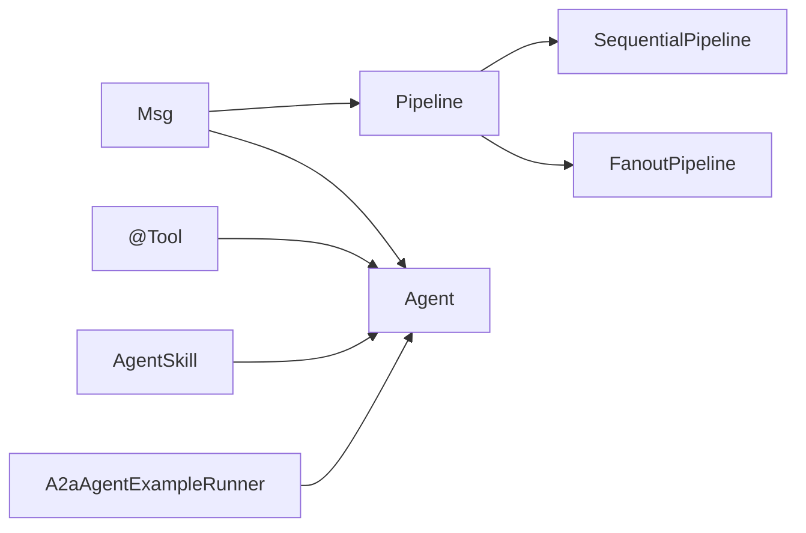

# 多智能体协作测试

<cite>
**本文引用的文件**
- [agentscope-core/src/main/java/io/agentscope/core/agent/Agent.java](file://agentscope-core/src/main/java/io/agentscope/core/agent/Agent.java)
- [agentscope-core/src/main/java/io/agentscope/core/pipeline/Pipeline.java](file://agentscope-core/src/main/java/io/agentscope/core/pipeline/Pipeline.java)
- [agentscope-core/src/main/java/io/agentscope/core/pipeline/SequentialPipeline.java](file://agentscope-core/src/main/java/io/agentscope/core/pipeline/SequentialPipeline.java)
- [agentscope-core/src/main/java/io/agentscope/core/pipeline/FanoutPipeline.java](file://agentscope-core/src/main/java/io/agentscope/core/pipeline/FanoutPipeline.java)
- [agentscope-core/src/main/java/io/agentscope/core/message/Msg.java](file://agentscope-core/src/main/java/io/agentscope/core/message/Msg.java)
- [agentscope-core/src/main/java/io/agentscope/core/message/MsgRole.java](file://agentscope-core/src/main/java/io/agentscope/core/message/MsgRole.java)
- [agentscope-core/src/main/java/io/agentscope/core/state/State.java](file://agentscope-core/src/main/java/io/agentscope/core/state/State.java)
- [agentscope-core/src/main/java/io/agentscope/core/tool/Tool.java](file://agentscope-core/src/main/java/io/agentscope/core/tool/Tool.java)
- [agentscope-core/src/main/java/io/agentscope/core/skill/AgentSkill.java](file://agentscope-core/src/main/java/io/agentscope/core/skill/AgentSkill.java)
- [agentscope-examples/a2a/src/main/java/io/agentscope/examples/a2a/A2aAgentExampleRunner.java](file://agentscope-examples/a2a/src/main/java/io/agentscope/examples/a2a/A2aAgentExampleRunner.java)
- [agentscope-examples/a2a/src/main/java/io/agentscope/examples/a2a/SimpleA2aAgentExample.java](file://agentscope-examples/a2a/src/main/java/io/agentscope/examples/a2a/SimpleA2aAgentExample.java)
</cite>

## 目录
1. [引言](#引言)
2. [项目结构](#项目结构)
3. [核心组件](#核心组件)
4. [架构总览](#架构总览)
5. [详细组件分析](#详细组件分析)
6. [依赖分析](#依赖分析)
7. [性能考虑](#性能考虑)
8. [故障排查指南](#故障排查指南)
9. [结论](#结论)
10. [附录：测试示例与配置](#附录测试示例与配置)

## 引言
本技术文档面向多智能体协作测试，聚焦于复杂场景下端到端的协作流程验证。内容覆盖智能体间通信、任务分配、状态同步与冲突解决的测试方法；协作模式验证、通信协议测试与性能瓶颈识别策略；角色分配与协作规则验证、异常处理测试实现；并提供完整的多智能体测试示例与配置指南，包括智能体发现测试、任务路由测试与协作效率测试。

## 项目结构
AgentScope 的多智能体协作能力由以下层次构成：
- 消息层：统一的消息模型与角色定义，支撑跨智能体通信与上下文传递
- 智能体层：可调用、可观测、可流式输出的智能体接口与实现
- 管道层：顺序与并行（扇出）管道，用于编排多智能体执行与结果聚合
- 工具与技能：工具注册与技能装载，支持外部能力扩展与协作
- 示例与测试：A2A 协议示例、端到端测试与格式化器测试，验证跨进程/跨节点协作

**图表来源**
- [agentscope-core/src/main/java/io/agentscope/core/message/Msg.java:52-656](file://agentscope-core/src/main/java/io/agentscope/core/message/Msg.java#L52-L656)
- [agentscope-core/src/main/java/io/agentscope/core/message/MsgRole.java:35-67](file://agentscope-core/src/main/java/io/agentscope/core/message/MsgRole.java#L35-L67)
- [agentscope-core/src/main/java/io/agentscope/core/state/State.java:18-47](file://agentscope-core/src/main/java/io/agentscope/core/state/State.java#L18-L47)
- [agentscope-core/src/main/java/io/agentscope/core/agent/Agent.java:20-82](file://agentscope-core/src/main/java/io/agentscope/core/agent/Agent.java#L20-L82)
- [agentscope-core/src/main/java/io/agentscope/core/pipeline/Pipeline.java:21-75](file://agentscope-core/src/main/java/io/agentscope/core/pipeline/Pipeline.java#L21-L75)
- [agentscope-core/src/main/java/io/agentscope/core/pipeline/SequentialPipeline.java:24-186](file://agentscope-core/src/main/java/io/agentscope/core/pipeline/SequentialPipeline.java#L24-L186)
- [agentscope-core/src/main/java/io/agentscope/core/pipeline/FanoutPipeline.java:31-458](file://agentscope-core/src/main/java/io/agentscope/core/pipeline/FanoutPipeline.java#L31-L458)
- [agentscope-core/src/main/java/io/agentscope/core/tool/Tool.java:24-133](file://agentscope-core/src/main/java/io/agentscope/core/tool/Tool.java#L24-L133)
- [agentscope-core/src/main/java/io/agentscope/core/skill/AgentSkill.java:26-479](file://agentscope-core/src/main/java/io/agentscope/core/skill/AgentSkill.java#L26-L479)
- [agentscope-examples/a2a/src/main/java/io/agentscope/examples/a2a/A2aAgentExampleRunner.java:28-101](file://agentscope-examples/a2a/src/main/java/io/agentscope/examples/a2a/A2aAgentExampleRunner.java#L28-L101)
- [agentscope-examples/a2a/src/main/java/io/agentscope/examples/a2a/SimpleA2aAgentExample.java:23-44](file://agentscope-examples/a2a/src/main/java/io/agentscope/examples/a2a/SimpleA2aAgentExample.java#L23-L44)

**章节来源**
- [agentscope-core/src/main/java/io/agentscope/core/message/Msg.java:52-656](file://agentscope-core/src/main/java/io/agentscope/core/message/Msg.java#L52-L656)
- [agentscope-core/src/main/java/io/agentscope/core/message/MsgRole.java:35-67](file://agentscope-core/src/main/java/io/agentscope/core/message/MsgRole.java#L35-L67)
- [agentscope-core/src/main/java/io/agentscope/core/state/State.java:18-47](file://agentscope-core/src/main/java/io/agentscope/core/state/State.java#L18-L47)
- [agentscope-core/src/main/java/io/agentscope/core/agent/Agent.java:20-82](file://agentscope-core/src/main/java/io/agentscope/core/agent/Agent.java#L20-L82)
- [agentscope-core/src/main/java/io/agentscope/core/pipeline/Pipeline.java:21-75](file://agentscope-core/src/main/java/io/agentscope/core/pipeline/Pipeline.java#L21-L75)
- [agentscope-core/src/main/java/io/agentscope/core/pipeline/SequentialPipeline.java:24-186](file://agentscope-core/src/main/java/io/agentscope/core/pipeline/SequentialPipeline.java#L24-L186)
- [agentscope-core/src/main/java/io/agentscope/core/pipeline/FanoutPipeline.java:31-458](file://agentscope-core/src/main/java/io/agentscope/core/pipeline/FanoutPipeline.java#L31-L458)
- [agentscope-core/src/main/java/io/agentscope/core/tool/Tool.java:24-133](file://agentscope-core/src/main/java/io/agentscope/core/tool/Tool.java#L24-L133)
- [agentscope-core/src/main/java/io/agentscope/core/skill/AgentSkill.java:26-479](file://agentscope-core/src/main/java/io/agentscope/core/skill/AgentSkill.java#L26-L479)
- [agentscope-examples/a2a/src/main/java/io/agentscope/examples/a2a/A2aAgentExampleRunner.java:28-101](file://agentscope-examples/a2a/src/main/java/io/agentscope/examples/a2a/A2aAgentExampleRunner.java#L28-L101)
- [agentscope-examples/a2a/src/main/java/io/agentscope/examples/a2a/SimpleA2aAgentExample.java:23-44](file://agentscope-examples/a2a/src/main/java/io/agentscope/examples/a2a/SimpleA2aAgentExample.java#L23-L44)

## 核心组件
- 消息模型与角色
  - 消息模型提供不可变内容块、元数据与时间戳，支持结构化输出与使用统计提取
  - 角色枚举定义用户、助手、系统与工具四种角色，确保消息路由与处理一致性
- 智能体接口
  - 统一的可调用、可流式、可观测接口，支持中断与描述信息，便于协作与调试
- 管道编排
  - 顺序管道：链式执行，前一个智能体输出作为下一个输入
  - 并行管道：扇出执行，支持并发或串行，聚合结果并进行错误收集
- 工具与技能
  - 工具注解驱动自动注册与 JSON Schema 生成
  - 技能模型支持资源与版本管理，便于协作场景的能力复用与演进
- 示例与测试
  - A2A 示例演示远程智能体发现与请求流程，支撑跨节点协作测试

**章节来源**
- [agentscope-core/src/main/java/io/agentscope/core/message/Msg.java:52-656](file://agentscope-core/src/main/java/io/agentscope/core/message/Msg.java#L52-L656)
- [agentscope-core/src/main/java/io/agentscope/core/message/MsgRole.java:35-67](file://agentscope-core/src/main/java/io/agentscope/core/message/MsgRole.java#L35-L67)
- [agentscope-core/src/main/java/io/agentscope/core/agent/Agent.java:20-82](file://agentscope-core/src/main/java/io/agentscope/core/agent/Agent.java#L20-L82)
- [agentscope-core/src/main/java/io/agentscope/core/pipeline/SequentialPipeline.java:24-186](file://agentscope-core/src/main/java/io/agentscope/core/pipeline/SequentialPipeline.java#L24-L186)
- [agentscope-core/src/main/java/io/agentscope/core/pipeline/FanoutPipeline.java:31-458](file://agentscope-core/src/main/java/io/agentscope/core/pipeline/FanoutPipeline.java#L31-L458)
- [agentscope-core/src/main/java/io/agentscope/core/tool/Tool.java:24-133](file://agentscope-core/src/main/java/io/agentscope/core/tool/Tool.java#L24-L133)
- [agentscope-core/src/main/java/io/agentscope/core/skill/AgentSkill.java:26-479](file://agentscope-core/src/main/java/io/agentscope/core/skill/AgentSkill.java#L26-L479)
- [agentscope-examples/a2a/src/main/java/io/agentscope/examples/a2a/A2aAgentExampleRunner.java:28-101](file://agentscope-examples/a2a/src/main/java/io/agentscope/examples/a2a/A2aAgentExampleRunner.java#L28-L101)
- [agentscope-examples/a2a/src/main/java/io/agentscope/examples/a2a/SimpleA2aAgentExample.java:23-44](file://agentscope-examples/a2a/src/main/java/io/agentscope/examples/a2a/SimpleA2aAgentExample.java#L23-L44)

## 架构总览
多智能体协作通过“消息驱动 + 管道编排”的方式实现。消息在智能体之间传递，管道负责控制执行顺序与并发度，工具与技能提供外部能力扩展，示例与测试验证跨节点协作与端到端行为。

**图表来源**
- [agentscope-core/src/main/java/io/agentscope/core/pipeline/SequentialPipeline.java:54-94](file://agentscope-core/src/main/java/io/agentscope/core/pipeline/SequentialPipeline.java#L54-L94)
- [agentscope-core/src/main/java/io/agentscope/core/pipeline/FanoutPipeline.java:104-189](file://agentscope-core/src/main/java/io/agentscope/core/pipeline/FanoutPipeline.java#L104-L189)
- [agentscope-core/src/main/java/io/agentscope/core/message/Msg.java:52-656](file://agentscope-core/src/main/java/io/agentscope/core/message/Msg.java#L52-L656)

## 详细组件分析

### 消息模型与角色
- 消息模型提供不可变内容块列表、元数据与时间戳，支持结构化输出与使用统计提取
- 角色枚举定义用户、助手、系统与工具四种角色，确保消息路由与处理一致性
- 状态标记接口允许消息等对象被会话持久化，便于状态同步与回放

**图表来源**
- [agentscope-core/src/main/java/io/agentscope/core/message/Msg.java:52-656](file://agentscope-core/src/main/java/io/agentscope/core/message/Msg.java#L52-L656)
- [agentscope-core/src/main/java/io/agentscope/core/message/MsgRole.java:35-67](file://agentscope-core/src/main/java/io/agentscope/core/message/MsgRole.java#L35-L67)
- [agentscope-core/src/main/java/io/agentscope/core/state/State.java:18-47](file://agentscope-core/src/main/java/io/agentscope/core/state/State.java#L18-L47)

**章节来源**
- [agentscope-core/src/main/java/io/agentscope/core/message/Msg.java:52-656](file://agentscope-core/src/main/java/io/agentscope/core/message/Msg.java#L52-L656)
- [agentscope-core/src/main/java/io/agentscope/core/message/MsgRole.java:35-67](file://agentscope-core/src/main/java/io/agentscope/core/message/MsgRole.java#L35-L67)
- [agentscope-core/src/main/java/io/agentscope/core/state/State.java:18-47](file://agentscope-core/src/main/java/io/agentscope/core/state/State.java#L18-L47)

### 智能体接口与协作
- 统一接口包含可调用、可流式、可观测能力，支持中断与描述信息
- 适用于多智能体协作中的观察模式（不直接回复）与链式交互

**图表来源**
- [agentscope-core/src/main/java/io/agentscope/core/agent/Agent.java:20-82](file://agentscope-core/src/main/java/io/agentscope/core/agent/Agent.java#L20-L82)

**章节来源**
- [agentscope-core/src/main/java/io/agentscope/core/agent/Agent.java:20-82](file://agentscope-core/src/main/java/io/agentscope/core/agent/Agent.java#L20-L82)

### 管道编排：顺序与并行
- 顺序管道：链式执行，前一个智能体输出作为下一个输入；最后一个智能体可选结构化输出
- 并行管道：支持并发/串行执行，聚合所有结果；并发模式下使用弹性调度器，错误聚合为复合异常

**图表来源**
- [agentscope-core/src/main/java/io/agentscope/core/pipeline/SequentialPipeline.java:54-94](file://agentscope-core/src/main/java/io/agentscope/core/pipeline/SequentialPipeline.java#L54-L94)
- [agentscope-core/src/main/java/io/agentscope/core/pipeline/FanoutPipeline.java:104-189](file://agentscope-core/src/main/java/io/agentscope/core/pipeline/FanoutPipeline.java#L104-L189)

**章节来源**
- [agentscope-core/src/main/java/io/agentscope/core/pipeline/SequentialPipeline.java:24-186](file://agentscope-core/src/main/java/io/agentscope/core/pipeline/SequentialPipeline.java#L24-L186)
- [agentscope-core/src/main/java/io/agentscope/core/pipeline/FanoutPipeline.java:31-458](file://agentscope-core/src/main/java/io/agentscope/core/pipeline/FanoutPipeline.java#L31-L458)

### 工具与技能：能力扩展与协作
- 工具注解驱动自动注册与 JSON Schema 生成，便于多智能体协作中共享能力
- 技能模型支持资源与版本管理，便于协作场景的能力复用与演进

**图表来源**
- [agentscope-core/src/main/java/io/agentscope/core/tool/Tool.java:24-133](file://agentscope-core/src/main/java/io/agentscope/core/tool/Tool.java#L24-L133)
- [agentscope-core/src/main/java/io/agentscope/core/skill/AgentSkill.java:26-479](file://agentscope-core/src/main/java/io/agentscope/core/skill/AgentSkill.java#L26-L479)

**章节来源**
- [agentscope-core/src/main/java/io/agentscope/core/tool/Tool.java:24-133](file://agentscope-core/src/main/java/io/agentscope/core/tool/Tool.java#L24-L133)
- [agentscope-core/src/main/java/io/agentscope/core/skill/AgentSkill.java:26-479](file://agentscope-core/src/main/java/io/agentscope/core/skill/AgentSkill.java#L26-L479)

### A2A 协议示例：远程智能体发现与请求
- 示例通过已知 AgentCard URI 发现远程智能体，构建 A2A 智能体并进行流式输出
- 支持本地交互与远程智能体的端到端协作测试

**图表来源**
- [agentscope-examples/a2a/src/main/java/io/agentscope/examples/a2a/A2aAgentExampleRunner.java:49-100](file://agentscope-examples/a2a/src/main/java/io/agentscope/examples/a2a/A2aAgentExampleRunner.java#L49-L100)
- [agentscope-examples/a2a/src/main/java/io/agentscope/examples/a2a/SimpleA2aAgentExample.java:31-43](file://agentscope-examples/a2a/src/main/java/io/agentscope/examples/a2a/SimpleA2aAgentExample.java#L31-L43)

**章节来源**
- [agentscope-examples/a2a/src/main/java/io/agentscope/examples/a2a/A2aAgentExampleRunner.java:28-101](file://agentscope-examples/a2a/src/main/java/io/agentscope/examples/a2a/A2aAgentExampleRunner.java#L28-L101)
- [agentscope-examples/a2a/src/main/java/io/agentscope/examples/a2a/SimpleA2aAgentExample.java:23-44](file://agentscope-examples/a2a/src/main/java/io/agentscope/examples/a2a/SimpleA2aAgentExample.java#L23-L44)

## 依赖分析
- 组件内聚性
  - 消息模型与状态接口耦合度低，便于独立演进与持久化
  - 智能体接口组合了多种能力，职责清晰，利于扩展
  - 管道层对智能体实现透明，仅依赖通用接口
- 外部依赖
  - 并行管道使用弹性调度器以适配 I/O 密集型场景
  - 工具与技能模块与消息模型解耦，通过注解与注册机制集成

**图表来源**
- [agentscope-core/src/main/java/io/agentscope/core/message/Msg.java:52-656](file://agentscope-core/src/main/java/io/agentscope/core/message/Msg.java#L52-L656)
- [agentscope-core/src/main/java/io/agentscope/core/pipeline/Pipeline.java:21-75](file://agentscope-core/src/main/java/io/agentscope/core/pipeline/Pipeline.java#L21-L75)
- [agentscope-core/src/main/java/io/agentscope/core/pipeline/SequentialPipeline.java:24-186](file://agentscope-core/src/main/java/io/agentscope/core/pipeline/SequentialPipeline.java#L24-L186)
- [agentscope-core/src/main/java/io/agentscope/core/pipeline/FanoutPipeline.java:31-458](file://agentscope-core/src/main/java/io/agentscope/core/pipeline/FanoutPipeline.java#L31-L458)
- [agentscope-core/src/main/java/io/agentscope/core/tool/Tool.java:24-133](file://agentscope-core/src/main/java/io/agentscope/core/tool/Tool.java#L24-L133)
- [agentscope-core/src/main/java/io/agentscope/core/skill/AgentSkill.java:26-479](file://agentscope-core/src/main/java/io/agentscope/core/skill/AgentSkill.java#L26-L479)
- [agentscope-examples/a2a/src/main/java/io/agentscope/examples/a2a/A2aAgentExampleRunner.java:28-101](file://agentscope-examples/a2a/src/main/java/io/agentscope/examples/a2a/A2aAgentExampleRunner.java#L28-L101)

**章节来源**
- [agentscope-core/src/main/java/io/agentscope/core/pipeline/FanoutPipeline.java:63-88](file://agentscope-core/src/main/java/io/agentscope/core/pipeline/FanoutPipeline.java#L63-L88)
- [agentscope-core/src/main/java/io/agentscope/core/pipeline/SequentialPipeline.java:49-52](file://agentscope-core/src/main/java/io/agentscope/core/pipeline/SequentialPipeline.java#L49-L52)

## 性能考虑
- 并发执行
  - 并行管道默认使用弹性调度器，适合 I/O 密集型场景；可通过自定义调度器优化吞吐
- 错误隔离与聚合
  - 并行模式下单个智能体失败不影响其他执行，但会聚合为复合异常，便于定位
- 结构化输出
  - 在顺序管道中仅对最后一个智能体启用结构化输出，减少不必要的序列化开销
- 流式输出
  - 使用流式事件可降低内存峰值，提升大输出场景的稳定性

[本节为通用指导，无需列出具体文件来源]

## 故障排查指南
- 并发执行失败
  - 现象：并行管道抛出复合异常
  - 排查：检查每个智能体的异常信息，确认网络/外部服务可用性与参数正确性
- 顺序管道卡顿
  - 现象：整体耗时过长
  - 排查：检查中间智能体的外部调用与等待点，必要时拆分或引入缓存
- 消息结构化输出缺失
  - 现象：无法解析结构化数据
  - 排查：确认消息元数据包含结构化输出键，且目标类型匹配
- A2A 远程调用超时
  - 现象：流式输出长时间无响应
  - 排查：确认 AgentCard 可达性、远程智能体健康状态与网络延迟

**章节来源**
- [agentscope-core/src/main/java/io/agentscope/core/pipeline/FanoutPipeline.java:130-168](file://agentscope-core/src/main/java/io/agentscope/core/pipeline/FanoutPipeline.java#L130-L168)
- [agentscope-core/src/main/java/io/agentscope/core/message/Msg.java:266-291](file://agentscope-core/src/main/java/io/agentscope/core/message/Msg.java#L266-L291)
- [agentscope-examples/a2a/src/main/java/io/agentscope/examples/a2a/A2aAgentExampleRunner.java:78-100](file://agentscope-examples/a2a/src/main/java/io/agentscope/examples/a2a/A2aAgentExampleRunner.java#L78-L100)

## 结论
通过消息驱动与管道编排，AgentScope 提供了多智能体协作的基础设施。顺序与并行管道满足不同场景的执行需求，工具与技能扩展了协作能力边界，A2A 示例验证了跨节点协作可行性。结合本文提供的测试方法与配置建议，可在复杂场景下系统性地验证协作模式、通信协议与性能表现。

[本节为总结性内容，无需列出具体文件来源]

## 附录：测试示例与配置

### 智能体发现测试
- 目标：验证基于已知 AgentCard URI 的远程智能体发现与连接
- 步骤
  - 配置 AgentCard 解析器与基础 URL
  - 构建 A2A 智能体实例
  - 启动示例运行器，进行交互式问答
- 关键点
  - 确认远程智能体可达与健康
  - 记录流式事件的增量输出，验证实时性

**章节来源**
- [agentscope-examples/a2a/src/main/java/io/agentscope/examples/a2a/SimpleA2aAgentExample.java:31-43](file://agentscope-examples/a2a/src/main/java/io/agentscope/examples/a2a/SimpleA2aAgentExample.java#L31-L43)
- [agentscope-examples/a2a/src/main/java/io/agentscope/examples/a2a/A2aAgentExampleRunner.java:49-100](file://agentscope-examples/a2a/src/main/java/io/agentscope/examples/a2a/A2aAgentExampleRunner.java#L49-L100)

### 任务路由测试
- 目标：验证消息在多智能体间的路由与角色转换
- 步骤
  - 构造用户消息，设置角色为用户
  - 通过顺序管道串联多个智能体，观察最终响应的角色与内容
- 关键点
  - 检查消息角色在链路中的传递与修正
  - 验证结构化输出路径仅在目标智能体生效

**章节来源**
- [agentscope-core/src/main/java/io/agentscope/core/message/MsgRole.java:35-67](file://agentscope-core/src/main/java/io/agentscope/core/message/MsgRole.java#L35-L67)
- [agentscope-core/src/main/java/io/agentscope/core/pipeline/SequentialPipeline.java:60-94](file://agentscope-core/src/main/java/io/agentscope/core/pipeline/SequentialPipeline.java#L60-L94)

### 协作效率测试
- 目标：评估顺序与并行管道的吞吐与延迟
- 步骤
  - 固定输入，重复执行顺序与并行管道
  - 统计平均耗时、最大/最小耗时与错误率
- 关键点
  - 并行模式下监控线程池与外部依赖的并发限制
  - 对比结构化输出开启/关闭的性能差异

**章节来源**
- [agentscope-core/src/main/java/io/agentscope/core/pipeline/FanoutPipeline.java:104-189](file://agentscope-core/src/main/java/io/agentscope/core/pipeline/FanoutPipeline.java#L104-L189)
- [agentscope-core/src/main/java/io/agentscope/core/pipeline/SequentialPipeline.java:54-94](file://agentscope-core/src/main/java/io/agentscope/core/pipeline/SequentialPipeline.java#L54-L94)

### 协作规则验证与异常处理
- 目标：验证角色约束、中断与错误聚合
- 步骤
  - 触发智能体中断，验证中断标志与关联消息
  - 模拟部分智能体失败，验证复合异常聚合
- 关键点
  - 中断应为协作过程中的可控信号
  - 错误聚合需保留每个智能体的异常详情

**章节来源**
- [agentscope-core/src/main/java/io/agentscope/core/agent/Agent.java:72-81](file://agentscope-core/src/main/java/io/agentscope/core/agent/Agent.java#L72-L81)
- [agentscope-core/src/main/java/io/agentscope/core/pipeline/FanoutPipeline.java:130-168](file://agentscope-core/src/main/java/io/agentscope/core/pipeline/FanoutPipeline.java#L130-L168)