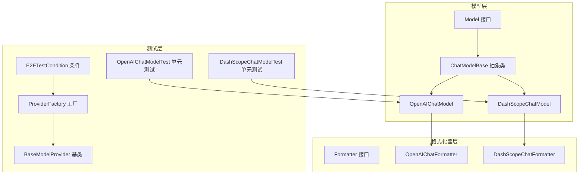
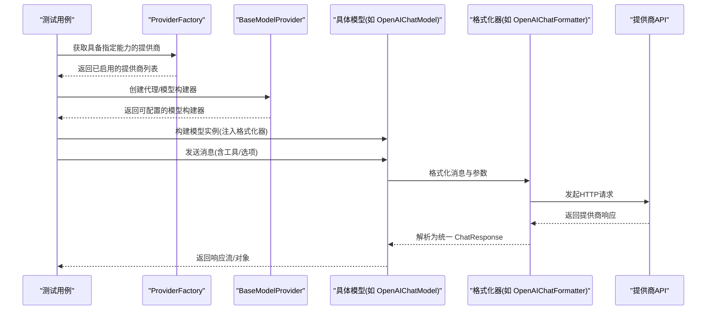
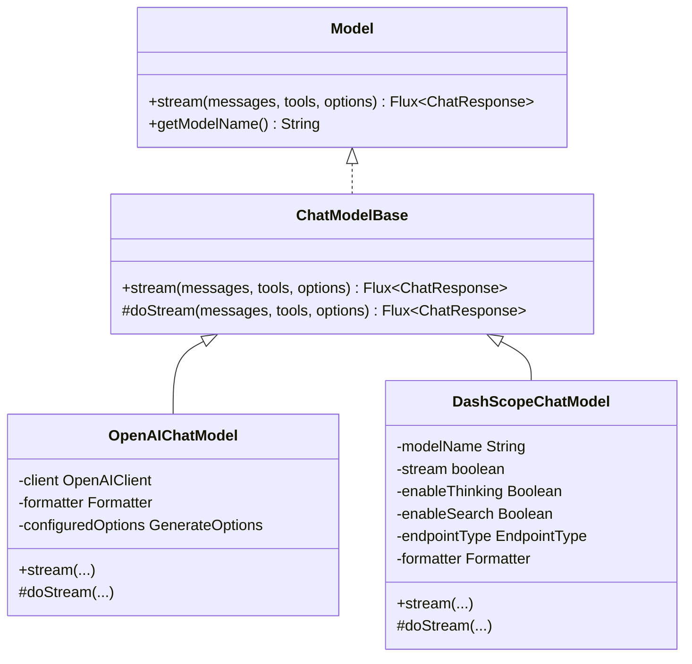
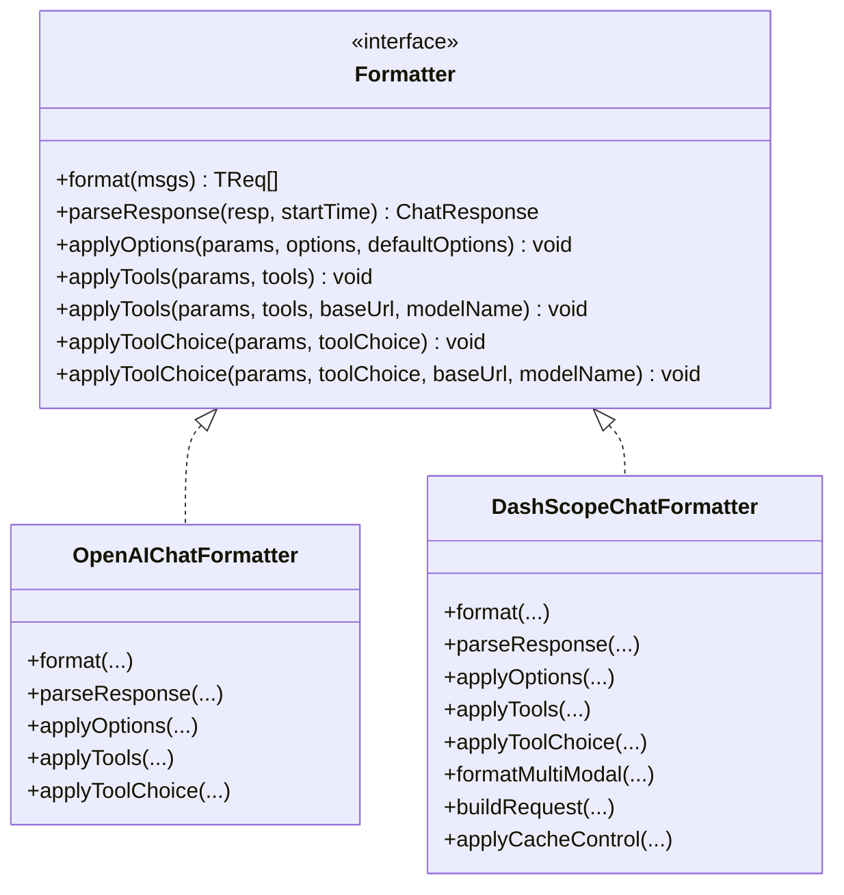
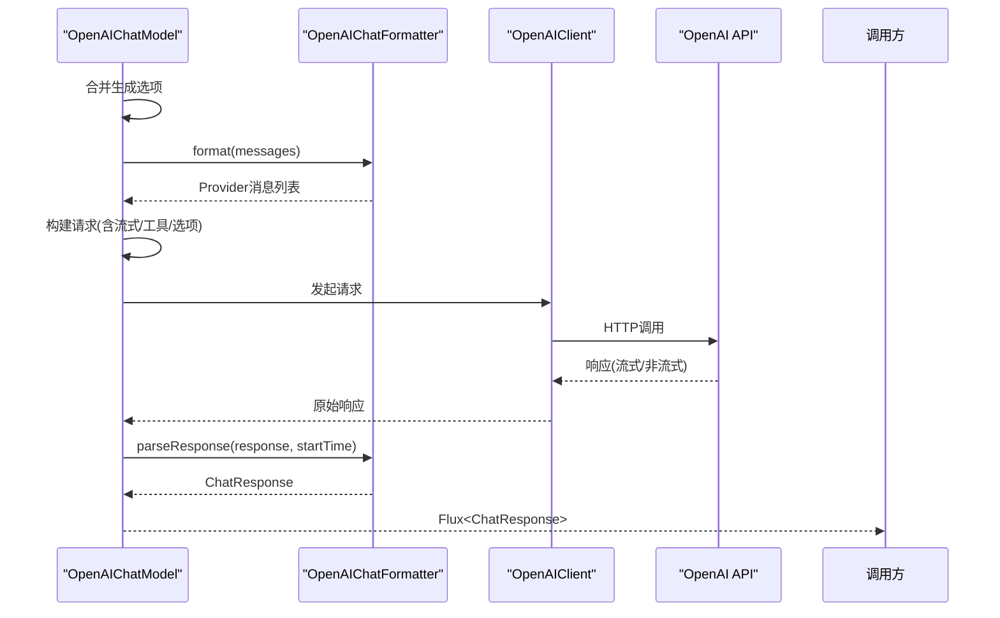
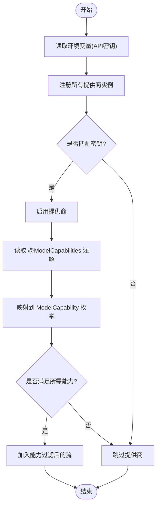
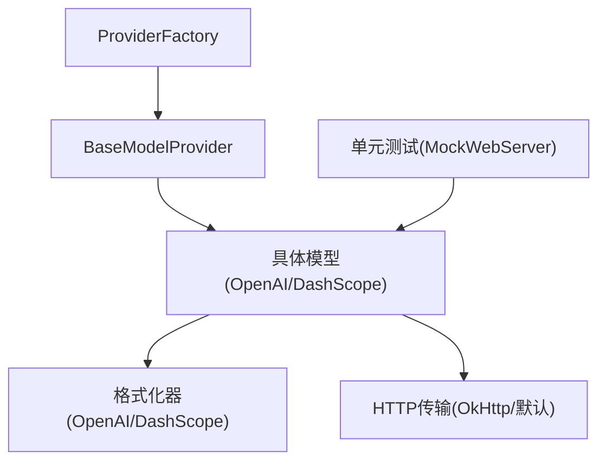

# 多模型兼容性测试

<cite>
**本文档引用的文件**
- [Model.java](file://agentscope-core/src/main/java/io/agentscope/core/model/Model.java)
- [ChatModelBase.java](file://agentscope-core/src/main/java/io/agentscope/core/model/ChatModelBase.java)
- [OpenAIChatModel.java](file://agentscope-core/src/main/java/io/agentscope/core/model/OpenAIChatModel.java)
- [DashScopeChatModel.java](file://agentscope-core/src/main/java/io/agentscope/core/model/DashScopeChatModel.java)
- [Formatter.java](file://agentscope-core/src/main/java/io/agentscope/core/formatter/Formatter.java)
- [OpenAIChatFormatter.java](file://agentscope-core/src/main/java/io/agentscope/core/formatter/openai/OpenAIChatFormatter.java)
- [DashScopeChatFormatter.java](file://agentscope-core/src/main/java/io/agentscope/core/formatter/dashscope/DashScopeChatFormatter.java)
- [ProviderFactory.java](file://agentscope-core/src/test/java/io/agentscope/core/e2e/ProviderFactory.java)
- [BaseModelProvider.java](file://agentscope-core/src/test/java/io/agentscope/core/e2e/providers/BaseModelProvider.java)
- [ModelCapability.java](file://agentscope-core/src/test/java/io/agentscope/core/e2e/providers/ModelCapability.java)
- [ModelCapabilities.java](file://agentscope-core/src/test/java/io/agentscope/core/e2e/providers/ModelCapabilities.java)
- [OpenAIChatModelTest.java](file://agentscope-core/src/test/java/io/agentscope/core/model/OpenAIChatModelTest.java)
- [DashScopeChatModelTest.java](file://agentscope-core/src/test/java/io/agentscope/core/model/DashScopeChatModelTest.java)
- [E2ETestCondition.java](file://agentscope-core/src/test/java/io/agentscope/core/e2e/E2ETestCondition.java)
- [MockHttpClient.java](file://agentscope-core/src/test/java/io/agentscope/core/model/test/MockHttpClient.java)
</cite>

## 目录
1. [简介](#简介)
2. [项目结构](#项目结构)
3. [核心组件](#核心组件)
4. [架构总览](#架构总览)
5. [详细组件分析](#详细组件分析)
6. [依赖关系分析](#依赖关系分析)
7. [性能考虑](#性能考虑)
8. [故障排除指南](#故障排除指南)
9. [结论](#结论)
10. [附录](#附录)

## 简介
本技术文档面向多模型兼容性测试，系统性阐述在 AgentScope 框架下对多家 LLM 提供商（OpenAI、DashScope、Gemini、Anthropic 等）的端到端兼容性测试实现。重点覆盖以下方面：
- 模型抽象层的统一测试：通过统一接口与基类确保各提供商模型具备一致的行为契约。
- 格式化器适配测试：验证消息格式转换、工具调用、选项应用与响应解析在不同提供商间的兼容性。
- 响应解析测试：确保各提供商返回数据被正确映射为统一的 ChatResponse 结构。
- 能力检测与参数兼容性验证：基于注解与工厂动态筛选支持特定能力的提供商，并验证其参数映射。
- 性能基准测试策略：通过超时与重试机制、流式与非流式模式对比等方法评估性能。
- 测试条件与配置管理：环境变量驱动的测试启用与提供商密钥管理。
- 结果对比分析：跨模型一致性测试、功能差异测试与性能对比测试的实施方法。

## 项目结构
AgentScope 的多模型兼容性测试围绕以下层次展开：
- 模型层：统一的 Model 接口与 ChatModelBase 抽象基类，屏蔽具体提供商差异。
- 格式化器层：针对不同提供商的消息格式转换与参数适配。
- 测试层：单元测试与端到端测试，结合 ProviderFactory 动态选择提供商并进行能力过滤。

**图表来源**
- [Model.java:22-41](file://agentscope-core/src/main/java/io/agentscope/core/model/Model.java#L22-L41)
- [ChatModelBase.java:29-61](file://agentscope-core/src/main/java/io/agentscope/core/model/ChatModelBase.java#L29-L61)
- [OpenAIChatModel.java:58-189](file://agentscope-core/src/main/java/io/agentscope/core/model/OpenAIChatModel.java#L58-L189)
- [DashScopeChatModel.java:52-355](file://agentscope-core/src/main/java/io/agentscope/core/model/DashScopeChatModel.java#L52-L355)
- [Formatter.java:45-135](file://agentscope-core/src/main/java/io/agentscope/core/formatter/Formatter.java#L45-L135)
- [OpenAIChatFormatter.java:46-277](file://agentscope-core/src/main/java/io/agentscope/core/formatter/openai/OpenAIChatFormatter.java#L46-L277)
- [DashScopeChatFormatter.java:42-207](file://agentscope-core/src/main/java/io/agentscope/core/formatter/dashscope/DashScopeChatFormatter.java#L42-L207)
- [ProviderFactory.java:63-359](file://agentscope-core/src/test/java/io/agentscope/core/e2e/ProviderFactory.java#L63-L359)
- [BaseModelProvider.java:51-196](file://agentscope-core/src/test/java/io/agentscope/core/e2e/providers/BaseModelProvider.java#L51-L196)
- [OpenAIChatModelTest.java:56-533](file://agentscope-core/src/test/java/io/agentscope/core/model/OpenAIChatModelTest.java#L56-L533)
- [DashScopeChatModelTest.java:66-800](file://agentscope-core/src/test/java/io/agentscope/core/model/DashScopeChatModelTest.java#L66-L800)
- [E2ETestCondition.java:39-68](file://agentscope-core/src/test/java/io/agentscope/core/e2e/E2ETestCondition.java#L39-L68)

**章节来源**
- [Model.java:22-41](file://agentscope-core/src/main/java/io/agentscope/core/model/Model.java#L22-L41)
- [ChatModelBase.java:29-61](file://agentscope-core/src/main/java/io/agentscope/core/model/ChatModelBase.java#L29-L61)
- [Formatter.java:45-135](file://agentscope-core/src/main/java/io/agentscope/core/formatter/Formatter.java#L45-L135)
- [ProviderFactory.java:63-359](file://agentscope-core/src/test/java/io/agentscope/core/e2e/ProviderFactory.java#L63-L359)

## 核心组件
- 统一模型接口与基类
  - Model 接口定义了统一的流式对话生成能力，屏蔽提供商差异。
  - ChatModelBase 在统一入口中注入追踪与通用逻辑，子类仅需实现 doStream。
- 格式化器接口
  - Formatter 定义了四类职责：消息格式化、响应解析、选项应用、工具定义应用。
  - 支持带提供商识别的工具与工具选择参数应用，便于兼容性处理。
- 具体模型实现
  - OpenAIChatModel：面向 OpenAI 生态（含兼容 API），通过 Formatter 实现消息与参数的提供商适配。
  - DashScopeChatModel：面向阿里 DashScope 生态，支持文本与视觉模型自动路由、思维模式与搜索增强等特性。

**章节来源**
- [Model.java:22-41](file://agentscope-core/src/main/java/io/agentscope/core/model/Model.java#L22-L41)
- [ChatModelBase.java:29-61](file://agentscope-core/src/main/java/io/agentscope/core/model/ChatModelBase.java#L29-L61)
- [Formatter.java:45-135](file://agentscope-core/src/main/java/io/agentscope/core/formatter/Formatter.java#L45-L135)
- [OpenAIChatModel.java:58-189](file://agentscope-core/src/main/java/io/agentscope/core/model/OpenAIChatModel.java#L58-L189)
- [DashScopeChatModel.java:52-355](file://agentscope-core/src/main/java/io/agentscope/core/model/DashScopeChatModel.java#L52-L355)

## 架构总览
多模型兼容性测试的总体流程如下：
- 测试条件控制：通过环境变量启用端到端测试，并检查提供商密钥可用性。
- 提供商选择：ProviderFactory 基于环境变量动态注册并启用提供商，按能力注解进行过滤。
- 模型构建：使用各提供商的格式化器与客户端，构建统一的模型实例。
- 请求发送与响应解析：格式化器负责消息与参数转换，模型层负责请求生命周期与错误处理，格式化器负责响应解析。
- 结果对比：对一致性、功能差异与性能进行对比分析。

**图表来源**
- [ProviderFactory.java:208-277](file://agentscope-core/src/test/java/io/agentscope/core/e2e/ProviderFactory.java#L208-L277)
- [BaseModelProvider.java:100-124](file://agentscope-core/src/test/java/io/agentscope/core/e2e/providers/BaseModelProvider.java#L100-L124)
- [OpenAIChatModel.java:82-179](file://agentscope-core/src/main/java/io/agentscope/core/model/OpenAIChatModel.java#L82-L179)
- [OpenAIChatFormatter.java:54-65](file://agentscope-core/src/main/java/io/agentscope/core/formatter/openai/OpenAIChatFormatter.java#L54-L65)
- [DashScopeChatModel.java:194-314](file://agentscope-core/src/main/java/io/agentscope/core/model/DashScopeChatModel.java#L194-L314)

## 详细组件分析

### 统一模型抽象层
- Model 接口
  - 定义 stream 方法，接收消息、工具与生成选项，返回响应流。
- ChatModelBase
  - 在统一入口中封装追踪与调用链，子类只需实现 doStream。
- OpenAIChatModel
  - 负责合并选项、选择流式/非流式、调用格式化器、发起 HTTP 请求、解析响应。
- DashScopeChatModel
  - 支持自动端点路由（文本/视觉）、思维模式与搜索增强、加密配置等高级特性。

**图表来源**
- [Model.java:22-41](file://agentscope-core/src/main/java/io/agentscope/core/model/Model.java#L22-L41)
- [ChatModelBase.java:29-61](file://agentscope-core/src/main/java/io/agentscope/core/model/ChatModelBase.java#L29-L61)
- [OpenAIChatModel.java:58-189](file://agentscope-core/src/main/java/io/agentscope/core/model/OpenAIChatModel.java#L58-L189)
- [DashScopeChatModel.java:52-355](file://agentscope-core/src/main/java/io/agentscope/core/model/DashScopeChatModel.java#L52-L355)

**章节来源**
- [Model.java:22-41](file://agentscope-core/src/main/java/io/agentscope/core/model/Model.java#L22-L41)
- [ChatModelBase.java:29-61](file://agentscope-core/src/main/java/io/agentscope/core/model/ChatModelBase.java#L29-L61)
- [OpenAIChatModel.java:82-179](file://agentscope-core/src/main/java/io/agentscope/core/model/OpenAIChatModel.java#L82-L179)
- [DashScopeChatModel.java:194-314](file://agentscope-core/src/main/java/io/agentscope/core/model/DashScopeChatModel.java#L194-L314)

### 格式化器适配层
- Formatter 接口
  - format：将 AgentScope 消息转换为提供商请求消息。
  - parseResponse：将提供商响应解析为统一 ChatResponse。
  - applyOptions：将生成选项应用到提供商参数构建器。
  - applyTools/applyToolChoice：工具定义与工具选择的提供商适配。
- OpenAIChatFormatter
  - 支持温度、采样参数、最大令牌数、并行工具调用、额外请求体参数等。
  - 支持工具严格模式与工具选择参数映射。
- DashScopeChatFormatter
  - 支持文本与多模态消息格式、工具定义、工具选择、缓存控制等。
  - 提供 buildRequest 以组装完整请求。

**图表来源**
- [Formatter.java:45-135](file://agentscope-core/src/main/java/io/agentscope/core/formatter/Formatter.java#L45-L135)
- [OpenAIChatFormatter.java:46-277](file://agentscope-core/src/main/java/io/agentscope/core/formatter/openai/OpenAIChatFormatter.java#L46-L277)
- [DashScopeChatFormatter.java:42-207](file://agentscope-core/src/main/java/io/agentscope/core/formatter/dashscope/DashScopeChatFormatter.java#L42-L207)

**章节来源**
- [Formatter.java:45-135](file://agentscope-core/src/main/java/io/agentscope/core/formatter/Formatter.java#L45-L135)
- [OpenAIChatFormatter.java:54-277](file://agentscope-core/src/main/java/io/agentscope/core/formatter/openai/OpenAIChatFormatter.java#L54-L277)
- [DashScopeChatFormatter.java:57-207](file://agentscope-core/src/main/java/io/agentscope/core/formatter/dashscope/DashScopeChatFormatter.java#L57-L207)

### 响应解析与参数兼容性
- OpenAIChatModel 的 doStream0 步骤
  - 合并选项、确定流式/非流式、格式化消息、构建请求、应用工具与选项、发起调用、解析响应。
- DashScopeChatModel 的 doStream 步骤
  - 自动判断多模态/文本端点、构建请求、应用思维模式与搜索增强、应用缓存控制、发起调用、解析响应。
- 单元测试验证
  - OpenAIChatModelTest 验证非流式/流式调用、生成选项应用、自定义端点路径、缓存控制等。
  - DashScopeChatModelTest 验证构造器、端点类型、思维模式、搜索增强、加密配置、附加头与参数等。

**图表来源**
- [OpenAIChatModel.java:82-179](file://agentscope-core/src/main/java/io/agentscope/core/model/OpenAIChatModel.java#L82-L179)
- [OpenAIChatFormatter.java:68-125](file://agentscope-core/src/main/java/io/agentscope/core/formatter/openai/OpenAIChatFormatter.java#L68-L125)

**章节来源**
- [OpenAIChatModel.java:82-179](file://agentscope-core/src/main/java/io/agentscope/core/model/OpenAIChatModel.java#L82-L179)
- [OpenAIChatModelTest.java:88-308](file://agentscope-core/src/test/java/io/agentscope/core/model/OpenAIChatModelTest.java#L88-L308)
- [DashScopeChatModel.java:194-314](file://agentscope-core/src/main/java/io/agentscope/core/model/DashScopeChatModel.java#L194-L314)
- [DashScopeChatModelTest.java:549-765](file://agentscope-core/src/test/java/io/agentscope/core/model/DashScopeChatModelTest.java#L549-L765)

### 能力检测与参数兼容性验证
- 能力注解与工厂
  - ModelCapabilities 注解声明提供商能力；ProviderFactory 基于注解与环境变量动态筛选。
  - BaseModelProvider 提供 API 密钥获取、能力查询与代理构建。
- 能力枚举
  - 包括 BASIC、TOOL_CALLING、IMAGE、AUDIO、VIDEO、THINKING、THINKING_BUDGET、MULTI_AGENT_FORMATTER。
- 参数兼容性
  - Formatter 的 applyTools/applyToolChoice 支持带提供商识别的参数应用，避免不支持字段导致的兼容性问题。

**图表来源**
- [ProviderFactory.java:88-162](file://agentscope-core/src/test/java/io/agentscope/core/e2e/ProviderFactory.java#L88-L162)
- [BaseModelProvider.java:152-181](file://agentscope-core/src/test/java/io/agentscope/core/e2e/providers/BaseModelProvider.java#L152-L181)
- [ModelCapabilities.java:39-49](file://agentscope-core/src/test/java/io/agentscope/core/e2e/providers/ModelCapabilities.java#L39-L49)
- [ModelCapability.java:24-49](file://agentscope-core/src/test/java/io/agentscope/core/e2e/providers/ModelCapability.java#L24-L49)

**章节来源**
- [ProviderFactory.java:208-332](file://agentscope-core/src/test/java/io/agentscope/core/e2e/ProviderFactory.java#L208-L332)
- [BaseModelProvider.java:152-196](file://agentscope-core/src/test/java/io/agentscope/core/e2e/providers/BaseModelProvider.java#L152-L196)
- [ModelCapabilities.java:39-49](file://agentscope-core/src/test/java/io/agentscope/core/e2e/providers/ModelCapabilities.java#L39-L49)
- [ModelCapability.java:24-49](file://agentscope-core/src/test/java/io/agentscope/core/e2e/providers/ModelCapability.java#L24-L49)

### 性能基准测试策略
- 超时与重试
  - ChatModelBase 在统一入口调用 TracerRegistry.get().callModel(...)，内部委托 ModelUtils.applyTimeoutAndRetry(...) 实现超时与重试。
- 流式与非流式对比
  - OpenAIChatModelTest 展示了流式与非流式的调用路径与断言方式，可用于对比延迟与吞吐。
- 加密与网络开销
  - DashScopeChatModel 支持加密配置，涉及公钥获取与加解密流程，可作为性能影响因素纳入对比。

**章节来源**
- [ChatModelBase.java:42-48](file://agentscope-core/src/main/java/io/agentscope/core/model/ChatModelBase.java#L42-L48)
- [OpenAIChatModel.java:82-91](file://agentscope-core/src/main/java/io/agentscope/core/model/OpenAIChatModel.java#L82-L91)
- [DashScopeChatModel.java:319-345](file://agentscope-core/src/main/java/io/agentscope/core/model/DashScopeChatModel.java#L319-L345)

### 测试条件与配置管理
- 端到端测试启用
  - E2ETestCondition 通过环境变量 ENABLE_E2E_TESTS 控制测试启用，并检查 ProviderFactory 是否存在可用密钥。
- 提供商密钥管理
  - ProviderFactory 基于环境变量（如 OPENAI_API_KEY、DASHSCOPE_API_KEY 等）决定提供商可用性。
- 单元测试隔离
  - 使用 MockWebServer 模拟提供商 API，避免真实网络调用，保证测试稳定性与可重复性。

**章节来源**
- [E2ETestCondition.java:39-68](file://agentscope-core/src/test/java/io/agentscope/core/e2e/E2ETestCondition.java#L39-L68)
- [ProviderFactory.java:65-81](file://agentscope-core/src/test/java/io/agentscope/core/e2e/ProviderFactory.java#L65-L81)
- [OpenAIChatModelTest.java:62-86](file://agentscope-core/src/test/java/io/agentscope/core/model/OpenAIChatModelTest.java#L62-L86)
- [DashScopeChatModelTest.java:72-93](file://agentscope-core/src/test/java/io/agentscope/core/model/DashScopeChatModelTest.java#L72-L93)

### 结果对比分析
- 跨模型一致性测试
  - 使用相同输入消息与生成选项，在不同提供商上执行，比较输出内容、Token 使用、响应时间等指标。
- 功能差异测试
  - 利用 ProviderFactory 的能力过滤，分别测试工具调用、思维模式、多模态等特性在不同提供商上的差异。
- 性能对比测试
  - 对比流式与非流式、不同端点路径、附加参数与头部对延迟与吞吐的影响。

**章节来源**
- [ProviderFactory.java:214-332](file://agentscope-core/src/test/java/io/agentscope/core/e2e/ProviderFactory.java#L214-L332)
- [OpenAIChatModelTest.java:197-308](file://agentscope-core/src/test/java/io/agentscope/core/model/OpenAIChatModelTest.java#L197-L308)
- [DashScopeChatModelTest.java:549-765](file://agentscope-core/src/test/java/io/agentscope/core/model/DashScopeChatModelTest.java#L549-L765)

## 依赖关系分析
- 组件耦合
  - 模型层依赖格式化器层；OpenAIChatModel 依赖 OpenAIChatFormatter；DashScopeChatModel 依赖 DashScopeChatFormatter。
  - ProviderFactory 与 BaseModelProvider 之间存在组合关系，用于动态选择与配置提供商。
- 外部依赖
  - HTTP 传输层（OkHttp/默认传输工厂）用于实际 API 调用。
  - 单元测试依赖 MockWebServer 进行无网络测试。

**图表来源**
- [ProviderFactory.java:88-162](file://agentscope-core/src/test/java/io/agentscope/core/e2e/ProviderFactory.java#L88-L162)
- [BaseModelProvider.java:100-124](file://agentscope-core/src/test/java/io/agentscope/core/e2e/providers/BaseModelProvider.java#L100-L124)
- [OpenAIChatModel.java:58-189](file://agentscope-core/src/main/java/io/agentscope/core/model/OpenAIChatModel.java#L58-L189)
- [DashScopeChatModel.java:52-355](file://agentscope-core/src/main/java/io/agentscope/core/model/DashScopeChatModel.java#L52-L355)

**章节来源**
- [ProviderFactory.java:88-162](file://agentscope-core/src/test/java/io/agentscope/core/e2e/ProviderFactory.java#L88-L162)
- [OpenAIChatModel.java:58-189](file://agentscope-core/src/main/java/io/agentscope/core/model/OpenAIChatModel.java#L58-L189)
- [DashScopeChatModel.java:52-355](file://agentscope-core/src/main/java/io/agentscope/core/model/DashScopeChatModel.java#L52-L355)

## 性能考虑
- 流式与非流式模式
  - 流式模式可降低首包延迟，适合实时交互；非流式模式简化处理但可能增加整体等待时间。
- 超时与重试策略
  - 通过统一的超时与重试机制平衡可靠性与性能，避免长时间阻塞。
- 网络与加密开销
  - DashScope 的加密配置会引入额外的公钥获取与加解密步骤，需纳入性能评估范围。
- 并行工具调用
  - OpenAIChatFormatter 支持并行工具调用，可提升多工具场景下的整体吞吐。

[本节为通用指导，无需特定文件来源]

## 故障排除指南
- 端到端测试未执行
  - 检查 ENABLE_E2E_TESTS 环境变量是否设置为 true，且至少配置一个提供商密钥。
- 提供商不可用
  - 确认对应环境变量（如 OPENAI_API_KEY、DASHSCOPE_API_KEY 等）已正确设置。
- 请求失败或参数不生效
  - 使用单元测试中的 MockWebServer 检查请求路径、头部与请求体，定位参数映射问题。
- 缓存控制未生效
  - 确认在生成选项中启用 cacheControl，并检查格式化器是否正确应用缓存控制标记。

**章节来源**
- [E2ETestCondition.java:39-68](file://agentscope-core/src/test/java/io/agentscope/core/e2e/E2ETestCondition.java#L39-L68)
- [OpenAIChatModelTest.java:310-366](file://agentscope-core/src/test/java/io/agentscope/core/model/OpenAIChatModelTest.java#L310-L366)
- [DashScopeChatModelTest.java:549-599](file://agentscope-core/src/test/java/io/agentscope/core/model/DashScopeChatModelTest.java#L549-L599)

## 结论
通过统一的模型抽象层与格式化器适配层，AgentScope 能够在不改变上层调用方式的前提下，对多家 LLM 提供商进行一致性的兼容性测试。配合 ProviderFactory 的能力检测与参数兼容性验证，以及单元/端到端测试的组合，可以系统地评估跨模型的一致性、功能差异与性能表现，为生产级部署提供可靠保障。

[本节为总结性内容，无需特定文件来源]

## 附录

### 兼容性测试示例与配置指南
- 启用端到端测试
  - 设置环境变量 ENABLE_E2E_TESTS=true，并配置至少一个提供商密钥（如 OPENAI_API_KEY、DASHSCOPE_API_KEY 等）。
- 选择具备特定能力的提供商
  - 使用 ProviderFactory.getProviders(...) 按需筛选具备 BASIC、TOOL_CALLING、IMAGE、AUDIO、THINKING 等能力的提供商。
- 执行跨模型一致性测试
  - 准备相同的输入消息与生成选项，分别在不同提供商上调用，比较输出内容、Token 使用与响应时间。
- 执行功能差异测试
  - 针对工具调用、思维模式、多模态等特性，使用能力过滤后逐一验证。
- 执行性能对比测试
  - 对比流式与非流式、不同端点路径、附加参数与头部对性能的影响；记录延迟与吞吐数据。

**章节来源**
- [E2ETestCondition.java:39-68](file://agentscope-core/src/test/java/io/agentscope/core/e2e/E2ETestCondition.java#L39-L68)
- [ProviderFactory.java:208-332](file://agentscope-core/src/test/java/io/agentscope/core/e2e/ProviderFactory.java#L208-L332)
- [OpenAIChatModelTest.java:88-308](file://agentscope-core/src/test/java/io/agentscope/core/model/OpenAIChatModelTest.java#L88-L308)
- [DashScopeChatModelTest.java:549-765](file://agentscope-core/src/test/java/io/agentscope/core/model/DashScopeChatModelTest.java#L549-L765)