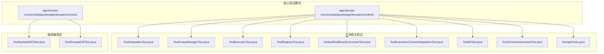
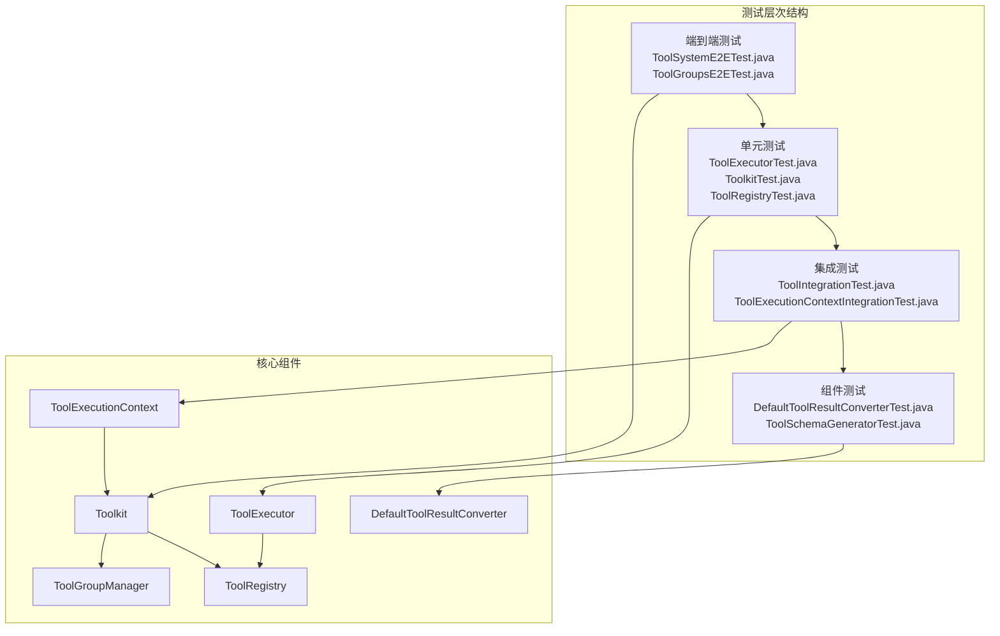
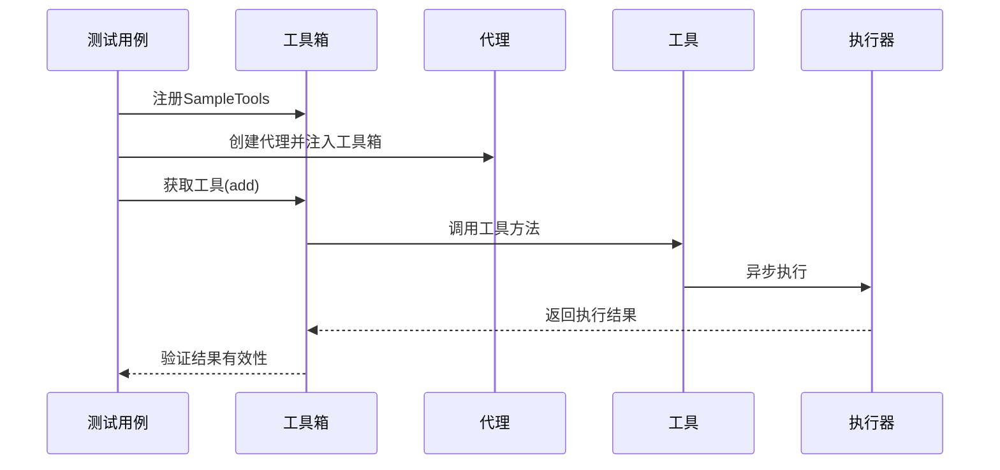
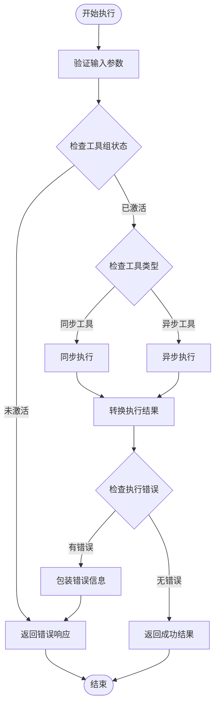
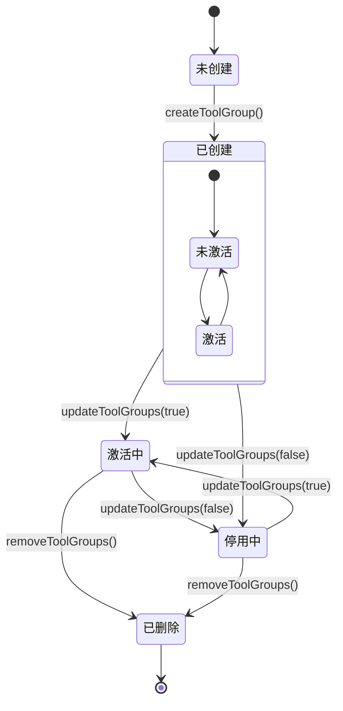
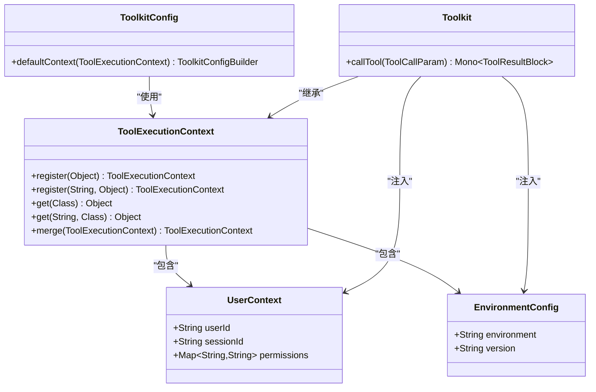
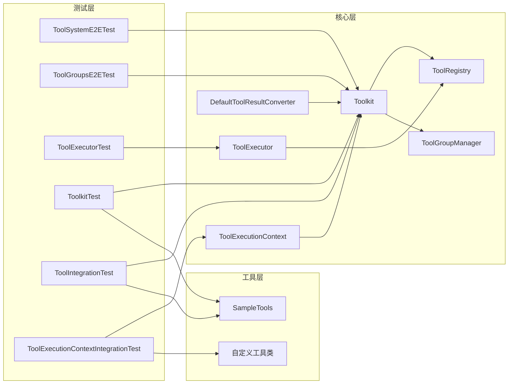

# 工具系统集成测试

<cite>
**本文档引用的文件**
- [ToolIntegrationTest.java](file://agentscope-core/src/test/java/io/agentscope/core/tool/ToolIntegrationTest.java)
- [ToolGroupManagerTest.java](file://agentscope-core/src/test/java/io/agentscope/core/tool/ToolGroupManagerTest.java)
- [ToolExecutorTest.java](file://agentscope-core/src/test/java/io/agentscope/core/tool/ToolExecutorTest.java)
- [ToolRegistryTest.java](file://agentscope-core/src/test/java/io/agentscope/core/tool/ToolRegistryTest.java)
- [DefaultToolResultConverterTest.java](file://agentscope-core/src/test/java/io/agentscope/core/tool/DefaultToolResultConverterTest.java)
- [ToolExecutionContextIntegrationTest.java](file://agentscope-core/src/test/java/io/agentscope/core/tool/ToolExecutionContextIntegrationTest.java)
- [ToolkitTest.java](file://agentscope-core/src/test/java/io/agentscope/core/tool/ToolkitTest.java)
- [ToolSchemaGeneratorTest.java](file://agentscope-core/src/test/java/io/agentscope/core/tool/ToolSchemaGeneratorTest.java)
- [ToolSystemE2ETest.java](file://agentscope-core/src/test/java/io/agentscope/core/e2e/ToolSystemE2ETest.java)
- [ToolGroupsE2ETest.java](file://agentscope-core/src/test/java/io/agentscope/core/e2e/ToolGroupsE2ETest.java)
- [SampleTools.java](file://agentscope-core/src/test/java/io/agentscope/core/tool/test/SampleTools.java)
</cite>

## 目录
1. [简介](#简介)
2. [项目结构](#项目结构)
3. [核心组件](#核心组件)
4. [架构概览](#架构概览)
5. [详细组件分析](#详细组件分析)
6. [依赖关系分析](#依赖关系分析)
7. [性能考虑](#性能考虑)
8. [故障排除指南](#故障排除指南)
9. [结论](#结论)
10. [附录](#附录)

## 简介

本文件为AgentScopeJava工具系统的集成测试技术文档，深入解释工具注册、执行和管理的端到端测试实现。文档涵盖了工具调用流程、工具组管理、工具转换器的综合测试方法，以及工具权限控制、执行上下文管理、错误处理的测试策略。同时提供了工具结果验证、性能监控和资源清理的测试实现，并包含完整的工具系统测试示例和配置指南。

## 项目结构

工具系统集成测试主要分布在以下目录结构中：



**图表来源**
- [ToolIntegrationTest.java:1-185](file://agentscope-core/src/test/java/io/agentscope/core/tool/ToolIntegrationTest.java#L1-L185)
- [ToolGroupManagerTest.java:1-485](file://agentscope-core/src/test/java/io/agentscope/core/tool/ToolGroupManagerTest.java#L1-L485)
- [ToolSystemE2ETest.java:1-328](file://agentscope-core/src/test/java/io/agentscope/core/e2e/ToolSystemE2ETest.java#L1-L328)

**章节来源**
- [ToolIntegrationTest.java:1-185](file://agentscope-core/src/test/java/io/agentscope/core/tool/ToolIntegrationTest.java#L1-L185)
- [ToolGroupManagerTest.java:1-485](file://agentscope-core/src/test/java/io/agentscope/core/tool/ToolGroupManagerTest.java#L1-L485)

## 核心组件

工具系统集成测试的核心组件包括：

### 工具注册与管理
- **ToolRegistry**: 工具注册表，负责工具的注册、查询和移除
- **Toolkit**: 工具箱，提供工具的统一管理接口
- **ToolGroupManager**: 工具组管理器，支持工具分组和权限控制

### 工具执行引擎
- **ToolExecutor**: 工具执行器，处理工具调用、并发执行和错误处理
- **ToolExecutionContext**: 执行上下文，管理工具执行时的环境信息

### 工具转换器
- **DefaultToolResultConverter**: 默认工具结果转换器，处理各种数据类型的序列化

**章节来源**
- [ToolRegistryTest.java:1-363](file://agentscope-core/src/test/java/io/agentscope/core/tool/ToolRegistryTest.java#L1-L363)
- [ToolkitTest.java:1-800](file://agentscope-core/src/test/java/io/agentscope/core/tool/ToolkitTest.java#L1-L800)
- [ToolGroupManagerTest.java:1-485](file://agentscope-core/src/test/java/io/agentscope/core/tool/ToolGroupManagerTest.java#L1-L485)

## 架构概览

工具系统集成测试采用分层架构设计，从单元测试到端到端测试形成完整的测试金字塔：



**图表来源**
- [ToolSystemE2ETest.java:1-328](file://agentscope-core/src/test/java/io/agentscope/core/e2e/ToolSystemE2ETest.java#L1-L328)
- [ToolExecutorTest.java:1-506](file://agentscope-core/src/test/java/io/agentscope/core/tool/ToolExecutorTest.java#L1-L506)

## 详细组件分析

### 工具注册与执行测试

#### 工具集成测试
工具集成测试验证了工具与代理的集成能力，包括异步执行、错误传播和超时处理：



**图表来源**
- [ToolIntegrationTest.java:63-92](file://agentscope-core/src/test/java/io/agentscope/core/tool/ToolIntegrationTest.java#L63-L92)
- [SampleTools.java:32-40](file://agentscope-core/src/test/java/io/agentscope/core/tool/test/SampleTools.java#L32-L40)

#### 工具执行器测试
工具执行器测试验证了并发执行、错误处理和参数预设功能：



**图表来源**
- [ToolExecutorTest.java:62-102](file://agentscope-core/src/test/java/io/agentscope/core/tool/ToolExecutorTest.java#L62-L102)
- [ToolkitTest.java:414-461](file://agentscope-core/src/test/java/io/agentscope/core/tool/ToolkitTest.java#L414-L461)

**章节来源**
- [ToolIntegrationTest.java:1-185](file://agentscope-core/src/test/java/io/agentscope/core/tool/ToolIntegrationTest.java#L1-L185)
- [ToolExecutorTest.java:1-506](file://agentscope-core/src/test/java/io/agentscope/core/tool/ToolExecutorTest.java#L1-L506)

### 工具组管理测试

#### 工具组生命周期管理
工具组管理测试覆盖了工具组的创建、激活、停用和删除等完整生命周期：



**图表来源**
- [ToolGroupManagerTest.java:39-122](file://agentscope-core/src/test/java/io/agentscope/core/tool/ToolGroupManagerTest.java#L39-L122)
- [ToolGroupsE2ETest.java:87-174](file://agentscope-core/src/test/java/io/agentscope/core/e2e/ToolGroupsE2ETest.java#L87-L174)

#### 权限控制测试
权限控制测试验证了工具组对工具访问的控制机制：

**章节来源**
- [ToolGroupManagerTest.java:1-485](file://agentscope-core/src/test/java/io/agentscope/core/tool/ToolGroupManagerTest.java#L1-L485)
- [ToolkitTest.java:414-461](file://agentscope-core/src/test/java/io/agentscope/core/tool/ToolkitTest.java#L414-L461)

### 执行上下文管理测试

#### 上下文层次结构
执行上下文测试验证了多层级上下文的合并和优先级机制：



**图表来源**
- [ToolExecutionContextIntegrationTest.java:158-203](file://agentscope-core/src/test/java/io/agentscope/core/tool/ToolExecutionContextIntegrationTest.java#L158-L203)
- [ToolExecutionContextIntegrationTest.java:205-257](file://agentscope-core/src/test/java/io/agentscope/core/tool/ToolExecutionContextIntegrationTest.java#L205-L257)

**章节来源**
- [ToolExecutionContextIntegrationTest.java:1-411](file://agentscope-core/src/test/java/io/agentscope/core/tool/ToolExecutionContextIntegrationTest.java#L1-L411)

### 工具转换器测试

#### 结果转换验证
工具转换器测试验证了各种数据类型的序列化和反序列化：

**章节来源**
- [DefaultToolResultConverterTest.java:1-336](file://agentscope-core/src/test/java/io/agentscope/core/tool/DefaultToolResultConverterTest.java#L1-L336)

## 依赖关系分析

工具系统集成测试的依赖关系呈现清晰的分层结构：



**图表来源**
- [ToolSystemE2ETest.java:66-97](file://agentscope-core/src/test/java/io/agentscope/core/e2e/ToolSystemE2ETest.java#L66-L97)
- [ToolExecutorTest.java:52-61](file://agentscope-core/src/test/java/io/agentscope/core/tool/ToolExecutorTest.java#L52-L61)

**章节来源**
- [ToolRegistryTest.java:34-53](file://agentscope-core/src/test/java/io/agentscope/core/tool/ToolRegistryTest.java#L34-L53)
- [ToolkitTest.java:60-67](file://agentscope-core/src/test/java/io/agentscope/core/tool/ToolkitTest.java#L60-L67)

## 性能考虑

工具系统集成测试在性能方面采用了多种优化策略：

### 并发执行优化
- 使用Reactor框架进行非阻塞异步执行
- 支持工具间的并行调用，提高整体吞吐量
- 实现了合理的线程池配置和资源管理

### 内存管理
- 工具结果转换器支持流式处理，减少内存占用
- 执行上下文采用轻量级对象设计
- 及时释放不再使用的资源和连接

### 错误处理效率
- 统一的错误包装机制，避免重复的异常处理代码
- 快速失败策略，在工具组未激活时立即返回错误
- 缓存常用工具的元数据，减少反射开销

## 故障排除指南

### 常见问题及解决方案

#### 工具组权限问题
当工具调用返回"Unauthorized"或"not available"错误时：
1. 检查工具组是否处于激活状态
2. 验证工具是否正确分配到相应的工具组
3. 确认工具组的激活状态是否符合预期

#### 执行上下文注入失败
当工具无法获取所需的上下文信息时：
1. 验证上下文对象的类型和键值
2. 检查上下文的注册顺序和优先级
3. 确认工具方法签名中的上下文参数声明

#### 结果转换异常
当工具结果转换失败时：
1. 检查工具返回对象的序列化能力
2. 验证自定义转换器的配置
3. 确认JSON Schema的兼容性

**章节来源**
- [ToolkitTest.java:454-461](file://agentscope-core/src/test/java/io/agentscope/core/tool/ToolkitTest.java#L454-L461)
- [ToolExecutionContextIntegrationTest.java:285-288](file://agentscope-core/src/test/java/io/agentscope/core/tool/ToolExecutionContextIntegrationTest.java#L285-L288)

## 结论

AgentScopeJava工具系统的集成测试实现了从单元测试到端到端测试的完整测试体系。通过精心设计的测试用例，验证了工具注册、执行、管理的各个方面，包括：

- **完整性**: 覆盖了工具系统的所有核心功能
- **可靠性**: 通过大量边界条件和异常场景测试
- **可维护性**: 清晰的测试分层和模块化设计
- **可扩展性**: 易于添加新的测试场景和工具类型

该测试体系为工具系统的稳定运行提供了坚实保障，确保了在复杂应用场景下的可靠性和性能表现。

## 附录

### 测试配置指南

#### 环境要求
- JDK 8或更高版本
- Maven 3.6或更高版本
- 必要的API密钥（用于端到端测试）

#### 运行测试
```bash
# 运行所有工具相关测试
mvn test -Dtest="*Tool*Test"

# 运行端到端测试
mvn test -Dtest="*E2ETest"

# 运行特定测试套件
mvn test -Dtest="ToolIntegrationTest,ToolGroupManagerTest"
```

#### 自定义工具测试
1. 创建工具类并使用`@Tool`注解
2. 在测试中注册工具实例
3. 编写相应的断言验证工具行为
4. 使用`ToolTestUtils`辅助验证工具结果