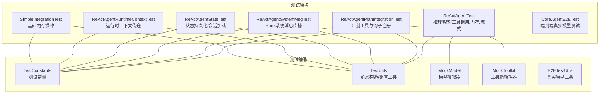
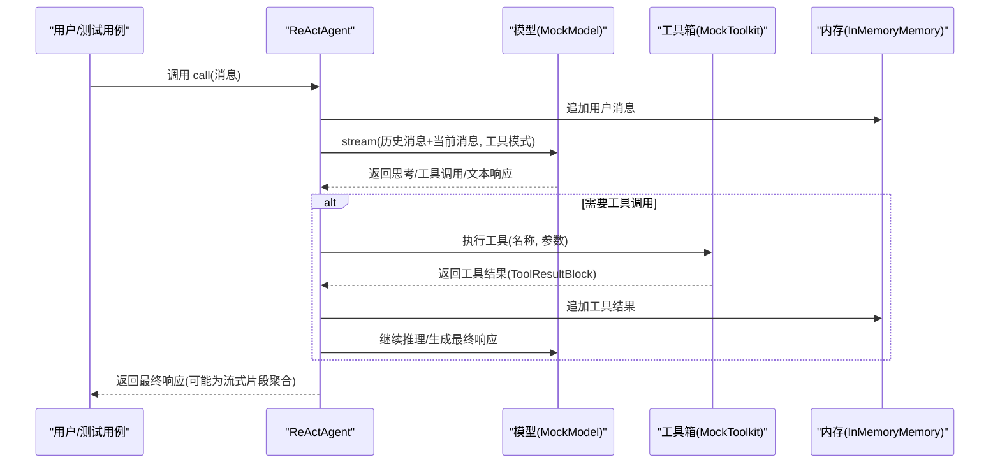
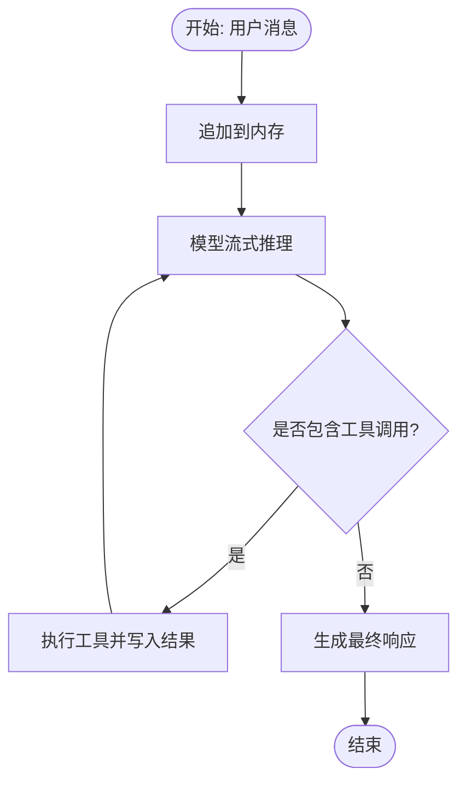
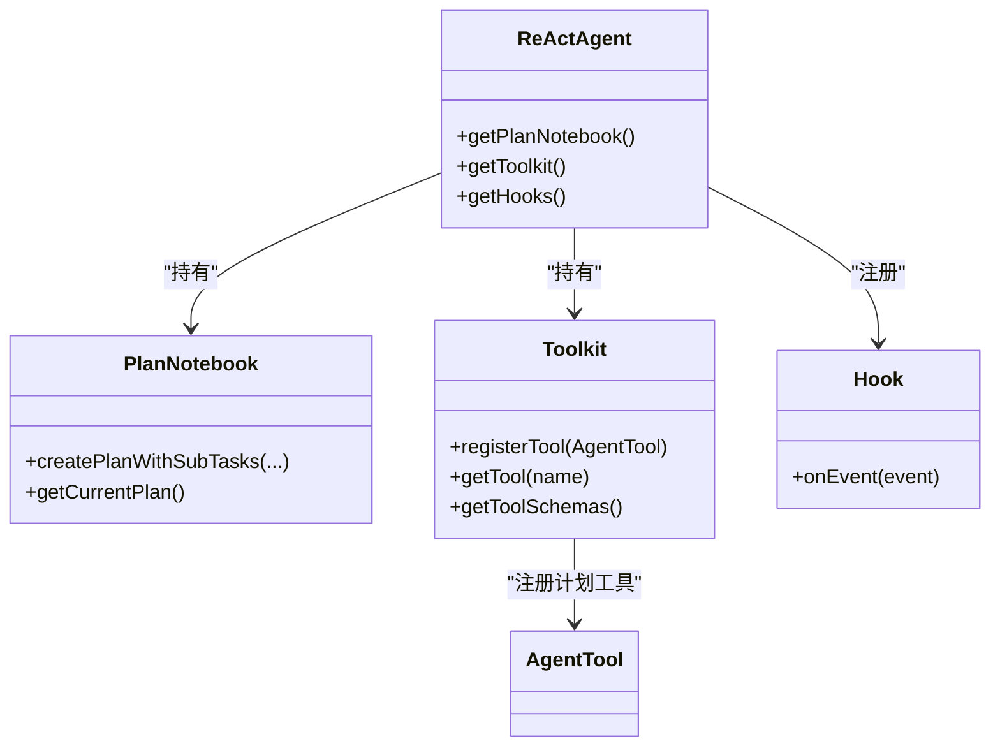
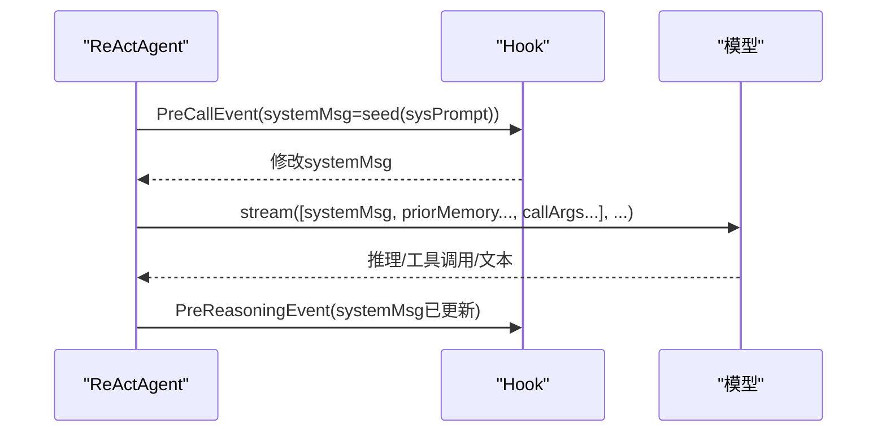
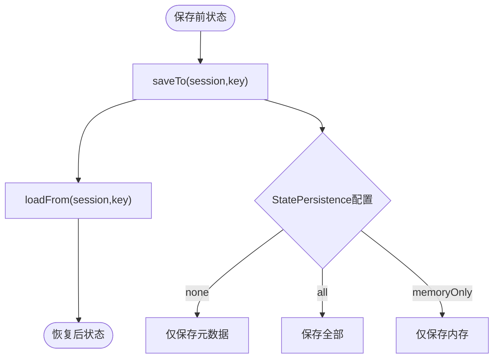
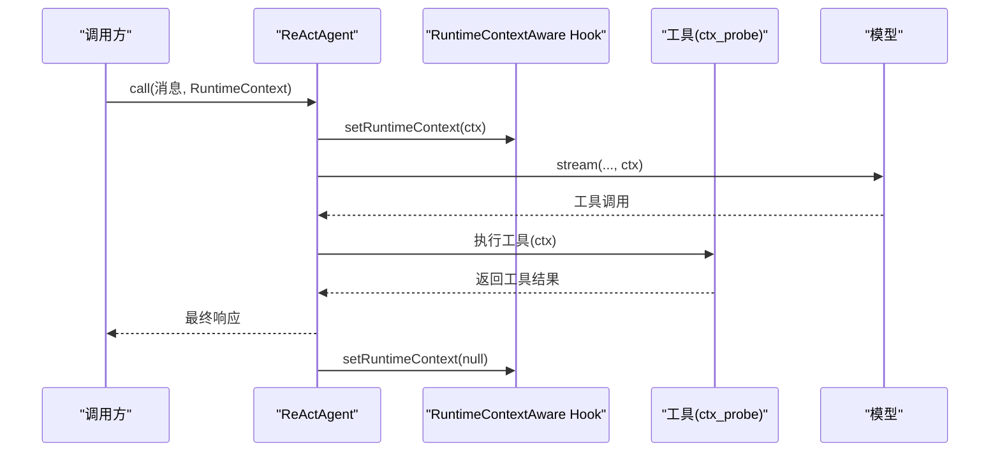
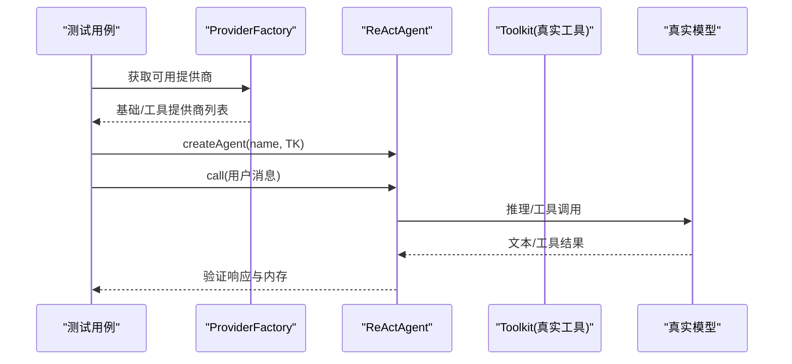
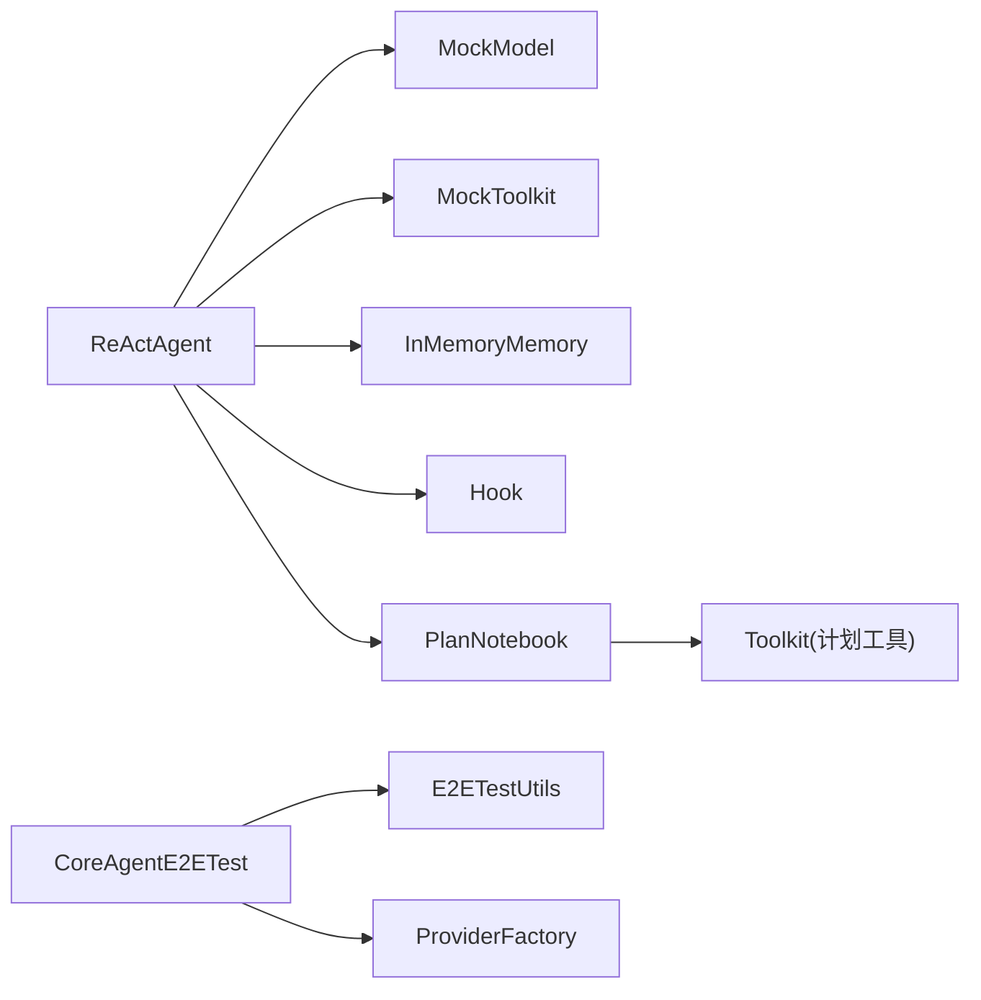

# 核心智能体集成测试

<cite>
**本文档引用的文件**
- [ReActAgentTest.java](file://agentscope-core/src/test/java/io/agentscope/core/agent/ReActAgentTest.java)
- [ReActAgentPlanIntegrationTest.java](file://agentscope-core/src/test/java/io/agentscope/core/agent/ReActAgentPlanIntegrationTest.java)
- [CoreAgentE2ETest.java](file://agentscope-core/src/test/java/io/agentscope/core/e2e/CoreAgentE2ETest.java)
- [E2ETestUtils.java](file://agentscope-core/src/test/java/io/agentscope/core/e2e/E2ETestUtils.java)
- [ReActAgentSystemMsgTest.java](file://agentscope-core/src/test/java/io/agentscope/core/hook/ReActAgentSystemMsgTest.java)
- [ReActAgentStateTest.java](file://agentscope-core/src/test/java/io/agentscope/core/agent/ReActAgentStateTest.java)
- [ReActAgentRuntimeContextTest.java](file://agentscope-core/src/test/java/io/agentscope/core/agent/ReActAgentRuntimeContextTest.java)
- [TestConstants.java](file://agentscope-core/src/test/java/io/agentscope/core/agent/test/TestConstants.java)
- [TestUtils.java](file://agentscope-core/src/test/java/io/agentscope/core/agent/test/TestUtils.java)
- [MockModel.java](file://agentscope-core/src/test/java/io/agentscope/core/agent/test/MockModel.java)
- [MockToolkit.java](file://agentscope-core/src/test/java/io/agentscope/core/agent/test/MockToolkit.java)
- [SimpleIntegrationTest.java](file://agentscope-core/src/test/java/io/agentscope/core/SimpleIntegrationTest.java)
</cite>

## 目录
1. [简介](#简介)
2. [项目结构](#项目结构)
3. [核心组件](#核心组件)
4. [架构总览](#架构总览)
5. [详细组件分析](#详细组件分析)
6. [依赖关系分析](#依赖关系分析)
7. [性能考虑](#性能考虑)
8. [故障排查指南](#故障排查指南)
9. [结论](#结论)
10. [附录](#附录)

## 简介
本文件面向核心智能体（ReAct 智能体）在真实环境中的端到端集成测试，系统性阐述以下内容：
- ReAct 智能体在真实环境中的推理循环、工具调用、内存管理与 Hook 系统的综合测试方法
- 测试环境配置、测试数据准备与测试流程执行
- 智能体状态管理、响应验证与性能指标测试策略
- 完整测试示例与配置指南：覆盖智能体生命周期、多轮对话、错误处理等场景

## 项目结构
围绕 ReAct 智能体的集成测试，相关代码主要分布在以下模块：
- 单元与集成测试：agentscope-core/src/test/java/io/agentscope/core/agent 与 e2e
- Hook 测试：agentscope-core/src/test/java/io/agentscope/core/hook
- 工具与模型模拟：agentscope-core/src/test/java/io/agentscope/core/agent/test
- 示例与辅助工具：agentscope-core/src/test/java/io/agentscope/core/SimpleIntegrationTest.java

**图表来源**
- [ReActAgentTest.java:1-1055](file://agentscope-core/src/test/java/io/agentscope/core/agent/ReActAgentTest.java#L1-L1055)
- [ReActAgentPlanIntegrationTest.java:1-347](file://agentscope-core/src/test/java/io/agentscope/core/agent/ReActAgentPlanIntegrationTest.java#L1-L347)
- [CoreAgentE2ETest.java:1-283](file://agentscope-core/src/test/java/io/agentscope/core/e2e/CoreAgentE2ETest.java#L1-L283)
- [ReActAgentSystemMsgTest.java:1-331](file://agentscope-core/src/test/java/io/agentscope/core/hook/ReActAgentSystemMsgTest.java#L1-L331)
- [ReActAgentStateTest.java:1-584](file://agentscope-core/src/test/java/io/agentscope/core/agent/ReActAgentStateTest.java#L1-L584)
- [ReActAgentRuntimeContextTest.java:1-214](file://agentscope-core/src/test/java/io/agentscope/core/agent/ReActAgentRuntimeContextTest.java#L1-L214)
- [SimpleIntegrationTest.java:1-57](file://agentscope-core/src/test/java/io/agentscope/core/SimpleIntegrationTest.java#L1-L57)
- [TestConstants.java:1-65](file://agentscope-core/src/test/java/io/agentscope/core/agent/test/TestConstants.java#L1-L65)
- [TestUtils.java:1-195](file://agentscope-core/src/test/java/io/agentscope/core/agent/test/TestUtils.java#L1-L195)
- [MockModel.java:1-234](file://agentscope-core/src/test/java/io/agentscope/core/agent/test/MockModel.java#L1-L234)
- [MockToolkit.java:1-205](file://agentscope-core/src/test/java/io/agentscope/core/agent/test/MockToolkit.java#L1-L205)
- [E2ETestUtils.java:1-190](file://agentscope-core/src/test/java/io/agentscope/core/e2e/E2ETestUtils.java#L1-L190)

**章节来源**
- [ReActAgentTest.java:1-1055](file://agentscope-core/src/test/java/io/agentscope/core/agent/ReActAgentTest.java#L1-L1055)
- [ReActAgentPlanIntegrationTest.java:1-347](file://agentscope-core/src/test/java/io/agentscope/core/agent/ReActAgentPlanIntegrationTest.java#L1-L347)
- [CoreAgentE2ETest.java:1-283](file://agentscope-core/src/test/java/io/agentscope/core/e2e/CoreAgentE2ETest.java#L1-L283)
- [ReActAgentSystemMsgTest.java:1-331](file://agentscope-core/src/test/java/io/agentscope/core/hook/ReActAgentSystemMsgTest.java#L1-L331)
- [ReActAgentStateTest.java:1-584](file://agentscope-core/src/test/java/io/agentscope/core/agent/ReActAgentStateTest.java#L1-L584)
- [ReActAgentRuntimeContextTest.java:1-214](file://agentscope-core/src/test/java/io/agentscope/core/agent/ReActAgentRuntimeContextTest.java#L1-L214)
- [SimpleIntegrationTest.java:1-57](file://agentscope-core/src/test/java/io/agentscope/core/SimpleIntegrationTest.java#L1-L57)
- [TestConstants.java:1-65](file://agentscope-core/src/test/java/io/agentscope/core/agent/test/TestConstants.java#L1-L65)
- [TestUtils.java:1-195](file://agentscope-core/src/test/java/io/agentscope/core/agent/test/TestUtils.java#L1-L195)
- [MockModel.java:1-234](file://agentscope-core/src/test/java/io/agentscope/core/agent/test/MockModel.java#L1-L234)
- [MockToolkit.java:1-205](file://agentscope-core/src/test/java/io/agentscope/core/agent/test/MockToolkit.java#L1-L205)
- [E2ETestUtils.java:1-190](file://agentscope-core/src/test/java/io/agentscope/core/e2e/E2ETestUtils.java#L1-L190)

## 核心组件
- ReActAgent：核心智能体，负责推理循环、工具调用、记忆维护与流式输出
- MockModel：可配置的模型模拟器，支持思考块、工具调用与文本响应
- MockToolkit：可配置的工具箱模拟器，支持自定义工具行为与错误模拟
- 测试工具集：TestConstants、TestUtils 提供统一的测试常量与消息构造/断言工具
- 真实模型工具：E2ETestUtils 提供基于真实模型的 Agent 创建与工具注册

**章节来源**
- [ReActAgentTest.java:73-92](file://agentscope-core/src/test/java/io/agentscope/core/agent/ReActAgentTest.java#L73-L92)
- [MockModel.java:42-113](file://agentscope-core/src/test/java/io/agentscope/core/agent/test/MockModel.java#L42-L113)
- [MockToolkit.java:36-114](file://agentscope-core/src/test/java/io/agentscope/core/agent/test/MockToolkit.java#L36-L114)
- [TestConstants.java:24-64](file://agentscope-core/src/test/java/io/agentscope/core/agent/test/TestConstants.java#L24-L64)
- [TestUtils.java:33-194](file://agentscope-core/src/test/java/io/agentscope/core/agent/test/TestUtils.java#L33-L194)
- [E2ETestUtils.java:37-190](file://agentscope-core/src/test/java/io/agentscope/core/e2e/E2ETestUtils.java#L37-L190)

## 架构总览
ReAct 智能体在测试中的典型交互路径如下：

**图表来源**
- [ReActAgentTest.java:113-139](file://agentscope-core/src/test/java/io/agentscope/core/agent/ReActAgentTest.java#L113-L139)
- [MockModel.java:114-141](file://agentscope-core/src/test/java/io/agentscope/core/agent/test/MockModel.java#L114-L141)
- [MockToolkit.java:140-163](file://agentscope-core/src/test/java/io/agentscope/core/agent/test/MockToolkit.java#L140-L163)

## 详细组件分析

### 推理循环与工具调用测试
- 基础初始化与简单回复：验证智能体属性、默认最大迭代次数、内存初始为空
- 思考与最终响应：模型返回思考块后返回最终文本
- 工具调用：模型返回工具调用块，智能体通过工具箱执行并写入工具结果
- 多工具顺序执行：验证工具调用顺序与内存中工具结果的存在
- 错误处理：工具执行异常时，内存中应包含错误结果
- 流式输出：模型分片返回时，智能体聚合为完整响应
- 继续生成：不传入新输入时，继续基于现有内存生成

**图表来源**
- [ReActAgentTest.java:141-173](file://agentscope-core/src/test/java/io/agentscope/core/agent/ReActAgentTest.java#L141-L173)
- [ReActAgentTest.java:175-237](file://agentscope-core/src/test/java/io/agentscope/core/agent/ReActAgentTest.java#L175-L237)
- [ReActAgentTest.java:239-314](file://agentscope-core/src/test/java/io/agentscope/core/agent/ReActAgentTest.java#L239-L314)
- [ReActAgentTest.java:316-383](file://agentscope-core/src/test/java/io/agentscope/core/agent/ReActAgentTest.java#L316-L383)
- [ReActAgentTest.java:562-585](file://agentscope-core/src/test/java/io/agentscope/core/agent/ReActAgentTest.java#L562-L585)
- [ReActAgentTest.java:587-625](file://agentscope-core/src/test/java/io/agentscope/core/agent/ReActAgentTest.java#L587-L625)

**章节来源**
- [ReActAgentTest.java:94-109](file://agentscope-core/src/test/java/io/agentscope/core/agent/ReActAgentTest.java#L94-L109)
- [ReActAgentTest.java:111-139](file://agentscope-core/src/test/java/io/agentscope/core/agent/ReActAgentTest.java#L111-L139)
- [ReActAgentTest.java:141-173](file://agentscope-core/src/test/java/io/agentscope/core/agent/ReActAgentTest.java#L141-L173)
- [ReActAgentTest.java:175-237](file://agentscope-core/src/test/java/io/agentscope/core/agent/ReActAgentTest.java#L175-L237)
- [ReActAgentTest.java:239-314](file://agentscope-core/src/test/java/io/agentscope/core/agent/ReActAgentTest.java#L239-L314)
- [ReActAgentTest.java:316-383](file://agentscope-core/src/test/java/io/agentscope/core/agent/ReActAgentTest.java#L316-L383)
- [ReActAgentTest.java:562-585](file://agentscope-core/src/test/java/io/agentscope/core/agent/ReActAgentTest.java#L562-L585)
- [ReActAgentTest.java:587-625](file://agentscope-core/src/test/java/io/agentscope/core/agent/ReActAgentTest.java#L587-L625)

### 计划工具与 Hook 自动注册测试
- PlanNotebook 配置：验证 PlanNotebook 实例可被访问与共享
- 默认启用计划：enablePlan() 创建默认 PlanNotebook
- 计划工具自动注册：验证 create_plan、finish_plan、update_subtask_state、finish_subtask 等工具存在
- 计划提示 Hook：验证 PreReasoningEvent 中注入 system-hint 标记的消息
- 无 PlanNotebook 场景：未配置时不注册计划工具
- 工具 Schema 获取：验证工具 Schema 包含计划工具

**图表来源**
- [ReActAgentPlanIntegrationTest.java:74-91](file://agentscope-core/src/test/java/io/agentscope/core/agent/ReActAgentPlanIntegrationTest.java#L74-L91)
- [ReActAgentPlanIntegrationTest.java:93-106](file://agentscope-core/src/test/java/io/agentscope/core/agent/ReActAgentPlanIntegrationTest.java#L93-L106)
- [ReActAgentPlanIntegrationTest.java:108-138](file://agentscope-core/src/test/java/io/agentscope/core/agent/ReActAgentPlanIntegrationTest.java#L108-L138)
- [ReActAgentPlanIntegrationTest.java:140-207](file://agentscope-core/src/test/java/io/agentscope/core/agent/ReActAgentPlanIntegrationTest.java#L140-L207)
- [ReActAgentPlanIntegrationTest.java:209-229](file://agentscope-core/src/test/java/io/agentscope/core/agent/ReActAgentPlanIntegrationTest.java#L209-L229)
- [ReActAgentPlanIntegrationTest.java:326-345](file://agentscope-core/src/test/java/io/agentscope/core/agent/ReActAgentPlanIntegrationTest.java#L326-L345)

**章节来源**
- [ReActAgentPlanIntegrationTest.java:74-91](file://agentscope-core/src/test/java/io/agentscope/core/agent/ReActAgentPlanIntegrationTest.java#L74-L91)
- [ReActAgentPlanIntegrationTest.java:93-106](file://agentscope-core/src/test/java/io/agentscope/core/agent/ReActAgentPlanIntegrationTest.java#L93-L106)
- [ReActAgentPlanIntegrationTest.java:108-138](file://agentscope-core/src/test/java/io/agentscope/core/agent/ReActAgentPlanIntegrationTest.java#L108-L138)
- [ReActAgentPlanIntegrationTest.java:140-207](file://agentscope-core/src/test/java/io/agentscope/core/agent/ReActAgentPlanIntegrationTest.java#L140-L207)
- [ReActAgentPlanIntegrationTest.java:209-229](file://agentscope-core/src/test/java/io/agentscope/core/agent/ReActAgentPlanIntegrationTest.java#L209-L229)
- [ReActAgentPlanIntegrationTest.java:326-345](file://agentscope-core/src/test/java/io/agentscope/core/agent/ReActAgentPlanIntegrationTest.java#L326-L345)

### Hook 系统消息传播测试
- sysPrompt 种子化为 systemMsg：PreCallEvent 触发前，systemMsg 来源于 sysPrompt
- Hook 修改 systemMsg 并传播至 PreReasoningEvent：验证 systemMsg 在推理阶段可用
- systemMsg 注入到模型输入首条消息：确保首条消息为 SYSTEM 角色
- PreCallEvent 输入视图：inputMessages 同时包含内存快照与调用参数
- 尾部注入 SYSTEM 的保护：禁止在 inputMessages 尾部注入 SYSTEM 消息

**图表来源**
- [ReActAgentSystemMsgTest.java:96-129](file://agentscope-core/src/test/java/io/agentscope/core/hook/ReActAgentSystemMsgTest.java#L96-L129)
- [ReActAgentSystemMsgTest.java:175-230](file://agentscope-core/src/test/java/io/agentscope/core/hook/ReActAgentSystemMsgTest.java#L175-L230)
- [ReActAgentSystemMsgTest.java:239-282](file://agentscope-core/src/test/java/io/agentscope/core/hook/ReActAgentSystemMsgTest.java#L239-L282)
- [ReActAgentSystemMsgTest.java:289-329](file://agentscope-core/src/test/java/io/agentscope/core/hook/ReActAgentSystemMsgTest.java#L289-L329)

**章节来源**
- [ReActAgentSystemMsgTest.java:96-129](file://agentscope-core/src/test/java/io/agentscope/core/hook/ReActAgentSystemMsgTest.java#L96-L129)
- [ReActAgentSystemMsgTest.java:175-230](file://agentscope-core/src/test/java/io/agentscope/core/hook/ReActAgentSystemMsgTest.java#L175-L230)
- [ReActAgentSystemMsgTest.java:239-282](file://agentscope-core/src/test/java/io/agentscope/core/hook/ReActAgentSystemMsgTest.java#L239-L282)
- [ReActAgentSystemMsgTest.java:289-329](file://agentscope-core/src/test/java/io/agentscope/core/hook/ReActAgentSystemMsgTest.java#L289-L329)

### 状态持久化与会话加载测试
- 元数据保存/加载：agent 名称、描述、系统提示、ID
- 内存保存/加载：消息列表恢复
- 工具箱保存/加载：activeGroups 恢复
- 计划笔记本保存/加载：当前计划与子任务恢复
- StatePersistence 配置：none/all/memoryOnly 精确控制保存范围
- JsonSession 集成：文件系统持久化与增量保存

**图表来源**
- [ReActAgentStateTest.java:68-88](file://agentscope-core/src/test/java/io/agentscope/core/agent/ReActAgentStateTest.java#L68-L88)
- [ReActAgentStateTest.java:109-136](file://agentscope-core/src/test/java/io/agentscope/core/agent/ReActAgentStateTest.java#L109-L136)
- [ReActAgentStateTest.java:173-194](file://agentscope-core/src/test/java/io/agentscope/core/agent/ReActAgentStateTest.java#L173-L194)
- [ReActAgentStateTest.java:261-296](file://agentscope-core/src/test/java/io/agentscope/core/agent/ReActAgentStateTest.java#L261-L296)
- [ReActAgentStateTest.java:333-425](file://agentscope-core/src/test/java/io/agentscope/core/agent/ReActAgentStateTest.java#L333-L425)
- [ReActAgentStateTest.java:477-523](file://agentscope-core/src/test/java/io/agentscope/core/agent/ReActAgentStateTest.java#L477-L523)

**章节来源**
- [ReActAgentStateTest.java:68-88](file://agentscope-core/src/test/java/io/agentscope/core/agent/ReActAgentStateTest.java#L68-L88)
- [ReActAgentStateTest.java:109-136](file://agentscope-core/src/test/java/io/agentscope/core/agent/ReActAgentStateTest.java#L109-L136)
- [ReActAgentStateTest.java:173-194](file://agentscope-core/src/test/java/io/agentscope/core/agent/ReActAgentStateTest.java#L173-L194)
- [ReActAgentStateTest.java:261-296](file://agentscope-core/src/test/java/io/agentscope/core/agent/ReActAgentStateTest.java#L261-L296)
- [ReActAgentStateTest.java:333-425](file://agentscope-core/src/test/java/io/agentscope/core/agent/ReActAgentStateTest.java#L333-L425)
- [ReActAgentStateTest.java:477-523](file://agentscope-core/src/test/java/io/agentscope/core/agent/ReActAgentStateTest.java#L477-L523)

### 运行时上下文传递测试
- RuntimeContextAware + 工具：Hook 与工具在同一调用周期内看到一致的上下文
- 上下文字段：userId、自定义对象（如 SharedPojo）
- 生命周期：进入 PreReasoningEvent 设置上下文，退出时清理

**图表来源**
- [ReActAgentRuntimeContextTest.java:85-144](file://agentscope-core/src/test/java/io/agentscope/core/agent/ReActAgentRuntimeContextTest.java#L85-L144)

**章节来源**
- [ReActAgentRuntimeContextTest.java:85-144](file://agentscope-core/src/test/java/io/agentscope/core/agent/ReActAgentRuntimeContextTest.java#L85-L144)

### 端到端真实模型测试
- 基础对话：跨多个模型提供商（OpenAI/DashScope）验证基本问答
- 多轮对话：验证上下文保留与内存增长
- 混合对话：有工具与无工具交替
- 工具调用：使用真实工具计算并验证结果
- 错误处理：业务工具抛错时的优雅降级与解释
- 提供商配置：根据环境变量启用不同提供商

**图表来源**
- [CoreAgentE2ETest.java:58-85](file://agentscope-core/src/test/java/io/agentscope/core/e2e/CoreAgentE2ETest.java#L58-L85)
- [CoreAgentE2ETest.java:87-127](file://agentscope-core/src/test/java/io/agentscope/core/e2e/CoreAgentE2ETest.java#L87-L127)
- [CoreAgentE2ETest.java:129-172](file://agentscope-core/src/test/java/io/agentscope/core/e2e/CoreAgentE2ETest.java#L129-L172)
- [CoreAgentE2ETest.java:174-207](file://agentscope-core/src/test/java/io/agentscope/core/e2e/CoreAgentE2ETest.java#L174-L207)
- [CoreAgentE2ETest.java:209-246](file://agentscope-core/src/test/java/io/agentscope/core/e2e/CoreAgentE2ETest.java#L209-L246)
- [E2ETestUtils.java:43-70](file://agentscope-core/src/test/java/io/agentscope/core/e2e/E2ETestUtils.java#L43-L70)
- [E2ETestUtils.java:77-82](file://agentscope-core/src/test/java/io/agentscope/core/e2e/E2ETestUtils.java#L77-L82)

**章节来源**
- [CoreAgentE2ETest.java:58-85](file://agentscope-core/src/test/java/io/agentscope/core/e2e/CoreAgentE2ETest.java#L58-L85)
- [CoreAgentE2ETest.java:87-127](file://agentscope-core/src/test/java/io/agentscope/core/e2e/CoreAgentE2ETest.java#L87-L127)
- [CoreAgentE2ETest.java:129-172](file://agentscope-core/src/test/java/io/agentscope/core/e2e/CoreAgentE2ETest.java#L129-L172)
- [CoreAgentE2ETest.java:174-207](file://agentscope-core/src/test/java/io/agentscope/core/e2e/CoreAgentE2ETest.java#L174-L207)
- [CoreAgentE2ETest.java:209-246](file://agentscope-core/src/test/java/io/agentscope/core/e2e/CoreAgentE2ETest.java#L209-L246)
- [E2ETestUtils.java:43-70](file://agentscope-core/src/test/java/io/agentscope/core/e2e/E2ETestUtils.java#L43-L70)
- [E2ETestUtils.java:77-82](file://agentscope-core/src/test/java/io/agentscope/core/e2e/E2ETestUtils.java#L77-L82)

### 基础内存操作测试
- 添加消息与清空内存：验证内存容量与清空行为

**章节来源**
- [SimpleIntegrationTest.java:28-55](file://agentscope-core/src/test/java/io/agentscope/core/SimpleIntegrationTest.java#L28-L55)

## 依赖关系分析
- ReActAgent 依赖 MockModel 与 MockToolkit 进行单元测试；依赖 InMemoryMemory 进行状态存储
- 计划功能通过 PlanNotebook 与 Toolkit 注册计划工具；Hook 在事件链中传播 systemMsg
- 真实模型测试依赖 E2ETestUtils 与 ProviderFactory 动态选择模型提供商
- 测试工具集（TestConstants/TestUtils）贯穿所有测试用例，保证一致性

**图表来源**
- [ReActAgentTest.java:73-92](file://agentscope-core/src/test/java/io/agentscope/core/agent/ReActAgentTest.java#L73-L92)
- [ReActAgentPlanIntegrationTest.java:74-91](file://agentscope-core/src/test/java/io/agentscope/core/agent/ReActAgentPlanIntegrationTest.java#L74-L91)
- [CoreAgentE2ETest.java:58-67](file://agentscope-core/src/test/java/io/agentscope/core/e2e/CoreAgentE2ETest.java#L58-L67)
- [E2ETestUtils.java:43-70](file://agentscope-core/src/test/java/io/agentscope/core/e2e/E2ETestUtils.java#L43-L70)

**章节来源**
- [ReActAgentTest.java:73-92](file://agentscope-core/src/test/java/io/agentscope/core/agent/ReActAgentTest.java#L73-L92)
- [ReActAgentPlanIntegrationTest.java:74-91](file://agentscope-core/src/test/java/io/agentscope/core/agent/ReActAgentPlanIntegrationTest.java#L74-L91)
- [CoreAgentE2ETest.java:58-67](file://agentscope-core/src/test/java/io/agentscope/core/e2e/CoreAgentE2ETest.java#L58-L67)
- [E2ETestUtils.java:43-70](file://agentscope-core/src/test/java/io/agentscope/core/e2e/E2ETestUtils.java#L43-L70)

## 性能考虑
- 流式响应：通过模型分片返回与智能体聚合，降低首字节延迟
- 最大迭代限制：防止无限循环，保障测试稳定性
- 内存增长控制：结合测试常量与工具断言，避免内存无限膨胀
- 真实模型超时：端到端测试设置合理超时，避免长时间阻塞

[本节为通用指导，无需特定文件来源]

## 故障排查指南
- 工具调用失败：检查工具箱是否正确注册、参数是否匹配、异常是否被捕获并写入工具结果
- 模型错误：确认 MockModel 是否配置了 withError，或真实模型 API Key 是否正确
- Hook 注入 SYSTEM 失败：确保仅在 inputMessages 头部注入，尾部禁止注入
- 状态未恢复：核对 StatePersistence 配置与保存键值，确认 JsonSession 文件路径与权限
- 多轮对话上下文丢失：检查内存是否持续增长，消息角色与顺序是否正确

**章节来源**
- [ReActAgentTest.java:316-383](file://agentscope-core/src/test/java/io/agentscope/core/agent/ReActAgentTest.java#L316-L383)
- [ReActAgentSystemMsgTest.java:289-329](file://agentscope-core/src/test/java/io/agentscope/core/hook/ReActAgentSystemMsgTest.java#L289-L329)
- [ReActAgentStateTest.java:333-425](file://agentscope-core/src/test/java/io/agentscope/core/agent/ReActAgentStateTest.java#L333-L425)
- [CoreAgentE2ETest.java:174-207](file://agentscope-core/src/test/java/io/agentscope/core/e2e/CoreAgentE2ETest.java#L174-L207)

## 结论
本测试体系通过单元、集成与端到端三层测试，全面覆盖 ReAct 智能体的核心能力：
- 推理循环与工具调用的正确性
- Hook 系统消息传播与上下文一致性
- 计划工具与 Hook 的自动注册机制
- 状态持久化与会话加载的可靠性
- 真实模型环境下的多轮对话与错误处理

建议在持续集成中：
- 优先运行单元与集成测试，快速反馈问题
- 在具备 API Key 的环境中运行端到端测试
- 使用合理的超时与最大迭代限制，保障测试稳定性

[本节为总结，无需特定文件来源]

## 附录

### 测试环境配置与准备
- 单元测试：使用 MockModel 与 MockToolkit，无需外部依赖
- 真实模型测试：设置环境变量（如 OPENAI_API_KEY 或 DASHSCOPE_API_KEY），由 ProviderFactory 动态启用
- 工具准备：通过 E2ETestUtils.createTestToolkit 注册数学与字符串工具

**章节来源**
- [CoreAgentE2ETest.java:40-53](file://agentscope-core/src/test/java/io/agentscope/core/e2e/CoreAgentE2ETest.java#L40-L53)
- [E2ETestUtils.java:43-82](file://agentscope-core/src/test/java/io/agentscope/core/e2e/E2ETestUtils.java#L43-L82)

### 测试流程执行示例
- 基础对话：创建 Agent → 发送用户消息 → 断言响应与内存大小
- 多轮对话：连续发送消息 → 验证上下文保留与历史消息数量
- 工具调用：请求使用工具 → 检查工具调用记录与工具结果消息
- 错误处理：触发工具异常 → 验证错误信息写入内存
- Hook 流程：注册 Hook → 观察 PreCallEvent/PreReasoningEvent 中 systemMsg 变化
- 状态持久化：保存到会话 → 新建 Agent 加载 → 验证元数据/内存/工具箱/计划恢复

**章节来源**
- [ReActAgentTest.java:111-139](file://agentscope-core/src/test/java/io/agentscope/core/agent/ReActAgentTest.java#L111-L139)
- [ReActAgentTest.java:587-625](file://agentscope-core/src/test/java/io/agentscope/core/agent/ReActAgentTest.java#L587-L625)
- [ReActAgentTest.java:175-237](file://agentscope-core/src/test/java/io/agentscope/core/agent/ReActAgentTest.java#L175-L237)
- [ReActAgentTest.java:316-383](file://agentscope-core/src/test/java/io/agentscope/core/agent/ReActAgentTest.java#L316-L383)
- [ReActAgentSystemMsgTest.java:175-230](file://agentscope-core/src/test/java/io/agentscope/core/hook/ReActAgentSystemMsgTest.java#L175-L230)
- [ReActAgentStateTest.java:68-88](file://agentscope-core/src/test/java/io/agentscope/core/agent/ReActAgentStateTest.java#L68-L88)