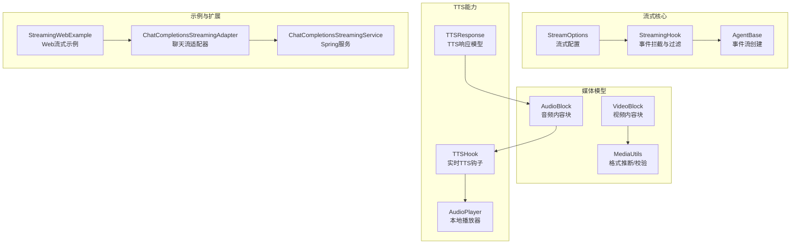
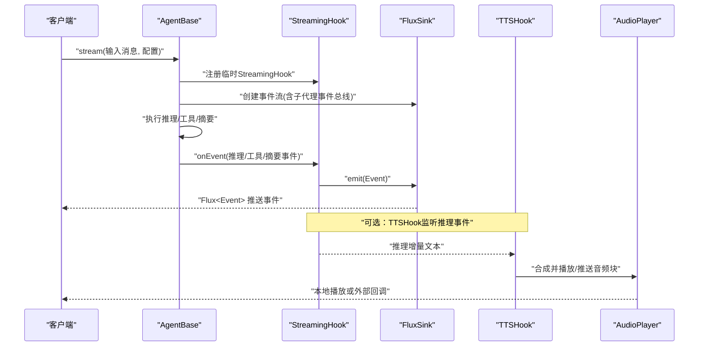
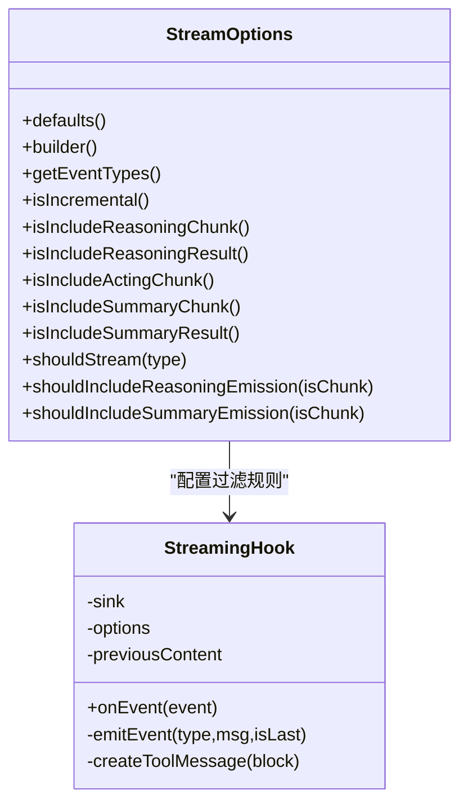
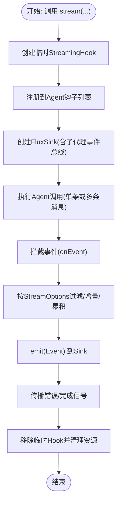
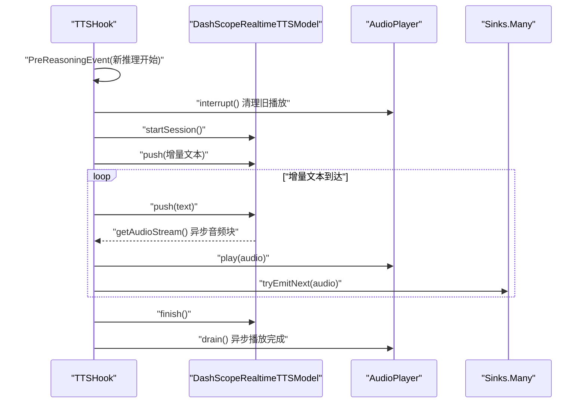
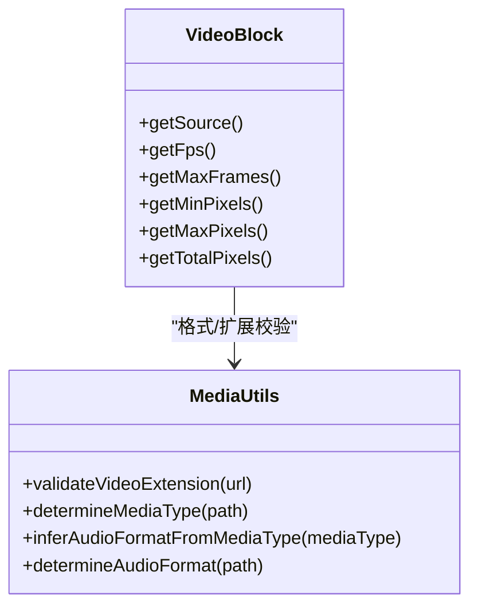
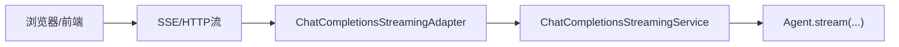
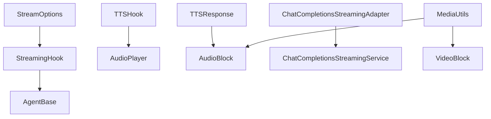

# 流式行为测试

<cite>
**本文引用的文件**
- [StreamOptions.java](file://agentscope-core/src/main/java/io/agentscope/core/agent/StreamOptions.java)
- [StreamingHook.java](file://agentscope-core/src/main/java/io/agentscope/core/agent/StreamingHook.java)
- [AgentBase.java](file://agentscope-core/src/main/java/io/agentscope/core/agent/AgentBase.java)
- [AgentStreamingTest.java](file://agentscope-core/src/test/java/io/agentscope/core/agent/AgentStreamingTest.java)
- [StreamOptionsTest.java](file://agentscope-core/src/test/java/io/agentscope/core/agent/StreamOptionsTest.java)
- [AudioBlock.java](file://agentscope-core/src/main/java/io/agentscope/core/message/AudioBlock.java)
- [VideoBlock.java](file://agentscope-core/src/main/java/io/agentscope/core/message/VideoBlock.java)
- [MediaUtils.java](file://agentscope-core/src/main/java/io/agentscope/core/formatter/MediaUtils.java)
- [OpenAIConverterUtils.java](file://agentscope-core/src/main/java/io/agentscope/core/formatter/openai/OpenAIConverterUtils.java)
- [TTSResponse.java](file://agentscope-core/src/main/java/io/agentscope/core/model/tts/TTSResponse.java)
- [TTSHook.java](file://agentscope-core/src/main/java/io/agentscope/core/hook/TTSHook.java)
- [AudioPlayer.java](file://agentscope-core/src/main/java/io/agentscope/core/model/tts/AudioPlayer.java)
- [AudioPlayerTest.java](file://agentscope-core/src/test/java/io/agentscope/core/model/tts/AudioPlayerTest.java)
- [TTSResponseTest.java](file://agentscope-core/src/test/java/io/agentscope/core/model/tts/TTSResponseTest.java)
- [StreamingBehaviorE2ETest.java](file://agentscope-core/src/test/java/io/agentscope/core/e2e/StreamingBehaviorE2ETest.java)
- [StreamingWebExample.java](file://agentscope-examples/quickstart/src/main/java/io/agentscope/examples/quickstart/StreamingWebExample.java)
- [ChatCompletionsStreamingAdapter.java](file://agentscope-extensions/agentscope-extensions-chat-completions-web/src/main/java/io/agentscope/core/chat/completions/streaming/ChatCompletionsStreamingAdapter.java)
- [ChatCompletionsStreamingAdapterTest.java](file://agentscope-extensions/agentscope-extensions-chat-completions-web/src/test/java/io/agentscope/core/chat/completions/streaming/ChatCompletionsStreamingAdapterTest.java)
- [ChatCompletionsStreamingService.java](file://agentscope-extensions/agentscope-spring-boot-starters/agentscope-chat-completions-web-starter/src/main/java/io/agentscope/spring/boot/chat/service/ChatCompletionsStreamingService.java)
- [ChatCompletionsStreamingServiceTest.java](file://agentscope-extensions/agentscope-spring-boot-starters/agentscope-chat-completions-web-starter/src/test/java/io/agentscope/spring/boot/chat/service/ChatCompletionsStreamingServiceTest.java)
- [OpenAIResponseParser.java](file://agentscope-core/src/main/java/io/agentscope/core/formatter/openai/OpenAIResponseParser.java)
- [README.md](file://README.md)
</cite>

## 目录
1. [简介](#简介)
2. [项目结构](#项目结构)
3. [核心组件](#核心组件)
4. [架构总览](#架构总览)
5. [详细组件分析](#详细组件分析)
6. [依赖分析](#依赖分析)
7. [性能考虑](#性能考虑)
8. [故障排查指南](#故障排查指南)
9. [结论](#结论)
10. [附录](#附录)

## 简介
本文件面向“流式行为测试”，系统化阐述在 AgentScope Java 中如何对流式响应、音频与视频能力进行端到端测试。内容覆盖：
- 流式数据传输、实时处理与状态同步的测试方法
- 流式性能监控、延迟测量与错误恢复策略
- 多媒体内容处理、格式转换与质量保证的测试实现
- 完整的流式行为测试示例与配置指南（流式响应、音频处理、视频处理）

## 项目结构
围绕流式行为测试的关键模块包括：
- 流式配置与钩子：StreamOptions、StreamingHook、AgentBase 的流式事件生成
- 媒体内容模型：AudioBlock、VideoBlock 及 MediaUtils 格式推断
- TTS 能力：TTSHook、AudioPlayer、TTSResponse 的合成与播放
- 示例与扩展：StreamingWebExample、ChatCompletionsStreamingAdapter、Spring Boot Starter
- 测试用例：AgentStreamingTest、AudioPlayerTest、TTSResponseTest、StreamingBehaviorE2ETest 等

图示来源
- [StreamOptions.java](file://agentscope-core/src/main/java/io/agentscope/core/agent/StreamOptions.java)
- [StreamingHook.java](file://agentscope-core/src/main/java/io/agentscope/core/agent/StreamingHook.java)
- [AgentBase.java](file://agentscope-core/src/main/java/io/agentscope/core/agent/AgentBase.java)
- [AudioBlock.java](file://agentscope-core/src/main/java/io/agentscope/core/message/AudioBlock.java)
- [VideoBlock.java](file://agentscope-core/src/main/java/io/agentscope/core/message/VideoBlock.java)
- [MediaUtils.java](file://agentscope-core/src/main/java/io/agentscope/core/formatter/MediaUtils.java)
- [TTSHook.java](file://agentscope-core/src/main/java/io/agentscope/core/hook/TTSHook.java)
- [AudioPlayer.java](file://agentscope-core/src/main/java/io/agentscope/core/model/tts/AudioPlayer.java)
- [TTSResponse.java](file://agentscope-core/src/main/java/io/agentscope/core/model/tts/TTSResponse.java)
- [StreamingWebExample.java](file://agentscope-examples/quickstart/src/main/java/io/agentscope/examples/quickstart/StreamingWebExample.java)
- [ChatCompletionsStreamingAdapter.java](file://agentscope-extensions/agentscope-extensions-chat-completions-web/src/main/java/io/agentscope/core/chat/completions/streaming/ChatCompletionsStreamingAdapter.java)
- [ChatCompletionsStreamingService.java](file://agentscope-extensions/agentscope-spring-boot-starters/agentscope-chat-completions-web-starter/src/main/java/io/agentscope/spring/boot/chat/service/ChatCompletionsStreamingService.java)

章节来源
- [README.md](file://README.md)

## 核心组件
- 流式配置与过滤：通过 StreamOptions 控制事件类型、增量/累积模式以及各类子事件（推理、工具调用、摘要）的包含策略。
- 事件拦截与过滤：StreamingHook 在事件生命周期中拦截并按配置过滤，支持增量差分与累积合并。
- 事件流创建：AgentBase 使用临时 StreamingHook 将事件注入 Flux，管理子代理事件总线与钩子生命周期。
- 媒体内容模型：AudioBlock/VideoBlock 支持 URL 与 Base64 源；MediaUtils 提供格式推断与扩展校验。
- TTS 能力：TTSHook 实现“边生成边播报”的实时 TTS；AudioPlayer 提供本地播放队列与中断；TTSResponse 提供统一音频输出模型。

章节来源
- [StreamOptions.java](file://agentscope-core/src/main/java/io/agentscope/core/agent/StreamOptions.java)
- [StreamingHook.java](file://agentscope-core/src/main/java/io/agentscope/core/agent/StreamingHook.java)
- [AgentBase.java](file://agentscope-core/src/main/java/io/agentscope/core/agent/AgentBase.java)
- [AudioBlock.java](file://agentscope-core/src/main/java/io/agentscope/core/message/AudioBlock.java)
- [VideoBlock.java](file://agentscope-core/src/main/java/io/agentscope/core/message/VideoBlock.java)
- [MediaUtils.java](file://agentscope-core/src/main/java/io/agentscope/core/formatter/MediaUtils.java)
- [TTSHook.java](file://agentscope-core/src/main/java/io/agentscope/core/hook/TTSHook.java)
- [AudioPlayer.java](file://agentscope-core/src/main/java/io/agentscope/core/model/tts/AudioPlayer.java)
- [TTSResponse.java](file://agentscope-core/src/main/java/io/agentscope/core/model/tts/TTSResponse.java)

## 架构总览
下图展示从 Agent 执行到流式事件产出、再到 TTS 合成与播放的整体链路，以及媒体内容在消息中的承载方式。

图示来源
- [AgentBase.java](file://agentscope-core/src/main/java/io/agentscope/core/agent/AgentBase.java)
- [StreamingHook.java](file://agentscope-core/src/main/java/io/agentscope/core/agent/StreamingHook.java)
- [TTSHook.java](file://agentscope-core/src/main/java/io/agentscope/core/hook/TTSHook.java)
- [AudioPlayer.java](file://agentscope-core/src/main/java/io/agentscope/core/model/tts/AudioPlayer.java)

## 详细组件分析

### 组件A：流式配置与事件过滤（StreamOptions 与 StreamingHook）
- StreamOptions 提供事件类型集合、增量/累积模式、以及推理/工具/摘要子事件的包含策略。默认包含全部事件类型，并启用增量模式。
- StreamingHook 在事件生命周期中拦截推理、工具、摘要事件，依据 StreamOptions 决定是否发出增量或最终结果，并维护消息 ID 对应的内容快照以支持增量/累积逻辑。

图示来源
- [StreamOptions.java](file://agentscope-core/src/main/java/io/agentscope/core/agent/StreamOptions.java)
- [StreamingHook.java](file://agentscope-core/src/main/java/io/agentscope/core/agent/StreamingHook.java)

章节来源
- [StreamOptions.java](file://agentscope-core/src/main/java/io/agentscope/core/agent/StreamOptions.java)
- [StreamingHook.java](file://agentscope-core/src/main/java/io/agentscope/core/agent/StreamingHook.java)
- [AgentStreamingTest.java](file://agentscope-core/src/test/java/io/agentscope/core/agent/AgentStreamingTest.java)
- [StreamOptionsTest.java](file://agentscope-core/src/test/java/io/agentscope/core/agent/StreamOptionsTest.java)

### 组件B：事件流创建与状态同步（AgentBase）
- AgentBase 在 createEventStream 中创建临时 StreamingHook 并注入 FluxSink，同时维护子代理事件总线，确保子代理事件能直接进入父级事件流，避免额外的 Flux 层叠。
- 生命周期管理：在上下文传播下 defer 创建，确保钩子正确注册与移除，错误与完成信号正确传播。

图示来源
- [AgentBase.java](file://agentscope-core/src/main/java/io/agentscope/core/agent/AgentBase.java)

章节来源
- [AgentBase.java](file://agentscope-core/src/main/java/io/agentscope/core/agent/AgentBase.java)
- [AgentStreamingTest.java](file://agentscope-core/src/test/java/io/agentscope/core/agent/AgentStreamingTest.java)

### 组件C：音频能力与实时 TTS（TTSHook 与 AudioPlayer）
- TTSHook 支持实时模式与批量模式：实时模式在每次推理增量文本到达时触发 TTS 推送；批量模式等待最终推理结果后一次性合成。
- AudioPlayer 提供本地播放能力，使用队列异步写入音频线程，支持中断（清空队列并保持音频行打开）、drain（等待播放完成）与停止。
- TTSResponse 提供 toAudioBlock 将音频数据或 URL 转换为消息可用的 AudioBlock，便于在消息中携带音频。

图示来源
- [TTSHook.java](file://agentscope-core/src/main/java/io/agentscope/core/hook/TTSHook.java)
- [AudioPlayer.java](file://agentscope-core/src/main/java/io/agentscope/core/model/tts/AudioPlayer.java)

章节来源
- [TTSHook.java](file://agentscope-core/src/main/java/io/agentscope/core/hook/TTSHook.java)
- [AudioPlayer.java](file://agentscope-core/src/main/java/io/agentscope/core/model/tts/AudioPlayer.java)
- [AudioPlayerTest.java](file://agentscope-core/src/test/java/io/agentscope/core/model/tts/AudioPlayerTest.java)
- [TTSResponse.java](file://agentscope-core/src/main/java/io/agentscope/core/model/tts/TTSResponse.java)
- [TTSResponseTest.java](file://agentscope-core/src/test/java/io/agentscope/core/model/tts/TTSResponseTest.java)

### 组件D：视频能力与格式转换（VideoBlock 与 MediaUtils）
- VideoBlock 支持源（URL/Base64）与帧率、帧数、像素阈值等参数，便于控制视频输入规模与质量。
- MediaUtils 提供音频格式推断（从 MIME 类型与扩展名）、视频扩展名校验、媒体类型判定等，保障多模态输入的一致性与兼容性。

图示来源
- [VideoBlock.java](file://agentscope-core/src/main/java/io/agentscope/core/message/VideoBlock.java)
- [MediaUtils.java](file://agentscope-core/src/main/java/io/agentscope/core/formatter/MediaUtils.java)

章节来源
- [VideoBlock.java](file://agentscope-core/src/main/java/io/agentscope/core/message/VideoBlock.java)
- [MediaUtils.java](file://agentscope-core/src/main/java/io/agentscope/core/formatter/MediaUtils.java)
- [OpenAIConverterUtils.java](file://agentscope-core/src/main/java/io/agentscope/core/formatter/openai/OpenAIConverterUtils.java)

### 组件E：Web 流式与聊天补全适配（示例与扩展）
- StreamingWebExample 展示如何在 Web 场景中消费 Agent 的流式事件。
- ChatCompletionsStreamingAdapter 与 Spring Boot Starter 提供 SSE/HTTP 流式适配与服务封装，便于在服务端将流式响应推送给前端。

图示来源
- [StreamingWebExample.java](file://agentscope-examples/quickstart/src/main/java/io/agentscope/examples/quickstart/StreamingWebExample.java)
- [ChatCompletionsStreamingAdapter.java](file://agentscope-extensions/agentscope-extensions-chat-completions-web/src/main/java/io/agentscope/core/chat/completions/streaming/ChatCompletionsStreamingAdapter.java)
- [ChatCompletionsStreamingService.java](file://agentscope-extensions/agentscope-spring-boot-starters/agentscope-chat-completions-web-starter/src/main/java/io/agentscope/spring/boot/chat/service/ChatCompletionsStreamingService.java)

章节来源
- [StreamingWebExample.java](file://agentscope-examples/quickstart/src/main/java/io/agentscope/examples/quickstart/StreamingWebExample.java)
- [ChatCompletionsStreamingAdapter.java](file://agentscope-extensions/agentscope-extensions-chat-completions-web/src/main/java/io/agentscope/core/chat/completions/streaming/ChatCompletionsStreamingAdapter.java)
- [ChatCompletionsStreamingService.java](file://agentscope-extensions/agentscope-spring-boot-starters/agentscope-chat-completions-web-starter/src/main/java/io/agentscope/spring/boot/chat/service/ChatCompletionsStreamingService.java)

## 依赖分析
- 组件内聚与耦合
  - StreamOptions 与 StreamingHook 低耦合：前者仅提供配置，后者负责过滤与发射。
  - AgentBase 与 StreamingHook 通过临时钩子与上下文传播解耦，避免长期持有。
  - TTSHook 与 AudioPlayer 通过回调与 Sink 解耦，既支持本地播放也支持服务器推送。
- 外部依赖
  - 媒体格式推断依赖于 MediaUtils 与 OpenAIConverterUtils 的约定。
  - Web 适配依赖 SSE/HTTP 协议栈与 Spring Boot Starter。

图示来源
- [StreamOptions.java](file://agentscope-core/src/main/java/io/agentscope/core/agent/StreamOptions.java)
- [StreamingHook.java](file://agentscope-core/src/main/java/io/agentscope/core/agent/StreamingHook.java)
- [AgentBase.java](file://agentscope-core/src/main/java/io/agentscope/core/agent/AgentBase.java)
- [TTSHook.java](file://agentscope-core/src/main/java/io/agentscope/core/hook/TTSHook.java)
- [AudioPlayer.java](file://agentscope-core/src/main/java/io/agentscope/core/model/tts/AudioPlayer.java)
- [TTSResponse.java](file://agentscope-core/src/main/java/io/agentscope/core/model/tts/TTSResponse.java)
- [AudioBlock.java](file://agentscope-core/src/main/java/io/agentscope/core/message/AudioBlock.java)
- [MediaUtils.java](file://agentscope-core/src/main/java/io/agentscope/core/formatter/MediaUtils.java)
- [VideoBlock.java](file://agentscope-core/src/main/java/io/agentscope/core/message/VideoBlock.java)
- [ChatCompletionsStreamingAdapter.java](file://agentscope-extensions/agentscope-extensions-chat-completions-web/src/main/java/io/agentscope/core/chat/completions/streaming/ChatCompletionsStreamingAdapter.java)
- [ChatCompletionsStreamingService.java](file://agentscope-extensions/agentscope-spring-boot-starters/agentscope-chat-completions-web-starter/src/main/java/io/agentscope/spring/boot/chat/service/ChatCompletionsStreamingService.java)

## 性能考虑
- 流式传输
  - 增量模式减少重复内容传输，降低带宽与前端渲染压力；累积模式适合需要完整上下文的场景。
  - 合理设置事件类型集合，避免无关事件干扰主流程。
- 媒体处理
  - 视频输入参数（帧率、最大帧数、像素阈值）直接影响处理成本与质量，需结合业务目标权衡。
  - 音频格式与采样率影响合成速度与播放兼容性，建议与 TTS 模型能力匹配。
- 错误恢复
  - 事件流中错误应向上游传播，确保客户端可感知并重试。
  - TTS 播放中断与队列清空可快速切换新内容，避免旧音频残留。
- 监控与延迟
  - 记录首次事件到达时间、累计事件数量与音频块到达间隔，作为延迟与吞吐指标。
  - 在 TTSHook 中统计从增量文本到音频块到达的时间，评估实时合成延迟。

## 故障排查指南
- 流式事件缺失
  - 检查 StreamOptions 是否包含对应 EventType；确认 shouldStream 返回 true。
  - 若使用增量模式，确认上游事件确实产生增量内容而非仅最终结果。
- 音频播放异常
  - AudioPlayer 在无音频硬件环境可能抛出异常，属预期行为；可在测试中捕获并忽略。
  - 确认 AudioPlayer 已启动且未被中断；必要时调用 drain 等待播放完成。
- TTS 推送失败
  - 检查 TTSHook 的 audioSink 是否有订阅者；无订阅者时会返回特定失败结果属正常。
  - 确认 TTS 模型会话已开启/关闭，finish 后再 drain。
- 媒体格式问题
  - 使用 MediaUtils.validateVideoExtension 校验视频扩展名。
  - 使用 inferAudioFormatFromMediaType 与 determineMediaType 进行格式一致性检查。

章节来源
- [AgentStreamingTest.java](file://agentscope-core/src/test/java/io/agentscope/core/agent/AgentStreamingTest.java)
- [AudioPlayerTest.java](file://agentscope-core/src/test/java/io/agentscope/core/model/tts/AudioPlayerTest.java)
- [TTSResponseTest.java](file://agentscope-core/src/test/java/io/agentscope/core/model/tts/TTSResponseTest.java)
- [MediaUtils.java](file://agentscope-core/src/main/java/io/agentscope/core/formatter/MediaUtils.java)

## 结论
通过 StreamOptions 与 StreamingHook 的组合，AgentScope 提供了灵活可控的流式事件机制；配合 TTSHook 与 AudioPlayer，实现了“边生成边播报”的实时 TTS；MediaUtils 与 VideoBlock 则保障了多媒体输入的质量与一致性。结合示例与扩展组件，可在 Web 端实现稳定的流式交互体验。测试层面，应覆盖事件过滤、增量/累积模式、错误传播、音频播放与媒体格式校验等关键路径。

## 附录

### 流式行为测试示例与配置指南
- 流式响应测试
  - 使用 AgentStreamingTest 中的选项：指定事件类型、增量/累积模式、错误传播验证。
  - 关注最后事件类型是否为 AGENT_RESULT，以及事件计数与顺序。
- 音频处理测试
  - 使用 AudioPlayerTest 验证构建器参数、播放/中断/停止/排空等行为。
  - 使用 TTSResponseTest 验证不同音频格式映射与 toAudioBlock 行为。
- 视频处理测试
  - 使用 VideoBlock 的 builder 参数（帧率、帧数、像素阈值）构造输入。
  - 使用 MediaUtils.validateVideoExtension 校验扩展名，确保输入合规。

章节来源
- [AgentStreamingTest.java](file://agentscope-core/src/test/java/io/agentscope/core/agent/AgentStreamingTest.java)
- [AudioPlayerTest.java](file://agentscope-core/src/test/java/io/agentscope/core/model/tts/AudioPlayerTest.java)
- [TTSResponseTest.java](file://agentscope-core/src/test/java/io/agentscope/core/model/tts/TTSResponseTest.java)
- [VideoBlock.java](file://agentscope-core/src/main/java/io/agentscope/core/message/VideoBlock.java)
- [MediaUtils.java](file://agentscope-core/src/main/java/io/agentscope/core/formatter/MediaUtils.java)