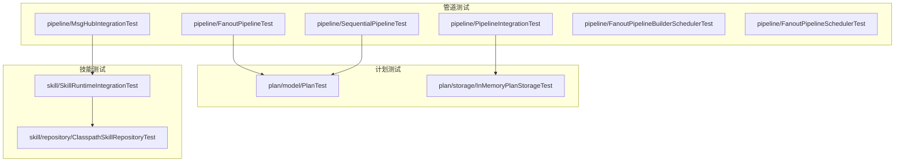
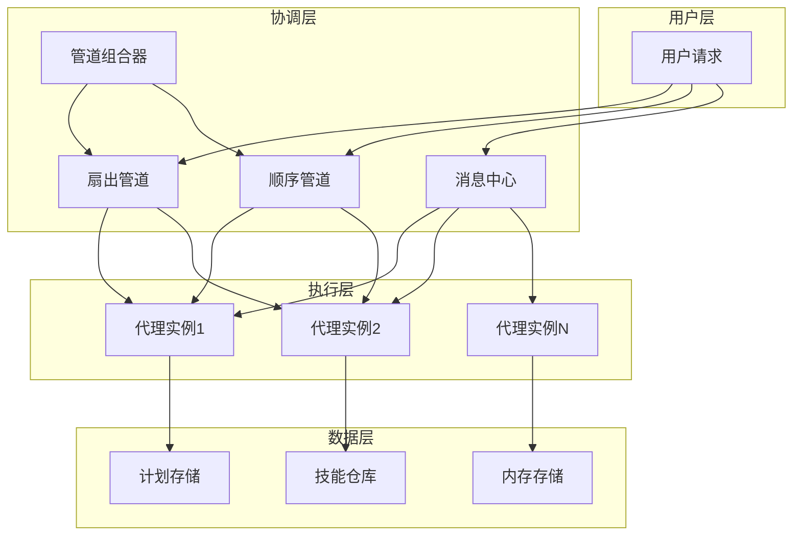
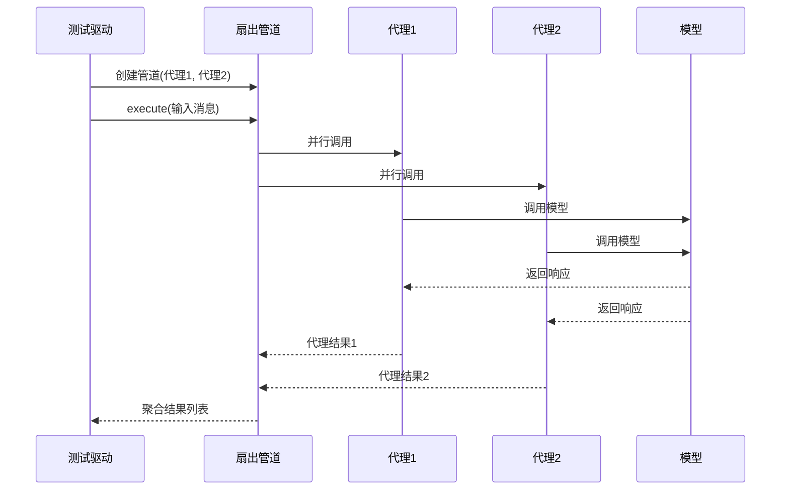
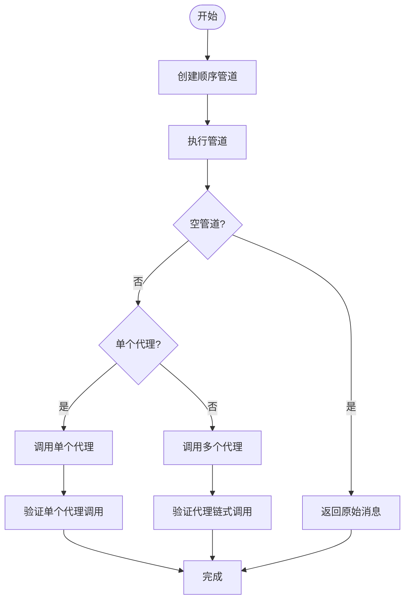
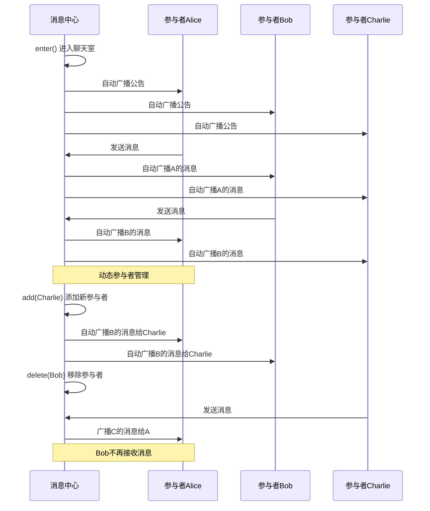
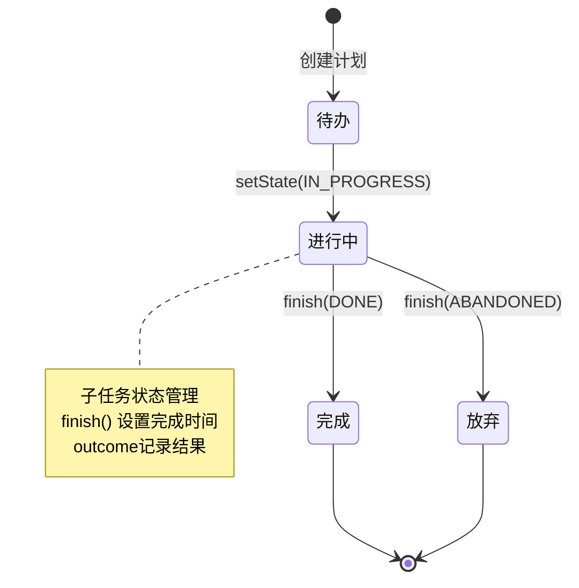
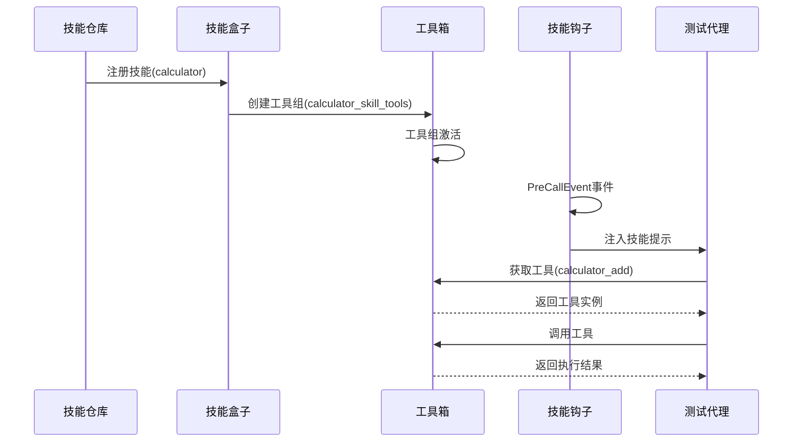
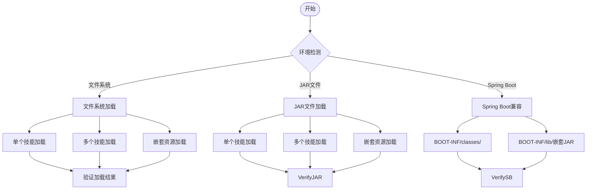
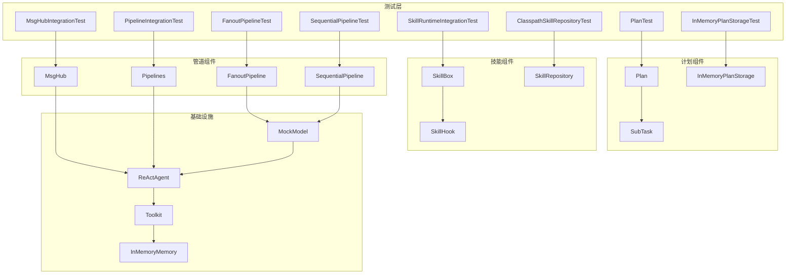

# 管道协调测试

<cite>
**本文档引用的文件**
- [FanoutPipelineTest.java](file://agentscope-core/src/test/java/io/agentscope/core/pipeline/FanoutPipelineTest.java)
- [SequentialPipelineTest.java](file://agentscope-core/src/test/java/io/agentscope/core/pipeline/SequentialPipelineTest.java)
- [MsgHubIntegrationTest.java](file://agentscope-core/src/test/java/io/agentscope/core/pipeline/MsgHubIntegrationTest.java)
- [PipelineIntegrationTest.java](file://agentscope-core/src/test/java/io/agentscope/core/pipeline/PipelineIntegrationTest.java)
- [FanoutPipelineBuilderSchedulerTest.java](file://agentscope-core/src/test/java/io/agentscope/core/pipeline/FanoutPipelineBuilderSchedulerTest.java)
- [FanoutPipelineSchedulerTest.java](file://agentscope-core/src/test/java/io/agentscope/core/pipeline/FanoutPipelineSchedulerTest.java)
- [PlanTest.java](file://agentscope-core/src/test/java/io/agentscope/core/plan/model/PlanTest.java)
- [InMemoryPlanStorageTest.java](file://agentscope-core/src/test/java/io/agentscope/core/plan/storage/InMemoryPlanStorageTest.java)
- [SkillRuntimeIntegrationTest.java](file://agentscope-core/src/test/java/io/agentscope/core/skill/SkillRuntimeIntegrationTest.java)
- [ClasspathSkillRepositoryTest.java](file://agentscope-core/src/test/java/io/agentscope/core/skill/repository/ClasspathSkillRepositoryTest.java)
- [large_output_test.txt](file://agentscope-core/src/test/resources/large_output_test.txt)
</cite>

## 目录
1. [简介](#简介)
2. [项目结构](#项目结构)
3. [核心组件](#核心组件)
4. [架构概览](#架构概览)
5. [详细组件分析](#详细组件分析)
6. [依赖关系分析](#依赖关系分析)
7. [性能考虑](#性能考虑)
8. [故障排除指南](#故障排除指南)
9. [结论](#结论)
10. [附录](#附录)

## 简介

本文件为AgentScopeJava项目的管道协调测试技术文档，专注于管道系统、计划管理和技能系统的端到端测试实现。文档深入解释了消息路由、任务调度和状态跟踪的测试方法，阐述了管道执行验证、计划执行测试和技能调用的测试策略，并提供了并发处理测试、资源竞争测试和性能优化测试的实现方案。

AgentScopeJava是一个多智能体系统框架，支持通过管道（Pipeline）协调多个代理（Agent）执行复杂任务，通过计划（Plan）管理系统化的任务流程，并通过技能（Skill）扩展代理的能力。本文档基于项目中的完整测试套件，提供可操作的测试指南和最佳实践。

## 项目结构

AgentScopeJava项目采用模块化设计，核心功能集中在agentscope-core模块中，测试代码位于对应包的test目录下。管道协调测试主要分布在以下包中：

**图表来源**
- [FanoutPipelineTest.java:1-438](file://agentscope-core/src/test/java/io/agentscope/core/pipeline/FanoutPipelineTest.java#L1-L438)
- [SequentialPipelineTest.java:1-186](file://agentscope-core/src/test/java/io/agentscope/core/pipeline/SequentialPipelineTest.java#L1-L186)
- [MsgHubIntegrationTest.java:1-365](file://agentscope-core/src/test/java/io/agentscope/core/pipeline/MsgHubIntegrationTest.java#L1-L365)
- [PipelineIntegrationTest.java:1-214](file://agentscope-core/src/test/java/io/agentscope/core/pipeline/PipelineIntegrationTest.java#L1-L214)
- [PlanTest.java:1-204](file://agentscope-core/src/test/java/io/agentscope/core/plan/model/PlanTest.java#L1-L204)
- [InMemoryPlanStorageTest.java:1-161](file://agentscope-core/src/test/java/io/agentscope/core/plan/storage/InMemoryPlanStorageTest.java#L1-L161)
- [SkillRuntimeIntegrationTest.java:1-370](file://agentscope-core/src/test/java/io/agentscope/core/skill/SkillRuntimeIntegrationTest.java#L1-L370)
- [ClasspathSkillRepositoryTest.java:1-846](file://agentscope-core/src/test/java/io/agentscope/core/skill/repository/ClasspathSkillRepositoryTest.java#L1-L846)

**章节来源**
- [FanoutPipelineTest.java:1-438](file://agentscope-core/src/test/java/io/agentscope/core/pipeline/FanoutPipelineTest.java#L1-L438)
- [SequentialPipelineTest.java:1-186](file://agentscope-core/src/test/java/io/agentscope/core/pipeline/SequentialPipelineTest.java#L1-L186)
- [MsgHubIntegrationTest.java:1-365](file://agentscope-core/src/test/java/io/agentscope/core/pipeline/MsgHubIntegrationTest.java#L1-L365)
- [PipelineIntegrationTest.java:1-214](file://agentscope-core/src/test/java/io/agentscope/core/pipeline/PipelineIntegrationTest.java#L1-L214)
- [PlanTest.java:1-204](file://agentscope-core/src/test/java/io/agentscope/core/plan/model/PlanTest.java#L1-L204)
- [InMemoryPlanStorageTest.java:1-161](file://agentscope-core/src/test/java/io/agentscope/core/plan/storage/InMemoryPlanStorageTest.java#L1-L161)
- [SkillRuntimeIntegrationTest.java:1-370](file://agentscope-core/src/test/java/io/agentscope/core/skill/SkillRuntimeIntegrationTest.java#L1-L370)
- [ClasspathSkillRepositoryTest.java:1-846](file://agentscope-core/src/test/java/io/agentscope/core/skill/repository/ClasspathSkillRepositoryTest.java#L1-L846)

## 核心组件

### 管道系统组件

管道系统是AgentScope的核心协调机制，包含以下关键组件：

1. **扇出管道（FanoutPipeline）**：并行执行多个代理，聚合结果
2. **顺序管道（SequentialPipeline）**：按序执行代理，前一个输出作为后一个输入
3. **消息中心（MsgHub）**：管理多代理对话和消息广播
4. **管道组合器**：将多个管道组合成复杂工作流

### 计划管理系统组件

计划管理提供任务编排能力：
1. **计划模型（Plan）**：定义任务结构和状态
2. **子任务模型（SubTask）**：计划的组成部分
3. **内存存储（InMemoryPlanStorage）**：计划的持久化存储

### 技能系统组件

技能系统扩展代理能力：
1. **技能仓库（SkillRepository）**：技能的加载和管理
2. **技能盒子（SkillBox）**：技能的注册和激活
3. **技能钩子（SkillHook）**：技能生命周期管理

**章节来源**
- [FanoutPipelineTest.java:1-438](file://agentscope-core/src/test/java/io/agentscope/core/pipeline/FanoutPipelineTest.java#L1-L438)
- [SequentialPipelineTest.java:1-186](file://agentscope-core/src/test/java/io/agentscope/core/pipeline/SequentialPipelineTest.java#L1-L186)
- [PlanTest.java:1-204](file://agentscope-core/src/test/java/io/agentscope/core/plan/model/PlanTest.java#L1-L204)
- [InMemoryPlanStorageTest.java:1-161](file://agentscope-core/src/test/java/io/agentscope/core/plan/storage/InMemoryPlanStorageTest.java#L1-L161)
- [SkillRuntimeIntegrationTest.java:1-370](file://agentscope-core/src/test/java/io/agentscope/core/skill/SkillRuntimeIntegrationTest.java#L1-L370)

## 架构概览

AgentScope的管道协调架构采用分层设计，确保测试覆盖从单元到集成的各个层面：

**图表来源**
- [FanoutPipelineTest.java:1-438](file://agentscope-core/src/test/java/io/agentscope/core/pipeline/FanoutPipelineTest.java#L1-L438)
- [MsgHubIntegrationTest.java:1-365](file://agentscope-core/src/test/java/io/agentscope/core/pipeline/MsgHubIntegrationTest.java#L1-L365)
- [PipelineIntegrationTest.java:1-214](file://agentscope-core/src/test/java/io/agentscope/core/pipeline/PipelineIntegrationTest.java#L1-L214)

该架构支持：
- **消息路由**：通过MsgHub实现多代理间的消息传播
- **任务调度**：通过管道类型选择合适的执行策略
- **状态跟踪**：通过事件系统监控执行过程
- **资源管理**：通过独立内存和工具箱确保线程安全

## 详细组件分析

### 扇出管道测试分析

扇出管道测试验证了并行执行、错误传播和流式处理等核心功能：

**图表来源**
- [FanoutPipelineTest.java:68-94](file://agentscope-core/src/test/java/io/agentscope/core/pipeline/FanoutPipelineTest.java#L68-L94)

关键测试场景包括：
1. **并发执行验证**：确保所有代理同时启动
2. **顺序执行验证**：验证禁用并发时的执行顺序
3. **部分失败处理**：测试单个代理失败时的错误传播
4. **全部失败处理**：验证多个代理同时失败的情况
5. **构建器模式**：测试通过构建器配置管道

**章节来源**
- [FanoutPipelineTest.java:68-176](file://agentscope-core/src/test/java/io/agentscope/core/pipeline/FanoutPipelineTest.java#L68-L176)

### 顺序管道测试分析

顺序管道测试验证了串行执行和错误处理机制：

**图表来源**
- [SequentialPipelineTest.java:62-126](file://agentscope-core/src/test/java/io/agentscope/core/pipeline/SequentialPipelineTest.java#L62-L126)

**章节来源**
- [SequentialPipelineTest.java:62-126](file://agentscope-core/src/test/java/io/agentscope/core/pipeline/SequentialPipelineTest.java#L62-L126)

### 消息中心集成测试分析

消息中心测试验证了多代理对话和自动广播功能：

**图表来源**
- [MsgHubIntegrationTest.java:59-176](file://agentscope-core/src/test/java/io/agentscope/core/pipeline/MsgHubIntegrationTest.java#L59-L176)

**章节来源**
- [MsgHubIntegrationTest.java:59-176](file://agentscope-core/src/test/java/io/agentscope/core/pipeline/MsgHubIntegrationTest.java#L59-L176)

### 计划管理系统测试分析

计划测试验证了任务编排和状态管理：

**图表来源**
- [PlanTest.java:187-202](file://agentscope-core/src/test/java/io/agentscope/core/plan/model/PlanTest.java#L187-L202)

**章节来源**
- [PlanTest.java:187-202](file://agentscope-core/src/test/java/io/agentscope/core/plan/model/PlanTest.java#L187-L202)
- [InMemoryPlanStorageTest.java:100-159](file://agentscope-core/src/test/java/io/agentscope/core/plan/storage/InMemoryPlanStorageTest.java#L100-L159)

### 技能系统运行时测试分析

技能系统测试验证了技能激活和工具可用性：

**图表来源**
- [SkillRuntimeIntegrationTest.java:76-163](file://agentscope-core/src/test/java/io/agentscope/core/skill/SkillRuntimeIntegrationTest.java#L76-L163)

**章节来源**
- [SkillRuntimeIntegrationTest.java:76-163](file://agentscope-core/src/test/java/io/agentscope/core/skill/SkillRuntimeIntegrationTest.java#L76-L163)

### 技能仓库测试分析

技能仓库测试验证了多种环境下的技能加载：

**图表来源**
- [ClasspathSkillRepositoryTest.java:88-254](file://agentscope-core/src/test/java/io/agentscope/core/skill/repository/ClasspathSkillRepositoryTest.java#L88-L254)

**章节来源**
- [ClasspathSkillRepositoryTest.java:88-254](file://agentscope-core/src/test/java/io/agentscope/core/skill/repository/ClasspathSkillRepositoryTest.java#L88-L254)

## 依赖关系分析

管道协调测试的依赖关系呈现层次化结构：

**图表来源**
- [FanoutPipelineTest.java:25-35](file://agentscope-core/src/test/java/io/agentscope/core/pipeline/FanoutPipelineTest.java#L25-L35)
- [MsgHubIntegrationTest.java:22-28](file://agentscope-core/src/test/java/io/agentscope/core/pipeline/MsgHubIntegrationTest.java#L22-L28)
- [PlanTest.java:23-25](file://agentscope-core/src/test/java/io/agentscope/core/plan/model/PlanTest.java#L23-L25)
- [SkillRuntimeIntegrationTest.java:23-36](file://agentscope-core/src/test/java/io/agentscope/core/skill/SkillRuntimeIntegrationTest.java#L23-L36)

**章节来源**
- [FanoutPipelineTest.java:25-35](file://agentscope-core/src/test/java/io/agentscope/core/pipeline/FanoutPipelineTest.java#L25-L35)
- [MsgHubIntegrationTest.java:22-28](file://agentscope-core/src/test/java/io/agentscope/core/pipeline/MsgHubIntegrationTest.java#L22-L28)
- [PlanTest.java:23-25](file://agentscope-core/src/test/java/io/agentscope/core/plan/model/PlanTest.java#L23-L25)
- [SkillRuntimeIntegrationTest.java:23-36](file://agentscope-core/src/test/java/io/agentscope/core/skill/SkillRuntimeIntegrationTest.java#L23-L36)

## 性能考虑

### 并发处理测试

管道协调测试包含了全面的并发处理验证：

1. **线程安全验证**：每个代理使用独立的工具箱和内存实例
2. **调度器配置**：支持自定义调度器和虚拟时间调度器
3. **资源竞争测试**：通过并发添加和获取计划验证线程安全

### 内存压力测试

大型输出测试文件用于验证管道系统的内存处理能力：

- 文件大小：1001行文本内容
- 用途：触发管道缓冲区填满，检测死锁情况
- 验证点：系统在高负载下的稳定性

### 性能优化建议

基于测试发现的最佳实践：

1. **合理设置超时时间**：避免长时间阻塞影响测试执行
2. **使用独立资源**：确保并发测试的隔离性
3. **监控资源使用**：关注内存和CPU使用情况
4. **异步处理优先**：利用Reactor框架实现非阻塞操作

**章节来源**
- [large_output_test.txt:1-1001](file://agentscope-core/src/test/resources/large_output_test.txt#L1-L1001)
- [FanoutPipelineSchedulerTest.java:129-149](file://agentscope-core/src/test/java/io/agentscope/core/pipeline/FanoutPipelineSchedulerTest.java#L129-L149)

## 故障排除指南

### 常见问题及解决方案

#### 管道执行失败
**症状**：管道执行抛出异常或返回空结果
**排查步骤**：
1. 检查代理模型是否正确配置
2. 验证输入消息格式
3. 确认代理工具箱配置

#### 并发测试不稳定
**症状**：并发测试偶发性失败
**排查步骤**：
1. 增加超时时间
2. 检查线程安全配置
3. 验证资源隔离

#### 计划存储冲突
**症状**：并发添加计划导致数据不一致
**排查步骤**：
1. 检查存储实现的线程安全性
2. 验证原子操作的使用
3. 确认锁机制的有效性

#### 技能加载失败
**症状**：技能无法正确加载或激活
**排查步骤**：
1. 检查技能仓库路径配置
2. 验证技能描述文件格式
3. 确认类加载器配置

**章节来源**
- [FanoutPipelineTest.java:125-176](file://agentscope-core/src/test/java/io/agentscope/core/pipeline/FanoutPipelineTest.java#L125-L176)
- [InMemoryPlanStorageTest.java:100-159](file://agentscope-core/src/test/java/io/agentscope/core/plan/storage/InMemoryPlanStorageTest.java#L100-L159)
- [ClasspathSkillRepositoryTest.java:344-353](file://agentscope-core/src/test/java/io/agentscope/core/skill/repository/ClasspathSkillRepositoryTest.java#L344-L353)

## 结论

AgentScopeJava的管道协调测试体系提供了全面的功能验证和质量保证。通过多层次的测试策略，包括单元测试、集成测试和性能测试，确保了系统的可靠性、可扩展性和高性能。

关键成就：
1. **完整的管道测试覆盖**：从基础功能到复杂场景的全方位验证
2. **可靠的并发处理**：通过严格的线程安全测试确保系统稳定性
3. **完善的错误处理**：验证各种异常情况下的系统行为
4. **高效的性能表现**：通过内存压力测试和性能优化建议提升系统效率

这些测试实践为AgentScopeJava的持续发展和生产部署奠定了坚实基础。

## 附录

### 测试配置指南

#### 基础测试配置
- 超时时间：默认3秒，可根据需要调整
- 资源隔离：每个测试使用独立的模型和内存实例
- 并发控制：使用CountDownLatch同步测试执行

#### 管道测试配置
- 并发模式：默认启用，可通过参数禁用
- 调度器：支持自定义调度器和虚拟时间调度器
- 错误处理：验证部分失败和全部失败场景

#### 计划测试配置
- 状态管理：验证计划状态转换和持久化
- 并发访问：测试多线程环境下的数据一致性
- 资源清理：确保测试完成后资源正确释放

#### 技能测试配置
- 环境适配：支持文件系统和JAR环境
- 类加载器：验证不同类加载器的兼容性
- 生命周期管理：测试技能的激活和停用流程

**章节来源**
- [FanoutPipelineBuilderSchedulerTest.java:54-58](file://agentscope-core/src/test/java/io/agentscope/core/pipeline/FanoutPipelineBuilderSchedulerTest.java#L54-L58)
- [PipelineIntegrationTest.java:51-58](file://agentscope-core/src/test/java/io/agentscope/core/pipeline/PipelineIntegrationTest.java#L51-L58)