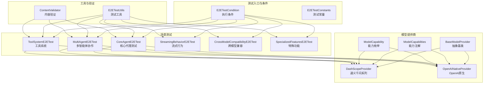
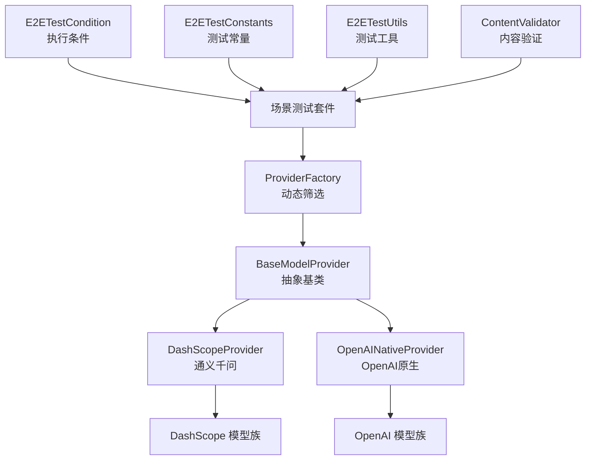
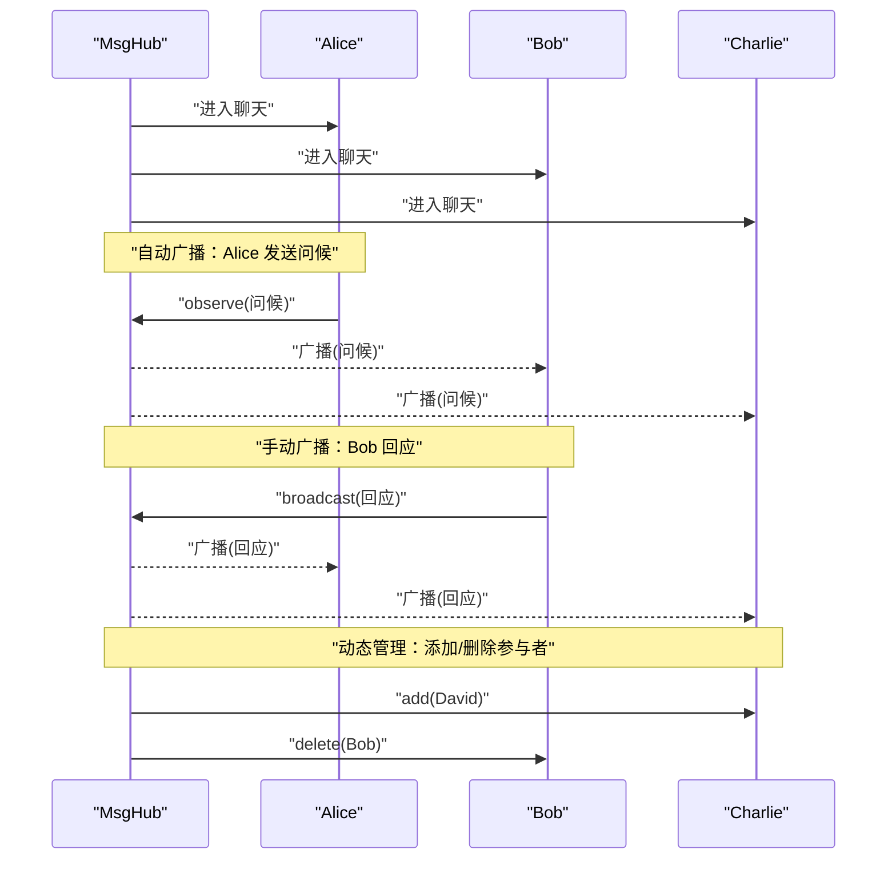
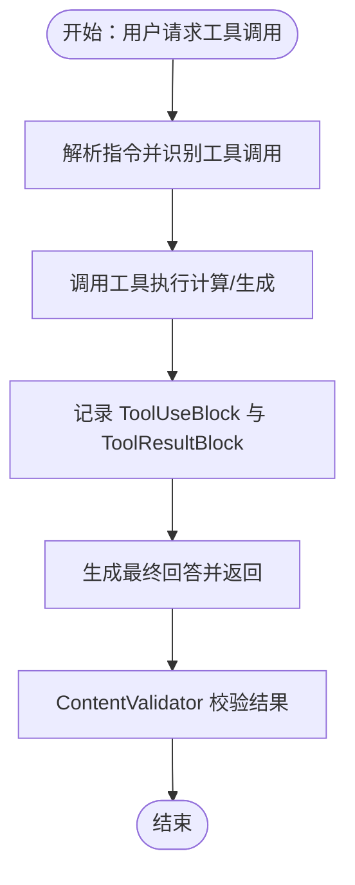
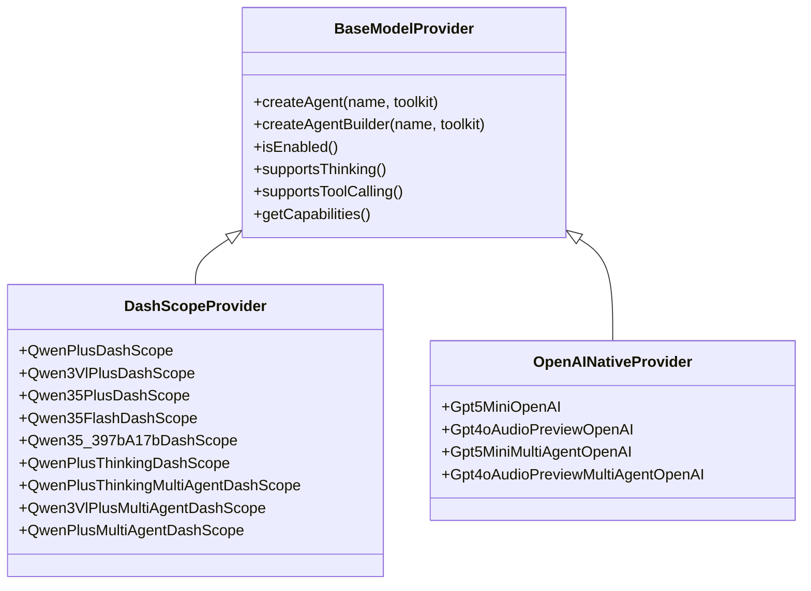
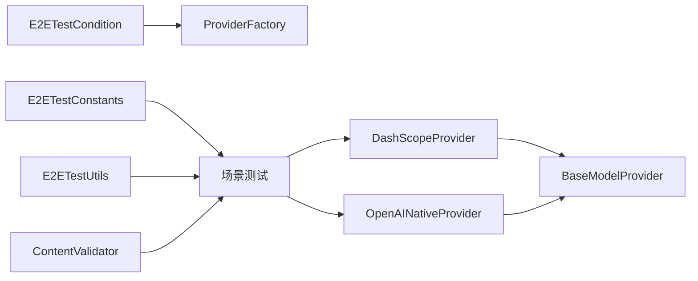

# 集成测试

<cite>
**本文引用的文件**
- [E2ETestConstants.java](file://agentscope-core/src/test/java/io/agentscope/core/e2e/E2ETestConstants.java)
- [E2ETestCondition.java](file://agentscope-core/src/test/java/io/agentscope/core/e2e/E2ETestCondition.java)
- [E2ETestUtils.java](file://agentscope-core/src/test/java/io/agentscope/core/e2e/E2ETestUtils.java)
- [ContentValidator.java](file://agentscope-core/src/test/java/io/agentscope/core/e2e/ContentValidator.java)
- [CoreAgentE2ETest.java](file://agentscope-core/src/test/java/io/agentscope/core/e2e/CoreAgentE2ETest.java)
- [MultiAgentE2ETest.java](file://agentscope-core/src/test/java/io/agentscope/core/e2e/MultiAgentE2ETest.java)
- [ToolSystemE2ETest.java](file://agentscope-core/src/test/java/io/agentscope/core/e2e/ToolSystemE2ETest.java)
- [StreamingBehaviorE2ETest.java](file://agentscope-core/src/test/java/io/agentscope/core/e2e/StreamingBehaviorE2ETest.java)
- [CrossModelCompatibilityE2ETest.java](file://agentscope-core/src/test/java/io/agentscope/core/e2e/CrossModelCompatibilityE2ETest.java)
- [SpecializedFeaturesE2ETest.java](file://agentscope-core/src/test/java/io/agentscope/core/e2e/SpecializedFeaturesE2ETest.java)
- [large_output_test.txt](file://agentscope-core/src/test/resources/large_output_test.txt)
- [BaseModelProvider.java](file://agentscope-core/src/test/java/io/agentscope/core/e2e/providers/BaseModelProvider.java)
- [ModelCapabilities.java](file://agentscope-core/src/test/java/io/agentscope/core/e2e/providers/ModelCapabilities.java)
- [ModelCapability.java](file://agentscope-core/src/test/java/io/agentscope/core/e2e/providers/ModelCapability.java)
- [DashScopeProvider.java](file://agentscope-core/src/test/java/io/agentscope/core/e2e/providers/DashScopeProvider.java)
- [OpenAINativeProvider.java](file://agentscope-core/src/test/java/io/agentscope/core/e2e/providers/OpenAINativeProvider.java)
- [SimpleIntegrationTest.java](file://agentscope-core/src/test/java/io/agentscope/core/SimpleIntegrationTest.java)
</cite>

## 目录
1. [简介](#简介)
2. [项目结构](#项目结构)
3. [核心组件](#核心组件)
4. [架构总览](#架构总览)
5. [详细组件分析](#详细组件分析)
6. [依赖关系分析](#依赖关系分析)
7. [性能考量](#性能考量)
8. [故障排查指南](#故障排查指南)
9. [结论](#结论)
10. [附录](#附录)

## 简介
本技术文档面向 AgentScope Java 的端到端（E2E）集成测试，系统化阐述测试设计理念、测试场景覆盖与实现方法。文档聚焦三大测试域：多智能体协作测试、工具系统集成测试、模型提供商集成测试；并给出测试环境搭建策略、测试数据准备、测试流程编排、测试条件与常量定义以及测试工具使用方式。同时提供跨模型兼容性测试、流式行为测试与特殊功能测试的完整实现思路与配置建议。

## 项目结构
AgentScope Java 的集成测试主要位于 agentscope-core 模块的 e2e 包中，采用按能力分层的组织方式：
- 测试常量与条件：E2ETestConstants、E2ETestCondition
- 工具与验证器：E2ETestUtils、ContentValidator
- 场景测试：CoreAgentE2ETest、MultiAgentE2ETest、ToolSystemE2ETest、StreamingBehaviorE2ETest、CrossModelCompatibilityE2ETest、SpecializedFeaturesE2ETest
- 模型提供商抽象与实现：providers 下的 BaseModelProvider、ModelCapabilities、ModelCapability、DashScopeProvider、OpenAINativeProvider
- 资源文件：large_output_test.txt（用于大输出与流式行为测试）

图表来源
- [E2ETestCondition.java:1-70](file://agentscope-core/src/test/java/io/agentscope/core/e2e/E2ETestCondition.java#L1-L70)
- [E2ETestConstants.java:1-62](file://agentscope-core/src/test/java/io/agentscope/core/e2e/E2ETestConstants.java#L1-L62)
- [E2ETestUtils.java:1-190](file://agentscope-core/src/test/java/io/agentscope/core/e2e/E2ETestUtils.java#L1-L190)
- [ContentValidator.java:1-233](file://agentscope-core/src/test/java/io/agentscope/core/e2e/ContentValidator.java#L1-L233)
- [CoreAgentE2ETest.java:1-283](file://agentscope-core/src/test/java/io/agentscope/core/e2e/CoreAgentE2ETest.java#L1-L283)
- [MultiAgentE2ETest.java:1-659](file://agentscope-core/src/test/java/io/agentscope/core/e2e/MultiAgentE2ETest.java#L1-L659)
- [ToolSystemE2ETest.java:1-328](file://agentscope-core/src/test/java/io/agentscope/core/e2e/ToolSystemE2ETest.java#L1-L328)
- [StreamingBehaviorE2ETest.java](file://agentscope-core/src/test/java/io/agentscope/core/e2e/StreamingBehaviorE2ETest.java)
- [CrossModelCompatibilityE2ETest.java](file://agentscope-core/src/test/java/io/agentscope/core/e2e/CrossModelCompatibilityE2ETest.java)
- [SpecializedFeaturesE2ETest.java](file://agentscope-core/src/test/java/io/agentscope/core/e2e/SpecializedFeaturesE2ETest.java)
- [BaseModelProvider.java:1-197](file://agentscope-core/src/test/java/io/agentscope/core/e2e/providers/BaseModelProvider.java#L1-L197)
- [ModelCapabilities.java:1-50](file://agentscope-core/src/test/java/io/agentscope/core/e2e/providers/ModelCapabilities.java#L1-L50)
- [ModelCapability.java:1-50](file://agentscope-core/src/test/java/io/agentscope/core/e2e/providers/ModelCapability.java#L1-L50)
- [DashScopeProvider.java:1-349](file://agentscope-core/src/test/java/io/agentscope/core/e2e/providers/DashScopeProvider.java#L1-L349)
- [OpenAINativeProvider.java:1-135](file://agentscope-core/src/test/java/io/agentscope/core/e2e/providers/OpenAINativeProvider.java#L1-L135)

章节来源
- [E2ETestConstants.java:1-62](file://agentscope-core/src/test/java/io/agentscope/core/e2e/E2ETestConstants.java#L1-L62)
- [E2ETestCondition.java:1-70](file://agentscope-core/src/test/java/io/agentscope/core/e2e/E2ETestCondition.java#L1-L70)
- [E2ETestUtils.java:1-190](file://agentscope-core/src/test/java/io/agentscope/core/e2e/E2ETestUtils.java#L1-L190)
- [ContentValidator.java:1-233](file://agentscope-core/src/test/java/io/agentscope/core/e2e/ContentValidator.java#L1-L233)

## 核心组件
- 执行条件与开关
  - E2ETestCondition：通过环境变量 ENABLE_E2E_TESTS 控制是否启用 E2E 测试，并检查至少存在一个可用 API Key（如 DASHSCOPE_API_KEY、OPENAI_API_KEY）以决定测试执行。
- 测试常量
  - E2ETestConstants：集中管理测试资源地址（图片、视频）、超时时间等常量，确保测试在稳定网络环境下运行。
- 测试工具与验证器
  - E2ETestUtils：提供创建真实 DashScope 模型代理、注册数学与字符串工具、等待响应、内容判断等通用方法。
  - ContentValidator：对响应进行语义与结构化校验，包括关键词匹配、最小长度、错误处理指示、文件信息提及等。
- 场景测试套件
  - CoreAgentE2ETest：覆盖基础对话、多轮上下文保留、混合对话（有无工具）、简单工具调用、工具错误处理与提供者配置验证。
  - MultiAgentE2ETest：覆盖 MsgHub 基础多智能体对话、工具调用协作、角色型协作（创新者/批评者/综合者）、动态参与者管理、结构化输出汇总、手动广播控制与提供者可用性验证。
  - ToolSystemE2ETest：覆盖顺序多工具调用、复杂计算链、返回图像 URL 的工具、返回多模态内容的工具、工具调用记忆结构验证与提供者可用性。
  - StreamingBehaviorE2ETest：覆盖流式输出行为、大输出缓冲区与死锁规避、长文本生成与流式消费。
  - CrossModelCompatibilityE2ETest：覆盖不同模型（DashScope 与 OpenAI）之间的兼容性测试，确保统一接口与行为一致性。
  - SpecializedFeaturesE2ETest：覆盖特殊能力测试（如视觉、音频、视频理解），结合 ContentValidator 进行语义验证。
- 模型提供商体系
  - BaseModelProvider：抽象基类，封装 API Key 获取、能力声明、代理构建器创建与能力检测。
  - ModelCapabilities/ModelCapability：注解与枚举，声明与分类模型能力（基础、工具调用、图像/音频/视频理解、思维模式、预算控制、多智能体格式化器）。
  - DashScopeProvider/OpenAINativeProvider：具体实现，分别对接通义千问系列与 OpenAI 原生模型，支持多格式化器与多模态能力。

章节来源
- [CoreAgentE2ETest.java:1-283](file://agentscope-core/src/test/java/io/agentscope/core/e2e/CoreAgentE2ETest.java#L1-L283)
- [MultiAgentE2ETest.java:1-659](file://agentscope-core/src/test/java/io/agentscope/core/e2e/MultiAgentE2ETest.java#L1-L659)
- [ToolSystemE2ETest.java:1-328](file://agentscope-core/src/test/java/io/agentscope/core/e2e/ToolSystemE2ETest.java#L1-L328)
- [StreamingBehaviorE2ETest.java](file://agentscope-core/src/test/java/io/agentscope/core/e2e/StreamingBehaviorE2ETest.java)
- [CrossModelCompatibilityE2ETest.java](file://agentscope-core/src/test/java/io/agentscope/core/e2e/CrossModelCompatibilityE2ETest.java)
- [SpecializedFeaturesE2ETest.java](file://agentscope-core/src/test/java/io/agentscope/core/e2e/SpecializedFeaturesE2ETest.java)
- [BaseModelProvider.java:1-197](file://agentscope-core/src/test/java/io/agentscope/core/e2e/providers/BaseModelProvider.java#L1-L197)
- [ModelCapabilities.java:1-50](file://agentscope-core/src/test/java/io/agentscope/core/e2e/providers/ModelCapabilities.java#L1-L50)
- [ModelCapability.java:1-50](file://agentscope-core/src/test/java/io/agentscope/core/e2e/providers/ModelCapability.java#L1-L50)
- [DashScopeProvider.java:1-349](file://agentscope-core/src/test/java/io/agentscope/core/e2e/providers/DashScopeProvider.java#L1-L349)
- [OpenAINativeProvider.java:1-135](file://agentscope-core/src/test/java/io/agentscope/core/e2e/providers/OpenAINativeProvider.java#L1-L135)

## 架构总览
下图展示 E2E 测试的整体架构：测试条件驱动测试执行，工具与验证器贯穿各场景，模型提供商抽象统一接入不同模型后端，场景测试通过参数化与动态过滤选择合适的提供者。

图表来源
- [E2ETestCondition.java:1-70](file://agentscope-core/src/test/java/io/agentscope/core/e2e/E2ETestCondition.java#L1-L70)
- [E2ETestConstants.java:1-62](file://agentscope-core/src/test/java/io/agentscope/core/e2e/E2ETestConstants.java#L1-L62)
- [E2ETestUtils.java:1-190](file://agentscope-core/src/test/java/io/agentscope/core/e2e/E2ETestUtils.java#L1-L190)
- [ContentValidator.java:1-233](file://agentscope-core/src/test/java/io/agentscope/core/e2e/ContentValidator.java#L1-L233)
- [BaseModelProvider.java:1-197](file://agentscope-core/src/test/java/io/agentscope/core/e2e/providers/BaseModelProvider.java#L1-L197)
- [DashScopeProvider.java:1-349](file://agentscope-core/src/test/java/io/agentscope/core/e2e/providers/DashScopeProvider.java#L1-L349)
- [OpenAINativeProvider.java:1-135](file://agentscope-core/src/test/java/io/agentscope/core/e2e/providers/OpenAINativeProvider.java#L1-L135)

## 详细组件分析

### 多智能体协作测试（MultiAgentE2ETest）
- 设计理念
  - 基于 MsgHub 实现多智能体自动广播与手动广播控制，验证消息在参与者间的传播与订阅关系清理。
  - 支持工具调用协作、角色型协作（创新者/批评者/综合者）、动态参与者加入/移除、结构化输出汇总。
- 关键流程
  - 自动广播：参与者进入 MsgHub 后自动接收公告，后续交互自动广播至订阅者。
  - 手动广播：关闭自动广播后，仅在显式广播时传递消息，便于精细控制。
  - 动态参与者：支持运行时添加/删除参与者，验证订阅关系与消息传播边界。
  - 结构化输出：通过请求生成结构化摘要，解析并断言字段完整性。
- 数据结构与断言
  - 使用 DiscussionSummary 结构承载讨论主题、要点、结论与参与者列表，确保模型输出可解析。
  - 断言参与者内存大小与订阅数量，确保消息传播与资源清理正确。

图表来源
- [MultiAgentE2ETest.java:113-248](file://agentscope-core/src/test/java/io/agentscope/core/e2e/MultiAgentE2ETest.java#L113-L248)

章节来源
- [MultiAgentE2ETest.java:1-659](file://agentscope-core/src/test/java/io/agentscope/core/e2e/MultiAgentE2ETest.java#L1-L659)

### 工具系统集成测试（ToolSystemE2ETest）
- 设计理念
  - 验证顺序多工具调用、复杂计算链、多模态工具结果（图像 URL、混合内容）与工具调用记忆结构。
  - 通过 ContentValidator 对工具返回的文件信息进行语义验证，确保模型能正确描述工具产物。
- 关键流程
  - 注册测试工具（加法、乘法、阶乘、字符串拼接、转大写、长度）。
  - 请求代理执行包含工具调用的指令，断言最终响应包含预期数值或描述。
  - 验证记忆结构中包含 ToolUseBlock 与 ToolResultBlock，确保工具调用链路完整。
- 多模态工具
  - 提供返回图像 URL 与混合多模态内容的工具，验证模型对文件路径/URL 的提及与总结。

图表来源
- [ToolSystemE2ETest.java:66-282](file://agentscope-core/src/test/java/io/agentscope/core/e2e/ToolSystemE2ETest.java#L66-L282)
- [E2ETestUtils.java:136-188](file://agentscope-core/src/test/java/io/agentscope/core/e2e/E2ETestUtils.java#L136-L188)
- [ContentValidator.java:160-182](file://agentscope-core/src/test/java/io/agentscope/core/e2e/ContentValidator.java#L160-L182)

章节来源
- [ToolSystemE2ETest.java:1-328](file://agentscope-core/src/test/java/io/agentscope/core/e2e/ToolSystemE2ETest.java#L1-L328)
- [E2ETestUtils.java:1-190](file://agentscope-core/src/test/java/io/agentscope/core/e2e/E2ETestUtils.java#L1-L190)
- [ContentValidator.java:1-233](file://agentscope-core/src/test/java/io/agentscope/core/e2e/ContentValidator.java#L1-L233)

### 模型提供商集成测试（ProviderFactory 与具体实现）
- 设计理念
  - 通过 BaseModelProvider 抽象统一获取 API Key、构建代理、声明能力；子类通过注解声明具体能力。
  - ProviderFactory 基于注解与能力枚举动态筛选可用提供者，支持基础对话、工具调用、图像/音频/视频理解、思维模式、多智能体格式化器等。
- 具体实现
  - DashScopeProvider：支持 qwen-plus、qwen3-vl-plus、qwen3.5-plus/flash/397b-a17b 等模型，可选开启思维模式与多智能体格式化器。
  - OpenAINativeProvider：支持 gpt-5-mini、gpt-4o-audio-preview 等模型，可选多智能体格式化器。
- 能力声明
  - ModelCapabilities 注解与 ModelCapability 枚举共同定义能力集合，确保测试按需筛选提供者。

图表来源
- [BaseModelProvider.java:51-197](file://agentscope-core/src/test/java/io/agentscope/core/e2e/providers/BaseModelProvider.java#L51-L197)
- [DashScopeProvider.java:34-349](file://agentscope-core/src/test/java/io/agentscope/core/e2e/providers/DashScopeProvider.java#L34-L349)
- [OpenAINativeProvider.java:26-135](file://agentscope-core/src/test/java/io/agentscope/core/e2e/providers/OpenAINativeProvider.java#L26-L135)

章节来源
- [BaseModelProvider.java:1-197](file://agentscope-core/src/test/java/io/agentscope/core/e2e/providers/BaseModelProvider.java#L1-L197)
- [ModelCapabilities.java:1-50](file://agentscope-core/src/test/java/io/agentscope/core/e2e/providers/ModelCapabilities.java#L1-L50)
- [ModelCapability.java:1-50](file://agentscope-core/src/test/java/io/agentscope/core/e2e/providers/ModelCapability.java#L1-L50)
- [DashScopeProvider.java:1-349](file://agentscope-core/src/test/java/io/agentscope/core/e2e/providers/DashScopeProvider.java#L1-L349)
- [OpenAINativeProvider.java:1-135](file://agentscope-core/src/test/java/io/agentscope/core/e2e/providers/OpenAINativeProvider.java#L1-L135)

### 核心代理测试（CoreAgentE2ETest）
- 设计理念
  - 验证基础对话、多轮上下文保留、混合对话（有无工具）、简单工具调用与工具错误处理。
  - 通过 ProviderFactory 动态选择具备工具调用能力的提供者，保证测试覆盖面。
- 关键断言
  - 响应非空且具有意义内容；
  - 上下文保留：对“我的最爱颜色”等问题给出一致回答；
  - 工具调用：对“15×8”等指令返回正确结果；
  - 错误处理：对非法输入返回可理解的错误说明。

章节来源
- [CoreAgentE2ETest.java:1-283](file://agentscope-core/src/test/java/io/agentscope/core/e2e/CoreAgentE2ETest.java#L1-L283)

### 流式行为测试（StreamingBehaviorE2ETest）
- 设计理念
  - 验证模型流式输出行为，确保在长时间生成与大文本场景下的稳定性。
  - 利用 large_output_test.txt 填充管道缓冲区，触发并验证死锁规避机制。
- 关键点
  - 设置合理超时；
  - 验证流式片段的正确聚合；
  - 在极端输出场景下确保不会阻塞或死锁。

章节来源
- [StreamingBehaviorE2ETest.java](file://agentscope-core/src/test/java/io/agentscope/core/e2e/StreamingBehaviorE2ETest.java)
- [large_output_test.txt:1-1001](file://agentscope-core/src/test/resources/large_output_test.txt#L1-L1001)

### 跨模型兼容性测试（CrossModelCompatibilityE2ETest）
- 设计理念
  - 在 DashScope 与 OpenAI 之间进行行为一致性对比，确保统一接口与输出风格。
  - 通过相同输入与断言逻辑验证不同模型后端的兼容性。
- 关键点
  - 统一的提示词与工具调用；
  - 基于 ContentValidator 的语义断言；
  - 对比不同模型的响应质量与稳定性。

章节来源
- [CrossModelCompatibilityE2ETest.java](file://agentscope-core/src/test/java/io/agentscope/core/e2e/CrossModelCompatibilityE2ETest.java)

### 特殊功能测试（SpecializedFeaturesE2ETest）
- 设计理念
  - 针对视觉（图像/视频）、音频理解等特殊能力进行测试，结合 ContentValidator 验证模型对媒体内容的描述与总结。
- 关键点
  - 使用 E2ETestConstants 中的媒体资源 URL；
  - 断言响应中提及文件类型、URL 或内容特征。

章节来源
- [SpecializedFeaturesE2ETest.java](file://agentscope-core/src/test/java/io/agentscope/core/e2e/SpecializedFeaturesE2ETest.java)
- [E2ETestConstants.java:1-62](file://agentscope-core/src/test/java/io/agentscope/core/e2e/E2ETestConstants.java#L1-L62)

## 依赖关系分析
- 条件与常量
  - E2ETestCondition 依赖系统属性/环境变量 ENABLE_E2E_TESTS 与 ProviderFactory 的 API Key 状态。
  - E2ETestConstants 提供稳定的外部资源地址与超时常量。
- 工具与验证
  - E2ETestUtils 为各场景测试提供统一的代理与工具创建、等待响应与内容判断。
  - ContentValidator 作为通用断言工具，贯穿所有场景测试。
- 场景测试
  - CoreAgentE2ETest/MultiAgentE2ETest/ToolSystemE2ETest 依赖 ProviderFactory 与具体 Provider 实现。
- 模型提供商
  - BaseModelProvider 作为抽象基类，DashScopeProvider/OpenAINativeProvider 通过注解声明能力，形成统一能力模型。

图表来源
- [E2ETestCondition.java:1-70](file://agentscope-core/src/test/java/io/agentscope/core/e2e/E2ETestCondition.java#L1-L70)
- [E2ETestConstants.java:1-62](file://agentscope-core/src/test/java/io/agentscope/core/e2e/E2ETestConstants.java#L1-L62)
- [E2ETestUtils.java:1-190](file://agentscope-core/src/test/java/io/agentscope/core/e2e/E2ETestUtils.java#L1-L190)
- [ContentValidator.java:1-233](file://agentscope-core/src/test/java/io/agentscope/core/e2e/ContentValidator.java#L1-L233)
- [BaseModelProvider.java:1-197](file://agentscope-core/src/test/java/io/agentscope/core/e2e/providers/BaseModelProvider.java#L1-L197)
- [DashScopeProvider.java:1-349](file://agentscope-core/src/test/java/io/agentscope/core/e2e/providers/DashScopeProvider.java#L1-L349)
- [OpenAINativeProvider.java:1-135](file://agentscope-core/src/test/java/io/agentscope/core/e2e/providers/OpenAINativeProvider.java#L1-L135)

章节来源
- [E2ETestCondition.java:1-70](file://agentscope-core/src/test/java/io/agentscope/core/e2e/E2ETestCondition.java#L1-L70)
- [E2ETestUtils.java:1-190](file://agentscope-core/src/test/java/io/agentscope/core/e2e/E2ETestUtils.java#L1-L190)
- [ContentValidator.java:1-233](file://agentscope-core/src/test/java/io/agentscope/core/e2e/ContentValidator.java#L1-L233)
- [BaseModelProvider.java:1-197](file://agentscope-core/src/test/java/io/agentscope/core/e2e/providers/BaseModelProvider.java#L1-L197)

## 性能考量
- 并发执行
  - 多数测试使用并发执行模式，提升整体测试吞吐，但需注意外部 API 的速率限制与资源竞争。
- 超时设置
  - 不同场景设置不同超时（默认/短/长），避免长时间阻塞影响 CI/CD。
- 流式输出
  - 在流式场景中，合理拆分断言与聚合，避免一次性加载大量片段导致内存压力。
- 资源访问
  - 使用稳定的外部资源地址（OSS）减少网络抖动对测试的影响。

## 故障排查指南
- E2E 测试未执行
  - 检查 ENABLE_E2E_TESTS 是否设置为 true，或通过系统属性传入；确认至少配置一个 API Key（如 DASHSCOPE_API_KEY、OPENAI_API_KEY）。
- Provider 可用性不足
  - 检查对应环境变量是否正确配置；部分模型需要特定能力（如工具调用、多模态），可通过注解声明的能力进行筛选。
- 响应为空或无意义
  - 使用 ContentValidator 的最小长度与关键词断言辅助定位问题；检查提示词与工具调用是否清晰。
- 流式输出异常
  - 检查超时设置与片段聚合逻辑；利用 large_output_test.txt 触发极端场景，验证死锁规避机制。
- 内存与订阅关系
  - 多智能体测试结束后，订阅者数量应清零；若异常，检查 MsgHub 的生命周期管理与资源清理。

章节来源
- [E2ETestCondition.java:1-70](file://agentscope-core/src/test/java/io/agentscope/core/e2e/E2ETestCondition.java#L1-L70)
- [ContentValidator.java:1-233](file://agentscope-core/src/test/java/io/agentscope/core/e2e/ContentValidator.java#L1-L233)
- [MultiAgentE2ETest.java:240-248](file://agentscope-core/src/test/java/io/agentscope/core/e2e/MultiAgentE2ETest.java#L240-L248)

## 结论
AgentScope Java 的集成测试通过统一的执行条件、常量与工具体系，实现了对多智能体协作、工具系统、模型提供商与特殊功能的全面覆盖。借助 BaseModelProvider 与能力注解，测试能够动态适配不同模型后端，确保跨模型兼容性与行为一致性。配合 ContentValidator 与 E2ETestUtils，测试在稳定性、可维护性与可扩展性方面均达到较高水平。

## 附录
- 简单集成测试示例
  - 示例展示了内存操作的基本流程：添加消息、清空内存并断言消息数量，适合入门级集成测试参考。
  
章节来源
- [SimpleIntegrationTest.java:1-57](file://agentscope-core/src/test/java/io/agentscope/core/SimpleIntegrationTest.java#L1-L57)