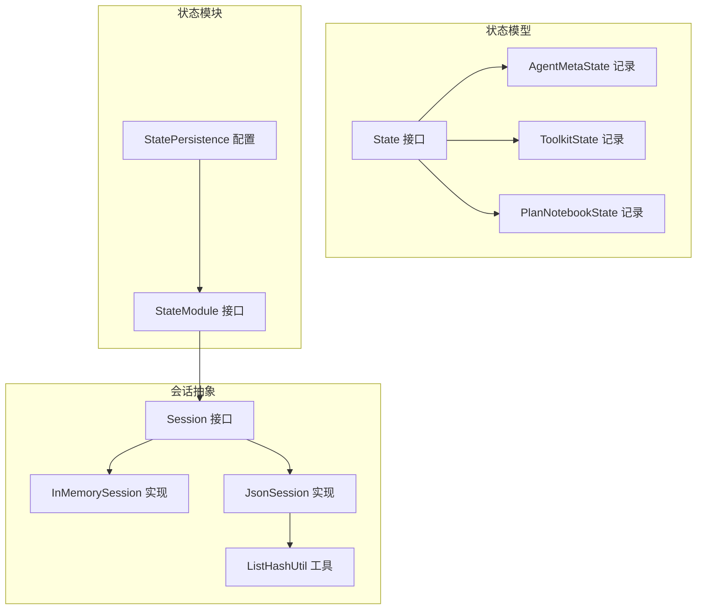
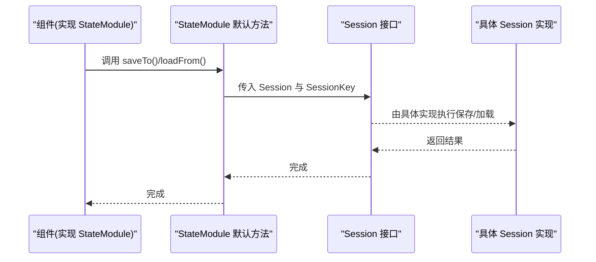
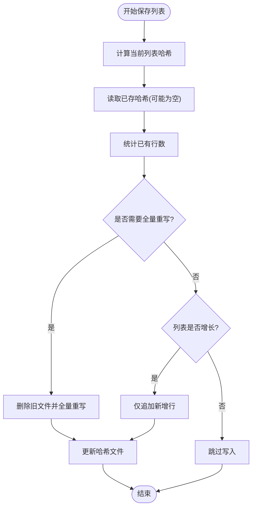
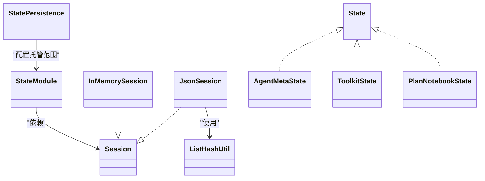

# 状态持久化

<cite>
**本文引用的文件**
- [StatePersistence.java](file://agentscope-core/src/main/java/io/agentscope/core/state/StatePersistence.java)
- [State.java](file://agentscope-core/src/main/java/io/agentscope/core/state/State.java)
- [StateModule.java](file://agentscope-core/src/main/java/io/agentscope/core/state/StateModule.java)
- [AgentMetaState.java](file://agentscope-core/src/main/java/io/agentscope/core/state/AgentMetaState.java)
- [ToolkitState.java](file://agentscope-core/src/main/java/io/agentscope/core/state/ToolkitState.java)
- [PlanNotebookState.java](file://agentscope-core/src/main/java/io/agentscope/core/state/PlanNotebookState.java)
- [Session.java](file://agentscope-core/src/main/java/io/agentscope/core/session/Session.java)
- [InMemorySession.java](file://agentscope-core/src/main/java/io/agentscope/core/session/InMemorySession.java)
- [JsonSession.java](file://agentscope-core/src/main/java/io/agentscope/core/session/JsonSession.java)
- [ListHashUtil.java](file://agentscope-core/src/main/java/io/agentscope/core/session/ListHashUtil.java)
- [SessionManagerTest.java](file://agentscope-core/src/test/java/io/agentscope/core/session/SessionManagerTest.java)
- [InMemorySessionNewApiTest.java](file://agentscope-core/src/test/java/io/agentscope/core/session/InMemorySessionNewApiTest.java)
</cite>

## 目录
1. [简介](#简介)
2. [项目结构](#项目结构)
3. [核心组件](#核心组件)
4. [架构总览](#架构总览)
5. [详细组件分析](#详细组件分析)
6. [依赖分析](#依赖分析)
7. [性能考虑](#性能考虑)
8. [故障排查指南](#故障排查指南)
9. [结论](#结论)
10. [附录](#附录)

## 简介
本文件面向 AgentScope Java 的状态持久化体系，系统性阐述 StatePersistence 接口的持久化策略与“存储适配器”模式；详解状态对象的序列化机制、版本控制与向后兼容；覆盖内存、文件与数据库（扩展）三类存储后端；解释事务性保证、原子操作与并发控制；提供自定义持久化适配器的实现指南；包含状态恢复、故障转移与数据修复策略；并总结性能优化、批量与增量更新技术及状态版本管理与迁移工具的使用。

## 项目结构
状态持久化相关代码主要位于 agentscope-core 模块的 state 与 session 包中，采用“接口 + 多实现”的适配器模式：
- state 包：定义可持久化状态的标记接口与若干标准状态记录，以及状态模块接口用于组件与会话交互。
- session 包：定义统一的 Session 存储接口，并提供 InMemorySession 与 JsonSession 两种实现；通过 ListHashUtil 提供列表变更检测能力。

图表来源
- [State.java:18-47](file://agentscope-core/src/main/java/io/agentscope/core/state/State.java#L18-L47)
- [AgentMetaState.java:18-42](file://agentscope-core/src/main/java/io/agentscope/core/state/AgentMetaState.java#L18-L42)
- [ToolkitState.java:20-42](file://agentscope-core/src/main/java/io/agentscope/core/state/ToolkitState.java#L20-L42)
- [PlanNotebookState.java:18-44](file://agentscope-core/src/main/java/io/agentscope/core/state/PlanNotebookState.java#L18-L44)
- [StateModule.java:20-120](file://agentscope-core/src/main/java/io/agentscope/core/state/StateModule.java#L20-L120)
- [StatePersistence.java:70-162](file://agentscope-core/src/main/java/io/agentscope/core/state/StatePersistence.java#L70-L162)
- [Session.java:24-145](file://agentscope-core/src/main/java/io/agentscope/core/session/Session.java#L24-L145)
- [InMemorySession.java:28-250](file://agentscope-core/src/main/java/io/agentscope/core/session/InMemorySession.java#L28-L250)
- [JsonSession.java:42-510](file://agentscope-core/src/main/java/io/agentscope/core/session/JsonSession.java#L42-L510)
- [ListHashUtil.java:18-172](file://agentscope-core/src/main/java/io/agentscope/core/session/ListHashUtil.java#L18-L172)

章节来源
- [StatePersistence.java:18-162](file://agentscope-core/src/main/java/io/agentscope/core/state/StatePersistence.java#L18-L162)
- [StateModule.java:20-120](file://agentscope-core/src/main/java/io/agentscope/core/state/StateModule.java#L20-L120)
- [Session.java:24-145](file://agentscope-core/src/main/java/io/agentscope/core/session/Session.java#L24-L145)

## 核心组件
- State 接口：标记可持久化状态对象；推荐使用 Java Records 表达简单状态，或让现有领域对象直接实现该接口以避免转换开销。
- StateModule 接口：定义组件与会话交互的统一入口，提供 save/load 及存在性检查等默认方法，便于组件按需覆盖。
- StatePersistence 配置：声明 ReActAgent 等组件对各子状态（记忆、工具箱、计划笔记本、有状态工具）的托管策略，支持全量、仅记忆、禁用等配置。
- Session 接口：统一的会话存储抽象，支持单值保存/读取、列表保存（增量追加语义）、存在性检查、删除、枚举等。
- InMemorySession：基于内存的会话实现，适合单进程场景；列表保存采用全替换策略。
- JsonSession：基于文件系统的会话实现，支持 JSON 单值与 JSONL 列表；通过哈希检测实现增量写入与全量重写决策；提供目录隔离与安全文件名处理。
- ListHashUtil：列表哈希计算与变更判断工具，用于 JsonSession 的增量/全量写入决策。

章节来源
- [State.java:18-47](file://agentscope-core/src/main/java/io/agentscope/core/state/State.java#L18-L47)
- [StateModule.java:20-120](file://agentscope-core/src/main/java/io/agentscope/core/state/StateModule.java#L20-L120)
- [StatePersistence.java:70-162](file://agentscope-core/src/main/java/io/agentscope/core/state/StatePersistence.java#L70-L162)
- [Session.java:24-145](file://agentscope-core/src/main/java/io/agentscope/core/session/Session.java#L24-L145)
- [InMemorySession.java:28-250](file://agentscope-core/src/main/java/io/agentscope/core/session/InMemorySession.java#L28-L250)
- [JsonSession.java:42-510](file://agentscope-core/src/main/java/io/agentscope/core/session/JsonSession.java#L42-L510)
- [ListHashUtil.java:18-172](file://agentscope-core/src/main/java/io/agentscope/core/session/ListHashUtil.java#L18-L172)

## 架构总览
AgentScope 的状态持久化采用“状态模型 + 会话抽象 + 多实现”的分层设计：
- 上层组件通过 StateModule 与 Session 交互，不关心具体存储介质。
- Session 接口定义统一契约，InMemorySession 与 JsonSession 分别满足内存与文件场景。
- JsonSession 借助 ListHashUtil 实现列表的增量/全量写入，兼顾性能与一致性。

图表来源
- [StateModule.java:46-120](file://agentscope-core/src/main/java/io/agentscope/core/state/StateModule.java#L46-L120)
- [Session.java:53-145](file://agentscope-core/src/main/java/io/agentscope/core/session/Session.java#L53-L145)

## 详细组件分析

### StatePersistence：持久化策略与托管范围
- 角色定位：用于声明 ReActAgent 等组件对哪些子状态进行托管，支持全量托管、仅记忆、禁用等策略。
- 关键点：
  - 提供 all/none/memoryOnly 静态工厂与 Builder，便于灵活组合。
  - 作为配置项注入到组件构建流程，决定组件是否调用 Session 进行保存/加载。
- 使用建议：
  - 若希望完全由用户控制状态生命周期，选择 none。
  - 若仅需记忆状态持久化，使用 memoryOnly。
  - 默认 all 适用于大多数场景。

章节来源
- [StatePersistence.java:70-162](file://agentscope-core/src/main/java/io/agentscope/core/state/StatePersistence.java#L70-L162)

### StateModule：组件与会话交互的适配器
- 角色定位：组件与 Session 的适配层，默认空实现，子类按需覆盖 save/load。
- 关键点：
  - 提供 saveTo/loadFrom/loadIfExists 的字符串与 SessionKey 两套签名，便于灵活使用。
  - 组件只需关注自身状态的序列化/反序列化，无需关心存储介质。
- 典型流程：组件在运行时调用 loadIfExists 恢复状态，结束后调用 saveTo 保存。

章节来源
- [StateModule.java:20-120](file://agentscope-core/src/main/java/io/agentscope/core/state/StateModule.java#L20-L120)

### Session 抽象与多实现
- Session 接口契约：
  - 单值：save/get
  - 列表：save/getList（列表保存策略由实现决定）
  - 其他：exists/delete/delete(key)/listSessionKeys/close
- InMemorySession：
  - 内存存储，线程安全；列表保存采用全替换策略。
  - 适合测试与单进程场景，不具备跨进程/跨重启持久化能力。
- JsonSession：
  - 文件系统存储，JSON 单值与 JSONL 列表；通过哈希检测实现增量写入。
  - 支持目录隔离与安全文件名编码；提供清理与异步清理能力。

章节来源
- [Session.java:24-145](file://agentscope-core/src/main/java/io/agentscope/core/session/Session.java#L24-L145)
- [InMemorySession.java:28-250](file://agentscope-core/src/main/java/io/agentscope/core/session/InMemorySession.java#L28-L250)
- [JsonSession.java:42-510](file://agentscope-core/src/main/java/io/agentscope/core/session/JsonSession.java#L42-L510)

### 列表增量写入与哈希检测（JsonSession）
- 设计目标：在列表频繁追加的场景下减少磁盘 IO；在列表被修改或收缩时确保一致性。
- 核心机制：
  - 保存前计算当前列表哈希；读取已存哈希与现有行数。
  - 若需要全量重写（列表被修改或收缩），则删除旧文件并重写所有条目。
  - 否则仅追加新增行；最后更新哈希文件。
- 性能权衡：
  - 小列表：全量扫描，成本低。
  - 大列表：采样策略（固定位置采样）降低开销。
  - 哈希缺失或版本升级：回退至全量重写以保证正确性。

图表来源
- [JsonSession.java:111-162](file://agentscope-core/src/main/java/io/agentscope/core/session/JsonSession.java#L111-L162)
- [ListHashUtil.java:140-172](file://agentscope-core/src/main/java/io/agentscope/core/session/ListHashUtil.java#L140-L172)

章节来源
- [JsonSession.java:111-162](file://agentscope-core/src/main/java/io/agentscope/core/session/JsonSession.java#L111-L162)
- [ListHashUtil.java:18-172](file://agentscope-core/src/main/java/io/agentscope/core/session/ListHashUtil.java#L18-L172)

### 状态对象与序列化机制
- 状态对象：
  - AgentMetaState：保存代理元信息（ID、名称、描述、系统提示）。
  - ToolkitState：保存工具组激活状态。
  - PlanNotebookState：封装当前计划对象。
- 序列化方式：
  - 通过 Session 的 save/get 与 save(List)/getList 实现；JsonSession 使用 JsonUtils 进行 JSON 编解码。
  - 列表采用 JSONL（每行一个 JSON 对象），单值采用 JSON 文件。
- 版本控制与向后兼容：
  - 通过哈希文件（.hash）记录已存内容摘要；若缺失或不一致，触发全量重写，确保新旧格式兼容。
  - 文件名与目录命名采用安全字符集与 Base64 编码，避免非法字符与路径冲突。

章节来源
- [AgentMetaState.java:18-42](file://agentscope-core/src/main/java/io/agentscope/core/state/AgentMetaState.java#L18-L42)
- [ToolkitState.java:20-42](file://agentscope-core/src/main/java/io/agentscope/core/state/ToolkitState.java#L20-L42)
- [PlanNotebookState.java:18-44](file://agentscope-core/src/main/java/io/agentscope/core/state/PlanNotebookState.java#L18-L44)
- [JsonSession.java:98-274](file://agentscope-core/src/main/java/io/agentscope/core/session/JsonSession.java#L98-L274)

### 并发控制与原子性
- 并发控制：
  - InMemorySession 使用并发安全的数据结构与防御性复制，保证多线程下的读写安全。
  - JsonSession 的文件写入为单次写入（全量重写）或追加写入，未见跨行事务；但通过哈希文件与目录隔离实现最终一致性。
- 原子性：
  - 单值保存为整文件写入，具备原子性。
  - 列表增量追加以行粒度追加，不保证跨行事务；但通过哈希校验与全量重写兜底，确保一致性。

章节来源
- [InMemorySession.java:34-43](file://agentscope-core/src/main/java/io/agentscope/core/session/InMemorySession.java#L34-L43)
- [JsonSession.java:98-162](file://agentscope-core/src/main/java/io/agentscope/core/session/JsonSession.java#L98-L162)

### 自定义持久化适配器实现指南
- 目标：为数据库或其他存储系统提供 Session 实现，遵循 Session 接口契约。
- 实现步骤：
  1. 实现 Session 接口的所有方法：save/get/save(List)/getList/exists/delete/delete(key)/listSessionKeys/close。
  2. 在 save(List) 中实现增量/全量策略（可参考 JsonSession 的哈希检测思路）。
  3. 在 get/getList 中实现类型安全的反序列化。
  4. 在 exists/delete/listSessionKeys 中提供存储层对应能力。
  5. 在 close 中释放资源。
- 测试与验证：
  - 参考测试用例中的自定义 Session 示例，验证 save/load、隔离性与删除行为。
  - 参考 InMemorySessionNewApiTest 的多会话键隔离与选择性删除测试。

章节来源
- [Session.java:53-145](file://agentscope-core/src/main/java/io/agentscope/core/session/Session.java#L53-L145)
- [SessionManagerTest.java:276-325](file://agentscope-core/src/test/java/io/agentscope/core/session/SessionManagerTest.java#L276-L325)
- [InMemorySessionNewApiTest.java:257-290](file://agentscope-core/src/test/java/io/agentscope/core/session/InMemorySessionNewApiTest.java#L257-L290)

### 状态恢复、故障转移与数据修复
- 恢复流程：
  - 组件在启动时调用 loadIfExists，若存在则自动恢复；否则从初始状态运行。
- 故障转移：
  - InMemorySession 不支持跨进程/跨重启；如需持久化，应切换到 JsonSession 或自定义实现。
- 数据修复：
  - 哈希缺失或不一致时，JsonSession 回退全量重写，确保一致性。
  - 删除单个键或整个会话时，注意清理关联的哈希文件与索引文件。

章节来源
- [StateModule.java:95-120](file://agentscope-core/src/main/java/io/agentscope/core/state/StateModule.java#L95-L120)
- [JsonSession.java:287-307](file://agentscope-core/src/main/java/io/agentscope/core/session/JsonSession.java#L287-L307)

## 依赖分析
- 组件耦合：
  - StateModule 依赖 Session 接口，实现与存储解耦。
  - JsonSession 依赖 ListHashUtil 进行列表变更检测。
  - InMemorySession 与 JsonSession 均实现 Session 接口，彼此功能互补。
- 外部依赖：
  - JsonSession 依赖 JsonUtils 进行编解码；依赖文件系统 API 进行读写与目录管理。

图表来源
- [StateModule.java:46-120](file://agentscope-core/src/main/java/io/agentscope/core/state/StateModule.java#L46-L120)
- [StatePersistence.java:70-162](file://agentscope-core/src/main/java/io/agentscope/core/state/StatePersistence.java#L70-L162)
- [Session.java:53-145](file://agentscope-core/src/main/java/io/agentscope/core/session/Session.java#L53-L145)
- [InMemorySession.java:58-250](file://agentscope-core/src/main/java/io/agentscope/core/session/InMemorySession.java#L58-L250)
- [JsonSession.java:58-510](file://agentscope-core/src/main/java/io/agentscope/core/session/JsonSession.java#L58-L510)
- [ListHashUtil.java:49-172](file://agentscope-core/src/main/java/io/agentscope/core/session/ListHashUtil.java#L49-L172)

章节来源
- [StateModule.java:46-120](file://agentscope-core/src/main/java/io/agentscope/core/state/StateModule.java#L46-L120)
- [Session.java:53-145](file://agentscope-core/src/main/java/io/agentscope/core/session/Session.java#L53-L145)
- [JsonSession.java:58-510](file://agentscope-core/src/main/java/io/agentscope/core/session/JsonSession.java#L58-L510)

## 性能考虑
- 列表增量写入：
  - JsonSession 通过哈希检测与行数统计，避免重复写入；append-only 场景显著降低 IO。
- 小/大列表策略：
  - 小列表全量采样；大列表采用固定采样点，平衡准确性与性能。
- 内存与文件对比：
  - InMemorySession 读写速度快，但不持久；JsonSession 更适合长期持久化。
- 异步清理：
  - JsonSession 提供异步清理会话目录的能力，适合批量清理任务。

章节来源
- [JsonSession.java:111-162](file://agentscope-core/src/main/java/io/agentscope/core/session/JsonSession.java#L111-L162)
- [ListHashUtil.java:27-47](file://agentscope-core/src/main/java/io/agentscope/core/session/ListHashUtil.java#L27-L47)
- [JsonSession.java:487-508](file://agentscope-core/src/main/java/io/agentscope/core/session/JsonSession.java#L487-L508)

## 故障排查指南
- 常见问题与定位：
  - 类型不匹配：get 时抛出 ClassCastException，检查保存时的类型与读取类型是否一致。
  - 文件权限：JsonSession 写入失败，检查会话目录权限与磁盘空间。
  - 哈希异常：哈希文件损坏导致全量重写，检查 .hash 文件完整性。
  - 删除不彻底：确认是否同时删除了 .json/.jsonl 与 .hash 文件。
- 参考测试：
  - 多会话键隔离与选择性删除测试，验证数据隔离与删除行为。
  - 自定义 Session 测试，验证 save/load 与类型安全。

章节来源
- [InMemorySession.java:114-124](file://agentscope-core/src/main/java/io/agentscope/core/session/InMemorySession.java#L114-L124)
- [JsonSession.java:287-307](file://agentscope-core/src/main/java/io/agentscope/core/session/JsonSession.java#L287-L307)
- [InMemorySessionNewApiTest.java:257-290](file://agentscope-core/src/test/java/io/agentscope/core/session/InMemorySessionNewApiTest.java#L257-L290)
- [SessionManagerTest.java:276-325](file://agentscope-core/src/test/java/io/agentscope/core/session/SessionManagerTest.java#L276-L325)

## 结论
AgentScope 的状态持久化体系以清晰的接口分层与多实现适配器模式为核心，既保证了组件与存储的解耦，又提供了针对不同场景的高效实现。通过哈希检测与增量写入，JsonSession 在列表场景下实现了性能与一致性的平衡；InMemorySession 则满足快速原型与测试需求。借助 StatePersistence 与 StateModule，开发者可以灵活地控制状态托管范围，并通过自定义 Session 实现无缝接入数据库等新存储系统。

## 附录
- 状态版本管理与迁移：
  - 通过哈希文件与全量重写机制，实现对旧版本数据的自动修复与迁移。
  - 建议在状态对象字段变更时，配合版本号字段与条件分支逻辑，确保向后兼容。
- 批量与增量更新最佳实践：
  - 列表优先使用增量追加策略；当列表被修改或收缩时，触发全量重写。
  - 控制列表大小与采样策略，避免大列表带来的哈希计算开销。
- 数据库存储适配：
  - 参考 Session 接口契约，结合数据库事务特性实现 save/get 的原子性与一致性。
  - 在 save(List) 中实现基于游标或时间戳的增量同步策略。