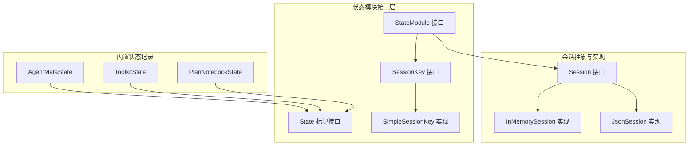
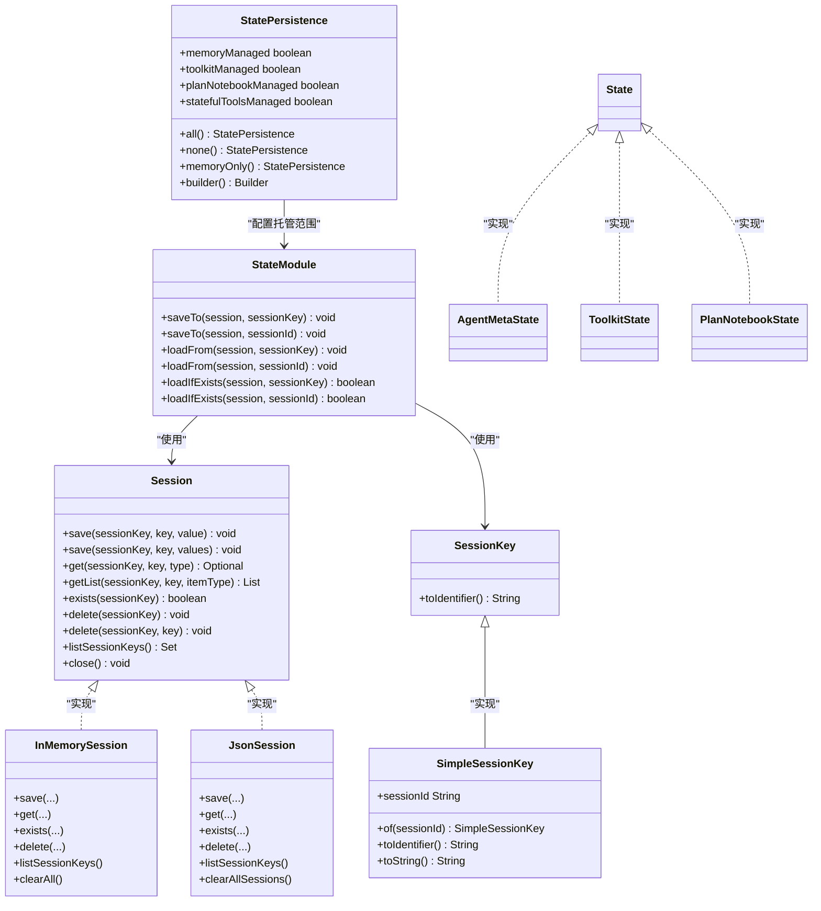
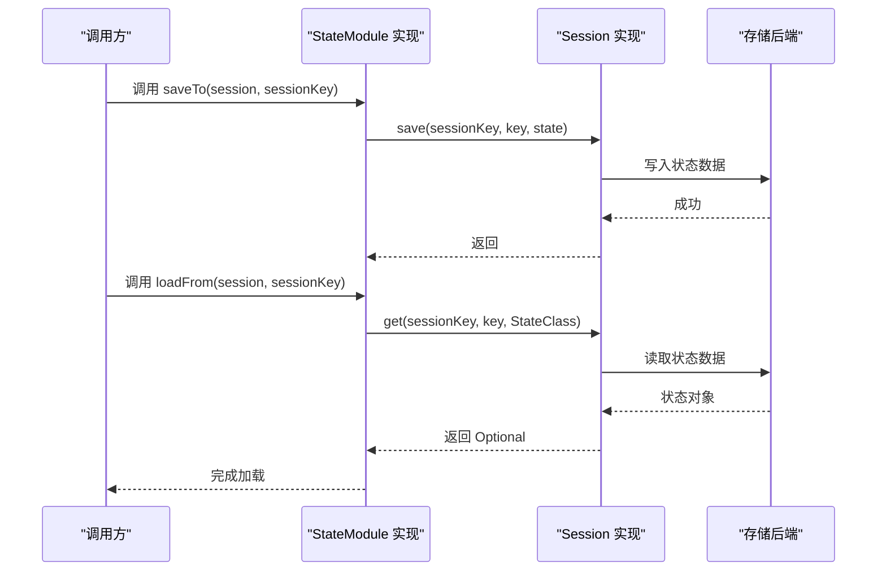
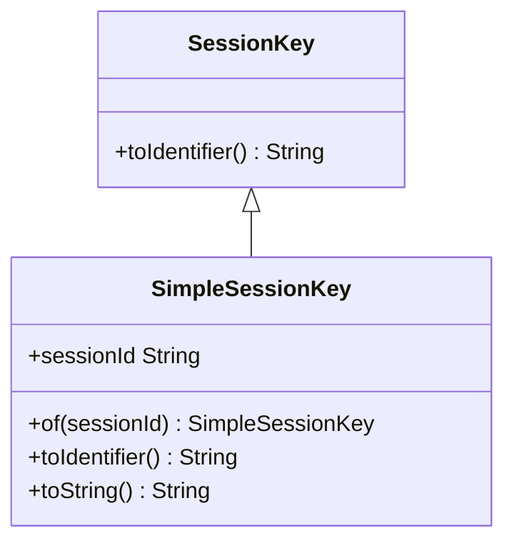
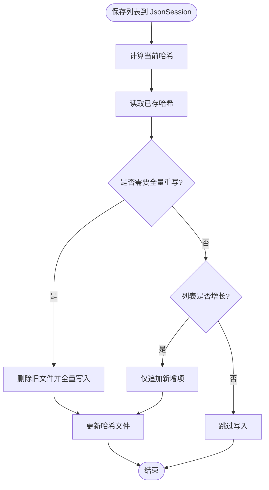
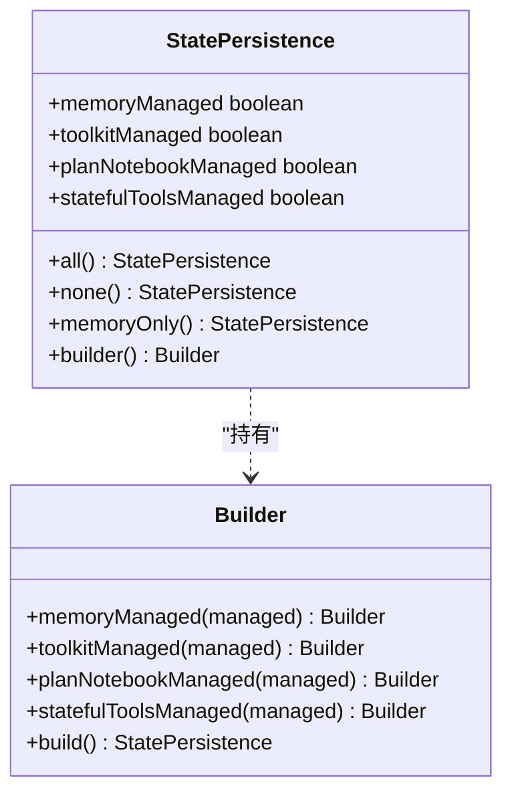
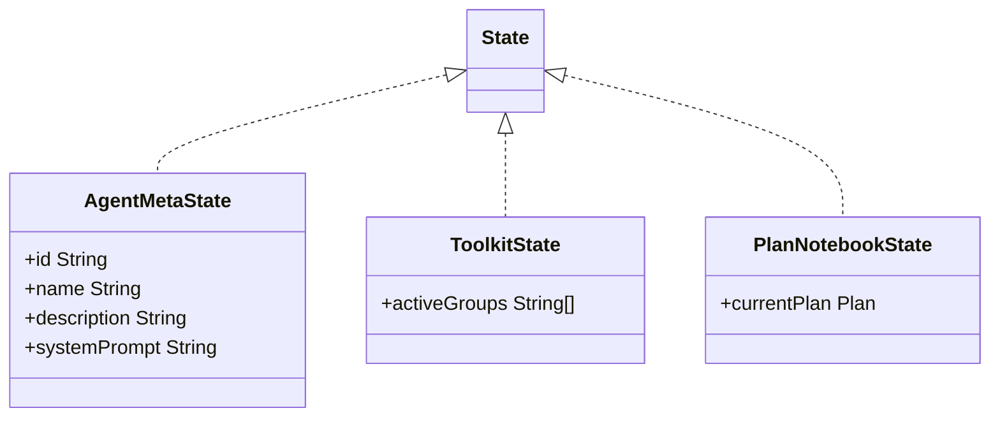
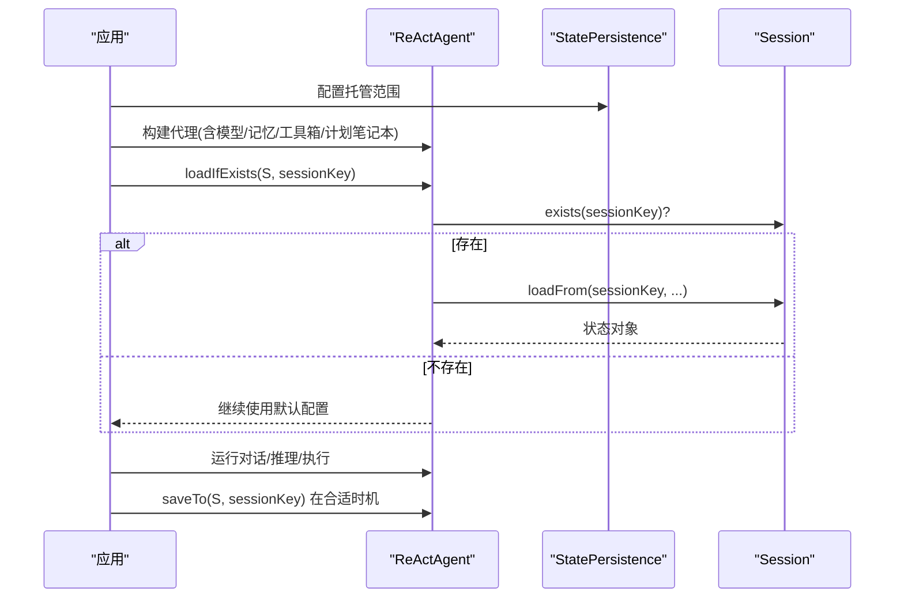
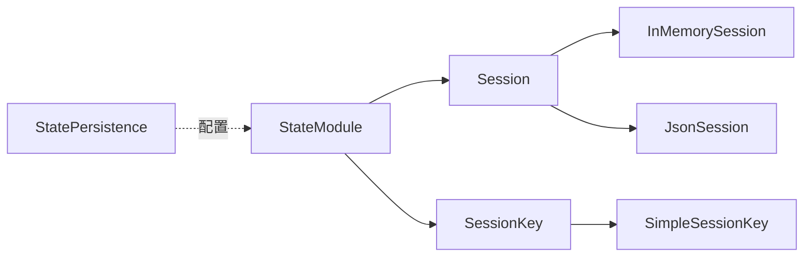

# 状态模块系统

<cite>
**本文档引用的文件**
- [StateModule.java](file://agentscope-core/src/main/java/io/agentscope/core/state/StateModule.java)
- [StatePersistence.java](file://agentscope-core/src/main/java/io/agentscope/core/state/StatePersistence.java)
- [State.java](file://agentscope-core/src/main/java/io/agentscope/core/state/State.java)
- [AgentMetaState.java](file://agentscope-core/src/main/java/io/agentscope/core/state/AgentMetaState.java)
- [PlanNotebookState.java](file://agentscope-core/src/main/java/io/agentscope/core/state/PlanNotebookState.java)
- [ToolkitState.java](file://agentscope-core/src/main/java/io/agentscope/core/state/ToolkitState.java)
- [SessionKey.java](file://agentscope-core/src/main/java/io/agentscope/core/state/SessionKey.java)
- [SimpleSessionKey.java](file://agentscope-core/src/main/java/io/agentscope/core/state/SimpleSessionKey.java)
- [Session.java](file://agentscope-core/src/main/java/io/agentscope/core/session/Session.java)
- [InMemorySession.java](file://agentscope-core/src/main/java/io/agentscope/core/session/InMemorySession.java)
- [JsonSession.java](file://agentscope-core/src/main/java/io/agentscope/core/session/JsonSession.java)
- [StateAndSessionTest.java](file://agentscope-core/src/test/java/io/agentscope/core/state/StateAndSessionTest.java)
- [StatePersistenceTest.java](file://agentscope-core/src/test/java/io/agentscope/core/state/StatePersistenceTest.java)
- [SimpleSessionKeyTest.java](file://agentscope-core/src/test/java/io/agentscope/core/state/SimpleSessionKeyTest.java)
- [StateRecordsTest.java](file://agentscope-core/src/test/java/io/agentscope/core/state/StateRecordsTest.java)
</cite>

## 目录
1. [简介](#简介)
2. [项目结构](#项目结构)
3. [核心组件](#核心组件)
4. [架构总览](#架构总览)
5. [详细组件分析](#详细组件分析)
6. [依赖关系分析](#依赖关系分析)
7. [性能考虑](#性能考虑)
8. [故障排查指南](#故障排查指南)
9. [结论](#结论)
10. [附录](#附录)

## 简介
本文件面向 AgentScope Java 的状态模块系统，系统性阐述 StateModule 的设计理念与模块化状态管理架构，覆盖状态模块的注册机制、生命周期管理、依赖关系、状态持久化策略与存储适配器模式、初始化流程、配置加载与运行时管理，并提供扩展指南（如何创建自定义状态模块与实现特定持久化逻辑）、模块间通信机制、事件通知与状态同步策略，以及最佳实践与性能优化建议。

## 项目结构
状态模块系统位于 agentscope-core 模块的 io.agentscope.core.state 包中，围绕 StateModule 接口、若干内置状态记录类（AgentMetaState、ToolkitState、PlanNotebookState）以及会话接口 Session 及其内存与 JSON 文件实现展开。测试用例展示了典型使用场景：保存/加载状态、按需加载、多实现切换等。

**图表来源**
- [StateModule.java:45-120](file://agentscope-core/src/main/java/io/agentscope/core/state/StateModule.java#L45-L120)
- [State.java:18-47](file://agentscope-core/src/main/java/io/agentscope/core/state/State.java#L18-L47)
- [SessionKey.java:20-62](file://agentscope-core/src/main/java/io/agentscope/core/state/SessionKey.java#L20-L62)
- [SimpleSessionKey.java:20-70](file://agentscope-core/src/main/java/io/agentscope/core/state/SimpleSessionKey.java#L20-L70)
- [AgentMetaState.java:18-42](file://agentscope-core/src/main/java/io/agentscope/core/state/AgentMetaState.java#L18-L42)
- [ToolkitState.java:18-42](file://agentscope-core/src/main/java/io/agentscope/core/state/ToolkitState.java#L18-L42)
- [PlanNotebookState.java:18-44](file://agentscope-core/src/main/java/io/agentscope/core/state/PlanNotebookState.java#L18-L44)
- [Session.java:24-145](file://agentscope-core/src/main/java/io/agentscope/core/session/Session.java#L24-L145)
- [InMemorySession.java:28-249](file://agentscope-core/src/main/java/io/agentscope/core/session/InMemorySession.java#L28-L249)
- [JsonSession.java:42-509](file://agentscope-core/src/main/java/io/agentscope/core/session/JsonSession.java#L42-L509)

**章节来源**
- [StateModule.java:16-120](file://agentscope-core/src/main/java/io/agentscope/core/state/StateModule.java#L16-L120)
- [Session.java:16-145](file://agentscope-core/src/main/java/io/agentscope/core/session/Session.java#L16-L145)

## 核心组件
- StateModule：所有有状态组件的统一接口，提供 saveTo/loadFrom/loadIfExists 等方法，屏蔽具体存储细节，通过 Session 完成序列化与持久化。
- State：可持久化状态对象的标记接口，推荐使用 Java Records 表达不可变状态。
- SessionKey/SimpleSessionKey：会话标识符抽象与默认简单字符串实现，支持自定义复杂键结构（如多租户）。
- Session/InMemorySession/JsonSession：会话存储抽象与两种实现，分别用于内存与文件系统持久化。
- StatePersistence：ReActAgent 等组件的状态持久化配置记录类，控制是否管理各子组件状态。
- 内置状态记录：AgentMetaState、ToolkitState、PlanNotebookState，封装关键运行时状态以便跨会话恢复。

**章节来源**
- [StateModule.java:20-120](file://agentscope-core/src/main/java/io/agentscope/core/state/StateModule.java#L20-L120)
- [State.java:18-47](file://agentscope-core/src/main/java/io/agentscope/core/state/State.java#L18-L47)
- [SessionKey.java:20-62](file://agentscope-core/src/main/java/io/agentscope/core/state/SessionKey.java#L20-L62)
- [SimpleSessionKey.java:20-70](file://agentscope-core/src/main/java/io/agentscope/core/state/SimpleSessionKey.java#L20-L70)
- [Session.java:24-145](file://agentscope-core/src/main/java/io/agentscope/core/session/Session.java#L24-L145)
- [InMemorySession.java:28-249](file://agentscope-core/src/main/java/io/agentscope/core/session/InMemorySession.java#L28-L249)
- [JsonSession.java:42-509](file://agentscope-core/src/main/java/io/agentscope/core/session/JsonSession.java#L42-L509)
- [StatePersistence.java:18-162](file://agentscope-core/src/main/java/io/agentscope/core/state/StatePersistence.java#L18-L162)
- [AgentMetaState.java:18-42](file://agentscope-core/src/main/java/io/agentscope/core/state/AgentMetaState.java#L18-L42)
- [ToolkitState.java:18-42](file://agentscope-core/src/main/java/io/agentscope/core/state/ToolkitState.java#L18-L42)
- [PlanNotebookState.java:18-44](file://agentscope-core/src/main/java/io/agentscope/core/state/PlanNotebookState.java#L18-L44)

## 架构总览
状态模块系统采用“接口抽象 + 多实现适配”的设计：
- StateModule 定义状态组件的统一行为契约；
- Session 抽象出状态读写能力，InMemorySession 与 JsonSession 提供不同存储介质；
- StatePersistence 控制 ReActAgent 等高层组件对子组件状态的托管范围；
- 内置状态记录类将复杂领域对象（消息、计划、工具组）转换为可序列化的状态对象。

**图表来源**
- [StateModule.java:45-120](file://agentscope-core/src/main/java/io/agentscope/core/state/StateModule.java#L45-L120)
- [Session.java:53-145](file://agentscope-core/src/main/java/io/agentscope/core/session/Session.java#L53-L145)
- [SessionKey.java:46-62](file://agentscope-core/src/main/java/io/agentscope/core/state/SessionKey.java#L46-L62)
- [SimpleSessionKey.java:37-70](file://agentscope-core/src/main/java/io/agentscope/core/state/SimpleSessionKey.java#L37-L70)
- [InMemorySession.java:58-249](file://agentscope-core/src/main/java/io/agentscope/core/session/InMemorySession.java#L58-L249)
- [JsonSession.java:58-509](file://agentscope-core/src/main/java/io/agentscope/core/session/JsonSession.java#L58-L509)
- [StatePersistence.java:70-162](file://agentscope-core/src/main/java/io/agentscope/core/state/StatePersistence.java#L70-L162)
- [AgentMetaState.java:41-42](file://agentscope-core/src/main/java/io/agentscope/core/state/AgentMetaState.java#L41-L42)
- [ToolkitState.java:42-42](file://agentscope-core/src/main/java/io/agentscope/core/state/ToolkitState.java#L42-L42)
- [PlanNotebookState.java:44-44](file://agentscope-core/src/main/java/io/agentscope/core/state/PlanNotebookState.java#L44-L44)

## 详细组件分析

### StateModule 接口与生命周期
- 设计理念：通过 saveTo/loadFrom/loadIfExists 将状态组件与具体存储解耦；默认空实现，子类按需覆盖。
- 生命周期管理：
  - 初始化：组件在首次运行时决定是否从 Session 加载已有状态（loadIfExists）。
  - 运行期：组件在合适时机调用 saveTo 持久化当前状态。
  - 关闭/清理：由上层或框架在退出前触发保存，避免状态丢失。
- 依赖关系：依赖 Session 与 SessionKey；不直接依赖具体存储实现。

**图表来源**
- [StateModule.java:47-119](file://agentscope-core/src/main/java/io/agentscope/core/state/StateModule.java#L47-L119)
- [Session.java:64-104](file://agentscope-core/src/main/java/io/agentscope/core/session/Session.java#L64-L104)

**章节来源**
- [StateModule.java:20-120](file://agentscope-core/src/main/java/io/agentscope/core/state/StateModule.java#L20-L120)

### SessionKey 与 SimpleSessionKey
- SessionKey：会话标识符抽象，默认 toIdentifier 使用 JSON 序列化；SimpleSessionKey 提供字符串实现并覆写 toIdentifier 以提升可读性。
- 自定义扩展：可通过实现 SessionKey 定义复合键（如多租户场景），Session 实现据此决定存储策略（目录、表、键前缀等）。

**图表来源**
- [SessionKey.java:46-62](file://agentscope-core/src/main/java/io/agentscope/core/state/SessionKey.java#L46-L62)
- [SimpleSessionKey.java:37-70](file://agentscope-core/src/main/java/io/agentscope/core/state/SimpleSessionKey.java#L37-L70)

**章节来源**
- [SessionKey.java:18-62](file://agentscope-core/src/main/java/io/agentscope/core/state/SessionKey.java#L18-L62)
- [SimpleSessionKey.java:18-70](file://agentscope-core/src/main/java/io/agentscope/core/state/SimpleSessionKey.java#L18-L70)

### Session 抽象与存储适配器模式
- Session 接口定义了统一的状态存取 API：单值保存/读取、列表保存/读取、存在性检查、删除、列出会话键等。
- InMemorySession：基于并发 Map 的内存实现，适合单进程、非持久化场景；列表保存采用全量替换策略。
- JsonSession：基于文件系统的 JSON/JSONL 存储，支持增量追加与哈希校验，自动处理目录创建、安全文件名编码、原子写入等。

**图表来源**
- [JsonSession.java:127-162](file://agentscope-core/src/main/java/io/agentscope/core/session/JsonSession.java#L127-L162)
- [JsonSession.java:134-159](file://agentscope-core/src/main/java/io/agentscope/core/session/JsonSession.java#L134-L159)

**章节来源**
- [Session.java:24-145](file://agentscope-core/src/main/java/io/agentscope/core/session/Session.java#L24-L145)
- [InMemorySession.java:28-249](file://agentscope-core/src/main/java/io/agentscope/core/session/InMemorySession.java#L28-L249)
- [JsonSession.java:42-509](file://agentscope-core/src/main/java/io/agentscope/core/session/JsonSession.java#L42-L509)

### StatePersistence 配置与托管策略
- 记录类：包含 memoryManaged、toolkitManaged、planNotebookManaged、statefulToolsManaged 四个布尔字段。
- 工厂方法：all()/none()/memoryOnly() 快速构建常见配置。
- Builder：链式设置各组件托管开关，便于细粒度控制。
- 与高层组件集成：ReActAgent 等根据该配置决定是否自动保存/加载对应子组件状态。

**图表来源**
- [StatePersistence.java:70-162](file://agentscope-core/src/main/java/io/agentscope/core/state/StatePersistence.java#L70-L162)

**章节来源**
- [StatePersistence.java:18-162](file://agentscope-core/src/main/java/io/agentscope/core/state/StatePersistence.java#L18-L162)

### 内置状态记录类
- AgentMetaState：封装代理元信息（ID、名称、描述、系统提示），用于跨会话恢复代理配置。
- ToolkitState：封装工具组激活状态，工具本身无状态，但激活组需要持久化。
- PlanNotebookState：封装当前计划对象，包含子任务等完整结构。

**图表来源**
- [AgentMetaState.java:41-42](file://agentscope-core/src/main/java/io/agentscope/core/state/AgentMetaState.java#L41-L42)
- [ToolkitState.java:42-42](file://agentscope-core/src/main/java/io/agentscope/core/state/ToolkitState.java#L42-L42)
- [PlanNotebookState.java:44-44](file://agentscope-core/src/main/java/io/agentscope/core/state/PlanNotebookState.java#L44-L44)

**章节来源**
- [AgentMetaState.java:18-42](file://agentscope-core/src/main/java/io/agentscope/core/state/AgentMetaState.java#L18-L42)
- [ToolkitState.java:18-42](file://agentscope-core/src/main/java/io/agentscope/core/state/ToolkitState.java#L18-L42)
- [PlanNotebookState.java:18-44](file://agentscope-core/src/main/java/io/agentscope/core/state/PlanNotebookState.java#L18-L44)

### 初始化流程、配置加载与运行时管理
- 初始化：组件在构造或启动阶段决定是否调用 loadIfExists 从 Session 恢复状态。
- 配置加载：通过 StatePersistence 控制托管范围；未托管的组件由用户自行管理。
- 运行时管理：组件在状态变更点（如消息添加、计划切换、工具组变化）调用 saveTo 持久化。

**图表来源**
- [StatePersistence.java:70-162](file://agentscope-core/src/main/java/io/agentscope/core/state/StatePersistence.java#L70-L162)
- [StateModule.java:102-119](file://agentscope-core/src/main/java/io/agentscope/core/state/StateModule.java#L102-L119)
- [Session.java:107-112](file://agentscope-core/src/main/java/io/agentscope/core/session/Session.java#L107-L112)

**章节来源**
- [StatePersistence.java:18-162](file://agentscope-core/src/main/java/io/agentscope/core/state/StatePersistence.java#L18-L162)
- [StateModule.java:95-119](file://agentscope-core/src/main/java/io/agentscope/core/state/StateModule.java#L95-L119)
- [Session.java:107-112](file://agentscope-core/src/main/java/io/agentscope/core/session/Session.java#L107-L112)

### 扩展指南：自定义状态模块与持久化逻辑
- 创建自定义状态模块：
  - 实现 StateModule 接口，覆盖 saveTo/loadFrom；
  - 将内部状态封装为实现了 State 的不可变对象（推荐使用 Records）；
  - 使用 Session.save/get 完成序列化与反序列化。
- 自定义持久化逻辑：
  - 若需自定义存储介质，实现 Session 接口；
  - 若需复杂键结构，实现 SessionKey 并在 Session 实现中解析键策略；
  - 对于列表状态，参考 JsonSession 的增量追加与哈希校验策略，平衡一致性与性能。
- 最佳实践：
  - 使用 Records 表达状态，确保不可变性与序列化稳定性；
  - 合理划分状态粒度，避免一次性保存超大对象；
  - 在高并发场景优先选择线程安全实现（如 InMemorySession 的并发容器）。

**章节来源**
- [StateModule.java:45-120](file://agentscope-core/src/main/java/io/agentscope/core/state/StateModule.java#L45-L120)
- [State.java:18-47](file://agentscope-core/src/main/java/io/agentscope/core/state/State.java#L18-L47)
- [Session.java:53-145](file://agentscope-core/src/main/java/io/agentscope/core/session/Session.java#L53-L145)
- [JsonSession.java:111-162](file://agentscope-core/src/main/java/io/agentscope/core/session/JsonSession.java#L111-L162)

### 模块间通信机制、事件通知与状态同步策略
- 事件通知：ReActAgent 等高层组件可在关键生命周期（推理开始/结束、动作执行、总结生成）触发事件钩子，状态模块可订阅相应事件并在合适时机保存状态。
- 状态同步策略：
  - 增量同步：仅在状态发生变更时保存（如消息列表增长）；
  - 周期性同步：定时保存，保证最终一致性；
  - 强一致同步：在关键操作前后立即保存，适用于强一致性要求的场景。
- 依赖管理：通过 StatePersistence 明确各子组件的托管边界，避免重复保存与竞态。

**章节来源**
- [StatePersistence.java:18-69](file://agentscope-core/src/main/java/io/agentscope/core/state/StatePersistence.java#L18-L69)

## 依赖关系分析
- 松耦合：StateModule 不依赖具体 Session 实现，仅依赖 Session 接口与 SessionKey；
- 可替换性：Session 的多种实现（内存/文件）可无缝替换；
- 配置驱动：StatePersistence 决定托管范围，便于按需启用/禁用状态管理。

**图表来源**
- [StateModule.java:45-120](file://agentscope-core/src/main/java/io/agentscope/core/state/StateModule.java#L45-L120)
- [Session.java:53-145](file://agentscope-core/src/main/java/io/agentscope/core/session/Session.java#L53-L145)
- [SessionKey.java:46-62](file://agentscope-core/src/main/java/io/agentscope/core/state/SessionKey.java#L46-L62)
- [SimpleSessionKey.java:37-70](file://agentscope-core/src/main/java/io/agentscope/core/state/SimpleSessionKey.java#L37-L70)
- [InMemorySession.java:58-249](file://agentscope-core/src/main/java/io/agentscope/core/session/InMemorySession.java#L58-L249)
- [JsonSession.java:58-509](file://agentscope-core/src/main/java/io/agentscope/core/session/JsonSession.java#L58-L509)
- [StatePersistence.java:70-162](file://agentscope-core/src/main/java/io/agentscope/core/state/StatePersistence.java#L70-L162)

**章节来源**
- [StateModule.java:45-120](file://agentscope-core/src/main/java/io/agentscope/core/state/StateModule.java#L45-L120)
- [Session.java:53-145](file://agentscope-core/src/main/java/io/agentscope/core/session/Session.java#L53-L145)
- [StatePersistence.java:70-162](file://agentscope-core/src/main/java/io/agentscope/core/state/StatePersistence.java#L70-L162)

## 性能考虑
- 列表保存策略：JsonSession 采用哈希校验与增量追加，减少磁盘 IO；InMemorySession 全量替换，适合内存场景。
- 并发安全：InMemorySession 使用并发容器与不可变拷贝，降低锁竞争与外部修改风险。
- 序列化开销：Records 结构简单、序列化高效；避免在状态中嵌套大型不可序列化对象。
- I/O 调优：文件系统存储建议使用 SSD、合理设置目录层级，避免单目录文件过多。

**章节来源**
- [InMemorySession.java:223-248](file://agentscope-core/src/main/java/io/agentscope/core/session/InMemorySession.java#L223-L248)
- [JsonSession.java:111-162](file://agentscope-core/src/main/java/io/agentscope/core/session/JsonSession.java#L111-L162)

## 故障排查指南
- 状态未加载：
  - 检查 sessionKey 是否正确、是否存在；
  - 使用 loadIfExists 并确认返回值；
  - 参考测试用例验证流程。
- 类型不匹配：
  - get 方法会进行类型校验，若抛出类型转换异常，检查保存时使用的类型与读取类型是否一致。
- 键格式问题：
  - 自定义 SessionKey 的 toIdentifier 返回值应保证存储介质兼容性；SimpleSessionKey 默认字符串形式更安全。
- 列表未增量追加：
  - 确认列表哈希是否变化、是否满足增量条件；必要时允许全量重写。

**章节来源**
- [StateAndSessionTest.java:221-251](file://agentscope-core/src/test/java/io/agentscope/core/state/StateAndSessionTest.java#L221-L251)
- [Session.java:114-123](file://agentscope-core/src/main/java/io/agentscope/core/session/Session.java#L114-L123)
- [SimpleSessionKeyTest.java:44-61](file://agentscope-core/src/test/java/io/agentscope/core/state/SimpleSessionKeyTest.java#L44-L61)

## 结论
AgentScope Java 的状态模块系统通过 StateModule、Session 与 StatePersistence 的协作，提供了清晰的模块化状态管理架构。它既支持内存与文件等多种存储介质，又通过配置化策略灵活控制托管范围，便于扩展与演进。遵循本文档的最佳实践与扩展指南，可有效提升系统的可维护性、可移植性与性能表现。

## 附录
- 测试用例参考路径：
  - [StateAndSessionTest.java:38-279](file://agentscope-core/src/test/java/io/agentscope/core/state/StateAndSessionTest.java#L38-L279)
  - [StatePersistenceTest.java:26-177](file://agentscope-core/src/test/java/io/agentscope/core/state/StatePersistenceTest.java#L26-L177)
  - [SimpleSessionKeyTest.java:25-113](file://agentscope-core/src/test/java/io/agentscope/core/state/SimpleSessionKeyTest.java#L25-L113)
  - [StateRecordsTest.java:30-188](file://agentscope-core/src/test/java/io/agentscope/core/state/StateRecordsTest.java#L30-L188)