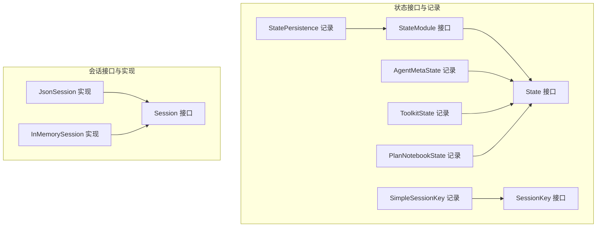
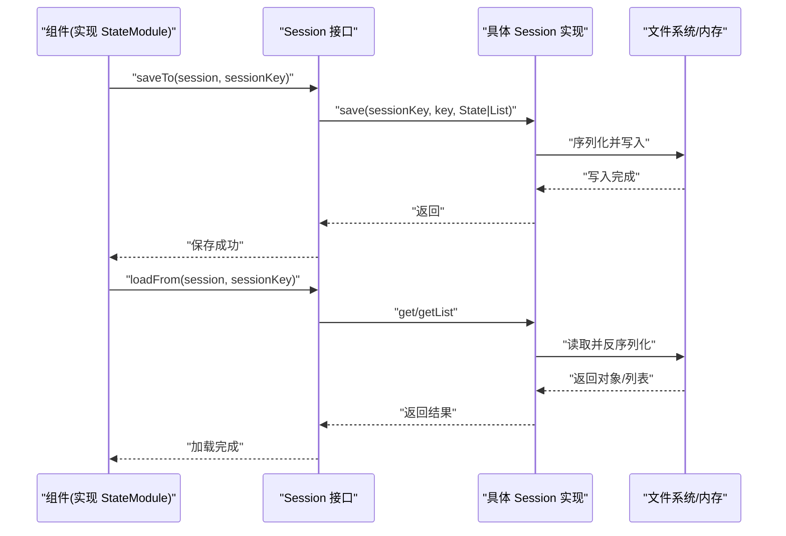
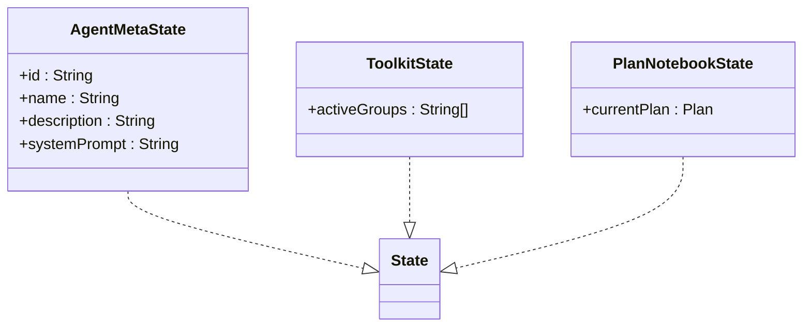
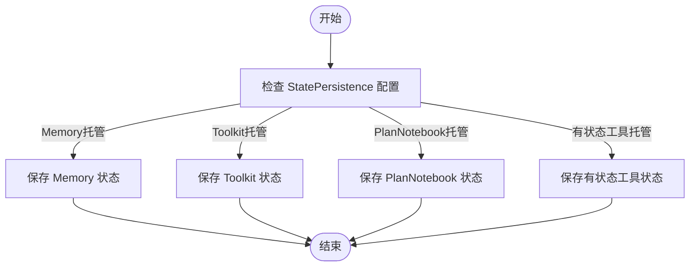
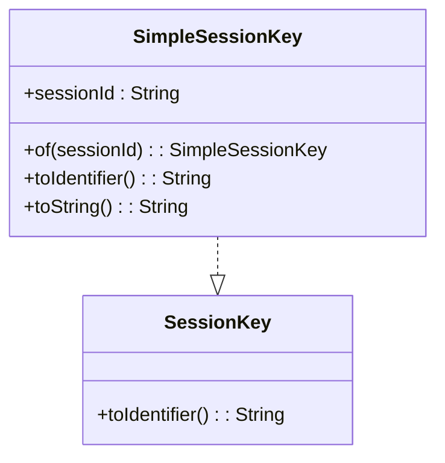
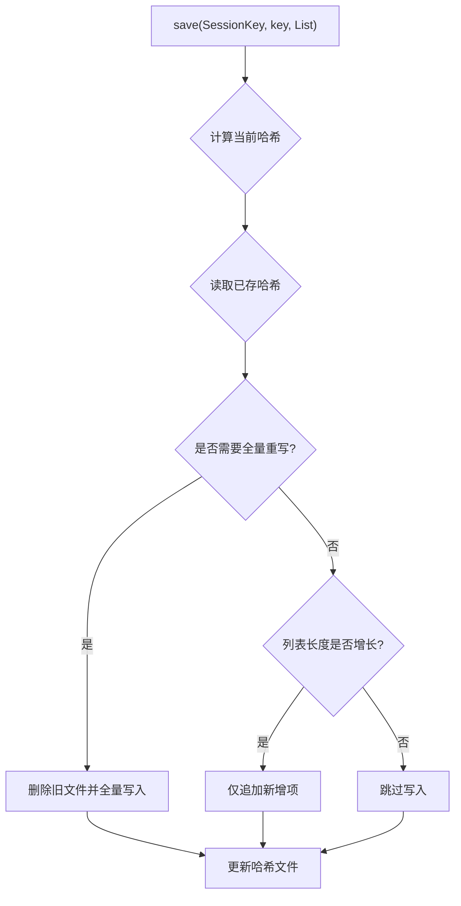
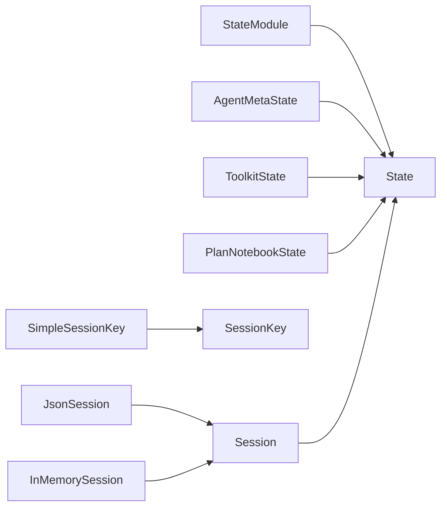

# 状态管理

<cite>
**本文引用的文件**
- [State.java](file://agentscope-core/src/main/java/io/agentscope/core/state/State.java)
- [StateModule.java](file://agentscope-core/src/main/java/io/agentscope/core/state/StateModule.java)
- [StatePersistence.java](file://agentscope-core/src/main/java/io/agentscope/core/state/StatePersistence.java)
- [AgentMetaState.java](file://agentscope-core/src/main/java/io/agentscope/core/state/AgentMetaState.java)
- [ToolkitState.java](file://agentscope-core/src/main/java/io/agentscope/core/state/ToolkitState.java)
- [PlanNotebookState.java](file://agentscope-core/src/main/java/io/agentscope/core/state/PlanNotebookState.java)
- [SessionKey.java](file://agentscope-core/src/main/java/io/agentscope/core/state/SessionKey.java)
- [SimpleSessionKey.java](file://agentscope-core/src/main/java/io/agentscope/core/state/SimpleSessionKey.java)
- [Session.java](file://agentscope-core/src/main/java/io/agentscope/core/session/Session.java)
- [JsonSession.java](file://agentscope-core/src/main/java/io/agentscope/core/session/JsonSession.java)
- [InMemorySession.java](file://agentscope-core/src/main/java/io/agentscope/core/session/InMemorySession.java)
- [StatePersistenceTest.java](file://agentscope-core/src/test/java/io/agentscope/core/state/StatePersistenceTest.java)
- [StateAndSessionTest.java](file://agentscope-core/src/test/java/io/agentscope/core/state/StateAndSessionTest.java)
- [ReActAgentStateTest.java](file://agentscope-core/src/test/java/io/agentscope/core/agent/ReActAgentStateTest.java)
- [PlanNotebookStateModuleTest.java](file://agentscope-core/src/test/java/io/agentscope/core/plan/PlanNotebookStateModuleTest.java)
</cite>

## 目录
1. [简介](#简介)
2. [项目结构](#项目结构)
3. [核心组件](#核心组件)
4. [架构总览](#架构总览)
5. [详细组件分析](#详细组件分析)
6. [依赖关系分析](#依赖关系分析)
7. [性能考量](#性能考量)
8. [故障排查指南](#故障排查指南)
9. [结论](#结论)
10. [附录：API 参考与使用示例](#附录api-参考与使用示例)

## 简介
本文件系统性阐述 AgentScope Java 的状态管理子系统，围绕状态模块的设计理念、序列化机制与持久化策略展开，覆盖元数据状态（AgentMetaState）、工具包状态（ToolkitState）与计划笔记本状态（PlanNotebookState），并深入解析状态生命周期、版本与迁移策略、扩展机制与自定义状态实现方法。同时给出最佳实践（性能优化、数据一致性与备份恢复）、分布式场景下的状态同步与冲突解决思路，并提供完整的 API 参考与使用示例。

## 项目结构
状态管理相关代码主要位于 agentscope-core 模块的 state 与 session 包中，采用“接口 + 默认实现 + 记录态”的分层设计：
- state 包：定义状态标记接口、状态模块接口、状态记录、会话键与持久化配置
- session 包：定义会话接口与多种实现（内存与 JSON 文件）

图表来源
- [State.java:18-47](file://agentscope-core/src/main/java/io/agentscope/core/state/State.java#L18-L47)
- [StateModule.java:20-120](file://agentscope-core/src/main/java/io/agentscope/core/state/StateModule.java#L20-L120)
- [StatePersistence.java:70-162](file://agentscope-core/src/main/java/io/agentscope/core/state/StatePersistence.java#L70-L162)
- [AgentMetaState.java:18-42](file://agentscope-core/src/main/java/io/agentscope/core/state/AgentMetaState.java#L18-L42)
- [ToolkitState.java:20-42](file://agentscope-core/src/main/java/io/agentscope/core/state/ToolkitState.java#L20-L42)
- [PlanNotebookState.java:18-44](file://agentscope-core/src/main/java/io/agentscope/core/state/PlanNotebookState.java#L18-L44)
- [SessionKey.java:20-61](file://agentscope-core/src/main/java/io/agentscope/core/state/SessionKey.java#L20-L61)
- [SimpleSessionKey.java:20-70](file://agentscope-core/src/main/java/io/agentscope/core/state/SimpleSessionKey.java#L20-L70)
- [Session.java:24-145](file://agentscope-core/src/main/java/io/agentscope/core/session/Session.java#L24-L145)
- [JsonSession.java:42-509](file://agentscope-core/src/main/java/io/agentscope/core/session/JsonSession.java#L42-L509)
- [InMemorySession.java:28-249](file://agentscope-core/src/main/java/io/agentscope/core/session/InMemorySession.java#L28-L249)

章节来源
- [State.java:18-47](file://agentscope-core/src/main/java/io/agentscope/core/state/State.java#L18-L47)
- [Session.java:24-145](file://agentscope-core/src/main/java/io/agentscope/core/session/Session.java#L24-L145)

## 核心组件
- 状态标记接口：用于标识可被会话持久化的对象，推荐使用 Java Record 表达不可变状态，便于序列化与并发安全
- 状态模块接口：为具备状态的组件提供统一的保存/加载能力，支持字符串或复杂会话键
- 状态持久化配置：以记录形式控制 ReActAgent 对各子组件状态的托管范围
- 具体状态记录：
  - AgentMetaState：封装代理元信息（ID、名称、描述、系统提示）
  - ToolkitState：封装工具组激活状态
  - PlanNotebookState：封装当前计划（含子任务）
- 会话键与默认实现：SessionKey 抽象会话标识；SimpleSessionKey 提供简单字符串键
- 会话接口与实现：Session 定义存取契约；JsonSession 基于文件的 JSON/JSONL 存储；InMemorySession 基于内存的并发安全存储

章节来源
- [State.java:18-47](file://agentscope-core/src/main/java/io/agentscope/core/state/State.java#L18-L47)
- [StateModule.java:20-120](file://agentscope-core/src/main/java/io/agentscope/core/state/StateModule.java#L20-L120)
- [StatePersistence.java:70-162](file://agentscope-core/src/main/java/io/agentscope/core/state/StatePersistence.java#L70-L162)
- [AgentMetaState.java:18-42](file://agentscope-core/src/main/java/io/agentscope/core/state/AgentMetaState.java#L18-L42)
- [ToolkitState.java:20-42](file://agentscope-core/src/main/java/io/agentscope/core/state/ToolkitState.java#L20-L42)
- [PlanNotebookState.java:18-44](file://agentscope-core/src/main/java/io/agentscope/core/state/PlanNotebookState.java#L18-L44)
- [SessionKey.java:20-61](file://agentscope-core/src/main/java/io/agentscope/core/state/SessionKey.java#L20-L61)
- [SimpleSessionKey.java:20-70](file://agentscope-core/src/main/java/io/agentscope/core/state/SimpleSessionKey.java#L20-L70)
- [Session.java:24-145](file://agentscope-core/src/main/java/io/agentscope/core/session/Session.java#L24-L145)

## 架构总览
状态管理的整体流程：组件通过 StateModule 将自身状态写入 Session；Session 负责序列化与落盘/内存存储；状态记录遵循不可变语义，确保并发安全与可追溯性。

图表来源
- [StateModule.java:47-119](file://agentscope-core/src/main/java/io/agentscope/core/state/StateModule.java#L47-L119)
- [Session.java:53-145](file://agentscope-core/src/main/java/io/agentscope/core/session/Session.java#L53-L145)
- [JsonSession.java:98-274](file://agentscope-core/src/main/java/io/agentscope/core/session/JsonSession.java#L98-L274)
- [InMemorySession.java:69-148](file://agentscope-core/src/main/java/io/agentscope/core/session/InMemorySession.java#L69-L148)

## 详细组件分析

### 状态接口与记录
- 设计要点
  - State 作为标记接口，避免引入额外运行时开销
  - 使用 Record 表达状态，天然不可变、线程安全、易于序列化
  - 允许现有领域对象直接实现 State，减少转换成本
- 复杂度与性能
  - Record 字段访问为 O(1)，序列化/反序列化成本低
  - 不可变性降低并发读写冲突风险

图表来源
- [State.java:18-47](file://agentscope-core/src/main/java/io/agentscope/core/state/State.java#L18-L47)
- [AgentMetaState.java:18-42](file://agentscope-core/src/main/java/io/agentscope/core/state/AgentMetaState.java#L18-L42)
- [ToolkitState.java:20-42](file://agentscope-core/src/main/java/io/agentscope/core/state/ToolkitState.java#L20-L42)
- [PlanNotebookState.java:18-44](file://agentscope-core/src/main/java/io/agentscope/core/state/PlanNotebookState.java#L18-L44)

章节来源
- [State.java:18-47](file://agentscope-core/src/main/java/io/agentscope/core/state/State.java#L18-L47)
- [AgentMetaState.java:18-42](file://agentscope-core/src/main/java/io/agentscope/core/state/AgentMetaState.java#L18-L42)
- [ToolkitState.java:20-42](file://agentscope-core/src/main/java/io/agentscope/core/state/ToolkitState.java#L20-L42)
- [PlanNotebookState.java:18-44](file://agentscope-core/src/main/java/io/agentscope/core/state/PlanNotebookState.java#L18-L44)

### 状态模块与持久化配置
- StateModule
  - 提供 saveTo/loadFrom/loadIfExists 的默认空实现，子类按需覆盖
  - 同时支持字符串会话 ID 与复杂会话键
- StatePersistence
  - 以记录形式控制 ReActAgent 对 Memory、Toolkit、PlanNotebook、有状态工具的托管范围
  - 提供 all/none/memoryOnly 与 Builder，便于灵活配置

图表来源
- [StateModule.java:47-119](file://agentscope-core/src/main/java/io/agentscope/core/state/StateModule.java#L47-L119)
- [StatePersistence.java:70-162](file://agentscope-core/src/main/java/io/agentscope/core/state/StatePersistence.java#L70-L162)

章节来源
- [StateModule.java:20-120](file://agentscope-core/src/main/java/io/agentscope/core/state/StateModule.java#L20-L120)
- [StatePersistence.java:70-162](file://agentscope-core/src/main/java/io/agentscope/core/state/StatePersistence.java#L70-L162)
- [StatePersistenceTest.java:26-177](file://agentscope-core/src/test/java/io/agentscope/core/state/StatePersistenceTest.java#L26-L177)

### 会话键与默认实现
- SessionKey
  - 抽象会话标识，支持自定义复合键（如多租户场景）
  - 默认实现 toIdentifier 使用 JSON 序列化，便于跨实现一致化
- SimpleSessionKey
  - 单一字符串键，构造时进行非空校验
  - 重写 toIdentifier 返回原始字符串，提升可读性

图表来源
- [SessionKey.java:20-61](file://agentscope-core/src/main/java/io/agentscope/core/state/SessionKey.java#L20-L61)
- [SimpleSessionKey.java:20-70](file://agentscope-core/src/main/java/io/agentscope/core/state/SimpleSessionKey.java#L20-L70)

章节来源
- [SessionKey.java:20-61](file://agentscope-core/src/main/java/io/agentscope/core/state/SessionKey.java#L20-L61)
- [SimpleSessionKey.java:20-70](file://agentscope-core/src/main/java/io/agentscope/core/state/SimpleSessionKey.java#L20-L70)

### 会话接口与实现
- Session 接口
  - 统一的单值保存/获取、列表保存/获取、存在性检查、删除、枚举等能力
  - 列表保存策略由实现决定（全量替换 vs 增量追加）
- JsonSession
  - 单值：JSON 文件，键到文件名映射
  - 列表：JSONL 文件 + 哈希文件，基于哈希判断是否需要全量重写或增量追加
  - 支持安全的目录命名（特殊字符转义/URL-safe Base64 编码）
- InMemorySession
  - 内存存储，ConcurrentHashMap 并发安全
  - 列表保存为全量替换，调用方需传入完整列表

图表来源
- [JsonSession.java:127-162](file://agentscope-core/src/main/java/io/agentscope/core/session/JsonSession.java#L127-L162)
- [JsonSession.java:388-415](file://agentscope-core/src/main/java/io/agentscope/core/session/JsonSession.java#L388-L415)

章节来源
- [Session.java:24-145](file://agentscope-core/src/main/java/io/agentscope/core/session/Session.java#L24-L145)
- [JsonSession.java:42-509](file://agentscope-core/src/main/java/io/agentscope/core/session/JsonSession.java#L42-L509)
- [InMemorySession.java:28-249](file://agentscope-core/src/main/java/io/agentscope/core/session/InMemorySession.java#L28-L249)

### 生命周期、版本控制与迁移策略
- 生命周期
  - 创建：组件初始化后根据需要加载已有状态
  - 运行：在交互过程中按需保存关键检查点
  - 结束：应用关闭前保存最终状态，或按需清理
- 版本控制
  - 当前实现未内置版本字段；建议在状态记录中增加版本号字段，或在键名中加入版本后缀
- 迁移策略
  - 新旧格式不兼容时，先读取旧格式，转换为新格式并写回
  - 使用独立的迁移入口，在启动阶段执行一次性的迁移逻辑

章节来源
- [StatePersistence.java:19-61](file://agentscope-core/src/main/java/io/agentscope/core/state/StatePersistence.java#L19-L61)
- [StateModule.java:47-119](file://agentscope-core/src/main/java/io/agentscope/core/state/StateModule.java#L47-L119)

### 扩展机制与自定义状态
- 自定义状态
  - 实现 State 接口（推荐使用 Record）
  - 在组件中实现 StateModule 的 saveTo/loadFrom
  - 使用 Session 的 save/get/getList 完成持久化与恢复
- 扩展会话实现
  - 实现 Session 接口，支持数据库/缓存/对象存储等后端
  - 注意列表保存策略与原子性保障

章节来源
- [State.java:18-47](file://agentscope-core/src/main/java/io/agentscope/core/state/State.java#L18-L47)
- [StateModule.java:47-119](file://agentscope-core/src/main/java/io/agentscope/core/state/StateModule.java#L47-L119)
- [Session.java:53-145](file://agentscope-core/src/main/java/io/agentscope/core/session/Session.java#L53-L145)

### 分布式状态同步与冲突解决
- 同步策略
  - 读写路径：先从共享存储读取最新状态，再进行本地计算，最后写回
  - 增量同步：对列表型状态采用 JSONL+哈希的方式，减少网络传输
- 冲突解决
  - 时间戳/版本号：在状态记录中加入版本字段，写回时比较并拒绝过期写入
  - 乐观锁：写回失败时重试或合并变更
  - 顺序性：对关键操作使用分布式锁或队列保证顺序

章节来源
- [JsonSession.java:111-162](file://agentscope-core/src/main/java/io/agentscope/core/session/JsonSession.java#L111-L162)
- [Session.java:66-82](file://agentscope-core/src/main/java/io/agentscope/core/session/Session.java#L66-L82)

## 依赖关系分析
- 组件耦合
  - 组件依赖 StateModule 与 Session，解耦具体存储实现
  - 状态记录依赖 Json 序列化工具（由 Session 实现负责）
- 外部依赖
  - JsonSession 依赖文件系统与 UTF-8 编码
  - InMemorySession 依赖并发容器
- 循环依赖
  - 无循环依赖，接口与实现分离清晰

图表来源
- [StateModule.java:47-119](file://agentscope-core/src/main/java/io/agentscope/core/state/StateModule.java#L47-L119)
- [AgentMetaState.java:18-42](file://agentscope-core/src/main/java/io/agentscope/core/state/AgentMetaState.java#L18-L42)
- [ToolkitState.java:20-42](file://agentscope-core/src/main/java/io/agentscope/core/state/ToolkitState.java#L20-L42)
- [PlanNotebookState.java:18-44](file://agentscope-core/src/main/java/io/agentscope/core/state/PlanNotebookState.java#L18-L44)
- [SimpleSessionKey.java:20-70](file://agentscope-core/src/main/java/io/agentscope/core/state/SimpleSessionKey.java#L20-L70)
- [Session.java:24-145](file://agentscope-core/src/main/java/io/agentscope/core/session/Session.java#L24-L145)
- [JsonSession.java:42-509](file://agentscope-core/src/main/java/io/agentscope/core/session/JsonSession.java#L42-L509)
- [InMemorySession.java:28-249](file://agentscope-core/src/main/java/io/agentscope/core/session/InMemorySession.java#L28-L249)

## 性能考量
- 序列化
  - 使用 Record 与稳定 JSON 编解码，避免反射开销
- IO 策略
  - 列表采用 JSONL+哈希，优先增量追加，降低磁盘写放大
  - 文件系统安全命名避免非法字符导致的重命名/编码开销
- 并发
  - InMemorySession 使用并发容器，读多写少场景友好
- 清理
  - 提供批量清理与资源回收接口，避免资源泄漏

章节来源
- [JsonSession.java:111-162](file://agentscope-core/src/main/java/io/agentscope/core/session/JsonSession.java#L111-L162)
- [InMemorySession.java:34-43](file://agentscope-core/src/main/java/io/agentscope/core/session/InMemorySession.java#L34-L43)

## 故障排查指南
- 常见问题
  - 状态加载为空：确认 SessionKey 是否正确、会话是否存在、键名是否匹配
  - 列表未增量：检查实现是否支持增量（JsonSession 支持，InMemorySession 替换）
  - 文件权限/路径异常：核对存储目录权限与路径合法性
- 测试参考
  - 状态持久化配置行为验证
  - 状态与会话组合使用验证
  - ReActAgent 状态集成测试
  - 计划笔记本状态模块测试

章节来源
- [StatePersistenceTest.java:26-177](file://agentscope-core/src/test/java/io/agentscope/core/state/StatePersistenceTest.java#L26-L177)
- [StateAndSessionTest.java](file://agentscope-core/src/test/java/io/agentscope/core/state/StateAndSessionTest.java)
- [ReActAgentStateTest.java](file://agentscope-core/src/test/java/io/agentscope/core/agent/ReActAgentStateTest.java)
- [PlanNotebookStateModuleTest.java](file://agentscope-core/src/test/java/io/agentscope/core/plan/PlanNotebookStateModuleTest.java)

## 结论
AgentScope 的状态管理以“接口抽象 + 记录态 + 多实现”为核心，兼顾易用性与可扩展性。通过明确的状态生命周期、可选的版本控制与迁移策略、以及针对分布式场景的同步与冲突解决思路，能够满足从单机到多节点的多样化部署需求。建议在生产环境中结合增量列表策略、版本字段与幂等写入，确保性能与一致性。

## 附录：API 参考与使用示例

### API 参考
- 状态接口
  - State：标记可持久化对象
- 状态模块
  - StateModule.saveTo/ loadFrom/ loadIfExists：保存/加载状态
- 状态持久化配置
  - StatePersistence.all/none/memoryOnly/Builder：控制托管范围
- 状态记录
  - AgentMetaState：代理元信息
  - ToolkitState：工具组激活状态
  - PlanNotebookState：当前计划
- 会话键
  - SessionKey.toIdentifier：生成存储标识
  - SimpleSessionKey.of/toString：构造与输出
- 会话接口
  - Session.save/get/getList/exists/delete/listSessionKeys/close：统一存取契约

章节来源
- [State.java:18-47](file://agentscope-core/src/main/java/io/agentscope/core/state/State.java#L18-L47)
- [StateModule.java:47-119](file://agentscope-core/src/main/java/io/agentscope/core/state/StateModule.java#L47-L119)
- [StatePersistence.java:70-162](file://agentscope-core/src/main/java/io/agentscope/core/state/StatePersistence.java#L70-L162)
- [AgentMetaState.java:18-42](file://agentscope-core/src/main/java/io/agentscope/core/state/AgentMetaState.java#L18-L42)
- [ToolkitState.java:20-42](file://agentscope-core/src/main/java/io/agentscope/core/state/ToolkitState.java#L20-L42)
- [PlanNotebookState.java:18-44](file://agentscope-core/src/main/java/io/agentscope/core/state/PlanNotebookState.java#L18-L44)
- [SessionKey.java:20-61](file://agentscope-core/src/main/java/io/agentscope/core/state/SessionKey.java#L20-L61)
- [SimpleSessionKey.java:20-70](file://agentscope-core/src/main/java/io/agentscope/core/state/SimpleSessionKey.java#L20-L70)
- [Session.java:53-145](file://agentscope-core/src/main/java/io/agentscope/core/session/Session.java#L53-L145)

### 使用示例（路径指引）
- 保存/加载代理元信息
  - 使用 AgentMetaState 与 Session 的 save/get
  - 示例路径：[示例使用位置](file://agentscope-core/src/test/java/io/agentscope/core/state/StateAndSessionTest.java)
- 保存/加载工具组状态
  - 使用 ToolkitState 与 Session 的 save/get
  - 示例路径：[示例使用位置](file://agentscope-core/src/test/java/io/agentscope/core/state/StateAndSessionTest.java)
- 保存/加载计划笔记本状态
  - 使用 PlanNotebookState 与 Session 的 save/get
  - 示例路径：[示例使用位置](file://agentscope-core/src/test/java/io/agentscope/core/plan/PlanNotebookStateModuleTest.java)
- 使用复杂会话键（多租户）
  - 自定义 SessionKey 并通过 SessionKey.toIdentifier 生成标识
  - 示例路径：[自定义键示例:29-41](file://agentscope-core/src/main/java/io/agentscope/core/state/SessionKey.java#L29-L41)
- 列表状态增量保存（JSONL+哈希）
  - 使用 Session.save 列表，JsonSession 自动处理增量/全量
  - 示例路径：[增量保存逻辑:127-162](file://agentscope-core/src/main/java/io/agentscope/core/session/JsonSession.java#L127-L162)