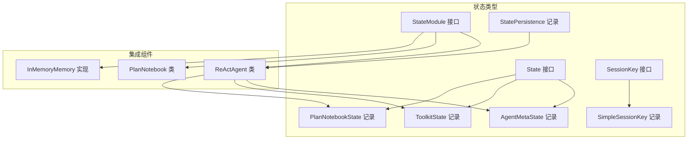
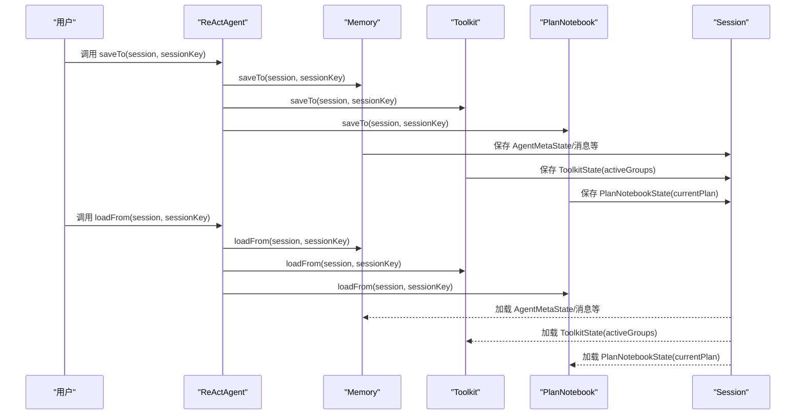
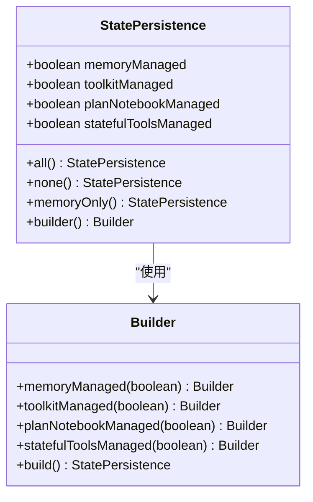
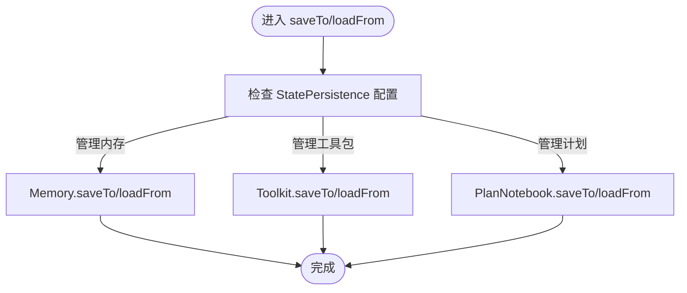
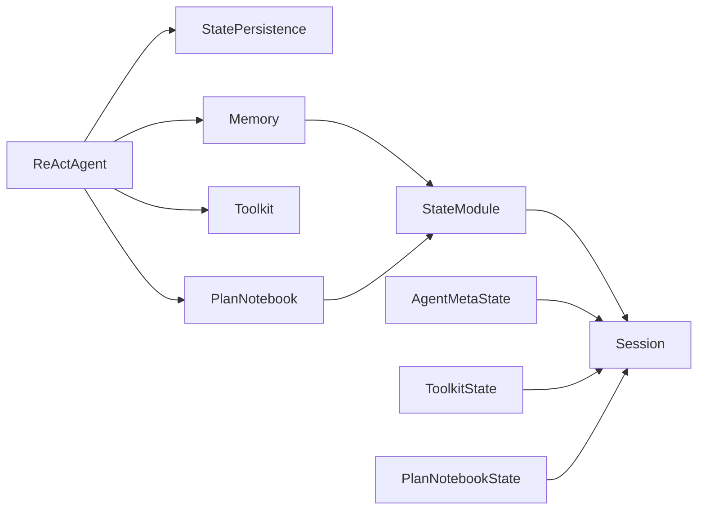

# 状态类型与实现

<cite>
**本文引用的文件**
- [State.java](file://agentscope-core/src/main/java/io/agentscope/core/state/State.java)
- [AgentMetaState.java](file://agentscope-core/src/main/java/io/agentscope/core/state/AgentMetaState.java)
- [ToolkitState.java](file://agentscope-core/src/main/java/io/agentscope/core/state/ToolkitState.java)
- [PlanNotebookState.java](file://agentscope-core/src/main/java/io/agentscope/core/state/PlanNotebookState.java)
- [StateModule.java](file://agentscope-core/src/main/java/io/agentscope/core/state/StateModule.java)
- [StatePersistence.java](file://agentscope-core/src/main/java/io/agentscope/core/state/StatePersistence.java)
- [SessionKey.java](file://agentscope-core/src/main/java/io/agentscope/core/state/SessionKey.java)
- [SimpleSessionKey.java](file://agentscope-core/src/main/java/io/agentscope/core/state/SimpleSessionKey.java)
- [ReActAgent.java](file://agentscope-core/src/main/java/io/agentscope/core/ReActAgent.java)
- [PlanNotebook.java](file://agentscope-core/src/main/java/io/agentscope/core/plan/PlanNotebook.java)
- [InMemoryMemory.java](file://agentscope-core/src/main/java/io/agentscope/core/memory/InMemoryMemory.java)
- [StatePersistenceTest.java](file://agentscope-core/src/test/java/io/agentscope/core/state/StatePersistenceTest.java)
</cite>

## 目录
1. [引言](#引言)
2. [项目结构](#项目结构)
3. [核心组件](#核心组件)
4. [架构总览](#架构总览)
5. [详细组件分析](#详细组件分析)
6. [依赖关系分析](#依赖关系分析)
7. [性能考量](#性能考量)
8. [故障排查指南](#故障排查指南)
9. [结论](#结论)
10. [附录：扩展与最佳实践](#附录扩展与最佳实践)

## 引言
本文件面向 AgentScope Java 的状态类型系统，系统性阐述 State 接口的设计理念、标记接口的作用以及内置状态类型的实现与使用场景。重点覆盖以下内容：
- State 接口作为可持久化状态对象的标记接口，推荐使用 Java Records 简洁实现。
- 内置状态类型：AgentMetaState（智能体元数据状态）、ToolkitState（工具包状态）、PlanNotebookState（计划笔记本状态）。
- 状态对象的创建、序列化要求与性能考量。
- 扩展指南：如何实现自定义状态类并接入会话持久化。
- 与 ReActAgent、PlanNotebook、InMemoryMemory 等组件的状态管理集成。

## 项目结构
状态类型系统位于 agentscope-core 模块的 state 包中，并与会话（Session）及 ReActAgent 等组件协同工作。关键文件如下：
- 标记接口与键值抽象：State、SessionKey、SimpleSessionKey
- 内置状态记录：AgentMetaState、ToolkitState、PlanNotebookState
- 状态模块接口：StateModule
- 状态持久化配置：StatePersistence
- 集成示例：ReActAgent、PlanNotebook、InMemoryMemory

图表来源
- [State.java:18-47](file://agentscope-core/src/main/java/io/agentscope/core/state/State.java#L18-L47)
- [StateModule.java:20-44](file://agentscope-core/src/main/java/io/agentscope/core/state/StateModule.java#L20-L44)
- [SessionKey.java:20-44](file://agentscope-core/src/main/java/io/agentscope/core/state/SessionKey.java#L20-L44)
- [SimpleSessionKey.java:20-37](file://agentscope-core/src/main/java/io/agentscope/core/state/SimpleSessionKey.java#L20-L37)
- [AgentMetaState.java:18-42](file://agentscope-core/src/main/java/io/agentscope/core/state/AgentMetaState.java#L18-L42)
- [ToolkitState.java:18-42](file://agentscope-core/src/main/java/io/agentscope/core/state/ToolkitState.java#L18-L42)
- [PlanNotebookState.java:18-44](file://agentscope-core/src/main/java/io/agentscope/core/state/PlanNotebookState.java#L18-L44)
- [StatePersistence.java:69-98](file://agentscope-core/src/main/java/io/agentscope/core/state/StatePersistence.java#L69-L98)
- [ReActAgent.java:140-194](file://agentscope-core/src/main/java/io/agentscope/core/ReActAgent.java#L140-L194)
- [PlanNotebook.java:103-169](file://agentscope-core/src/main/java/io/agentscope/core/plan/PlanNotebook.java#L103-L169)
- [InMemoryMemory.java:44-69](file://agentscope-core/src/main/java/io/agentscope/core/memory/InMemoryMemory.java#L44-L69)

章节来源
- [State.java:18-47](file://agentscope-core/src/main/java/io/agentscope/core/state/State.java#L18-L47)
- [StateModule.java:20-44](file://agentscope-core/src/main/java/io/agentscope/core/state/StateModule.java#L20-L44)
- [SessionKey.java:20-44](file://agentscope-core/src/main/java/io/agentscope/core/state/SessionKey.java#L20-L44)
- [SimpleSessionKey.java:20-37](file://agentscope-core/src/main/java/io/agentscope/core/state/SimpleSessionKey.java#L20-L37)
- [AgentMetaState.java:18-42](file://agentscope-core/src/main/java/io/agentscope/core/state/AgentMetaState.java#L18-L42)
- [ToolkitState.java:18-42](file://agentscope-core/src/main/java/io/agentscope/core/state/ToolkitState.java#L18-L42)
- [PlanNotebookState.java:18-44](file://agentscope-core/src/main/java/io/agentscope/core/state/PlanNotebookState.java#L18-L44)
- [StatePersistence.java:69-98](file://agentscope-core/src/main/java/io/agentscope/core/state/StatePersistence.java#L69-L98)
- [ReActAgent.java:140-194](file://agentscope-core/src/main/java/io/agentscope/core/ReActAgent.java#L140-L194)
- [PlanNotebook.java:103-169](file://agentscope-core/src/main/java/io/agentscope/core/plan/PlanNotebook.java#L103-L169)
- [InMemoryMemory.java:44-69](file://agentscope-core/src/main/java/io/agentscope/core/memory/InMemoryMemory.java#L44-L69)

## 核心组件
- State 接口：标记可持久化状态对象；推荐使用 Java Records 简洁实现；现有领域对象（如消息）可直接实现该接口以避免转换开销。
- StateModule 接口：为具备状态的组件提供统一的保存/加载能力，默认方法支持字符串会话 ID 与 SessionKey 的互转。
- SessionKey 抽象：会话标识符的标记接口；默认实现 SimpleSessionKey 使用简单字符串；支持自定义复合键结构。
- StatePersistence 记录：控制 ReActAgent 对各子组件（内存、工具包、计划笔记本、有状态工具）的状态管理策略，提供静态工厂与构建器。
- 内置状态记录：
  - AgentMetaState：封装智能体元信息（id、name、description、systemPrompt），用于跨会话恢复智能体配置。
  - ToolkitState：封装当前激活的工具分组列表，用于恢复工具包的 activeGroups。
  - PlanNotebookState：封装当前活动计划对象，用于恢复计划笔记本状态。

章节来源
- [State.java:18-47](file://agentscope-core/src/main/java/io/agentscope/core/state/State.java#L18-L47)
- [StateModule.java:45-120](file://agentscope-core/src/main/java/io/agentscope/core/state/StateModule.java#L45-L120)
- [SessionKey.java:46-62](file://agentscope-core/src/main/java/io/agentscope/core/state/SessionKey.java#L46-L62)
- [SimpleSessionKey.java:37-69](file://agentscope-core/src/main/java/io/agentscope/core/state/SimpleSessionKey.java#L37-L69)
- [StatePersistence.java:70-161](file://agentscope-core/src/main/java/io/agentscope/core/state/StatePersistence.java#L70-L161)
- [AgentMetaState.java:18-42](file://agentscope-core/src/main/java/io/agentscope/core/state/AgentMetaState.java#L18-L42)
- [ToolkitState.java:18-42](file://agentscope-core/src/main/java/io/agentscope/core/state/ToolkitState.java#L18-L42)
- [PlanNotebookState.java:18-44](file://agentscope-core/src/main/java/io/agentscope/core/state/PlanNotebookState.java#L18-L44)

## 架构总览
ReActAgent 通过 StateModule 接口统一管理其子组件的状态保存与加载，StatePersistence 控制是否由 ReActAgent 自动管理各组件状态。内置状态记录作为可序列化的数据载体，配合 SessionKey 与 Session 实现跨进程/跨重启的恢复。

图表来源
- [ReActAgent.java:299-356](file://agentscope-core/src/main/java/io/agentscope/core/ReActAgent.java#L299-L356)
- [StateModule.java:56-93](file://agentscope-core/src/main/java/io/agentscope/core/state/StateModule.java#L56-L93)
- [InMemoryMemory.java:57-69](file://agentscope-core/src/main/java/io/agentscope/core/memory/InMemoryMemory.java#L57-L69)
- [PlanNotebook.java:157-169](file://agentscope-core/src/main/java/io/agentscope/core/plan/PlanNotebook.java#L157-L169)
- [AgentMetaState.java:24-32](file://agentscope-core/src/main/java/io/agentscope/core/state/AgentMetaState.java#L24-L32)
- [ToolkitState.java:27-36](file://agentscope-core/src/main/java/io/agentscope/core/state/ToolkitState.java#L27-L36)
- [PlanNotebookState.java:26-37](file://agentscope-core/src/main/java/io/agentscope/core/state/PlanNotebookState.java#L26-L37)

## 详细组件分析

### State 接口与标记语义
- 设计理念：State 是“可持久化状态对象”的标记接口，不强制具体行为，便于与会话系统协作。
- 推荐实现：优先使用 Java Records，具备不可变、无样板代码、自动 equals/hashCode 的优势。
- 兼容性：现有领域对象（如消息）可直接实现 State，避免额外转换成本。

章节来源
- [State.java:18-47](file://agentscope-core/src/main/java/io/agentscope/core/state/State.java#L18-L47)

### StateModule 接口：统一状态存取
- 能力：为组件提供 saveTo/loadFrom/loadIfExists 的默认实现，支持字符串会话 ID 与 SessionKey。
- 用途：ReActAgent 及其子组件（Memory、PlanNotebook）均实现该接口，统一纳入会话管理。

章节来源
- [StateModule.java:45-120](file://agentscope-core/src/main/java/io/agentscope/core/state/StateModule.java#L45-L120)

### SessionKey 抽象与 SimpleSessionKey
- SessionKey：会话标识符的标记接口，默认 JSON 序列化为字符串标识。
- SimpleSessionKey：单字符串键的推荐实现，构造时进行非空校验，toIdentifier 返回原始字符串，toString 直接返回键值。
- 自定义键：可按多租户等场景组合多个维度（如 tenantId、userId、sessionId）形成复合键。

章节来源
- [SessionKey.java:46-62](file://agentscope-core/src/main/java/io/agentscope/core/state/SessionKey.java#L46-L62)
- [SimpleSessionKey.java:37-69](file://agentscope-core/src/main/java/io/agentscope/core/state/SimpleSessionKey.java#L37-L69)

### StatePersistence：状态管理策略
- 字段：memoryManaged、toolkitManaged、planNotebookManaged、statefulToolsManaged。
- 默认策略：all() 全部管理；none() 不管理；memoryOnly() 仅管理内存。
- 构建器：支持链式设置各组件的管理开关，便于灵活定制。

图表来源
- [StatePersistence.java:70-161](file://agentscope-core/src/main/java/io/agentscope/core/state/StatePersistence.java#L70-L161)

章节来源
- [StatePersistence.java:69-161](file://agentscope-core/src/main/java/io/agentscope/core/state/StatePersistence.java#L69-L161)
- [StatePersistenceTest.java:30-176](file://agentscope-core/src/test/java/io/agentscope/core/state/StatePersistenceTest.java#L30-L176)

### AgentMetaState：智能体元数据状态
- 数据结构：包含智能体唯一标识、显示名、描述、系统提示词。
- 使用场景：在会话中保存/恢复智能体配置，确保重启后保持一致的行为设定。
- 创建方式：推荐使用 Java Records，构造参数即公开只读字段。

章节来源
- [AgentMetaState.java:18-42](file://agentscope-core/src/main/java/io/agentscope/core/state/AgentMetaState.java#L18-L42)

### ToolkitState：工具包状态
- 数据结构：当前激活的工具分组名称列表。
- 使用场景：保存/恢复工具包 activeGroups 配置，避免每次启动重新配置。
- 创建方式：使用 Records 简洁表达，List 为可变容器，建议对外暴露只读视图或不可变副本。

章节来源
- [ToolkitState.java:18-42](file://agentscope-core/src/main/java/io/agentscope/core/state/ToolkitState.java#L18-L42)

### PlanNotebookState：计划笔记本状态
- 数据结构：当前活动计划对象（可为空）。
- 使用场景：保存/恢复当前计划及其子任务结构，便于中断后继续执行。
- 注意：Plan 对象本身需具备良好的序列化能力，以便被会话系统正确持久化。

章节来源
- [PlanNotebookState.java:18-44](file://agentscope-core/src/main/java/io/agentscope/core/state/PlanNotebookState.java#L18-L44)

### ReActAgent 与状态模块集成
- ReActAgent 实现 StateModule，默认在 saveTo/loadFrom 中依次调用子组件的保存/加载。
- StatePersistence 决定 ReActAgent 是否接管各子组件的状态管理。
- 子组件（Memory、PlanNotebook）各自实现 StateModule，负责自身状态的序列化与反序列化。

图表来源
- [ReActAgent.java:299-356](file://agentscope-core/src/main/java/io/agentscope/core/ReActAgent.java#L299-L356)
- [StatePersistence.java:76-89](file://agentscope-core/src/main/java/io/agentscope/core/state/StatePersistence.java#L76-L89)
- [PlanNotebook.java:157-169](file://agentscope-core/src/main/java/io/agentscope/core/plan/PlanNotebook.java#L157-L169)
- [InMemoryMemory.java:57-69](file://agentscope-core/src/main/java/io/agentscope/core/memory/InMemoryMemory.java#L57-L69)

章节来源
- [ReActAgent.java:140-194](file://agentscope-core/src/main/java/io/agentscope/core/ReActAgent.java#L140-L194)
- [ReActAgent.java:299-356](file://agentscope-core/src/main/java/io/agentscope/core/ReActAgent.java#L299-L356)
- [PlanNotebook.java:103-169](file://agentscope-core/src/main/java/io/agentscope/core/plan/PlanNotebook.java#L103-L169)
- [InMemoryMemory.java:44-69](file://agentscope-core/src/main/java/io/agentscope/core/memory/InMemoryMemory.java#L44-L69)

## 依赖关系分析
- 组件耦合：
  - ReActAgent 依赖 StatePersistence 控制对子组件的状态管理。
  - 子组件（Memory、PlanNotebook）实现 StateModule，向会话系统暴露保存/加载能力。
  - 内置状态记录（AgentMetaState、ToolkitState、PlanNotebookState）作为数据载体，被相应组件保存/加载。
- 外部依赖：
  - 会话系统（Session）负责实际的序列化与存储；状态记录需满足会话系统的序列化要求。
  - ReActAgent 通过 SessionKey/Session 提供统一的键空间与存储策略。

图表来源
- [ReActAgent.java:140-194](file://agentscope-core/src/main/java/io/agentscope/core/ReActAgent.java#L140-L194)
- [StatePersistence.java:70-98](file://agentscope-core/src/main/java/io/agentscope/core/state/StatePersistence.java#L70-L98)
- [StateModule.java:45-120](file://agentscope-core/src/main/java/io/agentscope/core/state/StateModule.java#L45-L120)
- [AgentMetaState.java:18-42](file://agentscope-core/src/main/java/io/agentscope/core/state/AgentMetaState.java#L18-L42)
- [ToolkitState.java:18-42](file://agentscope-core/src/main/java/io/agentscope/core/state/ToolkitState.java#L18-L42)
- [PlanNotebookState.java:18-44](file://agentscope-core/src/main/java/io/agentscope/core/state/PlanNotebookState.java#L18-L44)

## 性能考量
- 使用 Java Records 作为状态记录：不可变、线程安全、JVM 优化友好，减少序列化与拷贝成本。
- 列表字段（如 ToolkitState.activeGroups）建议使用不可变视图或小对象集合，降低序列化体积与 GC 压力。
- 复杂对象（如 PlanNotebookState.currentPlan）应确保可序列化且尽量避免循环引用，必要时提供精简的序列化视图。
- SessionKey 默认 JSON 序列化可能带来额外开销，SimpleSessionKey 直接返回字符串键更高效，适用于大多数场景。

## 故障排查指南
- 状态未恢复：
  - 检查 StatePersistence 配置是否启用对应组件的自动管理。
  - 确认 SessionKey 正确且与保存时一致。
  - 核对状态记录字段与会话存储格式匹配。
- ToolkitState 恢复异常：
  - 确保 activeGroups 列表元素为可序列化字符串。
  - 若存在自定义工具注册逻辑，需保证恢复后仍能正确重建工具映射。
- PlanNotebookState 恢复失败：
  - 确认 Plan 对象具备稳定序列化能力；必要时提供版本兼容策略。
- 自定义状态类实现：
  - 实现 State 接口；优先使用 Records；确保所有字段均可被会话系统序列化。
  - 如需参与 ReActAgent 的状态管理，实现 StateModule 并在 saveTo/loadFrom 中处理状态持久化。

章节来源
- [StatePersistenceTest.java:30-176](file://agentscope-core/src/test/java/io/agentscope/core/state/StatePersistenceTest.java#L30-L176)
- [StatePersistence.java:69-161](file://agentscope-core/src/main/java/io/agentscope/core/state/StatePersistence.java#L69-L161)
- [SessionKey.java:46-62](file://agentscope-core/src/main/java/io/agentscope/core/state/SessionKey.java#L46-L62)
- [SimpleSessionKey.java:37-69](file://agentscope-core/src/main/java/io/agentscope/core/state/SimpleSessionKey.java#L37-L69)

## 结论
AgentScope Java 的状态类型系统以 State 接口为核心，结合 StateModule、SessionKey、StatePersistence 与内置状态记录，提供了统一、可扩展且高性能的状态管理方案。通过 Java Records 简化状态对象实现，配合 ReActAgent 的自动状态管理策略，开发者可以快速实现跨会话的智能体状态恢复与演进。

## 附录：扩展与最佳实践
- 自定义状态类实现步骤
  - 定义一个实现 State 的记录类，字段均为可序列化类型。
  - 在需要的组件中实现 StateModule，并在 saveTo/loadFrom 中通过 Session 进行保存/加载。
  - 使用 SimpleSessionKey 或自定义 SessionKey 以适配业务键空间。
- 序列化要求
  - 确保状态记录中的所有字段均可被会话系统序列化（如 JSON）。
  - 复杂对象建议提供稳定、向后兼容的序列化结构。
- 性能优化建议
  - 优先使用 Records；避免在状态中携带大对象或频繁变更的对象。
  - 对列表/映射字段提供不可变视图，减少拷贝与并发修改风险。
  - 合理拆分状态，避免单条状态过大导致序列化/反序列化耗时增加。
- 与 ReActAgent 集成
  - 通过 StatePersistence 控制是否由 ReActAgent 自动管理组件状态。
  - 在 saveTo/loadFrom 中按需调用子组件的保存/加载逻辑，确保一致性。