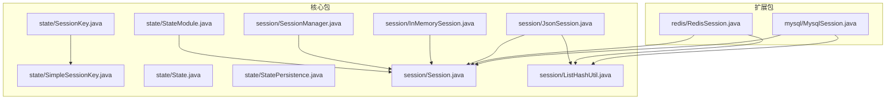
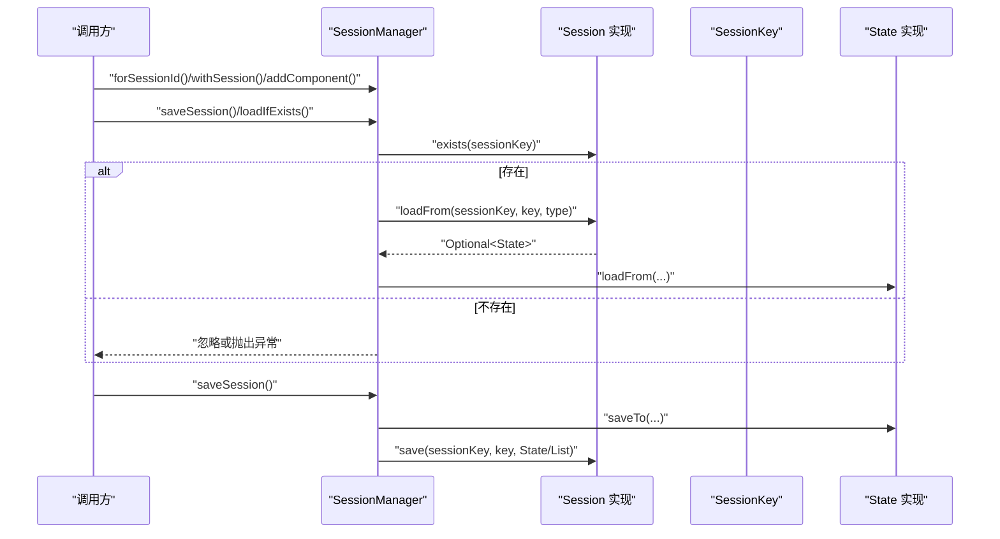
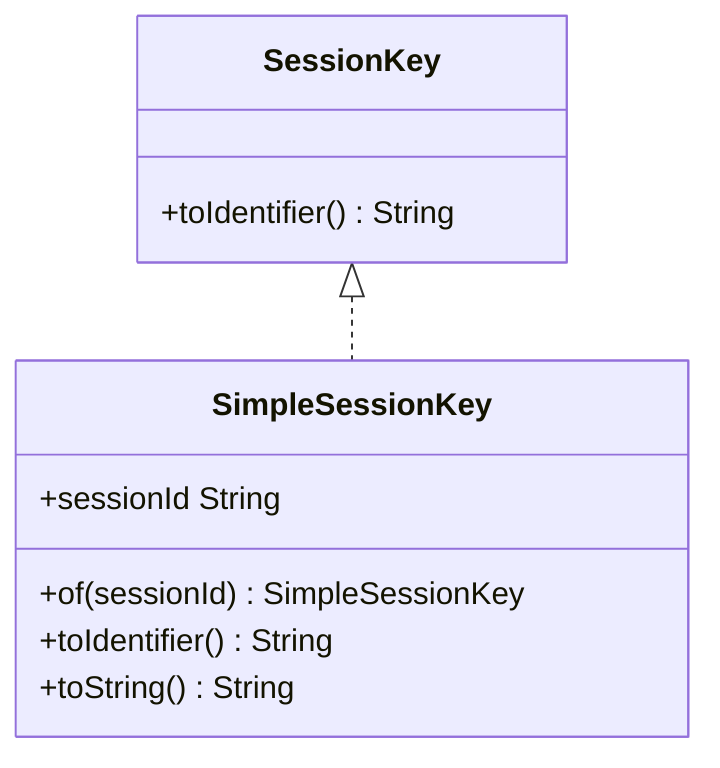
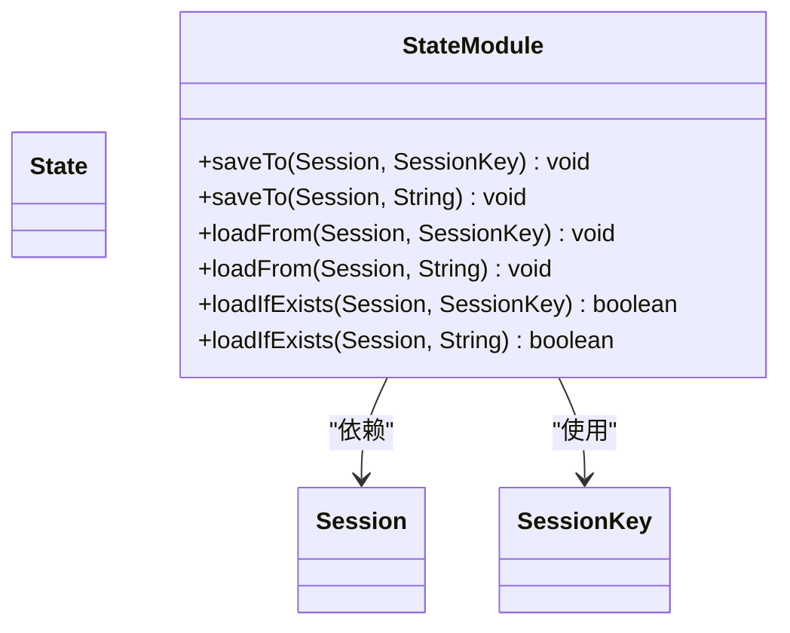
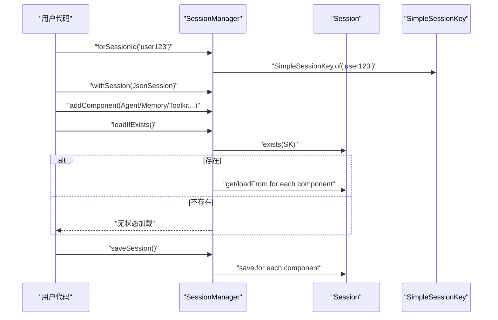
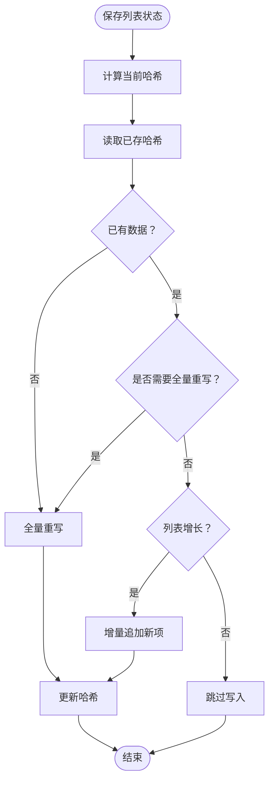
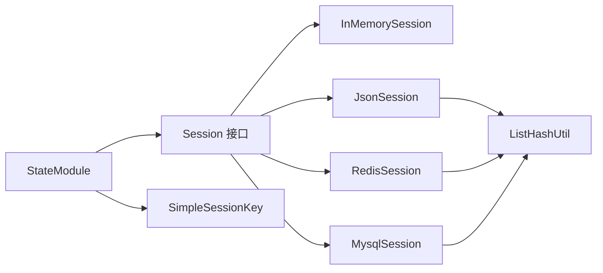

# 状态键管理

<cite>
**本文引用的文件**
- [SessionKey.java](file://agentscope-core/src/main/java/io/agentscope/core/state/SessionKey.java)
- [SimpleSessionKey.java](file://agentscope-core/src/main/java/io/agentscope/core/state/SimpleSessionKey.java)
- [State.java](file://agentscope-core/src/main/java/io/agentscope/core/state/State.java)
- [StateModule.java](file://agentscope-core/src/main/java/io/agentscope/core/state/StateModule.java)
- [StatePersistence.java](file://agentscope-core/src/main/java/io/agentscope/core/state/StatePersistence.java)
- [Session.java](file://agentscope-core/src/main/java/io/agentscope/core/session/Session.java)
- [SessionManager.java](file://agentscope-core/src/main/java/io/agentscope/core/session/SessionManager.java)
- [InMemorySession.java](file://agentscope-core/src/main/java/io/agentscope/core/session/InMemorySession.java)
- [JsonSession.java](file://agentscope-core/src/main/java/io/agentscope/core/session/JsonSession.java)
- [RedisSession.java](file://agentscope-extensions/agentscope-extensions-session-redis/src/main/java/io/agentscope/core/session/redis/RedisSession.java)
- [MysqlSession.java](file://agentscope-extensions/agentscope-extensions-session-mysql/src/main/java/io/agentscope/core/session/mysql/MysqlSession.java)
- [ListHashUtil.java](file://agentscope-core/src/main/java/io/agentscope/core/session/ListHashUtil.java)
</cite>

## 目录
1. [简介](#简介)
2. [项目结构](#项目结构)
3. [核心组件](#核心组件)
4. [架构总览](#架构总览)
5. [详细组件分析](#详细组件分析)
6. [依赖关系分析](#依赖关系分析)
7. [性能考量](#性能考量)
8. [故障排查指南](#故障排查指南)
9. [结论](#结论)
10. [附录](#附录)

## 简介
本文件系统性地解析 AgentScope Java 的状态键（SessionKey）管理体系，围绕以下目标展开：
- 深入解释 SessionKey 接口的设计目的与键值管理机制
- 详解 SimpleSessionKey 的实现原理与键值生成策略
- 阐述状态键的唯一性保证、命名空间隔离与作用域管理
- 解释状态键在分布式环境下的冲突避免与一致性保障
- 提供状态键的自定义实现指南与最佳实践
- 覆盖状态键的序列化格式、版本兼容性与迁移策略
- 涵盖安全性考虑与访问控制机制

## 项目结构
状态键管理相关代码主要位于 agentscope-core 的 state 与 session 包中，并通过扩展模块支持 Redis、MySQL 等分布式存储后端。

**图示来源**
- [SessionKey.java:46-62](file://agentscope-core/src/main/java/io/agentscope/core/state/SessionKey.java#L46-L62)
- [SimpleSessionKey.java:37-70](file://agentscope-core/src/main/java/io/agentscope/core/state/SimpleSessionKey.java#L37-L70)
- [StateModule.java:45-120](file://agentscope-core/src/main/java/io/agentscope/core/state/StateModule.java#L45-L120)
- [Session.java:53-145](file://agentscope-core/src/main/java/io/agentscope/core/session/Session.java#L53-L145)
- [SessionManager.java:61-260](file://agentscope-core/src/main/java/io/agentscope/core/session/SessionManager.java#L61-L260)
- [InMemorySession.java:58-249](file://agentscope-core/src/main/java/io/agentscope/core/session/InMemorySession.java#L58-L249)
- [JsonSession.java:58-509](file://agentscope-core/src/main/java/io/agentscope/core/session/JsonSession.java#L58-L509)
- [RedisSession.java:179-483](file://agentscope-extensions/agentscope-extensions-session-redis/src/main/java/io/agentscope/core/session/redis/RedisSession.java#L179-L483)
- [MysqlSession.java:70-846](file://agentscope-extensions/agentscope-extensions-session-mysql/src/main/java/io/agentscope/core/session/mysql/MysqlSession.java#L70-L846)
- [ListHashUtil.java:49-172](file://agentscope-core/src/main/java/io/agentscope/core/session/ListHashUtil.java#L49-L172)

**章节来源**
- [SessionKey.java:16-62](file://agentscope-core/src/main/java/io/agentscope/core/state/SessionKey.java#L16-L62)
- [SimpleSessionKey.java:16-70](file://agentscope-core/src/main/java/io/agentscope/core/state/SimpleSessionKey.java#L16-L70)
- [Session.java:16-145](file://agentscope-core/src/main/java/io/agentscope/core/session/Session.java#L16-L145)
- [SessionManager.java:61-260](file://agentscope-core/src/main/java/io/agentscope/core/session/SessionManager.java#L61-L260)

## 核心组件
- SessionKey：会话标识符标记接口，默认将自身序列化为字符串标识；SimpleSessionKey 为默认实现，直接返回 sessionId 字符串，提升可读性与可移植性。
- State：可持久化状态对象标记接口，推荐使用 Java Records 表达简单状态。
- StateModule：具备状态持久化能力的组件接口，提供 saveTo/loadFrom/loadIfExists 的统一入口，支持 SessionKey 与字符串两种形式。
- StatePersistence：ReActAgent 等组件的状态持久化配置记录类，用于选择性管理不同子系统的状态保存。
- Session：会话存储接口，定义单值、列表的保存与读取、存在性检查、删除、列出所有会话键等操作。
- SessionManager：简化 API 的会话管理器，基于 SessionKey 统一加载/保存多个 StateModule 组件的状态。
- 存储实现：InMemorySession（内存）、JsonSession（文件）、RedisSession（Redis）、MysqlSession（MySQL），均以 SessionKey 作为键前缀或命名空间的一部分。

**章节来源**
- [SessionKey.java:20-62](file://agentscope-core/src/main/java/io/agentscope/core/state/SessionKey.java#L20-L62)
- [SimpleSessionKey.java:20-70](file://agentscope-core/src/main/java/io/agentscope/core/state/SimpleSessionKey.java#L20-L70)
- [State.java:18-47](file://agentscope-core/src/main/java/io/agentscope/core/state/State.java#L18-L47)
- [StateModule.java:20-120](file://agentscope-core/src/main/java/io/agentscope/core/state/StateModule.java#L20-L120)
- [StatePersistence.java:69-162](file://agentscope-core/src/main/java/io/agentscope/core/state/StatePersistence.java#L69-L162)
- [Session.java:24-145](file://agentscope-core/src/main/java/io/agentscope/core/session/Session.java#L24-L145)
- [SessionManager.java:24-260](file://agentscope-core/src/main/java/io/agentscope/core/session/SessionManager.java#L24-L260)

## 架构总览
状态键在系统中的流转路径如下：

**图示来源**
- [SessionManager.java:130-202](file://agentscope-core/src/main/java/io/agentscope/core/session/SessionManager.java#L130-L202)
- [Session.java:53-145](file://agentscope-core/src/main/java/io/agentscope/core/session/Session.java#L53-L145)
- [StateModule.java:45-120](file://agentscope-core/src/main/java/io/agentscope/core/state/StateModule.java#L45-L120)

## 详细组件分析

### SessionKey 接口与 SimpleSessionKey 实现
- 设计目的
  - 作为会话标识符的统一抽象，允许在多租户或多维度场景下自定义键结构。
  - 默认通过 JSON 序列化生成字符串标识，便于跨存储层一致化处理。
- SimpleSessionKey
  - 使用字符串 sessionId 作为唯一标识，构造时进行非空与非空白校验。
  - 重写 toIdentifier 返回 sessionId，提高可读性与可移植性。
- 自定义实现建议
  - 多租户场景可组合 tenantId、userId、sessionId 等字段，Session 实现据此决定命名空间或分片策略。
  - 保持 toIdentifier 的稳定语义，确保跨存储后端的一致性。

**图示来源**
- [SessionKey.java:46-62](file://agentscope-core/src/main/java/io/agentscope/core/state/SessionKey.java#L46-L62)
- [SimpleSessionKey.java:37-70](file://agentscope-core/src/main/java/io/agentscope/core/state/SimpleSessionKey.java#L37-L70)

**章节来源**
- [SessionKey.java:20-62](file://agentscope-core/src/main/java/io/agentscope/core/state/SessionKey.java#L20-L62)
- [SimpleSessionKey.java:20-70](file://agentscope-core/src/main/java/io/agentscope/core/state/SimpleSessionKey.java#L20-L70)

### State 与 StateModule：状态模型与持久化入口
- State：标记接口，推荐使用不可变数据结构（如 Java Records）表达状态。
- StateModule：
  - saveTo/loadFrom/loadIfExists 提供统一的持久化入口。
  - 支持 SessionKey 与字符串两种形式，字符串形式内部转换为 SimpleSessionKey。
  - 默认方法为空实现，子类按需覆盖。

**图示来源**
- [State.java:18-47](file://agentscope-core/src/main/java/io/agentscope/core/state/State.java#L18-L47)
- [StateModule.java:45-120](file://agentscope-core/src/main/java/io/agentscope/core/state/StateModule.java#L45-L120)
- [Session.java:53-145](file://agentscope-core/src/main/java/io/agentscope/core/session/Session.java#L53-L145)
- [SessionKey.java:46-62](file://agentscope-core/src/main/java/io/agentscope/core/state/SessionKey.java#L46-L62)

**章节来源**
- [State.java:18-47](file://agentscope-core/src/main/java/io/agentscope/core/state/State.java#L18-L47)
- [StateModule.java:20-120](file://agentscope-core/src/main/java/io/agentscope/core/state/StateModule.java#L20-L120)

### Session 与 SessionManager：键到存储的映射
- Session 接口
  - 定义单值与列表两类状态的保存/读取、存在性检查、删除、列出会话键等能力。
  - 所有实现均以 SessionKey 作为键的首要部分，确保命名空间隔离。
- SessionManager
  - 以字符串 sessionId 构造 SimpleSessionKey，统一管理多个 StateModule 的加载/保存。
  - 提供 loadIfExists/loadOrThrow/saveSession/saveOrThrow/saveIfExists/deleteIfExists/deleteOrThrow 等便捷方法。

**图示来源**
- [SessionManager.java:61-202](file://agentscope-core/src/main/java/io/agentscope/core/session/SessionManager.java#L61-L202)
- [Session.java:53-145](file://agentscope-core/src/main/java/io/agentscope/core/session/Session.java#L53-L145)
- [SimpleSessionKey.java:57-59](file://agentscope-core/src/main/java/io/agentscope/core/state/SimpleSessionKey.java#L57-L59)

**章节来源**
- [Session.java:24-145](file://agentscope-core/src/main/java/io/agentscope/core/session/Session.java#L24-L145)
- [SessionManager.java:24-260](file://agentscope-core/src/main/java/io/agentscope/core/session/SessionManager.java#L24-L260)

### 存储实现与键命名空间
- InMemorySession
  - 将 SessionKey 序列化为字符串作为内存 Map 的键；SimpleSessionKey 直接使用 sessionId。
  - 列表存储采用不可变副本，线程安全。
- JsonSession
  - 以 SessionKey.toIdentifier() 作为目录名，避免特殊字符时进行 Base64 URL 编码。
  - 单值状态保存为 {key}.json，列表状态保存为 {key}.jsonl，配合 {key}.hash 进行变更检测。
- RedisSession
  - 键结构：{prefix}{sessionId}:{stateKey}（单值）、{prefix}{sessionId}:{stateKey}:list（列表）、{prefix}{sessionId}:{stateKey}:list:_hash（哈希）、{prefix}{sessionId}:_keys（会话键集合）。
  - 通过集合跟踪会话内所有键，支持列出会话键。
- MysqlSession
  - 表结构：(session_id, state_key, item_index) 主键，item_index=0 表示单值，>0 表示列表项。
  - 通过 item_index 实现真正的增量存储，避免读-改-写。

**图示来源**
- [ListHashUtil.java:148-171](file://agentscope-core/src/main/java/io/agentscope/core/session/ListHashUtil.java#L148-L171)
- [JsonSession.java:127-162](file://agentscope-core/src/main/java/io/agentscope/core/session/JsonSession.java#L127-L162)
- [RedisSession.java:228-267](file://agentscope-extensions/agentscope-extensions-session-redis/src/main/java/io/agentscope/core/session/redis/RedisSession.java#L228-L267)
- [MysqlSession.java:374-418](file://agentscope-extensions/agentscope-extensions-session-mysql/src/main/java/io/agentscope/core/session/mysql/MysqlSession.java#L374-L418)

**章节来源**
- [InMemorySession.java:58-249](file://agentscope-core/src/main/java/io/agentscope/core/session/InMemorySession.java#L58-L249)
- [JsonSession.java:58-509](file://agentscope-core/src/main/java/io/agentscope/core/session/JsonSession.java#L58-L509)
- [RedisSession.java:179-483](file://agentscope-extensions/agentscope-extensions-session-redis/src/main/java/io/agentscope/core/session/redis/RedisSession.java#L179-L483)
- [MysqlSession.java:70-846](file://agentscope-extensions/agentscope-extensions-session-mysql/src/main/java/io/agentscope/core/session/mysql/MysqlSession.java#L70-L846)
- [ListHashUtil.java:49-172](file://agentscope-core/src/main/java/io/agentscope/core/session/ListHashUtil.java#L49-L172)

### 分布式环境下的冲突避免与一致性
- 冲突避免
  - SessionKey.toIdentifier() 作为键前缀，确保不同会话之间天然隔离。
  - Redis/MySQL 实现通过主键约束（Redis Set、MySQL 复合主键）避免同键重复写入。
  - JsonSession 通过目录隔离与原子写入（文件级）降低并发冲突概率。
- 一致性保障
  - 列表状态采用哈希检测与增量写入策略，避免并发写入导致的数据不一致。
  - Redis/MySQL 在写入时使用事务或显式事务，失败回滚，保证 ACID。
  - InMemorySession 通过并发安全容器与不可变副本，保证线程安全。

**章节来源**
- [RedisSession.java:213-349](file://agentscope-extensions/agentscope-extensions-session-redis/src/main/java/io/agentscope/core/session/redis/RedisSession.java#L213-L349)
- [MysqlSession.java:325-418](file://agentscope-extensions/agentscope-extensions-session-mysql/src/main/java/io/agentscope/core/session/mysql/MysqlSession.java#L325-L418)
- [JsonSession.java:127-162](file://agentscope-core/src/main/java/io/agentscope/core/session/JsonSession.java#L127-L162)
- [InMemorySession.java:60-92](file://agentscope-core/src/main/java/io/agentscope/core/session/InMemorySession.java#L60-L92)

### 唯一性保证、命名空间隔离与作用域管理
- 唯一性
  - SimpleSessionKey 的 sessionId 必须满足非空与非空白约束，作为全局唯一标识的基础。
  - 自定义 SessionKey 可组合多维信息（如 tenantId+userId+sessionId），由上层业务保证唯一性。
- 命名空间隔离
  - 各存储实现均以 SessionKey 为前缀或目录名，确保不同会话互不干扰。
  - Redis 使用 Set 记录会话内的键集合，文件系统使用目录隔离。
- 作用域管理
  - StateModule 仅对注册的组件进行加载/保存，避免跨组件污染。
  - StatePersistence 可选择性关闭某些组件的状态管理，实现细粒度的作用域控制。

**章节来源**
- [SimpleSessionKey.java:44-49](file://agentscope-core/src/main/java/io/agentscope/core/state/SimpleSessionKey.java#L44-L49)
- [JsonSession.java:342-353](file://agentscope-core/src/main/java/io/agentscope/core/session/JsonSession.java#L342-L353)
- [RedisSession.java:352-369](file://agentscope-extensions/agentscope-extensions-session-redis/src/main/java/io/agentscope/core/session/redis/RedisSession.java#L352-L369)
- [MysqlSession.java:676-693](file://agentscope-extensions/agentscope-extensions-session-mysql/src/main/java/io/agentscope/core/session/mysql/MysqlSession.java#L676-L693)
- [StateModule.java:45-120](file://agentscope-core/src/main/java/io/agentscope/core/state/StateModule.java#L45-L120)
- [StatePersistence.java:69-98](file://agentscope-core/src/main/java/io/agentscope/core/state/StatePersistence.java#L69-L98)

### 自定义状态键实现指南
- 设计原则
  - 明确业务维度（如多租户、多用户、多会话），在 SessionKey 中体现。
  - toIdentifier() 必须稳定且可逆或可解析，确保跨存储层一致性。
- 示例思路
  - 多租户：记录 tenantId、userId、sessionId，Session 实现据此选择数据库/表/命名空间。
  - 多会话：在 sessionId 中加入时间戳或随机后缀，避免并发冲突。
- 注意事项
  - 避免在 toIdentifier() 中包含路径分隔符或非法字符，必要时进行转义或编码。
  - 保持向后兼容，新增字段时提供默认值并兼容旧格式。

**章节来源**
- [SessionKey.java:20-45](file://agentscope-core/src/main/java/io/agentscope/core/state/SessionKey.java#L20-L45)
- [MysqlSession.java:791-800](file://agentscope-extensions/agentscope-extensions-session-mysql/src/main/java/io/agentscope/core/session/mysql/MysqlSession.java#L791-L800)

### 序列化格式、版本兼容性与迁移策略
- 序列化格式
  - 默认 JSON：SessionKey.toIdentifier() 默认使用 JSON 序列化；SimpleSessionKey 重写为直接返回 sessionId。
  - 列表状态：JsonSession 使用 JSONL（每行一个 JSON 对象），Redis/MySQL 使用列表结构或多行存储。
- 版本兼容性
  - 列表变更检测：通过 ListHashUtil 计算采样哈希，支持列表增长与修改识别。
  - 兼容策略：当检测到旧版本或哈希缺失时，采用全量重写以保证一致性。
- 迁移策略
  - 新增字段：在 toIdentifier() 中增加版本号或标识，Session 实现根据版本选择解析策略。
  - 数据迁移：先写入新格式并更新哈希，再清理旧格式，确保原子性。

**章节来源**
- [SessionKey.java:59-61](file://agentscope-core/src/main/java/io/agentscope/core/state/SessionKey.java#L59-L61)
- [SimpleSessionKey.java:61-69](file://agentscope-core/src/main/java/io/agentscope/core/state/SimpleSessionKey.java#L61-L69)
- [ListHashUtil.java:77-96](file://agentscope-core/src/main/java/io/agentscope/core/session/ListHashUtil.java#L77-L96)
- [JsonSession.java:127-162](file://agentscope-core/src/main/java/io/agentscope/core/session/JsonSession.java#L127-L162)
- [RedisSession.java:228-267](file://agentscope-extensions/agentscope-extensions-session-redis/src/main/java/io/agentscope/core/session/redis/RedisSession.java#L228-L267)
- [MysqlSession.java:374-418](file://agentscope-extensions/agentscope-extensions-session-mysql/src/main/java/io/agentscope/core/session/mysql/MysqlSession.java#L374-L418)

### 安全性考虑与访问控制
- 输入校验
  - SimpleSessionKey 对 sessionId 进行非空与非空白校验。
  - MysqlSession 对 session_id 进行长度与非法字符限制，防止注入与路径穿越。
- 存储安全
  - Redis/MySQL 通过参数化查询与主键约束，避免 SQL 注入与重复键写入。
  - 文件系统存储对特殊字符进行 Base64 编码，避免路径遍历风险。
- 访问控制
  - 建议在上层网关或服务侧实现基于 SessionKey 的鉴权与授权。
  - 多租户场景下，SessionKey 中应包含租户标识，Session 实现据此进行资源隔离。

**章节来源**
- [SimpleSessionKey.java:44-49](file://agentscope-core/src/main/java/io/agentscope/core/state/SimpleSessionKey.java#L44-L49)
- [MysqlSession.java:791-800](file://agentscope-extensions/agentscope-extensions-session-mysql/src/main/java/io/agentscope/core/session/mysql/MysqlSession.java#L791-L800)
- [JsonSession.java:342-353](file://agentscope-core/src/main/java/io/agentscope/core/session/JsonSession.java#L342-L353)

## 依赖关系分析
- 松耦合设计
  - StateModule 仅依赖 Session 与 SessionKey，不关心具体存储实现。
  - Session 接口屏蔽了 InMemory/Json/Redis/MySQL 的差异，统一对外 API。
- 关键依赖链
  - StateModule → Session → 具体存储实现（InMemorySession/JsonSession/RedisSession/MysqlSession）
  - SessionManager → Session + SimpleSessionKey
  - 列表变更检测 → ListHashUtil

**图示来源**
- [StateModule.java:45-120](file://agentscope-core/src/main/java/io/agentscope/core/state/StateModule.java#L45-L120)
- [Session.java:53-145](file://agentscope-core/src/main/java/io/agentscope/core/session/Session.java#L53-L145)
- [SessionManager.java:61-202](file://agentscope-core/src/main/java/io/agentscope/core/session/SessionManager.java#L61-L202)
- [InMemorySession.java:58-249](file://agentscope-core/src/main/java/io/agentscope/core/session/InMemorySession.java#L58-L249)
- [JsonSession.java:58-509](file://agentscope-core/src/main/java/io/agentscope/core/session/JsonSession.java#L58-L509)
- [RedisSession.java:179-483](file://agentscope-extensions/agentscope-extensions-session-redis/src/main/java/io/agentscope/core/session/redis/RedisSession.java#L179-L483)
- [MysqlSession.java:70-846](file://agentscope-extensions/agentscope-extensions-session-mysql/src/main/java/io/agentscope/core/session/mysql/MysqlSession.java#L70-L846)
- [ListHashUtil.java:49-172](file://agentscope-core/src/main/java/io/agentscope/core/session/ListHashUtil.java#L49-L172)

**章节来源**
- [StateModule.java:45-120](file://agentscope-core/src/main/java/io/agentscope/core/state/StateModule.java#L45-L120)
- [Session.java:53-145](file://agentscope-core/src/main/java/io/agentscope/core/session/Session.java#L53-L145)
- [SessionManager.java:61-202](file://agentscope-core/src/main/java/io/agentscope/core/session/SessionManager.java#L61-L202)

## 性能考量
- 列表增量写入
  - 通过哈希检测与采样策略，避免全量重写，显著降低 I/O 开销。
- 并发与线程安全
  - InMemorySession 使用并发容器与不可变副本，适合单进程高并发场景。
  - Redis/MySQL 写入采用事务，保证一致性的同时控制锁粒度。
- 序列化与编码
  - SimpleSessionKey 直接返回字符串，减少序列化开销。
  - JsonSession 对特殊字符进行 Base64 编码，避免文件系统兼容性问题。

[本节为通用指导，无需“章节来源”]

## 故障排查指南
- 常见问题
  - 会话未找到：检查 Session.exists(sessionKey) 与 SessionManager.sessionExists()。
  - 列表未增量：确认 ListHashUtil 的哈希计算与 storedHash 是否一致。
  - 存储异常：查看具体 Session 实现的异常包装信息（如 JsonSession/RedisSession/MysqlSession）。
- 排查步骤
  - 确认 SessionKey.toIdentifier() 输出符合预期。
  - 检查存储后端的键结构与命名空间是否正确。
  - 对比当前列表与已存哈希，判断是否触发全量重写。
  - 在分布式环境下，确认客户端连接与事务提交状态。

**章节来源**
- [Session.java:106-145](file://agentscope-core/src/main/java/io/agentscope/core/session/Session.java#L106-L145)
- [SessionManager.java:130-202](file://agentscope-core/src/main/java/io/agentscope/core/session/SessionManager.java#L130-L202)
- [ListHashUtil.java:148-171](file://agentscope-core/src/main/java/io/agentscope/core/session/ListHashUtil.java#L148-L171)
- [JsonSession.java:127-162](file://agentscope-core/src/main/java/io/agentscope/core/session/JsonSession.java#L127-L162)
- [RedisSession.java:228-267](file://agentscope-extensions/agentscope-extensions-session-redis/src/main/java/io/agentscope/core/session/redis/RedisSession.java#L228-L267)
- [MysqlSession.java:374-418](file://agentscope-extensions/agentscope-extensions-session-mysql/src/main/java/io/agentscope/core/session/mysql/MysqlSession.java#L374-L418)

## 结论
AgentScope 的状态键管理体系通过 SessionKey 抽象与多种 Session 实现，实现了从单机到分布式场景的统一状态管理。SimpleSessionKey 提供简洁可靠的默认方案；自定义 SessionKey 支持复杂业务场景的命名空间与隔离需求。结合哈希检测与增量写入策略，系统在性能与一致性之间取得良好平衡；通过严格的输入校验与参数化查询，有效提升了安全性与可靠性。

[本节为总结性内容，无需“章节来源”]

## 附录
- 最佳实践
  - 优先使用 SimpleSessionKey；在多租户或多维场景下自定义 SessionKey。
  - 列表状态尽量采用增量写入，避免频繁全量重写。
  - 在分布式环境中，确保 SessionKey 的唯一性与稳定性，避免跨节点冲突。
- 参考实现
  - InMemorySession：适合本地开发与单元测试。
  - JsonSession：适合轻量级持久化与跨平台共享。
  - RedisSession：适合高并发与集群部署。
  - MysqlSession：适合需要强一致与复杂查询的场景。

[本节为补充内容，无需“章节来源”]