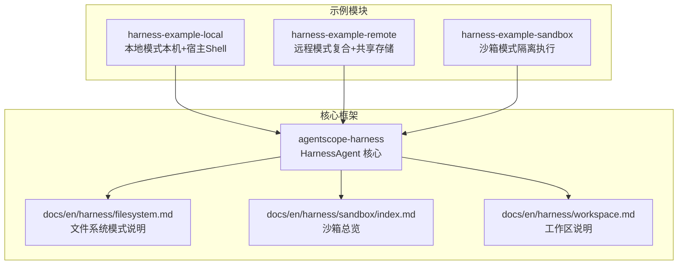
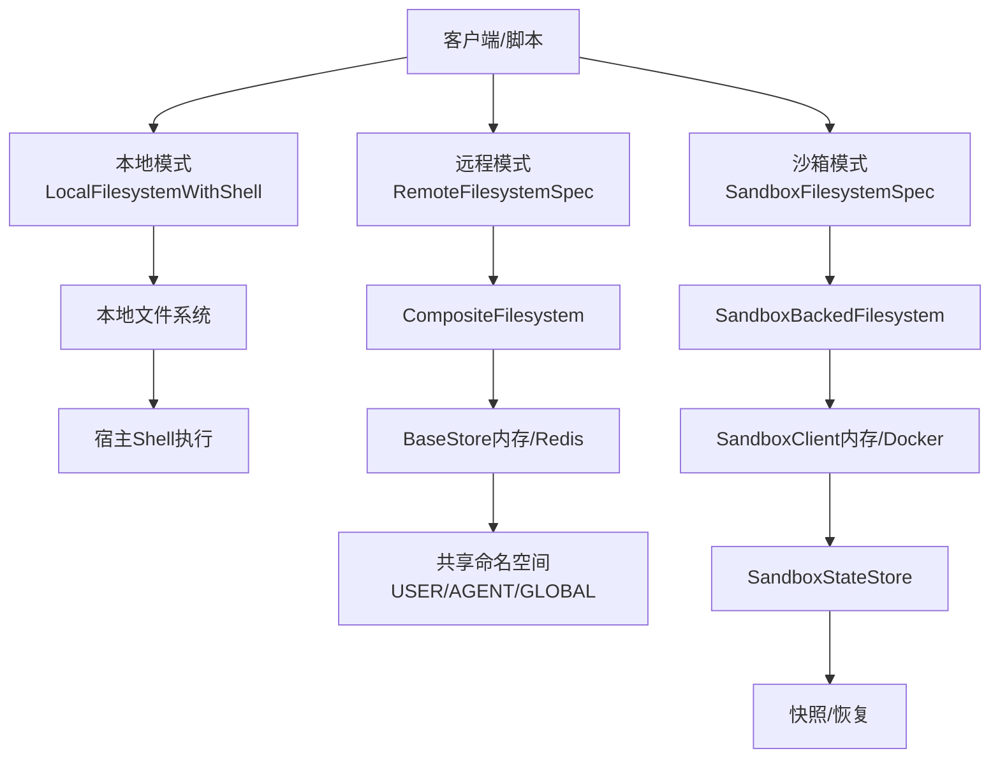
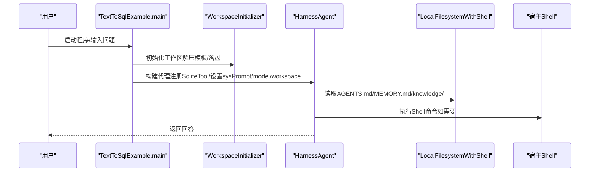
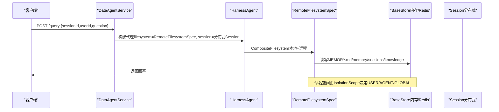
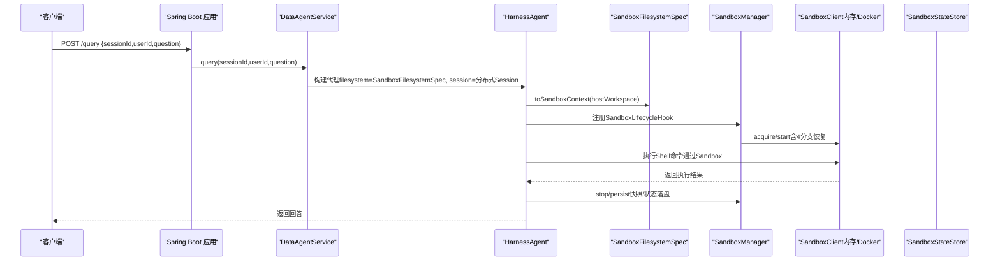
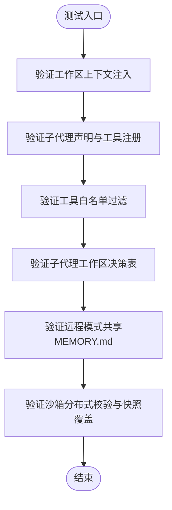
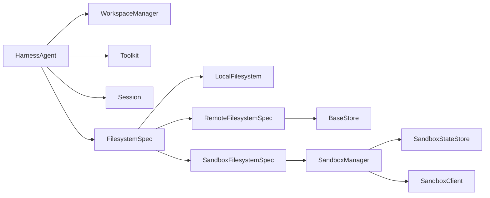

# Harness 测试示例

<cite>
**本文引用的文件**
- [HarnessAgent.java](file://agentscope-harness/src/main/java/io/agentscope/harness/agent/HarnessAgent.java)
- [HarnessAgentTest.java](file://agentscope-harness/src/test/java/io/agentscope/harness/agent/HarnessAgentTest.java)
- [HarnessAgentIntegrationExampleTest.java](file://agentscope-harness/src/test/java/io/agentscope/harness/agent/HarnessAgentIntegrationExampleTest.java)
- [HarnessAgentDistributedSandboxTest.java](file://agentscope-harness/src/test/java/io/agentscope/harness/agent/HarnessAgentDistributedSandboxTest.java)
- [TextToSqlExample.java](file://agentscope-examples/harness-examples/harness-example-local/src/main/java/io/agentscope/harness/example/TextToSqlExample.java)
- [README.md（本地示例）](file://agentscope-examples/harness-examples/harness-example-local/README.md)
- [README.md（远程示例）](file://agentscope-examples/harness-examples/harness-example-remote/README.md)
- [README.md（沙箱示例）](file://agentscope-examples/harness-examples/harness-example-sandbox/README.md)
- [DataAgentService.java（远程示例）](file://agentscope-examples/harness-examples/harness-example-remote/src/main/java/io/agentscope/examples/harness/remote/DataAgentService.java)
- [index.md（沙箱总览）](file://docs/en/harness/sandbox/index.md)
- [filesystem.md（文件系统模式）](file://docs/en/harness/filesystem.md)
- [workspace.md（工作区）](file://docs/en/harness/workspace.md)
- [MemorySearchTool.java](file://agentscope-harness/src/main/java/io/agentscope/harness/agent/tool/MemorySearchTool.java)
</cite>

## 目录
1. [简介](#简介)
2. [项目结构](#项目结构)
3. [核心组件](#核心组件)
4. [架构总览](#架构总览)
5. [详细组件分析](#详细组件分析)
6. [依赖关系分析](#依赖关系分析)
7. [性能考虑](#性能考虑)
8. [故障排查指南](#故障排查指南)
9. [结论](#结论)
10. [附录](#附录)

## 简介
本文件面向 AgentScope Java Harness 测试示例，系统化阐述 Harness 框架的设计理念与实现要点，覆盖以下主题：
- 设计理念：隔离机制、沙箱环境、测试工具集
- 本地示例：文件系统操作、工作区管理、测试数据准备
- 远程示例：网络通信、数据传输、状态同步
- 沙箱示例：执行隔离、资源限制、安全控制
- 测试指南：环境搭建、用例编写、结果验证
- 性能测试：并发策略、边界条件测试

## 项目结构
本仓库包含三个 Harness 示例模块与核心测试套件，分别演示三种文件系统模式：
- 本地模式（本机 + 宿主 Shell）：示例模块通过不显式配置文件系统，使用本地文件系统并允许宿主 Shell 执行
- 远程模式（复合 + 共享存储）：示例模块通过 RemoteFilesystemSpec 组合本地与远程存储，强调多副本共享记忆与日志
- 沙箱模式（隔离执行）：示例模块通过 SandboxFilesystemSpec 使用沙箱执行 Shell 命令，保障宿主安全

图表来源
- [README.md（本地示例）:1-170](file://agentscope-examples/harness-examples/harness-example-local/README.md#L1-L170)
- [README.md（远程示例）:1-93](file://agentscope-examples/harness-examples/harness-example-remote/README.md#L1-L93)
- [README.md（沙箱示例）:1-77](file://agentscope-examples/harness-examples/harness-example-sandbox/README.md#L1-L77)
- [filesystem.md（文件系统模式）:76-98](file://docs/en/harness/filesystem.md#L76-L98)
- [index.md（沙箱总览）:11-231](file://docs/en/harness/sandbox/index.md#L11-L231)
- [workspace.md（工作区）:1-15](file://docs/en/harness/workspace.md#L1-L15)

章节来源
- [README.md（本地示例）:1-170](file://agentscope-examples/harness-examples/harness-example-local/README.md#L1-L170)
- [README.md（远程示例）:1-93](file://agentscope-examples/harness-examples/harness-example-remote/README.md#L1-L93)
- [README.md（沙箱示例）:1-77](file://agentscope-examples/harness-examples/harness-example-sandbox/README.md#L1-L77)
- [filesystem.md（文件系统模式）:76-98](file://docs/en/harness/filesystem.md#L76-L98)
- [index.md（沙箱总览）:11-231](file://docs/en/harness/sandbox/index.md#L11-L231)
- [workspace.md（工作区）:1-15](file://docs/en/harness/workspace.md#L1-L15)

## 核心组件
- HarnessAgent：面向用户的代理封装，内置工作区上下文注入、子代理编排、持久化记忆、会话持久化、压缩与溢出恢复、大工具结果离线等能力
- 工作区（Workspace）：以目录+Markdown 的形式承载代理的人设、长期记忆、领域知识、子代理声明、会话历史与技能定义
- 文件系统模式：Local/Remote/Sandbox 三种模式，分别对应本地+宿主Shell、复合+共享存储、隔离执行
- 沙箱（Sandbox）：通过 SandboxClient/SandboxStateStore/SandboxManager 实现工作区投影、快照与生命周期管理
- 记忆与会话：MemorySearchTool、SessionPersistenceHook、MemoryFlushHook 等工具与钩子

章节来源
- [HarnessAgent.java:109-144](file://agentscope-harness/src/main/java/io/agentscope/harness/agent/HarnessAgent.java#L109-L144)
- [workspace.md（工作区）:1-15](file://docs/en/harness/workspace.md#L1-L15)
- [filesystem.md（文件系统模式）:76-98](file://docs/en/harness/filesystem.md#L76-L98)
- [index.md（沙箱总览）:11-231](file://docs/en/harness/sandbox/index.md#L11-L231)
- [MemorySearchTool.java:27-65](file://agentscope-harness/src/main/java/io/agentscope/harness/agent/tool/MemorySearchTool.java#L27-L65)

## 架构总览
下图展示三种示例模式的总体架构与关键交互点：

图表来源
- [README.md（本地示例）:17-40](file://agentscope-examples/harness-examples/harness-example-local/README.md#L17-L40)
- [README.md（远程示例）:9-16](file://agentscope-examples/harness-examples/harness-example-remote/README.md#L9-L16)
- [README.md（沙箱示例）:7-18](file://agentscope-examples/harness-examples/harness-example-sandbox/README.md#L7-L18)
- [filesystem.md（文件系统模式）:76-98](file://docs/en/harness/filesystem.md#L76-L98)
- [index.md（沙箱总览）:11-231](file://docs/en/harness/sandbox/index.md#L11-L231)

## 详细组件分析

### 本地示例（本机 + 宿主 Shell）
- 设计取舍：适合单机/信任环境/本地开发；不适合多租户暴露不受信 Shell；不自带跨副本共享（与远程模式不同）
- 关键特性：
  - 不显式配置文件系统时，默认使用 LocalFilesystemWithShell，工作区根在本地目录，ShellExecuteTool 在宿主执行
  - 业务示例：TextToSqlExample，通过 WorkspaceInitializer 初始化工作区，注册 SqliteTool，使用模型 ID（如 dashscope:qwen-max）进行推理
  - 运行方式：普通 JAR（非 Spring Boot），需将 target/classes 与依赖 classpath 一并传给 java 命令行
- 工作区与数据准备：
  - 工作区目录包含 AGENTS.md、MEMORY.md、knowledge/KNOWLEDGE.md、skills/、subagents/ 等
  - 首次运行可自动复制内置 chinook-default.sqlite 到 AGENTSCOPE_DB_PATH（默认 chinook.db）

图表来源
- [TextToSqlExample.java:117-213](file://agentscope-examples/harness-examples/harness-example-local/src/main/java/io/agentscope/harness/example/TextToSqlExample.java#L117-L213)
- [README.md（本地示例）:42-98](file://agentscope-examples/harness-examples/harness-example-local/README.md#L42-L98)

章节来源
- [README.md（本地示例）:1-170](file://agentscope-examples/harness-examples/harness-example-local/README.md#L1-L170)
- [TextToSqlExample.java:1-313](file://agentscope-examples/harness-examples/harness-example-local/src/main/java/io/agentscope/harness/example/TextToSqlExample.java#L1-L313)

### 远程示例（复合 + 共享存储）
- 设计目标：多副本共享记忆与日志，刻意不在宿主开放 Shell
- 关键实现：
  - 使用 RemoteFilesystemSpec 组合 LocalFilesystem（本地静态文件）与 RemoteFilesystem（BaseStore，支持 IsolationScope）
  - 必须提供非 WorkspaceSession 的 Session（如 InMemorySession），否则在检测到 RemoteFilesystemSpec 时会失败
  - 业务服务 DataAgentService 展示了如何装配 RemoteFilesystemSpec、InMemorySession 与 HarnessAgent，并通过 HTTP 接口提供查询能力
- 数据流：
  - 本地侧：skills/、AGENTS.md 等静态文件由 LocalFilesystem 提供
  - 远端侧：MEMORY.md、memory/、agents/<agentId>/sessions/ 等通过 RemoteFilesystem 路由至 BaseStore，命名空间由 IsolationScope 决定

图表来源
- [README.md（远程示例）:9-52](file://agentscope-examples/harness-examples/harness-example-remote/README.md#L9-L52)
- [DataAgentService.java（远程示例）:74-113](file://agentscope-examples/harness-examples/harness-example-remote/src/main/java/io/agentscope/examples/harness/remote/DataAgentService.java#L74-L113)
- [filesystem.md（文件系统模式）:76-98](file://docs/en/harness/filesystem.md#L76-L98)

章节来源
- [README.md（远程示例）:1-93](file://agentscope-examples/harness-examples/harness-example-remote/README.md#L1-L93)
- [DataAgentService.java（远程示例）:1-150](file://agentscope-examples/harness-examples/harness-example-remote/src/main/java/io/agentscope/examples/harness/remote/DataAgentService.java#L1-L150)

### 沙箱示例（隔离执行）
- 设计目标：在隔离环境中执行 Shell 命令，保障宿主安全；支持多副本共享状态（通过 SandboxStateStore）
- 关键实现：
  - 使用 SandboxFilesystemSpec（如 InMemorySandboxFilesystemSpec），HarnessAgent 注册 SandboxLifecycleHook，在每次调用前后 acquire/persist/release 沙箱
  - 支持分布式场景：通过 sandboxDistributed(...) 指定分布式 Session 与快照策略；默认要求分布式 Session，也可通过 requireDistributed(false) 放宽
  - 业务服务通过 Spring Boot 暴露 /query 接口，使用相同的 WorkspaceClasspathMaterializer 将 classpath 的工作区材料落盘，再经沙箱投影进入会话工作区
- 生命周期与隔离维度：
  - IsolationScope：SESSION（会话隔离）、USER（用户共享）、AGENT（代理共享）、GLOBAL（全局共享）
  - 快照与恢复：通过 SandboxStateStore 保存沙箱句柄与工作区根路径，便于 resume

图表来源
- [README.md（沙箱示例）:21-44](file://agentscope-examples/harness-examples/harness-example-sandbox/README.md#L21-L44)
- [index.md（沙箱总览）:11-231](file://docs/en/harness/sandbox/index.md#L11-L231)
- [HarnessAgentDistributedSandboxTest.java:47-151](file://agentscope-harness/src/test/java/io/agentscope/harness/agent/HarnessAgentDistributedSandboxTest.java#L47-L151)

章节来源
- [README.md（沙箱示例）:1-77](file://agentscope-examples/harness-examples/harness-example-sandbox/README.md#L1-L77)
- [index.md（沙箱总览）:11-231](file://docs/en/harness/sandbox/index.md#L11-L231)
- [HarnessAgentDistributedSandboxTest.java:1-206](file://agentscope-harness/src/test/java/io/agentscope/harness/agent/HarnessAgentDistributedSandboxTest.java#L1-L206)

### 测试工具与断言（核心测试）
- 工作区上下文注入：验证 AGENTS.md 是否被注入到模型消息中，以及禁用工作区上下文后的行为
- 子代理发现与工具注册：验证 subagents/*.md 声明是否正确解析与注册 agent_spawn/task_output 工具
- 工具白名单：父 Toolkit 工具经允许列表过滤后仅保留允许项
- 决策表：针对子代理工作区模式（ISOLATED/SHARED）与路径存在与否的五种组合，验证运行时工作区根路径
- 远程模式共享：验证 MEMORY.md 在非沙箱模式下通过 RemoteFilesystemSpec 写入 BaseStore
- 沙箱分布式校验：当使用沙箱模式但未提供分布式 Session 时，应 fail-fast；通过 sandboxDistributed(...) 可覆盖默认严格校验

图表来源
- [HarnessAgentTest.java:66-287](file://agentscope-harness/src/test/java/io/agentscope/harness/agent/HarnessAgentTest.java#L66-L287)
- [HarnessAgentIntegrationExampleTest.java:78-170](file://agentscope-harness/src/test/java/io/agentscope/harness/agent/HarnessAgentIntegrationExampleTest.java#L78-L170)
- [HarnessAgentDistributedSandboxTest.java:47-151](file://agentscope-harness/src/test/java/io/agentscope/harness/agent/HarnessAgentDistributedSandboxTest.java#L47-L151)

章节来源
- [HarnessAgentTest.java:1-759](file://agentscope-harness/src/test/java/io/agentscope/harness/agent/HarnessAgentTest.java#L1-L759)
- [HarnessAgentIntegrationExampleTest.java:1-264](file://agentscope-harness/src/test/java/io/agentscope/harness/agent/HarnessAgentIntegrationExampleTest.java#L1-L264)
- [HarnessAgentDistributedSandboxTest.java:1-206](file://agentscope-harness/src/test/java/io/agentscope/harness/agent/HarnessAgentDistributedSandboxTest.java#L1-L206)

## 依赖关系分析
- 组件耦合：
  - HarnessAgent 依赖 WorkspaceManager、Toolkit、Session、AbstractFilesystem、SandboxContext 等
  - 文件系统模式通过 Spec（Local/Remote/Sandbox）解耦具体实现
  - 沙箱模式通过 SandboxManager/SandboxStateStore/SandboxClient 形成清晰的生命周期与状态管理
- 外部依赖：
  - 模型注册中心（ModelRegistry）解析模型 ID
  - BaseStore（内存/Redis）用于远程模式的状态与共享存储
  - Spring Boot（远程/沙箱示例）提供 HTTP 接口

图表来源
- [HarnessAgent.java:149-173](file://agentscope-harness/src/main/java/io/agentscope/harness/agent/HarnessAgent.java#L149-L173)
- [filesystem.md（文件系统模式）:76-98](file://docs/en/harness/filesystem.md#L76-L98)
- [index.md（沙箱总览）:11-231](file://docs/en/harness/sandbox/index.md#L11-L231)

章节来源
- [HarnessAgent.java:109-200](file://agentscope-harness/src/main/java/io/agentscope/harness/agent/HarnessAgent.java#L109-L200)
- [filesystem.md（文件系统模式）:76-98](file://docs/en/harness/filesystem.md#L76-L98)
- [index.md（沙箱总览）:11-231](file://docs/en/harness/sandbox/index.md#L11-L231)

## 性能考虑
- 上下文压缩与溢出恢复：当模型报告上下文溢出时，HarnessAgent 自动触发压缩并重试，减少长对话带来的延迟
- 大工具结果离线：ToolResultEvictionHook 将过大的工具结果写入文件系统，仅保留预览，降低上下文体积
- 会话持久化：SessionPersistenceHook 将状态写回工作区，避免重复计算与状态丢失
- 并发与隔离：
  - 本地模式：适合单线程/本地开发，注意 Shell 命令的串行与阻塞
  - 远程模式：通过分布式 Session 与 BaseStore 支持多副本共享，建议使用 Redis 等高可用存储
  - 沙箱模式：通过隔离键（IsolationScope）与快照机制实现多租户隔离与快速恢复

[本节为通用指导，不直接分析具体文件]

## 故障排查指南
- 远程模式必须提供分布式 Session：若使用 RemoteFilesystemSpec 且 Session 仍为本地 WorkspaceSession，构建将失败
- 沙箱模式默认要求分布式 Session：若未提供分布式 Session，构建将失败；可通过 sandboxDistributed(requireDistributed=false) 放宽
- 工具缺失：
  - 禁用文件系统工具后，read_file/list_files 等工具不再注册
  - 禁用 Shell 工具后，execute 工具不再注册
  - 禁用记忆工具后，memory_search/memory_get/session_search 等工具不再注册
- 工作区上下文：
  - 禁用工作区上下文后，AGENTS.md 不会被注入到模型消息中
  - 子代理声明未生效时，检查 subagents/*.md 的 YAML front matter 与文件名

章节来源
- [HarnessAgentDistributedSandboxTest.java:47-171](file://agentscope-harness/src/test/java/io/agentscope/harness/agent/HarnessAgentDistributedSandboxTest.java#L47-L171)
- [HarnessAgentTest.java:86-167](file://agentscope-harness/src/test/java/io/agentscope/harness/agent/HarnessAgentTest.java#L86-L167)
- [HarnessAgentIntegrationExampleTest.java:78-170](file://agentscope-harness/src/test/java/io/agentscope/harness/agent/HarnessAgentIntegrationExampleTest.java#L78-L170)

## 结论
Harness 测试示例通过三种文件系统模式完整覆盖了本地开发、远程共享与沙箱隔离的典型场景。结合核心测试用例，开发者可以：
- 快速搭建测试环境并验证工作区、工具、子代理与状态持久化
- 在不同隔离级别下评估性能与安全性
- 建立完善的测试体系，包括并发与边界条件测试

[本节为总结性内容，不直接分析具体文件]

## 附录

### 测试指南（环境搭建、用例编写、结果验证）
- 环境变量
  - 本地示例：DASHSCOPE_API_KEY（或 OPENAI_API_KEY），可选 AGENTSCOPE_MODEL、AGENTSCOPE_WORKSPACE、AGENTSCOPE_DB_PATH
  - 远程/沙箱示例：DASHSCOPE_API_KEY，可选 AGENTSCOPE_MODEL
- 本地示例运行
  - 构建：mvn -pl agentscope-examples/harness-example-local -am package -DskipTests
  - 运行：设置 CP 后 java -cp "$CP" io.agentscope.harness.example.TextToSqlExample
- 远程示例运行
  - 构建：mvn -pl agentscope-examples/harness-example-remote -am package -DskipTests
  - 运行：java -jar agentscope-examples/harness-example-remote/target/harness-example-remote-*.jar
  - 请求示例：curl -s -X POST http://localhost:8788/query -H 'Content-Type: application/json' -d '{"sessionId":"s1","userId":"alice","question":"How many artists?"}'
- 沙箱示例运行
  - 构建：mvn -pl agentscope-examples/harness-example-sandbox -am package -DskipTests
  - 运行：java -jar agentscope-examples/harness-example-sandbox/target/harness-example-sandbox-*.jar
  - 请求示例：curl -s -X POST http://localhost:8787/query -H 'Content-Type: application/json' -d '{"sessionId":"s1","userId":"alice","question":"How many artists are in Chinook?"}'
- 用例编写建议
  - 使用临时工作区目录（@TempDir），模拟真实文件系统布局（AGENTS.md、MEMORY.md、knowledge/、subagents/）
  - 通过 Mock Model 验证消息注入、工具注册与钩子行为
  - 对比启用/禁用工具与上下文的差异，确保断言覆盖所有开关
- 结果验证
  - 模型消息中是否包含预期的上下文片段（agents_context/memory_context/domain_knowledge_context 等）
  - 工具名称与参数是否符合预期
  - 远程模式下 MEMORY.md 是否写入 BaseStore
  - 沙箱模式下是否按 IsolationScope 正确创建/恢复沙箱

章节来源
- [README.md（本地示例）:53-98](file://agentscope-examples/harness-examples/harness-example-local/README.md#L53-L98)
- [README.md（远程示例）:64-82](file://agentscope-examples/harness-examples/harness-example-remote/README.md#L64-L82)
- [README.md（沙箱示例）:47-64](file://agentscope-examples/harness-examples/harness-example-sandbox/README.md#L47-L64)
- [HarnessAgentIntegrationExampleTest.java:78-170](file://agentscope-harness/src/test/java/io/agentscope/harness/agent/HarnessAgentIntegrationExampleTest.java#L78-L170)
- [HarnessAgentTest.java:66-287](file://agentscope-harness/src/test/java/io/agentscope/harness/agent/HarnessAgentTest.java#L66-L287)