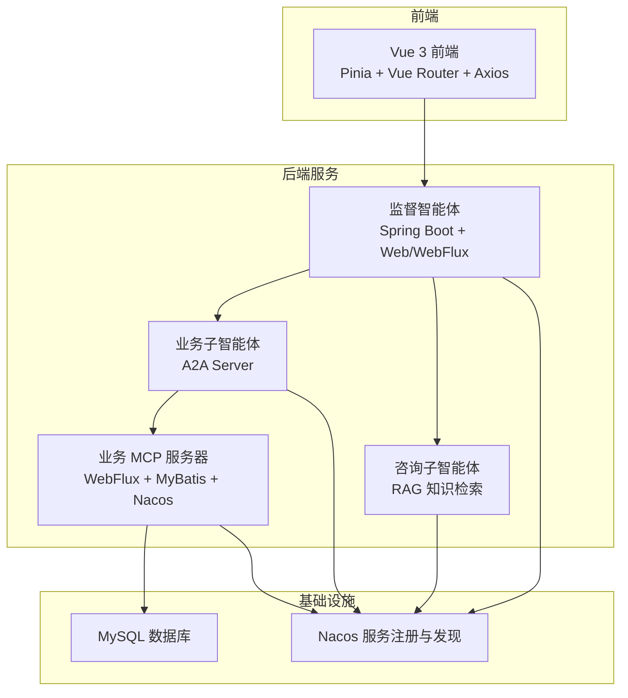
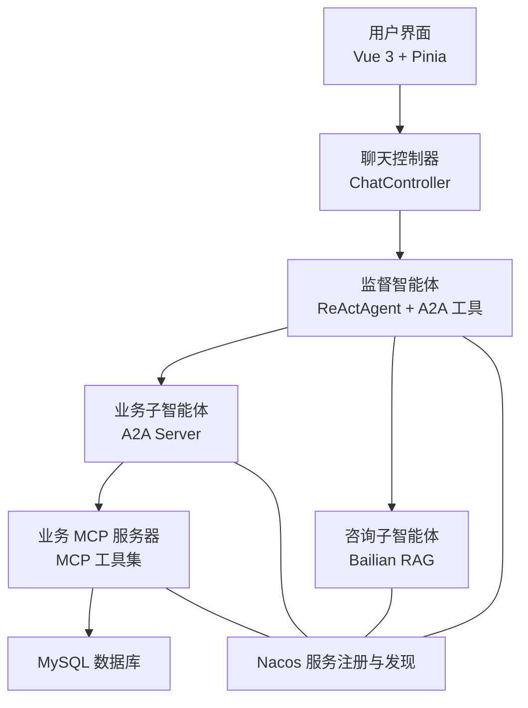
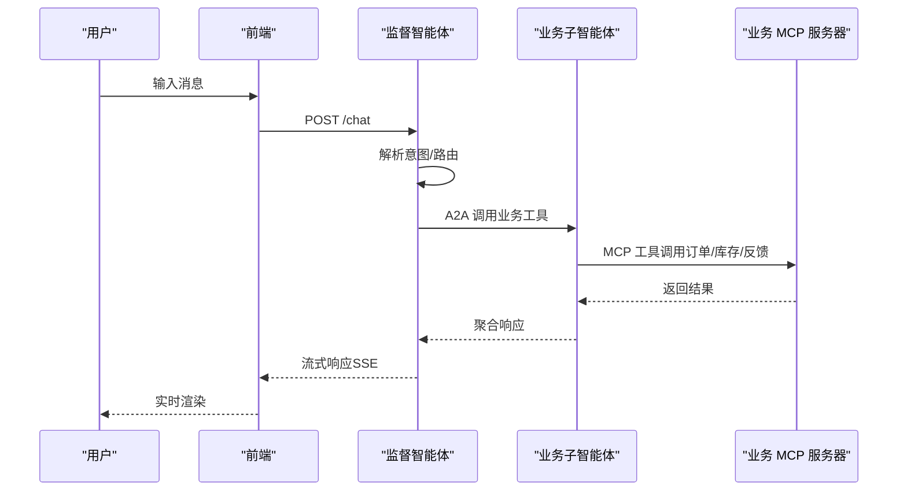
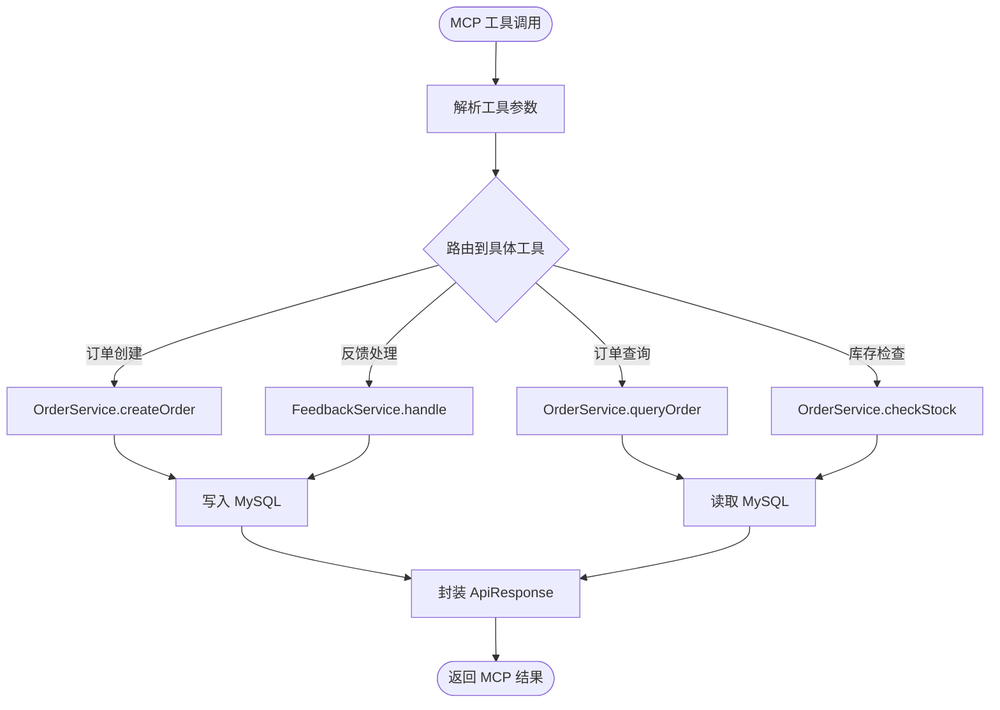
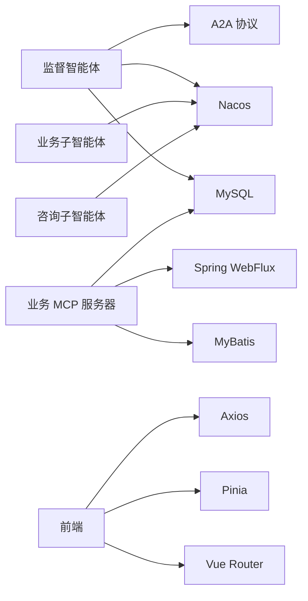

# 企业级应用示例

<cite>
**本文引用的文件**   
- [README.md](file://agentscope-examples/boba-tea-shop/README.md)
- [README_zh.md](file://agentscope-examples/boba-tea-shop/README_zh.md)
- [HIMARKET_DEPLOYMENT.md](file://agentscope-examples/boba-tea-shop/HIMARKET_DEPLOYMENT.md)
- [IMAGE_BUILD_GUIDE.md](file://agentscope-examples/boba-tea-shop/IMAGE_BUILD_GUIDE.md)
- [IMAGE_BUILD_GUIDE_zh.md](file://agentscope-examples/boba-tea-shop/IMAGE_BUILD_GUIDE_zh.md)
- [package.json](file://agentscope-examples/boba-tea-shop/frontend/package.json)
- [business-mcp-server/pom.xml](file://agentscope-examples/boba-tea-shop/business-mcp-server/pom.xml)
- [supervisor-agent/pom.xml](file://agentscope-examples/boba-tea-shop/supervisor-agent/pom.xml)
- [docker-compose.yml](file://agentscope-examples/boba-tea-shop/docker-compose.yml)
- [helm/Chart.yaml](file://agentscope-examples/boba-tea-shop/helm/Chart.yaml)
- [helm/values.yaml](file://agentscope-examples/boba-tea-shop/helm/values.yaml)
- [business-mcp-server/src/main/java/io/agentscope/examples/bobatea/business/BusinessServerApplication.java](file://agentscope-examples/boba-tea-shop/business-mcp-server/src/main/java/io/agentscope/examples/bobatea/business/BusinessServerApplication.java)
- [business-mcp-server/src/main/java/io/agentscope/examples/bobatea/business/config/McpServerConfig.java](file://agentscope-examples/boba-tea-shop/business-mcp-server/src/main/java/io/agentscope/examples/bobatea/business/config/McpServerConfig.java)
- [business-mcp-server/src/main/java/io/agentscope/examples/bobatea/business/config/McpToolHandlers.java](file://agentscope-examples/boba-tea-shop/business-mcp-server/src/main/java/io/agentscope/examples/bobatea/business/config/McpToolHandlers.java)
- [business-mcp-server/src/main/java/io/agentscope/examples/bobatea/business/controller/OrderController.java](file://agentscope-examples/boba-tea-shop/business-mcp-server/src/main/java/io/agentscope/examples/bobatea/business/controller/OrderController.java)
- [business-mcp-server/src/main/java/io/agentscope/examples/bobatea/business/controller/FeedbackController.java](file://agentscope-examples/boba-tea-shop/business-mcp-server/src/main/java/io/agentscope/examples/bobatea/business/controller/FeedbackController.java)
- [business-mcp-server/src/main/java/io/agentscope/examples/bobatea/business/service/OrderService.java](file://agentscope-examples/boba-tea-shop/business-mcp-server/src/main/java/io/agentscope/examples/bobatea/business/service/OrderService.java)
- [business-mcp-server/src/main/java/io/agentscope/examples/bobatea/business/service/FeedbackService.java](file://agentscope-examples/boba-tea-shop/business-mcp-server/src/main/java/io/agentscope/examples/bobatea/business/service/FeedbackService.java)
- [business-mcp-server/src/main/java/io/agentscope/examples/bobatea/business/entity/Order.java](file://agentscope-examples/boba-tea-shop/business-mcp-server/src/main/java/io/agentscope/examples/bobatea/business/entity/Order.java)
- [business-mcp-server/src/main/java/io/agentscope/examples/bobatea/business/entity/Feedback.java](file://agentscope-examples/boba-tea-shop/business-mcp-server/src/main/java/io/agentscope/examples/bobatea/business/entity/Feedback.java)
- [business-mcp-server/src/main/java/io/agentscope/examples/bobatea/business/mapper/OrderMapper.java](file://agentscope-examples/boba-tea-shop/business-mcp-server/src/main/java/io/agentscope/examples/bobatea/business/mapper/OrderMapper.java)
- [business-mcp-server/src/main/java/io/agentscope/examples/bobatea/business/mapper/FeedbackMapper.java](file://agentscope-examples/boba-tea-shop/business-mcp-server/src/main/java/io/agentscope/examples/bobatea/business/mapper/FeedbackMapper.java)
- [business-mcp-server/src/main/java/io/agentscope/examples/bobatea/business/model/OrderCreateRequest.java](file://agentscope-examples/boba-tea-shop/business-mcp-server/src/main/java/io/agentscope/examples/bobatea/business/model/OrderCreateRequest.java)
- [business-mcp-server/src/main/java/io/agentscope/examples/bobatea/business/model/OrderQueryRequest.java](file://agentscope-examples/boba-tea-shop/business-mcp-server/src/main/java/io/agentscope/examples/bobatea/business/model/OrderQueryRequest.java)
- [business-mcp-server/src/main/java/io/agentscope/examples/bobatea/business/model/ApiResponse.java](file://agentscope-examples/boba-tea-shop/business-mcp-server/src/main/java/io/agentscope/examples/bobatea/business/model/ApiResponse.java)
- [supervisor-agent/src/main/java/io/agentscope/examples/bobatea/supervisor/SimpleSupervisorAgentApplication.java](file://agentscope-examples/boba-tea-shop/supervisor-agent/src/main/java/io/agentscope/examples/bobatea/supervisor/SimpleSupervisorAgentApplication.java)
- [supervisor-agent/src/main/java/io/agentscope/examples/bobatea/supervisor/config/A2aConfig.java](file://agentscope-examples/boba-tea-shop/supervisor-agent/src/main/java/io/agentscope/examples/bobatea/supervisor/config/A2aConfig.java)
- [supervisor-agent/src/main/java/io/agentscope/examples/bobatea/supervisor/tools/A2aAgentTools.java](file://agentscope-examples/boba-tea-shop/supervisor-agent/src/main/java/io/agentscope/examples/bobatea/supervisor/tools/A2aAgentTools.java)
- [supervisor-agent/src/main/java/io/agentscope/examples/bobatea/supervisor/controller/ChatController.java](file://agentscope-examples/boba-tea-shop/supervisor-agent/src/main/java/io/agentscope/examples/bobatea/supervisor/controller/ChatController.java)
- [supervisor-agent/src/main/java/io/agentscope/examples/bobatea/supervisor/entity/Order.java](file://agentscope-examples/boba-tea-shop/supervisor-agent/src/main/java/io/agentscope/examples/bobatea/supervisor/entity/Order.java)
</cite>

## 目录
1. [简介](#简介)
2. [项目结构](#项目结构)
3. [核心组件](#核心组件)
4. [架构总览](#架构总览)
5. [详细组件分析](#详细组件分析)
6. [依赖分析](#依赖分析)
7. [性能考虑](#性能考虑)
8. [故障排除指南](#故障排除指南)
9. [结论](#结论)
10. [附录](#附录)

## 简介
本项目是一个基于 AgentScope Java 框架的企业级多智能体应用示例，模拟智能奶茶店的完整业务流程。系统通过监督智能体协调多个子智能体完成任务分发、业务处理、知识检索等核心能力，并提供 MCP（Model Context Protocol）工具调用能力，支持 A2A（Agent-to-Agent）协议的服务发现与通信。前端采用 Vue 3 + TypeScript + Pinia + Vue Router，提供实时聊天、Markdown 渲染、设置与报表等页面。

系统支持多种部署方式：本地一键启动、Docker Compose 快速体验、Kubernetes + Helm 生产级部署，并提供镜像构建指南与 HiMarket 市场化能力扩展。

## 项目结构
整体项目以“示例应用”为中心，按功能划分为多个子模块：监督智能体、业务子智能体、咨询子智能体、业务 MCP 服务器、前端、Kubernetes Helm Chart、MySQL/Nacos 镜像构建与部署脚本等。

图表来源
- [README.md:60-108](file://agentscope-examples/boba-tea-shop/README.md#L60-L108)
- [README_zh.md:66-107](file://agentscope-examples/boba-tea-shop/README_zh.md#L66-L107)

章节来源
- [README.md:326-368](file://agentscope-examples/boba-tea-shop/README.md#L326-L368)
- [README_zh.md:328-368](file://agentscope-examples/boba-tea-shop/README_zh.md#L328-L368)

## 核心组件
- 监督智能体（Supervisor Agent）
  - 角色：系统入口与协调者，接收用户请求并分发至合适子智能体；基于 ReActAgent，集成 AutoContextMemory、A2A 工具链与 MySQL 会话持久化。
  - 关键点：A2A 协议通过 Nacos 发现子智能体；支持流式响应与会话状态管理。
- 业务子智能体（Business Sub Agent）
  - 角色：处理订单创建、查询、修改、删除与用户反馈等业务；注册为 A2A Server 并通过 MCP 协议调用业务 MCP 服务器。
- 咨询子智能体（Consult Sub Agent）
  - 角色：集成 Bailian RAG 知识库检索，提供产品信息与店铺咨询工具。
- 业务 MCP 服务器（Business MCP Server）
  - 角色：提供订单、库存、反馈等 MCP 工具接口；基于 Spring WebFlux、MyBatis、Nacos 与 MySQL。
- 前端（Frontend）
  - 角色：提供聊天、设置、报表等页面；支持 SSE 流式输出与 Markdown 渲染；静态资源由 Spring Boot 直接托管。

章节来源
- [README.md:110-175](file://agentscope-examples/boba-tea-shop/README.md#L110-L175)
- [README_zh.md:110-175](file://agentscope-examples/boba-tea-shop/README_zh.md#L110-L175)

## 架构总览
系统采用微服务拆分与前后端分离设计，通过 Nacos 实现服务注册与发现，A2A 协议用于智能体间通信，MCP 协议用于工具调用。数据库与缓存通过 MySQL 与 Mem0 提供持久化与记忆能力。

图表来源
- [README.md:60-108](file://agentscope-examples/boba-tea-shop/README.md#L60-L108)
- [README_zh.md:66-107](file://agentscope-examples/boba-tea-shop/README_zh.md#L66-L107)

## 详细组件分析

### 监督智能体（Supervisor Agent）
- 职责与实现要点
  - 基于 ReActAgent 构建，集成 AutoContextMemory 与 A2A 工具链，支持 MySQL 会话持久化。
  - 通过 Nacos 发现并调用业务子智能体与咨询子智能体。
  - 提供 REST 接口与流式响应能力，适配前端聊天交互。
- 关键配置与依赖
  - 依赖 agentscope-core、agentscope-extensions-* 等模块，包含 A2A 客户端、Nacos 发现、MySQL 会话、Mem0、AutoContextMemory 等。
  - Actuator 监控与 Web/WebFlux 双栈支持。
- 典型调用序列（监督智能体 -> 业务子智能体 -> 业务 MCP 服务器）

图表来源
- [supervisor-agent/src/main/java/io/agentscope/examples/bobatea/supervisor/controller/ChatController.java](file://agentscope-examples/boba-tea-shop/supervisor-agent/src/main/java/io/agentscope/examples/bobatea/supervisor/controller/ChatController.java)
- [supervisor-agent/src/main/java/io/agentscope/examples/bobatea/supervisor/tools/A2aAgentTools.java](file://agentscope-examples/boba-tea-shop/supervisor-agent/src/main/java/io/agentscope/examples/bobatea/supervisor/tools/A2aAgentTools.java)
- [business-mcp-server/src/main/java/io/agentscope/examples/bobatea/business/config/McpToolHandlers.java](file://agentscope-examples/boba-tea-shop/business-mcp-server/src/main/java/io/agentscope/examples/bobatea/business/config/McpToolHandlers.java)

章节来源
- [supervisor-agent/pom.xml:40-108](file://agentscope-examples/boba-tea-shop/supervisor-agent/pom.xml#L40-L108)
- [supervisor-agent/src/main/java/io/agentscope/examples/bobatea/supervisor/SimpleSupervisorAgentApplication.java](file://agentscope-examples/boba-tea-shop/supervisor-agent/src/main/java/io/agentscope/examples/bobatea/supervisor/SimpleSupervisorAgentApplication.java)
- [supervisor-agent/src/main/java/io/agentscope/examples/bobatea/supervisor/config/A2aConfig.java](file://agentscope-examples/boba-tea-shop/supervisor-agent/src/main/java/io/agentscope/examples/bobatea/supervisor/config/A2aConfig.java)

### 业务 MCP 服务器（Business MCP Server）
- 职责与能力
  - 提供订单、库存、反馈等 MCP 工具接口，支持多维查询、创建、删除与状态变更。
  - 基于 Spring WebFlux + MyBatis + Nacos + MySQL，具备良好的并发与可扩展性。
- 数据模型与工具映射
  - 实体：Order、Feedback、Product、User
  - Mapper：OrderMapper、FeedbackMapper、ProductMapper、UserMapper
  - 控制器：OrderController、FeedbackController
  - 工具处理器：McpToolHandlers（定义与实现 MCP 工具）
- 典型流程（MCP 工具调用 -> 业务服务 -> 数据库）

图表来源
- [business-mcp-server/src/main/java/io/agentscope/examples/bobatea/business/config/McpToolHandlers.java](file://agentscope-examples/boba-tea-shop/business-mcp-server/src/main/java/io/agentscope/examples/bobatea/business/config/McpToolHandlers.java)
- [business-mcp-server/src/main/java/io/agentscope/examples/bobatea/business/service/OrderService.java](file://agentscope-examples/boba-tea-shop/business-mcp-server/src/main/java/io/agentscope/examples/bobatea/business/service/OrderService.java)
- [business-mcp-server/src/main/java/io/agentscope/examples/bobatea/business/service/FeedbackService.java](file://agentscope-examples/boba-tea-shop/business-mcp-server/src/main/java/io/agentscope/examples/bobatea/business/service/FeedbackService.java)
- [business-mcp-server/src/main/java/io/agentscope/examples/bobatea/business/mapper/OrderMapper.java](file://agentscope-examples/boba-tea-shop/business-mcp-server/src/main/java/io/agentscope/examples/bobatea/business/mapper/OrderMapper.java)
- [business-mcp-server/src/main/java/io/agentscope/examples/bobatea/business/mapper/FeedbackMapper.java](file://agentscope-examples/boba-tea-shop/business-mcp-server/src/main/java/io/agentscope/examples/bobatea/business/mapper/FeedbackMapper.java)
- [business-mcp-server/src/main/java/io/agentscope/examples/bobatea/business/model/ApiResponse.java](file://agentscope-examples/boba-tea-shop/business-mcp-server/src/main/java/io/agentscope/examples/bobatea/business/model/ApiResponse.java)

章节来源
- [business-mcp-server/pom.xml:38-94](file://agentscope-examples/boba-tea-shop/business-mcp-server/pom.xml#L38-L94)
- [business-mcp-server/src/main/java/io/agentscope/examples/bobatea/business/BusinessServerApplication.java](file://agentscope-examples/boba-tea-shop/business-mcp-server/src/main/java/io/agentscope/examples/bobatea/business/BusinessServerApplication.java)
- [business-mcp-server/src/main/java/io/agentscope/examples/bobatea/business/config/McpServerConfig.java](file://agentscope-examples/boba-tea-shop/business-mcp-server/src/main/java/io/agentscope/examples/bobatea/business/config/McpServerConfig.java)
- [business-mcp-server/src/main/java/io/agentscope/examples/bobatea/business/controller/OrderController.java](file://agentscope-examples/boba-tea-shop/business-mcp-server/src/main/java/io/agentscope/examples/bobatea/business/controller/OrderController.java)
- [business-mcp-server/src/main/java/io/agentscope/examples/bobatea/business/controller/FeedbackController.java](file://agentscope-examples/boba-tea-shop/business-mcp-server/src/main/java/io/agentscope/examples/bobatea/business/controller/FeedbackController.java)
- [business-mcp-server/src/main/java/io/agentscope/examples/bobatea/business/entity/Order.java](file://agentscope-examples/boba-tea-shop/business-mcp-server/src/main/java/io/agentscope/examples/bobatea/business/entity/Order.java)
- [business-mcp-server/src/main/java/io/agentscope/examples/bobatea/business/entity/Feedback.java](file://agentscope-examples/boba-tea-shop/business-mcp-server/src/main/java/io/agentscope/examples/bobatea/business/entity/Feedback.java)

### 咨询子智能体（Consult Sub Agent）
- 职责与实现
  - 集成 Bailian RAG 知识库检索，提供产品信息查询与搜索工具。
  - 通过 Nacos 注册为 A2A Server，便于监督智能体发现与调用。
- 关键点
  - 与业务 MCP 服务器解耦，专注知识检索与咨询服务。
  - 支持自然语言问答与多轮对话。

章节来源
- [README.md:142-149](file://agentscope-examples/boba-tea-shop/README.md#L142-L149)
- [README_zh.md:142-149](file://agentscope-examples/boba-tea-shop/README_zh.md#L142-L149)

### 前端界面（Vue 3 + Pinia + Vue Router）
- 设计思路
  - 聊天页面支持实时流式输出与 Markdown 渲染；设置页用于配置后端地址与用户 ID；报表页为可选功能。
  - 依赖 axios 进行后端通信，Pinia 管理全局状态，Vue Router 管理页面路由。
- 依赖与运行
  - 使用 Vite 构建，支持类型检查与单元测试；Node >= 16，npm >= 8。

章节来源
- [README.md:166-174](file://agentscope-examples/boba-tea-shop/README.md#L166-L174)
- [README_zh.md:166-174](file://agentscope-examples/boba-tea-shop/README_zh.md#L166-L174)
- [package.json:1-65](file://agentscope-examples/boba-tea-shop/frontend/package.json#L1-L65)

## 依赖分析
- 后端依赖
  - Spring Boot Web/WebFlux：提供 REST 与响应式 Web 能力。
  - AgentScope 扩展：Nacos A2A、A2A 客户端、MySQL 会话、Mem0、AutoContextMemory、XXL-Job 调度等。
  - MyBatis + MySQL：数据持久化。
  - MCP SDK + WebFlux：MCP 服务器能力。
- 前端依赖
  - Vue 3、Pinia、Vue Router、Axios、Ant Design Vue、Marked、Highlight.js 等。
- 基础设施
  - Nacos：服务注册与发现。
  - MySQL：会话与业务数据存储。

图表来源
- [supervisor-agent/pom.xml:40-108](file://agentscope-examples/boba-tea-shop/supervisor-agent/pom.xml#L40-L108)
- [business-mcp-server/pom.xml:38-94](file://agentscope-examples/boba-tea-shop/business-mcp-server/pom.xml#L38-L94)
- [package.json:17-30](file://agentscope-examples/boba-tea-shop/frontend/package.json#L17-L30)

章节来源
- [supervisor-agent/pom.xml:40-108](file://agentscope-examples/boba-tea-shop/supervisor-agent/pom.xml#L40-L108)
- [business-mcp-server/pom.xml:38-94](file://agentscope-examples/boba-tea-shop/business-mcp-server/pom.xml#L38-L94)
- [package.json:17-30](file://agentscope-examples/boba-tea-shop/frontend/package.json#L17-L30)

## 性能考虑
- 上下文压缩与内存优化
  - 使用 AutoContextMemory 自动压缩对话上下文，降低 Token 使用，提升推理效率。
- 并发与响应式
  - WebFlux 提供非阻塞 I/O，适合高并发与长连接场景（SSE）。
- 数据层优化
  - MyBatis + MySQL，合理使用索引与分页；在高频查询场景引入缓存（如 Redis）可进一步优化。
- 服务发现与负载
  - Nacos 提供服务注册与健康检查，结合水平扩展与限流策略提升稳定性。
- 前端体验
  - 流式渲染与 Markdown 渲染在大文本场景下注意节流与虚拟滚动优化。

## 故障排除指南
- 服务启动失败
  - 检查 Nacos 服务连通性与注册状态；确认数据库连接参数正确。
- MCP 工具调用异常
  - 查看业务 MCP 服务器日志，确认工具定义与处理器是否匹配；核对数据库初始化与表结构。
- 前端无法连接后端
  - 确认后端端口（10008）开放与代理配置；检查跨域与网络策略。
- 镜像构建与部署
  - 使用构建脚本时确保镜像仓库地址与版本标签正确；Docker Compose/Kubernetes values.yaml 中的密钥与地址需与实际一致。

章节来源
- [docker-compose.yml:24-255](file://agentscope-examples/boba-tea-shop/docker-compose.yml#L24-L255)
- [helm/values.yaml:15-115](file://agentscope-examples/boba-tea-shop/helm/values.yaml#L15-L115)

## 结论
本项目通过清晰的微服务拆分与协议体系，展示了 AgentScope Java 在企业级多智能体场景中的落地能力。监督智能体协调业务与咨询子智能体，业务 MCP 服务器提供标准化工具接口，前端以流式体验提升交互质量。配合 Nacos、MySQL、Mem0 等基础设施，系统具备良好的可扩展性与可运维性。建议在生产环境中结合监控告警、限流熔断与灰度发布策略，持续优化性能与稳定性。

## 附录

### 部署指南（Docker/Kubernetes/Helm）
- 本地一键启动
  - 配置本地环境变量后执行本地部署脚本，启动所有服务。
- Docker Compose
  - 通过 docker-compose.yml 启动 MySQL、Nacos、业务 MCP 服务器、咨询子智能体、业务子智能体与监督智能体（前端）。
- Kubernetes + Helm
  - 修改 values.yaml 中的镜像、数据库、Nacos、模型与知识库配置，使用 Helm 在命名空间中安装。
- 镜像构建
  - 使用总构建脚本或各模块独立构建脚本，支持指定版本、平台与推送策略。

章节来源
- [README.md:201-325](file://agentscope-examples/boba-tea-shop/README.md#L201-L325)
- [README_zh.md:201-325](file://agentscope-examples/boba-tea-shop/README_zh.md#L201-L325)
- [IMAGE_BUILD_GUIDE.md:14-165](file://agentscope-examples/boba-tea-shop/IMAGE_BUILD_GUIDE.md#L14-L165)
- [IMAGE_BUILD_GUIDE_zh.md:14-162](file://agentscope-examples/boba-tea-shop/IMAGE_BUILD_GUIDE_zh.md#L14-L162)
- [docker-compose.yml:19-255](file://agentscope-examples/boba-tea-shop/docker-compose.yml#L19-L255)
- [helm/Chart.yaml:15-32](file://agentscope-examples/boba-tea-shop/helm/Chart.yaml#L15-L32)
- [helm/values.yaml:15-115](file://agentscope-examples/boba-tea-shop/helm/values.yaml#L15-L115)

### HiMarket 市场化部署
- 将 AgentScope 的 Nacos 实例导入 HiMarket，统一管理与暴露智能体与 MCP 服务能力。
- 支持管理员控制产品列表、权限与订阅策略，开发者门户订阅与集成。

章节来源
- [HIMARKET_DEPLOYMENT.md:1-197](file://agentscope-examples/boba-tea-shop/HIMARKET_DEPLOYMENT.md#L1-L197)