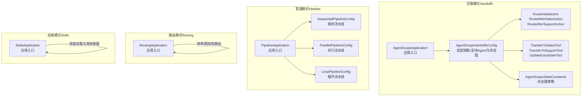
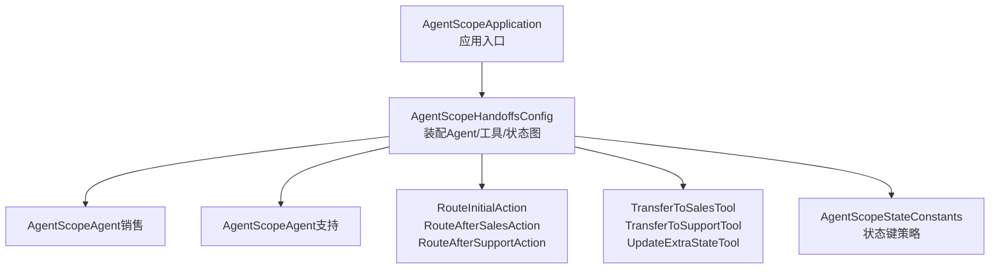
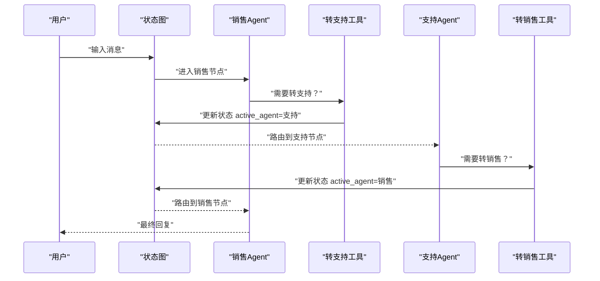
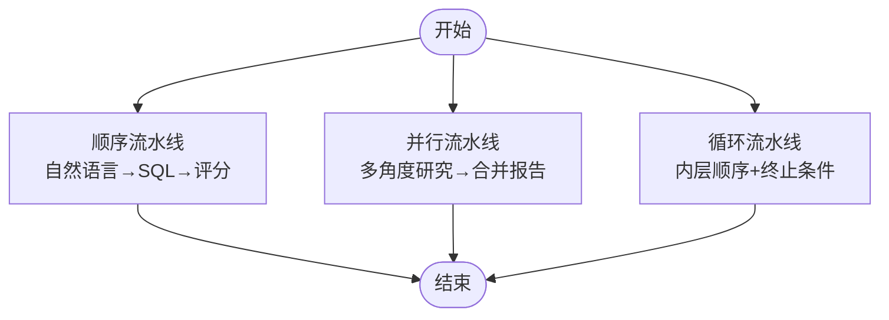
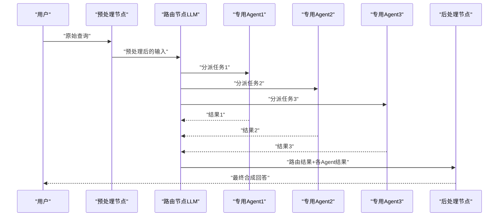
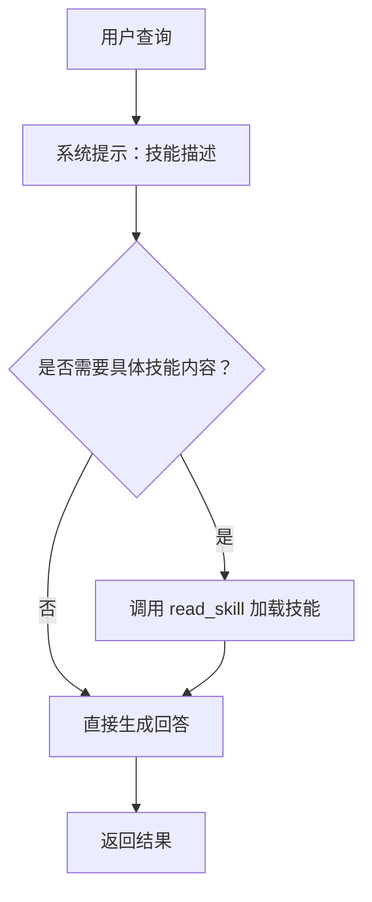
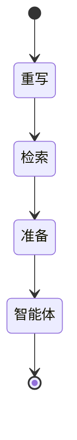
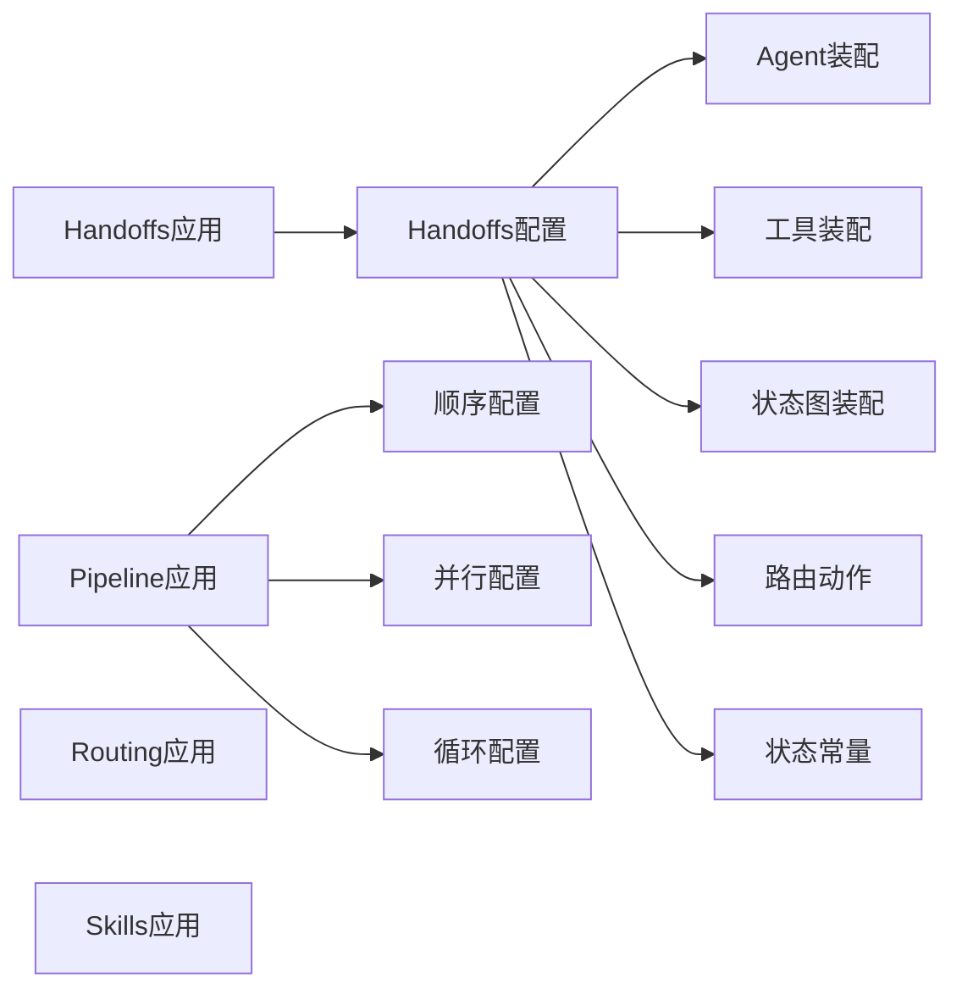

# 多智能体模式示例

<cite>
**本文引用的文件**
- [AgentScopeApplication.java](file://agentscope-examples/multiagent-patterns/handoffs/src/main/java/io/agentscope/examples/handoffs/multiagent/AgentScopeApplication.java)
- [AgentScopeHandoffsConfig.java](file://agentscope-examples/multiagent-patterns/handoffs/src/main/java/io/agentscope/examples/handoffs/multiagent/AgentScopeHandoffsConfig.java)
- [RouteInitialAction.java](file://agentscope-examples/multiagent-patterns/handoffs/src/main/java/io/agentscope/examples/handoffs/multiagent/route/RouteInitialAction.java)
- [RouteAfterSalesAction.java](file://agentscope-examples/multiagent-patterns/handoffs/src/main/java/io/agentscope/examples/handoffs/multiagent/route/RouteAfterSalesAction.java)
- [RouteAfterSupportAction.java](file://agentscope-examples/multiagent-patterns/handoffs/src/main/java/io/agentscope/examples/handoffs/multiagent/route/RouteAfterSupportAction.java)
- [AgentScopeStateConstants.java](file://agentscope-examples/multiagent-patterns/handoffs/src/main/java/io/agentscope/examples/handoffs/multiagent/state/AgentScopeStateConstants.java)
- [TransferToSalesTool.java](file://agentscope-examples/multiagent-patterns/handoffs/src/main/java/io/agentscope/examples/handoffs/multiagent/tools/TransferToSalesTool.java)
- [TransferToSupportTool.java](file://agentscope-examples/multiagent-patterns/handoffs/src/main/java/io/agentscope/examples/handoffs/multiagent/tools/TransferToSupportTool.java)
- [UpdateExtraStateTool.java](file://agentscope-examples/multiagent-patterns/handoffs/src/main/java/io/agentscope/examples/handoffs/multiagent/tools/UpdateExtraStateTool.java)
- [PipelineApplication.java](file://agentscope-examples/multiagent-patterns/pipeline/src/main/java/com/alibaba/cloud/ai/examples/multiagents/pipeline/PipelineApplication.java)
- [SequentialPipelineConfig.java](file://agentscope-examples/multiagent-patterns/pipeline/src/main/java/com/alibaba/cloud/ai/examples/multiagents/pipeline/sequential/SequentialPipelineConfig.java)
- [ParallelPipelineConfig.java](file://agentscope-examples/multiagent-patterns/pipeline/src/main/java/com/alibaba/cloud/ai/examples/multiagents/pipeline/parallel/ParallelPipelineConfig.java)
- [LoopPipelineConfig.java](file://agentscope-examples/multiagent-patterns/pipeline/src/main/java/com/alibaba/cloud/ai/examples/multiagents/pipeline/loop/LoopPipelineConfig.java)
- [RoutingApplication.java](file://agentscope-examples/multiagent-patterns/routing/src/main/java/io/agentscope/examples/routing/simple/RoutingApplication.java)
- [SkillsApplication.java](file://agentscope-examples/multiagent-patterns/skills/src/main/java/com/alibaba/cloud/ai/examples/multiagents/skills/SkillsApplication.java)
- [README.md（交接模式）](file://agentscope-examples/multiagent-patterns/handoffs/README.md)
- [README.md（管道模式）](file://agentscope-examples/multiagent-patterns/pipeline/README.md)
- [README.md（路由模式）](file://agentscope-examples/multiagent-patterns/routing/README.md)
- [README.md（技能模式）](file://agentscope-examples/multiagent-patterns/skills/README.md)
- [README.md（工作流模式）](file://agentscope-examples/multiagent-patterns/workflow/README.md)
</cite>

## 目录
1. [简介](#简介)
2. [项目结构](#项目结构)
3. [核心组件](#核心组件)
4. [架构总览](#架构总览)
5. [详细组件分析](#详细组件分析)
6. [依赖关系分析](#依赖关系分析)
7. [性能考虑](#性能考虑)
8. [故障排除指南](#故障排除指南)
9. [结论](#结论)
10. [附录](#附录)

## 简介
本技术文档聚焦于 AgentScope Java 的多智能体模式示例，系统性解析以下五种模式的实现与使用：交接（Handoffs）、管道（Pipeline）、路由（Routing）、技能（Skills）与工作流（Workflow）。文档从架构设计、数据流、处理逻辑、集成点到错误处理与性能优化进行深入剖析，并提供完整配置与运行指南。

## 项目结构
多智能体模式示例位于 agentscope-examples/multiagent-patterns 下，每个子模块独立演示一种模式：
- handoffs：基于状态图的交接模式，销售与支持两个 Agent 节点通过工具在节点间切换。
- pipeline：顺序、并行与循环三种流水线模式，结合 AgentScopeAgent 子智能体与 DashScope 模型。
- routing：简单路由与图结构路由，将用户查询分类后并行调用专用 Agent 并汇总结果。
- skills：技能（渐进披露）SQL 助手，按需加载技能内容，避免上下文膨胀。
- workflow：自定义工作流，使用 Spring AI Alibaba StateGraph 实现可编排的多阶段流程。

图表来源
- [AgentScopeApplication.java:1-42](file://agentscope-examples/multiagent-patterns/handoffs/src/main/java/io/agentscope/examples/handoffs/multiagent/AgentScopeApplication.java#L1-L42)
- [AgentScopeHandoffsConfig.java:1-184](file://agentscope-examples/multiagent-patterns/handoffs/src/main/java/io/agentscope/examples/handoffs/multiagent/AgentScopeHandoffsConfig.java#L1-L184)
- [RouteInitialAction.java](file://agentscope-examples/multiagent-patterns/handoffs/src/main/java/io/agentscope/examples/handoffs/multiagent/route/RouteInitialAction.java)
- [RouteAfterSalesAction.java](file://agentscope-examples/multiagent-patterns/handoffs/src/main/java/io/agentscope/examples/handoffs/multiagent/route/RouteAfterSalesAction.java)
- [RouteAfterSupportAction.java](file://agentscope-examples/multiagent-patterns/handoffs/src/main/java/io/agentscope/examples/handoffs/multiagent/route/RouteAfterSupportAction.java)
- [TransferToSalesTool.java](file://agentscope-examples/multiagent-patterns/handoffs/src/main/java/io/agentscope/examples/handoffs/multiagent/tools/TransferToSalesTool.java)
- [TransferToSupportTool.java](file://agentscope-examples/multiagent-patterns/handoffs/src/main/java/io/agentscope/examples/handoffs/multiagent/tools/TransferToSupportTool.java)
- [UpdateExtraStateTool.java](file://agentscope-examples/multiagent-patterns/handoffs/src/main/java/io/agentscope/examples/handoffs/multiagent/tools/UpdateExtraStateTool.java)
- [AgentScopeStateConstants.java](file://agentscope-examples/multiagent-patterns/handoffs/src/main/java/io/agentscope/examples/handoffs/multiagent/state/AgentScopeStateConstants.java)
- [PipelineApplication.java:1-55](file://agentscope-examples/multiagent-patterns/pipeline/src/main/java/com/alibaba/cloud/ai/examples/multiagents/pipeline/PipelineApplication.java#L1-L55)
- [SequentialPipelineConfig.java](file://agentscope-examples/multiagent-patterns/pipeline/src/main/java/com/alibaba/cloud/ai/examples/multiagents/pipeline/sequential/SequentialPipelineConfig.java)
- [ParallelPipelineConfig.java](file://agentscope-examples/multiagent-patterns/pipeline/src/main/java/com/alibaba/cloud/ai/examples/multiagents/pipeline/parallel/ParallelPipelineConfig.java)
- [LoopPipelineConfig.java](file://agentscope-examples/multiagent-patterns/pipeline/src/main/java/com/alibaba/cloud/ai/examples/multiagents/pipeline/loop/LoopPipelineConfig.java)
- [RoutingApplication.java:1-42](file://agentscope-examples/multiagent-patterns/routing/src/main/java/io/agentscope/examples/routing/simple/RoutingApplication.java#L1-L42)
- [SkillsApplication.java:1-42](file://agentscope-examples/multiagent-patterns/skills/src/main/java/com/alibaba/cloud/ai/examples/multiagents/skills/SkillsApplication.java#L1-L42)

章节来源
- [README.md（交接模式）:1-142](file://agentscope-examples/multiagent-patterns/handoffs/README.md#L1-L142)
- [README.md（管道模式）:1-105](file://agentscope-examples/multiagent-patterns/pipeline/README.md#L1-L105)
- [README.md（路由模式）:1-96](file://agentscope-examples/multiagent-patterns/routing/README.md#L1-L96)
- [README.md（技能模式）:1-139](file://agentscope-examples/multiagent-patterns/skills/README.md#L1-L139)
- [README.md（工作流模式）:1-88](file://agentscope-examples/multiagent-patterns/workflow/README.md#L1-L88)

## 核心组件
- 交接模式（Handoffs）
  - 应用入口与监听器：应用启动后输出就绪信息。
  - 配置类：装配销售/支持 Agent、工具集与状态图；定义状态键策略与条件边。
  - 路由动作：初始路由、销售节点后路由、支持节点后路由。
  - 工具：销售转支持、支持转销售、更新额外状态。
  - 状态常量：统一管理状态键（如当前活跃 Agent）。
- 管道模式（Pipeline）
  - 应用入口：打印可用代理名称。
  - 顺序、并行、循环流水线配置：分别对应不同处理组合。
- 路由模式（Routing）
  - 应用入口：路由示例就绪提示。
- 技能模式（Skills）
  - 应用入口：技能示例就绪提示。
- 工作流模式（Workflow）
  - README 提供包与启用开关说明。

章节来源
- [AgentScopeApplication.java:25-41](file://agentscope-examples/multiagent-patterns/handoffs/src/main/java/io/agentscope/examples/handoffs/multiagent/AgentScopeApplication.java#L25-L41)
- [AgentScopeHandoffsConfig.java:46-184](file://agentscope-examples/multiagent-patterns/handoffs/src/main/java/io/agentscope/examples/handoffs/multiagent/AgentScopeHandoffsConfig.java#L46-L184)
- [RouteInitialAction.java](file://agentscope-examples/multiagent-patterns/handoffs/src/main/java/io/agentscope/examples/handoffs/multiagent/route/RouteInitialAction.java)
- [RouteAfterSalesAction.java](file://agentscope-examples/multiagent-patterns/handoffs/src/main/java/io/agentscope/examples/handoffs/multiagent/route/RouteAfterSalesAction.java)
- [RouteAfterSupportAction.java](file://agentscope-examples/multiagent-patterns/handoffs/src/main/java/io/agentscope/examples/handoffs/multiagent/route/RouteAfterSupportAction.java)
- [TransferToSalesTool.java](file://agentscope-examples/multiagent-patterns/handoffs/src/main/java/io/agentscope/examples/handoffs/multiagent/tools/TransferToSalesTool.java)
- [TransferToSupportTool.java](file://agentscope-examples/multiagent-patterns/handoffs/src/main/java/io/agentscope/examples/handoffs/multiagent/tools/TransferToSupportTool.java)
- [UpdateExtraStateTool.java](file://agentscope-examples/multiagent-patterns/handoffs/src/main/java/io/agentscope/examples/handoffs/multiagent/tools/UpdateExtraStateTool.java)
- [AgentScopeStateConstants.java](file://agentscope-examples/multiagent-patterns/handoffs/src/main/java/io/agentscope/examples/handoffs/multiagent/state/AgentScopeStateConstants.java)
- [PipelineApplication.java:25-54](file://agentscope-examples/multiagent-patterns/pipeline/src/main/java/com/alibaba/cloud/ai/examples/multiagents/pipeline/PipelineApplication.java#L25-L54)
- [RoutingApplication.java:25-41](file://agentscope-examples/multiagent-patterns/routing/src/main/java/io/agentscope/examples/routing/simple/RoutingApplication.java#L25-L41)
- [SkillsApplication.java:25-41](file://agentscope-examples/multiagent-patterns/skills/src/main/java/com/alibaba/cloud/ai/examples/multiagents/skills/SkillsApplication.java#L25-L41)

## 架构总览
下图展示交接模式的整体架构：应用入口负责启动，配置类装配 Agent、工具与状态图；路由动作根据状态决定下一节点；工具通过上下文更新状态键，从而驱动状态图流转。

图表来源
- [AgentScopeApplication.java:25-41](file://agentscope-examples/multiagent-patterns/handoffs/src/main/java/io/agentscope/examples/handoffs/multiagent/AgentScopeApplication.java#L25-L41)
- [AgentScopeHandoffsConfig.java:74-126](file://agentscope-examples/multiagent-patterns/handoffs/src/main/java/io/agentscope/examples/handoffs/multiagent/AgentScopeHandoffsConfig.java#L74-L126)
- [RouteInitialAction.java](file://agentscope-examples/multiagent-patterns/handoffs/src/main/java/io/agentscope/examples/handoffs/multiagent/route/RouteInitialAction.java)
- [RouteAfterSalesAction.java](file://agentscope-examples/multiagent-patterns/handoffs/src/main/java/io/agentscope/examples/handoffs/multiagent/route/RouteAfterSalesAction.java)
- [RouteAfterSupportAction.java](file://agentscope-examples/multiagent-patterns/handoffs/src/main/java/io/agentscope/examples/handoffs/multiagent/route/RouteAfterSupportAction.java)
- [TransferToSalesTool.java](file://agentscope-examples/multiagent-patterns/handoffs/src/main/java/io/agentscope/examples/handoffs/multiagent/tools/TransferToSalesTool.java)
- [TransferToSupportTool.java](file://agentscope-examples/multiagent-patterns/handoffs/src/main/java/io/agentscope/examples/handoffs/multiagent/tools/TransferToSupportTool.java)
- [UpdateExtraStateTool.java](file://agentscope-examples/multiagent-patterns/handoffs/src/main/java/io/agentscope/examples/handoffs/multiagent/tools/UpdateExtraStateTool.java)
- [AgentScopeStateConstants.java](file://agentscope-examples/multiagent-patterns/handoffs/src/main/java/io/agentscope/examples/handoffs/multiagent/state/AgentScopeStateConstants.java)

## 详细组件分析

### 交接模式（Handoffs）实现原理
- 智能体间消息传递
  - 销售与支持 Agent 均基于 AgentScope ReActAgent，通过 Toolkit 注册工具，实现“思考-行动-观察”的循环。
  - 工具自动注入 ToolContext，用于读取/更新状态，形成跨节点的消息通道。
- 状态同步与任务协调
  - 状态图定义键策略：消息采用追加策略，活跃 Agent 使用替换策略。
  - 工具通过状态更新接口设置“active_agent”，节点完成时合并状态，驱动条件边路由。
- 路由控制
  - 初始路由默认进入销售；销售节点根据对话内容决定是否转支持；支持节点决定是否回转销售；否则结束。
- 关键实现要点
  - Agent 装配：分别为销售与支持构建 ReActAgent，绑定 DashScope 模型、工具集与内存。
  - 状态图装配：注册销售/支持节点，添加三条条件边，编译为已编译图。
  - 工具职责：仅负责更新状态键，不直接处理业务逻辑，保证解耦。

图表来源
- [AgentScopeHandoffsConfig.java:128-176](file://agentscope-examples/multiagent-patterns/handoffs/src/main/java/io/agentscope/examples/handoffs/multiagent/AgentScopeHandoffsConfig.java#L128-L176)
- [TransferToSalesTool.java](file://agentscope-examples/multiagent-patterns/handoffs/src/main/java/io/agentscope/examples/handoffs/multiagent/tools/TransferToSalesTool.java)
- [TransferToSupportTool.java](file://agentscope-examples/multiagent-patterns/handoffs/src/main/java/io/agentscope/examples/handoffs/multiagent/tools/TransferToSupportTool.java)
- [RouteInitialAction.java](file://agentscope-examples/multiagent-patterns/handoffs/src/main/java/io/agentscope/examples/handoffs/multiagent/route/RouteInitialAction.java)
- [RouteAfterSalesAction.java](file://agentscope-examples/multiagent-patterns/handoffs/src/main/java/io/agentscope/examples/handoffs/multiagent/route/RouteAfterSalesAction.java)
- [RouteAfterSupportAction.java](file://agentscope-examples/multiagent-patterns/handoffs/src/main/java/io/agentscope/examples/handoffs/multiagent/route/RouteAfterSupportAction.java)

章节来源
- [AgentScopeHandoffsConfig.java:46-184](file://agentscope-examples/multiagent-patterns/handoffs/src/main/java/io/agentscope/examples/handoffs/multiagent/AgentScopeHandoffsConfig.java#L46-L184)
- [README.md（交接模式）:1-142](file://agentscope-examples/multiagent-patterns/handoffs/README.md#L1-L142)

### 管道模式（Pipeline）设计思路
- 顺序处理（Sequential）
  - 自然语言 → SQL 生成 → SQL 评分，逐级传递，上一步输出作为下一步输入。
- 并行执行（Parallel）
  - 同一主题从三个角度并行研究，结果合并为单一报告。
- 结果聚合（Loop）
  - 内层顺序流水线持续迭代，直到质量分数达标或达到最大次数。
- 设计要点
  - 使用 AgentScopeAgent 作为子智能体，结合 DashScope 模型。
  - 通过配置类分别定义顺序、并行与循环流水线的节点与连接。
  - 应用入口打印可用代理名称，便于识别与调试。

图表来源
- [PipelineApplication.java:25-54](file://agentscope-examples/multiagent-patterns/pipeline/src/main/java/com/alibaba/cloud/ai/examples/multiagents/pipeline/PipelineApplication.java#L25-L54)
- [SequentialPipelineConfig.java](file://agentscope-examples/multiagent-patterns/pipeline/src/main/java/com/alibaba/cloud/ai/examples/multiagents/pipeline/sequential/SequentialPipelineConfig.java)
- [ParallelPipelineConfig.java](file://agentscope-examples/multiagent-patterns/pipeline/src/main/java/com/alibaba/cloud/ai/examples/multiagents/pipeline/parallel/ParallelPipelineConfig.java)
- [LoopPipelineConfig.java](file://agentscope-examples/multiagent-patterns/pipeline/src/main/java/com/alibaba/cloud/ai/examples/multiagents/pipeline/loop/LoopPipelineConfig.java)

章节来源
- [README.md（管道模式）:1-105](file://agentscope-examples/multiagent-patterns/pipeline/README.md#L1-L105)

### 路由模式（Routing）算法实现
- 简单路由
  - 分类器将用户查询映射到专用 Agent（GitHub、Notion、Slack），并行执行后合成最终答案。
- 图结构路由
  - 将路由嵌入更复杂的 StateGraph：预处理 → 路由节点（LLM 路由器）→ 后处理，形成端到端流程。
- 算法要点
  - 分类与并行执行分离，保证路由决策与执行解耦。
  - 图结构路由在路由前后增加预处理与后处理节点，提升鲁棒性与可扩展性。

图表来源
- [RoutingApplication.java:25-41](file://agentscope-examples/multiagent-patterns/routing/src/main/java/io/agentscope/examples/routing/simple/RoutingApplication.java#L25-L41)

章节来源
- [README.md（路由模式）:1-96](file://agentscope-examples/multiagent-patterns/routing/README.md#L1-L96)

### 技能模式（Skills）组织方式
- 渐进披露（Progressive Disclosure）
  - 初始系统提示仅包含技能描述；当用户需求涉及具体领域时，调用 read_skill 动态加载完整技能内容。
- 组织与注册
  - ClasspathSkillRepository 从 classpath 加载技能目录（每个技能含 SKILL.md，包含 YAML frontmatter 与正文）。
  - SkillBox 持有 Toolkit 并注册所有技能，提供系统提示与 read_skill/use_skill 工具。
- 执行优化
  - 仅在必要时加载技能文本，降低初始上下文大小，提高响应速度与成本效率。
- 示例流程
  - 用户提出需要特定技能的查询 → Agent 调用 read_skill 获取技能全文 → 基于技能内容生成目标产物。

图表来源
- [SkillsApplication.java:25-41](file://agentscope-examples/multiagent-patterns/skills/src/main/java/com/alibaba/cloud/ai/examples/multiagents/skills/SkillsApplication.java#L25-L41)
- [README.md（技能模式）:1-139](file://agentscope-examples/multiagent-patterns/skills/README.md#L1-L139)

章节来源
- [README.md（技能模式）:1-139](file://agentscope-examples/multiagent-patterns/skills/README.md#L1-L139)

### 工作流模式（Workflow）架构设计
- 可编排的多阶段流程
  - 使用 Spring AI Alibaba StateGraph 定义节点与边，混合确定性步骤（向量检索、数据库）与智能体节点（LLM/Agent）。
- 示例场景
  - RAG Agent：重写 → 检索 → 准备 → 智能体（可选工具）→ 响应。
  - SQL Agent：列出表 → 获取模式 → 生成查询 → 结束。
- 设计要点
  - 明确阶段边界与数据传递；在需要时引入工具增强智能体能力。
  - 通过启用开关控制不同工作流的装配与运行。

图表来源
- [README.md（工作流模式）:25-35](file://agentscope-examples/multiagent-patterns/workflow/README.md#L25-L35)

章节来源
- [README.md（工作流模式）:1-88](file://agentscope-examples/multiagent-patterns/workflow/README.md#L1-L88)

## 依赖关系分析
- 交接模式
  - 应用入口依赖配置类；配置类依赖 Agent、工具、路由动作与状态常量；状态图依赖键策略。
- 管道模式
  - 应用入口独立；顺序/并行/循环配置分别定义各自节点与连接。
- 路由模式
  - 应用入口独立；简单与图结构路由分别封装服务与节点。
- 技能模式
  - 应用入口独立；技能加载与工具注册由配置类完成。
- 工作流模式
  - README 提供启用开关与包说明。

图表来源
- [AgentScopeApplication.java:25-41](file://agentscope-examples/multiagent-patterns/handoffs/src/main/java/io/agentscope/examples/handoffs/multiagent/AgentScopeApplication.java#L25-L41)
- [AgentScopeHandoffsConfig.java:74-126](file://agentscope-examples/multiagent-patterns/handoffs/src/main/java/io/agentscope/examples/handoffs/multiagent/AgentScopeHandoffsConfig.java#L74-L126)
- [PipelineApplication.java:25-54](file://agentscope-examples/multiagent-patterns/pipeline/src/main/java/com/alibaba/cloud/ai/examples/multiagents/pipeline/PipelineApplication.java#L25-L54)
- [RoutingApplication.java:25-41](file://agentscope-examples/multiagent-patterns/routing/src/main/java/io/agentscope/examples/routing/simple/RoutingApplication.java#L25-L41)
- [SkillsApplication.java:25-41](file://agentscope-examples/multiagent-patterns/skills/src/main/java/com/alibaba/cloud/ai/examples/multiagents/skills/SkillsApplication.java#L25-L41)

章节来源
- [AgentScopeHandoffsConfig.java:128-176](file://agentscope-examples/multiagent-patterns/handoffs/src/main/java/io/agentscope/examples/handoffs/multiagent/AgentScopeHandoffsConfig.java#L128-L176)
- [PipelineApplication.java:25-54](file://agentscope-examples/multiagent-patterns/pipeline/src/main/java/com/alibaba/cloud/ai/examples/multiagents/pipeline/PipelineApplication.java#L25-L54)
- [RoutingApplication.java:25-41](file://agentscope-examples/multiagent-patterns/routing/src/main/java/io/agentscope/examples/routing/simple/RoutingApplication.java#L25-L41)
- [SkillsApplication.java:25-41](file://agentscope-examples/multiagent-patterns/skills/src/main/java/com/alibaba/cloud/ai/examples/multiagents/skills/SkillsApplication.java#L25-L41)

## 性能考虑
- 上下文与成本
  - 技能模式采用渐进披露，仅在需要时加载技能全文，减少初始上下文大小，降低 Token 成本与延迟。
- 流水线并发
  - 并行流水线对多角度研究等任务可显著缩短总耗时；需注意资源竞争与结果合并策略。
- 状态图路由
  - 条件边与状态键策略应尽量简洁，避免复杂计算阻塞节点切换；工具仅做状态更新，不参与重计算。
- 模型与工具
  - 选择合适的模型与工具组合，避免不必要的工具调用；合理设置超时与重试策略。

## 故障排除指南
- API 密钥
  - 确保设置 DashScope API Key（环境变量或 application.yml 中的 spring.ai.dashscope.api-key）。
- 启动参数
  - 交接模式：可通过 agentscope.runner.enabled 控制是否在启动时运行演示。
  - 管道模式：通过 pipeline.runner.enabled 控制是否运行顺序/并行/循环演示。
  - 路由模式：通过 routing.runner.enabled 或 routing-graph.runner.enabled 控制演示。
  - 技能模式：通过 skills.runner.enabled 控制演示。
  - 工作流模式：通过 workflow.rag.enabled、workflow.sql.enabled、workflow.runner.enabled 控制启用与演示。
- 端口与 UI
  - 交接模式默认端口 8089，可在浏览器打开 chatui 页面进行交互（若可用）。

章节来源
- [README.md（交接模式）:131-142](file://agentscope-examples/multiagent-patterns/handoffs/README.md#L131-L142)
- [README.md（管道模式）:74-78](file://agentscope-examples/multiagent-patterns/pipeline/README.md#L74-L78)
- [README.md（路由模式）:59-64](file://agentscope-examples/multiagent-patterns/routing/README.md#L59-L64)
- [README.md（技能模式）:124-131](file://agentscope-examples/multiagent-patterns/skills/README.md#L124-L131)
- [README.md（工作流模式）:69-74](file://agentscope-examples/multiagent-patterns/workflow/README.md#L69-L74)

## 结论
本技术文档系统梳理了 AgentScope Java 多智能体模式示例的实现与使用，重点覆盖交接、管道、路由、技能与工作流五种模式。通过状态图、流水线、路由与技能渐进披露等机制，实现了高内聚、低耦合且可扩展的多智能体协作体系。建议在实际工程中结合业务场景选择合适模式，并关注上下文大小、并发与状态管理等性能与可靠性问题。

## 附录
- 运行与构建
  - 在根目录使用 Maven 按模块构建与运行，或在各模块目录下执行 mvn package/spring-boot:run。
- 配置项速查
  - spring.ai.dashscope.api-key：DashScope API Key。
  - agentscope.runner.enabled：开启交接模式演示。
  - pipeline.runner.enabled：开启管道模式演示。
  - routing.runner.enabled / routing-graph.runner.enabled：开启路由模式演示。
  - skills.runner.enabled：开启技能模式演示。
  - workflow.rag.enabled / workflow.sql.enabled / workflow.runner.enabled：开启工作流演示。