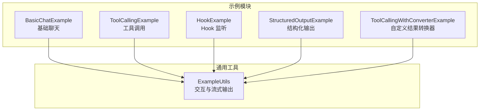
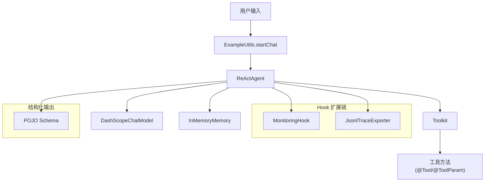
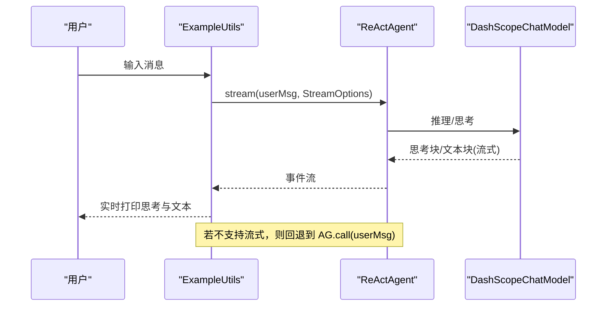
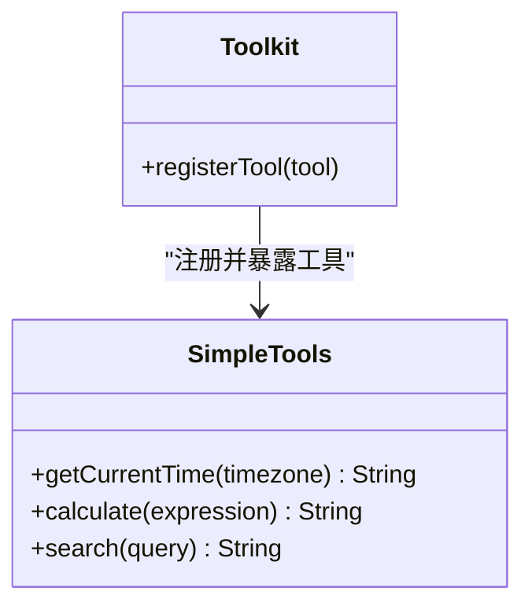
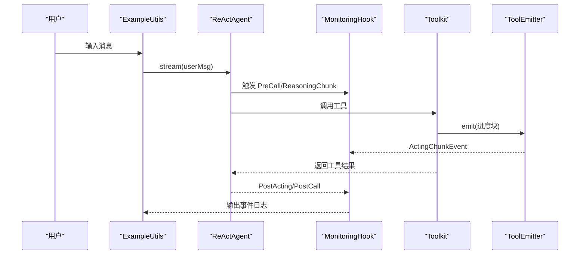
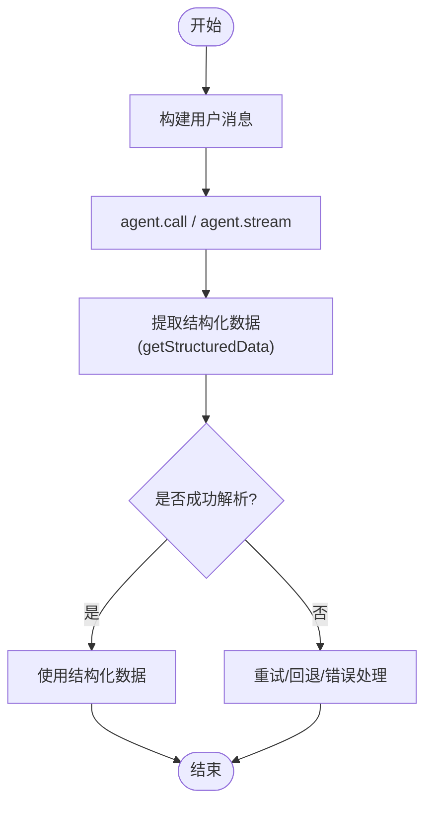
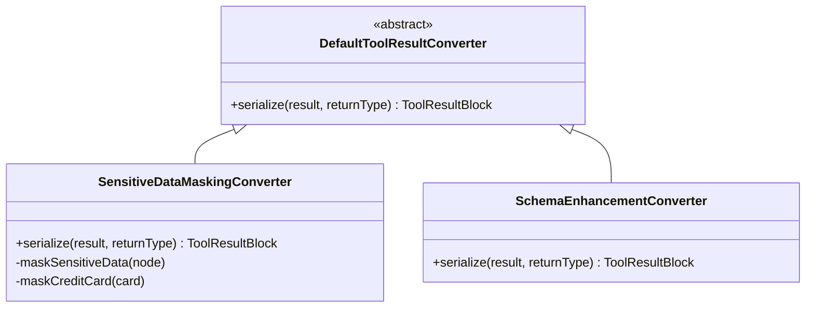
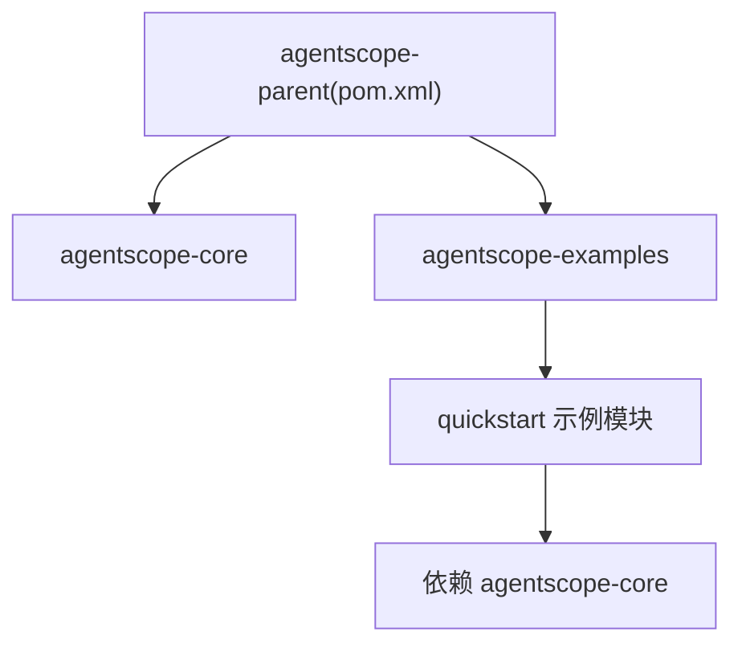

# 快速开始示例

<cite>
**本文引用的文件**
- [BasicChatExample.java](file://agentscope-examples/quickstart/src/main/java/io/agentscope/examples/quickstart/BasicChatExample.java)
- [ToolCallingExample.java](file://agentscope-examples/quickstart/src/main/java/io/agentscope/examples/quickstart/ToolCallingExample.java)
- [HookExample.java](file://agentscope-examples/quickstart/src/main/java/io/agentscope/examples/quickstart/HookExample.java)
- [StructuredOutputExample.java](file://agentscope-examples/quickstart/src/main/java/io/agentscope/examples/quickstart/StructuredOutputExample.java)
- [ToolCallingWithConverterExample.java](file://agentscope-examples/quickstart/src/main/java/io/agentscope/examples/quickstart/ToolCallingWithConverterExample.java)
- [ExampleUtils.java](file://agentscope-examples/quickstart/src/main/java/io/agentscope/examples/quickstart/ExampleUtils.java)
- [pom.xml](file://pom.xml)
- [README.md](file://README.md)
</cite>

## 目录
1. [简介](#简介)
2. [项目结构](#项目结构)
3. [核心组件](#核心组件)
4. [架构总览](#架构总览)
5. [详细组件分析](#详细组件分析)
6. [依赖分析](#依赖分析)
7. [性能考虑](#性能考虑)
8. [故障排查指南](#故障排查指南)
9. [结论](#结论)
10. [附录](#附录)

## 简介
本文件面向首次使用 AgentScope Java 的开发者，围绕“快速开始示例”提供系统化技术文档。内容覆盖以下主题：
- 基础聊天示例：智能体创建、消息处理与响应生成
- 工具调用示例：工具注册、参数传递与结果处理
- Hook 使用示例：事件监听、拦截器实现与自定义扩展
- 结构化输出示例：JSON 模式定义与输出验证
- 运行步骤：依赖配置、环境准备与启动命令
- 常见问题与调试技巧

## 项目结构
快速开始示例位于 agentscope-examples/quickstart 模块，包含多个独立示例程序，每个示例聚焦一个核心能力，并通过统一的交互工具类进行演示。

图表来源
- [BasicChatExample.java:28-63](file://agentscope-examples/quickstart/src/main/java/io/agentscope/examples/quickstart/BasicChatExample.java#L28-L63)
- [ToolCallingExample.java:32-75](file://agentscope-examples/quickstart/src/main/java/io/agentscope/examples/quickstart/ToolCallingExample.java#L32-L75)
- [HookExample.java:47-101](file://agentscope-examples/quickstart/src/main/java/io/agentscope/examples/quickstart/HookExample.java#L47-L101)
- [StructuredOutputExample.java:36-82](file://agentscope-examples/quickstart/src/main/java/io/agentscope/examples/quickstart/StructuredOutputExample.java#L36-L82)
- [ToolCallingWithConverterExample.java:57-98](file://agentscope-examples/quickstart/src/main/java/io/agentscope/examples/quickstart/ToolCallingWithConverterExample.java#L57-L98)
- [ExampleUtils.java:131-255](file://agentscope-examples/quickstart/src/main/java/io/agentscope/examples/quickstart/ExampleUtils.java#L131-L255)

章节来源
- [BasicChatExample.java:28-63](file://agentscope-examples/quickstart/src/main/java/io/agentscope/examples/quickstart/BasicChatExample.java#L28-L63)
- [ToolCallingExample.java:32-75](file://agentscope-examples/quickstart/src/main/java/io/agentscope/examples/quickstart/ToolCallingExample.java#L32-L75)
- [HookExample.java:47-101](file://agentscope-examples/quickstart/src/main/java/io/agentscope/examples/quickstart/HookExample.java#L47-L101)
- [StructuredOutputExample.java:36-82](file://agentscope-examples/quickstart/src/main/java/io/agentscope/examples/quickstart/StructuredOutputExample.java#L36-L82)
- [ToolCallingWithConverterExample.java:57-98](file://agentscope-examples/quickstart/src/main/java/io/agentscope/examples/quickstart/ToolCallingWithConverterExample.java#L57-L98)
- [ExampleUtils.java:131-255](file://agentscope-examples/quickstart/src/main/java/io/agentscope/examples/quickstart/ExampleUtils.java#L131-L255)

## 核心组件
- ReActAgent：基于 ReAct（推理-行动）范式的智能体，支持思考块、工具调用、记忆与钩子扩展。
- DashScopeChatModel：接入 DashScope 大模型服务，支持流式输出与思考预算控制。
- Toolkit：工具箱，用于注册与管理可被智能体调用的方法。
- Hook：事件驱动的扩展机制，可在推理、行动前后捕获事件并执行自定义逻辑。
- StructuredOutput：结构化输出能力，将大模型输出映射到强类型对象，支持流式与非流式两种模式。
- ExampleUtils：统一的交互入口，封装 API Key 获取、聊天循环、流式输出与回退策略。

章节来源
- [BasicChatExample.java:41-59](file://agentscope-examples/quickstart/src/main/java/io/agentscope/examples/quickstart/BasicChatExample.java#L41-L59)
- [ToolCallingExample.java:54-71](file://agentscope-examples/quickstart/src/main/java/io/agentscope/examples/quickstart/ToolCallingExample.java#L54-L71)
- [HookExample.java:77-94](file://agentscope-examples/quickstart/src/main/java/io/agentscope/examples/quickstart/HookExample.java#L77-L94)
- [StructuredOutputExample.java:47-63](file://agentscope-examples/quickstart/src/main/java/io/agentscope/examples/quickstart/StructuredOutputExample.java#L47-L63)
- [ExampleUtils.java:131-255](file://agentscope-examples/quickstart/src/main/java/io/agentscope/examples/quickstart/ExampleUtils.java#L131-L255)

## 架构总览
下图展示了示例程序与核心组件之间的关系，以及一次典型对话的执行流程。

图表来源
- [BasicChatExample.java:41-59](file://agentscope-examples/quickstart/src/main/java/io/agentscope/examples/quickstart/BasicChatExample.java#L41-L59)
- [ToolCallingExample.java:54-71](file://agentscope-examples/quickstart/src/main/java/io/agentscope/examples/quickstart/ToolCallingExample.java#L54-L71)
- [HookExample.java:77-94](file://agentscope-examples/quickstart/src/main/java/io/agentscope/examples/quickstart/HookExample.java#L77-L94)
- [StructuredOutputExample.java:47-63](file://agentscope-examples/quickstart/src/main/java/io/agentscope/examples/quickstart/StructuredOutputExample.java#L47-L63)
- [ExampleUtils.java:131-255](file://agentscope-examples/quickstart/src/main/java/io/agentscope/examples/quickstart/ExampleUtils.java#L131-L255)

## 详细组件分析

### 基础聊天示例（智能体创建、消息处理与响应生成）
- 智能体创建要点
  - 使用构建器配置名称、系统提示词、模型、内存与工具箱。
  - 模型启用流式输出与思考块，便于实时展示推理过程。
- 消息处理与响应生成
  - 通过 ExampleUtils.startChat 启动交互循环，自动尝试流式输出；若不支持则回退到普通调用。
  - 流式输出会区分“思考块”和“文本块”，并按增量方式打印。
- 关键路径
  - [BasicChatExample.main:30-63](file://agentscope-examples/quickstart/src/main/java/io/agentscope/examples/quickstart/BasicChatExample.java#L30-L63)
  - [ExampleUtils.startChat:131-255](file://agentscope-examples/quickstart/src/main/java/io/agentscope/examples/quickstart/ExampleUtils.java#L131-L255)

图表来源
- [BasicChatExample.java:30-63](file://agentscope-examples/quickstart/src/main/java/io/agentscope/examples/quickstart/BasicChatExample.java#L30-L63)
- [ExampleUtils.java:131-255](file://agentscope-examples/quickstart/src/main/java/io/agentscope/examples/quickstart/ExampleUtils.java#L131-L255)

章节来源
- [BasicChatExample.java:30-63](file://agentscope-examples/quickstart/src/main/java/io/agentscope/examples/quickstart/BasicChatExample.java#L30-L63)
- [ExampleUtils.java:131-255](file://agentscope-examples/quickstart/src/main/java/io/agentscope/examples/quickstart/ExampleUtils.java#L131-L255)

### 工具调用示例（工具注册、参数传递与结果处理）
- 工具注册
  - 创建 Toolkit 并注册工具类，工具类中的方法通过注解声明为可调用工具。
- 参数传递
  - 使用 @ToolParam 注解为工具方法参数提供名称与描述，便于模型正确构造工具调用。
- 结果处理
  - 工具返回值直接作为工具结果；在 Hook 示例中，工具可通过 ToolEmitter 发送进度块。
- 关键路径
  - [ToolCallingExample.main:34-75](file://agentscope-examples/quickstart/src/main/java/io/agentscope/examples/quickstart/ToolCallingExample.java#L34-L75)
  - [SimpleTools（工具方法集合）:82-191](file://agentscope-examples/quickstart/src/main/java/io/agentscope/examples/quickstart/ToolCallingExample.java#L82-L191)

图表来源
- [ToolCallingExample.java:44-71](file://agentscope-examples/quickstart/src/main/java/io/agentscope/examples/quickstart/ToolCallingExample.java#L44-L71)
- [ToolCallingExample.java:82-191](file://agentscope-examples/quickstart/src/main/java/io/agentscope/examples/quickstart/ToolCallingExample.java#L82-L191)

章节来源
- [ToolCallingExample.java:34-75](file://agentscope-examples/quickstart/src/main/java/io/agentscope/examples/quickstart/ToolCallingExample.java#L34-L75)
- [ToolCallingExample.java:82-191](file://agentscope-examples/quickstart/src/main/java/io/agentscope/examples/quickstart/ToolCallingExample.java#L82-L191)

### Hook 使用示例（事件监听、拦截器实现与自定义扩展）
- 设计思路
  - 通过实现 Hook 接口，在关键生命周期事件（如推理前/后、行动前/后、工具调用等）插入自定义逻辑。
  - 示例中包含两个 Hook：自定义监控 Hook 与内置 JSONL 跟踪导出器。
- 事件监听
  - 使用模式匹配处理不同类型的 HookEvent，分别输出思考增量、工具调用参数、工具进度与最终结果。
- 自定义扩展
  - 可在 Hook 中记录日志、上报指标、注入上下文或中断流程。
- 关键路径
  - [HookExample.main:47-101](file://agentscope-examples/quickstart/src/main/java/io/agentscope/examples/quickstart/HookExample.java#L47-L101)
  - [MonitoringHook.onEvent:109-160](file://agentscope-examples/quickstart/src/main/java/io/agentscope/examples/quickstart/HookExample.java#L109-L160)
  - [ProgressTools.processData:172-204](file://agentscope-examples/quickstart/src/main/java/io/agentscope/examples/quickstart/HookExample.java#L172-L204)

图表来源
- [HookExample.java:77-101](file://agentscope-examples/quickstart/src/main/java/io/agentscope/examples/quickstart/HookExample.java#L77-L101)
- [HookExample.java:109-160](file://agentscope-examples/quickstart/src/main/java/io/agentscope/examples/quickstart/HookExample.java#L109-L160)
- [HookExample.java:172-204](file://agentscope-examples/quickstart/src/main/java/io/agentscope/examples/quickstart/HookExample.java#L172-L204)

章节来源
- [HookExample.java:47-101](file://agentscope-examples/quickstart/src/main/java/io/agentscope/examples/quickstart/HookExample.java#L47-L101)
- [HookExample.java:109-160](file://agentscope-examples/quickstart/src/main/java/io/agentscope/examples/quickstart/HookExample.java#L109-L160)
- [HookExample.java:172-204](file://agentscope-examples/quickstart/src/main/java/io/agentscope/examples/quickstart/HookExample.java#L172-L204)

### 结构化输出示例（JSON 模式定义与输出验证）
- 配置选项
  - 在调用智能体时指定目标 POJO 类型，框架将引导模型输出符合该类型的结构化数据。
  - 支持流式与非流式两种模式：流式通过事件流逐步获取最终结果。
- JSON 模式定义
  - 通过 POJO 字段与注释描述字段含义，框架可据此生成 JSON Schema 并进行输出校验与修正。
- 关键路径
  - [StructuredOutputExample.main:36-82](file://agentscope-examples/quickstart/src/main/java/io/agentscope/examples/quickstart/StructuredOutputExample.java#L36-L82)
  - [runProductAnalysisExample:85-120](file://agentscope-examples/quickstart/src/main/java/io/agentscope/examples/quickstart/StructuredOutputExample.java#L85-L120)
  - [runStreamProductAnalysisExample:197-234](file://agentscope-examples/quickstart/src/main/java/io/agentscope/examples/quickstart/StructuredOutputExample.java#L197-L234)
  - [Schema 数据类:239-269](file://agentscope-examples/quickstart/src/main/java/io/agentscope/examples/quickstart/StructuredOutputExample.java#L239-L269)

图表来源
- [StructuredOutputExample.java:85-120](file://agentscope-examples/quickstart/src/main/java/io/agentscope/examples/quickstart/StructuredOutputExample.java#L85-L120)
- [StructuredOutputExample.java:197-234](file://agentscope-examples/quickstart/src/main/java/io/agentscope/examples/quickstart/StructuredOutputExample.java#L197-L234)

章节来源
- [StructuredOutputExample.java:36-82](file://agentscope-examples/quickstart/src/main/java/io/agentscope/examples/quickstart/StructuredOutputExample.java#L36-L82)
- [StructuredOutputExample.java:85-120](file://agentscope-examples/quickstart/src/main/java/io/agentscope/examples/quickstart/StructuredOutputExample.java#L85-L120)
- [StructuredOutputExample.java:197-234](file://agentscope-examples/quickstart/src/main/java/io/agentscope/examples/quickstart/StructuredOutputExample.java#L197-L234)
- [StructuredOutputExample.java:239-269](file://agentscope-examples/quickstart/src/main/java/io/agentscope/examples/quickstart/StructuredOutputExample.java#L239-L269)

### 自定义结果转换器示例（工具调用结果的增强与脱敏）
- 目标
  - 展示如何通过扩展默认转换器实现敏感信息脱敏与结果 JSON Schema 增强。
- 实现要点
  - 为工具方法指定 converter 属性，框架在序列化工具结果时调用自定义转换器。
  - 转换器负责对敏感字段进行掩码、信用卡号识别与掩码、生成 JSON Schema 并与结果一起返回。
- 关键路径
  - [ToolCallingWithConverterExample.main:57-98](file://agentscope-examples/quickstart/src/main/java/io/agentscope/examples/quickstart/ToolCallingWithConverterExample.java#L57-L98)
  - [SensitiveDataMaskingConverter.serialize:191-215](file://agentscope-examples/quickstart/src/main/java/io/agentscope/examples/quickstart/ToolCallingWithConverterExample.java#L191-L215)
  - [SchemaEnhancementConverter.serialize:265-283](file://agentscope-examples/quickstart/src/main/java/io/agentscope/examples/quickstart/ToolCallingWithConverterExample.java#L265-L283)
  - [SimpleTools（带 converter 的工具方法）:112-139](file://agentscope-examples/quickstart/src/main/java/io/agentscope/examples/quickstart/ToolCallingWithConverterExample.java#L112-L139)

图表来源
- [ToolCallingWithConverterExample.java:174-284](file://agentscope-examples/quickstart/src/main/java/io/agentscope/examples/quickstart/ToolCallingWithConverterExample.java#L174-L284)

章节来源
- [ToolCallingWithConverterExample.java:57-98](file://agentscope-examples/quickstart/src/main/java/io/agentscope/examples/quickstart/ToolCallingWithConverterExample.java#L57-L98)
- [ToolCallingWithConverterExample.java:174-284](file://agentscope-examples/quickstart/src/main/java/io/agentscope/examples/quickstart/ToolCallingWithConverterExample.java#L174-L284)
- [ToolCallingWithConverterExample.java:112-139](file://agentscope-examples/quickstart/src/main/java/io/agentscope/examples/quickstart/ToolCallingWithConverterExample.java#L112-L139)

## 依赖分析
- Maven 顶层 POM 定义了多模块结构与版本属性，示例模块通过父 POM 引入统一依赖管理。
- 示例模块依赖 agentscope-core 提供的智能体、模型、工具、Hook、消息与结构化输出等核心能力。
- 运行时需要 JDK 17+ 与 DashScope/OpenAI 等模型服务的 API Key。

图表来源
- [pom.xml:56-63](file://pom.xml#L56-L63)
- [pom.xml:132-149](file://pom.xml#L132-L149)

章节来源
- [pom.xml:56-63](file://pom.xml#L56-L63)
- [pom.xml:132-149](file://pom.xml#L132-L149)
- [README.md:72-100](file://README.md#L72-L100)

## 性能考虑
- 流式输出优先：示例优先尝试流式输出以获得更好的用户体验；当模型或平台不支持时自动回退。
- 内存与工具状态：示例使用内存型记忆，适合演示场景；生产环境建议结合持久化与长程记忆方案。
- Hook 开销：Hook 事件处理应避免阻塞操作，必要时异步处理或限流。
- 工具调用：工具方法应尽量短小、幂等，避免长时间阻塞；可通过 ToolEmitter 提供进度反馈。

## 故障排查指南
- API Key 缺失
  - 现象：启动时报错或提示未配置 API Key。
  - 处理：设置环境变量或按交互提示输入；ExampleUtils 会显示掩码后的提示以便安全设置。
  - 参考：[ExampleUtils.getDashScopeApiKey/getOpenAIApiKey:57-110](file://agentscope-examples/quickstart/src/main/java/io/agentscope/examples/quickstart/ExampleUtils.java#L57-L110)
- 流式输出异常
  - 现象：抛出不支持流式的异常或警告。
  - 处理：示例已内置回退逻辑；可检查模型配置与网络环境。
  - 参考：[ExampleUtils.startChat 回退分支:202-214](file://agentscope-examples/quickstart/src/main/java/io/agentscope/examples/quickstart/ExampleUtils.java#L202-L214)
- 工具调用失败
  - 现象：工具无响应或返回错误。
  - 处理：确认工具已注册、参数名与描述正确；检查工具内部异常与超时。
  - 参考：[ToolCallingExample.SimpleTools:82-191](file://agentscope-examples/quickstart/src/main/java/io/agentscope/examples/quickstart/ToolCallingExample.java#L82-L191)
- Hook 事件未触发
  - 现象：监控 Hook 未输出事件日志。
  - 处理：确认智能体已添加 Hook 列表；检查事件类型过滤与 Hook 实现。
  - 参考：[HookExample.MonitoringHook:109-160](file://agentscope-examples/quickstart/src/main/java/io/agentscope/examples/quickstart/HookExample.java#L109-L160)
- 结构化输出解析失败
  - 现象：getStructuredData 抛出异常或返回空。
  - 处理：检查 POJO 字段与注释描述是否清晰；尝试简化提示词或开启思维块辅助。
  - 参考：[StructuredOutputExample.run* 方法:85-120](file://agentscope-examples/quickstart/src/main/java/io/agentscope/examples/quickstart/StructuredOutputExample.java#L85-L120)

章节来源
- [ExampleUtils.java:57-110](file://agentscope-examples/quickstart/src/main/java/io/agentscope/examples/quickstart/ExampleUtils.java#L57-L110)
- [ExampleUtils.java:202-214](file://agentscope-examples/quickstart/src/main/java/io/agentscope/examples/quickstart/ExampleUtils.java#L202-L214)
- [ToolCallingExample.java:82-191](file://agentscope-examples/quickstart/src/main/java/io/agentscope/examples/quickstart/ToolCallingExample.java#L82-L191)
- [HookExample.java:109-160](file://agentscope-examples/quickstart/src/main/java/io/agentscope/examples/quickstart/HookExample.java#L109-L160)
- [StructuredOutputExample.java:85-120](file://agentscope-examples/quickstart/src/main/java/io/agentscope/examples/quickstart/StructuredOutputExample.java#L85-L120)

## 结论
通过本快速开始示例，开发者可以：
- 快速搭建具备思考与行动能力的智能体
- 为智能体注册工具并进行参数化调用
- 使用 Hook 监听与扩展智能体生命周期
- 生成并解析结构化输出，提升应用稳定性与可维护性
- 在统一的交互工具类基础上完成端到端演示

## 附录

### 运行步骤
- 环境要求
  - JDK 17 或以上
  - Maven 3.6+
- 获取 API Key
  - DashScope：参考 [ExampleUtils.getDashScopeApiKey:57-110](file://agentscope-examples/quickstart/src/main/java/io/agentscope/examples/quickstart/ExampleUtils.java#L57-L110)
  - OpenAI：参考 [ExampleUtils.getOpenAIApiKey:68-70](file://agentscope-examples/quickstart/src/main/java/io/agentscope/examples/quickstart/ExampleUtils.java#L68-L70)
- 启动示例
  - 进入示例类所在包，执行 main 方法即可启动对应示例。
  - 例如：[BasicChatExample.main:30-63](file://agentscope-examples/quickstart/src/main/java/io/agentscope/examples/quickstart/BasicChatExample.java#L30-L63)
- 退出方式
  - 在交互界面输入 exit 即可结束当前示例。

章节来源
- [ExampleUtils.java:57-110](file://agentscope-examples/quickstart/src/main/java/io/agentscope/examples/quickstart/ExampleUtils.java#L57-L110)
- [ExampleUtils.java:131-255](file://agentscope-examples/quickstart/src/main/java/io/agentscope/examples/quickstart/ExampleUtils.java#L131-L255)
- [BasicChatExample.java:30-63](file://agentscope-examples/quickstart/src/main/java/io/agentscope/examples/quickstart/BasicChatExample.java#L30-L63)