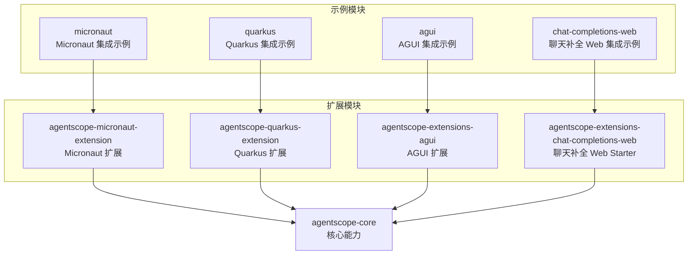
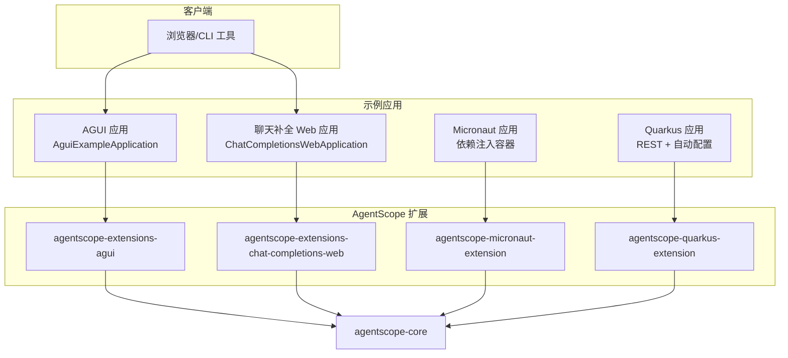
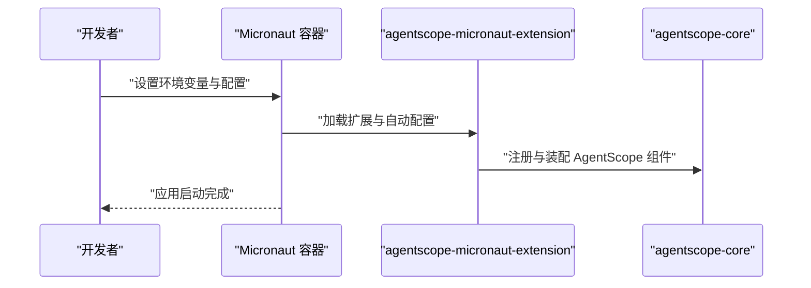
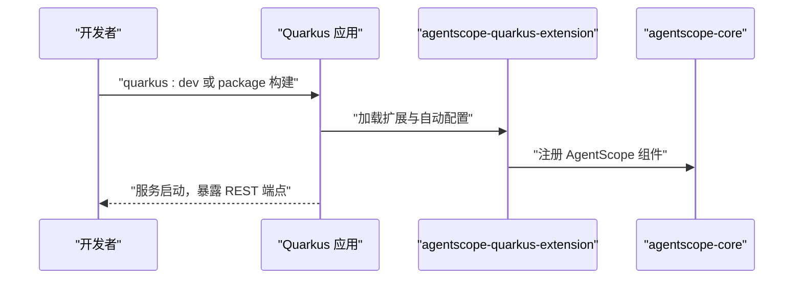
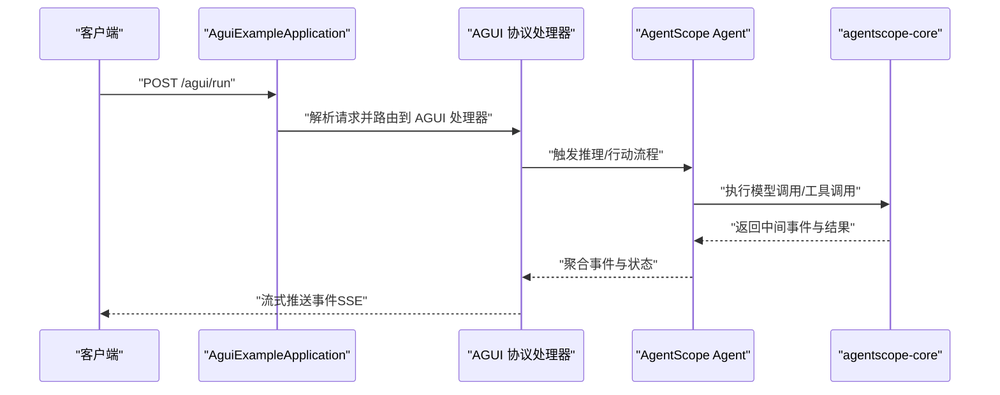
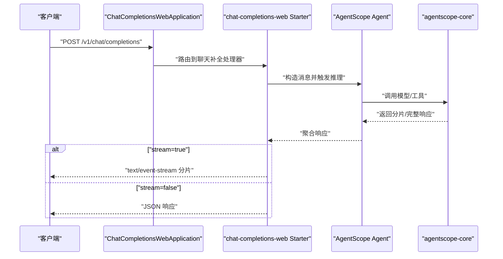
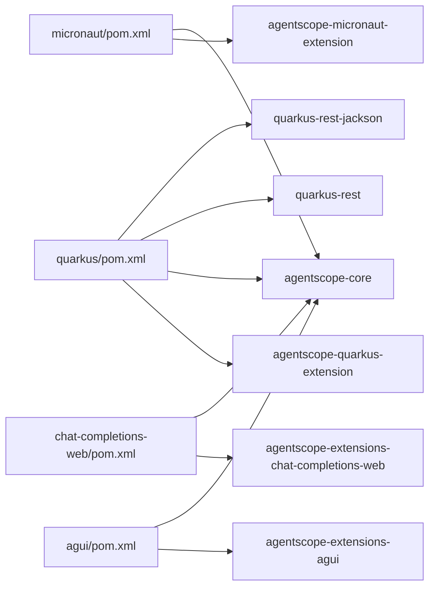

# 框架集成示例

<cite>
**本文引用的文件**
- [Agui 示例应用（AguiExampleApplication.java）](file://agentscope-examples/agui/src/main/java/io/agentscope/examples/agui/AguiExampleApplication.java)
- [AGUI 示例配置（application.yml）](file://agentscope-examples/agui/src/main/resources/application.yml)
- [AGUI 示例日志配置（logback.xml）](file://agentscope-examples/agui/src/main/resources/logback.xml)
- [聊天补全 Web 示例应用（ChatCompletionsWebApplication.java）](file://agentscope-examples/chat-completions-web/src/main/java/io/agentscope/examples/chatcompletions/ChatCompletionsWebApplication.java)
- [聊天补全 Web 示例配置（application.yml）](file://agentscope-examples/chat-completions-web/src/main/resources/application.yml)
- [Micronaut 示例 POM（pom.xml）](file://agentscope-examples/micronaut/pom.xml)
- [Micronaut 示例说明（README.md）](file://agentscope-examples/micronaut/README.md)
- [Quarkus 示例 POM（pom.xml）](file://agentscope-examples/quarkus/pom.xml)
- [Quarkus 示例说明（README.md）](file://agentscope-examples/quarkus/README.md)
</cite>

## 目录
1. [简介](#简介)
2. [项目结构](#项目结构)
3. [核心组件](#核心组件)
4. [架构总览](#架构总览)
5. [详细组件分析](#详细组件分析)
6. [依赖分析](#依赖分析)
7. [性能考虑](#性能考虑)
8. [故障排除指南](#故障排除指南)
9. [结论](#结论)
10. [附录](#附录)

## 简介
本技术文档围绕 AgentScope Java 的三个框架集成示例展开：Micronaut 集成、Quarkus 集成与 AGUI 集成，以及聊天补全 Web 集成示例。文档旨在帮助开发者理解各示例的实现方式、配置要点、运行时特性与优化策略，并提供完整的集成指南、性能对比与最佳实践建议。

## 项目结构
本仓库采用多模块结构组织示例与扩展模块。与本主题直接相关的示例位于 agentscope-examples 下的相应子目录中；扩展模块（如 Micronaut/Quarkus/AGUI/Web Starter 等）位于 agentscope-extensions 中。下图展示了与本主题相关的关键模块及其职责：

图表来源
- [Micronaut 示例 POM（pom.xml）:51-71](file://agentscope-examples/micronaut/pom.xml#L51-L71)
- [Quarkus 示例 POM（pom.xml）:51-75](file://agentscope-examples/quarkus/pom.xml#L51-L75)
- [聊天补全 Web 示例应用（ChatCompletionsWebApplication.java）:18-20](file://agentscope-examples/chat-completions-web/src/main/java/io/agentscope/examples/chatcompletions/ChatCompletionsWebApplication.java#L18-L20)

章节来源
- [Micronaut 示例 POM（pom.xml）:17-87](file://agentscope-examples/micronaut/pom.xml#L17-L87)
- [Quarkus 示例 POM（pom.xml）:17-122](file://agentscope-examples/quarkus/pom.xml#L17-L122)
- [聊天补全 Web 示例应用（ChatCompletionsWebApplication.java）:16-60](file://agentscope-examples/chat-completions-web/src/main/java/io/agentscope/examples/chatcompletions/ChatCompletionsWebApplication.java#L16-L60)

## 核心组件
本节概述三大集成示例的核心职责与关键点：
- Micronaut 集成示例：通过 Micronaut 的依赖注入容器自动装配 AgentScope 组件，简化配置与启动流程。
- Quarkus 集成示例：利用 Quarkus 扩展与自动配置能力，支持开发模式、JVM 镜像与原生镜像部署，并提供 REST 接口。
- AGUI 集成示例：基于 Spring WebFlux 暴露 AG-UI 协议接口，支持流式事件推送与会话状态管理。
- 聊天补全 Web 集成示例：通过 Spring Boot Starter 快速启用 OpenAI 兼容的聊天补全 API，支持非流式与流式响应。

章节来源
- [Micronaut 示例说明（README.md）:32-41](file://agentscope-examples/micronaut/README.md#L32-L41)
- [Quarkus 示例说明（README.md）:1-79](file://agentscope-examples/quarkus/README.md#L1-L79)
- [Agui 示例应用（AguiExampleApplication.java）:21-34](file://agentscope-examples/agui/src/main/java/io/agentscope/examples/agui/AguiExampleApplication.java#L21-L34)
- [聊天补全 Web 示例应用（ChatCompletionsWebApplication.java）:21-58](file://agentscope-examples/chat-completions-web/src/main/java/io/agentscope/examples/chatcompletions/ChatCompletionsWebApplication.java#L21-L58)

## 架构总览
下图展示了四个示例在运行时的整体交互关系与数据流向：

图表来源
- [Agui 示例应用（AguiExampleApplication.java）:35-41](file://agentscope-examples/agui/src/main/java/io/agentscope/examples/agui/AguiExampleApplication.java#L35-L41)
- [聊天补全 Web 示例应用（ChatCompletionsWebApplication.java）:59-65](file://agentscope-examples/chat-completions-web/src/main/java/io/agentscope/examples/chatcompletions/ChatCompletionsWebApplication.java#L59-L65)
- [Micronaut 示例 POM（pom.xml）:51-71](file://agentscope-examples/micronaut/pom.xml#L51-L71)
- [Quarkus 示例 POM（pom.xml）:51-75](file://agentscope-examples/quarkus/pom.xml#L51-L75)

## 详细组件分析

### Micronaut 集成示例
- 依赖注入与自动配置
  - 通过引入 agentscope-micronaut-extension，示例应用可借助 Micronaut 的 ApplicationContext 自动装配 AgentScope 组件。
  - 配置由 application.yml 提供，支持切换 LLM 提供商（DashScope/OpenAI/Gemini/Anthropic）。
- 运行时优化
  - 使用 Micronaut 的轻量级容器与编译期元数据生成，减少启动时间与内存占用。
  - 通过环境变量注入 API Key，避免硬编码敏感信息。
- 启动与使用
  - 设置 DASHSCOPE_API_KEY 环境变量后，执行 mvn 清理编译并运行主类即可启动。

图表来源
- [Micronaut 示例 POM（pom.xml）:51-71](file://agentscope-examples/micronaut/pom.xml#L51-L71)
- [Micronaut 示例说明（README.md）:32-41](file://agentscope-examples/micronaut/README.md#L32-L41)

章节来源
- [Micronaut 示例 POM（pom.xml）:34-71](file://agentscope-examples/micronaut/pom.xml#L34-L71)
- [Micronaut 示例说明（README.md）:11-56](file://agentscope-examples/micronaut/README.md#L11-L56)

### Quarkus 集成示例
- 原生镜像支持
  - 示例通过 Quarkus Maven 插件与 native profile 支持原生镜像构建，适合对冷启动与内存占用有严格要求的场景。
- 无框架配置
  - 引入 agentscope-quarkus-extension 后，应用可自动完成 AgentScope 组件的注册与配置，无需手动初始化。
- 开发模式与热重载
  - 提供 quarkus:dev 运行模式，支持源码变更后的热重载，提升迭代效率。
- REST 接口
  - 提供 /agent/health 与 /agent/chat 等端点用于健康检查与对话测试。

图表来源
- [Quarkus 示例 POM（pom.xml）:51-75](file://agentscope-examples/quarkus/pom.xml#L51-L75)
- [Quarkus 示例说明（README.md）:23-41](file://agentscope-examples/quarkus/README.md#L23-L41)

章节来源
- [Quarkus 示例 POM（pom.xml）:114-122](file://agentscope-examples/quarkus/pom.xml#L114-L122)
- [Quarkus 示例说明（README.md）:1-79](file://agentscope-examples/quarkus/README.md#L1-L79)

### AGUI 集成示例
- 架构设计
  - 基于 Spring Boot 与 WebFlux，通过 agentscope-extensions-agui 暴露 AG-UI 协议接口。
  - 支持路径前缀、CORS、超时控制、事件与工具调用参数透传等配置项。
- 适配器模式
  - 将 AgentScope 的内部事件模型适配为 AG-UI 的协议消息，统一事件与状态输出。
- 事件处理与状态管理
  - 可配置是否向客户端发送状态事件与工具调用参数，支持服务端会话管理与线程池限制。
- 启动与使用
  - 设置 DASHSCOPE_API_KEY 环境变量后启动应用，访问 http://localhost:8080 查看页面或使用 curl 调用 /agui/run。

图表来源
- [Agui 示例应用（AguiExampleApplication.java）:21-34](file://agentscope-examples/agui/src/main/java/io/agentscope/examples/agui/AguiExampleApplication.java#L21-L34)
- [AGUI 示例配置（application.yml）:24-48](file://agentscope-examples/agui/src/main/resources/application.yml#L24-L48)

章节来源
- [Agui 示例应用（AguiExampleApplication.java）:16-56](file://agentscope-examples/agui/src/main/java/io/agentscope/examples/agui/AguiExampleApplication.java#L16-L56)
- [AGUI 示例配置（application.yml）:15-55](file://agentscope-examples/agui/src/main/resources/application.yml#L15-L55)
- [AGUI 示例日志配置（logback.xml）:17-32](file://agentscope-examples/agui/src/main/resources/logback.xml#L17-L32)

### 聊天补全 Web 集成示例
- REST API 设计
  - 通过 agentscope-extensions-chat-completions-web Starter 快速启用 /v1/chat/completions 端点，兼容 OpenAI 风格的消息格式。
- 流式响应
  - 支持 stream=true 的事件流推送；当 stream=false 时，不接受 text/event-stream 头部，以保证一致性。
- 跨域处理
  - Starter 内置 CORS 配置，便于前端直连后端。
- 配置要点
  - 在 application.yml 中设置模型提供商、API Key、默认模型名与是否启用流式输出。

图表来源
- [聊天补全 Web 示例应用（ChatCompletionsWebApplication.java）:21-58](file://agentscope-examples/chat-completions-web/src/main/java/io/agentscope/examples/chatcompletions/ChatCompletionsWebApplication.java#L21-L58)
- [聊天补全 Web 示例配置（application.yml）:22-44](file://agentscope-examples/chat-completions-web/src/main/resources/application.yml#L22-L44)

章节来源
- [聊天补全 Web 示例应用（ChatCompletionsWebApplication.java）:16-189](file://agentscope-examples/chat-completions-web/src/main/java/io/agentscope/examples/chatcompletions/ChatCompletionsWebApplication.java#L16-L189)
- [聊天补全 Web 示例配置（application.yml）:14-44](file://agentscope-examples/chat-completions-web/src/main/resources/application.yml#L14-L44)

## 依赖分析
下表总结了四个示例模块的关键依赖与作用：

| 模块 | 关键依赖 | 作用 |
| --- | --- | --- |
| Micronaut 示例 | agentscope-micronaut-extension, agentscope-core | 通过 Micronaut 容器自动装配 AgentScope 组件 |
| Quarkus 示例 | agentscope-quarkus-extension, agentscope-core, quarkus-rest, quarkus-rest-jackson | 提供 REST 接口与自动配置，支持 JVM 与原生镜像 |
| AGUI 示例 | agentscope-extensions-agui, agentscope-core | 暴露 AG-UI 协议接口，支持事件流与会话管理 |
| 聊天补全 Web 示例 | agentscope-extensions-chat-completions-web, agentscope-core | 快速启用 OpenAI 兼容的聊天补全 API |

图表来源
- [Micronaut 示例 POM（pom.xml）:51-71](file://agentscope-examples/micronaut/pom.xml#L51-L71)
- [Quarkus 示例 POM（pom.xml）:51-75](file://agentscope-examples/quarkus/pom.xml#L51-L75)

章节来源
- [Micronaut 示例 POM（pom.xml）:34-71](file://agentscope-examples/micronaut/pom.xml#L34-L71)
- [Quarkus 示例 POM（pom.xml）:39-75](file://agentscope-examples/quarkus/pom.xml#L39-L75)

## 性能考虑
- 启动时间与内存占用
  - Quarkus 原生镜像在冷启动与内存占用方面通常优于传统 JVM 应用，适合边缘与云原生场景。
  - Micronaut 通过编译期元数据与反射最小化，有助于缩短启动时间。
- 流式传输
  - AGUI 与聊天补全 Web 示例均支持事件流推送，降低首字节延迟并改善用户体验。
- 会话与并发
  - AGUI 示例提供服务端会话管理与线程池上限配置，避免高并发下的资源耗尽。
- 日志与可观测性
  - 示例均提供日志配置，建议在生产环境中调整日志级别与输出目标，平衡可观测性与性能。

## 故障排除指南
- API 密钥未配置
  - Micronaut 与 Quarkus 示例均需要设置 DASHSCOPE_API_KEY 环境变量或在配置文件中指定。
- CORS 问题
  - AGUI 示例已内置 CORS 配置，若前端仍遇跨域，请检查代理与路径前缀设置。
- 流式响应异常
  - 当 stream=false 时，不要携带 text/event-stream 头部；反之则需正确处理 SSE 流。
- 端口冲突
  - 四个示例默认端口均为 8080，若同时运行请修改各自配置中的 server.port。
- 原生镜像构建失败
  - Quarkus 原生镜像构建需满足 GraalVM 要求，确保使用受支持的 JDK 版本并按官方指南准备环境。

章节来源
- [Micronaut 示例说明（README.md）:13-30](file://agentscope-examples/micronaut/README.md#L13-L30)
- [Quarkus 示例说明（README.md）:13-29](file://agentscope-examples/quarkus/README.md#L13-L29)
- [聊天补全 Web 示例应用（ChatCompletionsWebApplication.java）:55-58](file://agentscope-examples/chat-completions-web/src/main/java/io/agentscope/examples/chatcompletions/ChatCompletionsWebApplication.java#L55-L58)
- [AGUI 示例配置（application.yml）:28-31](file://agentscope-examples/agui/src/main/resources/application.yml#L28-L31)

## 结论
- 若追求极致启动速度与内存占用，推荐使用 Quarkus 原生镜像。
- 若偏好轻量级容器与编译期优化，Micronaut 是良好选择。
- 若需要与前端直连并快速实现聊天补全 API，聊天补全 Web 示例提供了开箱即用的 Starter。
- 若希望以 AG-UI 协议进行统一事件与状态输出，AGUI 示例提供了完善的配置与运行时特性。

## 附录
- 集成步骤摘要
  - Micronaut：设置 API Key → 修改 application.yml → mvn 清理编译并运行。
  - Quarkus：设置 API Key → quarkus:dev 或 package 构建 → Docker/JVM/原生镜像运行。
  - AGUI：设置 API Key → 启动应用 → 访问 http://localhost:8080 或调用 /agui/run。
  - 聊天补全 Web：配置模型与 API Key → 启动应用 → 调用 /v1/chat/completions。
- 最佳实践
  - 生产环境禁用调试日志，合理设置会话超时与并发上限。
  - 对外暴露的 API 建议开启鉴权与限流。
  - 使用容器镜像与编排平台时，明确健康检查端点与探针配置。