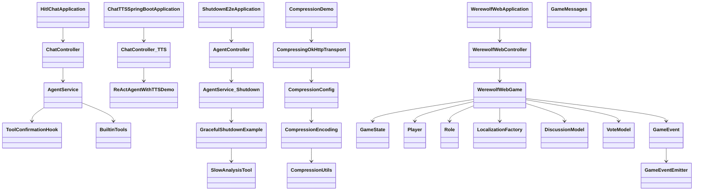
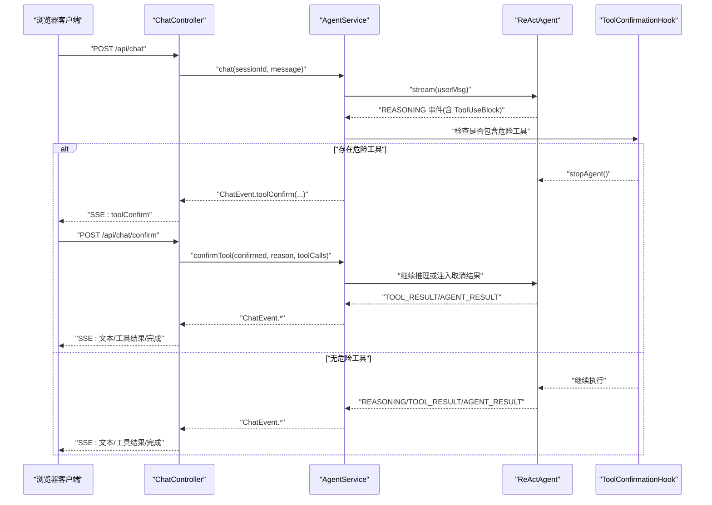
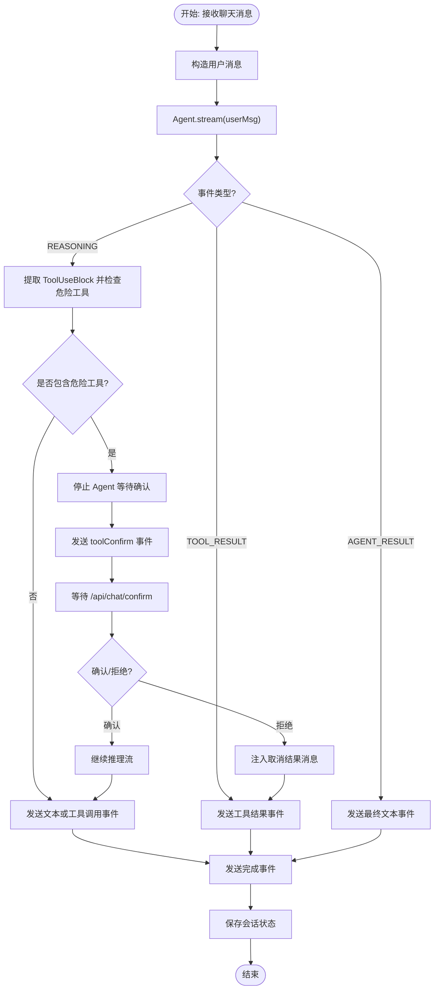
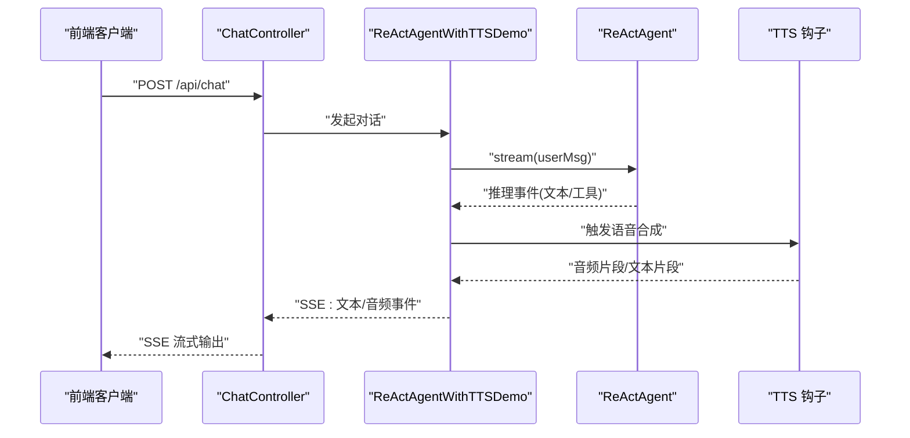
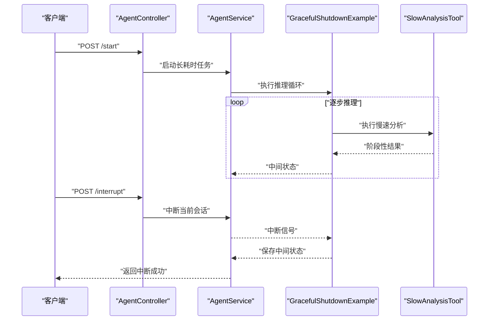
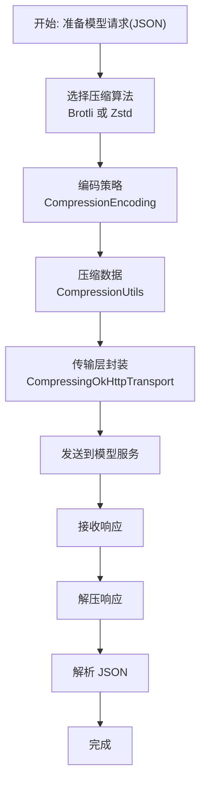
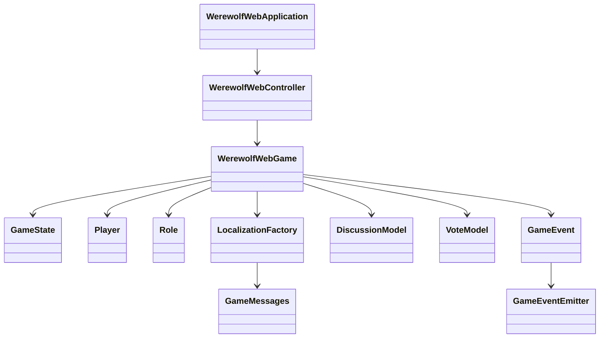
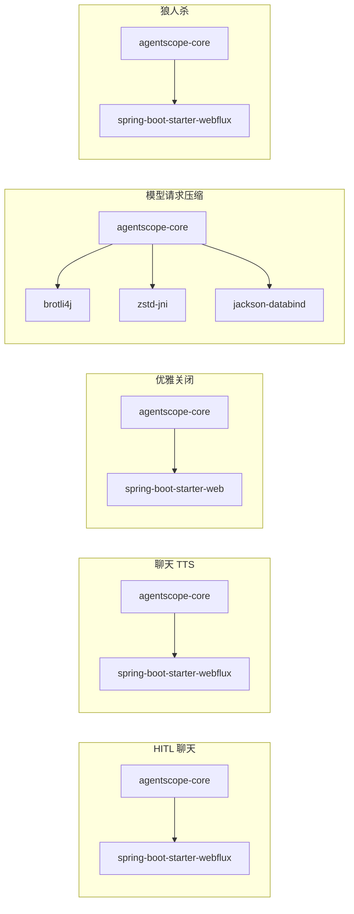

# 特殊场景示例

<cite>
**本文引用的文件**
- [agentscope-examples/hitl-chat/pom.xml](file://agentscope-examples/hitl-chat/pom.xml)
- [agentscope-examples/hitl-chat/src/main/java/io/agentscope/examples/hitlchat/HitlChatApplication.java](file://agentscope-examples/hitl-chat/src/main/java/io/agentscope/examples/hitlchat/HitlChatApplication.java)
- [agentscope-examples/hitl-chat/src/main/java/io/agentscope/examples/hitlchat/controller/ChatController.java](file://agentscope-examples/hitl-chat/src/main/java/io/agentscope/examples/hitlchat/controller/ChatController.java)
- [agentscope-examples/hitl-chat/src/main/java/io/agentscope/examples/hitlchat/service/AgentService.java](file://agentscope-examples/hitl-chat/src/main/java/io/agentscope/examples/hitlchat/service/AgentService.java)
- [agentscope-examples/hitl-chat/src/main/java/io/agentscope/examples/hitlchat/hook/ToolConfirmationHook.java](file://agentscope-examples/hitl-chat/src/main/java/io/agentscope/examples/hitlchat/hook/ToolConfirmationHook.java)
- [agentscope-examples/hitl-chat/src/main/java/io/agentscope/examples/hitlchat/tools/BuiltinTools.java](file://agentscope-examples/hitl-chat/src/main/java/io/agentscope/examples/hitlchat/tools/BuiltinTools.java)
- [agentscope-examples/chat-tts/pom.xml](file://agentscope-examples/chat-tts/pom.xml)
- [agentscope-examples/chat-tts/src/main/java/io/agentscope/examples/chattts/ChatController.java](file://agentscope-examples/chat-tts/src/main/java/io/agentscope/examples/chattts/ChatController.java)
- [agentscope-examples/chat-tts/src/main/java/io/agentscope/examples/chattts/ChatTTSSpringBootApplication.java](file://agentscope-examples/chat-tts/src/main/java/io/agentscope/examples/chattts/ChatTTSSpringBootApplication.java)
- [agentscope-examples/chat-tts/src/main/java/io/agentscope/examples/chattts/ReActAgentWithTTSDemo.java](file://agentscope-examples/chat-tts/src/main/java/io/agentscope/examples/chattts/ReActAgentWithTTSDemo.java)
- [agentscope-examples/graceful-shutdown/pom.xml](file://agentscope-examples/graceful-shutdown/pom.xml)
- [agentscope-examples/graceful-shutdown/src/main/java/io/agentscope/examples/shutdown/e2e/AgentController.java](file://agentscope-examples/graceful-shutdown/src/main/java/io/agentscope/examples/shutdown/e2e/AgentController.java)
- [agentscope-examples/graceful-shutdown/src/main/java/io/agentscope/examples/shutdown/e2e/AgentService.java](file://agentscope-examples/graceful-shutdown/src/main/java/io/agentscope/examples/shutdown/e2e/AgentService.java)
- [agentscope-examples/graceful-shutdown/src/main/java/io/agentscope/examples/shutdown/e2e/ShutdownE2eApplication.java](file://agentscope-examples/graceful-shutdown/src/main/java/io/agentscope/examples/shutdown/e2e/ShutdownE2eApplication.java)
- [agentscope-examples/graceful-shutdown/src/main/java/io/agentscope/examples/shutdown/smoke/GracefulShutdownExample.java](file://agentscope-examples/graceful-shutdown/src/main/java/io/agentscope/examples/shutdown/smoke/GracefulShutdownExample.java)
- [agentscope-examples/graceful-shutdown/src/main/java/io/agentscope/examples/shutdown/smoke/SlowAnalysisTool.java](file://agentscope-examples/graceful-shutdown/src/main/java/io/agentscope/examples/shutdown/smoke/SlowAnalysisTool.java)
- [agentscope-examples/model-request-compression/pom.xml](file://agentscope-examples/model-request-compression/pom.xml)
- [agentscope-examples/model-request-compression/src/main/java/io/agentscope/examples/compression/CompressionDemo.java](file://agentscope-examples/model-request-compression/src/main/java/io/agentscope/examples/compression/CompressionDemo.java)
- [agentscope-examples/model-request-compression/src/main/java/io/agentscope/examples/compression/extra/CompressingOkHttpTransport.java](file://agentscope-examples/model-request-compression/src/main/java/io/agentscope/examples/compression/extra/CompressingOkHttpTransport.java)
- [agentscope-examples/model-request-compression/src/main/java/io/agentscope/examples/compression/extra/CompressionConfig.java](file://agentscope-examples/model-request-compression/src/main/java/io/agentscope/examples/compression/extra/CompressionConfig.java)
- [agentscope-examples/model-request-compression/src/main/java/io/agentscope/examples/compression/extra/CompressionEncoding.java](file://agentscope-examples/model-request-compression/src/main/java/io/agentscope/examples/compression/extra/CompressionEncoding.java)
- [agentscope-examples/model-request-compression/src/main/java/io/agentscope/examples/compression/extra/CompressionUtils.java](file://agentscope-examples/model-request-compression/src/main/java/io/agentscope/examples/compression/extra/CompressionUtils.java)
- [agentscope-examples/werewolf/pom.xml](file://agentscope-examples/werewolf/pom.xml)
- [agentscope-examples/werewolf/src/main/java/io/agentscope/examples/werewolf/WerewolfWebApplication.java](file://agentscope-examples/werewolf/src/main/java/io/agentscope/examples/werewolf/WerewolfWebApplication.java)
- [agentscope-examples/werewolf/src/main/java/io/agentscope/examples/werewolf/entity/GameState.java](file://agentscope-examples/werewolf/src/main/java/io/agentscope/examples/werewolf/entity/GameState.java)
- [agentscope-examples/werewolf/src/main/java/io/agentscope/examples/werewolf/entity/Player.java](file://agentscope-examples/werewolf/src/main/java/io/agentscope/examples/werewolf/entity/Player.java)
- [agentscope-examples/werewolf/src/main/java/io/agentscope/examples/werewolf/entity/Role.java](file://agentscope-examples/werewolf/src/main/java/io/agentscope/examples/werewolf/entity/Role.java)
- [agentscope-examples/werewolf/src/main/java/io/agentscope/examples/werewolf/web/WerewolfWebController.java](file://agentscope-examples/werewolf/src/main/java/io/agentscope/examples/werewolf/web/WerewolfWebController.java)
- [agentscope-examples/werewolf/src/main/java/io/agentscope/examples/werewolf/web/GameEvent.java](file://agentscope-examples/werewolf/src/main/java/io/agentscope/examples/werewolf/web/GameEvent.java)
- [agentscope-examples/werewolf/src/main/java/io/agentscope/examples/werewolf/web/GameEventEmitter.java](file://agentscope-examples/werewolf/src/main/java/io/agentscope/examples/werewolf/web/GameEventEmitter.java)
- [agentscope-examples/werewolf/src/main/java/io/agentscope/examples/werewolf/web/GameEventType.java](file://agentscope-examples/werewolf/src/main/java/io/agentscope/examples/werewolf/web/GameEventType.java)
- [agentscope-examples/werewolf/src/main/java/io/agentscope/examples/werewolf/web/WerewolfWebGame.java](file://agentscope-examples/werewolf/src/main/java/io/agentscope/examples/werewolf/web/WerewolfWebGame.java)
- [agentscope-examples/werewolf/src/main/java/io/agentscope/examples/werewolf/localization/GameMessages.java](file://agentscope-examples/werewolf/src/main/java/io/agentscope/examples/werewolf/localization/GameMessages.java)
- [agentscope-examples/werewolf/src/main/java/io/agentscope/examples/werewolf/localization/LanguageConfig.java](file://agentscope-examples/werewolf/src/main/java/io/agentscope/examples/werewolf/localization/LanguageConfig.java)
- [agentscope-examples/werewolf/src/main/java/io/agentscope/examples/werewolf/localization/LocalizationFactory.java](file://agentscope-examples/werewolf/src/main/java/io/agentscope/examples/werewolf/localization/LocalizationFactory.java)
- [agentscope-examples/werewolf/src/main/java/io/agentscope/examples/werewolf/localization/MessageSourceGameMessages.java](file://agentscope-examples/werewolf/src/main/java/io/agentscope/examples/werewolf/localization/MessageSourceGameMessages.java)
- [agentscope-examples/werewolf/src/main/java/io/agentscope/examples/werewolf/localization/MessageSourceLanguageConfig.java](file://agentscope-examples/werewolf/src/main/java/io/agentscope/examples/werewolf/localization/MessageSourceLanguageConfig.java)
- [agentscope-examples/werewolf/src/main/java/io/agentscope/examples/werewolf/localization/MessageSourcePromptProvider.java](file://agentscope-examples/werewolf/src/main/java/io/agentscope/examples/werewolf/localization/MessageSourcePromptProvider.java)
- [agentscope-examples/werewolf/src/main/java/io/agentscope/examples/werewolf/localization/PromptProvider.java](file://agentscope-examples/werewolf/src/main/java/io/agentscope/examples/werewolf/localization/PromptProvider.java)
- [agentscope-examples/werewolf/src/main/java/io/agentscope/examples/werewolf/model/DiscussionModel.java](file://agentscope-examples/werewolf/src/main/java/io/agentscope/examples/werewolf/model/DiscussionModel.java)
- [agentscope-examples/werewolf/src/main/java/io/agentscope/examples/werewolf/model/HunterShootModel.java](file://agentscope-examples/werewolf/src/main/java/io/agentscope/examples/werewolf/model/HunterShootModel.java)
- [agentscope-examples/werewolf/src/main/java/io/agentscope/examples/werewolf/model/SeerCheckModel.java](file://agentscope-examples/werewolf/src/main/java/io/agentscope/examples/werewolf/model/SeerCheckModel.java)
- [agentscope-examples/werewolf/src/main/java/io/agentscope/examples/werewolf/model/VoteModel.java](file://agentscope-examples/werewolf/src/main/java/io/agentscope/examples/werewolf/model/VoteModel.java)
- [agentscope-examples/werewolf/src/main/java/io/agentscope/examples/werewolf/model/WitchHealModel.java](file://agentscope-examples/werewolf/src/main/java/io/agentscope/examples/werewolf/model/WitchHealModel.java)
- [agentscope-examples/werewolf/src/main/java/io/agentscope/examples/werewolf/model/WitchPoisonModel.java](file://agentscope-examples/werewolf/src/main/java/io/agentscope/examples/werewolf/model/WitchPoisonModel.java)
- [agentscope-examples/werewolf/src/main/java/io/agentscope/examples/werewolf/WerewolfGameConfig.java](file://agentscope-examples/werewolf/src/main/java/io/agentscope/examples/werewolf/WerewolfGameConfig.java)
- [agentscope-examples/werewolf/src/main/java/io/agentscope/examples/werewolf/WerewolfUtils.java](file://agentscope-examples/werewolf/src/main/java/io/agentscope/examples/werewolf/WerewolfUtils.java)
</cite>

## 目录
1. [引言](#引言)
2. [项目结构](#项目结构)
3. [核心组件](#核心组件)
4. [架构总览](#架构总览)
5. [详细组件分析](#详细组件分析)
6. [依赖分析](#依赖分析)
7. [性能考虑](#性能考虑)
8. [故障排除指南](#故障排除指南)
9. [结论](#结论)
10. [附录](#附录)

## 引言
本技术文档聚焦于 AgentScope Java 的五类特殊场景示例：人机交互（HITL）聊天、聊天与文本转语音（TTS）、优雅关闭、模型请求压缩以及狼人杀多人游戏。文档从系统架构、组件关系、数据流与处理逻辑出发，结合关键实现文件的路径与行号，提供可操作的配置指南、运行步骤、故障排除与性能优化建议，帮助开发者在复杂业务场景中快速落地。

## 项目结构
五个示例模块均位于 agentscope-examples 下，采用按功能分包的组织方式，并通过 Spring Boot 启动入口暴露 REST 接口或演示主流程。各模块的 Maven 配置与依赖在各自 pom.xml 中定义，便于独立构建与运行。

```mermaid
graph TB
subgraph "HITL 聊天示例"
HApp["HitlChatApplication<br/>启动类"]
HCtrl["ChatController<br/>REST 控制器"]
HAgent["AgentService<br/>会话与流式处理"]
HHook["ToolConfirmationHook<br/>危险工具拦截钩子"]
HTools["BuiltinTools<br/>内置工具集"]
end
subgraph "聊天 TTS 示例"
TApp["ChatTTSSpringBootApplication<br/>启动类"]
TCtrl["ChatController<br/>SSE 流式对话"]
TDemo["ReActAgentWithTTSDemo<br/>TTS 演示"]
end
subgraph "优雅关闭示例"
SApp["ShutdownE2eApplication<br/>启动类"]
SCtrl["AgentController<br/>控制端点"]
SService["AgentService<br/>服务层"]
SSmoke["GracefulShutdownExample<br/>优雅关闭示例"]
STool["SlowAnalysisTool<br/>慢速分析工具"]
end
subgraph "模型请求压缩示例"
CMain["CompressionDemo<br/>主程序"]
CTrans["CompressingOkHttpTransport<br/>传输层压缩"]
CConf["CompressionConfig<br/>压缩配置"]
CEnc["CompressionEncoding<br/>编码策略"]
CUtils["CompressionUtils<br/>压缩工具"]
end
subgraph "狼人杀游戏示例"
WApp["WerewolfWebApplication<br/>启动类"]
WCtrl["WerewolfWebController<br/>Web 控制器"]
WGame["WerewolfWebGame<br/>游戏主控"]
WState["GameState/Player/Role<br/>实体"]
WLoc["Localization*<br/>本地化与提示"]
WModel["DiscussionModel/VoteModel/*<br/>阶段模型"]
WEvt["GameEvent/GameEventEmitter<br/>事件系统"]
end
HApp --> HCtrl --> HAgent --> HHook
HAgent --> HTools
TApp --> TCtrl --> TDemo
SApp --> SCtrl --> SService --> SSmoke
SSmoke --> STool
CMain --> CTrans --> CConf --> CEnc --> CUtils
WApp --> WCtrl --> WGame --> WState
WGame --> WLoc --> WModel --> WEvt
```

**图表来源**
- [agentscope-examples/hitl-chat/src/main/java/io/agentscope/examples/hitlchat/HitlChatApplication.java:39-57](file://agentscope-examples/hitl-chat/src/main/java/io/agentscope/examples/hitlchat/HitlChatApplication.java#L39-L57)
- [agentscope-examples/hitl-chat/src/main/java/io/agentscope/examples/hitlchat/controller/ChatController.java:51-61](file://agentscope-examples/hitl-chat/src/main/java/io/agentscope/examples/hitlchat/controller/ChatController.java#L51-L61)
- [agentscope-examples/hitl-chat/src/main/java/io/agentscope/examples/hitlchat/service/AgentService.java:62-84](file://agentscope-examples/hitl-chat/src/main/java/io/agentscope/examples/hitlchat/service/AgentService.java#L62-L84)
- [agentscope-examples/hitl-chat/src/main/java/io/agentscope/examples/hitlchat/hook/ToolConfirmationHook.java:34-44](file://agentscope-examples/hitl-chat/src/main/java/io/agentscope/examples/hitlchat/hook/ToolConfirmationHook.java#L34-L44)
- [agentscope-examples/hitl-chat/src/main/java/io/agentscope/examples/hitlchat/tools/BuiltinTools.java:31-34](file://agentscope-examples/hitl-chat/src/main/java/io/agentscope/examples/hitlchat/tools/BuiltinTools.java#L31-L34)
- [agentscope-examples/chat-tts/src/main/java/io/agentscope/examples/chattts/ChatTTSSpringBootApplication.java](file://agentscope-examples/chat-tts/src/main/java/io/agentscope/examples/chattts/ChatTTSSpringBootApplication.java)
- [agentscope-examples/chat-tts/src/main/java/io/agentscope/examples/chattts/ChatController.java](file://agentscope-examples/chat-tts/src/main/java/io/agentscope/examples/chattts/ChatController.java)
- [agentscope-examples/chat-tts/src/main/java/io/agentscope/examples/chattts/ReActAgentWithTTSDemo.java](file://agentscope-examples/chat-tts/src/main/java/io/agentscope/examples/chattts/ReActAgentWithTTSDemo.java)
- [agentscope-examples/graceful-shutdown/src/main/java/io/agentscope/examples/shutdown/e2e/ShutdownE2eApplication.java](file://agentscope-examples/graceful-shutdown/src/main/java/io/agentscope/examples/shutdown/e2e/ShutdownE2eApplication.java)
- [agentscope-examples/graceful-shutdown/src/main/java/io/agentscope/examples/shutdown/e2e/AgentController.java](file://agentscope-examples/graceful-shutdown/src/main/java/io/agentscope/examples/shutdown/e2e/AgentController.java)
- [agentscope-examples/graceful-shutdown/src/main/java/io/agentscope/examples/shutdown/e2e/AgentService.java](file://agentscope-examples/graceful-shutdown/src/main/java/io/agentscope/examples/shutdown/e2e/AgentService.java)
- [agentscope-examples/graceful-shutdown/src/main/java/io/agentscope/examples/shutdown/smoke/GracefulShutdownExample.java](file://agentscope-examples/graceful-shutdown/src/main/java/io/agentscope/examples/shutdown/smoke/GracefulShutdownExample.java)
- [agentscope-examples/graceful-shutdown/src/main/java/io/agentscope/examples/shutdown/smoke/SlowAnalysisTool.java](file://agentscope-examples/graceful-shutdown/src/main/java/io/agentscope/examples/shutdown/smoke/SlowAnalysisTool.java)
- [agentscope-examples/model-request-compression/src/main/java/io/agentscope/examples/compression/CompressionDemo.java](file://agentscope-examples/model-request-compression/src/main/java/io/agentscope/examples/compression/CompressionDemo.java)
- [agentscope-examples/model-request-compression/src/main/java/io/agentscope/examples/compression/extra/CompressingOkHttpTransport.java](file://agentscope-examples/model-request-compression/src/main/java/io/agentscope/examples/compression/extra/CompressingOkHttpTransport.java)
- [agentscope-examples/model-request-compression/src/main/java/io/agentscope/examples/compression/extra/CompressionConfig.java](file://agentscope-examples/model-request-compression/src/main/java/io/agentscope/examples/compression/extra/CompressionConfig.java)
- [agentscope-examples/model-request-compression/src/main/java/io/agentscope/examples/compression/extra/CompressionEncoding.java](file://agentscope-examples/model-request-compression/src/main/java/io/agentscope/examples/compression/extra/CompressionEncoding.java)
- [agentscope-examples/model-request-compression/src/main/java/io/agentscope/examples/compression/extra/CompressionUtils.java](file://agentscope-examples/model-request-compression/src/main/java/io/agentscope/examples/compression/extra/CompressionUtils.java)
- [agentscope-examples/werewolf/src/main/java/io/agentscope/examples/werewolf/WerewolfWebApplication.java](file://agentscope-examples/werewolf/src/main/java/io/agentscope/examples/werewolf/WerewolfWebApplication.java)
- [agentscope-examples/werewolf/src/main/java/io/agentscope/examples/werewolf/web/WerewolfWebController.java](file://agentscope-examples/werewolf/src/main/java/io/agentscope/examples/werewolf/web/WerewolfWebController.java)
- [agentscope-examples/werewolf/src/main/java/io/agentscope/examples/werewolf/web/WerewolfWebGame.java](file://agentscope-examples/werewolf/src/main/java/io/agentscope/examples/werewolf/web/WerewolfWebGame.java)
- [agentscope-examples/werewolf/src/main/java/io/agentscope/examples/werewolf/entity/GameState.java](file://agentscope-examples/werewolf/src/main/java/io/agentscope/examples/werewolf/entity/GameState.java)
- [agentscope-examples/werewolf/src/main/java/io/agentscope/examples/werewolf/localization/GameMessages.java](file://agentscope-examples/werewolf/src/main/java/io/agentscope/examples/werewolf/localization/GameMessages.java)
- [agentscope-examples/werewolf/src/main/java/io/agentscope/examples/werewolf/model/DiscussionModel.java](file://agentscope-examples/werewolf/src/main/java/io/agentscope/examples/werewolf/model/DiscussionModel.java)
- [agentscope-examples/werewolf/src/main/java/io/agentscope/examples/werewolf/web/GameEvent.java](file://agentscope-examples/werewolf/src/main/java/io/agentscope/examples/werewolf/web/GameEvent.java)
- [agentscope-examples/werewolf/src/main/java/io/agentscope/examples/werewolf/web/GameEventEmitter.java](file://agentscope-examples/werewolf/src/main/java/io/agentscope/examples/werewolf/web/GameEventEmitter.java)

**章节来源**
- [agentscope-examples/hitl-chat/pom.xml:22-67](file://agentscope-examples/hitl-chat/pom.xml#L22-L67)
- [agentscope-examples/chat-tts/pom.xml:22-64](file://agentscope-examples/chat-tts/pom.xml#L22-L64)
- [agentscope-examples/graceful-shutdown/pom.xml:22-75](file://agentscope-examples/graceful-shutdown/pom.xml#L22-L75)
- [agentscope-examples/model-request-compression/pom.xml:34-74](file://agentscope-examples/model-request-compression/pom.xml#L34-L74)
- [agentscope-examples/werewolf/pom.xml:22-65](file://agentscope-examples/werewolf/pom.xml#L22-L65)

## 核心组件
- HITL 聊天：基于 Spring WebFlux 的 SSE 实时流式对话，支持工具调用前的人工确认、MCP 服务器动态管理、会话中断与持久化。
- 聊天 TTS：ReActAgent 与 TTS 钩子结合，前端通过 SSE 实时接收语音与文本输出。
- 优雅关闭：演示在长时间推理任务中如何安全中断、保存状态与资源回收。
- 模型请求压缩：在传输层引入 Brotli/Zstd 压缩，减少大体积 JSON 请求的网络开销。
- 狼人杀：多智能体 Web 游戏，包含本地化、阶段模型、事件发射与 Web 控制器。

**章节来源**
- [agentscope-examples/hitl-chat/src/main/java/io/agentscope/examples/hitlchat/controller/ChatController.java:51-61](file://agentscope-examples/hitl-chat/src/main/java/io/agentscope/examples/hitlchat/controller/ChatController.java#L51-L61)
- [agentscope-examples/hitl-chat/src/main/java/io/agentscope/examples/hitlchat/service/AgentService.java:62-84](file://agentscope-examples/hitl-chat/src/main/java/io/agentscope/examples/hitlchat/service/AgentService.java#L62-L84)
- [agentscope-examples/chat-tts/src/main/java/io/agentscope/examples/chattts/ChatController.java](file://agentscope-examples/chat-tts/src/main/java/io/agentscope/examples/chattts/ChatController.java)
- [agentscope-examples/graceful-shutdown/src/main/java/io/agentscope/examples/shutdown/smoke/GracefulShutdownExample.java](file://agentscope-examples/graceful-shutdown/src/main/java/io/agentscope/examples/shutdown/smoke/GracefulShutdownExample.java)
- [agentscope-examples/model-request-compression/src/main/java/io/agentscope/examples/compression/CompressionDemo.java](file://agentscope-examples/model-request-compression/src/main/java/io/agentscope/examples/compression/CompressionDemo.java)
- [agentscope-examples/werewolf/src/main/java/io/agentscope/examples/werewolf/web/WerewolfWebController.java](file://agentscope-examples/werewolf/src/main/java/io/agentscope/examples/werewolf/web/WerewolfWebController.java)

## 架构总览
下图展示各示例模块的关键类与交互关系，突出“控制器-服务-模型/钩子/工具”的分层与“事件/流式响应”的数据通路。

**图表来源**
- [agentscope-examples/hitl-chat/src/main/java/io/agentscope/examples/hitlchat/HitlChatApplication.java:39-57](file://agentscope-examples/hitl-chat/src/main/java/io/agentscope/examples/hitlchat/HitlChatApplication.java#L39-L57)
- [agentscope-examples/hitl-chat/src/main/java/io/agentscope/examples/hitlchat/controller/ChatController.java:51-61](file://agentscope-examples/hitl-chat/src/main/java/io/agentscope/examples/hitlchat/controller/ChatController.java#L51-L61)
- [agentscope-examples/hitl-chat/src/main/java/io/agentscope/examples/hitlchat/service/AgentService.java:62-84](file://agentscope-examples/hitl-chat/src/main/java/io/agentscope/examples/hitlchat/service/AgentService.java#L62-L84)
- [agentscope-examples/hitl-chat/src/main/java/io/agentscope/examples/hitlchat/hook/ToolConfirmationHook.java:34-44](file://agentscope-examples/hitl-chat/src/main/java/io/agentscope/examples/hitl-chat/hook/ToolConfirmationHook.java#L34-L44)
- [agentscope-examples/hitl-chat/src/main/java/io/agentscope/examples/hitlchat/tools/BuiltinTools.java:31-34](file://agentscope-examples/hitl-chat/src/main/java/io/agentscope/examples/hitlchat/tools/BuiltinTools.java#L31-L34)
- [agentscope-examples/chat-tts/src/main/java/io/agentscope/examples/chattts/ChatTTSSpringBootApplication.java](file://agentscope-examples/chat-tts/src/main/java/io/agentscope/examples/chattts/ChatTTSSpringBootApplication.java)
- [agentscope-examples/chat-tts/src/main/java/io/agentscope/examples/chattts/ChatController.java](file://agentscope-examples/chat-tts/src/main/java/io/agentscope/examples/chattts/ChatController.java)
- [agentscope-examples/chat-tts/src/main/java/io/agentscope/examples/chattts/ReActAgentWithTTSDemo.java](file://agentscope-examples/chat-tts/src/main/java/io/agentscope/examples/chattts/ReActAgentWithTTSDemo.java)
- [agentscope-examples/graceful-shutdown/src/main/java/io/agentscope/examples/shutdown/e2e/ShutdownE2eApplication.java](file://agentscope-examples/graceful-shutdown/src/main/java/io/agentscope/examples/shutdown/e2e/ShutdownE2eApplication.java)
- [agentscope-examples/graceful-shutdown/src/main/java/io/agentscope/examples/shutdown/e2e/AgentController.java](file://agentscope-examples/graceful-shutdown/src/main/java/io/agentscope/examples/shutdown/e2e/AgentController.java)
- [agentscope-examples/graceful-shutdown/src/main/java/io/agentscope/examples/shutdown/e2e/AgentService.java](file://agentscope-examples/graceful-shutdown/src/main/java/io/agentscope/examples/shutdown/e2e/AgentService.java)
- [agentscope-examples/graceful-shutdown/src/main/java/io/agentscope/examples/shutdown/smoke/GracefulShutdownExample.java](file://agentscope-examples/graceful-shutdown/src/main/java/io/agentscope/examples/shutdown/smoke/GracefulShutdownExample.java)
- [agentscope-examples/graceful-shutdown/src/main/java/io/agentscope/examples/shutdown/smoke/SlowAnalysisTool.java](file://agentscope-examples/graceful-shutdown/src/main/java/io/agentscope/examples/shutdown/smoke/SlowAnalysisTool.java)
- [agentscope-examples/model-request-compression/src/main/java/io/agentscope/examples/compression/CompressionDemo.java](file://agentscope-examples/model-request-compression/src/main/java/io/agentscope/examples/compression/CompressionDemo.java)
- [agentscope-examples/model-request-compression/src/main/java/io/agentscope/examples/compression/extra/CompressingOkHttpTransport.java](file://agentscope-examples/model-request-compression/src/main/java/io/agentscope/examples/compression/extra/CompressingOkHttpTransport.java)
- [agentscope-examples/model-request-compression/src/main/java/io/agentscope/examples/compression/extra/CompressionConfig.java](file://agentscope-examples/model-request-compression/src/main/java/io/agentscope/examples/compression/extra/CompressionConfig.java)
- [agentscope-examples/model-request-compression/src/main/java/io/agentscope/examples/compression/extra/CompressionEncoding.java](file://agentscope-examples/model-request-compression/src/main/java/io/agentscope/examples/compression/extra/CompressionEncoding.java)
- [agentscope-examples/model-request-compression/src/main/java/io/agentscope/examples/compression/extra/CompressionUtils.java](file://agentscope-examples/model-request-compression/src/main/java/io/agentscope/examples/compression/extra/CompressionUtils.java)
- [agentscope-examples/werewolf/src/main/java/io/agentscope/examples/werewolf/WerewolfWebApplication.java](file://agentscope-examples/werewolf/src/main/java/io/agentscope/examples/werewolf/WerewolfWebApplication.java)
- [agentscope-examples/werewolf/src/main/java/io/agentscope/examples/werewolf/web/WerewolfWebController.java](file://agentscope-examples/werewolf/src/main/java/io/agentscope/examples/werewolf/web/WerewolfWebController.java)
- [agentscope-examples/werewolf/src/main/java/io/agentscope/examples/werewolf/web/WerewolfWebGame.java](file://agentscope-examples/werewolf/src/main/java/io/agentscope/examples/werewolf/web/WerewolfWebGame.java)
- [agentscope-examples/werewolf/src/main/java/io/agentscope/examples/werewolf/entity/GameState.java](file://agentscope-examples/werewolf/src/main/java/io/agentscope/examples/werewolf/entity/GameState.java)
- [agentscope-examples/werewolf/src/main/java/io/agentscope/examples/werewolf/localization/GameMessages.java](file://agentscope-examples/werewolf/src/main/java/io/agentscope/examples/werewolf/localization/GameMessages.java)
- [agentscope-examples/werewolf/src/main/java/io/agentscope/examples/werewolf/model/DiscussionModel.java](file://agentscope-examples/werewolf/src/main/java/io/agentscope/examples/werewolf/model/DiscussionModel.java)
- [agentscope-examples/werewolf/src/main/java/io/agentscope/examples/werewolf/web/GameEvent.java](file://agentscope-examples/werewolf/src/main/java/io/agentscope/examples/werewolf/web/GameEvent.java)
- [agentscope-examples/werewolf/src/main/java/io/agentscope/examples/werewolf/web/GameEventEmitter.java](file://agentscope-examples/werewolf/src/main/java/io/agentscope/examples/werewolf/web/GameEventEmitter.java)

## 详细组件分析

### 人机交互（HITL）聊天示例
该示例通过 SSE 流式返回聊天事件，支持以下关键能力：
- 工具调用审核：当推理阶段检测到危险工具时，自动暂停并等待人工确认。
- 动态 MCP 服务器管理：运行时添加/移除 MCP 服务器并同步到工具箱。
- 会话中断：通过取消 SSE 连接触发中断，或主动中断指定会话。
- 会话持久化：使用内存会话存储 Agent 状态，请求完成后保存。

**图表来源**
- [agentscope-examples/hitl-chat/src/main/java/io/agentscope/examples/hitlchat/controller/ChatController.java:71-103](file://agentscope-examples/hitl-chat/src/main/java/io/agentscope/examples/hitlchat/controller/ChatController.java#L71-L103)
- [agentscope-examples/hitl-chat/src/main/java/io/agentscope/examples/hitlchat/service/AgentService.java:140-163](file://agentscope-examples/hitl-chat/src/main/java/io/agentscope/examples/hitlchat/service/AgentService.java#L140-L163)
- [agentscope-examples/hitl-chat/src/main/java/io/agentscope/examples/hitlchat/hook/ToolConfirmationHook.java:95-114](file://agentscope-examples/hitl-chat/src/main/java/io/agentscope/examples/hitl-chat/hook/ToolConfirmationHook.java#L95-L114)

**图表来源**
- [agentscope-examples/hitl-chat/src/main/java/io/agentscope/examples/hitlchat/service/AgentService.java:258-311](file://agentscope-examples/hitl-chat/src/main/java/io/agentscope/examples/hitlchat/service/AgentService.java#L258-L311)

关键实现要点与路径：
- 启动类与环境变量：[启动类:42-56](file://agentscope-examples/hitl-chat/src/main/java/io/agentscope/examples/hitlchat/HitlChatApplication.java#L42-L56)，API 密钥与模型名通过属性注入。
- 控制器端点：SSE 对话、工具确认、MCP 管理、危险工具设置等。[控制器:51-222](file://agentscope-examples/hitl-chat/src/main/java/io/agentscope/examples/hitlchat/controller/ChatController.java#L51-L222)
- 会话与流式处理：Agent 创建、状态加载/保存、中断处理、事件转换。[服务层:62-354](file://agentscope-examples/hitl-chat/src/main/java/io/agentscope/examples/hitlchat/service/AgentService.java#L62-L354)
- 危险工具拦截钩子：在推理后事件中判断并停止 Agent。[钩子:34-116](file://agentscope-examples/hitl-chat/src/main/java/io/agentscope/examples/hitlchat/hook/ToolConfirmationHook.java#L34-L116)
- 内置工具：时间查询、随机数生成等。[工具:31-67](file://agentscope-examples/hitl-chat/src/main/java/io/agentscope/examples/hitlchat/tools/BuiltinTools.java#L31-L67)

**章节来源**
- [agentscope-examples/hitl-chat/src/main/java/io/agentscope/examples/hitlchat/HitlChatApplication.java:21-56](file://agentscope-examples/hitl-chat/src/main/java/io/agentscope/examples/hitlchat/HitlChatApplication.java#L21-L56)
- [agentscope-examples/hitl-chat/src/main/java/io/agentscope/examples/hitlchat/controller/ChatController.java:51-222](file://agentscope-examples/hitl-chat/src/main/java/io/agentscope/examples/hitlchat/controller/ChatController.java#L51-L222)
- [agentscope-examples/hitl-chat/src/main/java/io/agentscope/examples/hitlchat/service/AgentService.java:62-354](file://agentscope-examples/hitl-chat/src/main/java/io/agentscope/examples/hitlchat/service/AgentService.java#L62-L354)
- [agentscope-examples/hitl-chat/src/main/java/io/agentscope/examples/hitlchat/hook/ToolConfirmationHook.java:34-116](file://agentscope-examples/hitl-chat/src/main/java/io/agentscope/examples/hitl-chat/hook/ToolConfirmationHook.java#L34-L116)
- [agentscope-examples/hitl-chat/src/main/java/io/agentscope/examples/hitlchat/tools/BuiltinTools.java:31-67](file://agentscope-examples/hitl-chat/src/main/java/io/agentscope/examples/hitlchat/tools/BuiltinTools.java#L31-L67)

### 聊天 TTS 示例
该示例在 ReActAgent 的推理过程中集成 TTS 钩子，前端通过 SSE 实时接收文本与语音片段，实现“边说边聊”的体验。

**图表来源**
- [agentscope-examples/chat-tts/src/main/java/io/agentscope/examples/chattts/ChatController.java](file://agentscope-examples/chat-tts/src/main/java/io/agentscope/examples/chattts/ChatController.java)
- [agentscope-examples/chat-tts/src/main/java/io/agentscope/examples/chattts/ReActAgentWithTTSDemo.java](file://agentscope-examples/chat-tts/src/main/java/io/agentscope/examples/chattts/ReActAgentWithTTSDemo.java)

实现要点与路径：
- 启动类与装配：[启动类](file://agentscope-examples/chat-tts/src/main/java/io/agentscope/examples/chattts/ChatTTSSpringBootApplication.java)
- SSE 控制器：[控制器](file://agentscope-examples/chat-tts/src/main/java/io/agentscope/examples/chattts/ChatController.java)
- TTS 演示：ReActAgent 与 TTS 集成的演示入口。[演示类](file://agentscope-examples/chat-tts/src/main/java/io/agentscope/examples/chattts/ReActAgentWithTTSDemo.java)

**章节来源**
- [agentscope-examples/chat-tts/src/main/java/io/agentscope/examples/chattts/ChatTTSSpringBootApplication.java](file://agentscope-examples/chat-tts/src/main/java/io/agentscope/examples/chattts/ChatTTSSpringBootApplication.java)
- [agentscope-examples/chat-tts/src/main/java/io/agentscope/examples/chattts/ChatController.java](file://agentscope-examples/chat-tts/src/main/java/io/agentscope/examples/chattts/ChatController.java)
- [agentscope-examples/chat-tts/src/main/java/io/agentscope/examples/chattts/ReActAgentWithTTSDemo.java](file://agentscope-examples/chat-tts/src/main/java/io/agentscope/examples/chattts/ReActAgentWithTTSDemo.java)

### 优雅关闭示例
该示例演示在长时间推理任务中如何优雅地中断、保存状态与释放资源，避免数据丢失与资源泄漏。

**图表来源**
- [agentscope-examples/graceful-shutdown/src/main/java/io/agentscope/examples/shutdown/e2e/AgentController.java](file://agentscope-examples/graceful-shutdown/src/main/java/io/agentscope/examples/shutdown/e2e/AgentController.java)
- [agentscope-examples/graceful-shutdown/src/main/java/io/agentscope/examples/shutdown/e2e/AgentService.java](file://agentscope-examples/graceful-shutdown/src/main/java/io/agentscope/examples/shutdown/e2e/AgentService.java)
- [agentscope-examples/graceful-shutdown/src/main/java/io/agentscope/examples/shutdown/smoke/GracefulShutdownExample.java](file://agentscope-examples/graceful-shutdown/src/main/java/io/agentscope/examples/shutdown/smoke/GracefulShutdownExample.java)
- [agentscope-examples/graceful-shutdown/src/main/java/io/agentscope/examples/shutdown/smoke/SlowAnalysisTool.java](file://agentscope-examples/graceful-shutdown/src/main/java/io/agentscope/examples/shutdown/smoke/SlowAnalysisTool.java)

实现要点与路径：
- 启动类与装配：[启动类](file://agentscope-examples/graceful-shutdown/src/main/java/io/agentscope/examples/shutdown/e2e/ShutdownE2eApplication.java)
- 控制端点与服务：[控制器](file://agentscope-examples/graceful-shutdown/src/main/java/io/agentscope/examples/shutdown/e2e/AgentController.java)，[服务](file://agentscope-examples/graceful-shutdown/src/main/java/io/agentscope/examples/shutdown/e2e/AgentService.java)
- 优雅关闭示例与慢速工具：[示例](file://agentscope-examples/graceful-shutdown/src/main/java/io/agentscope/examples/shutdown/smoke/GracefulShutdownExample.java)，[工具](file://agentscope-examples/graceful-shutdown/src/main/java/io/agentscope/examples/shutdown/smoke/SlowAnalysisTool.java)

**章节来源**
- [agentscope-examples/graceful-shutdown/src/main/java/io/agentscope/examples/shutdown/e2e/ShutdownE2eApplication.java](file://agentscope-examples/graceful-shutdown/src/main/java/io/agentscope/examples/shutdown/e2e/ShutdownE2eApplication.java)
- [agentscope-examples/graceful-shutdown/src/main/java/io/agentscope/examples/shutdown/e2e/AgentController.java](file://agentscope-examples/graceful-shutdown/src/main/java/io/agentscope/examples/shutdown/e2e/AgentController.java)
- [agentscope-examples/graceful-shutdown/src/main/java/io/agentscope/examples/shutdown/e2e/AgentService.java](file://agentscope-examples/graceful-shutdown/src/main/java/io/agentscope/examples/shutdown/e2e/AgentService.java)
- [agentscope-examples/graceful-shutdown/src/main/java/io/agentscope/examples/shutdown/smoke/GracefulShutdownExample.java](file://agentscope-examples/graceful-shutdown/src/main/java/io/agentscope/examples/shutdown/smoke/GracefulShutdownExample.java)
- [agentscope-examples/graceful-shutdown/src/main/java/io/agentscope/examples/shutdown/smoke/SlowAnalysisTool.java](file://agentscope-examples/graceful-shutdown/src/main/java/io/agentscope/examples/shutdown/smoke/SlowAnalysisTool.java)

### 模型请求压缩示例
该示例在传输层引入 Brotli 与 Zstd 压缩，减少大体积 JSON 请求的带宽占用，同时保持解码性能与兼容性。

**图表来源**
- [agentscope-examples/model-request-compression/src/main/java/io/agentscope/examples/compression/CompressionDemo.java](file://agentscope-examples/model-request-compression/src/main/java/io/agentscope/examples/compression/CompressionDemo.java)
- [agentscope-examples/model-request-compression/src/main/java/io/agentscope/examples/compression/extra/CompressingOkHttpTransport.java](file://agentscope-examples/model-request-compression/src/main/java/io/agentscope/examples/compression/extra/CompressingOkHttpTransport.java)
- [agentscope-examples/model-request-compression/src/main/java/io/agentscope/examples/compression/extra/CompressionConfig.java](file://agentscope-examples/model-request-compression/src/main/java/io/agentscope/examples/compression/extra/CompressionConfig.java)
- [agentscope-examples/model-request-compression/src/main/java/io/agentscope/examples/compression/extra/CompressionEncoding.java](file://agentscope-examples/model-request-compression/src/main/java/io/agentscope/examples/compression/extra/CompressionEncoding.java)
- [agentscope-examples/model-request-compression/src/main/java/io/agentscope/examples/compression/extra/CompressionUtils.java](file://agentscope-examples/model-request-compression/src/main/java/io/agentscope/examples/compression/extra/CompressionUtils.java)

实现要点与路径：
- 主程序入口与参数配置：[主程序](file://agentscope-examples/model-request-compression/src/main/java/io/agentscope/examples/compression/CompressionDemo.java)
- 传输层压缩封装：[传输](file://agentscope-examples/model-request-compression/src/main/java/io/agentscope/examples/compression/extra/CompressingOkHttpTransport.java)
- 压缩配置与编码策略：[配置](file://agentscope-examples/model-request-compression/src/main/java/io/agentscope/examples/compression/extra/CompressionConfig.java)，[编码](file://agentscope-examples/model-request-compression/src/main/java/io/agentscope/examples/compression/extra/CompressionEncoding.java)
- 压缩工具与算法选择：[工具](file://agentscope-examples/model-request-compression/src/main/java/io/agentscope/examples/compression/extra/CompressionUtils.java)

**章节来源**
- [agentscope-examples/model-request-compression/src/main/java/io/agentscope/examples/compression/CompressionDemo.java](file://agentscope-examples/model-request-compression/src/main/java/io/agentscope/examples/compression/CompressionDemo.java)
- [agentscope-examples/model-request-compression/src/main/java/io/agentscope/examples/compression/extra/CompressingOkHttpTransport.java](file://agentscope-examples/model-request-compression/src/main/java/io/agentscope/examples/compression/extra/CompressingOkHttpTransport.java)
- [agentscope-examples/model-request-compression/src/main/java/io/agentscope/examples/compression/extra/CompressionConfig.java](file://agentscope-examples/model-request-compression/src/main/java/io/agentscope/examples/compression/extra/CompressionConfig.java)
- [agentscope-examples/model-request-compression/src/main/java/io/agentscope/examples/compression/extra/CompressionEncoding.java](file://agentscope-examples/model-request-compression/src/main/java/io/agentscope/examples/compression/extra/CompressionEncoding.java)
- [agentscope-examples/model-request-compression/src/main/java/io/agentscope/examples/compression/extra/CompressionUtils.java](file://agentscope-examples/model-request-compression/src/main/java/io/agentscope/examples/compression/extra/CompressionUtils.java)

### 狼人杀游戏示例
该示例是一个多智能体 Web 游戏，包含角色分配、讨论、投票、夜间行动等阶段，通过事件系统驱动状态流转，并提供本地化支持。

**图表来源**
- [agentscope-examples/werewolf/src/main/java/io/agentscope/examples/werewolf/WerewolfWebApplication.java](file://agentscope-examples/werewolf/src/main/java/io/agentscope/examples/werewolf/WerewolfWebApplication.java)
- [agentscope-examples/werewolf/src/main/java/io/agentscope/examples/werewolf/web/WerewolfWebController.java](file://agentscope-examples/werewolf/src/main/java/io/agentscope/examples/werewolf/web/WerewolfWebController.java)
- [agentscope-examples/werewolf/src/main/java/io/agentscope/examples/werewolf/web/WerewolfWebGame.java](file://agentscope-examples/werewolf/src/main/java/io/agentscope/examples/werewolf/web/WerewolfWebGame.java)
- [agentscope-examples/werewolf/src/main/java/io/agentscope/examples/werewolf/entity/GameState.java](file://agentscope-examples/werewolf/src/main/java/io/agentscope/examples/werewolf/entity/GameState.java)
- [agentscope-examples/werewolf/src/main/java/io/agentscope/examples/werewolf/entity/Player.java](file://agentscope-examples/werewolf/src/main/java/io/agentscope/examples/werewolf/entity/Player.java)
- [agentscope-examples/werewolf/src/main/java/io/agentscope/examples/werewolf/entity/Role.java](file://agentscope-examples/werewolf/src/main/java/io/agentscope/examples/werewolf/entity/Role.java)
- [agentscope-examples/werewolf/src/main/java/io/agentscope/examples/werewolf/localization/LocalizationFactory.java](file://agentscope-examples/werewolf/src/main/java/io/agentscope/examples/werewolf/localization/LocalizationFactory.java)
- [agentscope-examples/werewolf/src/main/java/io/agentscope/examples/werewolf/localization/GameMessages.java](file://agentscope-examples/werewolf/src/main/java/io/agentscope/examples/werewolf/localization/GameMessages.java)
- [agentscope-examples/werewolf/src/main/java/io/agentscope/examples/werewolf/model/DiscussionModel.java](file://agentscope-examples/werewolf/src/main/java/io/agentscope/examples/werewolf/model/DiscussionModel.java)
- [agentscope-examples/werewolf/src/main/java/io/agentscope/examples/werewolf/model/VoteModel.java](file://agentscope-examples/werewolf/src/main/java/io/agentscope/examples/werewolf/model/VoteModel.java)
- [agentscope-examples/werewolf/src/main/java/io/agentscope/examples/werewolf/web/GameEvent.java](file://agentscope-examples/werewolf/src/main/java/io/agentscope/examples/werewolf/web/GameEvent.java)
- [agentscope-examples/werewolf/src/main/java/io/agentscope/examples/werewolf/web/GameEventEmitter.java](file://agentscope-examples/werewolf/src/main/java/io/agentscope/examples/werewolf/web/GameEventEmitter.java)

实现要点与路径：
- 启动类与 Web 入口：[启动类](file://agentscope-examples/werewolf/src/main/java/io/agentscope/examples/werewolf/WerewolfWebApplication.java)
- Web 控制器与游戏主控：[控制器](file://agentscope-examples/werewolf/src/main/java/io/agentscope/examples/werewolf/web/WerewolfWebController.java)，[游戏](file://agentscope-examples/werewolf/src/main/java/io/agentscope/examples/werewolf/web/WerewolfWebGame.java)
- 实体与阶段模型：[GameState/Player/Role](file://agentscope-examples/werewolf/src/main/java/io/agentscope/examples/werewolf/entity/GameState.java)，[DiscussionModel/VoteModel](file://agentscope-examples/werewolf/src/main/java/io/agentscope/examples/werewolf/model/DiscussionModel.java)
- 本地化与提示：[LocalizationFactory/GameMessages](file://agentscope-examples/werewolf/src/main/java/io/agentscope/examples/werewolf/localization/LocalizationFactory.java)
- 事件系统：[GameEvent/GameEventEmitter](file://agentscope-examples/werewolf/src/main/java/io/agentscope/examples/werewolf/web/GameEvent.java)

**章节来源**
- [agentscope-examples/werewolf/src/main/java/io/agentscope/examples/werewolf/WerewolfWebApplication.java](file://agentscope-examples/werewolf/src/main/java/io/agentscope/examples/werewolf/WerewolfWebApplication.java)
- [agentscope-examples/werewolf/src/main/java/io/agentscope/examples/werewolf/web/WerewolfWebController.java](file://agentscope-examples/werewolf/src/main/java/io/agentscope/examples/werewolf/web/WerewolfWebController.java)
- [agentscope-examples/werewolf/src/main/java/io/agentscope/examples/werewolf/web/WerewolfWebGame.java](file://agentscope-examples/werewolf/src/main/java/io/agentscope/examples/werewolf/web/WerewolfWebGame.java)
- [agentscope-examples/werewolf/src/main/java/io/agentscope/examples/werewolf/entity/GameState.java](file://agentscope-examples/werewolf/src/main/java/io/agentscope/examples/werewolf/entity/GameState.java)
- [agentscope-examples/werewolf/src/main/java/io/agentscope/examples/werewolf/entity/Player.java](file://agentscope-examples/werewolf/src/main/java/io/agentscope/examples/werewolf/entity/Player.java)
- [agentscope-examples/werewolf/src/main/java/io/agentscope/examples/werewolf/entity/Role.java](file://agentscope-examples/werewolf/src/main/java/io/agentscope/examples/werewolf/entity/Role.java)
- [agentscope-examples/werewolf/src/main/java/io/agentscope/examples/werewolf/localization/LocalizationFactory.java](file://agentscope-examples/werewolf/src/main/java/io/agentscope/examples/werewolf/localization/LocalizationFactory.java)
- [agentscope-examples/werewolf/src/main/java/io/agentscope/examples/werewolf/localization/GameMessages.java](file://agentscope-examples/werewolf/src/main/java/io/agentscope/examples/werewolf/localization/GameMessages.java)
- [agentscope-examples/werewolf/src/main/java/io/agentscope/examples/werewolf/model/DiscussionModel.java](file://agentscope-examples/werewolf/src/main/java/io/agentscope/examples/werewolf/model/DiscussionModel.java)
- [agentscope-examples/werewolf/src/main/java/io/agentscope/examples/werewolf/web/GameEvent.java](file://agentscope-examples/werewolf/src/main/java/io/agentscope/examples/werewolf/web/GameEvent.java)
- [agentscope-examples/werewolf/src/main/java/io/agentscope/examples/werewolf/web/GameEventEmitter.java](file://agentscope-examples/werewolf/src/main/java/io/agentscope/examples/werewolf/web/GameEventEmitter.java)

## 依赖分析
- HITL 聊天：依赖 agentscope-core 与 Spring WebFlux；通过 InMemorySession 与 ReActAgent 实现流式对话与会话持久化。
- 聊天 TTS：依赖 agentscope-core 与 Spring WebFlux；ReActAgent 与 TTS 钩子配合实现边说边聊。
- 优雅关闭：依赖 agentscope-core 与 Spring Web；演示中断与状态保存。
- 模型请求压缩：依赖 agentscope-core、brotli4j、zstd-jni 与 jackson-databind；通过 CompressingOkHttpTransport 封装压缩传输。
- 狼人杀：依赖 agentscope-core 与 Spring WebFlux；多实体与模型构成游戏状态机。

**图表来源**
- [agentscope-examples/hitl-chat/pom.xml:56-67](file://agentscope-examples/hitl-chat/pom.xml#L56-L67)
- [agentscope-examples/chat-tts/pom.xml:55-64](file://agentscope-examples/chat-tts/pom.xml#L55-L64)
- [agentscope-examples/graceful-shutdown/pom.xml:54-75](file://agentscope-examples/graceful-shutdown/pom.xml#L54-L75)
- [agentscope-examples/model-request-compression/pom.xml:34-74](file://agentscope-examples/model-request-compression/pom.xml#L34-L74)
- [agentscope-examples/werewolf/pom.xml:56-65](file://agentscope-examples/werewolf/pom.xml#L56-L65)

**章节来源**
- [agentscope-examples/hitl-chat/pom.xml:56-67](file://agentscope-examples/hitl-chat/pom.xml#L56-L67)
- [agentscope-examples/chat-tts/pom.xml:55-64](file://agentscope-examples/chat-tts/pom.xml#L55-L64)
- [agentscope-examples/graceful-shutdown/pom.xml:54-75](file://agentscope-examples/graceful-shutdown/pom.xml#L54-L75)
- [agentscope-examples/model-request-compression/pom.xml:34-74](file://agentscope-examples/model-request-compression/pom.xml#L34-L74)
- [agentscope-examples/werewolf/pom.xml:56-65](file://agentscope-examples/werewolf/pom.xml#L56-L65)

## 性能考虑
- 流式传输与背压：HITL 聊天与聊天 TTS 使用 WebFlux 的 Flux/SSE，注意下游消费者速率与背压策略，避免内存压力。
- 会话状态与并发：AgentService 使用并发缓存保存运行中的 Agent，需确保会话键唯一且在 finally 中正确保存状态。
- 压缩策略权衡：压缩比与 CPU 开销需要根据请求大小与网络条件权衡，优先对大体积 JSON 生效。
- 事件风暴与限流：狼人杀事件发射频率高，建议在 GameEventEmitter 上增加限流与缓冲队列。
- 中断与资源回收：优雅关闭示例强调中断后保存状态与释放资源，避免长时间任务导致的资源泄漏。

[本节为通用指导，无需列出具体文件来源]

## 故障排除指南
- API 密钥与模型配置
  - HITL 聊天需要设置 DashScope API 密钥与模型名，否则模型调用会失败。[启动类:42-56](file://agentscope-examples/hitl-chat/src/main/java/io/agentscope/examples/hitlchat/HitlChatApplication.java#L42-L56)，[服务层属性注入:66-70](file://agentscope-examples/hitl-chat/src/main/java/io/agentscope/examples/hitlchat/service/AgentService.java#L66-L70)
- SSE 连接中断
  - 若前端断开连接，HITL 聊天会触发中断；若未生效，检查控制器中断端点与 AgentService 的中断逻辑。[控制器中断:123-127](file://agentscope-examples/hitl-chat/src/main/java/io/agentscope/examples/hitlchat/controller/ChatController.java#L123-L127)，[服务中断:235-242](file://agentscope-examples/hitl-chat/src/main/java/io/agentscope/examples/hitlchat/service/AgentService.java#L235-L242)
- 工具确认未触发
  - 确认危险工具列表已正确设置，且推理阶段确实包含对应 ToolUseBlock。[钩子危险工具设置:69-74](file://agentscope-examples/hitl-chat/src/main/java/io/agentscope/examples/hitlchat/hook/ToolConfirmationHook.java#L69-L74)，[事件转换逻辑:268-278](file://agentscope-examples/hitl-chat/src/main/java/io/agentscope/examples/hitlchat/service/AgentService.java#L268-L278)
- 压缩传输异常
  - 检查压缩算法选择与编码策略是否匹配服务端期望；确认 CompressingOkHttpTransport 正确封装请求头与内容。[传输封装](file://agentscope-examples/model-request-compression/src/main/java/io/agentscope/examples/compression/extra/CompressingOkHttpTransport.java)，[编码策略](file://agentscope-examples/model-request-compression/src/main/java/io/agentscope/examples/compression/extra/CompressionEncoding.java)
- 优雅关闭未生效
  - 确保在长耗时任务中定期检查中断状态并在捕获中断后保存中间状态。[示例](file://agentscope-examples/graceful-shutdown/src/main/java/io/agentscope/examples/shutdown/smoke/GracefulShutdownExample.java)，[慢速工具](file://agentscope-examples/graceful-shutdown/src/main/java/io/agentscope/examples/shutdown/smoke/SlowAnalysisTool.java)

**章节来源**
- [agentscope-examples/hitl-chat/src/main/java/io/agentscope/examples/hitlchat/HitlChatApplication.java:42-56](file://agentscope-examples/hitl-chat/src/main/java/io/agentscope/examples/hitlchat/HitlChatApplication.java#L42-L56)
- [agentscope-examples/hitl-chat/src/main/java/io/agentscope/examples/hitlchat/service/AgentService.java:66-70](file://agentscope-examples/hitl-chat/src/main/java/io/agentscope/examples/hitl-chat/service/AgentService.java#L66-L70)
- [agentscope-examples/hitl-chat/src/main/java/io/agentscope/examples/hitlchat/controller/ChatController.java:123-127](file://agentscope-examples/hitl-chat/src/main/java/io/agentscope/examples/hitl-chat/controller/ChatController.java#L123-L127)
- [agentscope-examples/hitl-chat/src/main/java/io/agentscope/examples/hitlchat/service/AgentService.java:235-242](file://agentscope-examples/hitl-chat/src/main/java/io/agentscope/examples/hitl-chat/service/AgentService.java#L235-L242)
- [agentscope-examples/hitl-chat/src/main/java/io/agentscope/examples/hitlchat/hook/ToolConfirmationHook.java:69-74](file://agentscope-examples/hitl-chat/src/main/java/io/agentscope/examples/hitl-chat/hook/ToolConfirmationHook.java#L69-L74)
- [agentscope-examples/hitl-chat/src/main/java/io/agentscope/examples/hitlchat/service/AgentService.java:268-278](file://agentscope-examples/hitl-chat/src/main/java/io/agentscope/examples/hitl-chat/service/AgentService.java#L268-L278)
- [agentscope-examples/model-request-compression/src/main/java/io/agentscope/examples/compression/extra/CompressingOkHttpTransport.java](file://agentscope-examples/model-request-compression/src/main/java/io/agentscope/examples/compression/extra/CompressingOkHttpTransport.java)
- [agentscope-examples/model-request-compression/src/main/java/io/agentscope/examples/compression/extra/CompressionEncoding.java](file://agentscope-examples/model-request-compression/src/main/java/io/agentscope/examples/compression/extra/CompressionEncoding.java)
- [agentscope-examples/graceful-shutdown/src/main/java/io/agentscope/examples/shutdown/smoke/GracefulShutdownExample.java](file://agentscope-examples/graceful-shutdown/src/main/java/io/agentscope/examples/shutdown/smoke/GracefulShutdownExample.java)
- [agentscope-examples/graceful-shutdown/src/main/java/io/agentscope/examples/shutdown/smoke/SlowAnalysisTool.java](file://agentscope-examples/graceful-shutdown/src/main/java/io/agentscope/examples/shutdown/smoke/SlowAnalysisTool.java)

## 结论
上述五个特殊场景示例覆盖了人机协作、实时语音、优雅中断、传输优化与多人游戏等典型需求。通过清晰的模块划分、事件驱动的数据流与可扩展的钩子/工具体系，开发者可以在此基础上快速定制与扩展业务能力。建议在生产环境中关注流式背压、压缩策略权衡、事件风暴治理与中断恢复等关键点，以获得稳定与高性能的用户体验。

[本节为总结性内容，无需列出具体文件来源]

## 附录
- 运行与测试步骤（以模块为单位）
  - HITL 聊天
    - 设置环境变量：DASHSCOPE_API_KEY（参考[启动类:42-56](file://agentscope-examples/hitl-chat/src/main/java/io/agentscope/examples/hitlchat/HitlChatApplication.java#L42-L56)）
    - 构建与运行：mvn spring-boot:run（参考[pom:69-84](file://agentscope-examples/hitl-chat/pom.xml#L69-L84)）
    - 访问地址：http://localhost:8080（参考[启动类打印信息:47-56](file://agentscope-examples/hitl-chat/src/main/java/io/agentscope/examples/hitlchat/HitlChatApplication.java#L47-L56)）
  - 聊天 TTS
    - 构建与运行：mvn spring-boot:run（参考[pom:66-82](file://agentscope-examples/chat-tts/pom.xml#L66-L82)）
    - 访问地址：同上（参考[启动类](file://agentscope-examples/chat-tts/src/main/java/io/agentscope/examples/chattts/ChatTTSSpringBootApplication.java)）
  - 优雅关闭
    - 构建与运行：mvn spring-boot:run（参考[pom:77-92](file://agentscope-examples/graceful-shutdown/pom.xml#L77-L92)）
    - 参考端点：/start 与 /interrupt（参考[控制器](file://agentscope-examples/graceful-shutdown/src/main/java/io/agentscope/examples/shutdown/e2e/AgentController.java)）
  - 模型请求压缩
    - 构建与运行：mvn exec:java（参考[pom:76-86](file://agentscope-examples/model-request-compression/pom.xml#L76-L86)）
    - 查看压缩效果与日志输出（参考[主程序](file://agentscope-examples/model-request-compression/src/main/java/io/agentscope/examples/compression/CompressionDemo.java)）
  - 狼人杀
    - 构建与运行：mvn spring-boot:run（参考[pom:76-92](file://agentscope-examples/werewolf/pom.xml#L76-L92)）
    - 访问地址：http://localhost:8080（参考[启动类](file://agentscope-examples/werewolf/src/main/java/io/agentscope/examples/werewolf/WerewolfWebApplication.java)）

- 配置项与默认值
  - HITL 聊天：DashScope API 密钥与模型名（参考[服务层属性:66-70](file://agentscope-examples/hitl-chat/src/main/java/io/agentscope/examples/hitlchat/service/AgentService.java#L66-L70)）
  - 聊天 TTS：ReActAgent 默认配置（参考[演示类](file://agentscope-examples/chat-tts/src/main/java/io/agentscope/examples/chattts/ReActAgentWithTTSDemo.java)）
  - 优雅关闭：中断与状态保存策略（参考[示例](file://agentscope-examples/graceful-shutdown/src/main/java/io/agentscope/examples/shutdown/smoke/GracefulShutdownExample.java)）
  - 模型请求压缩：Brotli/Zstd 算法与编码策略（参考[编码](file://agentscope-examples/model-request-compression/src/main/java/io/agentscope/examples/compression/extra/CompressionEncoding.java)）
  - 狼人杀：本地化与阶段模型（参考[LocalizationFactory](file://agentscope-examples/werewolf/src/main/java/io/agentscope/examples/werewolf/localization/LocalizationFactory.java)）

**章节来源**
- [agentscope-examples/hitl-chat/pom.xml:69-84](file://agentscope-examples/hitl-chat/pom.xml#L69-L84)
- [agentscope-examples/hitl-chat/src/main/java/io/agentscope/examples/hitlchat/HitlChatApplication.java:42-56](file://agentscope-examples/hitl-chat/src/main/java/io/agentscope/examples/hitlchat/HitlChatApplication.java#L42-L56)
- [agentscope-examples/hitl-chat/src/main/java/io/agentscope/examples/hitlchat/service/AgentService.java:66-70](file://agentscope-examples/hitl-chat/src/main/java/io/agentscope/examples/hitlchat/service/AgentService.java#L66-L70)
- [agentscope-examples/chat-tts/pom.xml:66-82](file://agentscope-examples/chat-tts/pom.xml#L66-L82)
- [agentscope-examples/chat-tts/src/main/java/io/agentscope/examples/chattts/ChatTTSSpringBootApplication.java](file://agentscope-examples/chat-tts/src/main/java/io/agentscope/examples/chattts/ChatTTSSpringBootApplication.java)
- [agentscope-examples/graceful-shutdown/pom.xml:77-92](file://agentscope-examples/graceful-shutdown/pom.xml#L77-L92)
- [agentscope-examples/graceful-shutdown/src/main/java/io/agentscope/examples/shutdown/e2e/AgentController.java](file://agentscope-examples/graceful-shutdown/src/main/java/io/agentscope/examples/shutdown/e2e/AgentController.java)
- [agentscope-examples/graceful-shutdown/src/main/java/io/agentscope/examples/shutdown/smoke/GracefulShutdownExample.java](file://agentscope-examples/graceful-shutdown/src/main/java/io/agentscope/examples/shutdown/smoke/GracefulShutdownExample.java)
- [agentscope-examples/model-request-compression/pom.xml:76-86](file://agentscope-examples/model-request-compression/pom.xml#L76-L86)
- [agentscope-examples/model-request-compression/src/main/java/io/agentscope/examples/compression/CompressionDemo.java](file://agentscope-examples/model-request-compression/src/main/java/io/agentscope/examples/compression/CompressionDemo.java)
- [agentscope-examples/model-request-compression/src/main/java/io/agentscope/examples/compression/extra/CompressionEncoding.java](file://agentscope-examples/model-request-compression/src/main/java/io/agentscope/examples/compression/extra/CompressionEncoding.java)
- [agentscope-examples/werewolf/pom.xml:76-92](file://agentscope-examples/werewolf/pom.xml#L76-L92)
- [agentscope-examples/werewolf/src/main/java/io/agentscope/examples/werewolf/WerewolfWebApplication.java](file://agentscope-examples/werewolf/src/main/java/io/agentscope/examples/werewolf/WerewolfWebApplication.java)
- [agentscope-examples/werewolf/src/main/java/io/agentscope/examples/werewolf/localization/LocalizationFactory.java](file://agentscope-examples/werewolf/src/main/java/io/agentscope/examples/werewolf/localization/LocalizationFactory.java)