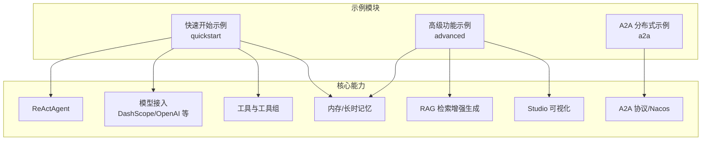
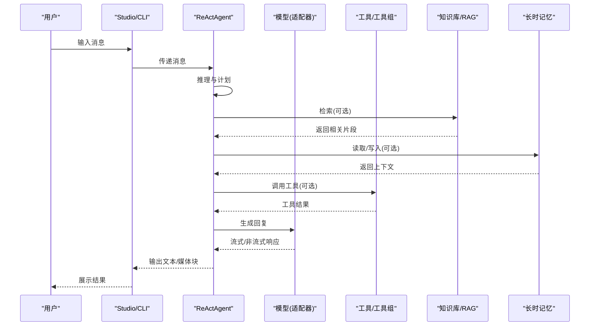
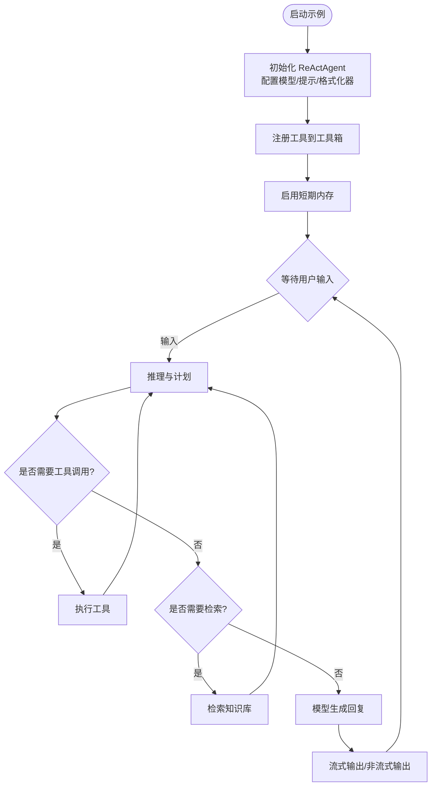
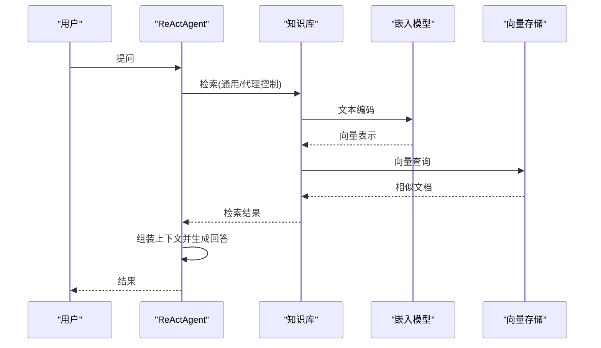
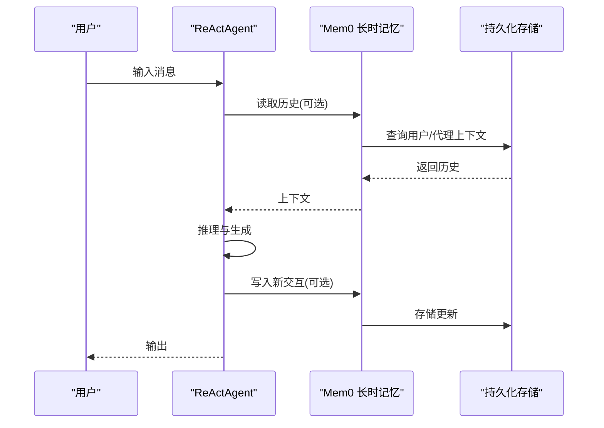
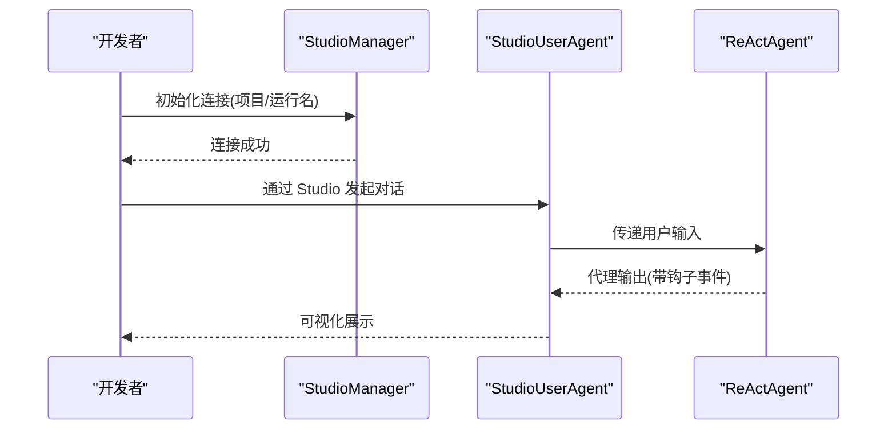
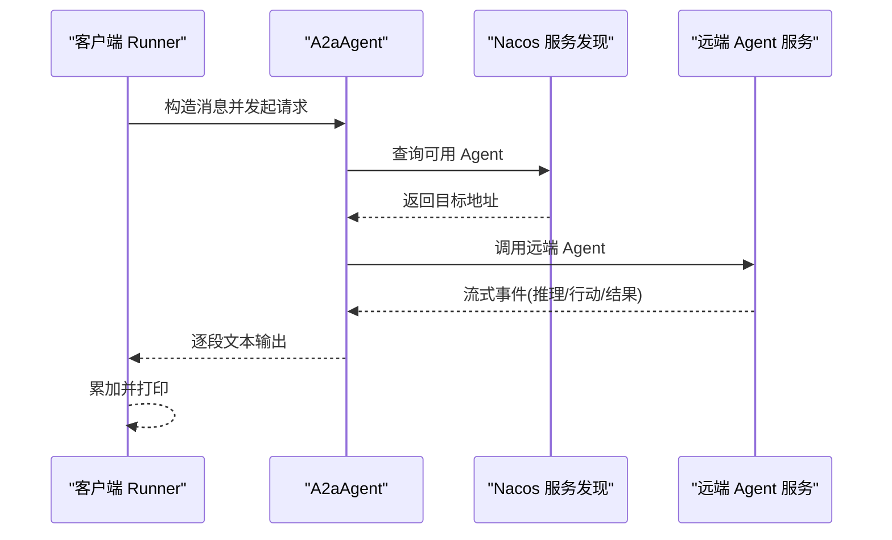
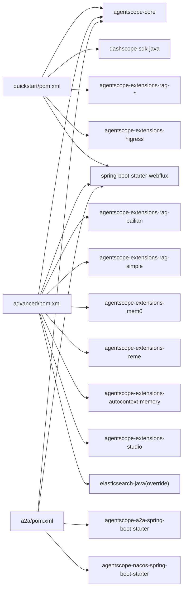

# 示例与最佳实践

<cite>
**本文引用的文件**
- [README.md](file://README.md)
- [agentscope-examples/README.md](file://agentscope-examples/README.md)
- [agentscope-examples/quickstart/pom.xml](file://agentscope-examples/quickstart/pom.xml)
- [agentscope-examples/advanced/pom.xml](file://agentscope-examples/advanced/pom.xml)
- [agentscope-examples/a2a/pom.xml](file://agentscope-examples/a2a/pom.xml)
- [agentscope-examples/advanced/src/main/java/io/agentscope/examples/advanced/RAGExample.java](file://agentscope-examples/advanced/src/main/java/io/agentscope/examples/advanced/RAGExample.java)
- [agentscope-examples/advanced/src/main/java/io/agentscope/examples/advanced/BailianRAGExample.java](file://agentscope-examples/advanced/src/main/java/io/agentscope/examples/advanced/BailianRAGExample.java)
- [agentscope-examples/advanced/src/main/java/io/agentscope/examples/advanced/Mem0Example.java](file://agentscope-examples/advanced/src/main/java/io/agentscope/examples/advanced/Mem0Example.java)
- [agentscope-examples/advanced/src/main/java/io/agentscope/examples/advanced/StudioExample.java](file://agentscope-examples/advanced/src/main/java/io/agentscope/examples/advanced/StudioExample.java)
- [agentscope-examples/a2a/src/main/java/io/agentscope/examples/a2a/A2aAgentExampleRunner.java](file://agentscope-examples/a2a/src/main/java/io/agentscope/examples/a2a/A2aAgentExampleRunner.java)
</cite>

## 目录
1. [简介](#简介)
2. [项目结构](#项目结构)
3. [核心组件](#核心组件)
4. [架构总览](#架构总览)
5. [详细组件分析](#详细组件分析)
6. [依赖分析](#依赖分析)
7. [性能考量](#性能考量)
8. [故障排除指南](#故障排除指南)
9. [结论](#结论)
10. [附录](#附录)

## 简介
本文件面向 AgentScope Java 示例与最佳实践，系统化梳理框架能力、示例项目功能特性与使用场景，并深入解析快速开始示例的实现原理与关键配置；同时阐述高级功能示例（多智能体协作、RAG 集成、长时记忆、Studio 可视化等）的设计思路与架构模式，提供完整的代码解析与运行指南，总结最佳实践（性能优化、错误处理、安全与可维护性），并给出从原型到生产的部署建议与常见问题排查。

## 项目结构
示例模块按“基础能力演示”“高级功能集成”“协议与分布式”三大类组织，便于循序渐进学习与工程化落地：
- 快速开始示例：聚焦 ReActAgent 基础用法、模型接入、消息格式化、会话持久化、钩子监控与中断恢复等核心路径
- 高级功能示例：覆盖 RAG（通用/代理控制）、多种向量存储与知识库、Mem0 长时记忆、Studio 可视化调试、自动上下文记忆等
- 协议与分布式示例：A2A 协议（Agent-to-Agent）与服务发现（Nacos）集成，支持跨服务调用与分布式协作

图示来源
- [agentscope-examples/quickstart/pom.xml:56-112](file://agentscope-examples/quickstart/pom.xml#L56-L112)
- [agentscope-examples/advanced/pom.xml:62-110](file://agentscope-examples/advanced/pom.xml#L62-L110)
- [agentscope-examples/a2a/pom.xml:48-65](file://agentscope-examples/a2a/pom.xml#L48-L65)

章节来源
- [agentscope-examples/README.md:1-406](file://agentscope-examples/README.md#L1-L406)
- [agentscope-examples/quickstart/pom.xml:1-115](file://agentscope-examples/quickstart/pom.xml#L1-L115)
- [agentscope-examples/advanced/pom.xml:1-113](file://agentscope-examples/advanced/pom.xml#L1-L113)
- [agentscope-examples/a2a/pom.xml:1-67](file://agentscope-examples/a2a/pom.xml#L1-L67)

## 核心组件
- ReActAgent：采用“推理-行动”范式，结合工具调用与记忆，实现动态任务规划与执行
- 模型接入：内置 DashScope、Gemini、Anthropic、Ollama 等适配器，统一请求与响应格式
- 工具体系：注解驱动的工具定义、工具组管理、元工具（如重置装备工具组）实现自适应工具选择
- 记忆系统：短期内存与长时记忆（含 Mem0、AutoContext、Bailian 等后端）
- RAG：通用模式（内置注入）与代理控制模式（由代理自主检索），支持多种向量存储与知识库
- 观测与可视化：Hook 生命周期回调、流式输出、Studio 远程调试与可视化
- 分布式协作：A2A 协议与 Nacos 服务发现，实现跨进程/跨服务的智能体互操作

章节来源
- [README.md:28-71](file://README.md#L28-L71)

## 架构总览
下图展示典型示例运行时的组件交互：用户通过命令行或 Studio 发起对话，ReActAgent 负责推理与工具调用，必要时触发 RAG 检索或长时记忆读写，最终以流式方式返回结果。

图示来源
- [agentscope-examples/advanced/src/main/java/io/agentscope/examples/advanced/RAGExample.java:154-189](file://agentscope-examples/advanced/src/main/java/io/agentscope/examples/advanced/RAGExample.java#L154-L189)
- [agentscope-examples/advanced/src/main/java/io/agentscope/examples/advanced/Mem0Example.java:51-74](file://agentscope-examples/advanced/src/main/java/io/agentscope/examples/advanced/Mem0Example.java#L51-L74)
- [agentscope-examples/advanced/src/main/java/io/agentscope/examples/advanced/StudioExample.java:75-102](file://agentscope-examples/advanced/src/main/java/io/agentscope/examples/advanced/StudioExample.java#L75-L102)

## 详细组件分析

### 快速开始示例（核心能力入门）
- 功能要点
  - 创建 ReActAgent 并配置系统提示、模型与消息格式化器
  - 使用内存式短期记忆与工具注册，完成一次交互式问答
  - 支持 Hook 回调观察执行过程，以及中断/恢复机制
- 关键配置
  - 模型：DashScope Chat 模型，支持流式输出与思维块开关
  - 工具：通过注解定义工具方法并注册到工具箱
  - 记忆：InMemoryMemory 提供会话内上下文保持
- 运行方式
  - 在示例根目录执行 Maven 命令启动对应示例主类
  - 可设置环境变量或交互输入 API Key

图示来源
- [agentscope-examples/README.md:35-46](file://agentscope-examples/README.md#L35-L46)

章节来源
- [agentscope-examples/README.md:322-356](file://agentscope-examples/README.md#L322-L356)

### 高级功能示例一：RAG 集成（通用与代理控制）
- 设计思路
  - 通用模式：在构建 Agent 时直接注入知识库与检索配置，系统自动在生成前注入检索到的知识
  - 代理控制模式：Agent 自主决定何时调用检索工具，提升可控性与透明度
- 架构模式
  - 知识抽取与分片：文本阅读器负责将长文本切分为可嵌入的段落
  - 向量存储：支持内存向量库与外部数据库（示例中使用 DashScope 文本嵌入与内存向量存储）
  - 检索配置：限制返回数量与相似度阈值，平衡召回质量与性能
- 运行指南
  - 准备 DashScope API Key
  - 运行示例主类，按提示输入问题，观察检索注入与回答生成过程

图示来源
- [agentscope-examples/advanced/src/main/java/io/agentscope/examples/advanced/RAGExample.java:154-189](file://agentscope-examples/advanced/src/main/java/io/agentscope/examples/advanced/RAGExample.java#L154-L189)
- [agentscope-examples/advanced/src/main/java/io/agentscope/examples/advanced/BailianRAGExample.java:52-71](file://agentscope-examples/advanced/src/main/java/io/agentscope/examples/advanced/BailianRAGExample.java#L52-L71)

章节来源
- [agentscope-examples/advanced/src/main/java/io/agentscope/examples/advanced/RAGExample.java:1-232](file://agentscope-examples/advanced/src/main/java/io/agentscope/examples/advanced/RAGExample.java#L1-L232)
- [agentscope-examples/advanced/src/main/java/io/agentscope/examples/advanced/BailianRAGExample.java:1-85](file://agentscope-examples/advanced/src/main/java/io/agentscope/examples/advanced/BailianRAGExample.java#L1-L85)

### 高级功能示例二：长时记忆（Mem0）
- 设计思路
  - 将用户与代理的对话历史持久化到 Mem0，支持跨会话的连续对话与个性化
  - 通过静态控制模式，由代理显式决定何时读取/写入长时记忆
- 架构模式
  - 配置 Mem0 API 基础地址、密钥与 API 类型（平台托管或自托管）
  - 在 Agent 构建阶段注入 Mem0 长时记忆实例
- 运行指南
  - 设置 MEM0 相关环境变量
  - 运行示例，持续对话直至输入 exit

图示来源
- [agentscope-examples/advanced/src/main/java/io/agentscope/examples/advanced/Mem0Example.java:51-74](file://agentscope-examples/advanced/src/main/java/io/agentscope/examples/advanced/Mem0Example.java#L51-L74)

章节来源
- [agentscope-examples/advanced/src/main/java/io/agentscope/examples/advanced/Mem0Example.java:1-100](file://agentscope-examples/advanced/src/main/java/io/agentscope/examples/advanced/Mem0Example.java#L1-L100)

### 高级功能示例三：Studio 可视化与远程调试
- 设计思路
  - 通过 StudioManager 初始化 Studio 客户端与 WebSocket，实现实时观测与远程交互
  - 使用 StudioUserAgent 替代本地用户代理，实现可视化调试与多人协作
- 架构模式
  - Studio 管理器负责连接、项目与运行名配置
  - 用户输入与代理输出均通过 Studio 展示，便于 QA 与产品演示
- 运行指南
  - 启动本地 Studio（默认端口 3000），运行示例，打开浏览器访问 Studio 页面进行交互

图示来源
- [agentscope-examples/advanced/src/main/java/io/agentscope/examples/advanced/StudioExample.java:36-102](file://agentscope-examples/advanced/src/main/java/io/agentscope/examples/advanced/StudioExample.java#L36-L102)

章节来源
- [agentscope-examples/advanced/src/main/java/io/agentscope/examples/advanced/StudioExample.java:1-105](file://agentscope-examples/advanced/src/main/java/io/agentscope/examples/advanced/StudioExample.java#L1-L105)

### 高级功能示例四：A2A 协议与分布式协作
- 设计思路
  - 使用 A2aAgent 发起对远端 Agent 的请求，基于 A2A 协议与服务发现（如 Nacos）
  - 支持流式事件处理，逐段输出远端 Agent 的推理与行动片段
- 架构模式
  - 客户端侧：A2aAgentExampleRunner 负责读取用户输入、构造消息并订阅流式事件
  - 服务端侧：通过 A2A Starter 与 Nacos 注册能力，暴露可被发现的 Agent 能力
- 运行指南
  - 启动服务端（注册 Agent 到 Nacos）
  - 运行客户端示例，输入问题并观察远端 Agent 的逐步输出

图示来源
- [agentscope-examples/a2a/src/main/java/io/agentscope/examples/a2a/A2aAgentExampleRunner.java:78-100](file://agentscope-examples/a2a/src/main/java/io/agentscope/examples/a2a/A2aAgentExampleRunner.java#L78-L100)
- [agentscope-examples/a2a/pom.xml:48-65](file://agentscope-examples/a2a/pom.xml#L48-L65)

章节来源
- [agentscope-examples/a2a/src/main/java/io/agentscope/examples/a2a/A2aAgentExampleRunner.java:1-102](file://agentscope-examples/a2a/src/main/java/io/agentscope/examples/a2a/A2aAgentExampleRunner.java#L1-L102)
- [agentscope-examples/a2a/pom.xml:1-67](file://agentscope-examples/a2a/pom.xml#L1-L67)

## 依赖分析
- 快速开始示例
  - 依赖 agentscope-core 核心库，以及 DashScope SDK、RAG 扩展、Higress 网关扩展、Spring WebFlux 等
- 高级功能示例
  - 引入多种 RAG 扩展（Bailian、Dify、RagFlow、Haystack、Simple）、Mem0、AutoContext、Reme、Studio、Elasticsearch 客户端等
- A2A 示例
  - 引入 A2A Spring Boot Starter 与 Nacos Spring Boot Starter，配合 Web 启动器

图示来源
- [agentscope-examples/quickstart/pom.xml:56-112](file://agentscope-examples/quickstart/pom.xml#L56-L112)
- [agentscope-examples/advanced/pom.xml:62-110](file://agentscope-examples/advanced/pom.xml#L62-L110)
- [agentscope-examples/a2a/pom.xml:48-65](file://agentscope-examples/a2a/pom.xml#L48-L65)

章节来源
- [agentscope-examples/quickstart/pom.xml:1-115](file://agentscope-examples/quickstart/pom.xml#L1-L115)
- [agentscope-examples/advanced/pom.xml:1-113](file://agentscope-examples/advanced/pom.xml#L1-L113)
- [agentscope-examples/a2a/pom.xml:1-67](file://agentscope-examples/a2a/pom.xml#L1-L67)

## 性能考量
- 流式输出与非阻塞
  - 使用 WebFlux 与 Hook 流式事件，降低首字节延迟，提升用户体验
- 模型与检索优化
  - 合理设置检索阈值与返回条数，避免过度上下文导致的延迟与成本上升
  - 对长文本进行分片与去噪，提高嵌入质量与检索效率
- 内存与缓存
  - 短期内存适合单会话上下文，长时记忆需注意序列化与并发一致性
- 并发与资源
  - 控制工具调用并发度，避免阻塞与资源争用
- 编译与冷启动
  - 在云原生环境中可利用 GraalVM 原生镜像以缩短冷启动时间（参考框架说明）

## 故障排除指南
- API 密钥问题
  - 现象：提示未找到 DashScope API Key 或交互式输入失败
  - 处理：设置环境变量或按示例交互输入；确保密钥有效且有配额
- MCP 服务器连接失败
  - 现象：MCP 示例无法连接外部工具服务器
  - 处理：安装对应 MCP 服务器（如文件系统/版本控制），确保网络连通
- 编译错误
  - 现象：示例编译报错
  - 处理：先在根目录构建并安装核心库，再编译示例模块
- RAG 检索异常
  - 现象：嵌入编码或向量存储查询失败
  - 处理：检查嵌入维度与向量存储维度一致，确认网络可达与凭据正确
- A2A 服务发现失败
  - 现象：客户端无法发现远端 Agent
  - 处理：确认 Nacos 地址与命名空间配置正确，服务端已注册

章节来源
- [agentscope-examples/README.md:357-386](file://agentscope-examples/README.md#L357-L386)

## 结论
AgentScope Java 示例体系覆盖从基础到高级的全栈能力：ReAct 推理、工具与工具组、短期/长时记忆、RAG 检索、Studio 可视化、A2A 分布式协作。通过本指南，读者可以快速上手并掌握关键配置与运行方式，结合最佳实践实现从原型到生产的稳定交付。

## 附录
- 快速开始运行步骤
  - 在示例根目录执行 Maven 命令启动对应示例主类
  - 可通过环境变量或交互输入 API Key
- 常用调试技巧
  - 开启 SLF4J 调试日志级别，观察 Hook 事件与工具调用轨迹
  - 使用 Studio 实时查看代理推理与行动片段
- 生产部署建议
  - 使用 Spring Boot/Starter 管理依赖与配置
  - 采用 A2A+Nacos 实现微服务化智能体编排
  - 结合长时记忆与 RAG 提升业务上下文服务能力
  - 通过 Hook 与观测系统保障可观测性与可运维性