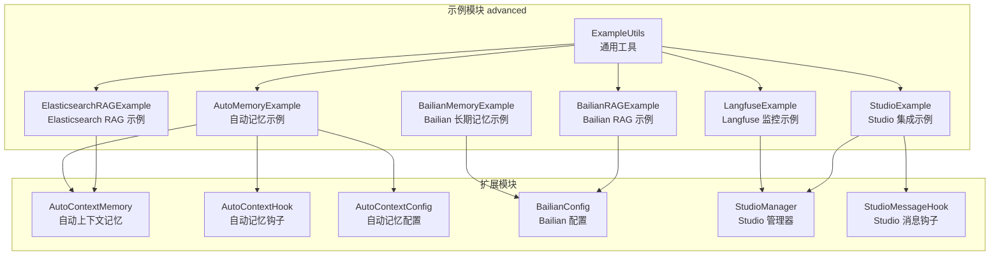
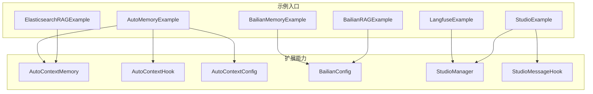
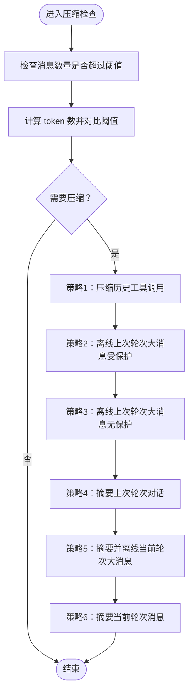
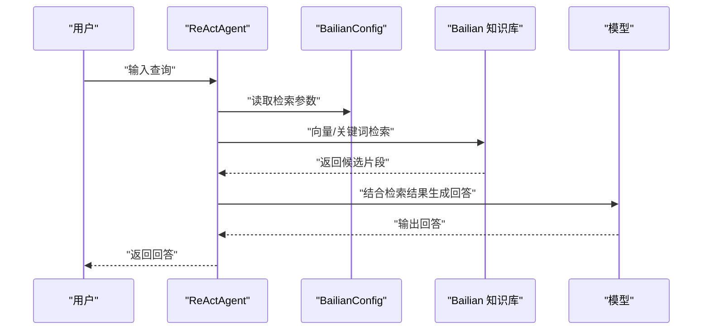
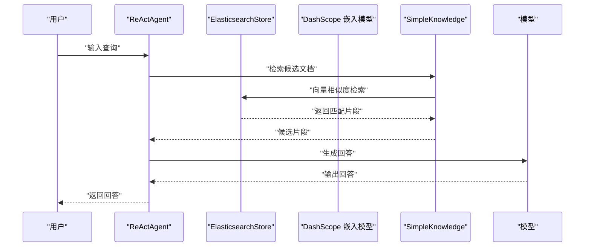
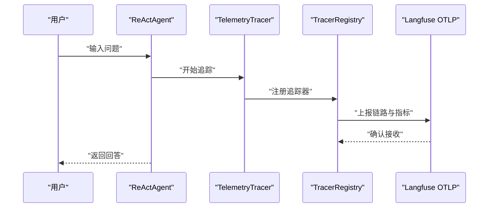
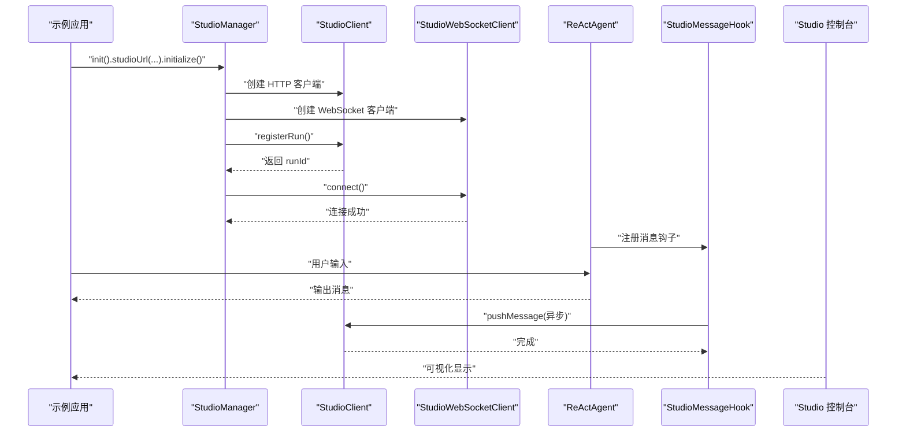
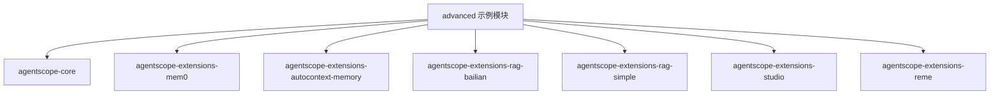

# 高级功能示例

<cite>
**本文引用的文件**
- [AutoMemoryExample.java](file://agentscope-examples/advanced/src/main/java/io/agentscope/examples/advanced/AutoMemoryExample.java)
- [BailianMemoryExample.java](file://agentscope-examples/advanced/src/main/java/io/agentscope/examples/advanced/BailianMemoryExample.java)
- [BailianRAGExample.java](file://agentscope-examples/advanced/src/main/java/io/agentscope/examples/advanced/BailianRAGExample.java)
- [ElasticsearchRAGExample.java](file://agentscope-examples/advanced/src/main/java/io/agentscope/examples/advanced/ElasticsearchRAGExample.java)
- [LangfuseExample.java](file://agentscope-examples/advanced/src/main/java/io/agentscope/examples/advanced/LangfuseExample.java)
- [StudioExample.java](file://agentscope-examples/advanced/src/main/java/io/agentscope/examples/advanced/StudioExample.java)
- [ExampleUtils.java](file://agentscope-examples/advanced/src/main/java/io/agentscope/examples/advanced/ExampleUtils.java)
- [pom.xml（advanced 模块）](file://agentscope-examples/advanced/pom.xml)
- [AutoContextConfig.java](file://agentscope-extensions/agentscope-extensions-autocontext-memory/src/main/java/io/agentscope/core/memory/autocontext/AutoContextConfig.java)
- [AutoContextMemory.java](file://agentscope-extensions/agentscope-extensions-autocontext-memory/src/main/java/io/agentscope/core/memory/autocontext/AutoContextMemory.java)
- [AutoContextHook.java](file://agentscope-extensions/agentscope-extensions-autocontext-memory/src/main/java/io/agentscope/core/memory/autocontext/AutoContextHook.java)
- [BailianConfig.java](file://agentscope-extensions/agentscope-extensions-rag-bailian/src/main/java/io/agentscope/core/rag/integration/bailian/BailianConfig.java)
- [StudioManager.java](file://agentscope-extensions/agentscope-extensions-studio/src/main/java/io/agentscope/core/studio/StudioManager.java)
- [StudioMessageHook.java](file://agentscope-extensions/agentscope-extensions-studio/src/main/java/io/agentscope/core/studio/StudioMessageHook.java)
</cite>

## 目录
1. [简介](#简介)
2. [项目结构](#项目结构)
3. [核心组件](#核心组件)
4. [架构总览](#架构总览)
5. [详细组件分析](#详细组件分析)
6. [依赖关系分析](#依赖关系分析)
7. [性能考量](#性能考量)
8. [故障排查指南](#故障排查指南)
9. [结论](#结论)
10. [附录](#附录)

## 简介
本技术文档聚焦 AgentScope Java 的高级功能示例，围绕以下主题展开：自动记忆（AutoContextMemory）的实现与优化、Bailian 与 Elasticsearch 的 RAG 集成、Langfuse 监控集成、Studio 开发与调试集成。文档提供从架构到实现细节的系统化说明，并给出配置指南、最佳实践、性能调优建议与部署要点，帮助开发者快速理解并应用这些高级能力。

## 项目结构
advanced 示例模块位于 agentscope-examples/advanced，包含多个独立示例类，分别演示不同高级特性；同时通过 Maven 依赖引入对应的扩展模块（如 mem0、autocontext-memory、rag-bailian、studio 等），以支撑示例运行。

图表来源
- [AutoMemoryExample.java:1-144](file://agentscope-examples/advanced/src/main/java/io/agentscope/examples/advanced/AutoMemoryExample.java#L1-L144)
- [BailianMemoryExample.java:1-133](file://agentscope-examples/advanced/src/main/java/io/agentscope/examples/advanced/BailianMemoryExample.java#L1-L133)
- [BailianRAGExample.java:1-85](file://agentscope-examples/advanced/src/main/java/io/agentscope/examples/advanced/BailianRAGExample.java#L1-L85)
- [ElasticsearchRAGExample.java:1-208](file://agentscope-examples/advanced/src/main/java/io/agentscope/examples/advanced/ElasticsearchRAGExample.java#L1-L208)
- [LangfuseExample.java:1-225](file://agentscope-examples/advanced/src/main/java/io/agentscope/examples/advanced/LangfuseExample.java#L1-L225)
- [StudioExample.java:1-105](file://agentscope-examples/advanced/src/main/java/io/agentscope/examples/advanced/StudioExample.java#L1-L105)
- [AutoContextMemory.java:1-800](file://agentscope-extensions/agentscope-extensions-autocontext-memory/src/main/java/io/agentscope/core/memory/autocontext/AutoContextMemory.java#L1-L800)
- [AutoContextHook.java:1-286](file://agentscope-extensions/agentscope-extensions-autocontext-memory/src/main/java/io/agentscope/core/memory/autocontext/AutoContextHook.java#L1-L286)
- [AutoContextConfig.java:1-292](file://agentscope-extensions/agentscope-extensions-autocontext-memory/src/main/java/io/agentscope/core/memory/autocontext/AutoContextConfig.java#L1-L292)
- [BailianConfig.java:1-448](file://agentscope-extensions/agentscope-extensions-rag-bailian/src/main/java/io/agentscope/core/rag/integration/bailian/BailianConfig.java#L1-L448)
- [StudioManager.java:1-270](file://agentscope-extensions/agentscope-extensions-studio/src/main/java/io/agentscope/core/studio/StudioManager.java#L1-L270)
- [StudioMessageHook.java:1-97](file://agentscope-extensions/agentscope-extensions-studio/src/main/java/io/agentscope/core/studio/StudioMessageHook.java#L1-L97)

章节来源
- [pom.xml（advanced 模块）:1-113](file://agentscope-examples/advanced/pom.xml#L1-L113)

## 核心组件
- 自动记忆（AutoContextMemory）
  - 通过多阶段压缩策略（工具调用压缩、大消息离线、历史轮次摘要、当前轮次摘要、当前轮次大消息摘要、最终压缩）控制上下文窗口大小，同时保留关键信息与工具接口。
  - 提供工作存储与原始存储双副本，支持离线加载与回放。
- Bailian 集成
  - 支持长期记忆库与 RAG 知识库，通过配置类集中管理密钥、端点、索引、重排、改写等参数。
- Elasticsearch RAG
  - 基于 DashScope 文本嵌入模型与 Elasticsearch 向量存储，实现文档分片、嵌入与索引，以及代理式检索增强生成。
- Langfuse 监控
  - 通过 TelemetryTracer 注册到 TracerRegistry，将链路与指标上报至 Langfuse OTLP 端点，支持多轮对话追踪。
- Studio 集成
  - StudioManager 统一初始化 HTTP 与 WebSocket 客户端，注册运行、建立连接，并可自动转发消息到 Studio；StudioMessageHook 在后置事件中异步推送消息。

章节来源
- [AutoContextMemory.java:1-800](file://agentscope-extensions/agentscope-extensions-autocontext-memory/src/main/java/io/agentscope/core/memory/autocontext/AutoContextMemory.java#L1-L800)
- [AutoContextConfig.java:1-292](file://agentscope-extensions/agentscope-extensions-autocontext-memory/src/main/java/io/agentscope/core/memory/autocontext/AutoContextConfig.java#L1-L292)
- [AutoContextHook.java:1-286](file://agentscope-extensions/agentscope-extensions-autocontext-memory/src/main/java/io/agentscope/core/memory/autocontext/AutoContextHook.java#L1-L286)
- [BailianConfig.java:1-448](file://agentscope-extensions/agentscope-extensions-rag-bailian/src/main/java/io/agentscope/core/rag/integration/bailian/BailianConfig.java#L1-L448)
- [StudioManager.java:1-270](file://agentscope-extensions/agentscope-extensions-studio/src/main/java/io/agentscope/core/studio/StudioManager.java#L1-L270)
- [StudioMessageHook.java:1-97](file://agentscope-extensions/agentscope-extensions-studio/src/main/java/io/agentscope/core/studio/StudioMessageHook.java#L1-L97)

## 架构总览
下图展示了高级功能示例的整体交互：示例入口负责构建 Agent、注入记忆或知识库、启动用户交互循环；扩展模块提供具体能力（自动记忆、Bailian、Elasticsearch、Langfuse、Studio）。

图表来源
- [AutoMemoryExample.java:1-144](file://agentscope-examples/advanced/src/main/java/io/agentscope/examples/advanced/AutoMemoryExample.java#L1-L144)
- [BailianMemoryExample.java:1-133](file://agentscope-examples/advanced/src/main/java/io/agentscope/examples/advanced/BailianMemoryExample.java#L1-L133)
- [BailianRAGExample.java:1-85](file://agentscope-examples/advanced/src/main/java/io/agentscope/examples/advanced/BailianRAGExample.java#L1-L85)
- [ElasticsearchRAGExample.java:1-208](file://agentscope-examples/advanced/src/main/java/io/agentscope/examples/advanced/ElasticsearchRAGExample.java#L1-L208)
- [LangfuseExample.java:1-225](file://agentscope-examples/advanced/src/main/java/io/agentscope/examples/advanced/LangfuseExample.java#L1-L225)
- [StudioExample.java:1-105](file://agentscope-examples/advanced/src/main/java/io/agentscope/examples/advanced/StudioExample.java#L1-L105)
- [AutoContextMemory.java:1-800](file://agentscope-extensions/agentscope-extensions-autocontext-memory/src/main/java/io/agentscope/core/memory/autocontext/AutoContextMemory.java#L1-L800)
- [AutoContextHook.java:1-286](file://agentscope-extensions/agentscope-extensions-autocontext-memory/src/main/java/io/agentscope/core/memory/autocontext/AutoContextHook.java#L1-L286)
- [AutoContextConfig.java:1-292](file://agentscope-extensions/agentscope-extensions-autocontext-memory/src/main/java/io/agentscope/core/memory/autocontext/AutoContextConfig.java#L1-L292)
- [BailianConfig.java:1-448](file://agentscope-extensions/agentscope-extensions-rag-bailian/src/main/java/io/agentscope/core/rag/integration/bailian/BailianConfig.java#L1-L448)
- [StudioManager.java:1-270](file://agentscope-extensions/agentscope-extensions-studio/src/main/java/io/agentscope/core/studio/StudioManager.java#L1-L270)
- [StudioMessageHook.java:1-97](file://agentscope-extensions/agentscope-extensions-studio/src/main/java/io/agentscope/core/studio/StudioMessageHook.java#L1-L97)

## 详细组件分析

### 自动记忆示例（AutoContextMemory）
- 实现机制
  - 配置项：通过 AutoContextConfig 控制阈值（消息数、token 比率、最大 token、大消息阈值、最近保留条数、当前轮次压缩比、最小压缩 token 阈值等），并支持自定义提示词。
  - 记忆策略：在 PreReasoning 钩子触发时执行压缩，按优先级应用六种策略，确保推理前上下文可控。
  - 上下文管理：维护工作存储与原始存储，支持离线加载与回放，避免重复压缩。
- 性能优化
  - 分层压缩：先压缩工具调用、再离线大消息、最后摘要与最终压缩，逐步降低开销。
  - 保护策略：最近若干条消息不压缩，保证交互连贯性。
  - 智能摘要：对当前轮次大消息使用 LLM 生成摘要并保留关键结构（如 ToolUseBlock/ToolResultBlock）。
- 关键流程（压缩决策与执行）

图表来源
- [AutoContextMemory.java:184-305](file://agentscope-extensions/agentscope-extensions-autocontext-memory/src/main/java/io/agentscope/core/memory/autocontext/AutoContextMemory.java#L184-L305)

- 示例入口与集成
  - 示例通过 AutoContextHook 自动注册工具、绑定计划笔记本并在推理前触发压缩。
  - 示例还集成长期记忆（Mem0）、会话持久化与交互循环。

章节来源
- [AutoMemoryExample.java:1-144](file://agentscope-examples/advanced/src/main/java/io/agentscope/examples/advanced/AutoMemoryExample.java#L1-L144)
- [AutoContextHook.java:1-286](file://agentscope-extensions/agentscope-extensions-autocontext-memory/src/main/java/io/agentscope/core/memory/autocontext/AutoContextHook.java#L1-L286)
- [AutoContextConfig.java:1-292](file://agentscope-extensions/agentscope-extensions-autocontext-memory/src/main/java/io/agentscope/core/memory/autocontext/AutoContextConfig.java#L1-L292)
- [AutoContextMemory.java:1-800](file://agentscope-extensions/agentscope-extensions-autocontext-memory/src/main/java/io/agentscope/core/memory/autocontext/AutoContextMemory.java#L1-L800)

### Bailian 长期记忆与 RAG 集成
- 长期记忆（BailianMemoryExample）
  - 使用 BailianLongTermMemory，支持用户 ID、记忆库 ID、项目 ID、Profile Schema 等可选配置。
  - 采用静态控制模式（STATIC_CONTROL）进行记忆操作，适合需要显式控制的场景。
- RAG（BailianRAGExample）
  - 通过 BailianConfig 配置访问密钥、工作空间、索引、端点、重排与改写等参数。
  - 将知识库与 ReActAgent 绑定，开启 AGENTIC 模式，实现代理式检索增强生成。

图表来源
- [BailianRAGExample.java:1-85](file://agentscope-examples/advanced/src/main/java/io/agentscope/examples/advanced/BailianRAGExample.java#L1-L85)
- [BailianConfig.java:1-448](file://agentscope-extensions/agentscope-extensions-rag-bailian/src/main/java/io/agentscope/core/rag/integration/bailian/BailianConfig.java#L1-L448)

章节来源
- [BailianMemoryExample.java:1-133](file://agentscope-examples/advanced/src/main/java/io/agentscope/examples/advanced/BailianMemoryExample.java#L1-L133)
- [BailianRAGExample.java:1-85](file://agentscope-examples/advanced/src/main/java/io/agentscope/examples/advanced/BailianRAGExample.java#L1-L85)
- [BailianConfig.java:1-448](file://agentscope-extensions/agentscope-extensions-rag-bailian/src/main/java/io/agentscope/core/rag/integration/bailian/BailianConfig.java#L1-L448)

### Elasticsearch RAG 集成
- 能力概述
  - 使用 DashScope 文本嵌入模型与 Elasticsearch 向量存储，实现文档分片、嵌入与索引，以及代理式检索增强生成。
  - 示例包含环境准备、嵌入模型创建、Elasticsearch 连接、知识库构建、文档添加与交互式问答。
- 关键步骤
  - 创建嵌入模型与 ElasticsearchStore。
  - 构建 SimpleKnowledge 并添加样本文档。
  - 创建 ReActAgent 并绑定知识库与 RAG 模式。

图表来源
- [ElasticsearchRAGExample.java:1-208](file://agentscope-examples/advanced/src/main/java/io/agentscope/examples/advanced/ElasticsearchRAGExample.java#L1-L208)

章节来源
- [ElasticsearchRAGExample.java:1-208](file://agentscope-examples/advanced/src/main/java/io/agentscope/examples/advanced/ElasticsearchRAGExample.java#L1-L208)

### Langfuse 监控集成
- 设计思路
  - 初始化 TelemetryTracer 并注册到 TracerRegistry，将链路与指标（如 token 使用、延迟）上报至 Langfuse OTLP 端点。
  - 示例中记录每轮对话耗时，便于在 Langfuse 控制台查看链路与评估。
- 关键点
  - 公钥/密钥/端点通过环境变量配置。
  - 多轮对话持续追踪，便于端到端评估。

图表来源
- [LangfuseExample.java:1-225](file://agentscope-examples/advanced/src/main/java/io/agentscope/examples/advanced/LangfuseExample.java#L1-L225)

章节来源
- [LangfuseExample.java:1-225](file://agentscope-examples/advanced/src/main/java/io/agentscope/examples/advanced/LangfuseExample.java#L1-L225)

### Studio 集成示例
- 架构设计
  - StudioManager 负责初始化 HTTP 与 WebSocket 客户端、注册运行、建立连接，并自动注册消息钩子。
  - StudioMessageHook 在 PostCall 事件中异步推送消息到 Studio，不影响主流程。
- 示例流程
  - 初始化 Studio，创建 Agent 与用户代理，循环交互并将消息推送到 Studio 可视化。

图表来源
- [StudioExample.java:1-105](file://agentscope-examples/advanced/src/main/java/io/agentscope/examples/advanced/StudioExample.java#L1-L105)
- [StudioManager.java:1-270](file://agentscope-extensions/agentscope-extensions-studio/src/main/java/io/agentscope/core/studio/StudioManager.java#L1-L270)
- [StudioMessageHook.java:1-97](file://agentscope-extensions/agentscope-extensions-studio/src/main/java/io/agentscope/core/studio/StudioMessageHook.java#L1-L97)

章节来源
- [StudioExample.java:1-105](file://agentscope-examples/advanced/src/main/java/io/agentscope/examples/advanced/StudioExample.java#L1-L105)
- [StudioManager.java:1-270](file://agentscope-extensions/agentscope-extensions-studio/src/main/java/io/agentscope/core/studio/StudioManager.java#L1-L270)
- [StudioMessageHook.java:1-97](file://agentscope-extensions/agentscope-extensions-studio/src/main/java/io/agentscope/core/studio/StudioMessageHook.java#L1-L97)

## 依赖关系分析
advanced 示例模块通过 Maven 引入多个扩展依赖，覆盖自动记忆、Bailian、Elasticsearch、Studio 等能力。

图表来源
- [pom.xml（advanced 模块）:1-113](file://agentscope-examples/advanced/pom.xml#L1-L113)

章节来源
- [pom.xml（advanced 模块）:1-113](file://agentscope-examples/advanced/pom.xml#L1-L113)

## 性能考量
- 自动记忆
  - 压缩策略分层实施，优先减少工具调用与大消息，避免频繁摘要带来的额外开销。
  - 最近保留条目不压缩，保证交互连续性；当前轮次压缩比可调，平衡上下文质量与成本。
  - 建议：根据业务对话长度调整阈值与压缩比，结合日志观察压缩事件统计。
- Elasticsearch RAG
  - 嵌入维度与索引参数需与硬件资源匹配；批量索引与分片策略影响检索吞吐。
  - 建议：预热索引、合理设置 TopK 与重排参数，避免过度召回导致延迟上升。
- Bailian RAG
  - 密钥与端点配置正确性直接影响检索质量；重排与改写会增加延迟但提升相关性。
  - 建议：结合业务场景选择启用重排与改写，并监控端到端耗时。
- Langfuse 监控
  - OTLP 上报为异步，建议在生产环境配置合适的缓冲与重试策略，避免阻塞主流程。
- Studio 集成
  - 消息推送为 fire-and-forget，异常不会中断 Agent 执行；建议在开发阶段开启严格日志以便定位问题。

## 故障排查指南
- 环境变量缺失
  - 示例工具类会校验必要环境变量（如 DashScope API Key、Mem0 API Key、Langfuse 公私钥、Bailian 密钥与索引等），未设置会直接退出或抛出异常。
- Elasticsearch 连接失败
  - 检查 es.url、用户名与密码；确保实例可达且版本兼容；参考示例中的错误日志与提示。
- Bailian 参数非法
  - denseSimilarityTopK 与 sparseSimilarityTopK 之和需 ≤ 200；索引 ID 必填；端点需合法。
- Studio 初始化失败
  - 检查 Studio 地址、网络连通性与认证；初始化失败会自动清理资源并记录错误。
- Langfuse 追踪异常
  - 核对公私钥与端点；确认网络可达；查看 TelemetryTracer 注册状态与上报日志。

章节来源
- [ExampleUtils.java:1-122](file://agentscope-examples/advanced/src/main/java/io/agentscope/examples/advanced/ExampleUtils.java#L1-L122)
- [BailianConfig.java:1-448](file://agentscope-extensions/agentscope-extensions-rag-bailian/src/main/java/io/agentscope/core/rag/integration/bailian/BailianConfig.java#L1-L448)
- [StudioManager.java:1-270](file://agentscope-extensions/agentscope-extensions-studio/src/main/java/io/agentscope/core/studio/StudioManager.java#L1-L270)
- [LangfuseExample.java:1-225](file://agentscope-examples/advanced/src/main/java/io/agentscope/examples/advanced/LangfuseExample.java#L1-L225)

## 结论
本示例文档系统梳理了 AgentScope Java 的高级功能：自动记忆的智能压缩与上下文管理、Bailian 与 Elasticsearch 的 RAG 集成、Langfuse 监控与 Studio 集成。通过合理的配置与调优，可在保证响应质量的同时提升性能与可观测性，并为后续扩展与生产部署打下坚实基础。

## 附录
- 配置清单（示例）
  - 自动记忆：tokenRatio、maxToken、msgThreshold、lastKeep、currentRoundCompressionRatio、minCompressionTokenThreshold、largePayloadThreshold、offloadSinglePreview 等。
  - Bailian：accessKeyId、accessKeySecret、workspaceId、indexId、endpoint、denseSimilarityTopK、sparseSimilarityTopK、enableReranking、enableRewrite、searchFilters、saveRetrieverHistory。
  - Elasticsearch：es.url、es.user、es.pass、索引名、嵌入维度。
  - Langfuse：LANGFUSE_PUBLIC_KEY、LANGFUSE_SECRET_KEY、LANGFUSE_ENDPOINT。
  - Studio：本地服务地址、项目名、运行名。
- 最佳实践
  - 明确阈值与压缩比，结合业务对话长度与硬件资源进行调优。
  - 对检索参数进行 A/B 测试，权衡准确率与延迟。
  - 在开发阶段启用 Studio 与 Langfuse，生产阶段关注异步上报与降级策略。
  - 对关键路径（检索、摘要、嵌入）进行性能监控与告警。