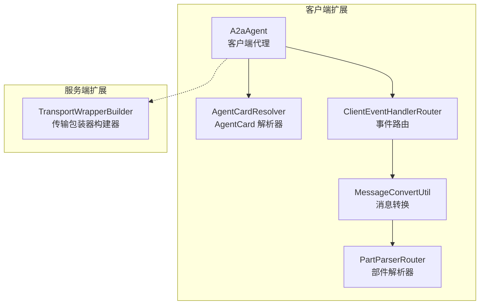
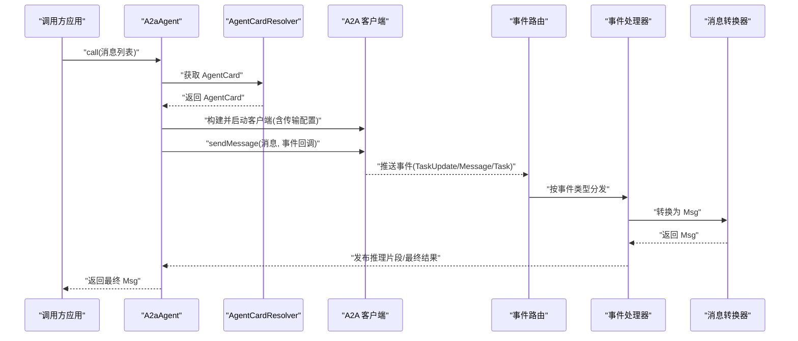
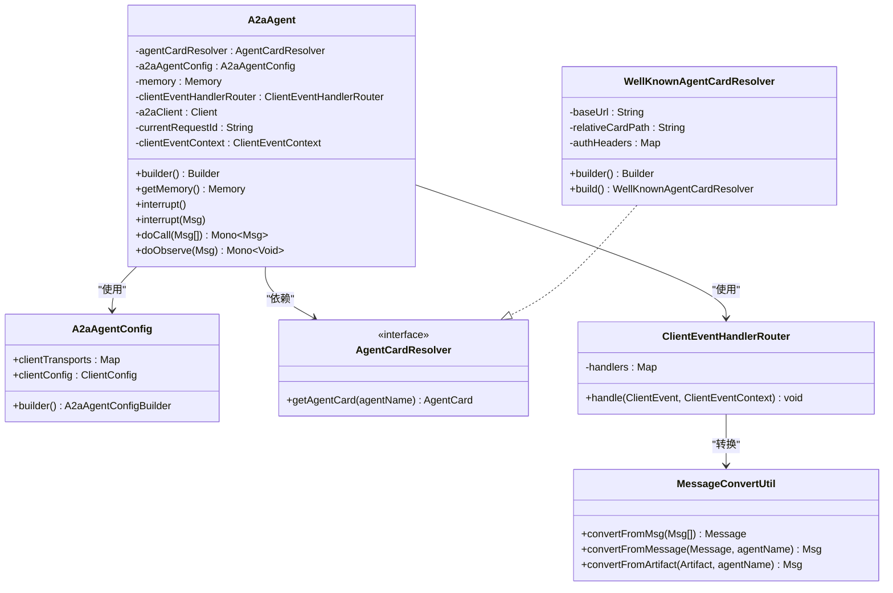
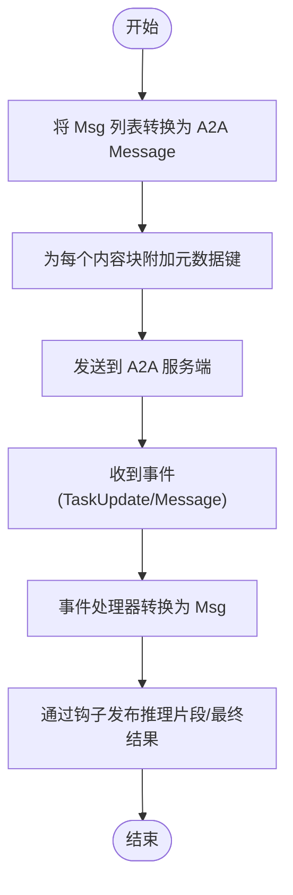
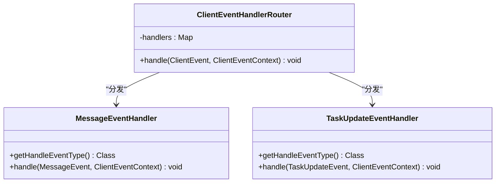
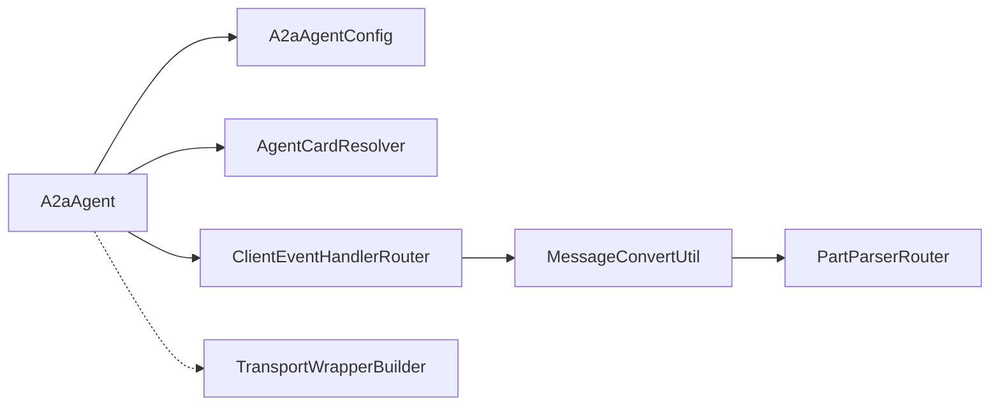

# A2A 协议

<cite>
**本文引用的文件**
- [A2aAgent.java](file://agentscope-extensions/agentscope-extensions-a2a/agentscope-extensions-a2a-client/src/main/java/io/agentscope/core/a2a/agent/A2aAgent.java)
- [A2aAgentConfig.java](file://agentscope-extensions/agentscope-extensions-a2a/agentscope-extensions-a2a-client/src/main/java/io/agentscope/core/a2a/agent/A2aAgentConfig.java)
- [AgentCardResolver.java](file://agentscope-extensions/agentscope-extensions-a2a/agentscope-extensions-a2a-client/src/main/java/io/agentscope/core/a2a/agent/card/AgentCardResolver.java)
- [WellKnownAgentCardResolver.java](file://agentscope-extensions/agentscope-extensions-a2a/agentscope-extensions-a2a-client/src/main/java/io/agentscope/core/a2a/agent/card/WellKnownAgentCardResolver.java)
- [MessageConvertUtil.java](file://agentscope-extensions/agentscope-extensions-a2a/agentscope-extensions-a2a-client/src/main/java/io/agentscope/core/a2a/agent/utils/MessageConvertUtil.java)
- [MessageConstants.java](file://agentscope-extensions/agentscope-extensions-a2a/agentscope-extensions-a2a-client/src/main/java/io/agentscope/core/a2a/agent/message/MessageConstants.java)
- [ClientEventHandlerRouter.java](file://agentscope-extensions/agentscope-extensions-a2a/agentscope-extensions-a2a-client/src/main/java/io/agentscope/core/a2a/agent/event/ClientEventHandlerRouter.java)
- [MessageEventHandler.java](file://agentscope-extensions/agentscope-extensions-a2a/agentscope-extensions-a2a-client/src/main/java/io/agentscope/core/a2a/agent/event/MessageEventHandler.java)
- [TaskUpdateEventHandler.java](file://agentscope-extensions/agentscope-extensions-a2a/agentscope-extensions-a2a-client/src/main/java/io/agentscope/core/a2a/agent/event/TaskUpdateEventHandler.java)
- [PartParserRouter.java](file://agentscope-extensions/agentscope-extensions-a2a/agentscope-extensions-a2a-client/src/main/java/io/agentscope/core/a2a/agent/message/PartParserRouter.java)
- [TransportWrapperBuilder.java](file://agentscope-extensions/agentscope-extensions-a2a/agentscope-extensions-a2a-server/src/main/java/io/agentscope/core/a2a/server/transport/TransportWrapperBuilder.java)
- [SimpleA2aAgentExample.java](file://agentscope-examples/a2a/src/main/java/io/agentscope/examples/a2a/SimpleA2aAgentExample.java)
- [a2a.md（英文）](file://docs/en/task/a2a.md)
- [a2a.md（中文）](file://docs/zh/task/a2a.md)
</cite>

## 目录
1. [简介](#简介)
2. [项目结构](#项目结构)
3. [核心组件](#核心组件)
4. [架构总览](#架构总览)
5. [组件详解](#组件详解)
6. [依赖关系分析](#依赖关系分析)
7. [性能考量](#性能考量)
8. [故障排查指南](#故障排查指南)
9. [结论](#结论)
10. [附录](#附录)

## 简介
本文件面向 A2A（Agent-to-Agent）协议在 AgentScope 中的实现与使用，系统性阐述协议设计原则、消息格式、版本管理与兼容性策略、客户端配置与连接管理、消息序列化与反序列化机制、安全与访问控制、性能优化、错误处理与调试技巧，并提供可直接定位到源码的示例路径，帮助读者快速上手并深入理解。

## 项目结构
A2A 在 AgentScope 中由“客户端扩展”和“服务端扩展”组成：
- 客户端侧：A2aAgent 及其相关解析器、事件路由、消息转换工具等，负责发现 AgentCard、建立连接、发送消息、接收事件并转换为 AgentScope 的消息模型。
- 服务端侧：基于 TransportWrapperBuilder 的包装器构建接口，用于将 AgentScope 的请求处理器适配到不同传输层（如 JSON-RPC 等）。

图示来源
- [A2aAgent.java:71-416](file://agentscope-extensions/agentscope-extensions-a2a/agentscope-extensions-a2a-client/src/main/java/io/agentscope/core/a2a/agent/A2aAgent.java#L71-L416)
- [ClientEventHandlerRouter.java:29-69](file://agentscope-extensions/agentscope-extensions-a2a/agentscope-extensions-a2a-client/src/main/java/io/agentscope/core/a2a/agent/event/ClientEventHandlerRouter.java#L29-L69)
- [MessageConvertUtil.java:38-158](file://agentscope-extensions/agentscope-extensions-a2a/agentscope-extensions-a2a-client/src/main/java/io/agentscope/core/a2a/agent/utils/MessageConvertUtil.java#L38-L158)
- [PartParserRouter.java:28-47](file://agentscope-extensions/agentscope-extensions-a2a/agentscope-extensions-a2a-client/src/main/java/io/agentscope/core/a2a/agent/message/PartParserRouter.java#L28-L47)
- [TransportWrapperBuilder.java:27-64](file://agentscope-extensions/agentscope-extensions-a2a/agentscope-extensions-a2a-server/src/main/java/io/agentscope/core/a2a/server/transport/TransportWrapperBuilder.java#L27-L64)

章节来源
- [A2aAgent.java:71-416](file://agentscope-extensions/agentscope-extensions-a2a/agentscope-extensions-a2a-client/src/main/java/io/agentscope/core/a2a/agent/A2aAgent.java#L71-L416)
- [a2a.md（英文）:1-294](file://docs/en/task/a2a.md#L1-L294)
- [a2a.md（中文）:1-61](file://docs/zh/task/a2a.md#L1-L61)

## 核心组件
- A2aAgent：封装 A2A 客户端生命周期、消息编排、中断处理与资源释放，对外暴露统一的 Agent 接口。
- AgentCardResolver：抽象 AgentCard 获取策略，内置“Well-Known”解析器与固定解析器。
- A2aAgentConfig：客户端传输与配置聚合，支持按传输类型注入配置。
- ClientEventHandlerRouter：事件路由分发器，将 A2A 客户端事件映射到具体处理器。
- MessageConvertUtil：跨协议的消息与部件转换工具，负责将 AgentScope 的 Msg 与 A2A 的 Message/Artifact 互转。
- PartParserRouter：根据 A2A 部件类型选择对应解析器，生成 AgentScope 内容块。
- TransportWrapperBuilder：服务端侧传输包装器构建接口，用于将请求处理器适配到不同传输层。

章节来源
- [A2aAgent.java:71-416](file://agentscope-extensions/agentscope-extensions-a2a/agentscope-extensions-a2a-client/src/main/java/io/agentscope/core/a2a/agent/A2aAgent.java#L71-L416)
- [A2aAgentConfig.java:28-83](file://agentscope-extensions/agentscope-extensions-a2a/agentscope-extensions-a2a-client/src/main/java/io/agentscope/core/a2a/agent/A2aAgentConfig.java#L28-L83)
- [AgentCardResolver.java:24-34](file://agentscope-extensions/agentscope-extensions-a2a/agentscope-extensions-a2a-client/src/main/java/io/agentscope/core/a2a/agent/card/AgentCardResolver.java#L24-L34)
- [WellKnownAgentCardResolver.java:37-122](file://agentscope-extensions/agentscope-extensions-a2a/agentscope-extensions-a2a-client/src/main/java/io/agentscope/core/a2a/agent/card/WellKnownAgentCardResolver.java#L37-L122)
- [ClientEventHandlerRouter.java:29-69](file://agentscope-extensions/agentscope-extensions-a2a/agentscope-extensions-a2a-client/src/main/java/io/agentscope/core/a2a/agent/event/ClientEventHandlerRouter.java#L29-L69)
- [MessageConvertUtil.java:38-158](file://agentscope-extensions/agentscope-extensions-a2a/agentscope-extensions-a2a-client/src/main/java/io/agentscope/core/a2a/agent/utils/MessageConvertUtil.java#L38-L158)
- [PartParserRouter.java:28-47](file://agentscope-extensions/agentscope-extensions-a2a/agentscope-extensions-a2a-client/src/main/java/io/agentscope/core/a2a/agent/message/PartParserRouter.java#L28-L47)
- [TransportWrapperBuilder.java:27-64](file://agentscope-extensions/agentscope-extensions-a2a/agentscope-extensions-a2a-server/src/main/java/io/agentscope/core/a2a/server/transport/TransportWrapperBuilder.java#L27-L64)

## 架构总览
下图展示了 A2A 客户端从发起调用到接收事件的端到端流程，以及与服务端传输层的衔接点。

图示来源
- [A2aAgent.java:114-214](file://agentscope-extensions/agentscope-extensions-a2a/agentscope-extensions-a2a-client/src/main/java/io/agentscope/core/a2a/agent/A2aAgent.java#L114-L214)
- [ClientEventHandlerRouter.java:55-67](file://agentscope-extensions/agentscope-extensions-a2a/agentscope-extensions-a2a-client/src/main/java/io/agentscope/core/a2a/agent/event/ClientEventHandlerRouter.java#L55-L67)
- [MessageEventHandler.java:40-53](file://agentscope-extensions/agentscope-extensions-a2a/agentscope-extensions-a2a-client/src/main/java/io/agentscope/core/a2a/agent/event/MessageEventHandler.java#L40-L53)
- [TaskUpdateEventHandler.java:56-78](file://agentscope-extensions/agentscope-extensions-a2a/agentscope-extensions-a2a-client/src/main/java/io/agentscope/core/a2a/agent/event/TaskUpdateEventHandler.java#L56-L78)
- [MessageConvertUtil.java:88-136](file://agentscope-extensions/agentscope-extensions-a2a/agentscope-extensions-a2a-client/src/main/java/io/agentscope/core/a2a/agent/utils/MessageConvertUtil.java#L88-L136)

## 组件详解

### A2aAgent 实现架构
- 生命周期钩子：通过内部 Hook 在 PreCall/PostCall/Error 时进行资源初始化与释放，确保线程安全与资源回收。
- 连接管理：基于 AgentCardResolver 获取 AgentCard，按 A2aAgentConfig 注入传输层与客户端配置，默认启用 JSON-RPC 传输。
- 消息路由：将输入消息转换为 A2A Message 后发送；事件回调通过 ClientEventHandlerRouter 分发至具体处理器。
- 中断处理：在任务上下文中调用 cancelTask 并返回中断提示消息。

图示来源
- [A2aAgent.java:71-416](file://agentscope-extensions/agentscope-extensions-a2a/agentscope-extensions-a2a-client/src/main/java/io/agentscope/core/a2a/agent/A2aAgent.java#L71-L416)
- [A2aAgentConfig.java:28-83](file://agentscope-extensions/agentscope-extensions-a2a/agentscope-extensions-a2a-client/src/main/java/io/agentscope/core/a2a/agent/A2aAgentConfig.java#L28-L83)
- [AgentCardResolver.java:24-34](file://agentscope-extensions/agentscope-extensions-a2a/agentscope-extensions-a2a-client/src/main/java/io/agentscope/core/a2a/agent/card/AgentCardResolver.java#L24-L34)
- [WellKnownAgentCardResolver.java:37-122](file://agentscope-extensions/agentscope-extensions-a2a/agentscope-extensions-a2a-client/src/main/java/io/agentscope/core/a2a/agent/card/WellKnownAgentCardResolver.java#L37-L122)
- [ClientEventHandlerRouter.java:29-69](file://agentscope-extensions/agentscope-extensions-a2a/agentscope-extensions-a2a-client/src/main/java/io/agentscope/core/a2a/agent/event/ClientEventHandlerRouter.java#L29-L69)
- [MessageConvertUtil.java:38-158](file://agentscope-extensions/agentscope-extensions-a2a/agentscope-extensions-a2a-client/src/main/java/io/agentscope/core/a2a/agent/utils/MessageConvertUtil.java#L38-L158)

章节来源
- [A2aAgent.java:114-260](file://agentscope-extensions/agentscope-extensions-a2a/agentscope-extensions-a2a-client/src/main/java/io/agentscope/core/a2a/agent/A2aAgent.java#L114-L260)
- [A2aAgentConfig.java:28-83](file://agentscope-extensions/agentscope-extensions-a2a/agentscope-extensions-a2a-client/src/main/java/io/agentscope/core/a2a/agent/A2aAgentConfig.java#L28-L83)
- [WellKnownAgentCardResolver.java:37-122](file://agentscope-extensions/agentscope-extensions-a2a/agentscope-extensions-a2a-client/src/main/java/io/agentscope/core/a2a/agent/card/WellKnownAgentCardResolver.java#L37-L122)

### 消息序列化与反序列化机制
- 序列化：A2aAgent 将 AgentScope 的 Msg 列表转换为 A2A 的 Message，同时为每个内容块附加元数据键，便于后续解析与溯源。
- 反序列化：服务端事件到达后，由事件处理器将 Message/Artifact 转换为 Msg，并通过钩子发布推理片段或最终结果。
- 部件解析：PartParserRouter 根据部件类型（文本/文件/数据）选择对应解析器，生成 AgentScope 的内容块。

图示来源
- [MessageConvertUtil.java:104-136](file://agentscope-extensions/agentscope-extensions-a2a/agentscope-extensions-a2a-client/src/main/java/io/agentscope/core/a2a/agent/utils/MessageConvertUtil.java#L104-L136)
- [MessageEventHandler.java:40-53](file://agentscope-extensions/agentscope-extensions-a2a/agentscope-extensions-a2a-client/src/main/java/io/agentscope/core/a2a/agent/event/MessageEventHandler.java#L40-L53)
- [TaskUpdateEventHandler.java:90-122](file://agentscope-extensions/agentscope-extensions-a2a/agentscope-extensions-a2a-client/src/main/java/io/agentscope/core/a2a/agent/event/TaskUpdateEventHandler.java#L90-L122)
- [PartParserRouter.java:36-45](file://agentscope-extensions/agentscope-extensions-a2a/agentscope-extensions-a2a-client/src/main/java/io/agentscope/core/a2a/agent/message/PartParserRouter.java#L36-L45)
- [MessageConstants.java:24-52](file://agentscope-extensions/agentscope-extensions-a2a/agentscope-extensions-a2a-client/src/main/java/io/agentscope/core/a2a/agent/message/MessageConstants.java#L24-L52)

章节来源
- [MessageConvertUtil.java:38-158](file://agentscope-extensions/agentscope-extensions-a2a/agentscope-extensions-a2a-client/src/main/java/io/agentscope/core/a2a/agent/utils/MessageConvertUtil.java#L38-L158)
- [MessageConstants.java:22-52](file://agentscope-extensions/agentscope-extensions-a2a/agentscope-extensions-a2a-client/src/main/java/io/agentscope/core/a2a/agent/message/MessageConstants.java#L22-L52)
- [PartParserRouter.java:28-47](file://agentscope-extensions/agentscope-extensions-a2a/agentscope-extensions-a2a-client/src/main/java/io/agentscope/core/a2a/agent/message/PartParserRouter.java#L28-L47)

### 事件处理与消息路由
- 事件路由：ClientEventHandlerRouter 注册 TaskUpdate、Message、Task 三类处理器，按事件类型分发。
- 处理器职责：
  - MessageEventHandler：将 Message 转换为 Msg 并完成调用。
  - TaskUpdateEventHandler：在任务状态更新时发布推理片段，在最终状态时发布最终结果。
- 元数据与溯源：转换过程中保留消息 ID、来源名称、块类型等元数据，便于调试与追踪。

图示来源
- [ClientEventHandlerRouter.java:29-69](file://agentscope-extensions/agentscope-extensions-a2a/agentscope-extensions-a2a-client/src/main/java/io/agentscope/core/a2a/agent/event/ClientEventHandlerRouter.java#L29-L69)
- [MessageEventHandler.java:30-55](file://agentscope-extensions/agentscope-extensions-a2a/agentscope-extensions-a2a-client/src/main/java/io/agentscope/core/a2a/agent/event/MessageEventHandler.java#L30-L55)
- [TaskUpdateEventHandler.java:36-145](file://agentscope-extensions/agentscope-extensions-a2a/agentscope-extensions-a2a-client/src/main/java/io/agentscope/core/a2a/agent/event/TaskUpdateEventHandler.java#L36-L145)

章节来源
- [ClientEventHandlerRouter.java:29-69](file://agentscope-extensions/agentscope-extensions-a2a/agentscope-extensions-a2a-client/src/main/java/io/agentscope/core/a2a/agent/event/ClientEventHandlerRouter.java#L29-L69)
- [MessageEventHandler.java:30-55](file://agentscope-extensions/agentscope-extensions-a2a/agentscope-extensions-a2a-client/src/main/java/io/agentscope/core/a2a/agent/event/MessageEventHandler.java#L30-L55)
- [TaskUpdateEventHandler.java:36-145](file://agentscope-extensions/agentscope-extensions-a2a/agentscope-extensions-a2a-client/src/main/java/io/agentscope/core/a2a/agent/event/TaskUpdateEventHandler.java#L36-L145)

### 协议版本管理与向后兼容
- 版本与兼容：A2A 规范定义了 AgentCard 与传输层的版本语义。客户端通过 AgentCardResolver 获取服务端声明的版本信息，传输层通过 TransportWrapperBuilder 与具体实现对接，确保新旧版本共存与平滑升级。
- 发布策略：服务端可通过扩展 AgentCard 或传输包装器，声明 preferredTransport/url 与能力集，客户端据此选择最优通道。

章节来源
- [WellKnownAgentCardResolver.java:23-55](file://agentscope-extensions/agentscope-extensions-a2a/agentscope-extensions-a2a-client/src/main/java/io/agentscope/core/a2a/agent/card/WellKnownAgentCardResolver.java#L23-L55)
- [TransportWrapperBuilder.java:27-64](file://agentscope-extensions/agentscope-extensions-a2a/agentscope-extensions-a2a-server/src/main/java/io/agentscope/core/a2a/server/transport/TransportWrapperBuilder.java#L27-L64)
- [a2a.md（英文）:273-278](file://docs/en/task/a2a.md#L273-L278)

### 安全机制与访问控制
- 身份认证：AgentCardResolver 支持在获取 AgentCard 时携带认证头（如令牌），以满足服务端的身份验证要求。
- 访问控制：通过传输层配置与服务端包装器，结合服务端的请求处理器与执行器，实现对请求来源与权限的控制。
- 加密与压缩：传输层（如 JSON-RPC）可配合网络层 TLS 与服务端压缩策略，保障数据机密性与传输效率。

章节来源
- [WellKnownAgentCardResolver.java:37-122](file://agentscope-extensions/agentscope-extensions-a2a/agentscope-extensions-a2a-client/src/main/java/io/agentscope/core/a2a/agent/card/WellKnownAgentCardResolver.java#L37-L122)
- [TransportWrapperBuilder.java:27-64](file://agentscope-extensions/agentscope-extensions-a2a/agentscope-extensions-a2a-server/src/main/java/io/agentscope/core/a2a/server/transport/TransportWrapperBuilder.java#L27-L64)

### 完整示例：创建 A2A 客户端、发送消息与处理响应
- 示例入口：SimpleA2aAgentExample 展示了通过 Well-Known URI 获取 AgentCard 并创建 A2A 客户端的基本流程。
- 关键步骤：
  - 使用 WellKnownAgentCardResolver 指定基础地址与相对路径。
  - 通过 A2aAgent.builder().agentCardResolver(...) 构建代理。
  - 调用 agent.call(...) 并阻塞等待响应。

章节来源
- [SimpleA2aAgentExample.java:31-43](file://agentscope-examples/a2a/src/main/java/io/agentscope/examples/a2a/SimpleA2aAgentExample.java#L31-L43)
- [a2a.md（中文）:11-28](file://docs/zh/task/a2a.md#L11-L28)
- [a2a.md（英文）:11-28](file://docs/en/task/a2a.md#L11-L28)

## 依赖关系分析
- 组件内聚与耦合：
  - A2aAgent 与 A2aAgentConfig、AgentCardResolver、ClientEventHandlerRouter 高内聚、低耦合，通过接口解耦。
  - 事件路由与消息转换相互独立，便于扩展新的处理器与解析器。
- 外部依赖：
  - 基于 A2A 官方客户端库与规范，传输层通过 ClientTransport 与 ClientTransportConfig 注入。
  - 服务端通过 TransportWrapperBuilder 适配不同传输层。

图示来源
- [A2aAgent.java:71-416](file://agentscope-extensions/agentscope-extensions-a2a/agentscope-extensions-a2a-client/src/main/java/io/agentscope/core/a2a/agent/A2aAgent.java#L71-L416)
- [A2aAgentConfig.java:28-83](file://agentscope-extensions/agentscope-extensions-a2a/agentscope-extensions-a2a-client/src/main/java/io/agentscope/core/a2a/agent/A2aAgentConfig.java#L28-L83)
- [ClientEventHandlerRouter.java:29-69](file://agentscope-extensions/agentscope-extensions-a2a/agentscope-extensions-a2a-client/src/main/java/io/agentscope/core/a2a/agent/event/ClientEventHandlerRouter.java#L29-L69)
- [MessageConvertUtil.java:38-158](file://agentscope-extensions/agentscope-extensions-a2a/agentscope-extensions-a2a-client/src/main/java/io/agentscope/core/a2a/agent/utils/MessageConvertUtil.java#L38-L158)
- [PartParserRouter.java:28-47](file://agentscope-extensions/agentscope-extensions-a2a/agentscope-extensions-a2a-client/src/main/java/io/agentscope/core/a2a/agent/message/PartParserRouter.java#L28-L47)
- [TransportWrapperBuilder.java:27-64](file://agentscope-extensions/agentscope-extensions-a2a/agentscope-extensions-a2a-server/src/main/java/io/agentscope/core/a2a/server/transport/TransportWrapperBuilder.java#L27-L64)

## 性能考量
- 连接复用：A2aAgent 在一次调用周期内复用同一 Client 实例，避免频繁握手开销。
- 流式输出：通过事件处理器在任务状态更新时发布推理片段，降低首字节延迟。
- 元数据最小化：仅在必要处附加溯源元数据，减少消息体积。
- 传输层优化：根据场景选择合适的传输与压缩策略，结合服务端执行器并发处理能力。

## 故障排查指南
- AgentCard 获取失败：检查 WellKnownAgentCardResolver 的基础地址与相对路径是否正确，确认认证头配置。
- 事件未被处理：确认 ClientEventHandlerRouter 是否注册了对应事件处理器，查看日志中“未找到处理器”的提示。
- 中断无效：确认任务上下文已建立且任务 ID 可用，检查 cancelTask 返回值与异常信息。
- 日志与调试：利用 LoggerUtil 输出请求 ID、事件详情与消息明细，便于定位问题。

章节来源
- [WellKnownAgentCardResolver.java:52-55](file://agentscope-extensions/agentscope-extensions-a2a/agentscope-extensions-a2a-client/src/main/java/io/agentscope/core/a2a/agent/card/WellKnownAgentCardResolver.java#L52-L55)
- [ClientEventHandlerRouter.java:56-67](file://agentscope-extensions/agentscope-extensions-a2a/agentscope-extensions-a2a-client/src/main/java/io/agentscope/core/a2a/agent/event/ClientEventHandlerRouter.java#L56-L67)
- [A2aAgent.java:152-171](file://agentscope-extensions/agentscope-extensions-a2a/agentscope-extensions-a2a-client/src/main/java/io/agentscope/core/a2a/agent/A2aAgent.java#L152-L171)

## 结论
A2A 在 AgentScope 中通过清晰的客户端代理、灵活的 AgentCard 解析、可插拔的事件路由与消息转换机制，实现了对 A2A 协议的完整支持。借助传输层包装器与服务端适配，系统具备良好的扩展性与向后兼容性。建议在生产环境中结合认证、压缩与流式输出策略，持续优化端到端性能与可观测性。

## 附录
- 快速开始与配置参考：见文档中的“快速开始”与“配置选项”章节。
- 服务端注册与传输配置：见文档中的“服务端注册与传输配置”章节。

章节来源
- [a2a.md（中文）:11-61](file://docs/zh/task/a2a.md#L11-L61)
- [a2a.md（英文）:11-294](file://docs/en/task/a2a.md#L11-L294)