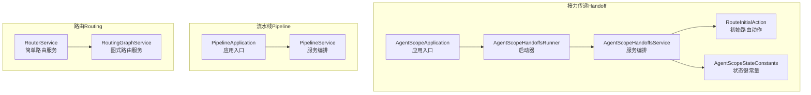
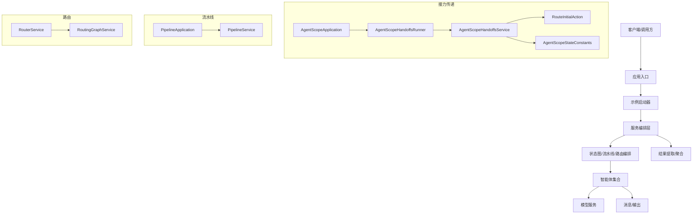
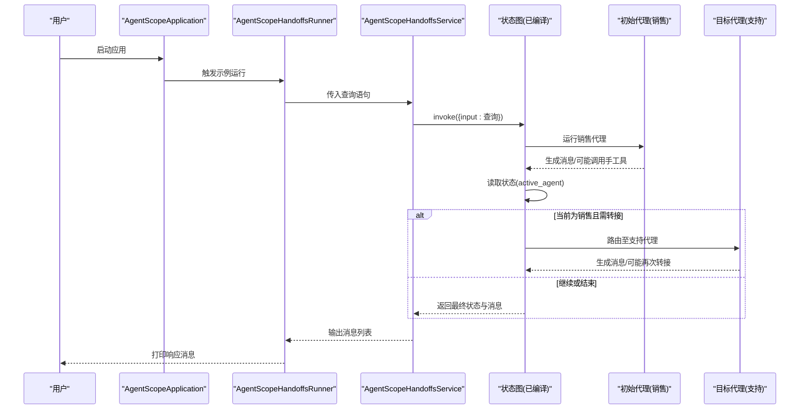
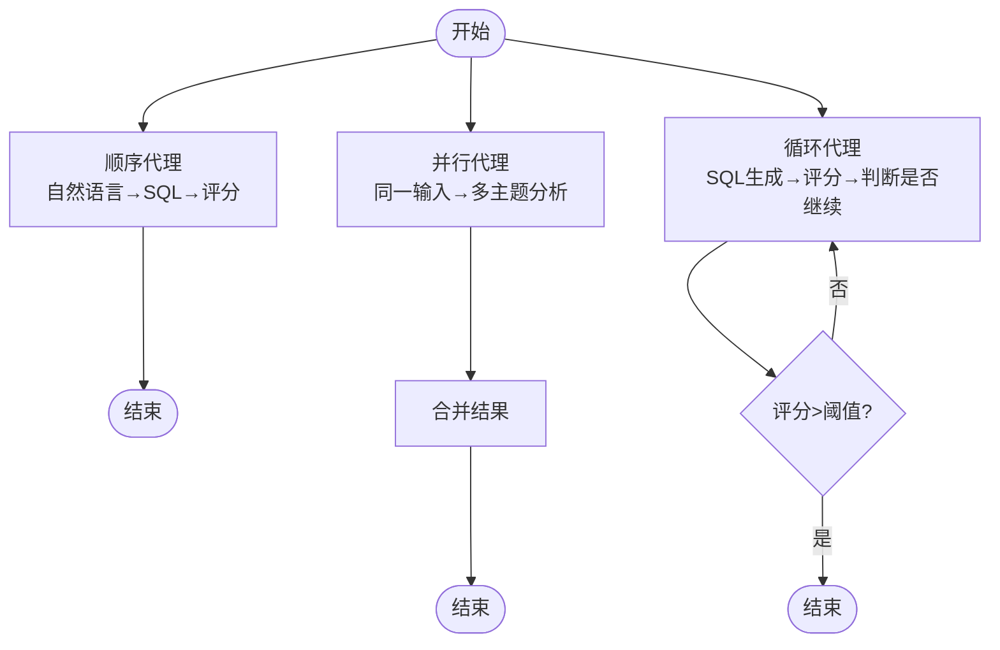
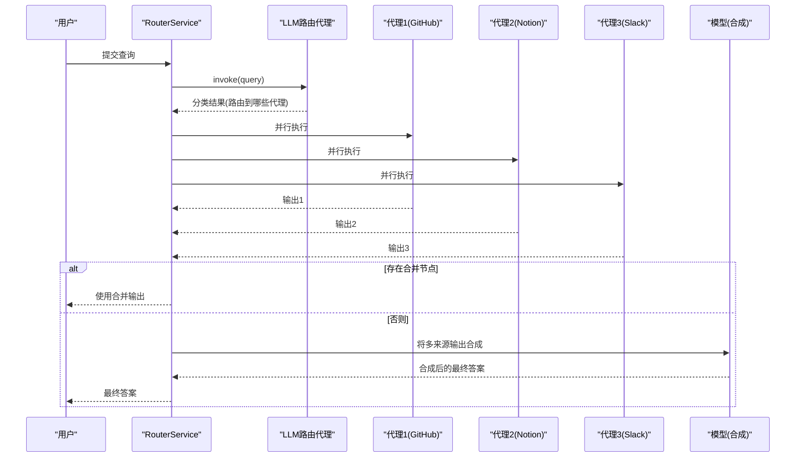
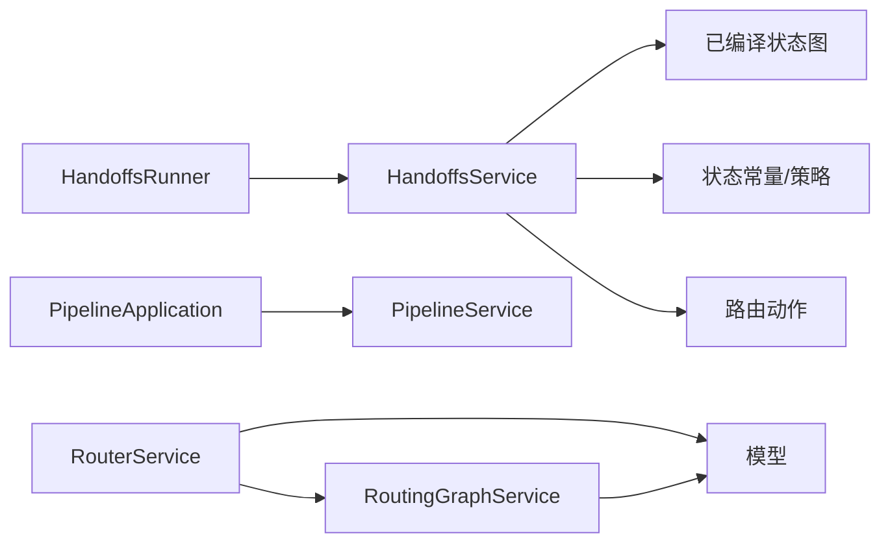

# 协作模式与策略

<cite>
**本文引用的文件**
- [AgentScopeApplication.java](file://agentscope-examples/multiagent-patterns/handoffs/src/main/java/io/agentscope/examples/handoffs/multiagent/AgentScopeApplication.java)
- [AgentScopeHandoffsRunner.java](file://agentscope-examples/multiagent-patterns/handoffs/src/main/java/io/agentscope/examples/handoffs/multiagent/AgentScopeHandoffsRunner.java)
- [AgentScopeHandoffsService.java](file://agentscope-examples/multiagent-patterns/handoffs/src/main/java/io/agentscope/examples/handoffs/multiagent/AgentScopeHandoffsService.java)
- [RouteInitialAction.java](file://agentscope-examples/multiagent-patterns/handoffs/src/main/java/io/agentscope/examples/handoffs/multiagent/route/RouteInitialAction.java)
- [AgentScopeStateConstants.java](file://agentscope-examples/multiagent-patterns/handoffs/src/main/java/io/agentscope/examples/handoffs/multiagent/state/AgentScopeStateConstants.java)
- [TransferToSalesTool.java](file://agentscope-examples/multiagent-patterns/handoffs/src/main/java/io/agentscope/examples/handoffs/multiagent/tools/TransferToSalesTool.java)
- [TransferToSupportTool.java](file://agentscope-examples/multiagent-patterns/handoffs/src/main/java/io/agentscope/examples/handoffs/multiagent/tools/TransferToSupportTool.java)
- [UpdateExtraStateTool.java](file://agentscope-examples/multiagent-patterns/handoffs/src/main/java/io/agentscope/examples/handoffs/multiagent/tools/UpdateExtraStateTool.java)
- [PipelineApplication.java](file://agentscope-examples/multiagent-patterns/pipeline/src/main/java/com/alibaba/cloud/ai/examples/multiagents/pipeline/PipelineApplication.java)
- [PipelineService.java](file://agentscope-examples/multiagent-patterns/pipeline/src/main/java/com/alibaba/cloud/ai/examples/multiagents/pipeline/PipelineService.java)
- [RouterService.java](file://agentscope-examples/multiagent-patterns/routing/src/main/java/io/agentscope/examples/routing/simple/RouterService.java)
- [RoutingGraphService.java](file://agentscope-examples/multiagent-patterns/routing/src/main/java/io/agentscope/examples/routing/graph/RoutingGraphService.java)
- [handoffs.md](file://docs/en/multi-agent/handoffs.md)
</cite>

## 目录
1. [引言](#引言)
2. [项目结构](#项目结构)
3. [核心组件](#核心组件)
4. [架构总览](#架构总览)
5. [详细组件分析](#详细组件分析)
6. [依赖分析](#依赖分析)
7. [性能考虑](#性能考虑)
8. [故障排查指南](#故障排查指南)
9. [结论](#结论)
10. [附录](#附录)

## 引言
本技术文档围绕多智能体协作模式与策略展开，重点覆盖接力传递（Handoff）、流水线处理（Pipeline）与路由分发（Routing）三类常见模式。我们将从系统架构、组件关系、数据流与处理逻辑入手，结合仓库中的示例实现，给出适用场景、优缺点、任务分配与资源调度策略（负载均衡、优先级、动态调整）、结果聚合与冲突解决机制（投票、权重、一致性），并提供可直接定位到源码路径的示例说明，以及性能优化、监控指标与故障处理的最佳实践建议。

## 项目结构
本仓库在 examples/multiagent-patterns 下提供了三种协作模式的完整示例工程：
- handoffs：基于状态图的接力传递模式，通过工具调用更新状态变量，驱动后续节点流转。
- pipeline：包含顺序、并行与循环三种流水线模式的示例，演示如何组织多个智能体协同完成复杂任务。
- routing：包含简单路由与图式路由两种实现，前者使用 LLM 进行分类后并行分发给专业代理，后者通过状态图编排预处理、路由与后处理阶段。

图表来源
- [AgentScopeApplication.java:25-41](file://agentscope-examples/multiagent-patterns/handoffs/src/main/java/io/agentscope/examples/handoffs/multiagent/AgentScopeApplication.java#L25-L41)
- [AgentScopeHandoffsRunner.java:28-49](file://agentscope-examples/multiagent-patterns/handoffs/src/main/java/io/agentscope/examples/handoffs/multiagent/AgentScopeHandoffsRunner.java#L28-L49)
- [AgentScopeHandoffsService.java:29-57](file://agentscope-examples/multiagent-patterns/handoffs/src/main/java/io/agentscope/examples/handoffs/multiagent/AgentScopeHandoffsService.java#L29-L57)
- [RouteInitialAction.java:25-40](file://agentscope-examples/multiagent-patterns/handoffs/src/main/java/io/agentscope/examples/handoffs/multiagent/route/RouteInitialAction.java#L25-L40)
- [AgentScopeStateConstants.java](file://agentscope-examples/multiagent-patterns/handoffs/src/main/java/io/agentscope/examples/handoffs/multiagent/state/AgentScopeStateConstants.java)
- [PipelineApplication.java:25-54](file://agentscope-examples/multiagent-patterns/pipeline/src/main/java/com/alibaba/cloud/ai/examples/multiagents/pipeline/PipelineApplication.java#L25-L54)
- [PipelineService.java:30-107](file://agentscope-examples/multiagent-patterns/pipeline/src/main/java/com/alibaba/cloud/ai/examples/multiagents/pipeline/PipelineService.java#L30-L107)
- [RouterService.java:41-173](file://agentscope-examples/multiagent-patterns/routing/src/main/java/io/agentscope/examples/routing/simple/RouterService.java#L41-L173)
- [RoutingGraphService.java:29-65](file://agentscope-examples/multiagent-patterns/routing/src/main/java/io/agentscope/examples/routing/graph/RoutingGraphService.java#L29-L65)

章节来源
- [AgentScopeApplication.java:25-41](file://agentscope-examples/multiagent-patterns/handoffs/src/main/java/io/agentscope/examples/handoffs/multiagent/AgentScopeApplication.java#L25-L41)
- [PipelineApplication.java:25-54](file://agentscope-examples/multiagent-patterns/pipeline/src/main/java/com/alibaba/cloud/ai/examples/multiagents/pipeline/PipelineApplication.java#L25-L54)
- [RouterService.java:41-173](file://agentscope-examples/multiagent-patterns/routing/src/main/java/io/agentscope/examples/routing/simple/RouterService.java#L41-L173)

## 核心组件
- 接力传递（Handoff）
  - 应用入口与启动器：负责应用启动与示例运行触发。
  - 状态常量：定义用于控制流转的状态键（如当前活跃代理）。
  - 路由动作：根据状态决定下一步流向（初始、售后、支持等）。
  - 工具：用于在节点结束时更新状态，从而影响下一轮路由。
  - 服务编排：封装图执行与结果提取。

- 流水线（Pipeline）
  - 应用入口：声明可用的流水线代理类型。
  - 服务编排：统一调用顺序、并行与循环代理，并从状态中抽取结果。

- 路由（Routing）
  - 简单路由服务：使用 LLM 对输入进行分类，然后并行交给专业代理，最后合成最终答案。
  - 图式路由服务：对预处理、路由（含合并）与后处理阶段进行编排。

章节来源
- [AgentScopeHandoffsRunner.java:28-49](file://agentscope-examples/multiagent-patterns/handoffs/src/main/java/io/agentscope/examples/handoffs/multiagent/AgentScopeHandoffsRunner.java#L28-L49)
- [AgentScopeHandoffsService.java:29-57](file://agentscope-examples/multiagent-patterns/handoffs/src/main/java/io/agentscope/examples/handoffs/multiagent/AgentScopeHandoffsService.java#L29-L57)
- [RouteInitialAction.java:25-40](file://agentscope-examples/multiagent-patterns/handoffs/src/main/java/io/agentscope/examples/handoffs/multiagent/route/RouteInitialAction.java#L25-L40)
- [AgentScopeStateConstants.java](file://agentscope-examples/multiagent-patterns/handoffs/src/main/java/io/agentscope/examples/handoffs/multiagent/state/AgentScopeStateConstants.java)
- [PipelineApplication.java:25-54](file://agentscope-examples/multiagent-patterns/pipeline/src/main/java/com/alibaba/cloud/ai/examples/multiagents/pipeline/PipelineApplication.java#L25-L54)
- [PipelineService.java:30-107](file://agentscope-examples/multiagent-patterns/pipeline/src/main/java/com/alibaba/cloud/ai/examples/multiagents/pipeline/PipelineService.java#L30-L107)
- [RouterService.java:41-173](file://agentscope-examples/multiagent-patterns/routing/src/main/java/io/agentscope/examples/routing/simple/RouterService.java#L41-L173)
- [RoutingGraphService.java:29-65](file://agentscope-examples/multiagent-patterns/routing/src/main/java/io/agentscope/examples/routing/graph/RoutingGraphService.java#L29-L65)

## 架构总览
下图展示了三种协作模式在系统中的位置与交互关系，以及与核心运行时（状态图、模型、消息）的关系。

图表来源
- [AgentScopeApplication.java:25-41](file://agentscope-examples/multiagent-patterns/handoffs/src/main/java/io/agentscope/examples/handoffs/multiagent/AgentScopeApplication.java#L25-L41)
- [AgentScopeHandoffsRunner.java:28-49](file://agentscope-examples/multiagent-patterns/handoffs/src/main/java/io/agentscope/examples/handoffs/multiagent/AgentScopeHandoffsRunner.java#L28-L49)
- [AgentScopeHandoffsService.java:29-57](file://agentscope-examples/multiagent-patterns/handoffs/src/main/java/io/agentscope/examples/handoffs/multiagent/AgentScopeHandoffsService.java#L29-L57)
- [RouteInitialAction.java:25-40](file://agentscope-examples/multiagent-patterns/handoffs/src/main/java/io/agentscope/examples/handoffs/multiagent/route/RouteInitialAction.java#L25-L40)
- [AgentScopeStateConstants.java](file://agentscope-examples/multiagent-patterns/handoffs/src/main/java/io/agentscope/examples/handoffs/multiagent/state/AgentScopeStateConstants.java)
- [PipelineApplication.java:25-54](file://agentscope-examples/multiagent-patterns/pipeline/src/main/java/com/alibaba/cloud/ai/examples/multiagents/pipeline/PipelineApplication.java#L25-L54)
- [PipelineService.java:30-107](file://agentscope-examples/multiagent-patterns/pipeline/src/main/java/com/alibaba/cloud/ai/examples/multiagents/pipeline/PipelineService.java#L30-L107)
- [RouterService.java:41-173](file://agentscope-examples/multiagent-patterns/routing/src/main/java/io/agentscope/examples/routing/simple/RouterService.java#L41-L173)
- [RoutingGraphService.java:29-65](file://agentscope-examples/multiagent-patterns/routing/src/main/java/io/agentscope/examples/routing/graph/RoutingGraphService.java#L29-L65)

## 详细组件分析

### 接力传递（Handoff）模式
- 模式特征
  - 基于状态的动态路由：通过状态变量（如当前活跃代理）决定下一节点。
  - 工具驱动的状态变更：工具在节点完成后更新状态，从而影响条件边。
  - 用户始终与“前台”代理交互，工具仅改变下一轮由谁处理。
  - 状态跨轮次持久化，确保流程连贯性。

- 关键实现要点
  - 状态键与节点名称常量：用于在图中标识当前活跃代理与各节点。
  - 初始路由动作：根据状态选择默认或目标节点。
  - 手动转移工具：在节点结束时更新状态，使后续条件边指向新代理或结束。
  - 服务编排：以用户输入为输入，执行编译后的状态图，提取消息列表作为最终输出。

- 适用场景
  - 客服/销售流程：先收集信息再转接，或在销售与支持之间切换。
  - 需要角色化、顺序化的对话流程。

- 优势与限制
  - 优势：流程清晰、易于调试；状态驱动，可扩展性强。
  - 限制：状态管理复杂度随节点数增长；需要谨慎设计状态键与策略。

图表来源
- [AgentScopeApplication.java:25-41](file://agentscope-examples/multiagent-patterns/handoffs/src/main/java/io/agentscope/examples/handoffs/multiagent/AgentScopeApplication.java#L25-L41)
- [AgentScopeHandoffsRunner.java:28-49](file://agentscope-examples/multiagent-patterns/handoffs/src/main/java/io/agentscope/examples/handoffs/multiagent/AgentScopeHandoffsRunner.java#L28-L49)
- [AgentScopeHandoffsService.java:29-57](file://agentscope-examples/multiagent-patterns/handoffs/src/main/java/io/agentscope/examples/handoffs/multiagent/AgentScopeHandoffsService.java#L29-L57)
- [RouteInitialAction.java:25-40](file://agentscope-examples/multiagent-patterns/handoffs/src/main/java/io/agentscope/examples/handoffs/multiagent/route/RouteInitialAction.java#L25-L40)

章节来源
- [AgentScopeHandoffsRunner.java:28-49](file://agentscope-examples/multiagent-patterns/handoffs/src/main/java/io/agentscope/examples/handoffs/multiagent/AgentScopeHandoffsRunner.java#L28-L49)
- [AgentScopeHandoffsService.java:29-57](file://agentscope-examples/multiagent-patterns/handoffs/src/main/java/io/agentscope/examples/handoffs/multiagent/AgentScopeHandoffsService.java#L29-L57)
- [RouteInitialAction.java:25-40](file://agentscope-examples/multiagent-patterns/handoffs/src/main/java/io/agentscope/examples/handoffs/multiagent/route/RouteInitialAction.java#L25-L40)
- [AgentScopeStateConstants.java](file://agentscope-examples/multiagent-patterns/handoffs/src/main/java/io/agentscope/examples/handoffs/multiagent/state/AgentScopeStateConstants.java)
- [TransferToSalesTool.java](file://agentscope-examples/multiagent-patterns/handoffs/src/main/java/io/agentscope/examples/handoffs/multiagent/tools/TransferToSalesTool.java)
- [TransferToSupportTool.java](file://agentscope-examples/multiagent-patterns/handoffs/src/main/java/io/agentscope/examples/handoffs/multiagent/tools/TransferToSupportTool.java)
- [UpdateExtraStateTool.java](file://agentscope-examples/multiagent-patterns/handoffs/src/main/java/io/agentscope/examples/handoffs/multiagent/tools/UpdateExtraStateTool.java)
- [handoffs.md:1-218](file://docs/en/multi-agent/handoffs.md#L1-L218)

### 流水线（Pipeline）模式
- 模式特征
  - 顺序流水线：按步骤依次执行，前一步输出作为下一步输入。
  - 并行流水线：同一输入分发给多个代理并行处理，随后合并结果。
  - 循环流水线：根据条件反复执行，直到满足终止条件（如质量阈值）。

- 关键实现要点
  - 应用入口声明可用代理类型与功能（如自然语言到 SQL 的顺序链路、多主题并行研究、SQL 反复精炼）。
  - 服务编排层统一调用不同类型的代理，从状态中抽取关键输出（如 SQL、评分、研究报告）。

- 适用场景
  - 复杂任务分解：先生成 SQL 再评估分数；或同时进行技术/金融/市场分析。
  - 自适应优化：通过循环迭代提升输出质量。

- 优势与限制
  - 优势：模块化强、易扩展；并行可显著缩短端到端时间。
  - 限制：并行分支增多会带来资源竞争与同步开销；循环需谨慎设置终止条件。

图表来源
- [PipelineApplication.java:25-54](file://agentscope-examples/multiagent-patterns/pipeline/src/main/java/com/alibaba/cloud/ai/examples/multiagents/pipeline/PipelineApplication.java#L25-L54)
- [PipelineService.java:30-107](file://agentscope-examples/multiagent-patterns/pipeline/src/main/java/com/alibaba/cloud/ai/examples/multiagents/pipeline/PipelineService.java#L30-L107)

章节来源
- [PipelineApplication.java:25-54](file://agentscope-examples/multiagent-patterns/pipeline/src/main/java/com/alibaba/cloud/ai/examples/multiagents/pipeline/PipelineApplication.java#L25-L54)
- [PipelineService.java:30-107](file://agentscope-examples/multiagent-patterns/pipeline/src/main/java/com/alibaba/cloud/ai/examples/multiagents/pipeline/PipelineService.java#L30-L107)

### 路由分发（Routing）模式
- 模式特征
  - 简单路由：使用 LLM 对输入进行分类，将请求分发给对应的专业代理，最后由模型合成统一答案。
  - 图式路由：通过状态图编排预处理、路由（含合并）与后处理阶段，形成更复杂的编排链路。

- 关键实现要点
  - 分类与并行：根据输入内容选择目标代理，多代理并行产出。
  - 结果聚合：若存在合并节点，则直接使用合并输出；否则通过模型对多来源结果进行合成。
  - 编排服务：统一执行图并提取最终答案，记录分类与各代理输出以便回溯。

- 适用场景
  - 多知识源检索：根据问题类型路由到 GitHub、Notion、Slack 等不同知识库。
  - 复杂问答：先分类、再并行搜索、最后综合生成简洁一致的答案。

- 优势与限制
  - 优势：解耦分类与执行；可灵活扩展代理与知识源。
  - 限制：分类准确性直接影响路由效果；合并/合成的质量取决于提示词与模型能力。

图表来源
- [RouterService.java:41-173](file://agentscope-examples/multiagent-patterns/routing/src/main/java/io/agentscope/examples/routing/simple/RouterService.java#L41-L173)
- [RoutingGraphService.java:29-65](file://agentscope-examples/multiagent-patterns/routing/src/main/java/io/agentscope/examples/routing/graph/RoutingGraphService.java#L29-L65)

章节来源
- [RouterService.java:41-173](file://agentscope-examples/multiagent-patterns/routing/src/main/java/io/agentscope/examples/routing/simple/RouterService.java#L41-L173)
- [RoutingGraphService.java:29-65](file://agentscope-examples/multiagent-patterns/routing/src/main/java/io/agentscope/examples/routing/graph/RoutingGraphService.java#L29-L65)

## 依赖分析
- 组件内聚与耦合
  - 接力传递：Runner 依赖 Service，Service 依赖已编译状态图；状态常量与路由动作被图条件边引用，耦合集中在状态键与策略上。
  - 流水线：应用入口与服务编排层分别承担职责，代理类型在应用层声明，服务层负责调用与结果抽取。
  - 路由：RouterService 与 RoutingGraphService 分别面向不同编排方式，均依赖模型与代理执行，最终统一输出。

- 外部依赖与集成点
  - 状态图与编排：通过已编译图执行，状态键策略（如替换策略）用于控制状态更新。
  - 模型服务：用于结果合成与流式输出。
  - 日志与异常：统一使用 SLF4J 记录日志，异常通过运行时异常传播。

图表来源
- [AgentScopeHandoffsRunner.java:28-49](file://agentscope-examples/multiagent-patterns/handoffs/src/main/java/io/agentscope/examples/handoffs/multiagent/AgentScopeHandoffsRunner.java#L28-L49)
- [AgentScopeHandoffsService.java:29-57](file://agentscope-examples/multiagent-patterns/handoffs/src/main/java/io/agentscope/examples/handoffs/multiagent/AgentScopeHandoffsService.java#L29-L57)
- [RouteInitialAction.java:25-40](file://agentscope-examples/multiagent-patterns/handoffs/src/main/java/io/agentscope/examples/handoffs/multiagent/route/RouteInitialAction.java#L25-L40)
- [PipelineApplication.java:25-54](file://agentscope-examples/multiagent-patterns/pipeline/src/main/java/com/alibaba/cloud/ai/examples/multiagents/pipeline/PipelineApplication.java#L25-L54)
- [PipelineService.java:30-107](file://agentscope-examples/multiagent-patterns/pipeline/src/main/java/com/alibaba/cloud/ai/examples/multiagents/pipeline/PipelineService.java#L30-L107)
- [RouterService.java:41-173](file://agentscope-examples/multiagent-patterns/routing/src/main/java/io/agentscope/examples/routing/simple/RouterService.java#L41-L173)
- [RoutingGraphService.java:29-65](file://agentscope-examples/multiagent-patterns/routing/src/main/java/io/agentscope/examples/routing/graph/RoutingGraphService.java#L29-L65)

章节来源
- [AgentScopeHandoffsRunner.java:28-49](file://agentscope-examples/multiagent-patterns/handoffs/src/main/java/io/agentscope/examples/handoffs/multiagent/AgentScopeHandoffsRunner.java#L28-L49)
- [PipelineApplication.java:25-54](file://agentscope-examples/multiagent-patterns/pipeline/src/main/java/com/alibaba/cloud/ai/examples/multiagents/pipeline/PipelineApplication.java#L25-L54)
- [RouterService.java:41-173](file://agentscope-examples/multiagent-patterns/routing/src/main/java/io/agentscope/examples/routing/simple/RouterService.java#L41-L173)

## 性能考虑
- 负载均衡
  - 并行流水线：合理拆分任务，避免热点代理过载；可通过队列或限流策略控制并发度。
  - 路由分发：根据代理能力与历史负载动态调整分类阈值或路由权重，减少长尾延迟。

- 优先级排序
  - 在路由阶段引入优先级标签，优先命中高优先级代理；对紧急任务可设置超时与降级策略。

- 动态调整
  - 循环流水线：根据中间评分或质量指标动态停止迭代，避免无效重复计算。
  - 状态图：通过条件边与状态键策略实现自适应分支，减少不必要的执行。

- 结果聚合与一致性
  - 投票/权重：对多来源输出采用加权平均或多数投票；对冲突内容保留证据并提示人工确认。
  - 一致性保证：通过统一的合成模板与模型参数，确保最终回答风格与质量一致。

- 监控指标
  - 关键指标：吞吐量、P95/P99 延迟、代理执行耗时、重试率、失败率、路由命中率、合并/合成耗时。
  - 建议埋点：在服务编排层与代理执行层分别记录输入/输出、状态更新、异常与耗时。

- 故障处理
  - 超时与重试：为外部模型与代理调用设置超时与指数退避重试。
  - 降级策略：当某代理不可用时，自动切换到备用代理或返回部分结果。
  - 异常传播：统一捕获运行时异常并记录上下文，便于追踪与恢复。

## 故障排查指南
- 接力传递（Handoff）
  - 症状：状态未更新导致路由不生效。
  - 排查：检查工具是否正确写入状态键；确认图的键策略是否允许替换。
  - 参考路径：状态常量、初始路由动作、转移工具实现。

- 流水线（Pipeline）
  - 症状：并行分支阻塞或结果缺失。
  - 排查：检查状态键是否存在、抽取逻辑是否正确；确认代理是否正常返回消息。
  - 参考路径：应用入口声明、服务编排层结果抽取。

- 路由（Routing）
  - 症状：分类错误或合成结果不一致。
  - 排查：验证分类提示词与示例；检查合并节点是否存在；必要时回退到合成路径。
  - 参考路径：路由服务与图式路由服务的执行与结果提取。

章节来源
- [AgentScopeHandoffsService.java:29-57](file://agentscope-examples/multiagent-patterns/handoffs/src/main/java/io/agentscope/examples/handoffs/multiagent/AgentScopeHandoffsService.java#L29-L57)
- [PipelineService.java:30-107](file://agentscope-examples/multiagent-patterns/pipeline/src/main/java/com/alibaba/cloud/ai/examples/multiagents/pipeline/PipelineService.java#L30-L107)
- [RouterService.java:41-173](file://agentscope-examples/multiagent-patterns/routing/src/main/java/io/agentscope/examples/routing/simple/RouterService.java#L41-L173)
- [RoutingGraphService.java:29-65](file://agentscope-examples/multiagent-patterns/routing/src/main/java/io/agentscope/examples/routing/graph/RoutingGraphService.java#L29-L65)

## 结论
接力传递、流水线与路由分发是多智能体协作的三大支柱模式。接力传递强调状态驱动与角色化流转；流水线强调任务分解与并行加速；路由强调分类与多源整合。结合合理的任务分配与资源调度策略、结果聚合与冲突解决机制，以及完善的性能优化与故障处理方案，可在复杂业务场景中构建稳定高效的多智能体系统。

## 附录
- 示例运行与配置
  - 接力传递：通过应用入口启动，Runner 触发服务执行，服务编排图并输出消息。
  - 流水线：应用入口声明可用代理，服务编排层统一调用顺序/并行/循环代理。
  - 路由：简单路由服务与图式路由服务分别演示分类、并行与合成流程。

- 相关文档参考
  - 接力传递模式文档：[handoffs.md:1-218](file://docs/en/multi-agent/handoffs.md#L1-L218)

章节来源
- [AgentScopeApplication.java:25-41](file://agentscope-examples/multiagent-patterns/handoffs/src/main/java/io/agentscope/examples/handoffs/multiagent/AgentScopeApplication.java#L25-L41)
- [AgentScopeHandoffsRunner.java:28-49](file://agentscope-examples/multiagent-patterns/handoffs/src/main/java/io/agentscope/examples/handoffs/multiagent/AgentScopeHandoffsRunner.java#L28-L49)
- [PipelineApplication.java:25-54](file://agentscope-examples/multiagent-patterns/pipeline/src/main/java/com/alibaba/cloud/ai/examples/multiagents/pipeline/PipelineApplication.java#L25-L54)
- [RouterService.java:41-173](file://agentscope-examples/multiagent-patterns/routing/src/main/java/io/agentscope/examples/routing/simple/RouterService.java#L41-L173)
- [RoutingGraphService.java:29-65](file://agentscope-examples/multiagent-patterns/routing/src/main/java/io/agentscope/examples/routing/graph/RoutingGraphService.java#L29-L65)
- [handoffs.md:1-218](file://docs/en/multi-agent/handoffs.md#L1-L218)