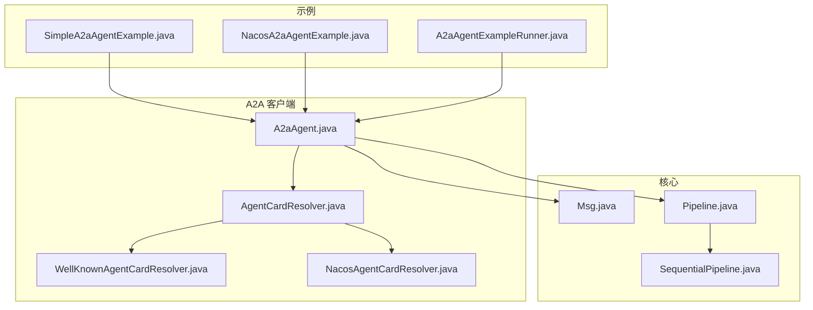
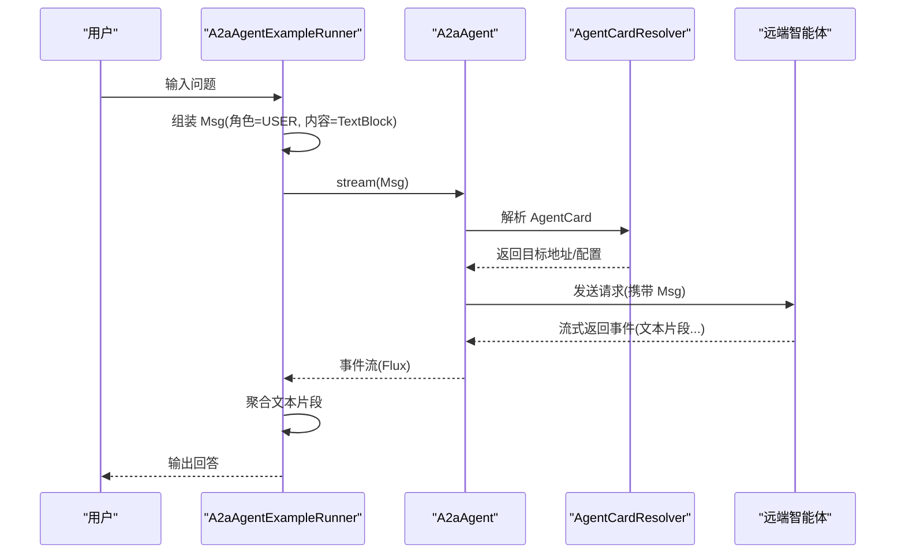
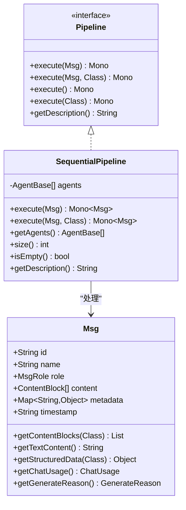
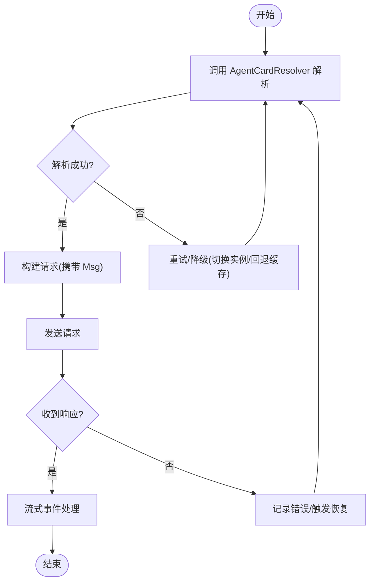
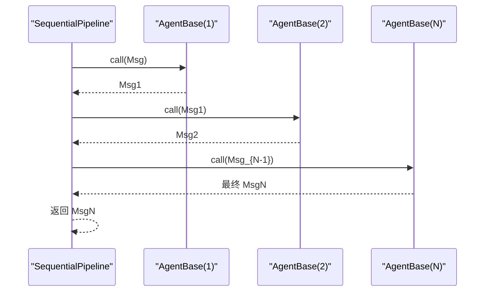
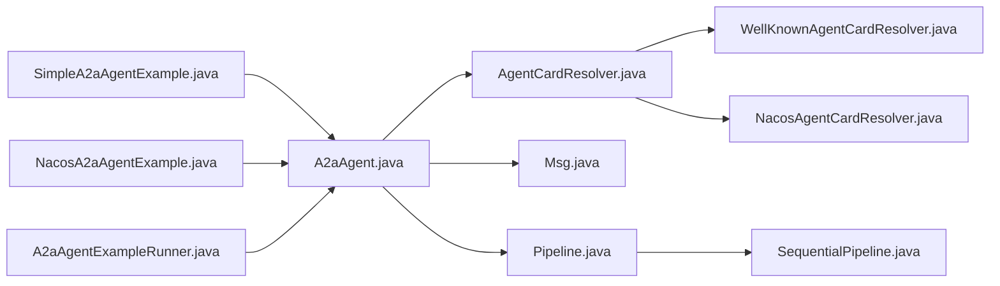

# 多智能体协作

<cite>
**本文引用的文件**
- [A2aAgent.java](file://agentscope-extensions/agentscope-extensions-a2a/agentscope-extensions-a2a-client/src/main/java/io/agentscope/core/a2a/agent/A2aAgent.java)
- [AgentCardResolver.java](file://agentscope-extensions/agentscope-extensions-a2a/agentscope-extensions-a2a-client/src/main/java/io/agentscope/core/a2a/agent/card/AgentCardResolver.java)
- [WellKnownAgentCardResolver.java](file://agentscope-extensions/agentscope-extensions-a2a/agentscope-extensions-a2a-client/src/main/java/io/agentscope/core/a2a/agent/card/WellKnownAgentCardResolver.java)
- [NacosAgentCardResolver.java](file://agentscope-extensions/agentscope-extensions-nacos/agentscope-extensions-nacos-a2a/src/main/java/io/agentscope/core/nacos/a2a/discovery/NacosAgentCardResolver.java)
- [A2aAgentExampleRunner.java](file://agentscope-examples/a2a/src/main/java/io/agentscope/examples/a2a/A2aAgentExampleRunner.java)
- [SimpleA2aAgentExample.java](file://agentscope-examples/a2a/src/main/java/io/agentscope/examples/a2a/SimpleA2aAgentExample.java)
- [NacosA2aAgentExample.java](file://agentscope-examples/a2a/src/main/java/io/agentscope/examples/a2a/NacosA2aAgentExample.java)
- [Msg.java](file://agentscope-core/src/main/java/io/agentscope/core/message/Msg.java)
- [Pipeline.java](file://agentscope-core/src/main/java/io/agentscope/core/pipeline/Pipeline.java)
- [SequentialPipeline.java](file://agentscope-core/src/main/java/io/agentscope/core/pipeline/SequentialPipeline.java)
</cite>

## 目录
1. [引言](#引言)
2. [项目结构](#项目结构)
3. [核心组件](#核心组件)
4. [架构总览](#架构总览)
5. [详细组件分析](#详细组件分析)
6. [依赖分析](#依赖分析)
7. [性能考虑](#性能考虑)
8. [故障排查指南](#故障排查指南)
9. [结论](#结论)
10. [附录](#附录)

## 引言
本技术文档围绕 AgentScope Java 的多智能体协作能力展开，重点阐释 A2A（Agent-to-Agent）协议的设计理念与通信机制，覆盖消息格式、传输协议与安全机制；深入解析智能体发现与服务注册（AgentCard 解析与注册中心集成），以及心跳与故障恢复策略；阐述多智能体协作模式（任务分配、结果合并、冲突解决）、分布式协调（一致性、事务与状态同步）；并通过完整示例路径展示智能体间通信、协作与编排；最后给出性能优化、监控诊断与故障排查的最佳实践。

## 项目结构
AgentScope 采用分层与功能模块化组织：核心框架在 agentscope-core，A2A 客户端与扩展在 agentscope-extensions，示例工程在 agentscope-examples。A2A 示例位于 agentscope-examples/a2a，包含本地直连与 Nacos 注册中心两种 AgentCard 发现方式。

**图表来源**
- [SimpleA2aAgentExample.java:1-45](file://agentscope-examples/a2a/src/main/java/io/agentscope/examples/a2a/SimpleA2aAgentExample.java#L1-L45)
- [NacosA2aAgentExample.java:1-69](file://agentscope-examples/a2a/src/main/java/io/agentscope/examples/a2a/NacosA2aAgentExample.java#L1-L69)
- [A2aAgentExampleRunner.java:1-102](file://agentscope-examples/a2a/src/main/java/io/agentscope/examples/a2a/A2aAgentExampleRunner.java#L1-L102)
- [A2aAgent.java](file://agentscope-extensions/agentscope-extensions-a2a/agentscope-extensions-a2a-client/src/main/java/io/agentscope/core/a2a/agent/A2aAgent.java)
- [AgentCardResolver.java](file://agentscope-extensions/agentscope-extensions-a2a/agentscope-extensions-a2a-client/src/main/java/io/agentscope/core/a2a/agent/card/AgentCardResolver.java)
- [WellKnownAgentCardResolver.java](file://agentscope-extensions/agentscope-extensions-a2a/agentscope-extensions-a2a-client/src/main/java/io/agentscope/core/a2a/agent/card/WellKnownAgentCardResolver.java)
- [NacosAgentCardResolver.java](file://agentscope-extensions/agentscope-extensions-nacos/agentscope-extensions-nacos-a2a/src/main/java/io/agentscope/core/nacos/a2a/discovery/NacosAgentCardResolver.java)
- [Msg.java:1-656](file://agentscope-core/src/main/java/io/agentscope/core/message/Msg.java#L1-L656)
- [Pipeline.java:1-76](file://agentscope-core/src/main/java/io/agentscope/core/pipeline/Pipeline.java#L1-L76)
- [SequentialPipeline.java:1-186](file://agentscope-core/src/main/java/io/agentscope/core/pipeline/SequentialPipeline.java#L1-L186)

**章节来源**
- [SimpleA2aAgentExample.java:1-45](file://agentscope-examples/a2a/src/main/java/io/agentscope/examples/a2a/SimpleA2aAgentExample.java#L1-L45)
- [NacosA2aAgentExample.java:1-69](file://agentscope-examples/a2a/src/main/java/io/agentscope/examples/a2a/NacosA2aAgentExample.java#L1-L69)
- [A2aAgentExampleRunner.java:1-102](file://agentscope-examples/a2a/src/main/java/io/agentscope/examples/a2a/A2aAgentExampleRunner.java#L1-L102)

## 核心组件
- A2aAgent：面向应用的 A2A 协议客户端，负责通过 AgentCard 解析器定位远程智能体，封装消息发送与流式响应处理。
- AgentCardResolver 及其实现：抽象智能体发现接口，支持“已知地址直连”与“Nacos 注册中心”两种解析策略。
- 消息模型 Msg：统一的消息载体，支持多种内容块（文本、图像、工具调用等），并提供结构化输出与使用统计元数据访问。
- 管道与流水线：Pipeline 接口与 SequentialPipeline 实现，支撑多智能体串行编排与结构化输出。

**章节来源**
- [A2aAgent.java](file://agentscope-extensions/agentscope-extensions-a2a/agentscope-extensions-a2a-client/src/main/java/io/agentscope/core/a2a/agent/A2aAgent.java)
- [AgentCardResolver.java](file://agentscope-extensions/agentscope-extensions-a2a/agentscope-extensions-a2a-client/src/main/java/io/agentscope/core/a2a/agent/card/AgentCardResolver.java)
- [WellKnownAgentCardResolver.java](file://agentscope-extensions/agentscope-extensions-a2a/agentscope-extensions-a2a-client/src/main/java/io/agentscope/core/a2a/agent/card/WellKnownAgentCardResolver.java)
- [NacosAgentCardResolver.java](file://agentscope-extensions/agentscope-extensions-nacos/agentscope-extensions-nacos-a2a/src/main/java/io/agentscope/core/nacos/a2a/discovery/NacosAgentCardResolver.java)
- [Msg.java:1-656](file://agentscope-core/src/main/java/io/agentscope/core/message/Msg.java#L1-L656)
- [Pipeline.java:1-76](file://agentscope-core/src/main/java/io/agentscope/core/pipeline/Pipeline.java#L1-L76)
- [SequentialPipeline.java:1-186](file://agentscope-core/src/main/java/io/agentscope/core/pipeline/SequentialPipeline.java#L1-L186)

## 架构总览
下图展示了 A2A 协议在示例中的端到端交互：客户端通过 A2aAgent 发起请求，借助 AgentCardResolver 解析目标智能体地址，随后以 Msg 作为消息载体进行通信；示例运行器对流式事件进行拼接输出。

**图表来源**
- [A2aAgentExampleRunner.java:78-100](file://agentscope-examples/a2a/src/main/java/io/agentscope/examples/a2a/A2aAgentExampleRunner.java#L78-L100)
- [A2aAgent.java](file://agentscope-extensions/agentscope-extensions-a2a/agentscope-extensions-a2a-client/src/main/java/io/agentscope/core/a2a/agent/A2aAgent.java)
- [AgentCardResolver.java](file://agentscope-extensions/agentscope-extensions-a2a/agentscope-extensions-a2a-client/src/main/java/io/agentscope/core/a2a/agent/card/AgentCardResolver.java)
- [Msg.java:1-656](file://agentscope-core/src/main/java/io/agentscope/core/message/Msg.java#L1-L656)

## 详细组件分析

### A2A 协议与消息模型
- 设计理念
  - 以消息为中心：所有跨智能体通信均封装为 Msg，确保内容类型与元数据一致化管理。
  - 流式传输：结合 Reactor Flux/Mono 支持增量输出与实时拼接，适用于长文本生成与工具调用过程。
  - 结构化输出：消息元数据支持结构化输出与使用统计，便于上层决策与成本控制。
- 消息格式
  - 基本字段：唯一 ID、名称、发送者角色、内容块列表、元数据、时间戳。
  - 内容块：文本、图像、音频、视频、思考内容、工具调用与工具结果等。
  - 元数据键：如结构化输出键、生成原因、使用统计等。
- 传输协议
  - 示例中通过 AgentCardResolver 解析目标地址后发起请求；具体传输细节由 A2A 客户端实现负责（例如基于 HTTP/JSON 或特定二进制协议）。
- 安全机制
  - 通过注册中心（如 Nacos）或受控的已知地址（如 http://host:port）进行 AgentCard 解析，避免直接暴露内部网络拓扑。
  - 建议在生产环境配合 TLS、鉴权与访问控制策略。

**图表来源**
- [Msg.java:53-656](file://agentscope-core/src/main/java/io/agentscope/core/message/Msg.java#L53-L656)
- [Pipeline.java:29-76](file://agentscope-core/src/main/java/io/agentscope/core/pipeline/Pipeline.java#L29-L76)
- [SequentialPipeline.java:39-186](file://agentscope-core/src/main/java/io/agentscope/core/pipeline/SequentialPipeline.java#L39-L186)

**章节来源**
- [Msg.java:1-656](file://agentscope-core/src/main/java/io/agentscope/core/message/Msg.java#L1-L656)
- [Pipeline.java:1-76](file://agentscope-core/src/main/java/io/agentscope/core/pipeline/Pipeline.java#L1-L76)
- [SequentialPipeline.java:1-186](file://agentscope-core/src/main/java/io/agentscope/core/pipeline/SequentialPipeline.java#L1-L186)

### 智能体发现与服务注册
- AgentCardResolver 抽象
  - 负责根据智能体标识解析其可访问的地址与参数，屏蔽底层注册中心差异。
- 已知地址直连
  - WellKnownAgentCardResolver：通过固定基础 URL 构建解析器，适合开发与测试场景。
- 注册中心集成
  - NacosAgentCardResolver：基于 Nacos 客户端动态发现智能体实例，支持认证与集群配置。
- 心跳与故障恢复
  - 建议在注册中心侧启用健康检查与实例剔除；客户端侧实现重试与降级策略（例如切换备用实例、缓存最近一次成功解析结果）。

**图表来源**
- [AgentCardResolver.java](file://agentscope-extensions/agentscope-extensions-a2a/agentscope-extensions-a2a-client/src/main/java/io/agentscope/core/a2a/agent/card/AgentCardResolver.java)
- [WellKnownAgentCardResolver.java](file://agentscope-extensions/agentscope-extensions-a2a/agentscope-extensions-a2a-client/src/main/java/io/agentscope/core/a2a/agent/card/WellKnownAgentCardResolver.java)
- [NacosAgentCardResolver.java](file://agentscope-extensions/agentscope-extensions-nacos/agentscope-extensions-nacos-a2a/src/main/java/io/agentscope/core/nacos/a2a/discovery/NacosAgentCardResolver.java)

**章节来源**
- [AgentCardResolver.java](file://agentscope-extensions/agentscope-extensions-a2a/agentscope-extensions-a2a-client/src/main/java/io/agentscope/core/a2a/agent/card/AgentCardResolver.java)
- [WellKnownAgentCardResolver.java](file://agentscope-extensions/agentscope-extensions-a2a/agentscope-extensions-a2a-client/src/main/java/io/agentscope/core/a2a/agent/card/WellKnownAgentCardResolver.java)
- [NacosAgentCardResolver.java](file://agentscope-extensions/agentscope-extensions-nacos/agentscope-extensions-nacos-a2a/src/main/java/io/agentscope/core/nacos/a2a/discovery/NacosAgentCardResolver.java)

### 多智能体协作模式与策略
- 串行编排（SequentialPipeline）
  - 将多个智能体按顺序串联，前一个智能体的输出作为下一个智能体的输入，最后一个智能体可选择结构化输出。
  - 适用于“思考—行动—总结”的典型工作流。
- 并行与分支（扩展建议）
  - 可基于 Fanout/Join 模式实现并行分支与结果聚合；需关注冲突解决与去重策略。
- 结果合并与冲突解决
  - 对于多源输出，建议引入“优先级+投票+仲裁”机制；对重复信息进行去重与上下文关联。
- 任务分配
  - 基于智能体能力标签与负载均衡策略进行路由；失败时自动切换与补偿。

**图表来源**
- [SequentialPipeline.java:54-94](file://agentscope-core/src/main/java/io/agentscope/core/pipeline/SequentialPipeline.java#L54-L94)

**章节来源**
- [SequentialPipeline.java:1-186](file://agentscope-core/src/main/java/io/agentscope/core/pipeline/SequentialPipeline.java#L1-L186)
- [Pipeline.java:1-76](file://agentscope-core/src/main/java/io/agentscope/core/pipeline/Pipeline.java#L1-L76)

### 分布式协调机制
- 一致性保证
  - 通过幂等消息 ID 与事件序号确保消息可追踪；对关键操作引入“写前日志/快照”策略。
- 事务处理
  - 对跨智能体的复合动作采用两阶段提交或 Saga 模式，失败时执行补偿。
- 状态同步
  - 使用会话与状态模块（State/Session）持久化中间态；在注册中心与存储层之间保持最终一致。

[本节为概念性说明，不直接分析具体文件，故不列出章节来源]

## 依赖分析
- 示例与客户端
  - SimpleA2aAgentExample 与 NacosA2aAgentExample 通过 A2aAgent 进行演示；A2aAgent 依赖 AgentCardResolver。
- 客户端与核心
  - A2aAgent 与 Msg、Pipeline/SequentialPipeline 形成紧密耦合，前者负责外部交互，后者负责内部编排。
- 扩展与注册中心
  - WellKnownAgentCardResolver 与 NacosAgentCardResolver 都实现 AgentCardResolver 接口，解耦不同发现策略。

**图表来源**
- [SimpleA2aAgentExample.java:1-45](file://agentscope-examples/a2a/src/main/java/io/agentscope/examples/a2a/SimpleA2aAgentExample.java#L1-L45)
- [NacosA2aAgentExample.java:1-69](file://agentscope-examples/a2a/src/main/java/io/agentscope/examples/a2a/NacosA2aAgentExample.java#L1-L69)
- [A2aAgentExampleRunner.java:1-102](file://agentscope-examples/a2a/src/main/java/io/agentscope/examples/a2a/A2aAgentExampleRunner.java#L1-L102)
- [A2aAgent.java](file://agentscope-extensions/agentscope-extensions-a2a/agentscope-extensions-a2a-client/src/main/java/io/agentscope/core/a2a/agent/A2aAgent.java)
- [AgentCardResolver.java](file://agentscope-extensions/agentscope-extensions-a2a/agentscope-extensions-a2a-client/src/main/java/io/agentscope/core/a2a/agent/card/AgentCardResolver.java)
- [WellKnownAgentCardResolver.java](file://agentscope-extensions/agentscope-extensions-a2a/agentscope-extensions-a2a-client/src/main/java/io/agentscope/core/a2a/agent/card/WellKnownAgentCardResolver.java)
- [NacosAgentCardResolver.java](file://agentscope-extensions/agentscope-extensions-nacos/agentscope-extensions-nacos-a2a/src/main/java/io/agentscope/core/nacos/a2a/discovery/NacosAgentCardResolver.java)
- [Msg.java:1-656](file://agentscope-core/src/main/java/io/agentscope/core/message/Msg.java#L1-L656)
- [Pipeline.java:1-76](file://agentscope-core/src/main/java/io/agentscope/core/pipeline/Pipeline.java#L1-L76)
- [SequentialPipeline.java:1-186](file://agentscope-core/src/main/java/io/agentscope/core/pipeline/SequentialPipeline.java#L1-L186)

**章节来源**
- [A2aAgent.java](file://agentscope-extensions/agentscope-extensions-a2a/agentscope-extensions-a2a-client/src/main/java/io/agentscope/core/a2a/agent/A2aAgent.java)
- [AgentCardResolver.java](file://agentscope-extensions/agentscope-extensions-a2a/agentscope-extensions-a2a-client/src/main/java/io/agentscope/core/a2a/agent/card/AgentCardResolver.java)
- [WellKnownAgentCardResolver.java](file://agentscope-extensions/agentscope-extensions-a2a/agentscope-extensions-a2a-client/src/main/java/io/agentscope/core/a2a/agent/card/WellKnownAgentCardResolver.java)
- [NacosAgentCardResolver.java](file://agentscope-extensions/agentscope-extensions-nacos/agentscope-extensions-nacos-a2a/src/main/java/io/agentscope/core/nacos/a2a/discovery/NacosAgentCardResolver.java)
- [Msg.java:1-656](file://agentscope-core/src/main/java/io/agentscope/core/message/Msg.java#L1-L656)
- [Pipeline.java:1-76](file://agentscope-core/src/main/java/io/agentscope/core/pipeline/Pipeline.java#L1-L76)
- [SequentialPipeline.java:1-186](file://agentscope-core/src/main/java/io/agentscope/core/pipeline/SequentialPipeline.java#L1-L186)

## 性能考虑
- 流式传输与背压
  - 利用 Reactor 的背压策略控制事件速率，避免内存峰值；对长文本输出采用增量拼接。
- 缓存与预热
  - 对常用 AgentCard 解析结果进行短期缓存；对热点智能体建立连接池与预热。
- 负载均衡与熔断
  - 在注册中心侧启用权重与健康检查；客户端侧实现快速失败与指数退避重试。
- 序列化与压缩
  - 优先使用紧凑的 JSON/NDJSON 格式；对大对象启用压缩传输。
- 监控与可观测性
  - 记录消息往返时间、吞吐量与错误率；对结构化输出与使用统计进行埋点。

[本节提供通用指导，不直接分析具体文件，故不列出章节来源]

## 故障排查指南
- AgentCard 解析失败
  - 检查基础 URL 或 Nacos 地址是否正确；确认认证参数与网络连通性。
- 流式输出异常
  - 核对服务端流式格式头与客户端解析逻辑；关注空事件与最后一帧处理。
- 结构化输出缺失
  - 确认消息元数据中存在结构化输出键；检查目标类字段与 JSON Schema 匹配度。
- 性能瓶颈
  - 关注背压与缓冲队列长度；评估序列化开销与网络延迟。

**章节来源**
- [A2aAgentExampleRunner.java:78-100](file://agentscope-examples/a2a/src/main/java/io/agentscope/examples/a2a/A2aAgentExampleRunner.java#L78-L100)
- [Msg.java:267-291](file://agentscope-core/src/main/java/io/agentscope/core/message/Msg.java#L267-L291)

## 结论
AgentScope 的 A2A 协议以消息为核心，结合灵活的 AgentCard 解析与流式传输，提供了高扩展性的多智能体协作平台。通过注册中心与本地直连两种发现策略，配合结构化输出与使用统计，能够满足从开发测试到生产部署的多样化需求。建议在生产环境中完善安全、一致性与可观测性建设，并持续优化编排模式与性能指标。

## 附录
- 示例入口
  - 本地直连示例：[SimpleA2aAgentExample.java:31-43](file://agentscope-examples/a2a/src/main/java/io/agentscope/examples/a2a/SimpleA2aAgentExample.java#L31-L43)
  - Nacos 注册中心示例：[NacosA2aAgentExample.java:40-51](file://agentscope-examples/a2a/src/main/java/io/agentscope/examples/a2a/NacosA2aAgentExample.java#L40-L51)
- 运行器与交互
  - 示例运行器：[A2aAgentExampleRunner.java:49-76](file://agentscope-examples/a2a/src/main/java/io/agentscope/examples/a2a/A2aAgentExampleRunner.java#L49-L76)
- 消息与管道
  - 消息模型：[Msg.java:53-656](file://agentscope-core/src/main/java/io/agentscope/core/message/Msg.java#L53-L656)
  - 管道接口：[Pipeline.java:29-76](file://agentscope-core/src/main/java/io/agentscope/core/pipeline/Pipeline.java#L29-L76)
  - 串行流水线：[SequentialPipeline.java:39-186](file://agentscope-core/src/main/java/io/agentscope/core/pipeline/SequentialPipeline.java#L39-L186)