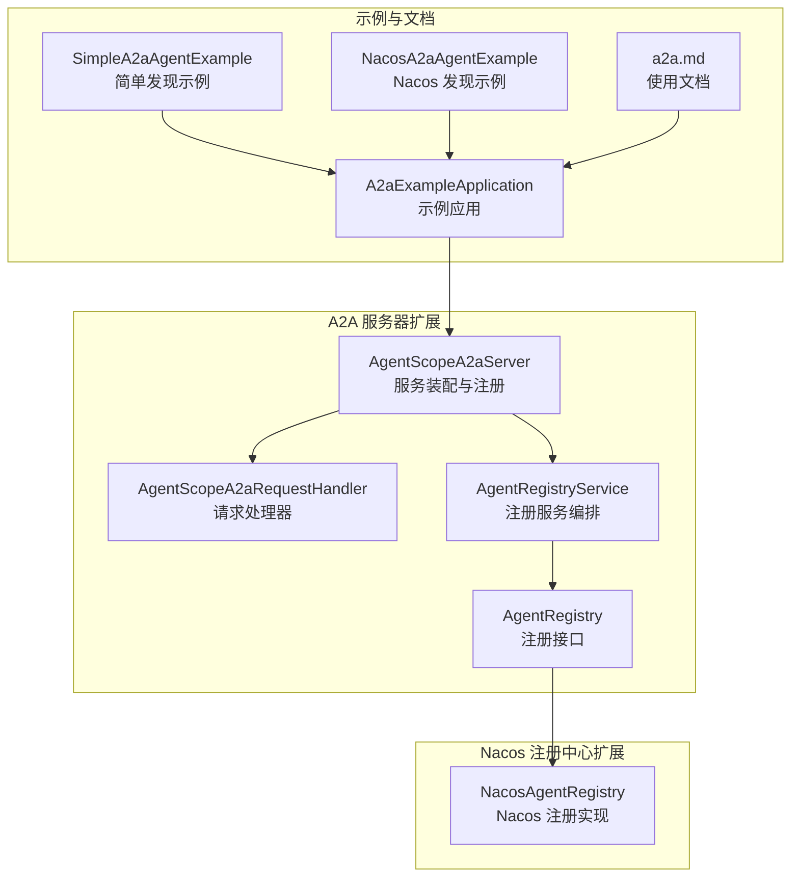
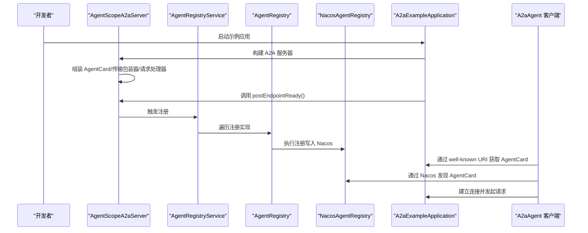
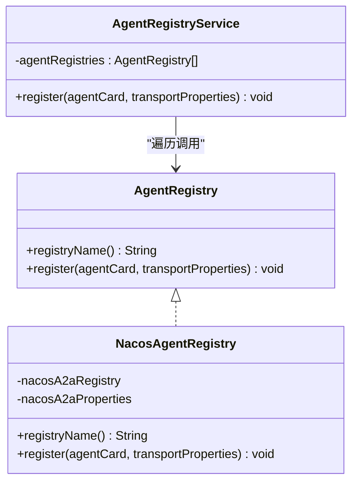
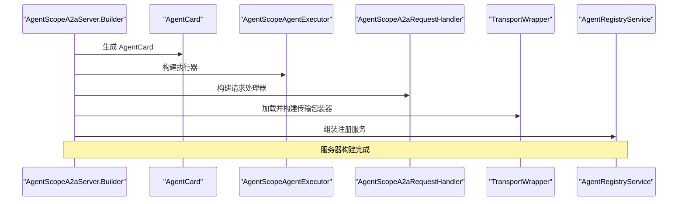
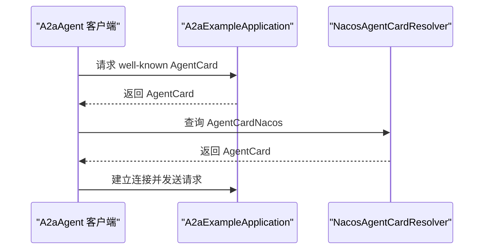
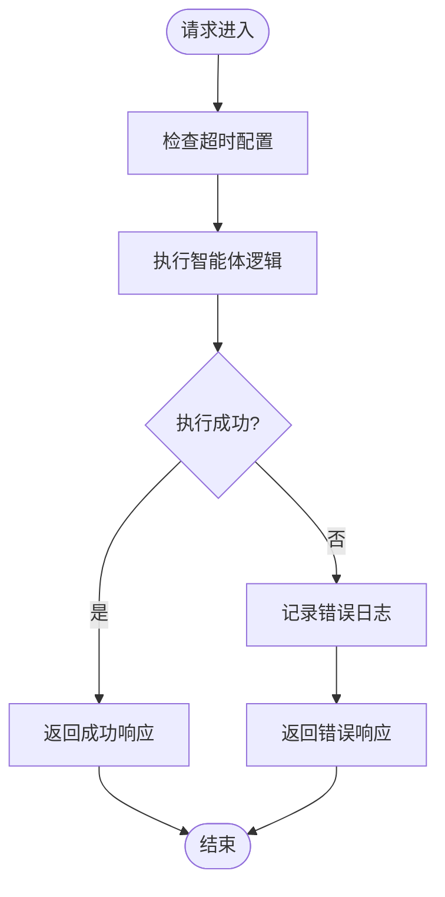
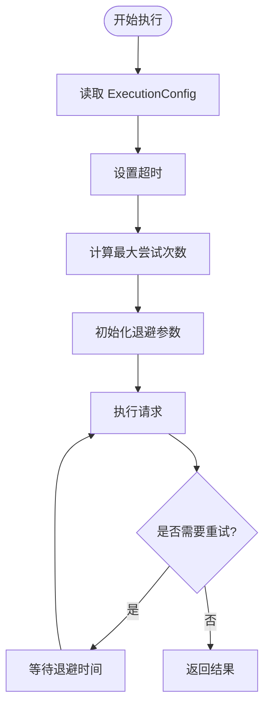
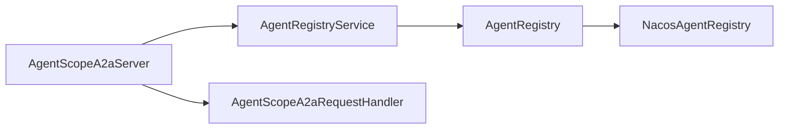

# 智能体发现与注册

<cite>
**本文引用的文件**
- [AgentScopeA2aServer.java](file://agentscope-extensions/agentscope-extensions-a2a/agentscope-extensions-a2a-server/src/main/java/io/agentscope/core/a2a/server/AgentScopeA2aServer.java)
- [AgentRegistry.java](file://agentscope-extensions/agentscope-extensions-a2a/agentscope-extensions-a2a-server/src/main/java/io/agentscope/core/a2a/server/registry/AgentRegistry.java)
- [AgentRegistryService.java](file://agentscope-extensions/agentscope-extensions-a2a/agentscope-extensions-a2a-server/src/main/java/io/agentscope/core/a2a/server/registry/AgentRegistryService.java)
- [NacosAgentRegistry.java](file://agentscope-extensions/agentscope-extensions-nacos/agentscope-extensions-nacos-a2a/src/main/java/io/agentscope/core/nacos/a2a/registry/NacosAgentRegistry.java)
- [AgentScopeA2aRequestHandler.java](file://agentscope-extensions/agentscope-extensions-a2a/agentscope-extensions-a2a-server/src/main/java/io/agentscope/core/a2a/server/request/AgentScopeA2aRequestHandler.java)
- [A2aExampleApplication.java](file://agentscope-examples/a2a/src/main/java/io/agentscope/examples/a2a/A2aExampleApplication.java)
- [SimpleA2aAgentExample.java](file://agentscope-examples/a2a/src/main/java/io/agentscope/examples/a2a/SimpleA2aAgentExample.java)
- [NacosA2aAgentExample.java](file://agentscope-examples/a2a/src/main/java/io/agentscope/examples/a2a/NacosA2aAgentExample.java)
- [a2a.md](file://docs/zh/task/a2a.md)
- [ExecutionConfig.java](file://agentscope-core/src/main/java/io/agentscope/core/model/ExecutionConfig.java)
</cite>

## 目录
1. [引言](#引言)
2. [项目结构](#项目结构)
3. [核心组件](#核心组件)
4. [架构总览](#架构总览)
5. [详细组件分析](#详细组件分析)
6. [依赖分析](#依赖分析)
7. [性能考虑](#性能考虑)
8. [故障排查指南](#故障排查指南)
9. [结论](#结论)
10. [附录](#附录)

## 引言
本技术文档围绕智能体发现与注册系统展开，重点解释以下方面：
- 智能体注册表的实现原理：服务注册、心跳检测与健康检查机制
- A2A 服务器的架构设计：服务监听、请求处理与负载均衡
- 智能体发现算法：广播机制、多播通信与 DNS 解析
- 故障检测与恢复策略：超时处理、重试机制与降级策略
- 完整的代码示例路径：如何注册智能体、发现可用服务并建立连接
- 分布式环境下的协调机制、一致性保证与性能监控

## 项目结构
本仓库采用模块化组织，与 A2A 发现与注册相关的关键模块如下：
- agentscope-extensions-a2a：A2A 服务器核心实现（服务组装、注册、请求处理）
- agentscope-extensions-nacos-a2a：基于 Nacos 的智能体注册与发现
- agentscope-examples/a2a：示例应用与客户端调用示例
- docs/zh/task/a2a.md：官方中文文档中的 A2A 使用说明与配置示例

**图表来源**
- [AgentScopeA2aServer.java:83-186](file://agentscope-extensions/agentscope-extensions-a2a/agentscope-extensions-a2a-server/src/main/java/io/agentscope/core/a2a/server/AgentScopeA2aServer.java#L83-L186)
- [AgentRegistryService.java:31-79](file://agentscope-extensions/agentscope-extensions-a2a/agentscope-extensions-a2a-server/src/main/java/io/agentscope/core/a2a/server/registry/AgentRegistryService.java#L31-L79)
- [AgentRegistry.java:23-42](file://agentscope-extensions/agentscope-extensions-a2a/agentscope-extensions-a2a-server/src/main/java/io/agentscope/core/a2a/server/registry/AgentRegistry.java#L23-L42)
- [NacosAgentRegistry.java:42-70](file://agentscope-extensions/agentscope-extensions-nacos/agentscope-extensions-nacos-a2a/src/main/java/io/agentscope/core/nacos/a2a/registry/NacosAgentRegistry.java#L42-L70)
- [A2aExampleApplication.java:25-75](file://agentscope-examples/a2a/src/main/java/io/agentscope/examples/a2a/A2aExampleApplication.java#L25-L75)
- [SimpleA2aAgentExample.java:23-44](file://agentscope-examples/a2a/src/main/java/io/agentscope/examples/a2a/SimpleA2aAgentExample.java#L23-L44)
- [NacosA2aAgentExample.java:28-68](file://agentscope-examples/a2a/src/main/java/io/agentscope/examples/a2a/NacosA2aAgentExample.java#L28-L68)
- [a2a.md:232-271](file://docs/zh/task/a2a.md#L232-L271)

**章节来源**
- [AgentScopeA2aServer.java:54-81](file://agentscope-extensions/agentscope-extensions-a2a/agentscope-extensions-a2a-server/src/main/java/io/agentscope/core/a2a/server/AgentScopeA2aServer.java#L54-L81)
- [A2aExampleApplication.java:25-75](file://agentscope-examples/a2a/src/main/java/io/agentscope/examples/a2a/A2aExampleApplication.java#L25-L75)

## 核心组件
- AgentScopeA2aServer：A2A 服务器装配器，负责构建 AgentCard、请求处理器、传输包装器，并在端点就绪后触发注册
- AgentRegistryService：注册服务编排器，遍历所有注册实现执行注册
- AgentRegistry：注册接口，定义注册行为
- NacosAgentRegistry：基于 Nacos 的注册实现，负责将 AgentCard 与传输属性写入 Nacos
- AgentScopeA2aRequestHandler：请求处理器包装器，默认注入任务存储、队列管理、推送通知等能力，并设置默认超时
- 示例应用与客户端：演示如何通过本地 well-known URI 或 Nacos 发现并调用远程智能体

**章节来源**
- [AgentScopeA2aServer.java:83-186](file://agentscope-extensions/agentscope-extensions-a2a/agentscope-extensions-a2a-server/src/main/java/io/agentscope/core/a2a/server/AgentScopeA2aServer.java#L83-L186)
- [AgentRegistry.java:23-42](file://agentscope-extensions/agentscope-extensions-a2a/agentscope-extensions-a2a-server/src/main/java/io/agentscope/core/a2a/server/registry/AgentRegistry.java#L23-L42)
- [AgentRegistryService.java:31-79](file://agentscope-extensions/agentscope-extensions-a2a/agentscope-extensions-a2a-server/src/main/java/io/agentscope/core/a2a/server/registry/AgentRegistryService.java#L31-L79)
- [NacosAgentRegistry.java:42-70](file://agentscope-extensions/agentscope-extensions-nacos/agentscope-extensions-nacos-a2a/src/main/java/io/agentscope/core/nacos/a2a/registry/NacosAgentRegistry.java#L42-L70)
- [AgentScopeA2aRequestHandler.java:39-149](file://agentscope-extensions/agentscope-extensions-a2a/agentscope-extensions-a2a-server/src/main/java/io/agentscope/core/a2a/server/request/AgentScopeA2aRequestHandler.java#L39-L149)

## 架构总览
下图展示了从智能体启动到注册、发现与调用的总体流程。

**图表来源**
- [AgentScopeA2aServer.java:161-163](file://agentscope-extensions/agentscope-extensions-a2a/agentscope-extensions-a2a-server/src/main/java/io/agentscope/core/a2a/server/AgentScopeA2aServer.java#L161-L163)
- [AgentRegistryService.java:47-55](file://agentscope-extensions/agentscope-extensions-a2a/agentscope-extensions-a2a-server/src/main/java/io/agentscope/core/a2a/server/registry/AgentRegistryService.java#L47-L55)
- [NacosAgentRegistry.java:64-70](file://agentscope-extensions/agentscope-extensions-nacos/agentscope-extensions-nacos-a2a/src/main/java/io/agentscope/core/nacos/a2a/registry/NacosAgentRegistry.java#L64-L70)
- [A2aExampleApplication.java:31-74](file://agentscope-examples/a2a/src/main/java/io/agentscope/examples/a2a/A2aExampleApplication.java#L31-L74)

## 详细组件分析

### 服务注册与注册表
- AgentRegistry 接口定义了注册名称与注册方法
- AgentRegistryService 提供统一的注册编排，遍历所有注册实现并执行注册
- NacosAgentRegistry 将 AgentCard 与传输属性转换为 Nacos 可识别的格式，支持覆盖首选传输协议与 TLS 等属性

**图表来源**
- [AgentRegistry.java:23-42](file://agentscope-extensions/agentscope-extensions-a2a/agentscope-extensions-a2a-server/src/main/java/io/agentscope/core/a2a/server/registry/AgentRegistry.java#L23-L42)
- [AgentRegistryService.java:31-79](file://agentscope-extensions/agentscope-extensions-a2a/agentscope-extensions-a2a-server/src/main/java/io/agentscope/core/a2a/server/registry/AgentRegistryService.java#L31-L79)
- [NacosAgentRegistry.java:42-70](file://agentscope-extensions/agentscope-extensions-nacos/agentscope-extensions-nacos-a2a/src/main/java/io/agentscope/core/nacos/a2a/registry/NacosAgentRegistry.java#L42-L70)

**章节来源**
- [AgentRegistry.java:23-42](file://agentscope-extensions/agentscope-extensions-a2a/agentscope-extensions-a2a-server/src/main/java/io/agentscope/core/a2a/server/registry/AgentRegistry.java#L23-L42)
- [AgentRegistryService.java:47-78](file://agentscope-extensions/agentscope-extensions-a2a/agentscope-extensions-a2a-server/src/main/java/io/agentscope/core/a2a/server/registry/AgentRegistryService.java#L47-L78)
- [NacosAgentRegistry.java:64-70](file://agentscope-extensions/agentscope-extensions-nacos/agentscope-extensions-nacos-a2a/src/main/java/io/agentscope/core/nacos/a2a/registry/NacosAgentRegistry.java#L64-L70)

### A2A 服务器装配与请求处理
- AgentScopeA2aServer 负责：
  - 构建 AgentCard（可由 ConfigurableAgentCard 生成）
  - 组装 AgentScopeA2aRequestHandler
  - 加载并构建传输包装器（TransportWrapper），支持 JSONRPC 等
  - 在端点就绪后调用注册服务完成注册
- AgentScopeA2aRequestHandler 默认注入内存任务存储、队列管理与推送通知，并设置默认超时

**图表来源**
- [AgentScopeA2aServer.java:363-418](file://agentscope-extensions/agentscope-extensions-a2a/agentscope-extensions-a2a-server/src/main/java/io/agentscope/core/a2a/server/AgentScopeA2aServer.java#L363-L418)
- [AgentScopeA2aRequestHandler.java:92-124](file://agentscope-extensions/agentscope-extensions-a2a/agentscope-extensions-a2a-server/src/main/java/io/agentscope/core/a2a/server/request/AgentScopeA2aRequestHandler.java#L92-L124)

**章节来源**
- [AgentScopeA2aServer.java:363-418](file://agentscope-extensions/agentscope-extensions-a2a/agentscope-extensions-a2a-server/src/main/java/io/agentscope/core/a2a/server/AgentScopeA2aServer.java#L363-L418)
- [AgentScopeA2aRequestHandler.java:92-149](file://agentscope-extensions/agentscope-extensions-a2a/agentscope-extensions-a2a-server/src/main/java/io/agentscope/core/a2a/server/request/AgentScopeA2aRequestHandler.java#L92-L149)

### 智能体发现与调用
- 本地发现：通过 well-known URI 获取 AgentCard，然后直接调用
- Nacos 发现：通过 NacosAgentCardResolver 从注册中心解析 AgentCard
- 示例应用展示了两种方式的使用路径

**图表来源**
- [SimpleA2aAgentExample.java:32-42](file://agentscope-examples/a2a/src/main/java/io/agentscope/examples/a2a/SimpleA2aAgentExample.java#L32-L42)
- [NacosA2aAgentExample.java:40-51](file://agentscope-examples/a2a/src/main/java/io/agentscope/examples/a2a/NacosA2aAgentExample.java#L40-L51)
- [A2aExampleApplication.java:31-74](file://agentscope-examples/a2a/src/main/java/io/agentscope/examples/a2a/A2aExampleApplication.java#L31-L74)

**章节来源**
- [SimpleA2aAgentExample.java:23-44](file://agentscope-examples/a2a/src/main/java/io/agentscope/examples/a2a/SimpleA2aAgentExample.java#L23-L44)
- [NacosA2aAgentExample.java:28-68](file://agentscope-examples/a2a/src/main/java/io/agentscope/examples/a2a/NacosA2aAgentExample.java#L28-L68)
- [A2aExampleApplication.java:31-74](file://agentscope-examples/a2a/src/main/java/io/agentscope/examples/a2a/A2aExampleApplication.java#L31-L74)

### 心跳检测与健康检查机制
- 当前代码未直接暴露显式的“心跳”或“健康检查”接口；注册与请求处理通过 AgentRegistryService 与 AgentScopeA2aRequestHandler 实现
- 健康检查可通过请求处理器的超时与异常处理体现：请求处理器默认设置超时，异常会被记录并返回错误响应

**图表来源**
- [AgentScopeA2aRequestHandler.java:133-148](file://agentscope-extensions/agentscope-extensions-a2a/agentscope-extensions-a2a-server/src/main/java/io/agentscope/core/a2a/server/request/AgentScopeA2aRequestHandler.java#L133-L148)

**章节来源**
- [AgentScopeA2aRequestHandler.java:133-148](file://agentscope-extensions/agentscope-extensions-a2a/agentscope-extensions-a2a-server/src/main/java/io/agentscope/core/a2a/server/request/AgentScopeA2aRequestHandler.java#L133-L148)

### 负载均衡与多实例部署
- 服务器通过 TransportWrapper 支持多种传输协议（如 JSONRPC），但当前示例侧重于单实例启动
- 多实例部署建议：将多个 AgentScopeA2aServer 实例注册到同一注册中心（如 Nacos），客户端通过注册中心选择可用实例

**章节来源**
- [AgentScopeA2aServer.java:386-400](file://agentscope-extensions/agentscope-extensions-a2a/agentscope-extensions-a2a-server/src/main/java/io/agentscope/core/a2a/server/AgentScopeA2aServer.java#L386-L400)

### 广播机制、多播通信与 DNS 解析
- 代码中未发现显式的“广播”或“多播”实现
- DNS 解析与多播通信通常由底层传输层或注册中心（如 Nacos）提供；本项目通过 NacosAgentCardResolver 进行服务发现

**章节来源**
- [NacosAgentRegistry.java:132-134](file://agentscope-extensions/agentscope-extensions-nacos/agentscope-extensions-nacos-a2a/src/main/java/io/agentscope/core/nacos/a2a/registry/NacosAgentRegistry.java#L132-L134)

### 故障检测与恢复策略
- 超时处理：请求处理器通过反射设置默认超时参数，避免阻塞导致的立即失败
- 重试机制：核心模型层提供 ExecutionConfig，支持超时、最大尝试次数、初始退避、最大退避与退避倍数等配置
- 降级策略：当传输包装器构建失败或无可用传输时，服务器会记录警告并跳过该传输

**图表来源**
- [ExecutionConfig.java:172-394](file://agentscope-core/src/main/java/io/agentscope/core/model/ExecutionConfig.java#L172-L394)
- [AgentScopeA2aRequestHandler.java:133-148](file://agentscope-extensions/agentscope-extensions-a2a/agentscope-extensions-a2a-server/src/main/java/io/agentscope/core/a2a/server/request/AgentScopeA2aRequestHandler.java#L133-L148)

**章节来源**
- [ExecutionConfig.java:172-394](file://agentscope-core/src/main/java/io/agentscope/core/model/ExecutionConfig.java#L172-L394)
- [AgentScopeA2aRequestHandler.java:133-148](file://agentscope-extensions/agentscope-extensions-a2a/agentscope-extensions-a2a-server/src/main/java/io/agentscope/core/a2a/server/request/AgentScopeA2aRequestHandler.java#L133-L148)

## 依赖分析
- AgentScopeA2aServer 依赖 AgentRegistryService、AgentScopeA2aRequestHandler、TransportWrapper 等组件
- AgentRegistryService 依赖多个 AgentRegistry 实现（如 NacosAgentRegistry）
- NacosAgentRegistry 依赖 Nacos A2A 注册实现与传输属性解析器

**图表来源**
- [AgentScopeA2aServer.java:363-418](file://agentscope-extensions/agentscope-extensions-a2a/agentscope-extensions-a2a-server/src/main/java/io/agentscope/core/a2a/server/AgentScopeA2aServer.java#L363-L418)
- [AgentRegistryService.java:31-79](file://agentscope-extensions/agentscope-extensions-a2a/agentscope-extensions-a2a-server/src/main/java/io/agentscope/core/a2a/server/registry/AgentRegistryService.java#L31-L79)
- [NacosAgentRegistry.java:42-70](file://agentscope-extensions/agentscope-extensions-nacos/agentscope-extensions-nacos-a2a/src/main/java/io/agentscope/core/nacos/a2a/registry/NacosAgentRegistry.java#L42-L70)

**章节来源**
- [AgentScopeA2aServer.java:363-418](file://agentscope-extensions/agentscope-extensions-a2a/agentscope-extensions-a2a-server/src/main/java/io/agentscope/core/a2a/server/AgentScopeA2aServer.java#L363-L418)
- [AgentRegistryService.java:31-79](file://agentscope-extensions/agentscope-extensions-a2a/agentscope-extensions-a2a-server/src/main/java/io/agentscope/core/a2a/server/registry/AgentRegistryService.java#L31-L79)
- [NacosAgentRegistry.java:42-70](file://agentscope-extensions/agentscope-extensions-nacos/agentscope-extensions-nacos-a2a/src/main/java/io/agentscope/core/nacos/a2a/registry/NacosAgentRegistry.java#L42-L70)

## 性能考虑
- 传输包装器构建失败时会跳过该传输，避免影响整体可用性
- 请求处理器默认注入内存任务存储与队列管理，适合轻量场景；生产环境可替换为持久化实现以提升可靠性
- 超时参数通过反射设置默认值，建议在实际部署中根据业务需求进行配置

**章节来源**
- [AgentScopeA2aServer.java:401-483](file://agentscope-extensions/agentscope-extensions-a2a/agentscope-extensions-a2a-server/src/main/java/io/agentscope/core/a2a/server/AgentScopeA2aServer.java#L401-L483)
- [AgentScopeA2aRequestHandler.java:92-149](file://agentscope-extensions/agentscope-extensions-a2a/agentscope-extensions-a2a-server/src/main/java/io/agentscope/core/a2a/server/request/AgentScopeA2aRequestHandler.java#L92-L149)

## 故障排查指南
- 注册失败：检查注册实现是否正确构建，查看注册服务的日志输出
- 传输包装器构建失败：确认已加载正确的 TransportWrapperBuilder，检查部署属性与主机端口配置
- 请求超时：调整请求处理器的超时参数或优化后端执行逻辑
- Nacos 发现异常：确认 Nacos 客户端配置与网络连通性

**章节来源**
- [AgentRegistryService.java:65-78](file://agentscope-extensions/agentscope-extensions-a2a/agentscope-extensions-a2a-server/src/main/java/io/agentscope/core/a2a/server/registry/AgentRegistryService.java#L65-L78)
- [AgentScopeA2aServer.java:465-482](file://agentscope-extensions/agentscope-extensions-a2a/agentscope-extensions-a2a-server/src/main/java/io/agentscope/core/a2a/server/AgentScopeA2aServer.java#L465-L482)
- [AgentScopeA2aRequestHandler.java:133-148](file://agentscope-extensions/agentscope-extensions-a2a/agentscope-extensions-a2a-server/src/main/java/io/agentscope/core/a2a/server/request/AgentScopeA2aRequestHandler.java#L133-L148)

## 结论
本系统通过 AgentScopeA2aServer 统一装配智能体服务，借助 AgentRegistryService 编排注册流程，并以 NacosAgentRegistry 实现智能体注册与发现。请求处理通过 AgentScopeA2aRequestHandler 提供默认超时与异常处理。在分布式环境下，建议结合注册中心与传输层能力实现高可用与可扩展的服务发现与调用。

## 附录

### 代码示例路径
- 通过 Nacos 注册智能体并启动 A2A 服务器
  - [A2A 服务器构建与注册示例:232-271](file://docs/zh/task/a2a.md#L232-L271)
- 通过 well-known URI 发现并调用智能体
  - [简单发现示例入口:32-42](file://agentscope-examples/a2a/src/main/java/io/agentscope/examples/a2a/SimpleA2aAgentExample.java#L32-L42)
- 通过 Nacos 发现并调用智能体
  - [Nacos 发现示例入口:40-51](file://agentscope-examples/a2a/src/main/java/io/agentscope/examples/a2a/NacosA2aAgentExample.java#L40-L51)
- 示例应用主程序
  - [示例应用入口:79-81](file://agentscope-examples/a2a/src/main/java/io/agentscope/examples/a2a/A2aExampleApplication.java#L79-L81)