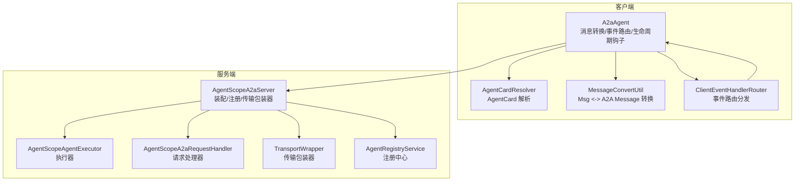
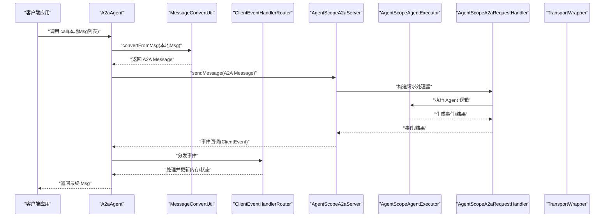
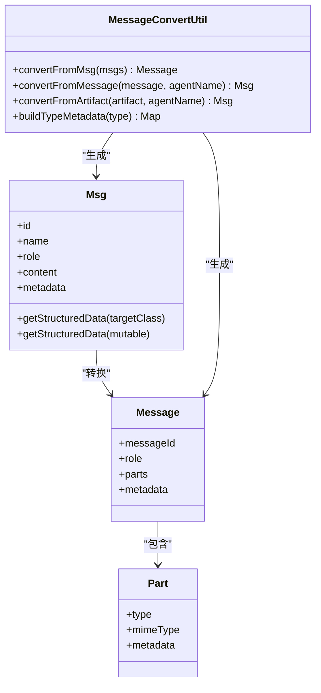
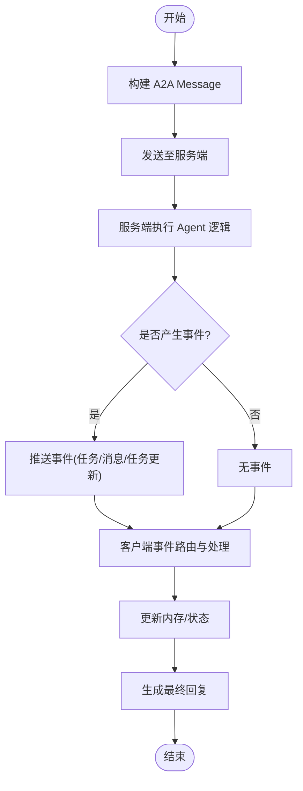
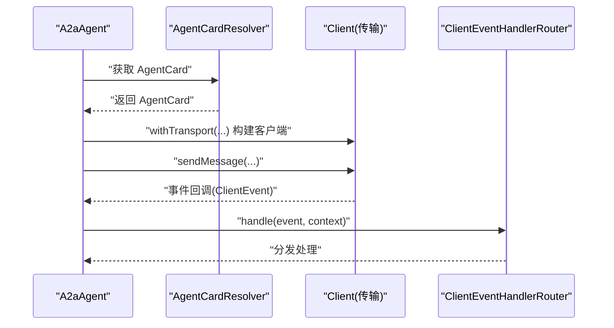
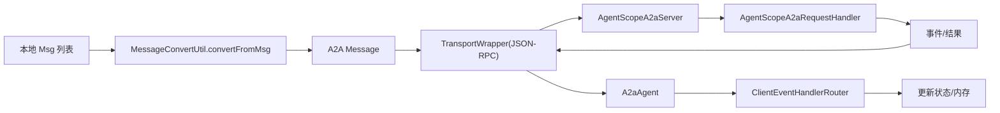
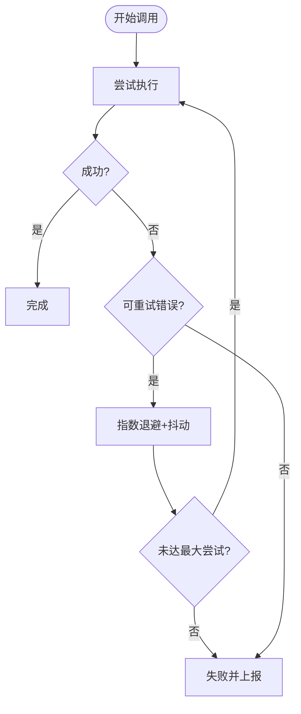
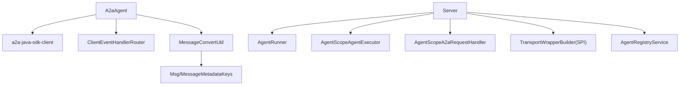

# 消息通信机制

<cite>
**本文引用的文件**   
- [A2aAgent.java](file://agentscope-extensions/agentscope-extensions-a2a/agentscope-extensions-a2a-client/src/main/java/io/agentscope/core/a2a/agent/A2aAgent.java)
- [AgentScopeA2aServer.java](file://agentscope-extensions/agentscope-extensions-a2a/agentscope-extensions-a2a-server/src/main/java/io/agentscope/core/a2a/server/AgentScopeA2aServer.java)
- [ClientEventHandlerRouter.java](file://agentscope-extensions/agentscope-extensions-a2a/agentscope-extensions-a2a-client/src/main/java/io/agentscope/core/a2a/agent/event/ClientEventHandlerRouter.java)
- [MessageConvertUtil.java](file://agentscope-extensions/agentscope-extensions-a2a/agentscope-extensions-a2a-client/src/main/java/io/agentscope/core/a2a/agent/utils/MessageConvertUtil.java)
- [MessageConstants.java](file://agentscope-extensions/agentscope-extensions-a2a/agentscope-extensions-a2a-client/src/main/java/io/agentscope/core/a2a/agent/message/MessageConstants.java)
- [AgentCardResolver.java](file://agentscope-extensions/agentscope-extensions-a2a/agentscope-extensions-a2a-client/src/main/java/io/agentscope/core/a2a/agent/card/AgentCardResolver.java)
- [Msg.java](file://agentscope-core/src/main/java/io/agentscope/core/message/Msg.java)
- [MessageMetadataKeys.java](file://agentscope-core/src/main/java/io/agentscope/core/message/MessageMetadataKeys.java)
- [ExecutionConfig.java](file://agentscope-core/src/main/java/io/agentscope/core/model/ExecutionConfig.java)
- [ToolExecutor.java](file://agentscope-core/src/main/java/io/agentscope/core/tool/ToolExecutor.java)
- [TransportConstants.java](file://agentscope-core/src/main/java/io/agentscope/core/model/transport/TransportConstants.java)
- [JdkHttpTransportTest.java](file://agentscope-core/src/test/java/io/agentscope/core/model/transport/JdkHttpTransportTest.java)
- [a2a.md（中文）](file://docs/zh/task/a2a.md)
- [a2a.md（英文）](file://docs/en/task/a2a.md)
</cite>

## 目录
1. [引言](#引言)
2. [项目结构](#项目结构)
3. [核心组件](#核心组件)
4. [架构总览](#架构总览)
5. [详细组件分析](#详细组件分析)
6. [依赖关系分析](#依赖关系分析)
7. [性能考虑](#性能考虑)
8. [故障排查指南](#故障排查指南)
9. [结论](#结论)
10. [附录](#附录)

## 引言
本技术文档围绕多智能体间的消息通信机制展开，重点覆盖 A2A（Agent2Agent）消息的数据结构与格式规范、消息类型分类与用途、消息路由与转发机制、序列化与网络传输协议选择、以及可靠性保障与重试恢复策略。文档以 AgentScope Java 代码库中的 A2A 扩展模块为核心，结合通用消息模型与传输层常量，给出可操作的实现参考与最佳实践。

## 项目结构
A2A 消息通信由“客户端代理”和“服务端服务器”两大模块协同完成：
- 客户端侧：A2aAgent 将本地消息转换为 A2A 规范消息并发送，接收服务端事件并分发处理。
- 服务端侧：AgentScopeA2aServer 组装执行器、请求处理器、传输包装器与注册中心，对外暴露可访问的端点。

图表来源
- [A2aAgent.java:114-214](file://agentscope-extensions/agentscope-extensions-a2a/agentscope-extensions-a2a-client/src/main/java/io/agentscope/core/a2a/agent/A2aAgent.java#L114-L214)
- [ClientEventHandlerRouter.java:47-67](file://agentscope-extensions/agentscope-extensions-a2a/agentscope-extensions-a2a-client/src/main/java/io/agentscope/core/a2a/agent/event/ClientEventHandlerRouter.java#L47-L67)
- [MessageConvertUtil.java:104-136](file://agentscope-extensions/agentscope-extensions-a2a/agentscope-extensions-a2a-client/src/main/java/io/agentscope/core/a2a/agent/utils/MessageConvertUtil.java#L104-L136)
- [AgentScopeA2aServer.java:363-418](file://agentscope-extensions/agentscope-extensions-a2a/agentscope-extensions-a2a-server/src/main/java/io/agentscope/core/a2a/server/AgentScopeA2aServer.java#L363-L418)

章节来源
- [A2aAgent.java:114-214](file://agentscope-extensions/agentscope-extensions-a2a/agentscope-extensions-a2a-client/src/main/java/io/agentscope/core/a2a/agent/A2aAgent.java#L114-L214)
- [AgentScopeA2aServer.java:363-418](file://agentscope-extensions/agentscope-extensions-a2a/agentscope-extensions-a2a-server/src/main/java/io/agentscope/core/a2a/server/AgentScopeA2aServer.java#L363-L418)

## 核心组件
- A2aAgent：封装 A2A 客户端生命周期、消息转换、事件路由与中断处理，负责将本地 Msg 转换为 A2A Message 并发送。
- AgentScopeA2aServer：装配 Agent 执行器、请求处理器、传输包装器与注册中心，生成 AgentCard 并在端点就绪后进行注册。
- ClientEventHandlerRouter：按事件类型分发到具体处理器（任务、消息、任务更新等）。
- MessageConvertUtil：实现 Msg 与 A2A Message/Artifact 的双向转换，并在 Part 元数据中注入来源与类型信息。
- MessageConstants：定义内容块类型与元数据键常量，用于跨组件一致的标识与追踪。
- AgentCardResolver：抽象 AgentCard 获取策略，支持固定值、Well-Known 路径、Nacos 等多种解析器。
- Msg 与 MessageMetadataKeys：通用消息模型与标准元数据键，支撑结构化输出、历史合并等能力。
- ExecutionConfig 与 ToolExecutor：统一的重试配置与工具调用重试策略，体现可靠性设计思想。
- TransportConstants：传输层常量，如流格式头等，便于统一处理流式响应。

章节来源
- [A2aAgent.java:71-112](file://agentscope-extensions/agentscope-extensions-a2a/agentscope-extensions-a2a-client/src/main/java/io/agentscope/core/a2a/agent/A2aAgent.java#L71-L112)
- [AgentScopeA2aServer.java:83-104](file://agentscope-extensions/agentscope-extensions-a2a/agentscope-extensions-a2a-server/src/main/java/io/agentscope/core/a2a/server/AgentScopeA2aServer.java#L83-L104)
- [ClientEventHandlerRouter.java:29-41](file://agentscope-extensions/agentscope-extensions-a2a/agentscope-extensions-a2a-client/src/main/java/io/agentscope/core/a2a/agent/event/ClientEventHandlerRouter.java#L29-L41)
- [MessageConvertUtil.java:38-44](file://agentscope-extensions/agentscope-extensions-a2a/agentscope-extensions-a2a-client/src/main/java/io/agentscope/core/a2a/agent/utils/MessageConvertUtil.java#L38-L44)
- [MessageConstants.java:22-52](file://agentscope-extensions/agentscope-extensions-a2a/agentscope-extensions-a2a-client/src/main/java/io/agentscope/core/a2a/agent/message/MessageConstants.java#L22-L52)
- [AgentCardResolver.java:24-33](file://agentscope-extensions/agentscope-extensions-a2a/agentscope-extensions-a2a-client/src/main/java/io/agentscope/core/a2a/agent/card/AgentCardResolver.java#L24-L33)
- [Msg.java:243-350](file://agentscope-core/src/main/java/io/agentscope/core/message/Msg.java#L243-L350)
- [MessageMetadataKeys.java:24-59](file://agentscope-core/src/main/java/io/agentscope/core/message/MessageMetadataKeys.java#L24-L59)
- [ExecutionConfig.java:63-134](file://agentscope-core/src/main/java/io/agentscope/core/model/ExecutionConfig.java#L63-L134)
- [ToolExecutor.java:366-402](file://agentscope-core/src/main/java/io/agentscope/core/tool/ToolExecutor.java#L366-L402)
- [TransportConstants.java:21-36](file://agentscope-core/src/main/java/io/agentscope/core/model/transport/TransportConstants.java#L21-L36)

## 架构总览
下图展示了 A2A 消息从客户端构建、序列化、发送、服务端接收与处理、再到事件回传的全链路流程。

图表来源
- [A2aAgent.java:114-214](file://agentscope-extensions/agentscope-extensions-a2a/agentscope-extensions-a2a-client/src/main/java/io/agentscope/core/a2a/agent/A2aAgent.java#L114-L214)
- [MessageConvertUtil.java:104-136](file://agentscope-extensions/agentscope-extensions-a2a/agentscope-extensions-a2a-client/src/main/java/io/agentscope/core/a2a/agent/utils/MessageConvertUtil.java#L104-L136)
- [ClientEventHandlerRouter.java:55-67](file://agentscope-extensions/agentscope-extensions-a2a/agentscope-extensions-a2a-client/src/main/java/io/agentscope/core/a2a/agent/event/ClientEventHandlerRouter.java#L55-L67)
- [AgentScopeA2aServer.java:372-379](file://agentscope-extensions/agentscope-extensions-a2a/agentscope-extensions-a2a-server/src/main/java/io/agentscope/core/a2a/server/AgentScopeA2aServer.java#L372-L379)

## 详细组件分析

### A2A 消息的数据结构与格式规范
- 消息头：A2A Message 包含消息 ID、角色（USER/ASSISTANT）、元数据（metadata）。元数据用于携带来源、块类型、工具调用等上下文信息。
- 载荷：由多个 Part 组成，每个 Part 可为文本、思维、图像、音频、视频、工具调用或工具结果等类型；Part 支持独立元数据，便于细粒度追踪。
- 元数据字段：
  - 来源名称：_agentscope_msg_source
  - 消息 ID：_agentscope_msg_id
  - 块类型：_agentscope_block_type
  - 工具名：_agentscope_tool_name
  - 工具调用 ID：_agentscope_tool_call_id
  - 工具输出：_agentscope_tool_output

图表来源
- [Msg.java:243-350](file://agentscope-core/src/main/java/io/agentscope/core/message/Msg.java#L243-L350)
- [MessageConvertUtil.java:88-136](file://agentscope-extensions/agentscope-extensions-a2a/agentscope-extensions-a2a-client/src/main/java/io/agentscope/core/a2a/agent/utils/MessageConvertUtil.java#L88-L136)
- [MessageConstants.java:41-52](file://agentscope-extensions/agentscope-extensions-a2a/agentscope-extensions-a2a-client/src/main/java/io/agentscope/core/a2a/agent/message/MessageConstants.java#L41-L52)

章节来源
- [MessageConstants.java:22-52](file://agentscope-extensions/agentscope-extensions-a2a/agentscope-extensions-a2a-client/src/main/java/io/agentscope/core/a2a/agent/message/MessageConstants.java#L22-L52)
- [MessageConvertUtil.java:104-136](file://agentscope-extensions/agentscope-extensions-a2a/agentscope-extensions-a2a-client/src/main/java/io/agentscope/core/a2a/agent/utils/MessageConvertUtil.java#L104-L136)
- [Msg.java:243-350](file://agentscope-core/src/main/java/io/agentscope/core/message/Msg.java#L243-L350)

### 消息类型分类与用途
- 请求响应类：客户端发起消息，服务端执行并返回结果；通过事件驱动（任务、消息、任务更新）反馈中间态与最终态。
- 事件通知类：服务端向客户端推送任务状态变更、中间结果、工具调用进度等异步事件。
- 状态更新类：用于任务生命周期管理（开始、暂停、取消、完成），客户端据此更新内部状态并决定后续行为。

图表来源
- [ClientEventHandlerRouter.java:47-67](file://agentscope-extensions/agentscope-extensions-a2a/agentscope-extensions-a2a-client/src/main/java/io/agentscope/core/a2a/agent/event/ClientEventHandlerRouter.java#L47-L67)
- [A2aAgent.java:198-214](file://agentscope-extensions/agentscope-extensions-a2a/agentscope-extensions-a2a-client/src/main/java/io/agentscope/core/a2a/agent/A2aAgent.java#L198-L214)

章节来源
- [ClientEventHandlerRouter.java:29-41](file://agentscope-extensions/agentscope-extensions-a2a/agentscope-extensions-a2a-client/src/main/java/io/agentscope/core/a2a/agent/event/ClientEventHandlerRouter.java#L29-L41)
- [A2aAgent.java:198-214](file://agentscope-extensions/agentscope-extensions-a2a/agentscope-extensions-a2a-client/src/main/java/io/agentscope/core/a2a/agent/A2aAgent.java#L198-L214)

### 消息路由与转发机制
- 目标解析：通过 AgentCardResolver 获取目标 Agent 的 AgentCard，其中包含首选传输与端点信息。
- 路径选择：A2aAgent 在构建客户端时根据配置或默认策略选择传输（如 JSON-RPC），并在事件回调中按事件类型路由到对应处理器。
- 优先级处理：事件处理器按事件类型注册，路由器基于事件类型进行分发；客户端生命周期钩子在调用前后负责资源初始化与释放。

图表来源
- [A2aAgent.java:186-196](file://agentscope-extensions/agentscope-extensions-a2a/agentscope-extensions-a2a-client/src/main/java/io/agentscope/core/a2a/agent/A2aAgent.java#L186-L196)
- [AgentCardResolver.java:24-33](file://agentscope-extensions/agentscope-extensions-a2a/agentscope-extensions-a2a-client/src/main/java/io/agentscope/core/a2a/agent/card/AgentCardResolver.java#L24-L33)
- [ClientEventHandlerRouter.java:55-67](file://agentscope-extensions/agentscope-extensions-a2a/agentscope-extensions-a2a-client/src/main/java/io/agentscope/core/a2a/agent/event/ClientEventHandlerRouter.java#L55-L67)

章节来源
- [A2aAgent.java:186-196](file://agentscope-extensions/agentscope-extensions-a2a/agentscope-extensions-a2a-client/src/main/java/io/agentscope/core/a2a/agent/A2aAgent.java#L186-L196)
- [AgentCardResolver.java:24-33](file://agentscope-extensions/agentscope-extensions-a2a/agentscope-extensions-a2a-client/src/main/java/io/agentscope/core/a2a/agent/card/AgentCardResolver.java#L24-L33)

### 序列化与网络传输协议
- 序列化：消息在客户端侧通过 MessageConvertUtil 转换为 A2A Message；Part 的元数据中注入来源与类型信息，便于服务端识别与回传。
- 传输协议：A2A 客户端默认使用 JSON-RPC 传输；服务端通过 TransportWrapperBuilder 加载可用传输包装器，按配置生成 AgentCard 中的端点信息。
- 流式传输：传输层常量定义了流格式头（如 NDJSON），测试用例验证了服务端以 NDJSON 分行返回的场景。

图表来源
- [MessageConvertUtil.java:104-136](file://agentscope-extensions/agentscope-extensions-a2a/agentscope-extensions-a2a-client/src/main/java/io/agentscope/core/a2a/agent/utils/MessageConvertUtil.java#L104-L136)
- [AgentScopeA2aServer.java:401-418](file://agentscope-extensions/agentscope-extensions-a2a/agentscope-extensions-a2a-server/src/main/java/io/agentscope/core/a2a/server/AgentScopeA2aServer.java#L401-L418)
- [TransportConstants.java:21-36](file://agentscope-core/src/main/java/io/agentscope/core/model/transport/TransportConstants.java#L21-L36)
- [JdkHttpTransportTest.java:961-991](file://agentscope-core/src/test/java/io/agentscope/core/model/transport/JdkHttpTransportTest.java#L961-L991)

章节来源
- [TransportConstants.java:21-36](file://agentscope-core/src/main/java/io/agentscope/core/model/transport/TransportConstants.java#L21-L36)
- [JdkHttpTransportTest.java:961-991](file://agentscope-core/src/test/java/io/agentscope/core/model/transport/JdkHttpTransportTest.java#L961-L991)

### 可靠性保证、重传机制与错误恢复
- 统一重试策略：ExecutionConfig 提供最大尝试次数、初始退避时间、最大退避时间、退避倍数与重试条件谓词；工具调用与模型请求均采用指数退避+抖动的重试策略。
- 错误分类：对 429/5xx、超时、IO 异常等可重试错误进行自动重试；400/401/403 等明确失败不重试。
- A2A 中断：客户端在中断时向服务端发送取消任务请求，确保长任务可被及时终止并返回提示消息。

图表来源
- [ExecutionConfig.java:63-134](file://agentscope-core/src/main/java/io/agentscope/core/model/ExecutionConfig.java#L63-L134)
- [ToolExecutor.java:366-402](file://agentscope-core/src/main/java/io/agentscope/core/tool/ToolExecutor.java#L366-L402)
- [A2aAgent.java:152-171](file://agentscope-extensions/agentscope-extensions-a2a/agentscope-extensions-a2a-client/src/main/java/io/agentscope/core/a2a/agent/A2aAgent.java#L152-L171)

章节来源
- [ExecutionConfig.java:63-134](file://agentscope-core/src/main/java/io/agentscope/core/model/ExecutionConfig.java#L63-L134)
- [ToolExecutor.java:366-402](file://agentscope-core/src/main/java/io/agentscope/core/tool/ToolExecutor.java#L366-L402)
- [A2aAgent.java:152-171](file://agentscope-extensions/agentscope-extensions-a2a/agentscope-extensions-a2a-client/src/main/java/io/agentscope/core/a2a/agent/A2aAgent.java#L152-L171)

## 依赖关系分析
- 客户端依赖 A2A 协议 SDK 的 Client、ClientEvent、JSON-RPC 传输与 AgentCard；通过事件路由器分发服务端事件。
- 服务端依赖 AgentRunner、AgentScopeAgentExecutor、AgentScopeA2aRequestHandler、TransportWrapperBuilder 与注册中心；通过 SPI 发现可用传输包装器并装配到 AgentCard。
- 通用消息模型与元数据键贯穿两端，确保跨组件一致性。

图表来源
- [A2aAgent.java:18-28](file://agentscope-extensions/agentscope-extensions-a2a/agentscope-extensions-a2a-client/src/main/java/io/agentscope/core/a2a/agent/A2aAgent.java#L18-L28)
- [AgentScopeA2aServer.java:19-39](file://agentscope-extensions/agentscope-extensions-a2a/agentscope-extensions-a2a-server/src/main/java/io/agentscope/core/a2a/server/AgentScopeA2aServer.java#L19-L39)
- [MessageConvertUtil.java:19-28](file://agentscope-extensions/agentscope-extensions-a2a/agentscope-extensions-a2a-client/src/main/java/io/agentscope/core/a2a/agent/utils/MessageConvertUtil.java#L19-L28)
- [Msg.java:243-350](file://agentscope-core/src/main/java/io/agentscope/core/message/Msg.java#L243-L350)
- [MessageMetadataKeys.java:24-59](file://agentscope-core/src/main/java/io/agentscope/core/message/MessageMetadataKeys.java#L24-L59)

章节来源
- [A2aAgent.java:18-28](file://agentscope-extensions/agentscope-extensions-a2a/agentscope-extensions-a2a-client/src/main/java/io/agentscope/core/a2a/agent/A2aAgent.java#L18-L28)
- [AgentScopeA2aServer.java:19-39](file://agentscope-extensions/agentscope-extensions-a2a/agentscope-extensions-a2a-server/src/main/java/io/agentscope/core/a2a/server/AgentScopeA2aServer.java#L19-L39)

## 性能考虑
- 事件驱动与异步处理：服务端执行与事件回传采用异步模式，避免阻塞主线程。
- 内存与状态管理：客户端使用内存记忆组件存储对话历史，减少重复序列化与网络往返。
- 传输优化：NDJSON 流式传输降低大响应的延迟与带宽占用；可通过传输头指定流格式。
- 重试退避：指数退避+抖动降低并发重试导致的级联拥塞风险。

## 故障排查指南
- 无法获取 AgentCard：检查 AgentCardResolver 配置与网络连通性；确认 well-known 路径与认证头正确。
- 传输异常：确认传输包装器已加载且类型匹配；检查端点地址、路径与端口配置。
- 事件未到达：确认事件处理器已注册；查看路由日志与事件类型映射。
- 重试无效：核对 ExecutionConfig 的重试条件与错误类型；确保未对不可重试错误启用重试。
- 中断无效：确认服务端支持取消任务接口；检查客户端中断调用与事件上下文。

章节来源
- [AgentCardResolver.java:24-33](file://agentscope-extensions/agentscope-extensions-a2a/agentscope-extensions-a2a-client/src/main/java/io/agentscope/core/a2a/agent/card/AgentCardResolver.java#L24-L33)
- [AgentScopeA2aServer.java:420-456](file://agentscope-extensions/agentscope-extensions-a2a/agentscope-extensions-a2a-server/src/main/java/io/agentscope/core/a2a/server/AgentScopeA2aServer.java#L420-L456)
- [ClientEventHandlerRouter.java:55-67](file://agentscope-extensions/agentscope-extensions-a2a/agentscope-extensions-a2a-client/src/main/java/io/agentscope/core/a2a/agent/event/ClientEventHandlerRouter.java#L55-L67)
- [ExecutionConfig.java:63-134](file://agentscope-core/src/main/java/io/agentscope/core/model/ExecutionConfig.java#L63-L134)
- [A2aAgent.java:152-171](file://agentscope-extensions/agentscope-extensions-a2a/agentscope-extensions-a2a-client/src/main/java/io/agentscope/core/a2a/agent/A2aAgent.java#L152-L171)

## 结论
A2A 消息通信机制通过清晰的消息结构、事件驱动的处理流程、灵活的传输适配与统一的可靠性策略，实现了多智能体间的高效、可观测与可恢复的通信。客户端与服务端分别承担消息转换与执行装配职责，配合元数据与事件路由，形成稳定可扩展的通信体系。

## 附录
- 快速开始与配置参考：见 A2A 文档
  - [a2a.md（中文）:1-303](file://docs/zh/task/a2a.md#L1-L303)
  - [a2a.md（英文）:1-294](file://docs/en/task/a2a.md#L1-L294)