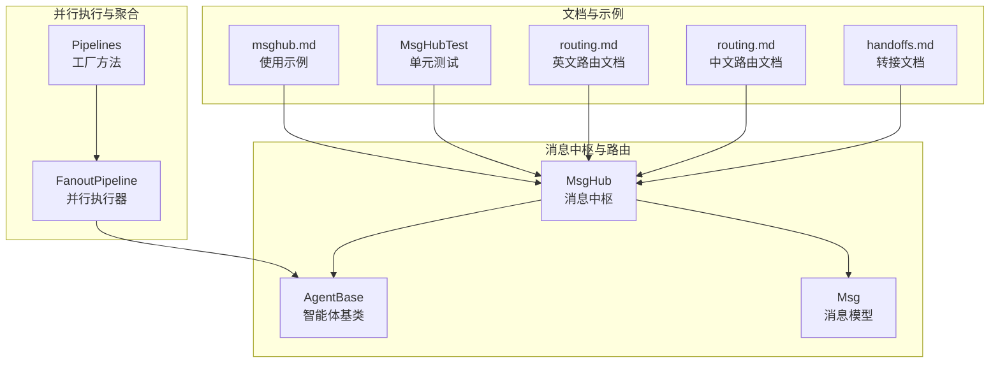
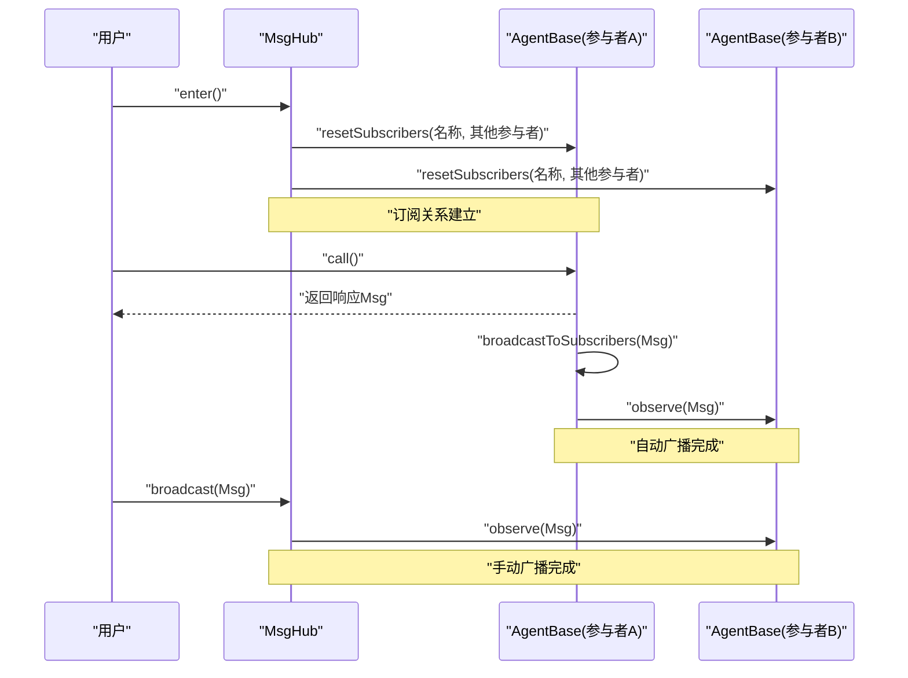
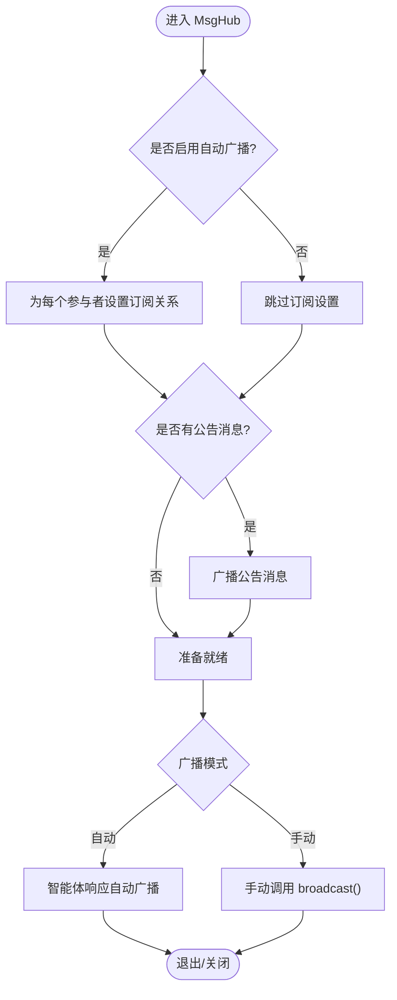
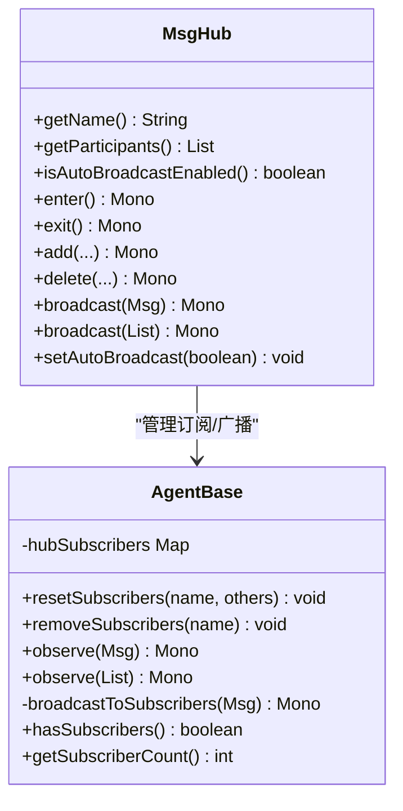
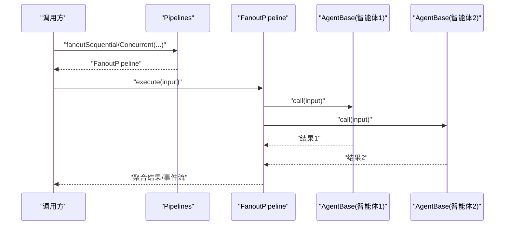
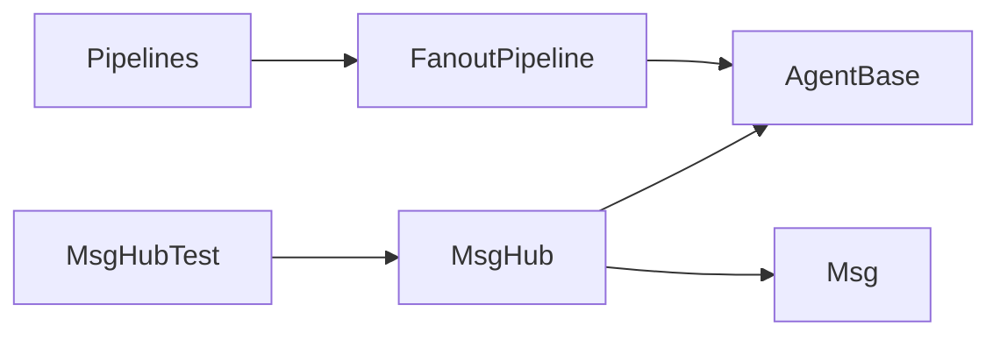

# 消息路由与中枢

<cite>
**本文引用的文件**
- [MsgHub.java](file://agentscope-core/src/main/java/io/agentscope/core/pipeline/MsgHub.java)
- [AgentBase.java](file://agentscope-core/src/main/java/io/agentscope/core/agent/AgentBase.java)
- [Msg.java](file://agentscope-core/src/main/java/io/agentscope/core/message/Msg.java)
- [FanoutPipeline.java](file://agentscope-core/src/main/java/io/agentscope/core/pipeline/FanoutPipeline.java)
- [Pipelines.java](file://agentscope-core/src/main/java/io/agentscope/core/pipeline/Pipelines.java)
- [msghub.md](file://docs/en/task/msghub.md)
- [MsgHubTest.java](file://agentscope-core/src/test/java/io/agentscope/core/pipeline/MsgHubTest.java)
- [routing.md](file://docs/en/multi-agent/routing.md)
- [routing.md](file://docs/zh/multi-agent/routing.md)
- [handoffs.md](file://docs/en/multi-agent/handoffs.md)
- [CompositeAgentException.java](file://agentscope-core/src/main/java/io/agentscope/core/exception/CompositeAgentException.java)
</cite>

## 目录
1. [简介](#简介)
2. [项目结构](#项目结构)
3. [核心组件](#核心组件)
4. [架构总览](#架构总览)
5. [详细组件分析](#详细组件分析)
6. [依赖关系分析](#依赖关系分析)
7. [性能考量](#性能考量)
8. [故障排查指南](#故障排查指南)
9. [结论](#结论)
10. [附录](#附录)

## 简介
本技术文档聚焦于 AgentScope Java 的消息路由与中枢系统，围绕 MsgHub 的设计与实现，系统阐述消息分发策略、订阅模式、动态参与者管理、自动广播与手动广播、生命周期管理、并发执行与错误聚合等关键能力。同时结合消息模型 Msg、并行执行管道 FanoutPipeline 与工具集 Pipelines，给出消息中枢在多智能体协作中的聚合、去重与转发机制，并提供可操作的配置与扩展建议，覆盖性能优化（缓存、批量、异步）、可靠性保障（异常聚合、可观测性）与监控告警思路。

## 项目结构
与消息路由与中枢相关的关键模块与文件如下：
- 消息中枢与路由：MsgHub（消息中枢）、AgentBase（智能体基类，包含订阅与广播）、Msg（消息模型）
- 并行执行与聚合：FanoutPipeline（并行/串行执行器）、Pipelines（并行/串行工厂方法）
- 文档与示例：msghub.md（使用示例）、MsgHubTest（单元测试）
- 多智能体路由与转接：routing.md（路由图）、handoffs.md（转接）

**图表来源**
- [MsgHub.java:32-99](file://agentscope-core/src/main/java/io/agentscope/core/pipeline/MsgHub.java#L32-L99)
- [AgentBase.java:780-826](file://agentscope-core/src/main/java/io/agentscope/core/agent/AgentBase.java#L780-L826)
- [Msg.java:38-51](file://agentscope-core/src/main/java/io/agentscope/core/message/Msg.java#L38-L51)
- [FanoutPipeline.java:31-48](file://agentscope-core/src/main/java/io/agentscope/core/pipeline/FanoutPipeline.java#L31-L48)
- [Pipelines.java:133-233](file://agentscope-core/src/main/java/io/agentscope/core/pipeline/Pipelines.java#L133-L233)
- [msghub.md:42-117](file://docs/en/task/msghub.md#L42-L117)
- [MsgHubTest.java:42-97](file://agentscope-core/src/test/java/io/agentscope/core/pipeline/MsgHubTest.java#L42-L97)
- [routing.md:27-36](file://docs/en/multi-agent/routing.md#L27-L36)
- [routing.md:76-107](file://docs/zh/multi-agent/routing.md#L76-L107)
- [handoffs.md:163-189](file://docs/en/multi-agent/handoffs.md#L163-L189)

**章节来源**
- [MsgHub.java:32-99](file://agentscope-core/src/main/java/io/agentscope/core/pipeline/MsgHub.java#L32-L99)
- [msghub.md:42-117](file://docs/en/task/msghub.md#L42-L117)

## 核心组件
- MsgHub：多智能体消息中枢，负责自动/手动广播、动态参与者管理、生命周期管理（enter/exit/close）、公告消息广播。
- AgentBase：智能体基类，维护订阅者映射 hubSubscribers，提供 observe/doObserve、广播到订阅者的内部方法 broadcastToSubscribers。
- Msg：消息模型，包含角色、内容块、元数据、时间戳等，支持结构化数据提取与生成原因标记。
- FanoutPipeline：并行/串行执行多个智能体，收集结果并进行异常聚合，支持事件流合并/串联。
- Pipelines：并行/串行执行器工厂方法，简化 fanout 与顺序执行的使用。

**章节来源**
- [MsgHub.java:100-434](file://agentscope-core/src/main/java/io/agentscope/core/pipeline/MsgHub.java#L100-L434)
- [AgentBase.java:780-841](file://agentscope-core/src/main/java/io/agentscope/core/agent/AgentBase.java#L780-L841)
- [Msg.java:38-173](file://agentscope-core/src/main/java/io/agentscope/core/message/Msg.java#L38-L173)
- [FanoutPipeline.java:49-230](file://agentscope-core/src/main/java/io/agentscope/core/pipeline/FanoutPipeline.java#L49-L230)
- [Pipelines.java:133-233](file://agentscope-core/src/main/java/io/agentscope/core/pipeline/Pipelines.java#L133-L233)

## 架构总览
消息中枢通过订阅-发布模型实现自动广播：当 MsgHub 启动时，为每个参与者设置订阅关系；当启用自动广播时，智能体每次调用后的响应会自动广播给所有订阅者；用户也可禁用自动广播，改为手动广播以精细控制消息流向。

**图表来源**
- [MsgHub.java:158-171](file://agentscope-core/src/main/java/io/agentscope/core/pipeline/MsgHub.java#L158-L171)
- [MsgHub.java:323-333](file://agentscope-core/src/main/java/io/agentscope/core/pipeline/MsgHub.java#L323-L333)
- [AgentBase.java:806-814](file://agentscope-core/src/main/java/io/agentscope/core/agent/AgentBase.java#L806-L814)

## 详细组件分析

### MsgHub 组件分析
- 自动广播与手动广播
  - 启用自动广播时，进入 hub 后为每个参与者设置订阅关系；智能体每次调用后会自动广播响应。
  - 禁用自动广播时，仅作为手动广播器，需显式调用 broadcast 或 broadcast 列表。
- 动态参与者管理
  - 支持运行中添加/删除参与者；添加/删除后会按需重置订阅关系。
- 生命周期管理
  - enter() 初始化订阅与公告广播；exit()/close() 清理订阅关系。
- 公告消息
  - 支持在进入时广播一组初始消息（如系统介绍）。

**图表来源**
- [MsgHub.java:158-171](file://agentscope-core/src/main/java/io/agentscope/core/pipeline/MsgHub.java#L158-L171)
- [MsgHub.java:282-295](file://agentscope-core/src/main/java/io/agentscope/core/pipeline/MsgHub.java#L282-L295)
- [MsgHub.java:323-333](file://agentscope-core/src/main/java/io/agentscope/core/pipeline/MsgHub.java#L323-L333)

**章节来源**
- [MsgHub.java:149-317](file://agentscope-core/src/main/java/io/agentscope/core/pipeline/MsgHub.java#L149-L317)
- [MsgHubTest.java:73-145](file://agentscope-core/src/test/java/io/agentscope/core/pipeline/MsgHubTest.java#L73-L145)

### AgentBase 组件分析
- 订阅与观察
  - resetSubscribers(name, others)：为指定 hub 名称设置订阅列表。
  - removeSubscribers(name)：移除指定 hub 的订阅。
  - broadcastToSubscribers(msg)：向所有订阅者广播消息。
  - observe/doObserve：对外公开 observe 接口，内部委托 doObserve 执行。
- 订阅统计
  - hasSubscribers/getSubscriberCount：判断是否存在订阅者及统计总数。

**图表来源**
- [MsgHub.java:104-120](file://agentscope-core/src/main/java/io/agentscope/core/pipeline/MsgHub.java#L104-L120)
- [AgentBase.java:780-841](file://agentscope-core/src/main/java/io/agentscope/core/agent/AgentBase.java#L780-L841)

**章节来源**
- [AgentBase.java:780-841](file://agentscope-core/src/main/java/io/agentscope/core/agent/AgentBase.java#L780-L841)

### 消息模型 Msg 分析
- 角色与内容块
  - 支持多种内容块类型（文本、图像、音频、视频、思考、工具调用/结果等）。
- 元数据与结构化数据
  - 提供结构化输出提取接口，支持强类型与动态 Map。
- 生成原因与用量统计
  - 支持生成原因标记与用量统计字段访问。

**章节来源**
- [Msg.java:38-173](file://agentscope-core/src/main/java/io/agentscope/core/message/Msg.java#L38-L173)
- [Msg.java:243-350](file://agentscope-core/src/main/java/io/agentscope/core/message/Msg.java#L243-L350)

### 并行执行与聚合：FanoutPipeline 与 Pipelines
- FanoutPipeline
  - 并行/串行执行多个智能体，对每个智能体的调用进行隔离与错误聚合。
  - 支持事件流的并发合并与顺序串联。
- Pipelines 工厂方法
  - 提供 fanoutSequential/fanoutConcurrent 的便捷入口，简化使用。

**图表来源**
- [Pipelines.java:133-233](file://agentscope-core/src/main/java/io/agentscope/core/pipeline/Pipelines.java#L133-L233)
- [FanoutPipeline.java:100-112](file://agentscope-core/src/main/java/io/agentscope/core/pipeline/FanoutPipeline.java#L100-L112)
- [FanoutPipeline.java:272-282](file://agentscope-core/src/main/java/io/agentscope/core/pipeline/FanoutPipeline.java#L272-L282)

**章节来源**
- [Pipelines.java:133-233](file://agentscope-core/src/main/java/io/agentscope/core/pipeline/Pipelines.java#L133-L233)
- [FanoutPipeline.java:49-230](file://agentscope-core/src/main/java/io/agentscope/core/pipeline/FanoutPipeline.java#L49-L230)

### 多智能体协作中的消息中枢
- 聚合与去重
  - 通过订阅者集合 hubSubscribers 维护广播目标，避免重复广播。
- 转发机制
  - 智能体响应经由 broadcastToSubscribers 转发至其他订阅者，形成环形广播网络。
- 路由与转接
  - routing.md 与 handoffs.md 展示了基于状态图的路由与转接，可与 MsgHub 协同实现更复杂的协作流程。

**章节来源**
- [AgentBase.java:806-814](file://agentscope-core/src/main/java/io/agentscope/core/agent/AgentBase.java#L806-L814)
- [routing.md:27-36](file://docs/en/multi-agent/routing.md#L27-L36)
- [routing.md:76-107](file://docs/zh/multi-agent/routing.md#L76-L107)
- [handoffs.md:163-189](file://docs/en/multi-agent/handoffs.md#L163-L189)

## 依赖关系分析
- MsgHub 依赖 AgentBase 的订阅管理与观察接口，依赖 Msg 的消息结构。
- FanoutPipeline 依赖 AgentBase 的 call/stream 能力，依赖 Pipelines 的工厂方法。
- 测试用例 MsgHubTest 验证 MsgHub 的广播、订阅、动态参与者与生命周期行为。

**图表来源**
- [MsgHub.java:18-30](file://agentscope-core/src/main/java/io/agentscope/core/pipeline/MsgHub.java#L18-L30)
- [AgentBase.java:18-28](file://agentscope-core/src/main/java/io/agentscope/core/agent/AgentBase.java#L18-L28)
- [FanoutPipeline.java:18-29](file://agentscope-core/src/main/java/io/agentscope/core/pipeline/FanoutPipeline.java#L18-L29)
- [Pipelines.java:133-233](file://agentscope-core/src/main/java/io/agentscope/core/pipeline/Pipelines.java#L133-L233)
- [MsgHubTest.java:30-40](file://agentscope-core/src/test/java/io/agentscope/core/pipeline/MsgHubTest.java#L30-L40)

**章节来源**
- [MsgHub.java:18-30](file://agentscope-core/src/main/java/io/agentscope/core/pipeline/MsgHub.java#L18-L30)
- [AgentBase.java:18-28](file://agentscope-core/src/main/java/io/agentscope/core/agent/AgentBase.java#L18-L28)
- [FanoutPipeline.java:18-29](file://agentscope-core/src/main/java/io/agentscope/core/pipeline/FanoutPipeline.java#L18-L29)
- [Pipelines.java:133-233](file://agentscope-core/src/main/java/io/agentscope/core/pipeline/Pipelines.java#L133-L233)
- [MsgHubTest.java:30-40](file://agentscope-core/src/test/java/io/agentscope/core/pipeline/MsgHubTest.java#L30-L40)

## 性能考量
- 缓存机制
  - 在智能体侧缓存模型响应与中间结果，减少重复计算与外部调用开销。
- 批量处理
  - 使用 FanoutPipeline 的并行执行与事件流合并，提升吞吐；对高频小消息可考虑批量化传输（需结合具体传输层）。
- 异步路由
  - 通过 Reactor 的 Mono/Flux 异步模型实现非阻塞广播与观察；合理配置调度器（如 boundedElastic）以平衡 CPU 与 I/O。
- 并发与线程安全
  - MsgHub 使用 CopyOnWriteArrayList 管理参与者，避免并发修改；但不建议并发调用同一智能体实例。
- 错误聚合与恢复
  - FanoutPipeline 对失败智能体进行异常信息收集与聚合，避免部分失败影响整体流程。

**章节来源**
- [MsgHub.java:92-95](file://agentscope-core/src/main/java/io/agentscope/core/pipeline/MsgHub.java#L92-L95)
- [FanoutPipeline.java:127-169](file://agentscope-core/src/main/java/io/agentscope/core/pipeline/FanoutPipeline.java#L127-L169)
- [CompositeAgentException.java:40-84](file://agentscope-core/src/main/java/io/agentscope/core/exception/CompositeAgentException.java#L40-L84)

## 故障排查指南
- 常见问题
  - 未启用自动广播导致消息未被其他参与者接收：检查 setAutoBroadcast 与 resetSubscribers 调用。
  - 动态添加/删除参与者后未生效：确认在 enter() 之后再进行 add/delete，或确保 resetSubscribers 已触发。
  - 空参与者列表：构建 MsgHub 时必须至少有一个参与者。
- 单元测试参考
  - 通过 MsgHubTest 验证公告广播、手动广播、订阅清理、生命周期管理、动态参与者与自动广播切换等行为。

**章节来源**
- [MsgHubTest.java:73-145](file://agentscope-core/src/test/java/io/agentscope/core/pipeline/MsgHubTest.java#L73-L145)
- [MsgHubTest.java:187-269](file://agentscope-core/src/test/java/io/agentscope/core/pipeline/MsgHubTest.java#L187-L269)
- [MsgHubTest.java:301-325](file://agentscope-core/src/test/java/io/agentscope/core/pipeline/MsgHubTest.java#L301-L325)

## 结论
MsgHub 通过订阅-发布模型实现了多智能体间的高效消息分发，结合 AgentBase 的订阅管理与广播机制，提供了自动/手动双模式广播、动态参与者管理与生命周期管理。配合 FanoutPipeline 的并行执行与错误聚合，可在复杂多智能体协作场景中实现高吞吐、可观测且可靠的通信中枢。结合路由与转接文档，可进一步扩展为具备状态驱动与条件路由的智能协作系统。

## 附录
- 快速开始与示例
  - 参考 msghub.md 中的基本用法与手动广播示例，快速搭建多智能体对话与协作。
- 路由与转接
  - 参考 routing.md 与 handoffs.md，了解基于状态图的路由与转接实现方式，便于与 MsgHub 协同构建复杂工作流。

**章节来源**
- [msghub.md:42-117](file://docs/en/task/msghub.md#L42-L117)
- [msghub.md:192-251](file://docs/en/task/msghub.md#L192-L251)
- [routing.md:27-36](file://docs/en/multi-agent/routing.md#L27-L36)
- [routing.md:76-107](file://docs/zh/multi-agent/routing.md#L76-L107)
- [handoffs.md:163-189](file://docs/en/multi-agent/handoffs.md#L163-L189)