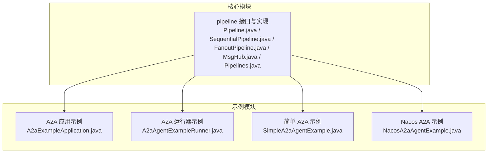
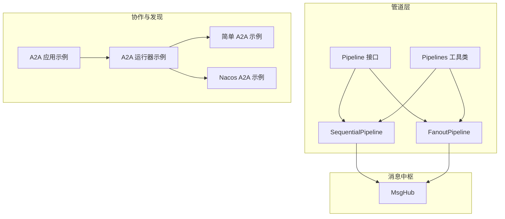
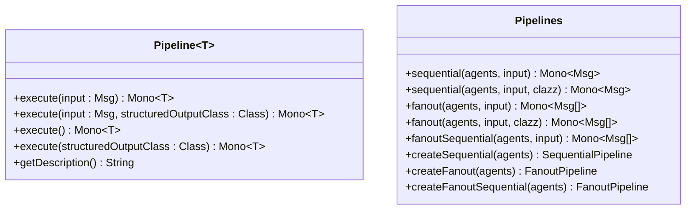
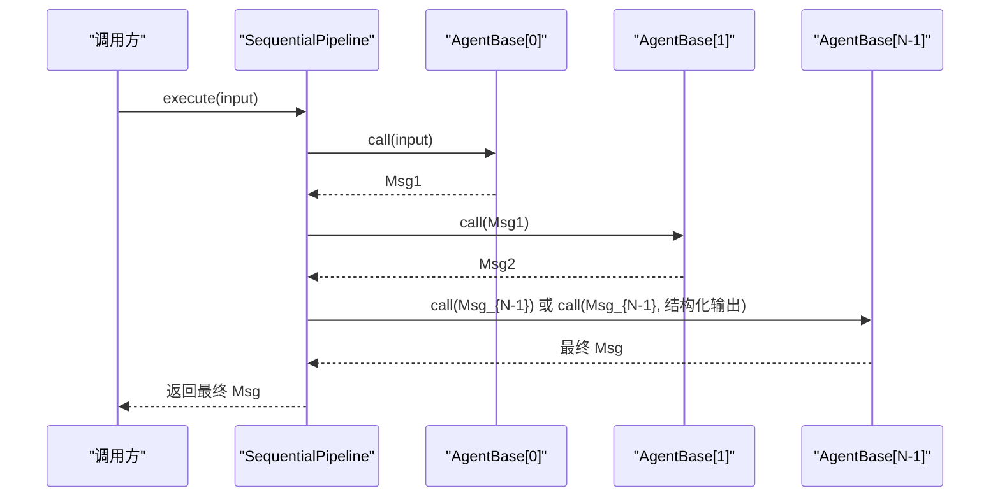
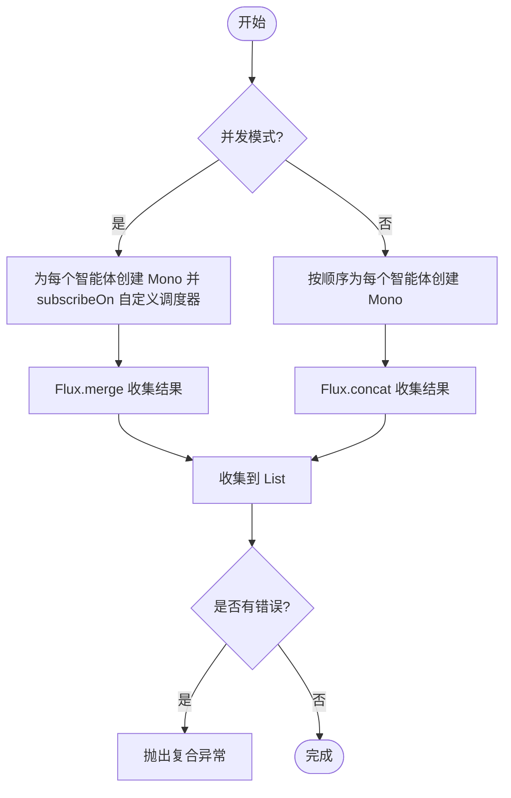
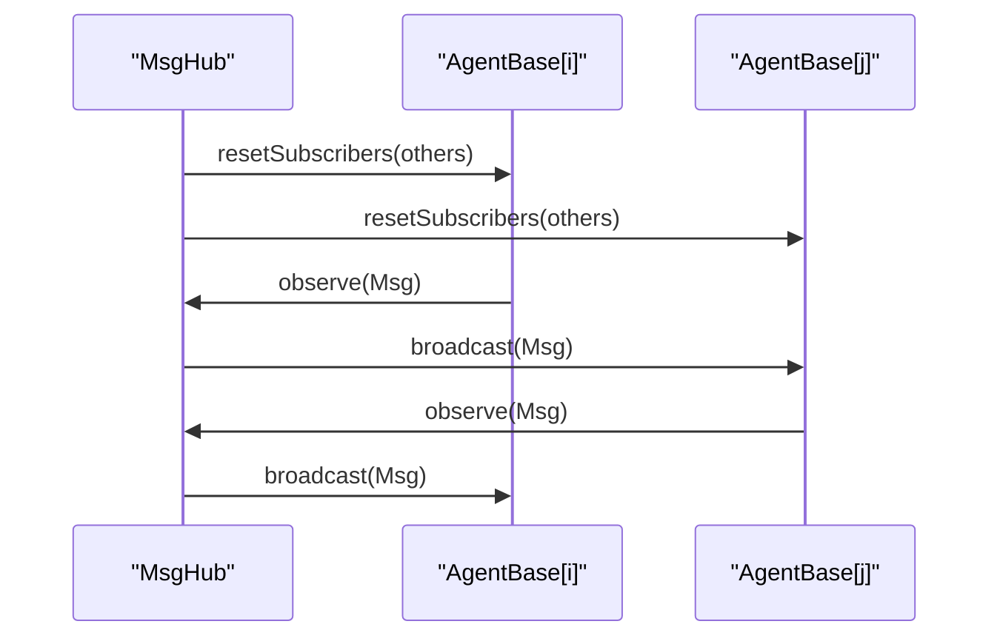
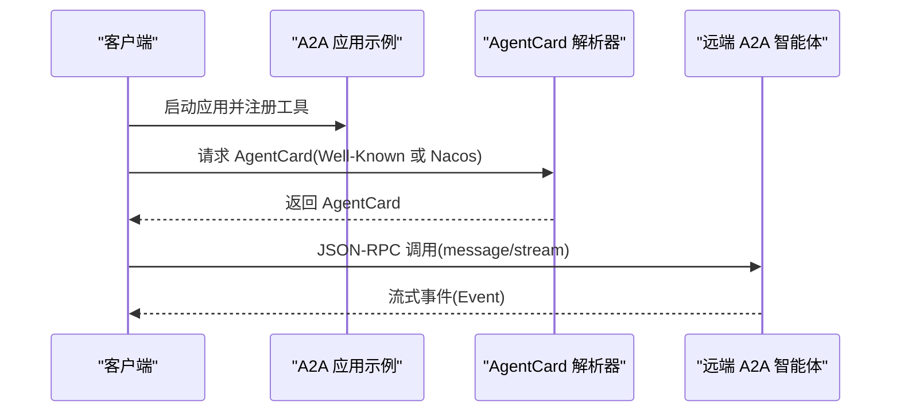
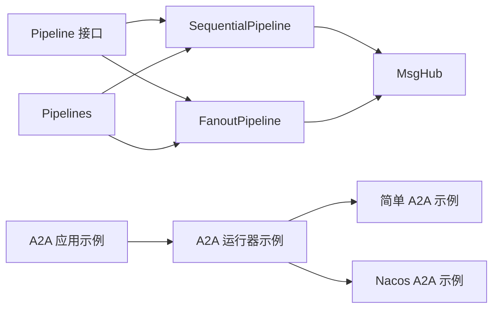

# 管道与协作

<cite>
**本文引用的文件**   
- [agentscope-core/src/main/java/io/agentscope/core/pipeline/Pipeline.java](file://agentscope-core/src/main/java/io/agentscope/core/pipeline/Pipeline.java)
- [agentscope-core/src/main/java/io/agentscope/core/pipeline/SequentialPipeline.java](file://agentscope-core/src/main/java/io/agentscope/core/pipeline/SequentialPipeline.java)
- [agentscope-core/src/main/java/io/agentscope/core/pipeline/FanoutPipeline.java](file://agentscope-core/src/main/java/io/agentscope/core/pipeline/FanoutPipeline.java)
- [agentscope-core/src/main/java/io/agentscope/core/pipeline/MsgHub.java](file://agentscope-core/src/main/java/io/agentscope/core/pipeline/MsgHub.java)
- [agentscope-core/src/main/java/io/agentscope/core/pipeline/Pipelines.java](file://agentscope-core/src/main/java/io/agentscope/core/pipeline/Pipelines.java)
- [agentscope-examples/a2a/src/main/java/io/agentscope/examples/a2a/A2aExampleApplication.java](file://agentscope-examples/a2a/src/main/java/io/agentscope/examples/a2a/A2aExampleApplication.java)
- [agentscope-examples/a2a/src/main/java/io/agentscope/examples/a2a/SimpleA2aAgentExample.java](file://agentscope-examples/a2a/src/main/java/io/agentscope/examples/a2a/SimpleA2aAgentExample.java)
- [agentscope-examples/a2a/src/main/java/io/agentscope/examples/a2a/NacosA2aAgentExample.java](file://agentscope-examples/a2a/src/main/java/io/agentscope/examples/a2a/NacosA2aAgentExample.java)
- [agentscope-examples/a2a/src/main/java/io/agentscope/examples/a2a/A2aAgentExampleRunner.java](file://agentscope-examples/a2a/src/main/java/io/agentscope/examples/a2a/A2aAgentExampleRunner.java)
</cite>

## 目录
1. [引言](#引言)
2. [项目结构](#项目结构)
3. [核心组件](#核心组件)
4. [架构总览](#架构总览)
5. [组件详解](#组件详解)
6. [依赖关系分析](#依赖关系分析)
7. [性能考量](#性能考量)
8. [故障排查指南](#故障排查指南)
9. [结论](#结论)
10. [附录：示例与最佳实践](#附录示例与最佳实践)

## 引言
本技术文档围绕 AgentScope 的“管道与协作”体系展开，系统性阐述管道系统的理念、执行模型与调度策略；深入解析顺序管道（SequentialPipeline）与分支管道（FanoutPipeline）的实现原理与适用场景；阐明消息中枢（MsgHub）在多智能体对话中的广播与订阅机制；解释 A2A 协议与智能体发现、服务注册在多智能体协作中的作用；并给出管道配置的最佳实践（性能调优、错误处理、可观测性），以及在分布式环境下的一致性与协调机制建议。

## 项目结构
本仓库采用模块化组织，核心逻辑集中在 agentscope-core 模块的 pipeline 包中，示例位于 agentscope-examples 下的 a2a、multiagent-patterns 等子模块。与本文相关的关键目录与文件如下：
- 核心管道接口与实现：agentscope-core/src/main/java/io/agentscope/core/pipeline
- 示例应用与 A2A 集成：agentscope-examples/a2a

**图表来源**
- [agentscope-core/src/main/java/io/agentscope/core/pipeline/Pipeline.java:1-76](file://agentscope-core/src/main/java/io/agentscope/core/pipeline/Pipeline.java#L1-L76)
- [agentscope-core/src/main/java/io/agentscope/core/pipeline/SequentialPipeline.java:1-186](file://agentscope-core/src/main/java/io/agentscope/core/pipeline/SequentialPipeline.java#L1-L186)
- [agentscope-core/src/main/java/io/agentscope/core/pipeline/FanoutPipeline.java:1-458](file://agentscope-core/src/main/java/io/agentscope/core/pipeline/FanoutPipeline.java#L1-L458)
- [agentscope-core/src/main/java/io/agentscope/core/pipeline/MsgHub.java:1-435](file://agentscope-core/src/main/java/io/agentscope/core/pipeline/MsgHub.java#L1-L435)
- [agentscope-core/src/main/java/io/agentscope/core/pipeline/Pipelines.java:1-253](file://agentscope-core/src/main/java/io/agentscope/core/pipeline/Pipelines.java#L1-L253)
- [agentscope-examples/a2a/src/main/java/io/agentscope/examples/a2a/A2aExampleApplication.java:1-93](file://agentscope-examples/a2a/src/main/java/io/agentscope/examples/a2a/A2aExampleApplication.java#L1-L93)
- [agentscope-examples/a2a/src/main/java/io/agentscope/examples/a2a/A2aAgentExampleRunner.java:1-102](file://agentscope-examples/a2a/src/main/java/io/agentscope/examples/a2a/A2aAgentExampleRunner.java#L1-L102)
- [agentscope-examples/a2a/src/main/java/io/agentscope/examples/a2a/SimpleA2aAgentExample.java:1-45](file://agentscope-examples/a2a/src/main/java/io/agentscope/examples/a2a/SimpleA2aAgentExample.java#L1-L45)
- [agentscope-examples/a2a/src/main/java/io/agentscope/examples/a2a/NacosA2aAgentExample.java:1-69](file://agentscope-examples/a2a/src/main/java/io/agentscope/examples/a2a/NacosA2aAgentExample.java#L1-L69)

**章节来源**
- [agentscope-core/src/main/java/io/agentscope/core/pipeline/Pipeline.java:1-76](file://agentscope-core/src/main/java/io/agentscope/core/pipeline/Pipeline.java#L1-L76)
- [agentscope-core/src/main/java/io/agentscope/core/pipeline/SequentialPipeline.java:1-186](file://agentscope-core/src/main/java/io/agentscope/core/pipeline/SequentialPipeline.java#L1-L186)
- [agentscope-core/src/main/java/io/agentscope/core/pipeline/FanoutPipeline.java:1-458](file://agentscope-core/src/main/java/io/agentscope/core/pipeline/FanoutPipeline.java#L1-L458)
- [agentscope-core/src/main/java/io/agentscope/core/pipeline/MsgHub.java:1-435](file://agentscope-core/src/main/java/io/agentscope/core/pipeline/MsgHub.java#L1-L435)
- [agentscope-core/src/main/java/io/agentscope/core/pipeline/Pipelines.java:1-253](file://agentscope-core/src/main/java/io/agentscope/core/pipeline/Pipelines.java#L1-L253)

## 核心组件
- 管道接口与抽象：定义统一的执行契约，支持带/不带输入的执行，以及结构化输出能力。
- 顺序管道：按序串行执行多个智能体，前一个输出作为下一个输入，支持首尾节点的结构化输出差异化处理。
- 分支管道：将同一输入分发给多个智能体并行或串行执行，聚合结果；并发模式下具备弹性与容错能力。
- 消息中枢：自动广播与订阅管理，简化多智能体对话中的消息传播，支持动态参与者增删与生命周期管理。
- 工具类：提供函数式风格的便捷执行入口与可复用的管道构建器。

**章节来源**
- [agentscope-core/src/main/java/io/agentscope/core/pipeline/Pipeline.java:21-75](file://agentscope-core/src/main/java/io/agentscope/core/pipeline/Pipeline.java#L21-L75)
- [agentscope-core/src/main/java/io/agentscope/core/pipeline/SequentialPipeline.java:24-133](file://agentscope-core/src/main/java/io/agentscope/core/pipeline/SequentialPipeline.java#L24-L133)
- [agentscope-core/src/main/java/io/agentscope/core/pipeline/FanoutPipeline.java:31-355](file://agentscope-core/src/main/java/io/agentscope/core/pipeline/FanoutPipeline.java#L31-L355)
- [agentscope-core/src/main/java/io/agentscope/core/pipeline/MsgHub.java:32-333](file://agentscope-core/src/main/java/io/agentscope/core/pipeline/MsgHub.java#L32-L333)
- [agentscope-core/src/main/java/io/agentscope/core/pipeline/Pipelines.java:23-252](file://agentscope-core/src/main/java/io/agentscope/core/pipeline/Pipelines.java#L23-L252)

## 架构总览
AgentScope 的管道与协作以“消息驱动 + 响应式执行”为核心，通过管道编排智能体链路，借助消息中枢实现多智能体间的自动广播与订阅。A2A 协议与智能体发现（如 Nacos）为跨服务的智能体协作提供服务注册与定位能力。

**图表来源**
- [agentscope-core/src/main/java/io/agentscope/core/pipeline/Pipeline.java:21-75](file://agentscope-core/src/main/java/io/agentscope/core/pipeline/Pipeline.java#L21-L75)
- [agentscope-core/src/main/java/io/agentscope/core/pipeline/SequentialPipeline.java:24-133](file://agentscope-core/src/main/java/io/agentscope/core/pipeline/SequentialPipeline.java#L24-L133)
- [agentscope-core/src/main/java/io/agentscope/core/pipeline/FanoutPipeline.java:31-355](file://agentscope-core/src/main/java/io/agentscope/core/pipeline/FanoutPipeline.java#L31-L355)
- [agentscope-core/src/main/java/io/agentscope/core/pipeline/MsgHub.java:32-333](file://agentscope-core/src/main/java/io/agentscope/core/pipeline/MsgHub.java#L32-L333)
- [agentscope-core/src/main/java/io/agentscope/core/pipeline/Pipelines.java:23-252](file://agentscope-core/src/main/java/io/agentscope/core/pipeline/Pipelines.java#L23-L252)
- [agentscope-examples/a2a/src/main/java/io/agentscope/examples/a2a/A2aExampleApplication.java:25-75](file://agentscope-examples/a2a/src/main/java/io/agentscope/examples/a2a/A2aExampleApplication.java#L25-L75)
- [agentscope-examples/a2a/src/main/java/io/agentscope/examples/a2a/A2aAgentExampleRunner.java:28-100](file://agentscope-examples/a2a/src/main/java/io/agentscope/examples/a2a/A2aAgentExampleRunner.java#L28-L100)
- [agentscope-examples/a2a/src/main/java/io/agentscope/examples/a2a/SimpleA2aAgentExample.java:23-44](file://agentscope-examples/a2a/src/main/java/io/agentscope/examples/a2a/SimpleA2aAgentExample.java#L23-L44)
- [agentscope-examples/a2a/src/main/java/io/agentscope/examples/a2a/NacosA2aAgentExample.java:28-68](file://agentscope-examples/a2a/src/main/java/io/agentscope/examples/a2a/NacosA2aAgentExample.java#L28-L68)

## 组件详解

### 管道接口与工具类
- Pipeline 接口：定义 execute(Msg)、execute(Msg, Class)、默认无参 execute() 等方法，统一异步执行语义。
- Pipelines 工具类：提供函数式风格的顺序/分支执行入口，以及可复用的管道构建器，便于一次性使用与复用。

**图表来源**
- [agentscope-core/src/main/java/io/agentscope/core/pipeline/Pipeline.java:21-75](file://agentscope-core/src/main/java/io/agentscope/core/pipeline/Pipeline.java#L21-L75)
- [agentscope-core/src/main/java/io/agentscope/core/pipeline/Pipelines.java:23-252](file://agentscope-core/src/main/java/io/agentscope/core/pipeline/Pipelines.java#L23-L252)

**章节来源**
- [agentscope-core/src/main/java/io/agentscope/core/pipeline/Pipeline.java:21-75](file://agentscope-core/src/main/java/io/agentscope/core/pipeline/Pipeline.java#L21-L75)
- [agentscope-core/src/main/java/io/agentscope/core/pipeline/Pipelines.java:23-252](file://agentscope-core/src/main/java/io/agentscope/core/pipeline/Pipelines.java#L23-L252)

### 顺序管道（SequentialPipeline）
- 设计理念：链式编排，前一智能体输出即下一智能体输入，适合“推理—行动—反馈”的线性流程。
- 执行模型：
  - 单智能体：直接调用 call 或带结构化输出的 call。
  - 多智能体：前 N-1 使用普通 call，最后一个可选使用结构化输出 call。
- 调度策略：基于 Reactor 的 Mono 链式组合，保持响应式与背压友好。
- 错误处理：单个失败会阻断后续执行，需在上层进行重试或补偿。

**图表来源**
- [agentscope-core/src/main/java/io/agentscope/core/pipeline/SequentialPipeline.java:54-94](file://agentscope-core/src/main/java/io/agentscope/core/pipeline/SequentialPipeline.java#L54-L94)

**章节来源**
- [agentscope-core/src/main/java/io/agentscope/core/pipeline/SequentialPipeline.java:24-133](file://agentscope-core/src/main/java/io/agentscope/core/pipeline/SequentialPipeline.java#L24-L133)

### 分支管道（FanoutPipeline）
- 设计理念：将同一输入分发给多个智能体，支持并发或串行执行，聚合所有结果。
- 并发模式：
  - 使用有界弹性调度器（boundedElastic）在不同线程执行，提升吞吐。
  - 对每个智能体调用进行错误隔离，收集异常信息，最终以复合异常形式抛出。
- 串行模式：
  - 逐个独立执行，事件与结果按顺序聚合，适合需要严格时序的场景。
- 流式 API：支持事件流合并/拼接，便于实时观测与调试。

**图表来源**
- [agentscope-core/src/main/java/io/agentscope/core/pipeline/FanoutPipeline.java:104-189](file://agentscope-core/src/main/java/io/agentscope/core/pipeline/FanoutPipeline.java#L104-L189)

**章节来源**
- [agentscope-core/src/main/java/io/agentscope/core/pipeline/FanoutPipeline.java:31-355](file://agentscope-core/src/main/java/io/agentscope/core/pipeline/FanoutPipeline.java#L31-L355)

### 消息中枢（MsgHub）
- 自动广播：启用自动广播时，加入 Hub 的每个智能体都会订阅其他所有参与者的消息，彼此无需显式传递。
- 动态参与者：运行期可添加/移除智能体，Hub 会自动重建订阅关系。
- 生命周期管理：enter()/exit() 或 AutoCloseable 支持确保订阅关系正确建立与清理。
- 事件流：配合智能体的 observe() 机制，实现多智能体对话的自动传播。

**图表来源**
- [agentscope-core/src/main/java/io/agentscope/core/pipeline/MsgHub.java:158-333](file://agentscope-core/src/main/java/io/agentscope/core/pipeline/MsgHub.java#L158-L333)

**章节来源**
- [agentscope-core/src/main/java/io/agentscope/core/pipeline/MsgHub.java:32-333](file://agentscope-core/src/main/java/io/agentscope/core/pipeline/MsgHub.java#L32-L333)

### A2A 协议与智能体发现
- A2A 协议：通过标准 AgentCard 描述与 JSON-RPC 接口暴露智能体能力，支持远程调用与流式输出。
- 发现与注册：
  - 简单示例：通过 Well-Known AgentCard URI 定位远端智能体。
  - Nacos 注册：通过 Nacos 服务发现智能体卡片，实现动态注册与发现。
- 示例应用：A2A 应用示例展示了如何启动服务、注册工具，并通过 curl 或本地示例进行交互。

**图表来源**
- [agentscope-examples/a2a/src/main/java/io/agentscope/examples/a2a/A2aExampleApplication.java:25-75](file://agentscope-examples/a2a/src/main/java/io/agentscope/examples/a2a/A2aExampleApplication.java#L25-L75)
- [agentscope-examples/a2a/src/main/java/io/agentscope/examples/a2a/SimpleA2aAgentExample.java:23-44](file://agentscope-examples/a2a/src/main/java/io/agentscope/examples/a2a/SimpleA2aAgentExample.java#L23-L44)
- [agentscope-examples/a2a/src/main/java/io/agentscope/examples/a2a/NacosA2aAgentExample.java:28-68](file://agentscope-examples/a2a/src/main/java/io/agentscope/examples/a2a/NacosA2aAgentExample.java#L28-L68)
- [agentscope-examples/a2a/src/main/java/io/agentscope/examples/a2a/A2aAgentExampleRunner.java:49-100](file://agentscope-examples/a2a/src/main/java/io/agentscope/examples/a2a/A2aAgentExampleRunner.java#L49-L100)

**章节来源**
- [agentscope-examples/a2a/src/main/java/io/agentscope/examples/a2a/A2aExampleApplication.java:25-75](file://agentscope-examples/a2a/src/main/java/io/agentscope/examples/a2a/A2aExampleApplication.java#L25-L75)
- [agentscope-examples/a2a/src/main/java/io/agentscope/examples/a2a/SimpleA2aAgentExample.java:23-44](file://agentscope-examples/a2a/src/main/java/io/agentscope/examples/a2a/SimpleA2aAgentExample.java#L23-L44)
- [agentscope-examples/a2a/src/main/java/io/agentscope/examples/a2a/NacosA2aAgentExample.java:28-68](file://agentscope-examples/a2a/src/main/java/io/agentscope/examples/a2a/NacosA2aAgentExample.java#L28-L68)
- [agentscope-examples/a2a/src/main/java/io/agentscope/examples/a2a/A2aAgentExampleRunner.java:28-100](file://agentscope-examples/a2a/src/main/java/io/agentscope/examples/a2a/A2aAgentExampleRunner.java#L28-L100)

## 依赖关系分析
- 管道接口与实现：Pipeline 为顶层抽象，SequentialPipeline 与 FanoutPipeline 实现具体执行策略；Pipelines 提供便捷入口。
- 消息中枢：MsgHub 依赖智能体的 observe/resetSubscribers/removeSubscribers 等机制，实现自动广播与订阅管理。
- A2A 协作：A2A 应用示例与运行器示例依赖核心管道与消息中枢，实现远程智能体的发现、调用与流式输出。

**图表来源**
- [agentscope-core/src/main/java/io/agentscope/core/pipeline/Pipeline.java:21-75](file://agentscope-core/src/main/java/io/agentscope/core/pipeline/Pipeline.java#L21-L75)
- [agentscope-core/src/main/java/io/agentscope/core/pipeline/SequentialPipeline.java:24-133](file://agentscope-core/src/main/java/io/agentscope/core/pipeline/SequentialPipeline.java#L24-L133)
- [agentscope-core/src/main/java/io/agentscope/core/pipeline/FanoutPipeline.java:31-355](file://agentscope-core/src/main/java/io/agentscope/core/pipeline/FanoutPipeline.java#L31-L355)
- [agentscope-core/src/main/java/io/agentscope/core/pipeline/MsgHub.java:32-333](file://agentscope-core/src/main/java/io/agentscope/core/pipeline/MsgHub.java#L32-L333)
- [agentscope-core/src/main/java/io/agentscope/core/pipeline/Pipelines.java:23-252](file://agentscope-core/src/main/java/io/agentscope/core/pipeline/Pipelines.java#L23-L252)
- [agentscope-examples/a2a/src/main/java/io/agentscope/examples/a2a/A2aExampleApplication.java:25-75](file://agentscope-examples/a2a/src/main/java/io/agentscope/examples/a2a/A2aExampleApplication.java#L25-L75)
- [agentscope-examples/a2a/src/main/java/io/agentscope/examples/a2a/A2aAgentExampleRunner.java:28-100](file://agentscope-examples/a2a/src/main/java/io/agentscope/examples/a2a/A2aAgentExampleRunner.java#L28-L100)
- [agentscope-examples/a2a/src/main/java/io/agentscope/examples/a2a/SimpleA2aAgentExample.java:23-44](file://agentscope-examples/a2a/src/main/java/io/agentscope/examples/a2a/SimpleA2aAgentExample.java#L23-L44)
- [agentscope-examples/a2a/src/main/java/io/agentscope/examples/a2a/NacosA2aAgentExample.java:28-68](file://agentscope-examples/a2a/src/main/java/io/agentscope/examples/a2a/NacosA2aAgentExample.java#L28-L68)

**章节来源**
- [agentscope-core/src/main/java/io/agentscope/core/pipeline/Pipeline.java:21-75](file://agentscope-core/src/main/java/io/agentscope/core/pipeline/Pipeline.java#L21-L75)
- [agentscope-core/src/main/java/io/agentscope/core/pipeline/SequentialPipeline.java:24-133](file://agentscope-core/src/main/java/io/agentscope/core/pipeline/SequentialPipeline.java#L24-L133)
- [agentscope-core/src/main/java/io/agentscope/core/pipeline/FanoutPipeline.java:31-355](file://agentscope-core/src/main/java/io/agentscope/core/pipeline/FanoutPipeline.java#L31-L355)
- [agentscope-core/src/main/java/io/agentscope/core/pipeline/MsgHub.java:32-333](file://agentscope-core/src/main/java/io/agentscope/core/pipeline/MsgHub.java#L32-L333)
- [agentscope-core/src/main/java/io/agentscope/core/pipeline/Pipelines.java:23-252](file://agentscope-core/src/main/java/io/agentscope/core/pipeline/Pipelines.java#L23-L252)

## 性能考量
- 并发与调度
  - FanoutPipeline 默认使用有界弹性调度器（boundedElastic），适合 I/O 密集型请求（如大模型 API）。可根据工作负载调整自定义调度器。
  - SequentialPipeline 保持串行链路，避免上下文切换开销，适合对时序敏感的任务。
- 资源与内存
  - 并发模式下注意控制并发度，避免过多线程导致上下文切换与资源争用。
  - 使用结构化输出时，仅在必要节点启用，减少序列化与反序列化成本。
- 错误与恢复
  - 并发模式下采用错误隔离与聚合，建议在上层结合熔断与重试策略。
  - 串行模式下建议在每个智能体内部做好幂等与超时控制。
- 观测性
  - 利用流式事件（stream）进行实时观测，结合日志与指标采集，定位瓶颈与异常。

[本节为通用指导，无需特定文件引用]

## 故障排查指南
- 并发执行异常
  - 现象：部分智能体失败，整体报复合异常。
  - 处理：检查每个智能体的错误信息（AgentExceptionInfo），定位失败原因；必要时降级为串行模式验证问题。
- 订阅关系异常
  - 现象：消息未被广播或接收不到回音。
  - 处理：确认 MsgHub 已 enter()，且自动广播已启用；检查 resetSubscribers 是否正确执行。
- A2A 远程调用
  - 现象：AgentCard 获取失败或 JSON-RPC 调用超时。
  - 处理：核对 Well-Known URI 或 Nacos 配置；检查网络连通与鉴权参数；查看流式事件是否正常到达。

**章节来源**
- [agentscope-core/src/main/java/io/agentscope/core/pipeline/FanoutPipeline.java:127-169](file://agentscope-core/src/main/java/io/agentscope/core/pipeline/FanoutPipeline.java#L127-L169)
- [agentscope-core/src/main/java/io/agentscope/core/pipeline/MsgHub.java:158-333](file://agentscope-core/src/main/java/io/agentscope/core/pipeline/MsgHub.java#L158-L333)
- [agentscope-examples/a2a/src/main/java/io/agentscope/examples/a2a/A2aExampleApplication.java:64-74](file://agentscope-examples/a2a/src/main/java/io/agentscope/examples/a2a/A2aExampleApplication.java#L64-L74)

## 结论
AgentScope 的管道与协作体系以“消息驱动 + 响应式执行”为核心，通过顺序与分支管道实现灵活的智能体编排，借助消息中枢简化多智能体对话的传播与订阅，结合 A2A 协议与智能体发现实现跨服务的协作。在工程实践中，应根据任务特性选择合适的执行模式，合理配置并发与调度，完善错误处理与可观测性，以获得稳定、高效、可扩展的多智能体系统。

[本节为总结，无需特定文件引用]

## 附录：示例与最佳实践

### 管道配置最佳实践
- 顺序管道
  - 适用：推理—行动—反馈的线性流程；仅在最后一个节点启用结构化输出。
  - 建议：为每个智能体设置合理的超时与重试策略；在上层捕获并记录中间状态。
- 分支管道
  - 并发模式：适用于 I/O 密集型任务；控制并发度，避免资源争用；启用错误聚合与告警。
  - 串行模式：适用于需要严格顺序的场景；关注延迟累积，必要时拆分为多个阶段。
- 消息中枢
  - 动态参与者：在运行期增删参与者时，确保重新 resetSubscribers；使用 try-with-resources 管理生命周期。
  - 自动广播：默认开启，便于多智能体对话；如需手动控制，可关闭后使用 broadcast()。

**章节来源**
- [agentscope-core/src/main/java/io/agentscope/core/pipeline/SequentialPipeline.java:76-94](file://agentscope-core/src/main/java/io/agentscope/core/pipeline/SequentialPipeline.java#L76-L94)
- [agentscope-core/src/main/java/io/agentscope/core/pipeline/FanoutPipeline.java:109-189](file://agentscope-core/src/main/java/io/agentscope/core/pipeline/FanoutPipeline.java#L109-L189)
- [agentscope-core/src/main/java/io/agentscope/core/pipeline/MsgHub.java:158-333](file://agentscope-core/src/main/java/io/agentscope/core/pipeline/MsgHub.java#L158-L333)

### A2A 协作与服务注册
- 简单 A2A：通过 Well-Known AgentCard URI 定位远端智能体，适合本地或内网服务。
- Nacos A2A：通过 Nacos 服务发现智能体卡片，适合生产环境的动态注册与发现。
- 示例应用：启动应用、注册工具、发起 JSON-RPC 调用与流式输出。

**章节来源**
- [agentscope-examples/a2a/src/main/java/io/agentscope/examples/a2a/A2aExampleApplication.java:25-75](file://agentscope-examples/a2a/src/main/java/io/agentscope/examples/a2a/A2aExampleApplication.java#L25-L75)
- [agentscope-examples/a2a/src/main/java/io/agentscope/examples/a2a/SimpleA2aAgentExample.java:23-44](file://agentscope-examples/a2a/src/main/java/io/agentscope/examples/a2a/SimpleA2aAgentExample.java#L23-L44)
- [agentscope-examples/a2a/src/main/java/io/agentscope/examples/a2a/NacosA2aAgentExample.java:28-68](file://agentscope-examples/a2a/src/main/java/io/agentscope/examples/a2a/NacosA2aAgentExample.java#L28-L68)
- [agentscope-examples/a2a/src/main/java/io/agentscope/examples/a2a/A2aAgentExampleRunner.java:49-100](file://agentscope-examples/a2a/src/main/java/io/agentscope/examples/a2a/A2aAgentExampleRunner.java#L49-L100)

### 管道组合与复用
- 可通过 Pipelines 工具类创建可复用的顺序/分支管道，并在需要时进行组合，形成更复杂的编排。
- 组合顺序管道时，仅最后一个管道使用结构化输出，确保数据形态一致。

**章节来源**
- [agentscope-core/src/main/java/io/agentscope/core/pipeline/Pipelines.java:188-252](file://agentscope-core/src/main/java/io/agentscope/core/pipeline/Pipelines.java#L188-L252)